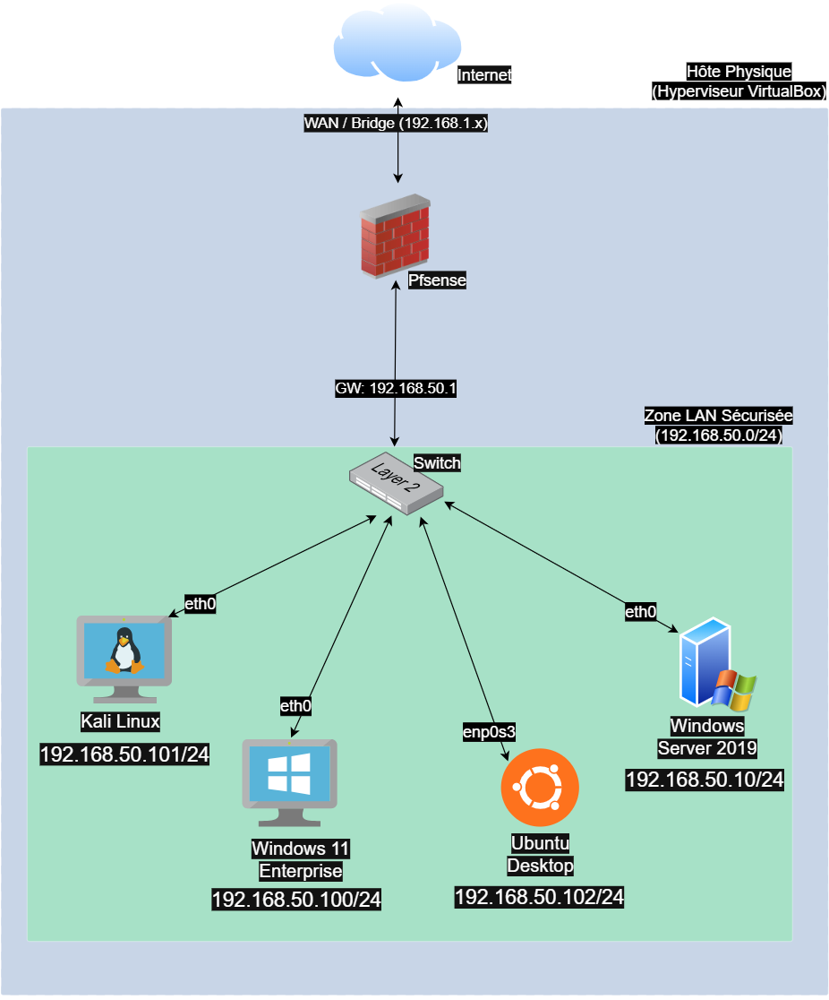

# 🛡️ Home Lab SOC - Infrastructure & Déploiement

## 📖 Introduction

Ce document détaille l'architecture, la configuration et la mise en place de mon laboratoire de cybersécurité (Home Lab). L'objectif de cette infrastructure est de simuler un environnement d'entreprise réaliste (réseau segmenté) pour pratiquer des scénarios d'attaque (Red Team) et de défense/analyse (Blue Team).

L'infrastructure est entièrement virtualisée sous **Oracle VirtualBox**, avec **pfSense** agissant comme pare-feu et routeur central.

---

## 1. Architecture & Topologie Réseau

Le réseau est isolé de l'hôte physique grâce à une segmentation stricte via un commutateur virtuel (Internal Network). Seul le pare-feu pfSense possède une interface pointée vers l'extérieur (WAN) pour l'accès Internet.

### 🗺️ Schéma Logique

### 🌐 Plages d'Adresses IP (CIDR)

* **Réseau LAN Lab :** `192.168.50.0/24`
* **Passerelle (Gateway) :** `192.168.50.1`
* **Broadcast :** `192.168.50.255`
* **Serveur DNS :** `192.168.50.1` (Relais DNS configuré sur pfSense)

## 2. Inventaire des Actifs (Inventory)

Voici la liste des machines virtuelles déployées dans le laboratoire à ce jour.

| Machine | Rôle | OS | IP (LAN) | Ressources (vCPU/RAM) | Interfaces |
| :--- | :--- | :--- | :--- | :--- | :--- |
| **pfSense** | Gateway, Firewall, DHCP, DNS | FreeBSD | `192.168.50.1` | 1 vCPU / 1 GB | **WAN:** Pont (Bridge) **LAN:** Interne (`pfsense_lan`) |
| **Windows Server** | Contrôleur de Domaine (AD) | Server 2019 | `192.168.50.10` | 2 vCPU / 4 GB | **Eth0:** Interne |
| **Kali Linux** | Attaquant, Scan, Audit | Kali Rolling (Debian) | `192.168.50.101` | 2 vCPU / 4 GB | **Eth0:** Interne (`pfsense_lan`) |
| **Ubuntu Desktop** | Machine Cible, Serveur Web/SSH | Ubuntu 24.04 LTS | `192.168.50.102` | 2 vCPU / 4 GB | **Enp0s3:** Interne (`pfsense_lan`) |
| **Windows 11** | Machine Cible, Endpoint Utilisateur | Windows 11 Pro | `192.168.50.100` | 2 vCPU / 4 GB | **Eth0:** Interne (`pfsense_lan`) |

---

## 3. Détails de Configuration Hyperviseur & Documentation Technique

Pour éviter de surcharger ce document, les configurations détaillées des composants critiques sont documentées séparément :

* 📘 **[Configuration pfSense (Firewall & Règles)](PfSense-Configuration.md)**
* 🧱 **[Configuration Windows Server 2019 (AD & DNS)](Windows-Server-Configuration.md)**
* 💻 **[Configuration Windows 11 (Client & Jonction Domaine)](Windows-11-Configuration.md)**

### 🔌 Réseau Interne ("Internal Network")

Toutes les machines (sauf l'interface WAN de pfSense) sont connectées sur un réseau interne VirtualBox nommé **`pfsense_lan`**.

* **Pourquoi ?** Cela garantit que le trafic malveillant généré lors des tests reste confiné dans le laboratoire et ne fuite jamais sur le réseau domestique réel.
* **Sécurité :** Les VMs ne peuvent pas communiquer directement avec l'hôte physique, elles doivent passer par pfSense.

### 🕵️ Mode Promiscuous (Kali Linux)

Sur la machine **Kali Linux**, le mode de l'interface réseau a été configuré sur **"Allow All" (Tout autoriser)** dans VirtualBox.

* **Justification SOC :** Cela permet à l'interface réseau de la Kali de capturer et d'analyser tout le trafic passant sur le switch virtuel (sniffing passif avec Wireshark ou TCPdump), et non seulement le trafic qui lui est destiné. C'est essentiel pour l'analyse de protocoles et la détection d'intrusions.

---

## 4. Validation & Tests de Connectivité

Une série de tests a été effectuée pour valider le bon fonctionnement du routage, du DHCP et de la visibilité réseau.

### ✅ Test 1 : Attribution IP (DHCP)

Vérification que pfSense attribue bien des IP dans la plage `192.168.50.x`.

* **Commande :** `ip a` (Linux) / `ipconfig` (Windows)
* **Résultat :** Les machines obtiennent des baux statiques ou dynamiques corrects.

### ✅ Test 2 : Accès Gateway & Internet

Vérification de la connectivité sortante (NAT).

* **Commande :** `ping 192.168.50.1` (Vers Gateway) puis `ping google.com` (Vers Internet).
* **Résultat :** Latence < 20ms, résolution DNS fonctionnelle via pfSense.

### ✅ Test 3 : Visibilité Inter-VMs (Ping)

Vérification que l'attaquant peut "voir" la victime.

* **Commande (depuis Kali) :** `ping 192.168.50.102` (IP Ubuntu).
* **Résultat :** Réponse ICMP reçue (TTL=64). Le réseau interne est fonctionnel.

### ✅ Test 4 : Scan de Services (Nmap)

Test de détection d'OS et de services. Par défaut, la cible Ubuntu n'exposait aucun port ("All ports closed").

* **Action préalable (sur Ubuntu) :** Installation du service SSH pour simuler une porte ouverte (`sudo apt install openssh-server`).
* **Commande (sur Kali) :** `sudo nmap -sV -O 192.168.50.102`
* **Résultat :**
  * **Port 22/TCP : Open** (Service OpenSSH détecté et version identifiée).
  * **Détection OS :** Linux Kernel identifié avec précision grâce à l'analyse des paquets sur le port ouvert.

---

## 5. Objectifs du Lab

Ce laboratoire a été conçu pour répondre à trois objectifs pédagogiques :

1. **Simulation d'Attaques (Red Team) :** Exécuter des scans, des attaques par force brute (Hydra), et des exploitations de vulnérabilités depuis Kali Linux.
2. **Hardening (Blue Team) :** Configurer des politiques de sécurité strictes, fermer les ports inutiles et mettre en place des règles de pare-feu sur pfSense.
3. **Analyse & Monitoring :** À terme, capturer les logs (Syslog, Windows Events) pour comprendre les traces laissées par une attaque.

---

## 6. Prochaines Étapes

* [ ] **Configuration Firewall :** Créer des règles strictes sur pfSense pour segmenter le trafic (DMZ vs LAN).
* [ ] **Active Directory :** Promouvoir la machine Windows en Contrôleur de Domaine pour simuler un environnement d'entreprise.
* [ ] **Monitoring :** Installer **Sysmon** sur les endpoints Windows et rediriger les logs vers un SIEM (Splunk ou ELK Stack).
* [ ] **IDS/IPS :** Activer Snort ou Suricata sur pfSense pour la détection d'intrusions réseau.

---

## 🏁 Conclusion & Perspectives

Ce laboratoire constitue désormais une infrastructure de sécurité complète et autonome ("Sandbox"). Il reproduit fidèlement un réseau d'entreprise segmenté, permettant de simuler l'intégralité de la chaîne d'attaque (Kill Chain) et de défense :
1.  **Reconnaissance & Exploitation** depuis Kali Linux.
2.  **Persistance & Mouvements Latéraux** vers le Contrôleur de Domaine (Windows Server).
3.  **Détection & Réponse** via l'analyse des logs et du trafic réseau.

L'infrastructure est prête pour l'intégration future d'un SIEM (Splunk/ELK) et le déploiement de sondes EDR.