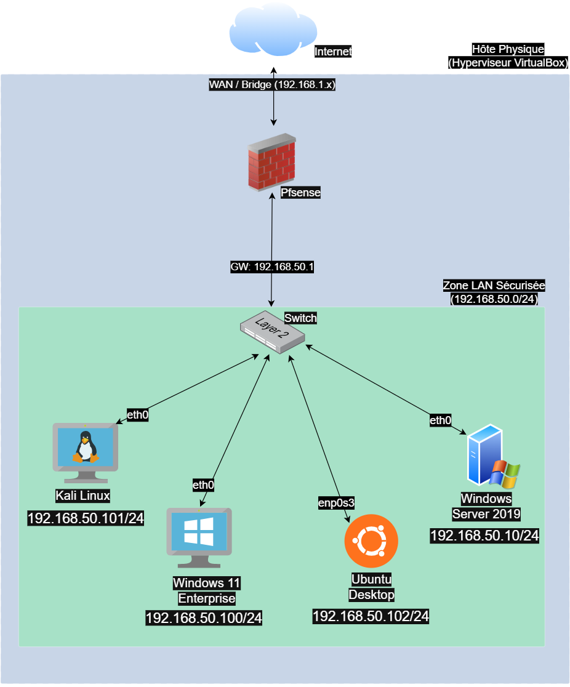

# SOC Home Lab: Infrastructure & Deployment

## Overview

This document details the architecture, configuration, and deployment of my cybersecurity home lab. The goal of this infrastructure is to reproduce a realistic, segmented enterprise network in order to practice both offensive scenarios (Red Team) and defensive analysis (Blue Team).

The entire environment is virtualized under **Oracle VirtualBox**, with **pfSense** acting as the central firewall and router.

## 1. Architecture & Network Topology

The lab network is isolated from the physical host through strict segmentation on a virtual internal switch. Only the pfSense firewall holds an interface facing outward (WAN) for internet access.

### Logical Diagram

### IP Address Ranges (CIDR)

- **Lab LAN:** `192.168.50.0/24`
- **Gateway:** `192.168.50.1`
- **Broadcast:** `192.168.50.255`
- **DNS Server:** `192.168.50.1` (DNS resolver configured on pfSense)

## 2. Asset Inventory

The virtual machines deployed in the lab to date:

| Machine | Role | OS | IP (LAN) | Resources (vCPU/RAM) | Interfaces |
| :--- | :--- | :--- | :--- | :--- | :--- |
| **pfSense** | Gateway, Firewall, DHCP, DNS | FreeBSD | `192.168.50.1` | 2 vCPU / 2 GB | **WAN:** Bridged **LAN:** Internal (`pfsense_lan`) |
| **Windows Server** | Domain Controller (AD) | Server 2019 | `192.168.50.10` | 4 vCPU / 8 GB | **Eth0:** Internal |
| **Kali Linux** | Attacker, scanning, auditing | Kali Rolling (Debian) | `192.168.50.101` | 4 vCPU / 4 GB | **Eth0:** Internal (`pfsense_lan`) |
| **Ubuntu Desktop** | Target, Web/SSH server | Ubuntu 24.04 LTS | `192.168.50.102` | 2 vCPU / 4 GB | **Enp0s3:** Internal (`pfsense_lan`) |
| **Windows 11** | Target, user endpoint | Windows 11 Pro | `192.168.50.100` | 4 vCPU / 4 GB | **Eth0:** Internal (`pfsense_lan`) |

## 3. Hypervisor Configuration & Technical Documentation

To keep this document readable, the detailed configuration of each critical component is documented separately:

- **[pfSense Configuration (Firewall & Rules)](PfSense-Configuration.md)**
- **[Windows Server 2019 Configuration (AD & DNS)](Windows-Server-Configuration.md)**
- **[Windows 11 Configuration (Client & Domain Join)](Windows-11-Configuration.md)**

### Internal Network (`pfsense_lan`)

Every machine except the pfSense WAN interface is connected to a VirtualBox internal network named **`pfsense_lan`**.

- **Why:** this guarantees that any malicious traffic generated during testing stays confined to the lab and never leaks onto the real home network.
- **Security:** the VMs cannot communicate directly with the physical host. All traffic has to pass through pfSense, which mirrors how a real perimeter forces traffic through a controlled chokepoint.

### Promiscuous Mode (Kali Linux)

On the **Kali Linux** machine, the network interface is set to **"Allow All"** in VirtualBox.

- **SOC relevance:** this lets the Kali interface capture and analyze all traffic crossing the virtual switch (passive sniffing with Wireshark or tcpdump), not only the traffic addressed to it. That visibility is what makes protocol analysis and network intrusion detection possible, and it is the same principle behind a SPAN port or network tap feeding a sensor in production.

## 4. Connectivity & Validation Tests

A series of tests was run to validate routing, DHCP, and network visibility.

### Test 1: IP Assignment (DHCP)

Confirming pfSense hands out addresses in the `192.168.50.x` range.

- **Command:** `ip a` (Linux) / `ipconfig` (Windows)
- **Result:** machines receive correct static or dynamic leases.

### Test 2: Gateway & Internet Access

Confirming outbound connectivity (NAT).

- **Command:** `ping 192.168.50.1` (to gateway), then `ping google.com` (to internet).
- **Result:** latency under 20 ms, DNS resolution working through pfSense.

### Test 3: Inter-VM Visibility (Ping)

Confirming the attacker can reach the victim.

- **Command (from Kali):** `ping 192.168.50.102` (Ubuntu target).
- **Result:** ICMP reply received (TTL=64). The internal network is functional.

### Test 4: Service Scan (Nmap)

OS and service detection. By default the Ubuntu target exposed no ports (all closed).

- **Preliminary action (on Ubuntu):** installed SSH to simulate an open service (`sudo apt install openssh-server`).
- **Command (on Kali):** `sudo nmap -sV -O 192.168.50.102`
- **Result:**
  - **Port 22/TCP: Open** (OpenSSH detected, version identified).
  - **OS detection:** Linux kernel fingerprinted from packet analysis on the open port.

### Test 5: Active Directory Authentication (AD DS)

Validating the client's domain integration and Kerberos.

- **Action:** logged into Windows 11 with a user account created on the server that does not exist locally on the client.
- **Test account:** `IRONCORP\alice`
- **Result:**
  - Successful logon.
  - Default Group Policy (GPO) applied.
  - `whoami` confirms identity: `ironcorp\alice`.

## 5. Lab Objectives

This lab was designed around three goals:

1. **Attack simulation (Red Team):** run scans, brute force attacks (Hydra), and vulnerability exploitation from Kali Linux, to generate realistic malicious activity.
2. **Hardening (Blue Team):** apply strict security policies, close unnecessary ports, and build firewall rules on pfSense.
3. **Analysis & monitoring:** capture logs (Syslog, Windows Events) to understand the traces an attack leaves behind, which is the raw material a SOC analyst works from.

## 6. Roadmap

- [ ] **Firewall:** build strict pfSense rules to segment traffic (DMZ vs LAN).
- [x] **Active Directory:** promote the Windows server to Domain Controller to simulate an enterprise environment.
- [ ] **Monitoring:** deploy **Sysmon** on the Windows endpoints and forward logs to a SIEM (Splunk or ELK Stack).
- [ ] **IDS/IPS:** enable Snort or Suricata on pfSense for network intrusion detection.

## Conclusion

This lab now stands as a complete, self-contained security sandbox. It reproduces a segmented enterprise network faithfully enough to exercise the full attack and defense chain:

1. **Reconnaissance & exploitation** from Kali Linux.
2. **Persistence & lateral movement** toward the Domain Controller (Windows Server).
3. **Detection & response** through log and network traffic analysis.

The infrastructure is ready for the next stage: SIEM integration (Splunk/ELK) and the deployment of EDR sensors.