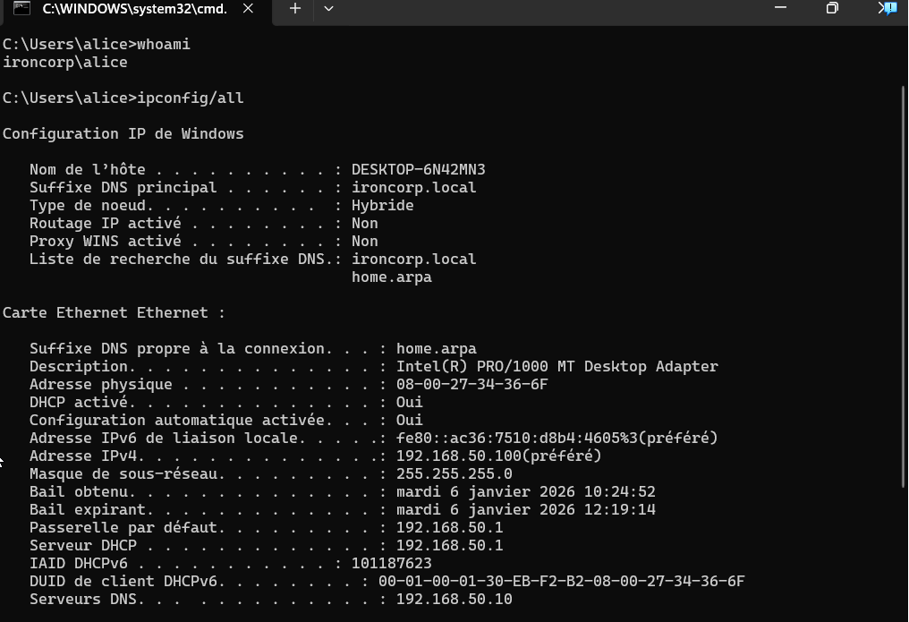

# 💻 Configuration Windows 11 Enterprise (Client / Victim)

Ce document décrit la configuration du poste de travail utilisateur, qui sert de cible principale ("Victime") pour les scénarios d'attaque et de point d'entrée pour tester les politiques de sécurité du domaine.

## 1. Rôle et Objectifs
Cette machine simule un ordinateur d'employé standard dans l'entreprise fictive **IronCorp**.
* **OS :** Windows 11 Enterprise (Mode Évaluation).
* **Ressources :** 2 vCPU / 4 GB RAM.
* **Fonction :** Exécution de charges utiles (payloads), navigation web, et génération de logs pour le SIEM.

## 2. Configuration Hyperviseur (VirtualBox)
Pour garantir l'isolation, la machine est connectée uniquement au réseau interne du laboratoire.

| Paramètre | Valeur | Description |
| :--- | :--- | :--- |
| **Carte Réseau** | Réseau Interne | Connecté au switch virtuel |
| **Nom du Réseau** | `pfsense_lan` | Segment `192.168.50.0/24` |
| **Promiscuous** | Refuser | (Pas nécessaire pour un client standard) |

## 3. Configuration Réseau & DNS
Par défaut, la machine obtient une IP via le DHCP de pfSense. Cependant, une modification manuelle a été nécessaire pour permettre la communication avec l'Active Directory.

* **Mode IP :** Dynamique (DHCP).
* **Adresse IP reçue :** `192.168.50.100` (Réservation DHCP recommandée mais non obligatoire).

### ⚠️ Modification Critique (DNS)
Pour rejoindre le domaine, le client doit être capable de résoudre le nom `ironcorp.local`, ce que la passerelle par défaut (pfSense) ne peut pas faire.

**Action réalisée :**
Modification manuelle des paramètres IPv4 de la carte réseau :
* **Serveur DNS Préféré :** `192.168.50.10` (Adresse IP du Contrôleur de Domaine).

> **Note :** Sans cette manipulation, la jonction au domaine échoue avec une erreur "Contrôleur de domaine introuvable".

## 4. Intégration au Domaine (Join Domain)
La machine a été intégrée avec succès à l'infrastructure Active Directory.

* **Domaine rejoint :** `ironcorp.local`
* **Méthode :** Propriétés Système (`sysdm.cpl`) > Modifier > Domaine.
* **Authentification :** Validée via compte Administrateur du domaine.

## 5. 🕒 Synchronisation NTP
Pour éviter les échecs d'authentification au domaine ("The time difference between the client and server is too large"), l'horloge du client doit être alignée sur celle du Contrôleur de Domaine.

* **Mécanisme :** Synchronisation automatique via l'hyperviseur (Guest Additions) et le service de temps Windows (`w32time`) une fois joint au domaine.
* **Vérification :** L'heure système correspondait à celle du serveur AD (`192.168.50.10`) avant la tentative de jonction.

## 6. Validation Fonctionnelle
Le bon fonctionnement de la relation de confiance (Trust Relationship) a été vérifié par l'ouverture de session d'un utilisateur du domaine n'existant pas localement sur la machine.

* **Test :** Connexion avec l'utilisateur `IRONCORP\alice`.
* **Résultat :** Ouverture de session réussie, création du profil utilisateur, et obtention du ticket Kerberos.

*(Commande `whoami` et `ipconfig /all` confirmant le suffixe DNS)*