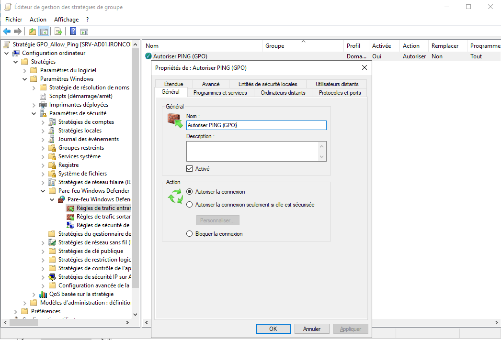

# 🖥️ Configuration Windows Server 2019 (AD Lab)

Ce document détaille les étapes spécifiques de post-installation effectuées pour intégrer le serveur Windows 2019 au réseau sécurisé du laboratoire.

## 1. Installation & Résolution de Problèmes Hyperviseur
Lors du déploiement sous VirtualBox, des configurations spécifiques ont été nécessaires pour assurer la stabilité :
* **Installation Manuelle :** Désactivation de l'option "Unattended Installation" de VirtualBox pour éviter l'erreur de licence EULA.
* **Guest Additions :** Installation des outils invités pour la gestion de l'affichage et de la souris.

## 2.a Configuration Réseau (Adressage Statique)
Contrairement aux clients (Windows 11 / Ubuntu), le futur Contrôleur de Domaine nécessite une IP fixe pour être joignable en permanence.

* **Interface :** Ethernet0
* **Mode IP :** Statique (Manuel)

| Paramètre | Valeur | Description |
| :--- | :--- | :--- |
| **Adresse IP** | `192.168.50.10` | IP réservée pour le Serveur AD |
| **Masque** | `255.255.255.0` | CIDR /24 |
| **Passerelle** | `192.168.50.1` | Vers pfSense LAN |
| **DNS Préféré** | `192.168.50.1` | (Sera remplacé par 127.0.0.1 après promotion AD) |

## 2b. Synchronisation Temporelle (NTP & Kerberos)
Un pré-requis critique pour le fonctionnement d'Active Directory est la précision de l'heure système. Le protocole d'authentification **Kerberos** ne tolère pas un décalage supérieur à 5 minutes entre le client et le serveur.

* **Problème rencontré :** Décalage de fuseau horaire sur l'hôte physique.
* **Solution :** Utilisation de la synchronisation native via les *VirtualBox Guest Additions*.
* **Validation :** L'heure du serveur (`SRV-AD01`) est synchronisée avec celle des futurs clients pour garantir la délivrance des tickets Kerberos (TGT).

## 3. Configuration du Pare-feu (Firewall Rules)
Par défaut, Windows Server bloque les requêtes ICMP (Ping), ce qui empêche la vérification de la connectivité réseau.

**Action réalisée :**
1.  Ouverture du console "Pare-feu Windows Defender avec fonctions avancées".
2.  Activation de la règle de trafic entrant :
    * *Nom :* **Partage de fichiers et d'imprimantes (Demande d'écho - Trafic entrant ICMPv4)**
    * *Profil :* Domaine / Privé / Public

> **Résultat :** Le serveur répond désormais aux pings provenant de Kali Linux et Ubuntu, validant la visibilité réseau.

## 4. Services Active Directory (AD DS)

Le serveur a été promu en tant que **Contrôleur de Domaine (DC)** principal pour centraliser la gestion des identités et des accès.

* **Nom de Domaine (FQDN) :** `ironcorp.local`
* **Nom NetBIOS :** `IRONCORP`
* **Niveau fonctionnel de la forêt :** Windows Server 2016 (compatibilité maximale pour le lab).

### 👥 Gestion des Utilisateurs (Exemple)
Un compte utilisateur standard a été créé pour simuler un employé et tester l'authentification Kerberos depuis les postes clients.

* **Utilisateur :** Alice
* **Login :** `IRONCORP\alice`
* **Statut :** Membre du groupe "Utilisateurs du domaine".

## 5. Intégration des Postes Clients (Join Domain)
La machine **Windows 11** a été jointe au domaine avec succès.
* **Pré-requis DNS :** Le DNS du client a dû pointer manuellement vers `192.168.50.10` (IP du DC) pour résoudre le nom de domaine.
* **Validation :** Authentification réussie avec le compte `Alice` depuis le poste client.

## 6. Gestion Centralisée (GPO - Group Policy Object)

Afin d'éviter la configuration manuelle et répétitive sur chaque poste client, la gestion de la sécurité a été centralisée via les GPO Active Directory.

### 🔹 Cas pratique : Supervision Réseau (ICMP)
Par défaut, le pare-feu de Windows 11 bloque les requêtes ping entrantes, empêchant le monitoring par le serveur. Plutôt qu'une modification locale, une stratégie globale a été appliquée.

* **Organisation :** Création d'une Unité d'Organisation (OU) nommée **`Postes de Travail`** pour cibler spécifiquement les ordinateurs clients.
* **GPO Créée :** `GPO_Allow_Ping_ICMP`
* **Configuration :**
    * *Chemin :* Configuration ordinateur > Stratégies > Paramètres Windows > Paramètres de sécurité > Pare-feu Windows Defender.
    * *Règle :* Autoriser le trafic entrant **ICMPv4** (Echo Request).
    * *Profil :* Restreint au profil **Domaine** uniquement (Sécurité).

> **Résultat :** Après un `gpupdate /force` sur le client, la règle s'est appliquée automatiquement, permettant au serveur de pinger Windows 11 sans intervention locale de l'utilisateur.

*(Détail de la règle entrante autorisant le protocole ICMPv4)*