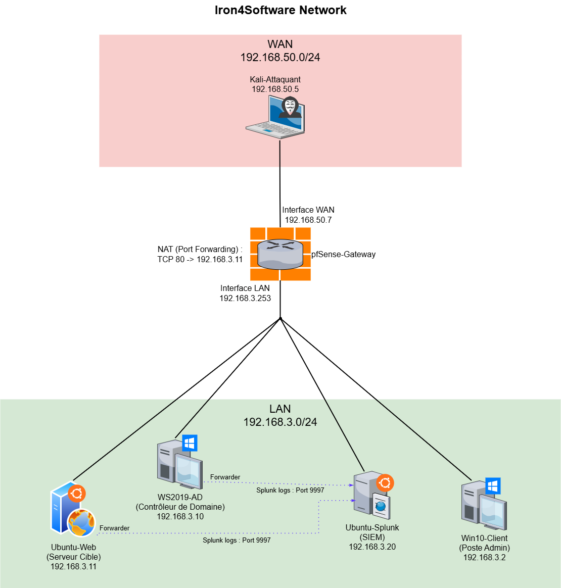
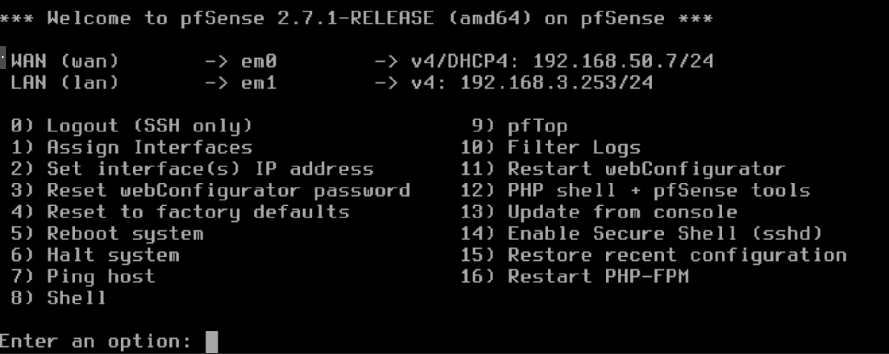
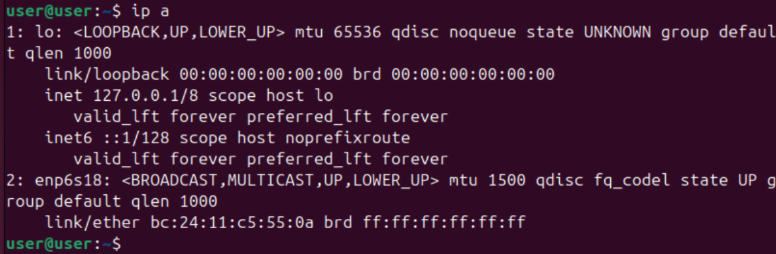
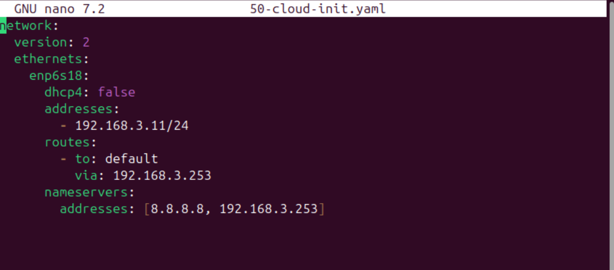
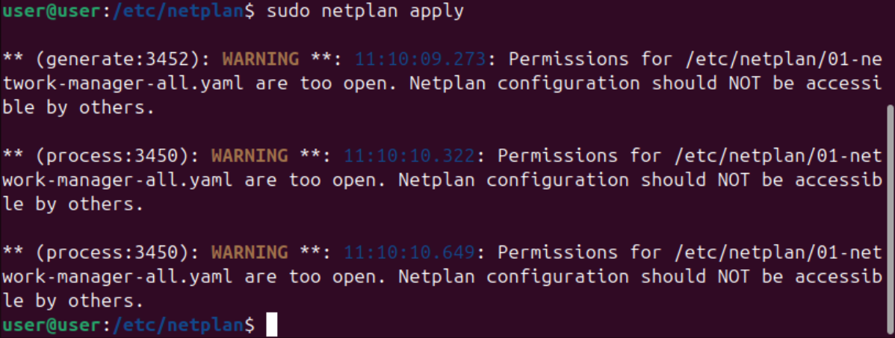
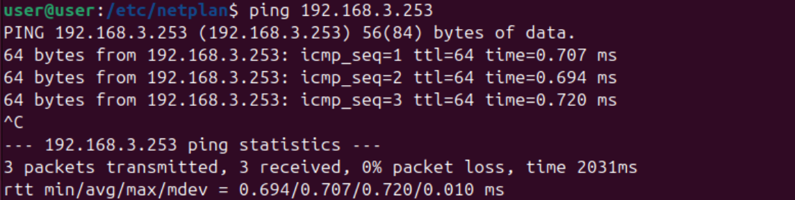
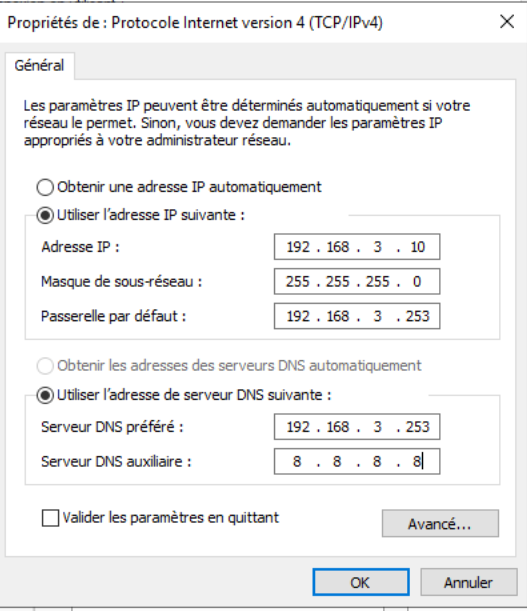
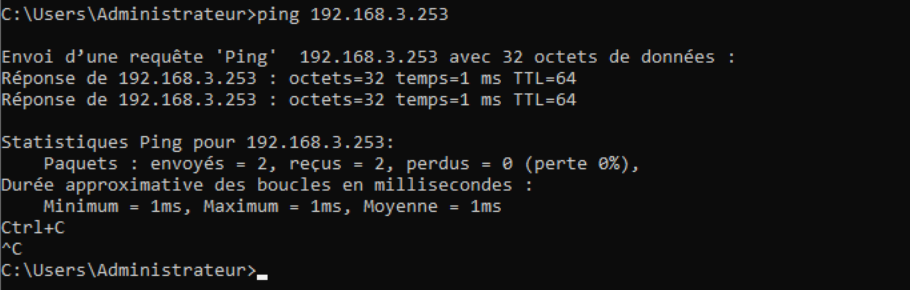

# Phase 1 - Fondation de l'Infrastructure et Architecture Réseau "Vulnerable-by-Design"

**Environnement :** Home Lab virtuel sur Proxmox pour le projet Iron4Software — Formation Analyste SOC - CyberUniversity (Liora x Sorbonne).

## Objectif du Lab
L'objectif de cette première phase est de concevoir et de déployer l'architecture réseau fondamentale d'un environnement d'entreprise simulé. Cette infrastructure isolée comprend une zone publique (WAN) et une zone interne (LAN). Elle sert de socle pour héberger des services métier vulnérables tout en permettant le déploiement d'une architecture de supervision centralisée (SIEM) robuste, essentielle à notre future analyse des menaces.

## Note de conception : Architecture "Vulnerable-by-Design"
Il est important de préciser que cette première itération de l'infrastructure est délibérément "mal configurée". Le réseau interne (LAN) a été volontairement aplati, forçant la cohabitation du serveur Web (exposé) et du Contrôleur de Domaine sur le même sous-réseau, sans zone démilitarisée (DMZ). Ce choix architectural intentionnel a pour but de faciliter l'étape d'exploitation offensive (mouvements latéraux, pivot) qui va suivre. L'isolation des services vulnérables dans une DMZ étanche et la segmentation stricte du réseau feront l'objet d'une phase dédiée à la remédiation et au durcissement (Hardening) plus tard dans le projet, une fois les détections SOC validées.

## Outils et Technologies
- **Hyperviseur :** Proxmox VE.
- **Pare-feu/Routeur :** pfSense (Passerelle réseau et NAT).
- **Serveurs de l'infrastructure :** Windows Server 2019 (Contrôleur de Domaine) et Ubuntu Server 22.04 (Serveur Web).
- **Poste d'administration :** Windows 10 Client.
- **SIEM :** Splunk Enterprise (Serveur centralisé) et Splunk Universal Forwarders (Agents de collecte).
- **Attaquant :** Kali Linux.

## 1. Choix Technologiques et Configuration Matérielle
Avant même d'attribuer les adresses IP, il a fallu configurer les interfaces réseau virtuelles au niveau de l'hyperviseur pour garantir la stabilité et la performance de la collecte de logs.

Pour les endpoints Linux (Ubuntu-Web, Ubuntu-Splunk, Kali), j'ai conservé les cartes réseau au format `VirtIO`. Le noyau Linux intégrant nativement ces pilotes, cela garantit des performances réseau optimales pour notre environnement virtualisé. 
Cependant, pour les endpoints Windows (WS2019-AD, Win10-Client), j'ai modifié le modèle des cartes réseau virtuelles pour `Intel E1000`. Windows ne possédant pas les pilotes natifs pour `VirtIO`, ce choix prévient les problèmes de détection de matériel (cartes réseau invisibles dans la configuration) et assure une connectivité immédiate sans nécessiter l'injection de pilotes additionnels.

## 2. Cartographie Réseau et Segmentation



Pour simuler une attaque réaliste, l'architecture a été segmentée en deux zones via les bridges virtuels de Proxmox :

- **La Zone WAN (Réseau Externe / 192.168.50.0/24) :** Cette zone représente Internet. J'y ai placé la machine d'attaque (Kali-Attaquant) avec l'IP `192.168.50.5`, ainsi que l'interface publique du pare-feu pfSense (`192.168.50.7`).
- **La Zone LAN (Réseau Interne / 192.168.3.0/24) :** C'est notre réseau d'entreprise plat. J'y ai raccordé l'ensemble des endpoints internes, avec la patte LAN du pfSense (`192.168.3.253`) faisant office de passerelle par défaut.

**Contexte SOC & Blue Team : L'importance de l'adressage statique :**
Dans la zone LAN, j'ai configuré l'intégralité des serveurs et du poste d'administration en IP statiques (ex: `192.168.3.11` pour Ubuntu-Web, `192.168.3.10` pour l'AD). Dans un contexte d'entreprise et de supervision SOC, s'appuyer sur du DHCP pour des serveurs est un anti-pattern majeur. Une IP dynamique rendrait inopérantes les règles de pare-feu et de redirection de port (NAT) en cas de redémarrage. De plus, la corrélation d'événements dans le SIEM repose sur une identification fiable et constante des hôtes cibles ; le changement régulier d'IP corromprait l'intégrité de nos enquêtes.

## 3. Configuration du Cœur de Réseau : pfSense
Le routeur pfSense-Gateway assure la frontière entre nos deux environnements.



Son interface WAN (em0) a été basculée en configuration DHCP. Ce choix pragmatique permet à Proxmox de lui fournir automatiquement une adresse valide (`192.168.50.7`) et la bonne passerelle de sortie vers le véritable Internet, étape indispensable pour le téléchargement et l'installation de nos futurs paquets applicatifs (Apache, Splunk).
L'interface LAN (em1) a été assignée manuellement à l'adresse statique `192.168.3.253`, devenant ainsi le point de routage unique et contrôlé de notre infrastructure interne.

## 4. Déploiement des Endpoints et Isolation du SIEM
La configuration réseau des endpoints est une étape critique de l'infrastructure. Une erreur de routage ici isolerait la machine du SIEM ou de la passerelle. Les adresses IP ont été fixées localement sur chaque système d'exploitation : via l'interface réseau classique pour Windows, et via Netplan (fichiers YAML) pour les serveurs Ubuntu.

Voici la méthodologie stricte que j'ai appliquée pour fixer les adresses IP, en garantissant la reproductibilité du déploiement.

### Configuration Linux (Netplan) - Exemple sur Ubuntu-Web
Sur les serveurs Ubuntu, la gestion du réseau passe par l'utilitaire `Netplan` et des fichiers YAML. La rigueur syntaxique est absolue : l'utilisation de la touche tabulation est proscrite sous peine de générer une erreur de syntaxe.

1. **Identification de l'interface :** J'ai d'abord identifié le nom logique de la carte réseau virtuelle (`enp6s18`) via la commande `ip a`.



2. **Édition de la configuration :** J'ai ouvert le fichier de configuration système avec les privilèges administrateur : `sudo nano /etc/netplan/50-cloud-init.yaml`.

3. **Application du plan d'adressage :** J'ai structuré le fichier pour désactiver le DHCP et forcer l'IP statique (`192.168.3.11/24`), en pointant le routage par défaut vers notre pfSense (`192.168.3.253`) et en spécifiant les serveurs DNS :
   ```yaml
   network:
     version: 2
     ethernets:
       enp6s18:
         dhcp4: false
         addresses:
           - 192.168.3.11/24
         routes:
           - to: default
             via: 192.168.3.253
         nameservers:
           addresses: [8.8.8.8, 192.168.3.253]
   ```



4. **Validation :** J'ai appliqué la configuration via `sudo netplan apply` puis validé la connectivité interne par un `ping 192.168.3.253`. J'ai répété cette opération de manière identique pour l'`Ubuntu-Splunk` avec l'IP `192.168.3.20/24`.





### Configuration Windows (Interface graphique) - Exemple sur WS2019-AD
Pour les environnements Microsoft (Windows 10 et Windows Server 2019), j'ai privilégié l'accès direct aux adaptateurs réseau pour une configuration statique classique.

1. **Accès rapide :** Depuis l'environnement de bureau, j'ai utilisé le raccourci `Windows + R` et exécuté la commande `ncpa.cpl` pour ouvrir directement le gestionnaire de connexions réseau.
2. **Propriétés de la carte :** J'ai ouvert les propriétés de l'adaptateur reconnu par le système, puis sélectionné "Protocole Internet version 4 (TCP/IPv4)".
3. **Saisie des paramètres :** J'ai sélectionné "Utiliser l'adresse IP suivante" et renseigné les données de notre topologie :
   - Adresse IP : `192.168.3.10`
   - Masque de sous-réseau : `255.255.255.0`
   - Passerelle par défaut : `192.168.3.253`
   - Serveurs DNS : `192.168.3.253` (Préféré) et `8.8.8.8` (Auxiliaire).



4. **Validation :** Après validation des fenêtres, un test de `ping` vers la passerelle dans l'invite de commande (cmd) a confirmé la bonne intégration du contrôleur de domaine (`WS2019-AD`) dans le LAN. J'ai répété cette opération de manière identique pour la machine `Win10-Client` avec l'IP `192.168.3.2/24`.



**Contexte SOC & Blue Team : Le positionnement stratégique du SIEM :**
La décision d'architecture la plus critique de cette phase concerne Splunk. Il aurait été techniquement possible (et économe en ressources) d'installer le serveur SIEM directement sur le serveur Web Ubuntu. J'ai volontairement rejeté cette approche au profit du déploiement d'une VM dédiée (`Ubuntu-Splunk` à l'IP `192.168.3.20`). 
Du point de vue défensif, un SIEM doit impérativement être isolé des systèmes qu'il supervise. Si l'attaquant venait à compromettre le serveur Web, la cohabitation du SIEM sur la même machine lui permettrait de falsifier, d'altérer ou de supprimer les journaux d'événements avant même leur indexation, détruisant ainsi toute trace forensique. Cette isolation garantit l'intégrité de notre pipeline de logs.

## Implications pour un Analyste SOC
La mise en place de cette architecture m'a permis de consolider la compréhension topologique du réseau, prérequis indispensable à l'analyse des flux. En tant qu'analyste, on ne peut défendre efficacement que ce que l'on comprend. Connaître le cheminement exact d'un paquet depuis la zone externe (WAN), à travers la règle NAT du pare-feu, jusqu'au sous-réseau interne permet d'anticiper les vecteurs de compromission. L'architecture est maintenant saine, documentée, et prête à être délibérément affaiblie lors de la prochaine étape.

---
*Fin du rapport de Lab.*