# Phase 1 - Déploiement de l'Architecture de Supervision (SIEM Splunk)

**Environnement :** Home Lab virtuel sur Proxmox pour le projet Iron4Software — Formation Analyste SOC - CyberUniversity (Liora x Sorbonne).

## Objectif du Lab
Une infrastructure, même durcie, est indéfendable si elle est aveugle. L'objectif de cette étape est de déployer le cœur analytique de notre SOC: le SIEM (Security Information and Event Management). Il s'agit d'installer le serveur central Splunk Enterprise ("Le Cerveau") dans une zone isolée, puis de déployer des agents de collecte (Universal Forwarders) sur nos serveurs cibles afin de centraliser la télémétrie système, réseau et applicative en temps réel.

## Outils et Technologies
- **SIEM Central :** Splunk Enterprise 9.0.3.
- **Agents de collecte :** Splunk Universal Forwarder 9.0.3 (Linux .deb et Windows .msi).
- **Gestion de services :** `systemd` (Linux), PowerShell (Windows).
- **Sources de données :** Journaux Apache (`/var/log/apache2/`), Windows Event Logs (Security, System, Application).

## Note de conception SIEM ("Vulnerable-by-Design" et Bruit Volontaire) :
Tout comme l'architecture réseau de cette Phase 1, ce premier déploiement du SIEM est délibérément basique, bruyant et non-sécurisé. L'objectif actuel est d'établir le pipeline de données le plus rapidement possible pour préparer la phase d'attaque, sans se soucier de l'optimisation.

J'ai volontairement intégré deux "failles" d'ingénierie majeures :
1. **Indexation plate et absence de filtres :** Je n'ai créé aucun index spécifique (ex: `index=windows`, `index=web`). L'intégralité de la télémétrie tombe en vrac dans l'index par défaut (`main`), générant un maximum de bruit. Le but est de me noyer volontairement sous une masse de logs pour rendre ma future phase d'investigation (Threat Hunting) plus réaliste et difficile. Les alertes différenciées n'existent pas encore.
2. **Flux de collecte non chiffré (Cleartext) :** La communication entre les agents (Universal Forwarders) et le serveur central Splunk s'effectue en clair sur le port 9997 (sans certificat SSL/TLS). Sur un réseau compromis, cela expose les logs à une interception (Sniffing).

L'optimisation des performances (ségrégation des données par Index), la création de règles de détection sur mesure, et le chiffrement robuste des flux de collecte feront l'objet d'un travail d'ingénierie complet lors d'une phase future dédiée au **Durcissement (Hardening) et au Tuning du SIEM**.

## 1. Déploiement du Serveur Central (Splunk Enterprise)

J'ai opéré le déploiement du SIEM sur la machine dédiée `Ubuntu-Splunk` (IP : `192.168.3.20`), afin de garantir son isolation par rapport à la zone d'attaque.

1. **Exécution du script d'installation :** Après avoir transféré le script `install-splunk.sh`, j'ai élevé mes privilèges (`sudo su`) et accordé les droits d'exécution (`chmod +x`).

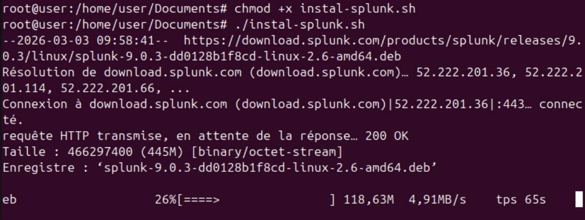

2. **Initialisation :** Lors du lancement (`./install-splunk.sh`), j'ai accepté le contrat de licence et défini les identifiants d'administration stricts exigés par notre politique de sécurité (`Admin` / `Cyberuniversity`).

3. **Démarrage et Validation :** J'ai forcé le démarrage du daemon via `/opt/splunk/bin/splunk start`. Pour valider l'accès, je me suis connecté à l'interface web depuis le poste d'administration `Win10-Client` sur le port par défaut (`http://192.168.3.20:8000`). La console de gestion s'est affichée avec succès.

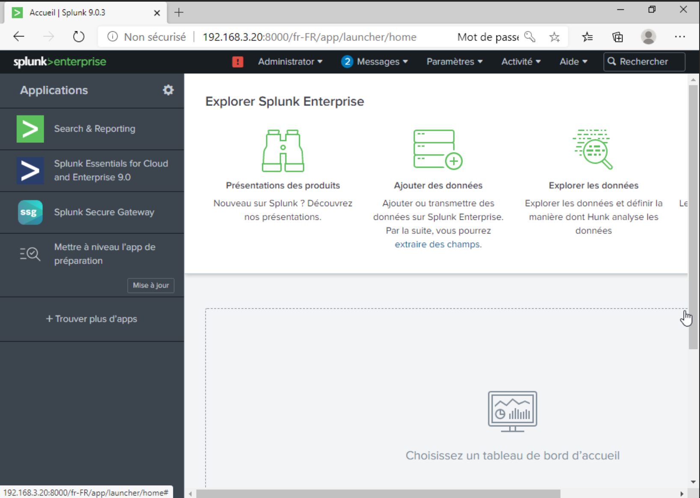

## 2. Configuration du Port de Réception (Le point d'écoute)

Par défaut, Splunk n'accepte aucune donnée entrante. Avant de déployer les agents, il est impératif d'ouvrir le canal de communication.
Depuis l'interface web, j'ai navigué dans les Paramètres > Données > Transmission et réception. J'ai configuré un "Nouveau port de réception" en assignant le port standard **9997**. Le SIEM est désormais prêt à ingérer la télémétrie du LAN.

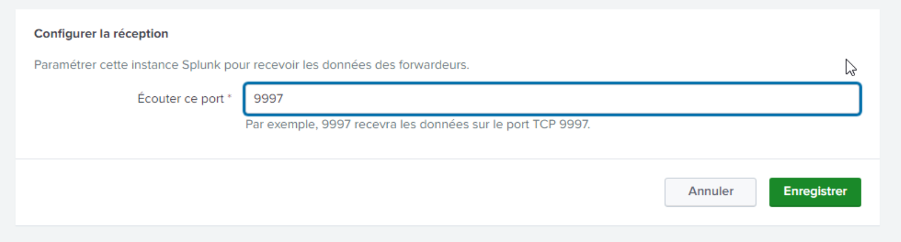

## 3. Déploiement de l'Agent sur le Serveur Web (Ubuntu-Web)

La première cible de surveillance est notre serveur Apache, point d'entrée probable de l'attaquant. J'ai déployé l'agent Universal Forwarder sur `Ubuntu-Web` (`192.168.3.11`) pour capter l'activité HTTP et l'acheminer vers le SIEM.

### 1. Installation du paquet :

J'ai récupéré la version `9.0.3` de l'agent correspondant exactement à la version de notre serveur central en utilisant `wget` pour le téléchargement direct. Puis j'ai procédé à l'installation système via le gestionnaire de paquets Debian (`dpkg`) :
   ```bash
   wget https://download.splunk.com/products/universalforwarder/releases/9.0.3/linux/splunkforwarder-9.0.3-dd0128b1f8cd-linux-2.6-amd64.deb

   sudo dpkg -i splunkforwarder-9.0.3-dd0128b1f8cd-linux-2.6-amd64.deb
   ```

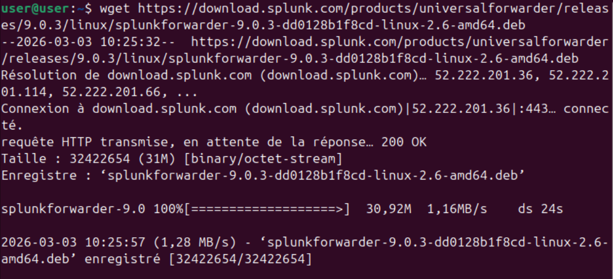

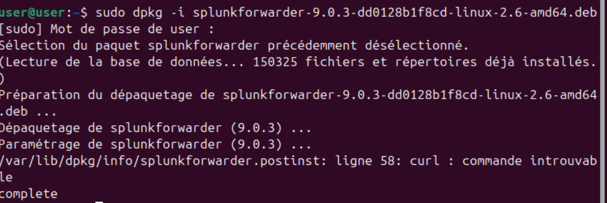

### 2. Liaison au SIEM et Monitoring :

J'ai initialisé l'agent en acceptant la licence d'un bloc et en définissant les identifiants locaux (`Admin` / `Cyberuniversity`) :
   ```bash
   sudo /opt/splunkforwarder/bin/splunk start --accept-license
   ```
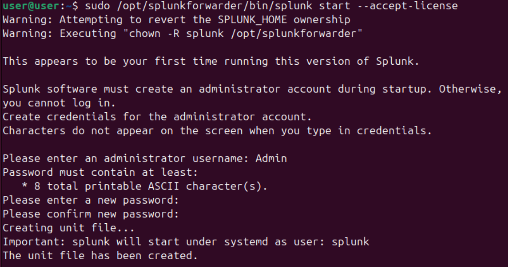

   Ensuite, je lui ai indiqué l'adresse de notre serveur central (le Cerveau) et le port d'écoute configuré précédemment (`9997`) :
   ```bash
   sudo /opt/splunkforwarder/bin/splunk add forward-server 192.168.3.20:9997
   ```
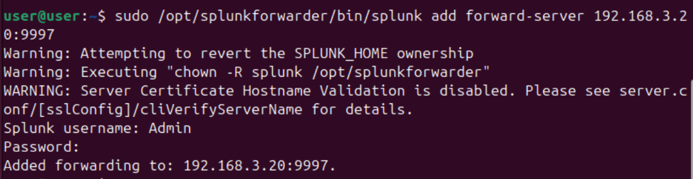

   Enfin, j'ai configuré la surveillance dynamique du répertoire des journaux d'accès et d'erreurs d'Apache, ce qui nous permettra de détecter l'utilisation future de notre webshell :
   ```bash
   sudo /opt/splunkforwarder/bin/splunk add monitor /var/log/apache2/
   ```
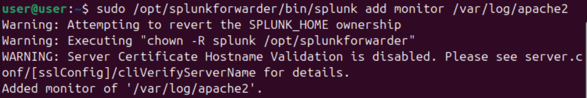

### 3. Résolution du démarrage automatique (Systemd) :

Afin de garantir que l'agent survive aux redémarrages de la VM, j'ai voulu l'inscrire dans les services de démarrage automatique :

```bash
sudo /opt/splunkforwarder/bin/splunk enable boot-start
```

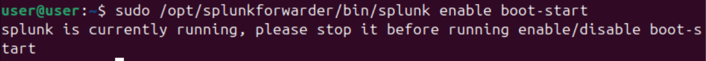

L'exécution directe a soulevé un conflit système (Ressource occupée), car l'agent tournait déjà manuellement et refusait de modifier sa propre configuration à chaud. J'ai donc appliqué la méthodologie de remédiation Linux en arrêtant d'abord le processus :

```bash
sudo /opt/splunkforwarder/bin/splunk stop
```
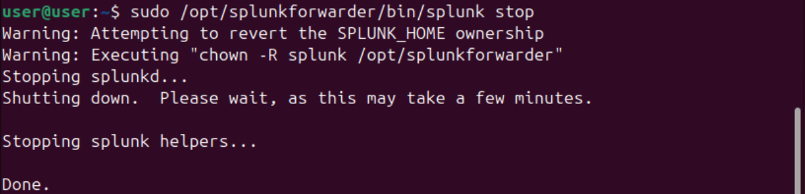

Puis on refait la commande pour l'inscrire dans les services de démarrage automatique :

```bash
sudo /opt/splunkforwarder/bin/splunk enable boot-start
```
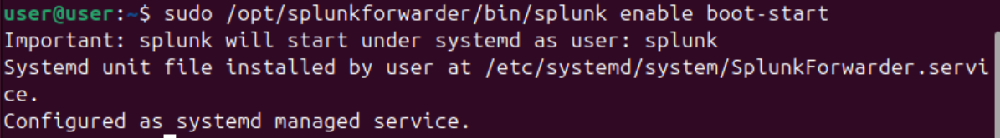

Cette dernière commande est cruciale : elle a créé un service officiel et délégué les clés de la gestion de Splunk au gestionnaire de services de Linux (`systemd`). À partir de cet instant, il ne faut plus utiliser les scripts natifs de Splunk pour le démarrage. J'ai donc rechargé l'arborescence des démons et démarré l'agent via `systemctl` :

```bash
sudo systemctl daemon-reload
sudo systemctl start SplunkForwarder
```

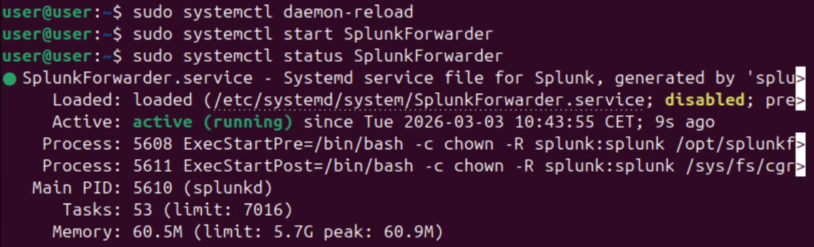

La vérification du status (`sudo systemctl status SplunkForwarder`) affichait l'agent comme `active (running)` mais `disabled`. Pour parachever l'installation et forcer son activation au prochain redémarrage (persistance), j'ai exécuté l'ultime commande :

```bash
sudo systemctl enable SplunkForwarder
```
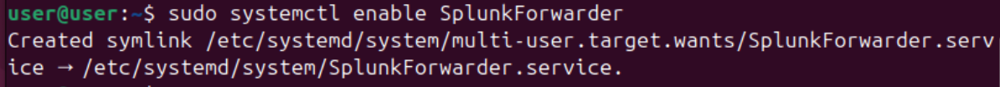

*Linux m'a répondu en créant un lien symbolique, ce qui confirme que le service est désormais "enabled".*

L'agent de collecte est désormais robuste, autonome et invisible pour un utilisateur classique de la machine web.

## 4. Déploiement de l'Agent sur le Contrôleur de Domaine (WS2019-AD)

Le second agent a été déployé sur notre cible de grande valeur (`WS2019-AD`), afin de traquer les mouvements latéraux et les tentatives de compromission d'identifiants (brute-force RDP). Sur Windows Server, les sécurités par défaut d'Internet Explorer sont très strictes et bloquent les téléchargements classiques. J'ai donc contourné cette restriction en utilisant PowerShell.

### 1. Téléchargement sécurisé via PowerShell : 

Depuis la VM cible, j'ai ouvert une invite `Windows PowerShell` en tant qu'administrateur. J'ai exécuté la commande suivante pour télécharger le fichier `.msi` officiel de l'Universal Forwarder (version 9.0.3) directement sur le bureau de l'utilisateur :
   ```powershell
   Invoke-WebRequest -Uri "https://download.splunk.com/products/universalforwarder/releases/9.0.3/windows/splunkforwarder-9.0.3-dd0128b1f8cd-x64-release.msi" -OutFile "$env:USERPROFILE\Desktop\splunkforwarder.msi"
   ```
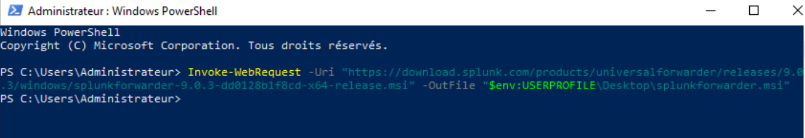

### 2. L'installation graphique (Les pièges à éviter) :

J'ai lancé l'assistant d'installation depuis le fichier `splunkforwarder.msi` téléchargé sur le bureau. 

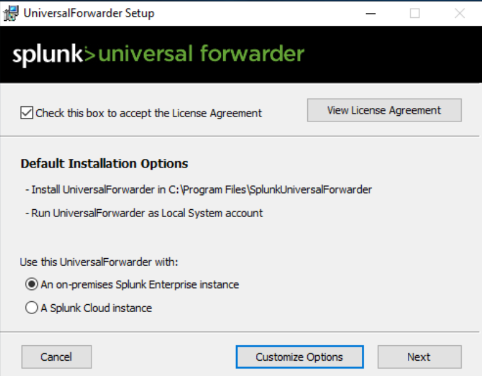

Pour garantir la bonne communication avec le SIEM, j'ai appliqué cette configuration stricte :
   - **License Agreement :** Acceptation des termes et sélection de l'option "An on-premises Splunk Enterprise instance".
   - **Create administrator account :** Création des identifiants locaux de l'agent (`Admin` / `Cyberuniversity`).
   - **Deployment Server :** J'ai volontairement laissé ces champs vides (nous ne gérons pas de serveur de déploiement complexe dans cette architecture).
   - **Receiving Indexer :** C'est l'étape cruciale pour la liaison. J'ai renseigné l'IP de notre "Cerveau" (`192.168.3.20`) et le port configuré précédemment (`9997`). J'ai ensuite finalisé l'installation graphique.

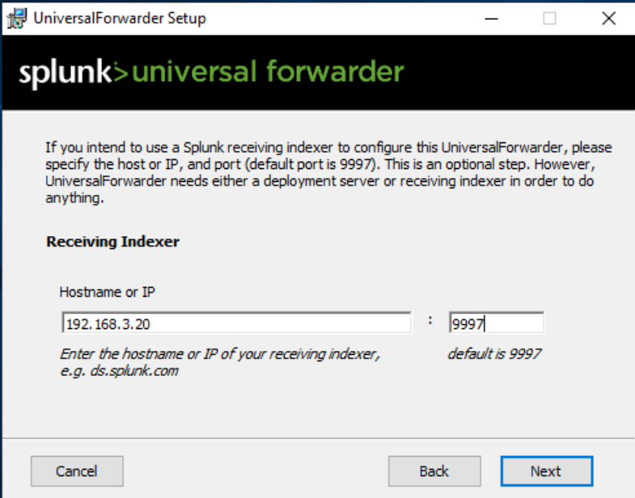

### 3. La méthode "Sous le capot" (Fichier inputs.conf) :

Historiquement, on utilisait des commandes PowerShell comme `.\splunk.exe add win-eventlog Security` pour dire à l'agent quoi écouter. Cependant, sur la version 9.0.3, ce raccourci CLI a été désactivé. J'ai donc appliqué une méthode d'ingénierie plus robuste : la manipulation directe des fichiers de configuration Splunk (`.conf`).

Pour éviter les blocages de permissions dans le dossier `Program Files`, j'ai créé un fichier texte vierge sur le Bureau. Le piège classique sous Windows étant le masquage des extensions, je me suis assuré, lors de l'enregistrement ("Enregistrer sous..."), de sélectionner "Tous les fichiers (*.*)" et de le nommer exactement `inputs.conf`. 
   
   J'y ai injecté le code suivant pour forcer l'écoute des trois journaux vitaux de Windows :
   ```ini
   [WinEventLog://Application]
   disabled = 0

   [WinEventLog://Security]
   disabled = 0

   [WinEventLog://System]
   disabled = 0
   ```
   *(Note : `disabled = 0` signifie que la collecte est activée).*

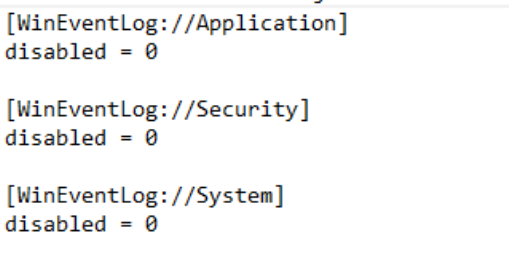

### 4. Application des changements :

J'ai copié ce fichier `inputs.conf` depuis le bureau pour le coller dans le répertoire critique de l'agent : `C:\Program Files\SplunkUniversalForwarder\etc\system\local\`, en validant l'élévation de privilèges demandée par Windows.

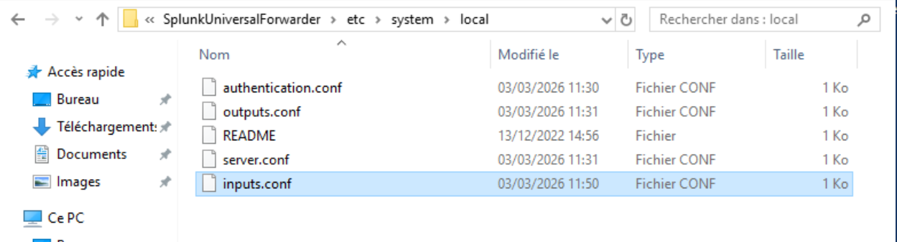

Enfin, pour que l'agent lise ses nouveaux ordres de mission, j'ai relancé le service depuis mon invite PowerShell :
```powershell
cd "C:\Program Files\SplunkUniversalForwarder\bin"
.\splunk.exe restart
```
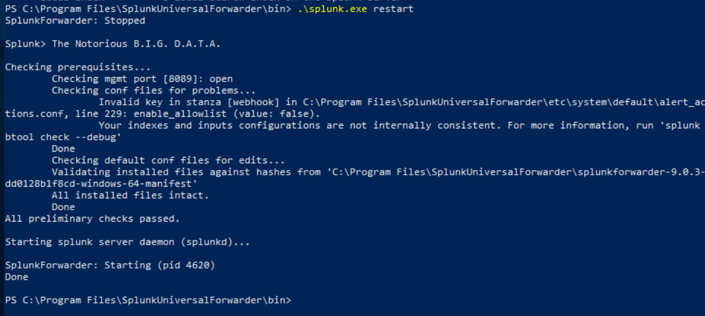

Dès sa relance, l'agent a commencé à aspirer les journaux de sécurité Windows (incluant les futures tentatives de connexion RDP) pour les expédier en temps réel vers le serveur central Splunk.

## 5. Test Ultime et Validation de la Télémétrie

Cette ultime étape est le moment de vérité de la Phase 1. L'infrastructure est déployée et les agents sont configurés, mais un SOC n'est opérationnel que si le pipeline de données est parfaitement fonctionnel. Il m'a donc fallu vérifier que le serveur central Splunk indexait correctement les événements expédiés par nos deux endpoints.

1. **Accès à la console de recherche :** Depuis mon poste d'administration `Win10-Client`, je me suis connecté à l'interface web du SIEM (`http://192.168.3.20:8000`) et j'ai lancé l'application principale **Search & Reporting**.

2. **Exécution de la requête globale :** Pour interroger l'intégralité de la base de données sans filtre restrictif, j'ai saisi le caractère joker `*` dans la barre de recherche. Afin de visualiser les données fraîchement ingérées suite au redémarrage de mes agents sur `Ubuntu-Web` et `WS2019-AD`, j'ai ajusté le sélecteur de temps (Time Picker) sur "Aujourd'hui", puis j'ai validé.

3. **Analyse des métadonnées et validation :** Une fois les résultats affichés, j'ai déployé la section **Hôte** (Host) dans le panneau latéral gauche (qui liste les champs intéressants extraits automatiquement par Splunk). L'apparition de deux identifiants distincts a confirmé le succès total de notre architecture de collecte :
   - Le hostname `user` : Il correspond formellement à notre serveur `Ubuntu-Web` (tel qu'il apparaît dans le prompt du terminal Linux `user@user:~`). L'ingestion de ces événements valide que le répertoire `/var/log/apache2/` est bien sous surveillance active.
   - Le hostname `WIN-HKVM4FR00PS` : Il identifie de manière unique notre contrôleur de domaine `WS2019-AD`.

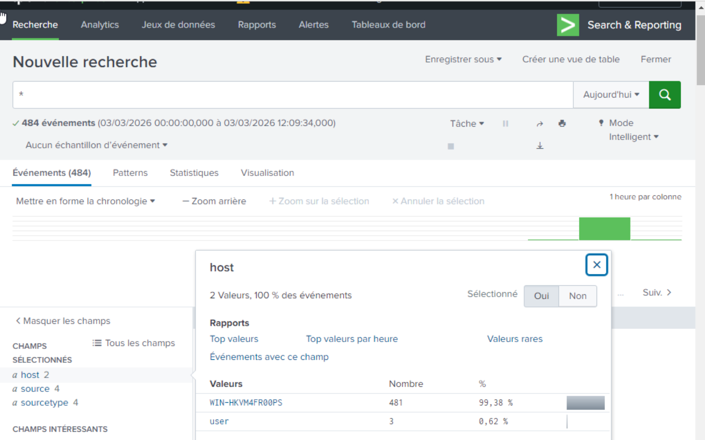

**Contexte SOC & Blue Team : L'analyse de la verbosité**
Lors de cette validation, j'ai immédiatement pu constater une différence fondamentale de comportement entre les deux systèmes d'exploitation. Les journaux Windows (particulièrement le journal *Security*) sont extrêmement bavards par nature. Le compteur d'événements associé à la machine Windows grimpait de manière exponentielle comparé à celui d'Ubuntu. Cette télémétrie brute, bien que bruyante, est la matière première indispensable de notre SOC. C'est précisément au sein de ce flux continu d'événements système que se cacheront les traces de l'attaque imminente de la Phase 2 (notamment les Event ID 4625 liés au brute-force RDP), traces que je devrai isoler et corréler par la suite.

## Implications pour un Analyste SOC
La finalisation de cette étape marque un tournant dans le laboratoire. L'infrastructure n'est plus une simple boîte noire : elle est désormais instrumentée. Le déploiement de ces Universal Forwarders et la maîtrise de leurs fichiers de configuration (`inputs.conf`, `systemd`) me garantissent une visibilité granulaire. Lorsque l'attaque de la Phase 2 sera lancée (Webshell sur Apache, puis brute-force RDP sur Windows), chaque action générera une empreinte numérique que je serai en mesure de traquer, de corréler et d'analyser lors des phases d'Investigation et de réponse à incident.

---
*Fin du rapport de Lab.*