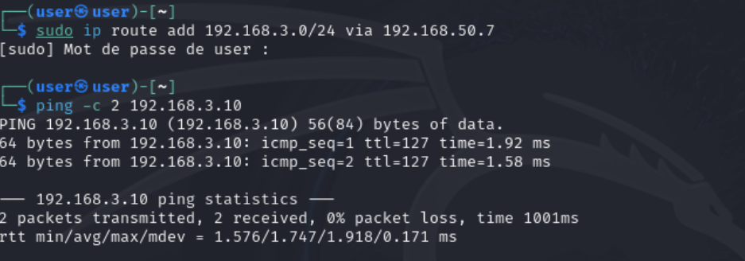
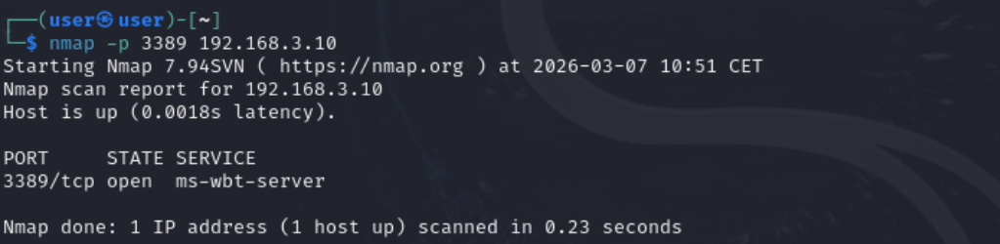
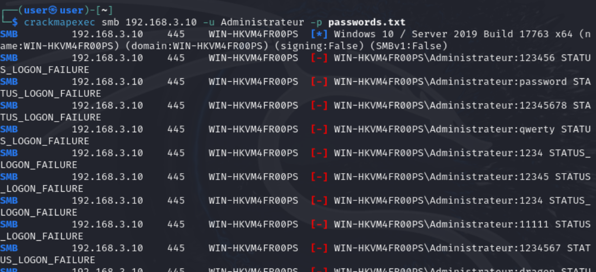
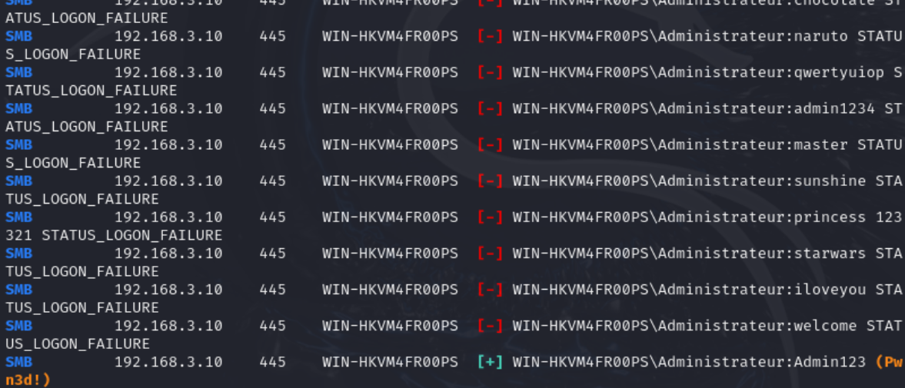

# Phase 2 - Mouvement Latéral et Compromission d'Identifiants (Brute-Force)

**Environnement :** Home Lab virtuel sur Proxmox pour le projet Iron4Software — Formation Analyste SOC - CyberUniversity (Liora x Sorbonne).

## Objectif du Lab
Après avoir obtenu un accès initial sur la zone exposée (Serveur Web), l'objectif de l'attaquant est de s'étendre vers le cœur du réseau (Mouvement Latéral) pour compromettre la cible de haute valeur : le Contrôleur de Domaine Windows Server 2019. Cette étape vise à exploiter la permissivité du pare-feu interne et à forcer l'authentification du compte Administrateur (Credential Access). Sur le plan défensif, cette attaque frontale générera une volumétrie massive de journaux d'échecs d'authentification, matière première idéale pour la création de nos futures alertes SOC.

## Outils et Technologies
- **Système d'attaque :** Kali Linux.
- **Routage :** Manipulation de la table de routage Linux (`ip route`).
- **Outil de Brute-Force :** CrackMapExec (Interaction SMB).
- **Framework MITRE ATT&CK :** T1090 (Proxy / Pivot), T1110.001 (Brute Force: Password Guessing).

## 1. Mouvement Latéral : Le Routage vers le LAN (Exploitation de configuration)

Grâce à la découverte interne effectuée via le Reverse Shell, je connais désormais le plan d'adressage du réseau cible (`192.168.3.0/24`) et l'IP de ma cible principale (`192.168.3.10`). 

En temps normal, pour attaquer cette machine depuis mon Kali externe, je devrais déployer un proxy SOCKS complexe (via des outils comme Proxychains ou Chisel) pour faire transiter mes attaques à travers le serveur Ubuntu compromis. Cependant, lors des audits offensifs, il est crucial de tester d'abord les erreurs de configuration réseau basiques ("*Low-Hanging Fruits*").

Mon hypothèse de test : le pare-feu pfSense (`192.168.50.7`) possède peut-être une faille de filtrage (comme une règle WAN "Allow All") qui l'obligerait à router mon trafic directement vers le LAN sans me bloquer.

**Exécution de la commande :**
Depuis un terminal local sur Kali Linux, j'ajoute manuellement une route pour forcer mon trafic à destination du réseau interne à utiliser l'IP publique du pare-feu comme passerelle :
```bash
sudo ip route add 192.168.3.0/24 via 192.168.50.7
```


### Analyse "Sous le capot" :
Cette commande modifie la table de routage du noyau Linux de ma machine d'attaque Kali. Elle stipule que tout paquet destiné au sous-réseau `192.168.3.0/24` (le LAN de l'entreprise) ne doit pas être envoyé à ma passerelle par défaut, mais directement à `192.168.50.7` (l'interface WAN du pfSense). 

### Validation de la faille :
En tentant d'atteindre le serveur Windows depuis Kali suite à cette commande avec un simple `ping -c 2 192.168.3.10`, le succès de la connexion prouve que mon hypothèse était exacte. Le pfSense est mal configuré : ne filtrant pas le trafic entrant de manière stricte (règle permissive totale), il se comporte comme un simple routeur et transfère docilement mes paquets offensifs vers les serveurs internes. C'est une illustration parfaite d'un contournement périmétrique par simple erreur de configuration humaine, m'évitant la mise en place d'un proxy.

## 2. Confirmation de la Cible et Validation du Vecteur RDP (MITRE T1046)

Maintenant que la machine d'attaque Kali "voit" le réseau interne grâce à la manipulation de la table de routage, je dois m'assurer que le service cible (Bureau à Distance) est bien accessible avant de lancer mon attaque d'authentification. L'objectif final étant de prendre le contrôle graphique du serveur, la confirmation de l'ouverture du port RDP est un prérequis tactique.

**Exécution de la commande :**
Je lance un scan réseau minimaliste et chirurgical, ciblant uniquement le port 3389 (RDP) du Contrôleur de Domaine depuis mon terminal Kali externe :
```bash
nmap -p 3389 192.168.3.10
```


### Analyse "Sous le capot" :
Le scan retourne immédiatement un statut `open` pour le port 3389. Techniquement, cette simple ligne de résultat valide l'exploitation de deux failles architecturales distinctes. Premièrement, elle confirme que le routage bidirectionnel via l'IP WAN du pfSense est fonctionnel. Deuxièmement, et c'est le point critique, elle prouve que le pare-feu local du système d'exploitation cible (Windows Defender Firewall) est totalement inactif. C'est le fruit de la vulnérabilité volontairement introduite lors de la Phase 1. Sans cette erreur de configuration interne, même avec un pfSense permissif, le pare-feu Windows aurait nativement bloqué une requête RDP provenant d'un sous-réseau inconnu.

> **Contexte SOC & Blue Team (Défense en profondeur) :**
> Ce balayage réseau (Network Service Scanning) illustre tragiquement l'échec d'une architecture sans "Défense en Profondeur" (Defense in Depth). Le périmètre (pfSense) ayant cédé, la sécurité de l'hôte (Endpoint) aurait dû prendre le relais. Dans la réalité opérationnelle d'un SOC, l'accès au port RDP d'un serveur d'infrastructure critique doit être strictement restreint par des listes de contrôle d'accès (ACLs) aux seules adresses IP des bastions d'administration (Jump Hosts). Lors de la Phase 3 (Durcissement), la réactivation et la configuration stricte de ce pare-feu local seront nos priorités.

## 3. L'Attaque par Force Brute (MITRE T1110.001)

Suite à la confirmation que le port 445 (SMB) était ouvert lors de ma phase de prise d'empreinte (Fingerprinting), je sais que le Contrôleur de Domaine (`192.168.3.10`) expose son service de partage de fichiers et d'administration à distance. C'est un vecteur d'attaque idéal. Il faut quand même connaître le mot de passe de l'administrateur pour accéder à la machine cible. J'ai donc lancé une attaque par force brute ciblée sur le compte par défaut `Administrateur` (typique des installations Windows francophones) en utilisant un dictionnaire de mots de passe personnalisé.

**Exécution de la commande :**
Afin de contourner la lenteur et l'instabilité du protocole RDP face aux connexions automatisées, j'ai privilégié le protocole SMB, beaucoup plus robuste et rapide pour ce type d'attaque. J'utilise l'outil offensif standard `crackmapexec` :
```bash
crackmapexec smb 192.168.3.10 -u Administrateur -p passwords.txt
```



### Analyse "Sous le capot" :
L'outil `crackmapexec` n'est pas qu'un simple testeur de mots de passe. Il initie des requêtes d'authentification SMB natives (`NTLMSSP`) à une vitesse fulgurante . À chaque tentative erronée, le serveur Windows répond par un code d'erreur `STATUS_LOGON_FAILURE`. L'outil itère sur le fichier texte jusqu'à recevoir un jeton d'accès valide. Surtout, il vérifie automatiquement si les identifiants trouvés octroient des droits d'administration locaux ou de domaine sur la cible.

### Troubleshooting et Résultats (La faille humaine) :
Dans un environnement Windows Server 2019 standard, cette attaque aurait dû échouer lamentablement. La "Stratégie de verrouillage du compte" native (Account Lockout Policy) bloque l'utilisateur après quelques tentatives ratées, déclenchant un `STATUS_ACCOUNT_LOCKED_OUT` qui stoppe net le brute-force. 

Cependant, l'attaque a ici réussi après 34 tentatives infructueuses, l'outil affichant un succès explicite avec le tag `(Pwn3d!)` à la 35ème ligne pour le mot de passe `Admin123`. Ce tag confirme que le compte possède bien les privilèges administratifs complets sur la machine. 
Cette réussite met en lumière une faille de configuration humaine critique simulée dans ce Lab : pour des raisons de prétendue "facilité d'utilisation" pour la direction, la politique de verrouillage avait été délibérément désactivée (Seuil fixé à 0). La forteresse numérique est tombée à cause d'une négligence de processus, rendant caduque la robustesse native de l'OS.

> **Contexte SOC & Blue Team :**
> Le succès opérationnel de l'attaquant est paradoxalement positif pour l'analyste SOC. Les 34 tentatives erronées en quelques millisecondes ont généré exactement 34 événements de sécurité Windows distincts (Event ID 4625 - Échec d'ouverture de session), suivis d'un événement de succès (Event ID 4624 - Logon Type 3 - Accès Réseau). Cette signature temporelle ultra-condensée est l'empreinte digitale exacte et indéniable d'une attaque par force brute. Je m'appuierai sur cette volumétrie brute lors de la Phase 4 pour paramétrer mon alerte SIEM Splunk avec une règle de corrélation temporelle (ex: > 10 échecs d'authentification vers la même cible en moins de 1 minute). De plus, l'analyse détaillée de ces événements 4625 révélera que le Package d'Authentification (Authentication Package) utilisé est NTLM. C'est une signature caractéristique des outils d'attaque réseau comme CrackMapExec, qui me permettra d'affiner mes requêtes Splunk pour écarter les faux positifs liés à d'autres protocoles (comme Kerberos).

---
*Fin du rapport de Lab.*