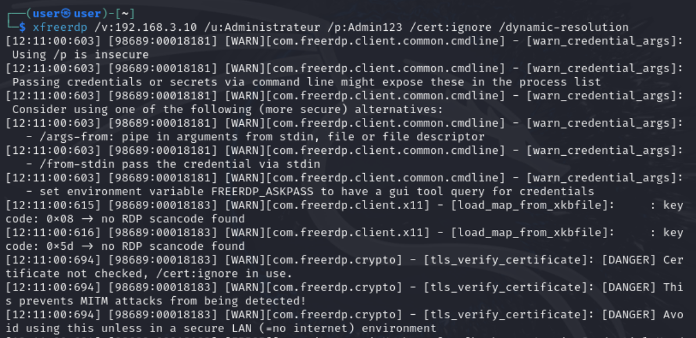
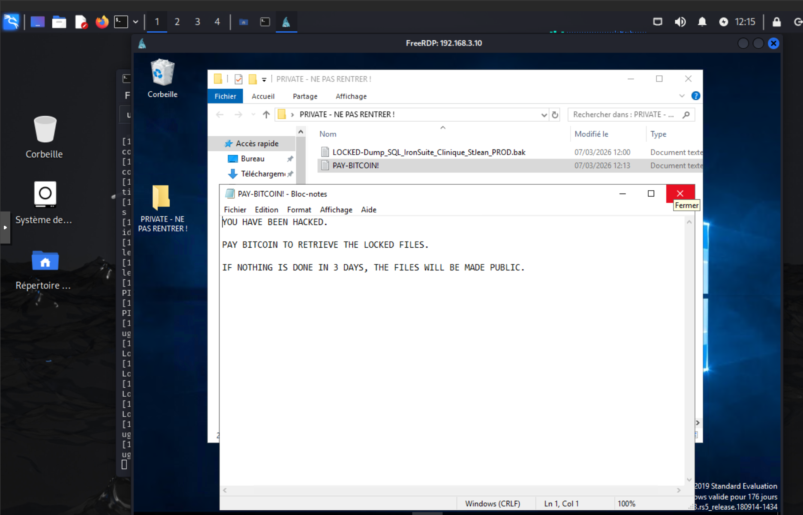

# Phase 2 - Action sur les Objectifs (Exfiltration et Ransomware)

**Environnement :** Home Lab virtuel sur Proxmox pour le projet Iron4Software — Formation Analyste SOC - CyberUniversity (Liora x Sorbonne).

## Objectif du Lab
La phase de mouvement latéral ayant permis d'obtenir les identifiants de l'Administrateur du domaine, la dernière étape de l'audit offensif consiste à accomplir l'objectif final (*Action on Objectives*). Je vais utiliser l'accès légitime compromis pour me connecter au serveur cible, localiser des données critiques (ici, des données de santé soumises au RGPD), exfiltrer ces informations, puis simuler le déploiement d'un Ransomware (chiffrement et demande de rançon). Cette action laissera des traces indélébiles dans les journaux Windows (connexions interactives, manipulation de fichiers) qui seront exploitées en Phase 4.

## Outils et Technologies
- **Système d'attaque :** Kali Linux.
- **Client RDP :** xfreerdp (FreeRDP).
- **Cible :** Windows Server 2019 (Contrôleur de Domaine).
- **Framework MITRE ATT&CK :** T1078 (Valid Accounts), T1048 (Exfiltration Over Alternative Protocol), T1486 (Data Encrypted for Impact).

## 1. Accès Graphique via Bureau à Distance (MITRE T1078)

L'attaque par force brute SMB ayant révélé le mot de passe `Admin123`, et le balayage réseau précédent ayant confirmé que le port 3389 était ouvert, j'utilise ces informations pour initier une session graphique interactive sur le serveur cible.

**Exécution de la commande :**
Depuis Kali Linux, je lance le client RDP :
```bash
xfreerdp /v:192.168.3.10 /u:Administrateur /p:Admin123 /cert:ignore /dynamic-resolution
```


### Analyse "Sous le capot" :
Cette commande établit un tunnel RDP direct vers le port 3389 du serveur Windows. Le paramètre `/cert:ignore` permet de contourner les avertissements liés aux certificats auto-signés du serveur interne. Puisque la règle de pare-feu pfSense (WAN Allow All) autorise le routage direct et que le pare-feu local de Windows est désactivé, la connexion traverse l'infrastructure sans encombre et m'octroie le contrôle total (clavier/souris) du Contrôleur de Domaine, avec les plus hauts privilèges.

> **Contexte SOC & Blue Team :**
> Cette connexion est un événement critique. Dans le SIEM, cela se traduira par un événement Windows **Event ID 4624 (Logon Success)** avec un **Logon Type 10** (RemoteInteractive / RDP). La corrélation de cet événement de succès interactif juste après l'avalanche d'échecs réseau (Event ID 4625) vus à l'étape précédente est la signature absolue d'une attaque par force brute réussie ayant mené à une compromission visuelle du serveur.

## 2. Simulation d'Impact : Exfiltration et Ransomware (MITRE T1048 & T1486)

Une fois sur le bureau du serveur, j'explore l'environnement et découvre un dossier nommé `PRIVATE - NE PAS RENTRER !`. Ce dossier illustre une grave négligence dans la gestion des droits d'accès et du stockage des données.

**Exécution et Résultats :**
À l'intérieur de ce répertoire, j'identifie un fichier critique : un dump de base de données de production d'un client du secteur de la santé (`Dump_SQL_IronSuite_Clinique_StJean_PROD.bak`). Je procède à la simulation de l'attaque de "double extorsion" :

1. **Exfiltration :** Avant toute action destructrice, je copie discrètement ce fichier vers ma machine Kali Linux via le canal de communication RDP (presse-papiers ou partage de lecteur virtuel). C'est ce vol de données qui donne du poids à la menace de publication.
2. **Chiffrement :** Le fichier original sur le serveur est prétendument chiffré et renommé avec une extension caractéristique de ransomware : `LOCKED-Dump_SQL_IronSuite_Clinique_StJean_PROD.bak`.
3. **Note de rançon :** Un fichier texte nommé `PAY-BITCOIN!` est créé à côté des données compromises. Il contient un message explicite assumant la double extorsion : *"YOU HAVE BEEN HACKED. PAY BITCOIN TO RETRIEVE THE LOCKED FILES. IF NOTHING IS DONE IN 3 DAYS, THE FILES WILL BE MADE PUBLIC."*



> **Contexte SOC & Blue Team :**
> L'altération de fichiers sensibles peut être détectée par le SOC si l'audit d'accès aux objets (*File System Auditing* - **Event ID 4663**) est activé. Toutefois, ce journal générant un bruit extrêmement important à l'échelle d'un disque, il doit être activé de manière chirurgicale, uniquement sur les répertoires critiques (comme ce dossier "PRIVATE"). La création d'extensions inattendues (`.locked`) ou de notes de rançon sont alors des Indicateurs de Compromission (IoC) majeurs. 
> De plus, l'exfiltration a été rendue possible par les fonctionnalités natives de partage du presse-papiers (*Clipboard Sync*) et de redirection de lecteurs virtuels de RDP. Lors de notre future phase de durcissement (Hardening), l'une des priorités sera de bloquer ces canaux d'exfiltration par défaut via des Stratégies de Groupe (GPO) strictes.

## Conclusion de la Phase 2 (Audit Offensif)
L'audit offensif est terminé. En exploitant une chaîne de vulnérabilités allant d'une faille applicative (Upload PHP) à des défauts d'architecture (Routage permissif) et de durcissement (Politique de verrouillage désactivée, mots de passe faibles, pare-feu inactif), l'infrastructure "Vulnerable-by-Design" a été intégralement compromise. L'entreprise fictive fait face à un incident majeur impliquant des données de santé (RGPD). 

La matière première (les logs d'attaque) est désormais générée dans les journaux Windows et Apache. La prochaine étape du projet consistera à basculer du côté de la défense pour analyser ces traces dans Splunk et durcir drastiquement l'infrastructure.

---
*Fin du rapport de Lab.*