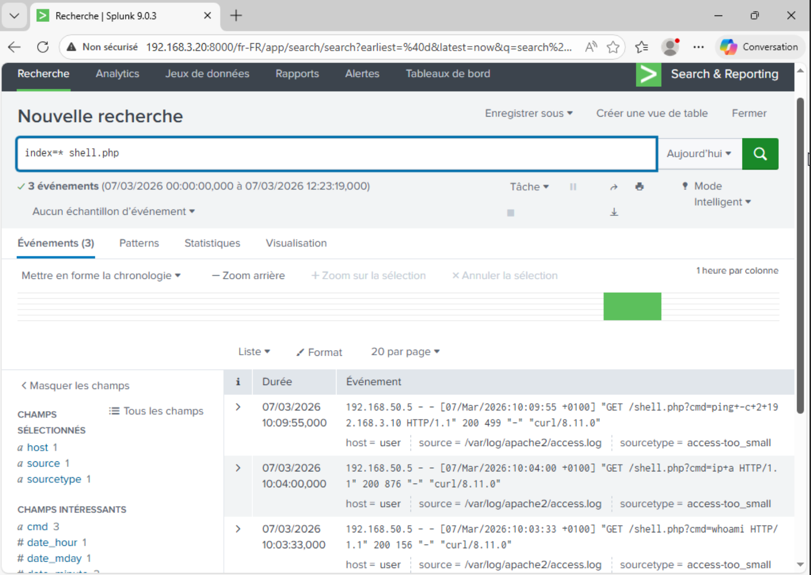
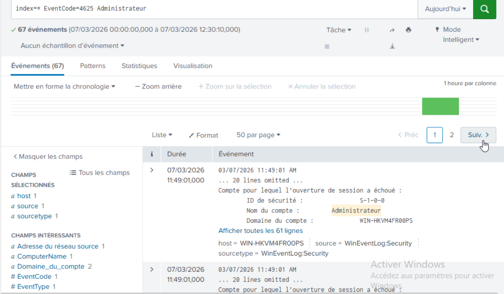
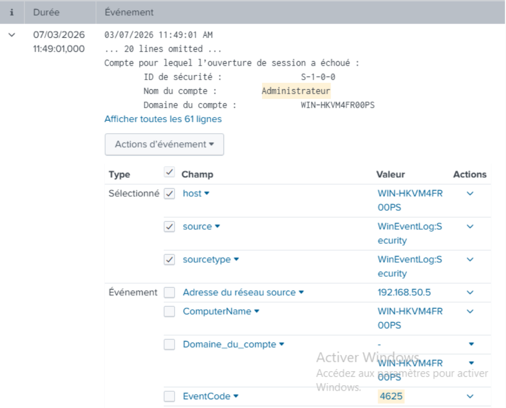
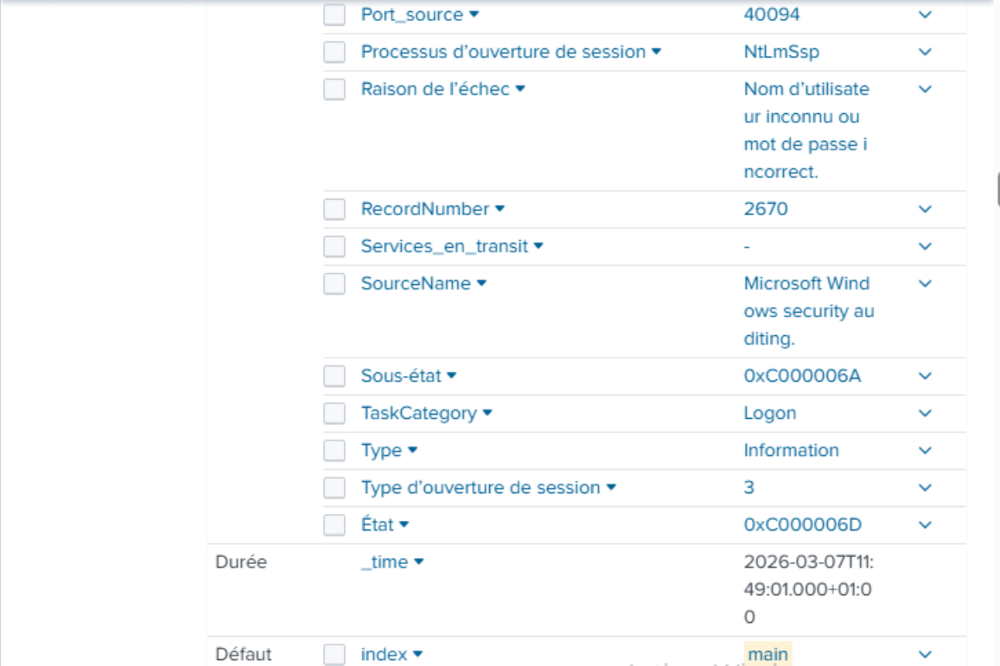
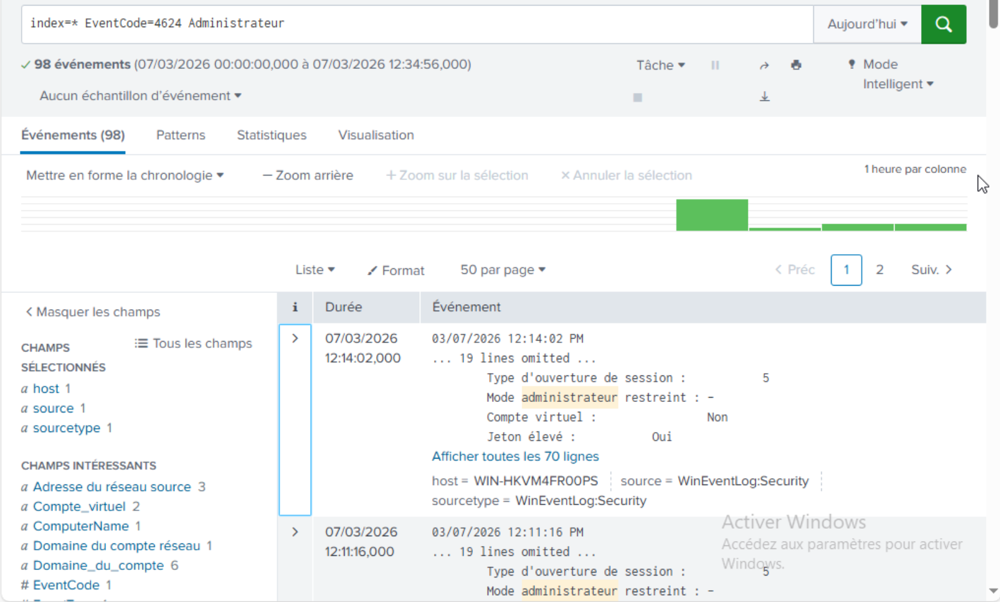
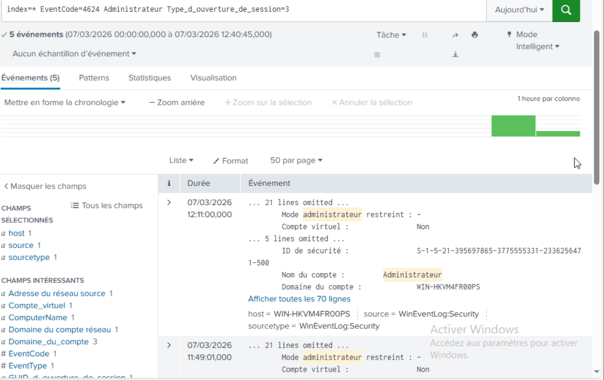
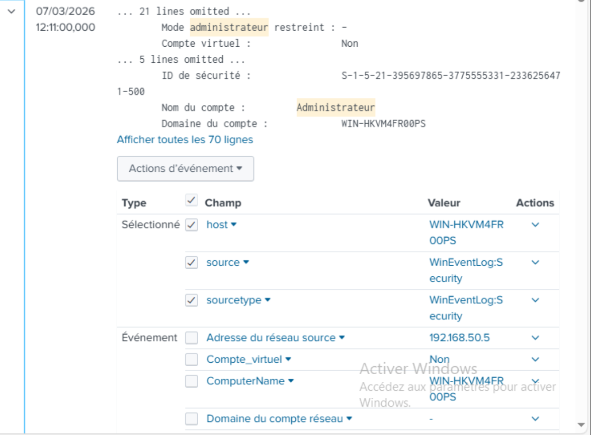
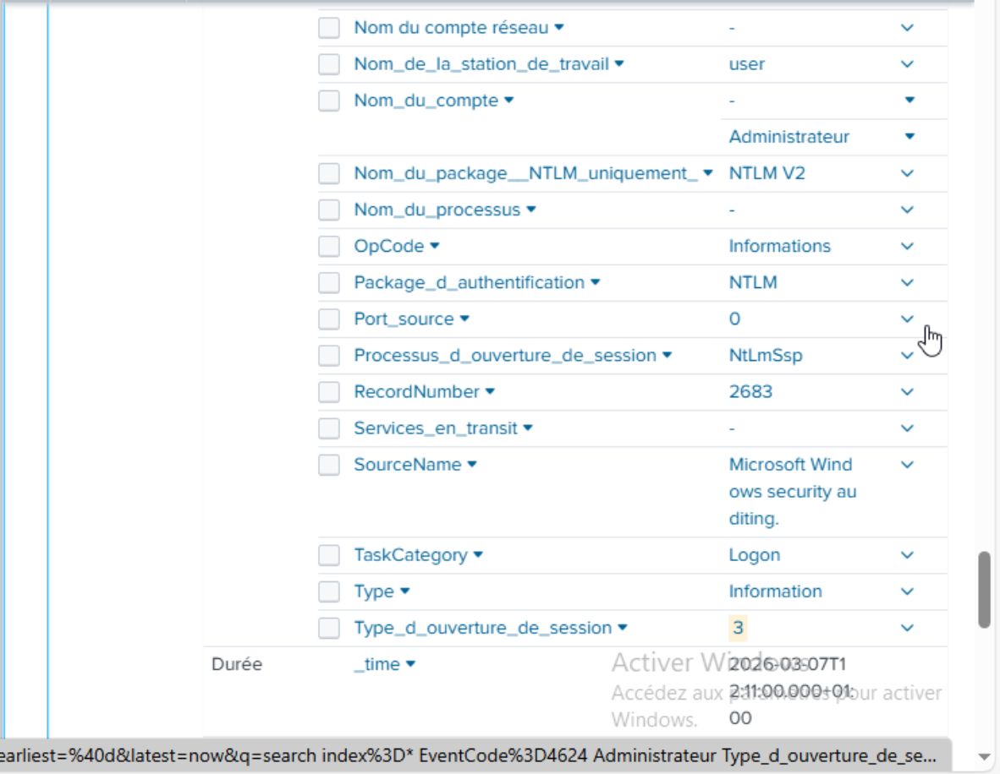

# Phase 2 - Bilan Défensif : Analyse des Logs et Constat d'Échec (Blue Team)

**Environnement :** Home Lab virtuel sur Proxmox pour le projet Iron4Software — Formation Analyste SOC - CyberUniversity (Liora x Sorbonne).

## Objectif du Bilan
L'audit offensif (Red Team) a abouti à la compromission totale du domaine et à la simulation d'un ransomware. L'objectif de ce document de clôture de la Phase 2 est de basculer du côté défensif (Blue Team) pour effectuer un premier constat d'investigation (Threat Hunting) dans notre SIEM Splunk. Il s'agit de démontrer que l'infrastructure a parfaitement joué son rôle de générateur de télémétrie, mais que l'absence cruelle d'ingénierie de détection a rendu le SOC totalement aveugle face à l'attaque en cours.

## 1. La Trace de l'Accès Initial (Webshell)

L'attaquant a utilisé des requêtes HTTP GET pour exécuter des commandes via le fichier `shell.php`. L'agent Splunk Universal Forwarder installé sur le serveur Ubuntu ayant été configuré pour surveiller les journaux d'accès Apache, ces actions ont laissé une empreinte indélébile.

**La requête Splunk (SPL) :**
```spl
index=* shell.php
```



**Optimisation SOC (Hygiène SPL) :**
Bien que la recherche globale ait fonctionné pour l'investigation, faire un `index=*` en production consomme énormément de ressources SIEM. Pour industrialiser cette détection (créer une alerte), la requête optimisée stricte doit cibler le bon type de source :
```spl
index=* sourcetype=access_combined shell.php
```

**Analyse des preuves (Findings) :**
Les résultats de recherche affichent clairement les charges utiles injectées dans l'URL. On observe distinctement les commandes `cmd=whoami`, `cmd=ip+a` ainsi que les tentatives de ping (`cmd=ping+-c+2+192.168.3.10`). C'est la preuve médico-légale absolue d'une Exécution de Code à Distance (RCE).

## 2. Détection du Mouvement Latéral : L'Orage du Brute-Force

L'outil `crackmapexec` a bombardé le serveur Windows de dizaines de mots de passe erronés via le protocole SMB. Windows a généré un événement de sécurité d'échec pour chacune de ces tentatives, fidèlement remonté par le forwarder local.

**La requête Splunk (SPL) :**
```spl
index=* EventCode=4625 Administrateur
```



**Optimisation SOC (Hygiène SPL) :**
Pour transformer cette investigation en une règle de détection performante sans surcharger les Indexers Splunk, j'affine la requête en spécifiant le journal de sécurité Windows, et j'ajoute le type de connexion réseau (Logon_Type=3) ainsi que le package d'authentification NTLM utilisé par CrackMapExec :
```spl
index=* sourcetype="WinEventLog:Security" EventCode=4625 Administrateur Logon_Type=3 Authentication_Package=NTLM
```

**Analyse des preuves (Findings) :**
Cette recherche révèle une volumétrie anormale d'événements **Event ID 4625** (Échec d'ouverture de session) concentrés sur un laps de temps extrêmement court. 
* **Cible :** `Nom du compte : Administrateur`.




* **Raison de l'échec :** `Nom d'utilisateur inconnu ou mot de passe incorrect`.


* **L'indicateur clé (IoC) :** Le champ `Type d'ouverture de session` indique la valeur **3**. Un Type 3 signifie "Network Logon" (Connexion réseau). Cela prouve formellement que l'attaque provenait du réseau (via SMB) et non d'un utilisateur tapant physiquement sur le clavier du serveur (qui aurait généré un Type 2).




## 3. Validation de la Compromission : Le Succès de l'Intrusion

À la 35ème tentative, l'outil offensif a trouvé le mot de passe `Admin123`. Cela s'est traduit par un événement de succès de connexion dans les journaux Windows.

**La requête Splunk (SPL) initiale :**
```spl
index=* EventCode=4624 Administrateur
```

**Le piège de l'analyste (False Positives) :**
Cette requête brute retourne un océan de logs (98 événements). En examinant les premiers résultats, on observe un `Type d'ouverture de session : 5`. Dans le langage Windows, un Type 5 correspond à un service système légitime qui démarre en arrière-plan. Bien que lié au compte Administrateur, ce n'est pas la trace directe de l'intrusion.



**La requête Splunk (SPL) affinée et Optimisée :**
Pour isoler la compromission réelle, il faut filtrer le bruit système en cherchant spécifiquement l'authentification réseau de l'attaquant. C'est ici que l'hygiène de recherche SPL prend tout son sens. Pour isoler cet événement parmi les milliers de logs système (et économiser de la puissance de calcul), je contrains la recherche au sourcetype de sécurité et au Logon Type réseau :
```spl
index=* sourcetype="WinEventLog:Security" EventCode=4624 Administrateur Logon_Type=3
```

**Analyse des preuves (Findings) :**
Le filtre permet d'isoler l'événement exact confirmant la réussite de l'attaque. On y retrouve l'adresse IP source de la machine Kali de l'attaquant (`192.168.50.5`), validant techniquement le succès final de `crackmapexec`.





## 4. Gravité de l'Incident et Constat Architectural

Les preuves du piratage dormaient sagement dans la base de données de Splunk, mais l'attaque a réussi dans un silence absolu. Ce constat met en exergue les failles architecturales volontairement laissées en Phase 1 :
1. **L'indexation plate :** J'ai maintenu un niveau de bruit élevé (tous les logs dans l'index principal). Les alertes critiques (4625) ont été noyées sous les logs de succès systèmes (4624 Type 5).
2. **L'absence de règles de corrélation :** Le SIEM a agi comme un simple "log dump". Sans ingénierie de détection pour repérer l'orage d'échecs temporels (Brute-Force), la donnée est inutile pour la réponse à incident.

## Conclusion et Transition vers la Phase 3
La télémétrie fonctionne parfaitement, mais la posture de sécurité de l'entreprise est défaillante. La matière première est là, confirmant l'urgence d'une refonte défensive. 
La Phase 3 (Durcissement) consistera à corriger les vulnérabilités exploitées (chiffrement des flux Splunk, réactivation du pare-feu Windows, politique de verrouillage de compte stricte). La Phase 4 s'attaquera au cœur du problème soulevé par ce bilan : la création de tableaux de bord et d'alertes Splunk de haute fidélité pour que le SOC ne soit plus jamais aveugle.

---
*Fin du rapport de Lab.*