# Phase 4 - Mise en Place du SOC : Supervision et Détection (SIEM Splunk)

**Environnement :** Home Lab virtuel sur Proxmox pour le projet Iron4Software — Formation Analyste SOC - CyberUniversity (Liora x Sorbonne).

## Objectif du Lab
La Phase 3 a transformé l'infrastructure d'une cible ouverte en une forteresse supervisée. Le périmètre est verrouillé, les hôtes sont durcis, et le pipeline de logs transite désormais via un tunnel TLS. Mais un SIEM sans règles de détection reste un cimetière de logs — c'est exactement le constat que j'avais formulé à l'issue de la Phase 2.

L'objectif de cette phase est de transformer splunk en capacité de détection opérationnelle. Je vais créer trois alertes de haute fidélité, chacune ancrée dans une vulnérabilité réelle exploitée en Phase 2, et les centraliser dans un tableau de bord SOC donnant une vue stratégique instantanée sur l'état de l'infrastructure Iron4Software. Cette phase illustre également un aspect fondamental du travail d'analyste SOC : la nécessité de diagnostiquer et corriger des angles morts de visibilité avant de pouvoir détecter quoi que ce soit.

## Outils et Technologies
- **SIEM :** Splunk Enterprise (Search Processing Language — SPL).
- **Sources de logs :** `WinEventLog:Security` (Windows Server 2019), `syslog` (pfSense via UDP).
- **Event IDs surveillés :** 4625 (Échec d'authentification), 4663 (Accès à un objet), 4624 (Succès d'authentification).
- **Diagnostic réseau :** `tcpdump` (Ubuntu Splunk), Nmap (Kali), pfSense Firewall Logs.
- **Visualisation :** Splunk Classic Dashboard (Stats Table, Pie Chart, Single Value).
- **Framework MITRE ATT&CK :** T1110.001 (Brute Force — détection), T1486 (Data Encrypted for Impact — détection), T1595 (Active Scanning — détection).

## 1. Vérification de la Télémétrie Existante

Avant de créer la moindre alerte, je dois m'assurer que la matière première est bien présente dans Splunk. Les logs générés lors de l'audit offensif de la Phase 2 constituent une base de test idéale : ils représentent des attaques réelles que le SIEM doit maintenant être capable de signaler automatiquement.

Je lance la recherche de base pour valider la remontée des échecs d'authentification :

```spl
index=main host="WIN-HKVM4FR00PS" sourcetype="WinEventLog:Security" EventCode=4625
```

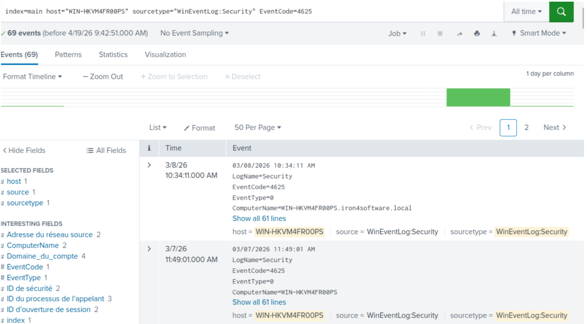

La recherche retourne 69 événements, dont les plus anciens datent des tests offensifs de la Phase 2. Ces logs sont la preuve que l'infrastructure de collecte fonctionne correctement et que le tunel TLS mis en place en Phase 3 ne perturbe pas l'indexation.

> **Contexte SOC & Blue Team :**
> La précision du `sourcetype="WinEventLog:Security"` est délibérée et non optionnelle. L'EventCode 4625 est partagé par plusieurs sources Windows : dans le journal `WinEventLog:Application`, il peut correspondre à des messages d'initialisation de services système (Microsoft-Windows-EventSystem). Sans ce filtre, les résultats seraient pollués par des faux positifs qui réduiraient la fidélité de toute alerte construite dessus.

## 2. Alerte 1 — Détection de Brute-Force (EventCode 4625)

### Logique de détection

En Phase 2, CrackMapExec a généré 34 échecs d'authentification en quelques secondes avant d'obtenir le mot de passe au 35ème essai. La GPO configurée en Phase 3 verrouille désormais le compte après 5 tentatives. Ces deux éléments définissent ensemble le seuil de déclenchement de l'alerte : plus de 5 échecs sur une fenêtre de 15 minutes constituent une signature de brute-force indéniable.

### Configuration dans Splunk

Depuis la recherche active, je clique sur `Save As > Alert` et configure les paramètres suivants :

```spl
index=main host="WIN-HKVM4FR00PS" sourcetype="WinEventLog:Security" EventCode=4625
```

- **Title :** `[Iron4Software] Alerte Brute Force Windows Detected`
- **Alert Type :** Scheduled
- **Time Range :** Last 15 minutes
- **Cron Schedule :** `*/5 * * * *`
- **Trigger Condition :** Number of Results is greater than 5
- **Expires :** 24h
- **Trigger Actions :** Add to Triggered Alerts

### Analyse des paramètres

Le choix du `Cron Schedule` à `*/5 * * * *` plutôt qu'une planification horaire est un choix tactique. Un attaquant peut tester des centaines de mots de passe en moins de deux minutes. Une alerte qui ne se déclenche qu'à l'heure suivante n'a aucune valeur opérationnelle — la compromission serait déjà consommée. Avec une vérification toutes les 5 minutes, l'alerte tombe presque simultanément au verrouillage du compte par la GPO, laissant à l'analyste SOC le temps d'identifier l'IP source et d'isoler la machine avant que l'attaquant ne pivote vers un autre compte cible.

Le mode `Trigger: Once` est également un choix réfléchi. Configurer `For each result` générerait une alerte par ligne de log, soit potentiellement des dizaines de notifications pour un seul incident, ce qui saturerait la file d'alertes et noierait le signal dans le bruit — l'exact opposé de ce qu'un SOC cherche à construire.

La configuration finale de l'alerte est visible dans l'interface Splunk : `Enabled: Yes`, `Alert Type: Scheduled. Cron Schedule`, `Trigger Condition: Number of Results is > 5`, `Actions: Add to Triggered Alerts`.

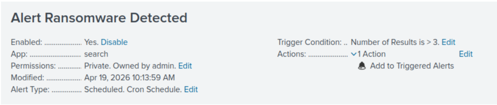

> **Contexte SOC & Blue Team :**
> Cette alerte est l'illustration directe de la synergie entre durcissement et détection. Avant la Phase 3, l'attaquant pouvait tester des milliers de mots de passe sans être bloqué ni signalé. Après le durcissement : Windows verrouille le compte à 5 échecs (Event ID 4740) et Splunk lève l'alerte au même moment. La corrélation de ces deux événements en Phase 4 — l'avalanche de 4625 suivie d'un 4740 — est la signature absolue d'une attaque par dictionnaire réussie ou en cours, exploitable immédiatement par l'analyste.

## 3. Alerte 2 — Détection d'Activité Ransomware sur Données Sensibles (EventCode 4663)

### Logique de détection

En Phase 2, le ransomware simulé a renommé et chiffré les fichiers du dossier `PRIVATE` sans déclencher la moindre alerte. La raison était simple : l'audit du système de fichiers n'était pas configuré. La Phase 3 a corrigé cela en activant la GPO d'audit et en ciblant chirurgicalement le dossier `C:\PRIVATE - NE PAS RENTRER !` pour générer l'Event ID 4663 sur toute opération d'écriture ou de suppression.

Cette alerte est le produit direct de ce travail de préparation.

### Vérification de la télémétrie avant création

Je lance la requête de test pour vérifier que les opérations réalisées sur le dossier pendant la phase de validation (création et suppression de fichiers de test) ont bien généré des logs :

```spl
index=main sourcetype="WinEventLog:Security" EventCode=4663
(Accès="DELETE" OR Accès="Écriture données (ou ajout fichier)"
OR Accès="Ajout données (ou ajout sous-répertoire ou créer instance de canal)")
```

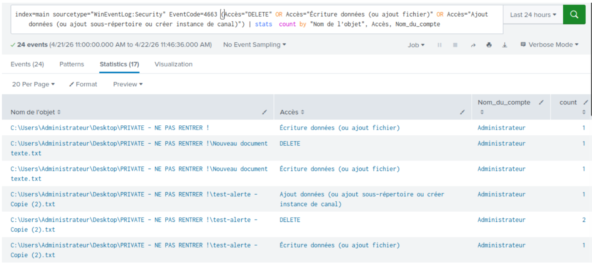

La recherche retourne 24 événements répartis en trois types d'accès : 11 opérations `DELETE` (45,8%), 9 opérations d'écriture de données (37,5%) et 4 opérations d'ajout (16,7%). Le détail d'un événement individuel confirme la richesse forensique du log : `Nom du compte : Administrateur`, `Domaine du compte : IRON4SOFTWARE`, `Nom de l'objet : C:\Users\Administrateur\Desktop\PRIVATE - NE PAS RENTRER !\test-alerte - Copie (4).txt`. Chaque accès est tracé avec le compte, l'objet concerné et l'horodatage précis.

### Configuration dans Splunk

Depuis la recherche active, je clique sur `Save As > Alert` et configure les paramètres suivants :

```spl
index=main sourcetype="WinEventLog:Security" EventCode=4663
(Accès="DELETE" OR Accès="Écriture données (ou ajout fichier)"
OR Accès="Ajout données (ou ajout sous-répertoire ou créer instance de canal)")
```

- **Title :** `Alert Ransomware Detected !` 
- **Alert Type :** Scheduled
- **Time Range :** Last 15 minutes
- **Cron Schedule :** `*/5 * * * *`
- **Trigger Condition :** Number of Results is greater than 2
- **Expires :** 24h
- **Trigger Actions :** Add to Triggered Alerts

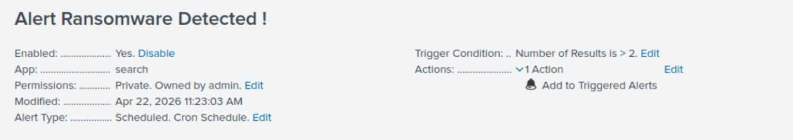

### Analyse du seuil

Le seuil de déclenchement est fixé à 2 et non à 0 pour une raison précise : une manipulation de fichier isolée (une copie, une sauvegarde manuelle) peut légitimement toucher un fichier du dossier et générer un 4663. Deux événements sur une fenêtre de 15 minutes commencent à ressembler à une activité systématique. En environnement de production, ce seuil serait affiné par une analyse comportementale du volume normal d'opérations sur le dossier, mais pour ce lab il représente un équilibre acceptable entre sensibilité et précision.

> **Contexte SOC & Blue Team :**
> La granularité des informations contenues dans l'Event ID 4663 est particulièrement précieuse pour la réponse à incident. Le nom exact du fichier accédé, le compte ayant effectué l'opération et l'horodatage permettent de construire immédiatement une timeline d'attaque dans Splunk. En Phase 7 (Analyse Forensique), ce sera précisément ce type de log qui permettra de reconstituer la séquence d'actions du ransomware fichier par fichier.

## 4. Troubleshooting : Visibilité des Logs pfSense dans Splunk

### Le problème initial

Après avoir sécurisé la détection sur les hôtes Windows, je commence à créer la troisième alerte — la détection des tentatives de reconnaissance et d'intrusion sur l'interface WAN. Je suppose que les logs pfSense remontent déjà dans Splunk via Syslog. Ce n'est pas le cas.

Malgré les scans répétés depuis la machine Kali (statut `filtered` retourné par Nmap, preuve que le pfSense bloque bien), aucun log n'apparaît dans Splunk. Le SIEM est aveugle face à l'activité sur le périmètre réseau.

### Phase de diagnostic (Pull-Threading)

**Étape 1 — Vérification côté réception (Ubuntu Splunk) :**

Je lance un listener sur le port UDP 1514 sur la VM Splunk pour vérifier si des paquets Syslog arrivent effectivement :

```bash
sudo tcpdump -i any udp port 1514 -A
```

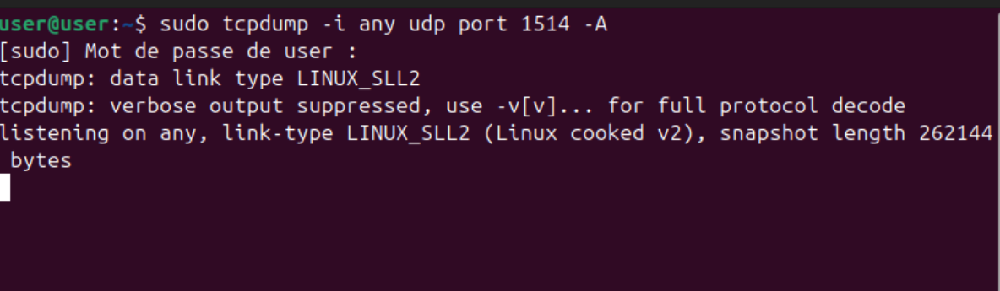

Résultat : aucun trafic. Le problème ne vient pas de la réception par Splunk mais de l'émission par pfSense. Le pipeline d'envoi n'est pas actif ou ne génère rien.

**Étape 2 — Vérification des journaux locaux pfSense :**

Je consulte `Status > System Logs > Firewall` directement sur l'interface pfSense. Aucune ligne concernant l'IP de la Kali (`192.168.50.5`) n'apparaît, malgré les scans répétés depuis cette machine.

**Étape 3 — Test de connectivité et identification de la cause racine :**

Je tente un ping depuis Kali vers l'interface WAN du pfSense (`192.168.50.7`). Résultat : 100% de perte de paquets, et toujours aucun log.

L'analyse de ce comportement mène au diagnostic : pfSense applique une règle de sécurité fondamentale appelée **Default Deny implicite**. Cette règle bloque tout ce qui n'est pas explicitement autorisé, mais elle le fait de manière **silencieuse** — sans générer le moindre log — pour économiser les ressources système et éviter de saturer les journaux avec du trafic non sollicité. C'est un comportement attendu et documenté de pfSense, mais il constitue un angle mort majeur pour un SOC.

### La solution : forcer la visibilité

La résolution nécessite de créer une règle explicite qui dit au pare-feu non seulement de bloquer le trafic de l'attaquant, mais aussi de l'**enregistrer**. En sécurité réseau, bloquer et loguer sont deux actions indépendantes.

Dans `Firewall > Rules > WAN`, j'ajoute une règle en tête de liste :

- **Action :** Block
- **Protocol :** Any
- **Source :** `192.168.50.5` (IP Kali)
- **Destination :** `192.168.3.10` (Contrôleur de Domaine)
- **Log :** Coché (`Log packets that are handled by this rule`)
- **Description :** `Surveillance attaquant kali (splunk)`

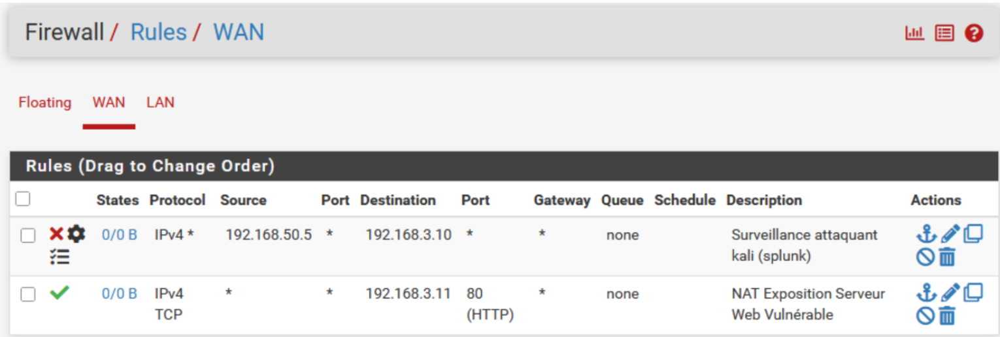

### Validation de la chaîne complète

Je relance un ping et un scan avec nmap depuis Kali. Les résultats arrivent simultanément sur les trois niveaux :

**Sur pfSense :** Les lignes rouges apparaissent enfin dans `Status > Firewall Logs` avec l'IP source `192.168.50.5`, confirmant que les paquets sont bien reçus et enregistrés.

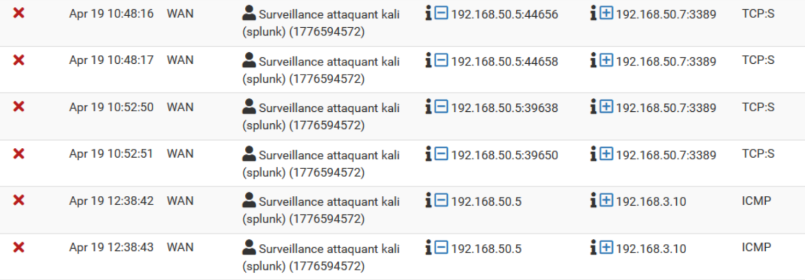

**Sur Ubuntu :** La commande `tcpdump` affiche instantanément le flux de logs Syslog en transit vers Splunk.

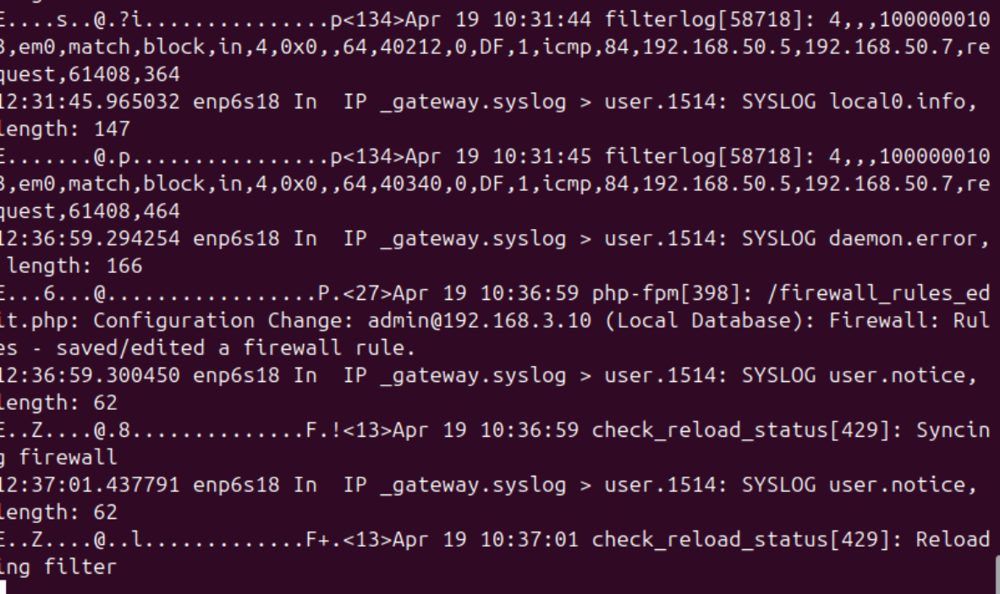

**Sur Splunk :** La recherche suivante retourne les événements :

```spl
index=main sourcetype="syslog" "192.168.50.5"
```

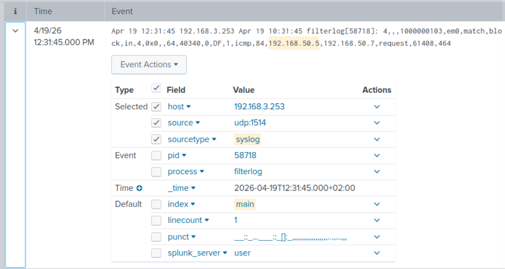

La boucle pfSense → Syslog → Splunk est bouclée.

> **Contexte SOC & Blue Team :**
> Ce troubleshooting illustre une distinction critique que tout analyste SOC doit intégrer : **un pare-feu qui bloque efficacement n'est pas nécessairement un pare-feu qui logue efficacement**. La règle Default Deny silencieuse de pfSense est une bonne pratique de performance, mais elle crée un angle mort de détection complet. En production, la configuration du logging sur les règles de blocage périmétrique est une décision d'architecture SOC autant que de sécurité réseau. Il faut également noter que les tentatives de scan vers l'IP interne (`192.168.3.10`) étaient bloquées si tôt par les mécanismes anti-spoofing du pfSense qu'elles ne pouvaient pas être loguées. La détection se fait donc sur l'interface WAN, ce qui est en réalité la position idéale : on intercepte l'attaquant dès sa première interaction avec le périmètre.

## 5. Alerte 3 — Détection d'Intrusion sur le WAN (pfSense Syslog)

### Logique de détection

Maintenant que les logs pfSense remontent dans Splunk, je peux créer l'alerte de détection de reconnaissance réseau. Toute activité de scan ou de tentative de connexion depuis l'IP de la machine Kali vers l'infrastructure, bloquée et loguée par pfSense, doit déclencher immédiatement une notification.

### Configuration dans Splunk

```spl
index=main sourcetype="syslog" "block"
```

- **Title :** `Intrusion detected on the WAN`
- **Alert Type :** Scheduled
- **Time Range :** Last 15 minutes
- **Cron Schedule :** `*/5 * * * *`
- **Trigger Condition :** Number of Results is greater than 0
- **Expires :** 24h
- **Trigger Actions :** Add to Triggered Alerts

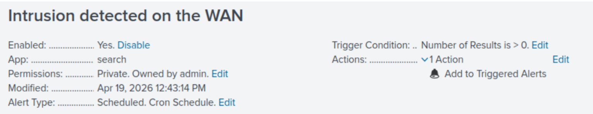

### Analyse du seuil

Contrairement aux deux alertes précédentes, le seuil ici est fixé à 0. Un seul paquet bloqué provenant de cette IP suffit à déclencher l'alerte, car dans un réseau correctement segmenté, aucune tentative de connexion depuis le WAN vers des ressources internes ne devrait jamais être considérée comme normale. Chaque occurrence est un signal d'investigation, même isolé.

La configuration finale de l'alerte est confirmée dans Splunk : `Enabled: Yes`, `Trigger Condition: Number of Results is > 0`, `Actions: Add to Triggered Alerts`.

> **Contexte SOC & Blue Team :**
> Cette alerte couvre la phase de reconnaissance (MITRE T1595 — Active Scanning), la toute première étape de la Cyber Kill Chain. En Phase 2, le scan Nmap initial avait généré des dizaines de milliers de requêtes TCP SYN en moins de deux minutes sans qu'aucune alerte ne soit levée. Avec cette configuration, la première requête bloquée depuis une IP non autorisée déclenche une notification dans les 5 minutes. L'analyste SOC est alerté avant même que l'attaquant ait eu le temps de terminer sa phase de cartographie.

## 6. Vérification des alertes
Avant de valider cette phase, je génère de la télémétrie contrôlée pour confirmer que les trois alertes se déclenchent effectivement dans les conditions attendues.

Pour l'alerte Brute-Force, je simule des tentatives d'authentification échouées en me trompant volontairement plusieurs fois sur le mot de passe du compte Administrateur lors d'une session RDP. Pour l'alerte WAN, je lance des pings et un scan Nmap depuis la machine Kali vers l'interface pfSense. Pour l'alerte Ransomware, je crée, modifie et supprime plusieurs fichiers `.txt` directement dans le dossier `PRIVATE - NE PAS RENTRER !` sur le Windows Server 2019.

Les trois alertes se déclenchent et apparaissent dans le menu Triggered Alerts de Splunk, confirmant que la boucle télémétrie → détection → notification est opérationnelle de bout en bout.

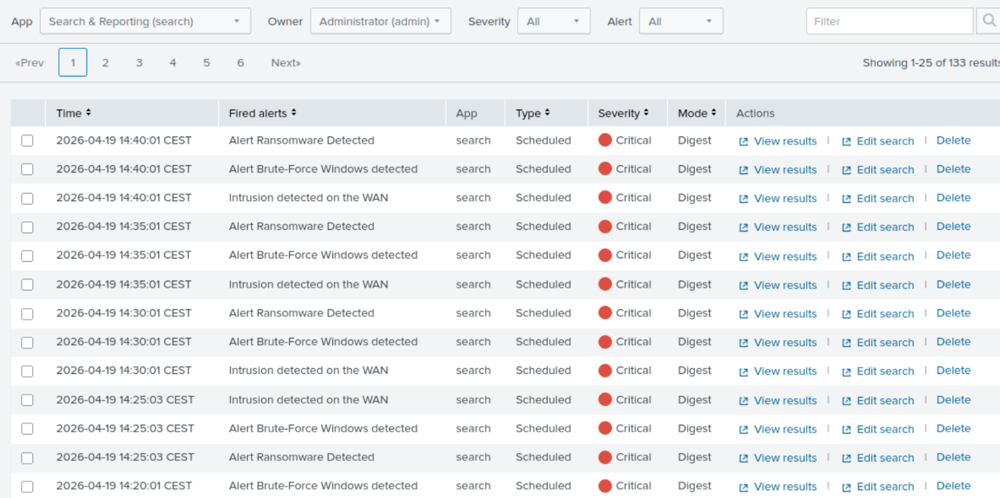

## 7. Dashboard "Iron4Software — SOC Supervision"

### Objectif et construction

Les trois alertes créées fonctionnent en mode réactif : elles notifient après détection. Le dashboard, lui, offre une vue proactive et permanente de l'état de l'infrastructure. Il permet à un responsable sécurité ou à un analyste en prise de poste de comprendre en un coup d'oeil si un incident est en cours, sans avoir à lancer manuellement des recherches SPL.

Je crée le dashboard depuis `Dashboards > Create New Dashboard` avec la configuration suivante :

- **Title :** `Iron4Software - SOC Supervision`
- **Description :** `Supervision en temps réel de l'infrastructure durcie`
- **Permissions :** Shared in App
- **Mode :** Classic Dashboard

### Panel 1 — Tentatives bloquées sur WAN (Stats Table)

```spl
index=main sourcetype="syslog" "192.168.50.5"
| stats count as "Nombre d'attaques" by source
| eval Attaquant="Kali Linux (192.168.50.5)"
| table Attaquant, "Nombre d'attaques"
```

Ce panel affiche un tableau contextualisant la menace : non seulement le volume de tentatives bloquées par pfSense, mais aussi l'attribution explicite de la source (`Kali Linux (192.168.50.5)`). Le format Stats Table est choisi délibérément plutôt qu'un simple chiffre : il montre que l'analyste sait identifier qui attaque, pas seulement que quelqu'un attaque. Le dashboard final affiche 98 tentatives bloquées attribuées à la Kali.

### Panel 2 — Targets Brute-Force Windows (Pie Chart)

```spl
index=main EventCode=4625
| stats count by ComputerName
```

Ce panel identifie quels comptes sont ciblés par les tentatives d'authentification échouées. Le sourcetype n'est pas filtré sur `WinEventLog:Security` ici pour capturer l'ensemble des échecs remontés, y compris ceux indexés depuis le journal Application. L'affichage en Pie Chart permet de visualiser immédiatement la concentration des attaques sur un compte ou une machine spécifique. Un panel vide signifie l'absence d'attaque en cours — c'est une bonne nouvelle opérationnelle.

### Panel 3 — Alerte Critique Ransomware (Single Value)

```spl
index=main sourcetype="WinEventLog:Security" EventCode=4663
(Accès="DELETE" OR Accès="Écriture données (ou ajout fichier)"
OR Accès="Ajout données (ou ajout sous-répertoire ou créer instance de canal)")
| stats count
```

Ce panel est le heartbeat de l'infrastructure. Il affiche un unique chiffre, vert à 0, rouge dès qu'il dépasse le seuil. En état nominal, le dashboard confirme : `0` en vert, intégrité des fichiers du dossier `PRIVATE` préservée. Lors du test de validation, il est passé à `14` en rouge, confirmant le déclenchement correct de la détection.

Ici je montre l'avant et l'après du dashboard, le premier est vièrge et le deuxième affiche les anomalies quand il les détecte :

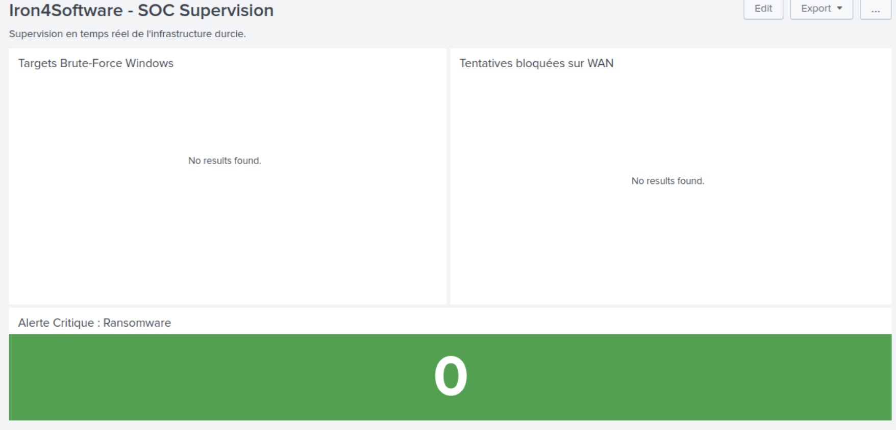

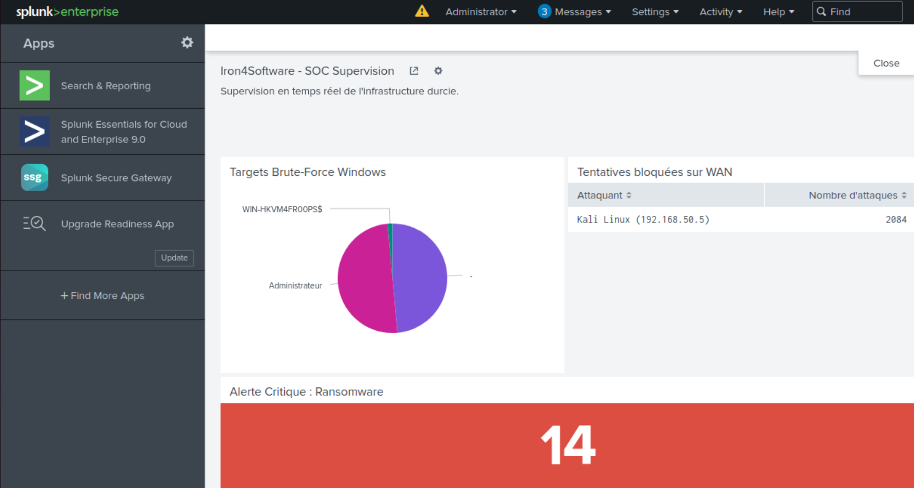

### Analyse du dashboard final

Le dashboard repose sur trois piliers de surveillance complémentaires et non redondants :

Le panel WAN est la **ligne de front** : il prouve que pfSense rejette les intrus avant qu'ils n'atteignent les serveurs. Un chiffre élevé ici est attendu sur un pare-feu exposé à Internet, mais son absence totale pourrait indiquer un problème de logging.

Le panel Brute-Force est le **baromètre d'identité** : il révèle si les comptes de domaine sont sous pression. Son état vide en fonctionnement normal confirme que le durcissement GPO décourage les tentatives ou les rend inopérantes dès le verrouillage.

Le panel Ransomware est l'**indicateur critique absolu** : il doit impérativement rester à 0. Si ce chiffre passe à 1, l'infrastructure est en cours de compromission sur ses données les plus sensibles. C'est l'alerte qui justifie une réponse à incident immédiate, indépendamment de tout autre signal.

## Implications pour un Analyste SOC

À l'issue de cette phase, le SOC Iron4Software est opérationnel. Le passage du "cimetière de logs" constaté en Phase 2 à une infrastructure de détection active en Phase 4 illustre le cycle complet d'une mise en place SOC : instrumenter, collecter, durcir, puis détecter.

Les trois alertes configurées couvrent les trois vecteurs d'attaque documentés lors de l'audit offensif : la reconnaissance périmétrique (WAN), la compromission d'identifiants (Brute-Force) et l'impact sur les données (Ransomware). Chaque alerte est calibrée sur les mesures de durcissement de la Phase 3 — le seuil de 5 pour le brute-force répond directement à la GPO de verrouillage, l'alerte 4663 exploite l'audit chirurgical du dossier PRIVATE, et la détection WAN corrige l'angle mort du Default Deny silencieux de pfSense.

Le troubleshooting pfSense a mis en lumière un principe fondamental qui doit guider toute stratégie SOC : **la visibilité ne s'obtient pas par défaut**. Elle se configure, se valide et se maintient activement. Un composant d'infrastructure qui fonctionne correctement sur le plan opérationnel peut être totalement invisible pour le SIEM si personne ne s'est assuré que ses journaux remontent effectivement. La phase de diagnostic — tcpdump côté Splunk, consultation des logs locaux pfSense, test de connectivité — est représentative du travail d'investigation réel d'un analyste confronté à un angle mort de télémétrie.

La prochaine étape du projet consistera à rejouer les attaques de la Phase 2 sur cette infrastructure désormais durcie et supervisée, afin de comparer les résultats et de prouver empiriquement l'efficacité des mesures mises en place.

---
*Fin du rapport de Lab.*