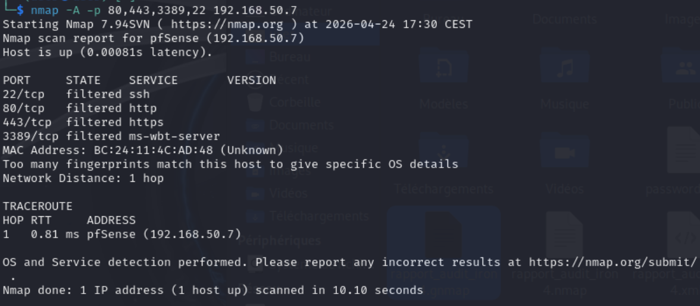
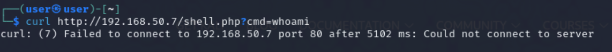
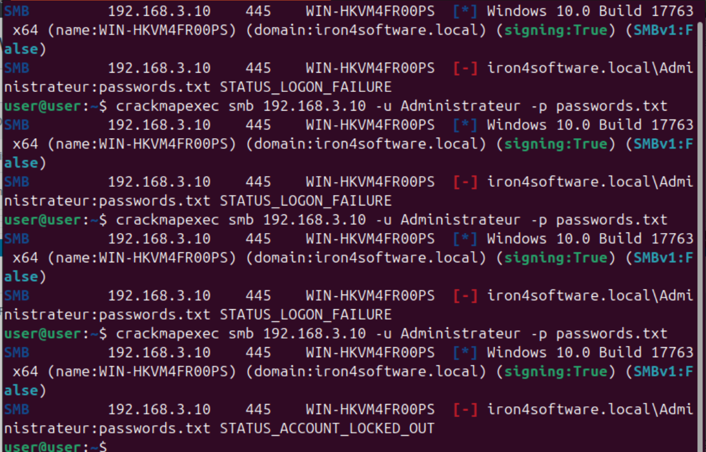
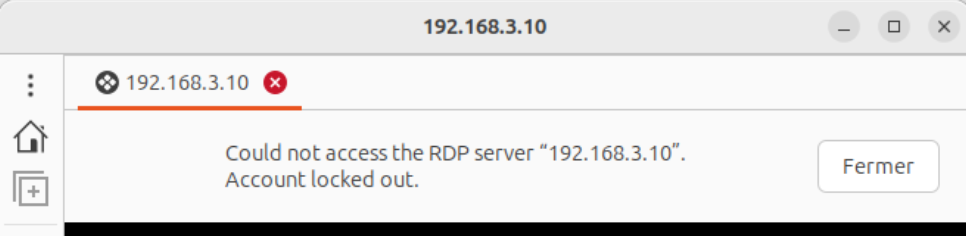
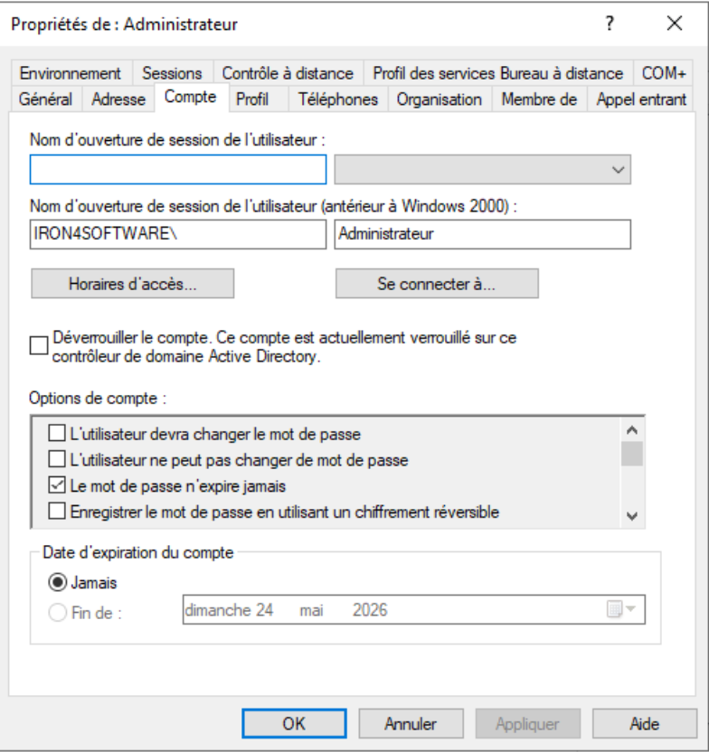
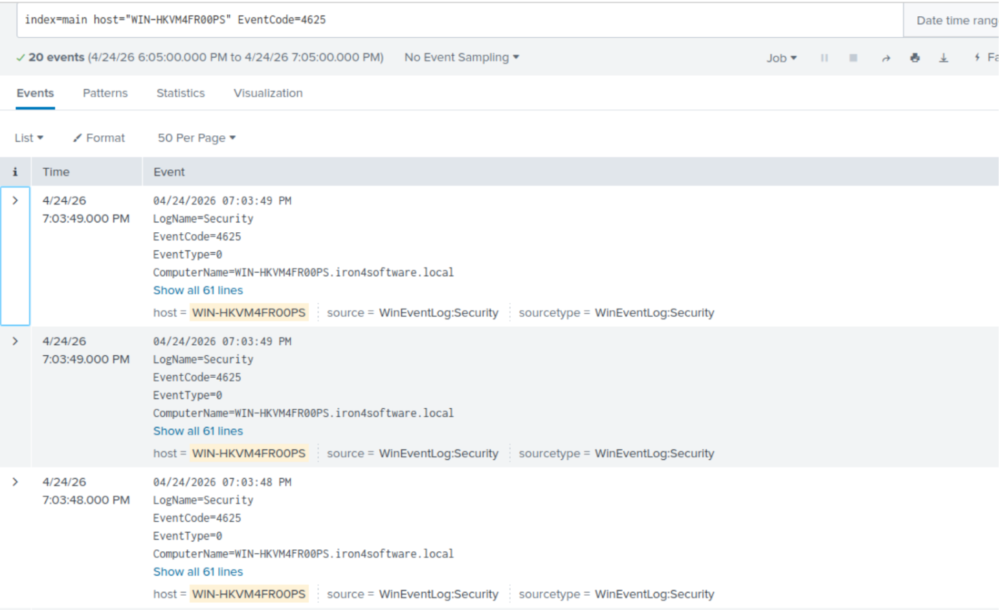
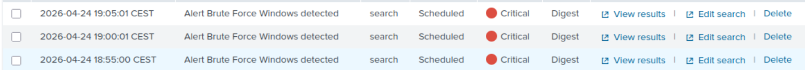
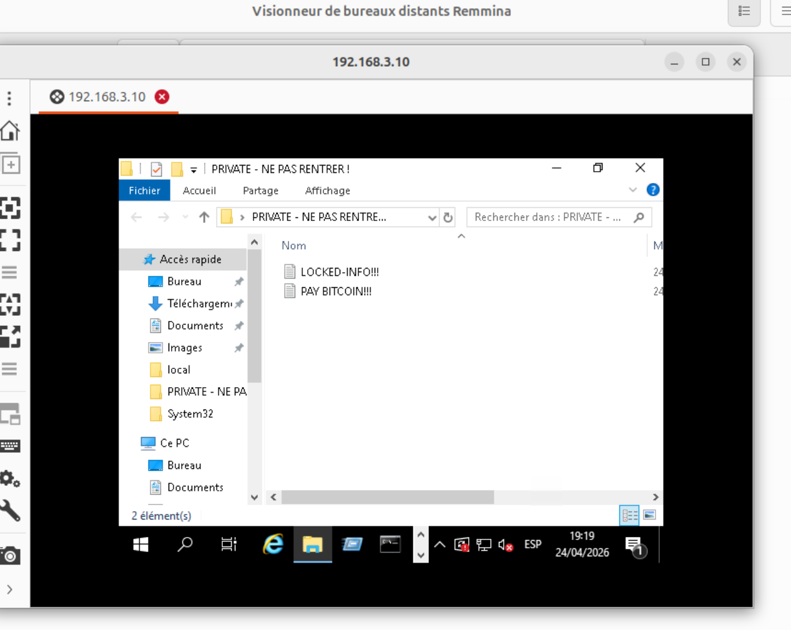
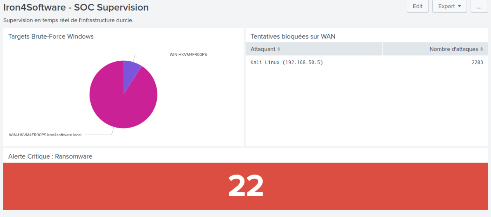
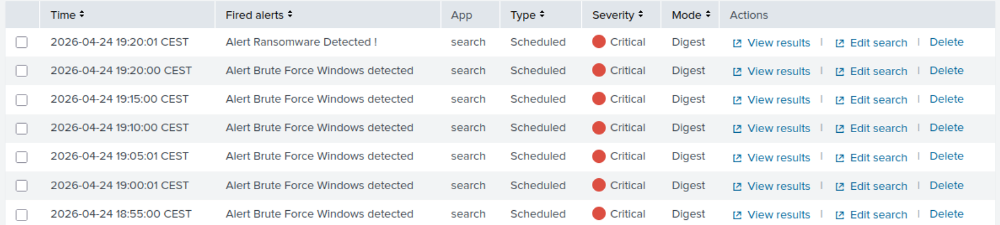

# Phase 5 - Ré-attaque après Durcissement : Validation de l'Efficacité Défensive

**Environnement :** Home Lab virtuel sur Proxmox pour le projet Iron4Software — Formation Analyste SOC - CyberUniversity (Liora x Sorbonne).

## Objectif du Lab
Les Phases 3 et 4 ont transformé l'infrastructure Iron4Software : périmètre verrouillé, hôtes durcis, pipeline de logs chiffré, alertes SOC opérationnelles. Mais un durcissement sans validation reste une hypothèse. L'objectif de cette phase est de rejouer les mêmes vecteurs d'attaque qu'en Phase 2 pour prouver l'efficacité des mesures mises en place, et de confronter chaque défense à une attaque réelle.

La méthodologie adoptée est celle de l'**Assume Breach** : plutôt que de désactiver les défenses pour forcer un passage artificiel, je teste chaque couche indépendamment en assumant que la précédente a été franchie. Cette approche est standard en audit de sécurité — elle permet de valider chaque barrière sans compromettre les autres, et elle produit des preuves forensiques propres pour chaque vecteur. Elle permet également de justifier la détection interne (audit de fichiers, alertes SIEM) même face à un périmètre qui tient : la sécurité absolue n'existe pas, un employé peut brancher une clé USB infectée, un attaquant peut voler des credentials via du phishing. La deuxième ligne de défense doit fonctionner indépendamment de la première.

## Outils et Technologies
- **Reconnaissance :** Nmap, cURL (Kali Linux).
- **Brute-Force :** CrackMapExec via SMB (Ubuntu, pivot interne).
- **Validation RDP :** Remmina (Ubuntu).
- **SIEM :** Splunk Enterprise — alertes Triggered, Dashboard SOC.
- **Administration AD :** Utilisateurs et ordinateurs Active Directory (Windows Server 2019).
- **Framework MITRE ATT&CK :** T1595 (Active Scanning), T1190 (Exploit Public-Facing Application), T1110.001 (Brute Force), T1486 (Data Encrypted for Impact).

## 1. Test 1 — Reconnaissance Périmétrique : Le Mur pfSense

### Contexte

En Phase 2, le scan Nmap avait révélé le port 80 ouvert avec un service Apache actif et le webshell `shell.php` pleinement fonctionnel depuis le WAN. La Phase 3 a supprimé la règle "Allow All" et durci les règles NAT. Je rejoue le même scan depuis la machine Kali pour mesurer ce qui a changé.

### Scan Nmap

```bash
nmap -A -p 80,443,3389,22 192.168.50.7
```



Ce scan cible les quatre ports stratégiques : le port 80 (webshell), le 443 (HTTPS), le 3389 (RDP exposé en Phase 2) et le 22 (SSH). Le résultat est sans appel : les quatre ports retournent le statut `filtered`. Le scan s'achève en 10 secondes contre 117 secondes en Phase 2 — cette différence de durée est elle-même significative : en Phase 2, Nmap recevait des réponses et pouvait effectuer de la détection de service. Ici, pfSense ignore totalement les paquets (Drop), ce qui force Nmap à attendre les timeouts sur chaque port avant de conclure.

Le statut `filtered` est plus silencieux pour l'attaquant que `closed` : un port fermé répond avec un paquet RST, confirmant implicitement la présence d'un hôte. Un port filtré ne répond rien, laissant l'attaquant sans information sur ce qui se trouve derrière.

### Tentative d'exploitation du Webshell

```bash
curl http://192.168.50.7/shell.php?cmd=whoami
```



La commande retourne immédiatement : `curl: (7) Failed to connect to 192.168.50.7 port 80 after 5102 ms: Could not connect to server`. Le navigateur lancé depuis Kali sur la même URL affiche `The connection has timed out`.

Il est important de noter la précision technique ici : le webshell est inaccessible non seulement parce que les règles pfSense ont été durcies, mais aussi parce que la faille applicative a été corrigée côté serveur Ubuntu. Même si un attaquant parvenait à joindre le port 80 via un autre vecteur, le fichier `shell.php` n'est plus présent. Les deux couches — filtrage réseau et assainissement applicatif — fonctionnent en complémentarité.

> **Contexte SOC & Blue Team :**
> La différence entre `filtered` et `closed` est une information tactique pour l'analyste. Un pare-feu configuré en Drop plutôt qu'en Reject ne laisse aucune empreinte exploitable : l'attaquant ne peut pas distinguer un hôte protégé d'un hôte inexistant. Cette opacité est intentionnelle et constitue une bonne pratique de configuration périmétrique.

## 2. Test 2 — Pivot Interne et Brute-Force : Le Mur GPO

### Contexte et justification du pivot

Le périmètre externe étant infranchissable depuis Kali, je bascule sur le scénario Assume Breach : un attaquant ayant compromis un service interne — le serveur web Ubuntu par exemple, qui dans un scénario réel aurait pu être infiltré via une autre vulnérabilité — tenterait d'étendre son accès vers le Contrôleur de Domaine. Je lance l'attaque depuis la machine Ubuntu (`192.168.3.20`) qui se trouve dans le même LAN que le Windows Server 2019 (`192.168.3.10`).

Le protocole SMB est retenu pour le brute-force plutôt que RDP pour deux raisons : il génère des Event ID 4625 très précis dans les journaux Windows, et il est plus robuste pour les attaques automatisées à haute cadence.

### Attaque Brute-Force SMB

```bash
crackmapexec smb 192.168.3.10 -u Administrateur -p passwords.txt
```



Les premières tentatives retournent `STATUS_LOGON_FAILURE` — comportement identique à la Phase 2. Mais contrairement à la Phase 2 où l'attaque avait pu s'étendre sur 34 tentatives sans interruption, la GPO de verrouillage configurée en Phase 3 (seuil à 5 tentatives) entre en jeu rapidement. En relançant la commande, CrackMapExec retourne `STATUS_ACCOUNT_LOCKED_OUT` dès la cinquième tentative infructueuse. L'attaque s'arrête net : le compte `Administrateur` est verrouillé au niveau du domaine et aucune tentative supplémentaire ne peut aboutir, quel que soit le mot de passe essayé.


### Validation multi-couches du verrouillage

**Côté Remmina (Ubuntu) :** Une tentative de connexion RDP vers `192.168.3.10` retourne immédiatement : `Could not access the RDP server "192.168.3.10". Account locked out.` L'interface graphique confirme que le verrouillage est effectif au niveau de l'authentification Windows, indépendamment du protocole utilisé.



**Côté Active Directory (Windows Server 2019) :** Dans `Gestionnaire de serveur > Outils > Utilisateurs et ordinateurs Active Directory`, les propriétés du compte `Administrateur` affichent la case cochée : `Déverrouiller le compte. Ce compte est actuellement verrouillé sur ce contrôleur de domaine Active Directory`. C'est la preuve système que la GPO a opéré au niveau du domaine, pas seulement au niveau local.



**Côté Splunk :** La recherche `index=main host="WIN-HKVM4FR00PS" EventCode=4625` retourne 20 événements concentrés sur une fenêtre temporelle très courte (7:03:48 PM à 7:03:49 PM le 24/04/2026), signature caractéristique d'un brute-force automatisé.



Les alertes Triggered Alerts affichent trois déclenchements successifs de `Alert Brute Force Windows detected` avec sévérité Critical.



> **Contexte SOC & Blue Team :**
> La corrélation entre `STATUS_ACCOUNT_LOCKED_OUT` côté attaquant et le déclenchement de l'alerte Splunk côté défense est la démonstration concrète de la synergie GPO/SIEM mise en place en Phases 3 et 4. En Phase 2, ces événements 4625 étaient présents dans Splunk mais aucune alerte n'existait pour les signaler. En Phase 5, chaque tentative est tracée, le compte est verrouillé en moins d'une seconde, et l'analyste SOC est notifié dans les 5 minutes suivantes. La fenêtre d'action de l'attaquant est réduite à zéro.

## 3. Test 3 — Simulation d'Impact Ransomware : Le Mur Audit/SIEM

### Contexte

Le brute-force ayant échoué, je passe au dernier scénario Assume Breach : un attaquant ayant obtenu des credentials par un autre vecteur (phishing, credential stuffing, compromission d'un poste utilisateur) et disposant d'un accès RDP légitime au serveur tente de déployer un ransomware. Je simule cet accès directement depuis la console du Windows Server 2019.

Ce scénario est particulièrement important car il valide la deuxième ligne de défense indépendamment du périmètre : même si un attaquant parvient à s'authentifier, le SOC doit détecter son activité sur les données sensibles.

### Déclenchement de l'alerte

Dans le dossier `C:\PRIVATE - NE PAS RENTRER !`, je supprime et renomme une série de fichiers en simulant le comportement d'un ransomware : renommage avec extension `.crypt`, création de fichiers `LOCKED-INFO!!!` et `PAY BITCOIN!!!`, suppression des originaux. Tout ça est fait via rdp avec Remmina pour max d'authenticité.



Chaque opération génère un Event ID 4663, capturé par l'audit NTFS configuré en Phase 3 et transmis via le tunnel TLS vers Splunk. Le dashboard SOC bascule immédiatement : le panel "Alerte Critique Ransomware" passe de 0 à **22** sur fond rouge. L'alerte `Alert Ransomware Detected !` apparaît dans le menu Triggered Alerts avec sévérité Critical.

Le dashboard final montre simultanément les trois panels actifs : le Pie Chart "Targets Brute-Force Windows" affiche `WIN-HKVM4FR00PS` comme cible, le tableau "Tentatives bloquées sur WAN" comptabilise 2203 tentatives depuis `Kali Linux (192.168.50.5)`, et le compteur Ransomware affiche 22 en rouge.



La liste chronologique des Fired Alerts raconte l'histoire complète de la session de test : plusieurs déclenchements successifs de `Alert Brute Force Windows detected` suivis de `Alert Ransomware Detected !`. C'est la timeline d'une attaque multicouche vue depuis le SOC — reconnaissance, tentative d'authentification, impact sur les données.



> **Contexte SOC & Blue Team :**
> Ce test valide l'architecture de détection en profondeur. Le périmètre (pfSense) a bloqué la reconnaissance. La GPO a neutralisé le brute-force. L'audit NTFS et le SIEM ont détecté l'impact sur les données dans un scénario où l'attaquant disposait d'un accès légitime. Ces trois couches sont indépendantes : la défaillance de l'une n'annule pas les autres. C'est précisément ce que la Défense en Profondeur cherche à garantir.

## 4. Tableau Comparatif : Phase 2 (Avant) vs Phase 5 (Après)

| Vecteur d'attaque | Résultat Phase 2 | Résultat Phase 5 | Mesure responsable |
|---|---|---|---|
| **Reconnaissance (Nmap)** | Ports ouverts, services identifiés, OS détecté | Tous les ports `filtered`, aucune information divulguée | pfSense — suppression règle Allow All |
| **Accès Initial (Webshell)** | `shell.php` exécute des commandes en RCE | Timeout — connexion refusée | pfSense NAT + patch applicatif Ubuntu |
| **Brute-Force SMB** | 34 tentatives, succès avec `Admin123` | `STATUS_ACCOUNT_LOCKED_OUT` après 5 essais | GPO — seuil de verrouillage à 5 tentatives |
| **Accès RDP** | Connexion interactive établie avec les credentials volés | `Account locked out` — connexion refusée | GPO + Pare-feu Windows réactivé |
| **Ransomware / Impact** | Fichiers chiffrés en silence, 0 alerte | 22 Event ID 4663 détectés, alerte Critical Splunk | Audit NTFS + alerte Splunk EventCode 4663 |
| **Visibilité SOC** | Logs présents mais aucune alerte, SOC aveugle | 3 alertes Critical déclenchées, dashboard actif | Ingénierie de détection Phase 4 |

## Implications pour un Analyste SOC

La Phase 5 produit ce qu'un audit de sécurité doit toujours produire : une preuve mesurable de l'efficacité des contre-mesures. Le tableau comparatif résume six mois de travail en six lignes, mais derrière chaque ligne il y a une chaîne technique complète — une vulnérabilité identifiée, une mesure appliquée, un test de régression réussi.

Le concept d'Assume Breach adopté pour cette phase est particulièrement pertinent dans un contexte SOC professionnel. Les outils de détection interne — audit de fichiers, corrélation d'événements, alertes SIEM — ne doivent pas être subordonnés à l'efficacité du périmètre. Un SOC mature part du principe que l'attaquant finira par entrer, et conçoit sa détection en conséquence.

La chronologie des Fired Alerts de cette phase illustre parfaitement ce principe : brute-force détecté, compte verrouillé, puis ransomware détecté malgré un accès "légitime" aux credentials. Chaque couche a joué son rôle indépendamment. C'est la validation empirique de tout ce qui a été construit depuis la Phase 3.

La prochaine étape — la Phase 6 (Réponse à Incident) — s'appuiera sur cette même infrastructure pour simuler la réaction opérationnelle : contention, éradication et récupération depuis les sauvegardes immuables configurées en Phase 3.

---
*Fin du rapport de Lab.*