# Phase 6 - Réponse à Incident : De la Détection à la Remise en Production

**Environnement :** Home Lab virtuel sur Proxmox pour le projet Iron4Software - Formation Analyste SOC - CyberUniversity (Liora x Sorbonne).

## Objectif du Lab

La Phase 5 a validé que l'architecture défensive construite sur les Phases 3 et 4 était capable de détecter et de bloquer les vecteurs d'attaque rejoués. Mais un durcissement efficace et une détection opérationnelle ne constituent pas, à eux seuls, une posture de sécurité complète. La question qui se pose naturellement est la suivante : que se passe-t-il lorsqu'une alerte est réellement déclenchée ? Qui agit, dans quel ordre, avec quels outils, et selon quelle procédure ?

C'est l'objet de cette sixième phase : simuler une réponse à incident structurée face à l'attaque documentée en Phase 2, en adoptant pleinement la posture d'un Analyste SOC confronté à une situation de crise. L'incident traité - référencé **INC-2026-001** - est une compromission majeure impliquant une intrusion réseau, un brute-force d'identifiants Active Directory, et un ransomware avec exfiltration préalable de données de santé. Sa gravité le place immédiatement dans la catégorie des incidents critiques, mobilisant simultanément des enjeux techniques, organisationnels et réglementaires.

La démarche adoptée suit le cadre **NIST SP 800-61** (Computer Security Incident Handling Guide), organisé en quatre phases successives et non interchangeables : triage et qualification, contention, éradication, et récupération. L'ordre de ces phases n'est pas arbitraire : il traduit une logique de priorité opérationnelle dans laquelle stopper l'hémorragie prime toujours sur nettoyer la plaie.

## Outils et Technologies

- **SIEM :** Splunk Enterprise - dashboard SOC, Triggered Alerts, recherches SPL pour investigation et triage.
- **Pare-feu périmétrique :** pfSense - création de règles de contention WAN et LAN, isolation réseau.
- **Gestion des identités :** Active Directory (dsa.msc) - désactivation et réactivation du compte compromis.
- **Administration système :** Invite de commandes Windows (net user), Explorateur de fichiers Windows Server 2019.
- **Forensique préliminaire :** Planificateur de tâches Windows (taskschd.msc), journaux Apache (access.log), système de fichiers Ubuntu.
- **Framework MITRE ATT&CK :** T1190 (Exploit Public-Facing Application), T1059 (Command and Scripting Interpreter), T1090 (Proxy/Pivot), T1110.001 (Brute Force), T1021.001 (Remote Desktop Protocol), T1048 (Exfiltration Over C2 Channel), T1486 (Data Encrypted for Impact).
- **Référentiel IR :** NIST SP 800-61 Rev.2 - Computer Security Incident Handling Guide.

## 1. Triage et Qualification de l'Incident (T0)

### A. Constat initial sur le dashboard SOC

Le point de départ de la réponse à incident n'est pas une alerte isolée, mais un tableau de bord SOC qui bascule simultanément dans le rouge. A la prise de poste, le dashboard **Iron4Software - SOC Supervision** affiche trois signaux critiques concomitants.

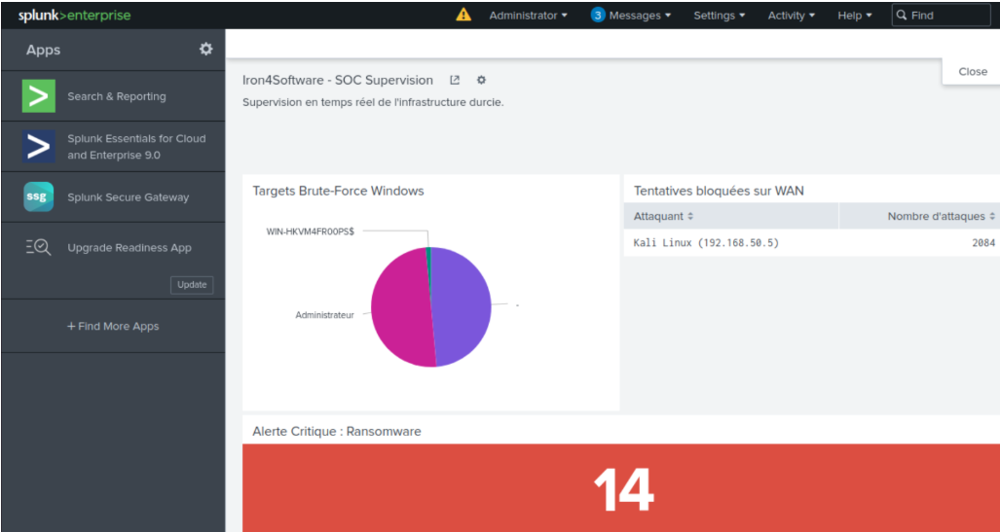

Le panel "Tentatives bloquées sur WAN" enregistre **2 084 tentatives** depuis l'IP `192.168.50.5`, identifiée comme Kali Linux. Le pie chart "Targets Brute-Force Windows" désigne le compte `Administrateur` et la machine `WIN-HKVM4FR00PS` comme cibles actives. Le compteur "Alerte Critique Ransomware" affiche **14** sur fond rouge vif.

Trois alertes Critical simultanées ne constituent pas un hasard statistique. Elles dessinent la signature d'une attaque coordonnée et multi-vectorielle. Je procède immédiatement à l'ouverture du ticket d'incident.

> **Contexte SOC & Blue Team :**
> La simultanéité des trois alertes est une information tactique en elle-même. Une seule alerte de brute-force pourrait être un faux positif (test légitime, outil de scan interne). Trois alertes concomitantes couvrant le WAN, le brute-force et l'impact sur les données indiquent une attaque coordonnée suivant une kill chain structurée. C'est ce type de corrélation inter-alertes qu'un analyste SOC Tier 2 effectue pour élever la sévérité d'un incident.

### B. Investigation Splunk et reconstitution de la Kill Chain

Avant d'ouvrir le ticket, je valide les alertes une par une depuis le menu **Activity > Triggered Alerts** pour obtenir une vue complète de la chronologie.

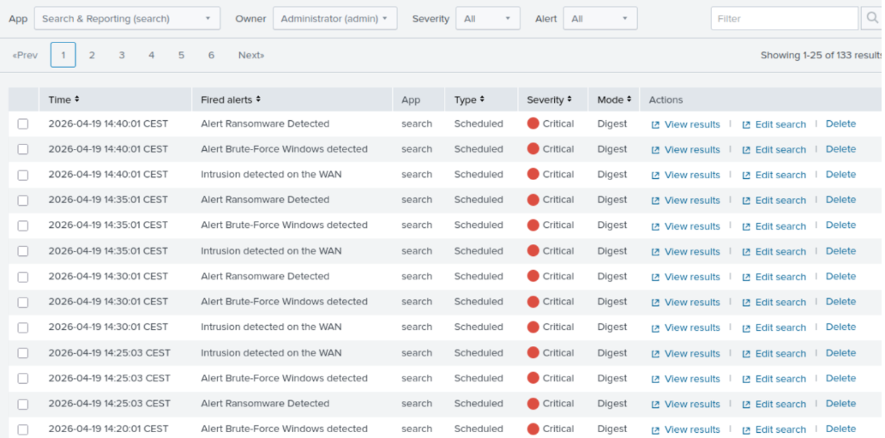

133 résultats sont présents, répartis sur plusieurs sessions. Les trois alertes - `Alert Ransomware Detected`, `Alert Brute-Force Windows detected`, et `Intrusion detected on the WAN` - se déclenchent toutes avec sévérité Critical, en mode Digest, à intervalles de 5 minutes depuis le 19 avril 2026 à 14h20.

Pour reconstituer la kill chain complète, j'interroge directement les logs sources. La première requête cible les accès webshell dans les logs Apache :

```spl
index=main sourcetype="access-too_small" shell.php
```

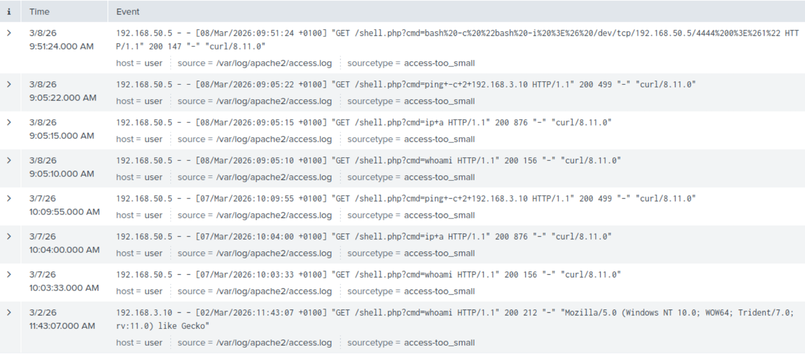

Les logs confirment les premiers accès au webshell `shell.php` dès le **07/03/2026 à 10h03**, depuis l'IP Kali `192.168.50.5`. Les commandes exécutées via paramètre `cmd=` dans l'URL sont visibles en clair : `whoami`, `ip+a`, `ping`, puis un reverse shell bash le 08/03 à 09h51. L'utilisation délibérée de la méthode GET en Phase 2 garantit ici leur enregistrement dans access.log - ce qui se retourne maintenant contre l'attaquant.

Je cherche ensuite les traces du brute-force SMB :

```spl
index=main sourcetype="WinEventLog:Security" EventCode=4625 Type_d_ouverture_de_session=3
| table _time, Nom_du_compte, "Adresse du réseau source"
| sort _time
```

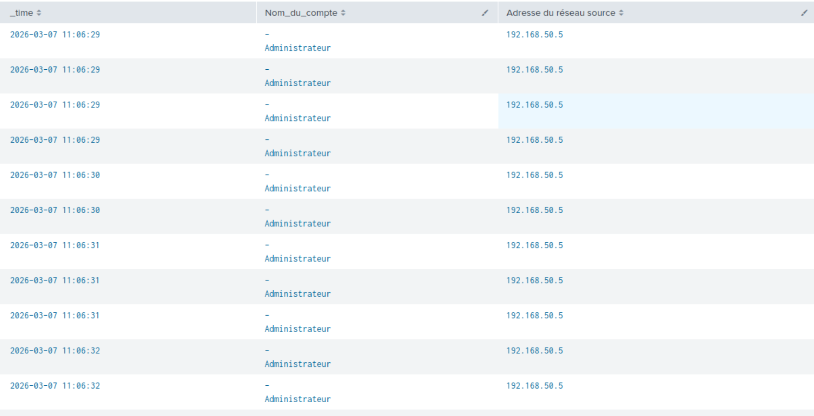

Le brute-force débute le **07/03/2026 à 11h06:29** depuis `192.168.50.5`, ciblant le compte `Administrateur`. Je cherche ensuite le succès d'authentification correspondant :

```spl
index=main sourcetype="WinEventLog:Security" EventCode=4624 Type_d_ouverture_de_session=3 "192.168.50.5"
| table _time, Nom_du_compte, "Adresse du réseau source"
| sort _time
```

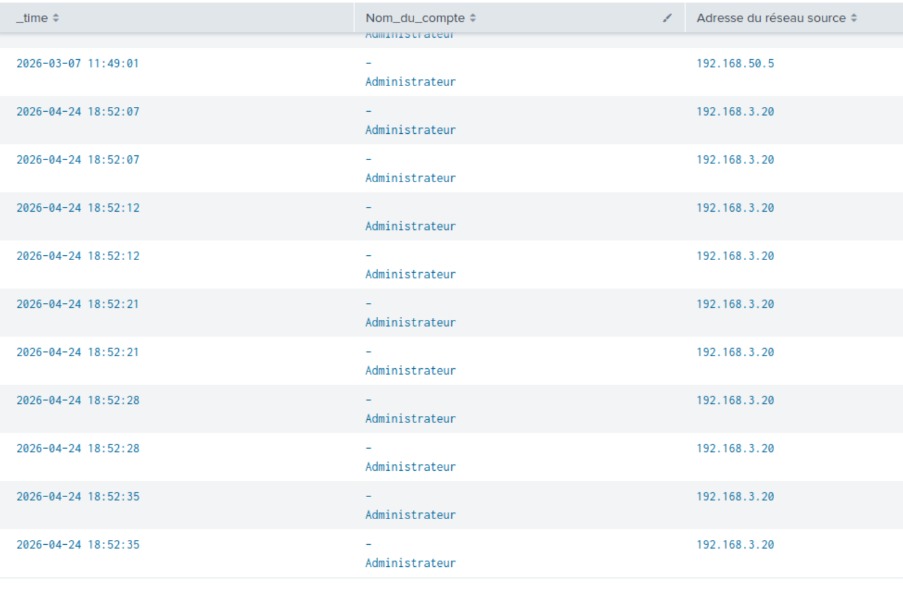

Le résultat est sans ambiguïté : le compte `Administrateur` est authentifié avec succès depuis `192.168.50.5` à **11h49:01**, après 43 minutes de brute-force. Une deuxième connexion Administrateur depuis Kali est enregistrée à **12h11:00** - c'est l'ouverture de la session RDP interactive.

Enfin, je recherche l'impact ransomware sur les données sensibles :

```spl
index=main sourcetype="WinEventLog:Security" EventCode=4663 ("LOCKED" OR "PAY" OR "crypt")
| table _time, Nom_du_compte, "Nom de l'objet"
| sort _time
```

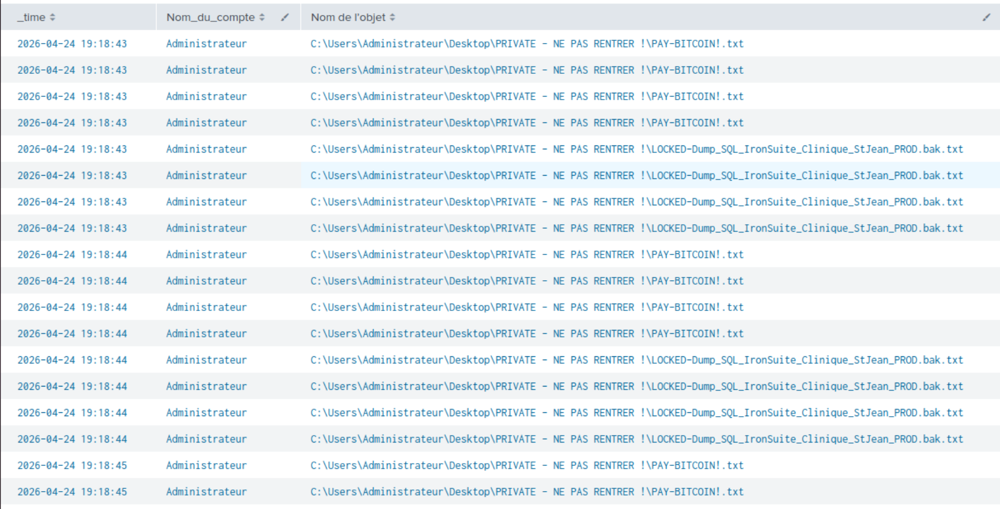

Les Event ID 4663 confirment le dépôt des artefacts ransomware - `LOCKED-Dump_SQL_IronSuite_Clinique_StJean_PROD.bak` et `PAY-BITCOIN!.txt` - dans le dossier `C:\PRIVATE - NE PAS RENTRER !` le **24/04/2026 à 19h18:43**. Ces événements correspondent à la session de re-validation Phase 5, les artefacts réels de Phase 2 n'ayant pas généré de 4663 car l'audit NTFS n'était pas encore activé à cette date.

> **Analyse "Sous le capot" :**
> La reconstitution de la kill chain depuis les logs révèle un écart temporel majeur : la compromission initiale date du **07 mars 2026**, les alertes SOC du **19 avril 2026**. Soit **six semaines** de fenêtre d'exposition sans détection. Cet écart s'explique par l'ordre du projet : les alertes Splunk n'ont été créées qu'en Phase 4. Mais dans un contexte réel, cette lacune aurait permis à l'attaquant de maintenir un accès persistant pendant six semaines, potentiellement exfiltrant des données en continu. C'est la démonstration concrète de pourquoi l'ingénierie de détection doit précéder ou accompagner le déploiement des services exposés, et non les suivre.

### C. Ouverture formelle de l'incident INC-2026-001

La qualification de l'incident est maintenant complète. J'ouvre le ticket formel avec les éléments suivants :

| Champ | Valeur |
|---|---|
| **Référence** | INC-2026-001 |
| **Date de détection (T0)** | 19/04/2026 14h20 CEST |
| **Sévérité** | Critical |
| **Systèmes affectés** | WIN-HKVM4FR00PS (192.168.3.10), Ubuntu Web (192.168.3.11) |
| **Source attaquante** | 192.168.50.5 (Kali Linux) |
| **Nature** | Ransomware avec exfiltration de données de santé - Double extorsion |
| **Obligation réglementaire** | Notification CNIL sous 72h (RGPD Art. 33) - données de santé exfiltrées |

La présence du fichier `Dump_SQL_IronSuite_Clinique_StJean_PROD.bak` parmi les données affectées élève immédiatement l'incident au rang de violation de données personnelles au sens du RGPD. Cette contrainte réglementaire s'ajoute aux contraintes techniques et impose une gestion d'incident sur deux fronts simultanés : la réponse technique et la communication de crise.

> **Contexte SOC & Blue Team :**
> L'ouverture d'un ticket d'incident formel n'est pas une formalité administrative : c'est la colonne vertébrale de toute la réponse. Chaque action menée dans les phases suivantes doit être horodatée et référencée à ce ticket. En cas de litige, d'audit ou de procédure judiciaire, la traçabilité de la réponse IR est aussi importante que l'efficacité technique des mesures appliquées.

## 2. Contention : Couper les Voies d'Acces

La contention repose sur un principe fondamental : ne jamais confondre vitesse et précipitation. L'objectif n'est pas de tout réparer immédiatement, mais d'empêcher l'attaquant de progresser davantage tout en préservant l'intégrité des preuves forensiques. Supprimer un fichier malveillant avant de l'avoir analysé, c'est potentiellement détruire les éléments qui permettront d'établir l'étendue réelle de la compromission.

Je structure la contention en trois actions successives, toutes exécutées sans interagir directement avec le système compromis.

### A. Blocage de l'IP attaquante sur le WAN (pfSense)

Depuis le poste admin (192.168.3.2), j'accède à l'interface pfSense via `https://192.168.3.1`. Dans **Firewall > Rules > WAN**, je crée une nouvelle règle en première position via le bouton **Add** (flèche vers le haut) :

- **Action :** Block
- **Protocol :** Any
- **Source :** 192.168.50.5
- **Destination :** Any
- **Description :** `IR INC-2026-001 - Blocage IP attaquante Kali`

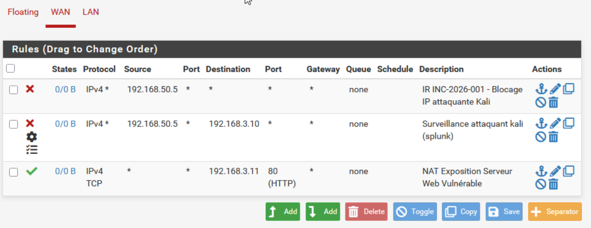

La règle apparait en tête de liste avec le statut X rouge confirmant son caractère bloquant. L'intitulé référençant l'incident est délibéré : en situation réelle, une règle de contention doit être traçable, nommée, et référencée à l'incident qui l'a motivée. Une règle anonyme dans un firewall est une dette opérationnelle qui finira par être supprimée par erreur.

> **Contexte SOC & Blue Team :**
> Le choix de créer une règle dédiée plutôt que de modifier la règle de surveillance existante (créée en Phase 4) est intentionnel. Les deux règles ont des fonctions différentes : la règle Phase 4 loggue le trafic Kali vers Splunk pour la détection, la règle IR bloque tout trafic depuis cette IP vers n'importe quelle destination. Les conserver séparées permet de distinguer les mesures de supervision permanentes des mesures de réponse à incident temporaires.

### B. Isolation réseau du Windows Server compromis (pfSense LAN)

Dans l'onglet **LAN**, je crée une règle Block en première position ciblant le Windows Server :

- **Action :** Block
- **Protocol :** Any
- **Source :** Any
- **Destination :** 192.168.3.10
- **Description :** `IR INC-2026-001 - Isolation Windows Server compromis`

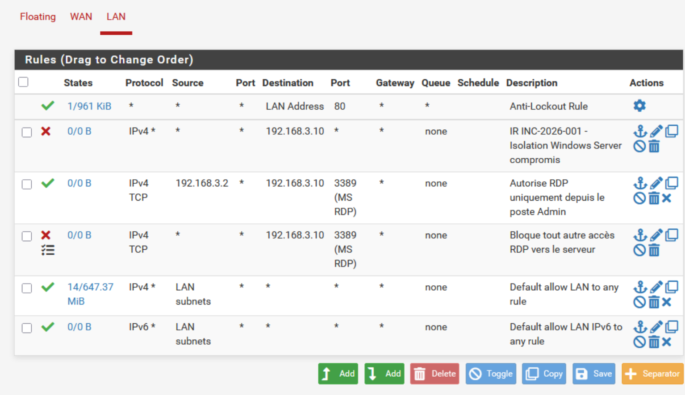

La règle est positionnée au-dessus des règles RDP existantes configurées en Phase 3. L'ordre est critique dans pfSense : la règle la plus haute l'emporte. Le Windows Server est maintenant injoignable depuis n'importe quelle machine du LAN.

Le choix de passer par pfSense plutôt que par Proxmox (coupure directe de l'interface réseau de la VM) est réfléchi : une coupure au niveau de l'hyperviseur aurait certes isolé la machine, mais elle aurait également interrompu la remontée des logs vers Splunk. En isolant via le pare-feu, le Universal Forwarder du Windows Server continue d'envoyer ses événements vers le SIEM. La télémétrie reste active pendant toute la phase de contention.

> **Analyse "Sous le capot" :**
> La règle d'isolation est volontairement conservée en mode désactivé via Toggle après usage, et non supprimée. Les règles de contention créées pendant un incident font partie de la chronologie de la réponse. Les supprimer, c'est effacer une partie du dossier. Les conserver desactivées est une preuve opérationnelle de ce qui a été fait et quand - ce qui sera précieux pour l'analyse forensique post-incident et pour tout audit ultérieur.

### C. Désactivation du compte Administrateur compromis (Active Directory)

Sur le Windows Server 2019, j'ouvre **Utilisateurs et ordinateurs Active Directory** (`dsa.msc`). Je localise le compte `Administrateur`, clic droit, **Désactiver le compte**.

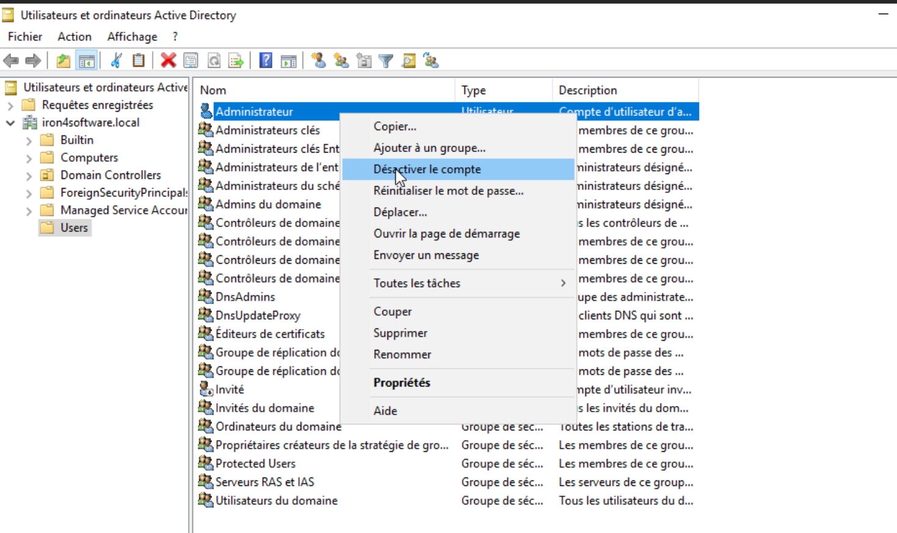

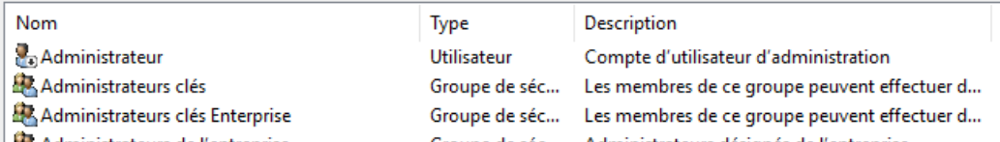

La petite flèche vers le bas sur l'icône du compte confirme la désactivation. Le compte ne peut plus être utilisé pour s'authentifier sur le domaine.

Je ne réinitialise pas le mot de passe à ce stade. Cette nuance est importante : réinitialiser le mot de passe immédiatement pourrait alerter un attaquant encore présent sur le système que sa session est compromise, potentiellement le pousser à accélérer ses actions destructrices. La désactivation du compte révoque l'accès sans modifier les artefacts d'authentification, préservant ainsi leur valeur forensique.

La contention est maintenant complète sur les trois axes :

| Axe | Action | Résultat |
|---|---|---|
| **Périmètre WAN** | Règle Block pfSense - IP 192.168.50.5 | Kali Linux coupée de toute l'infrastructure |
| **Réseau LAN** | Règle Block pfSense - Destination 192.168.3.10 | Windows Server injoignable depuis le LAN |
| **Identité** | Désactivation compte Administrateur dans AD | Aucune authentification possible avec les credentials compromis |

> **Contexte SOC & Blue Team :**
> Les trois axes de contention correspondent aux trois vecteurs de l'attaque initiale : le WAN comme point d'entrée, le LAN comme terrain de pivot, les credentials comme clé d'accès. Une contention complète doit fermer tous les vecteurs identifiés simultanément, pas séquentiellement. Un attaquant qui detecte la fermeture d'un vecteur dispose d'une fenêtre pour exploiter les autres avant leur fermeture.

## 3. Eradication : Nettoyer Sans Aveugler

L'éradication consiste à supprimer tous les artefacts de l'attaquant et à corriger les vulnérabilités exploitées. Elle ne commence qu'après validation complète de la contention, et elle s'effectue méthodiquement, système par système.

### A. Suppression du webshell sur Ubuntu Web

Je me connecte sur la VM Ubuntu Web et vérifie l'état du répertoire Apache :

```bash
sudo ls -la /var/www/html/shell.php
```

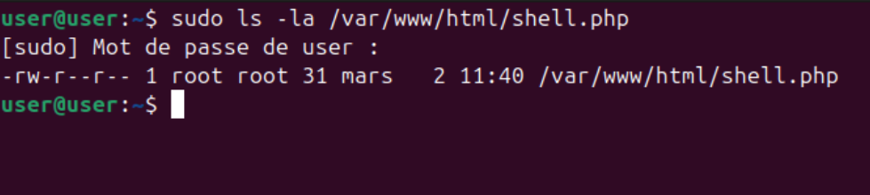

Le fichier `shell.php` est toujours présent, avec un timestamp de création au **07/03/2026 à 11h40**. Ce détail est forensiquement précieux : il situe avec précision le moment où l'attaquant a déposé sa porte dérobée, et confirme que la surface d'exposition n'a jamais été nettoyée entre la Phase 2 et ce jour.

Je procède à la suppression :

```bash
sudo rm /var/www/html/shell.php
```

Je vérifie ensuite qu'aucune backdoor supplémentaire n'a été déposée dans le répertoire web :

```bash
ls -la /var/www/html/
```

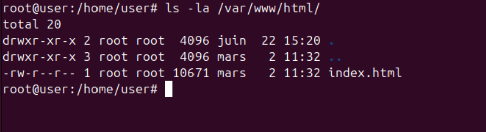

Seul le fichier `index.html` d'origine subsiste, daté du 2 mars. Le répertoire web est propre. C'est une étape que les analystes pressés omettent fréquemment : un attaquant prévoyant dépose rarement une seule porte dérobée.

> **Contexte SOC & Blue Team :**
> La vérification de l'absence de backdoor supplémentaire est un test négatif obligatoire dans tout processus d'éradication. En forensique, un résultat négatif est une information aussi importante qu'un résultat positif : il délimite le périmètre de la compromission. Un rapport d'incident qui documente uniquement ce qui a été trouvé, sans mentionner ce qui a été vérifié et non trouvé, est un rapport incomplet.

### B. Vérification des persistances sur Windows Server

Sur le Windows Server 2019, j'inspecte le **Planificateur de tâches** (`taskschd.msc`) à la recherche de tâches créées par l'attaquant comme mécanisme de persistance (MITRE T1053.005).

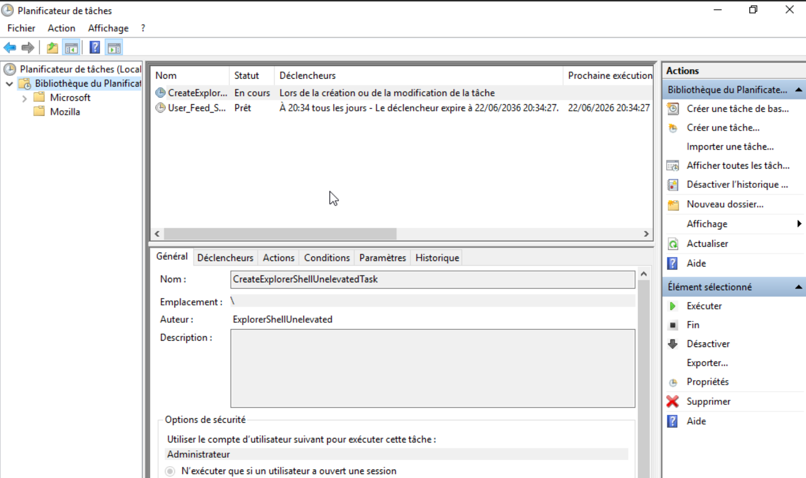

Deux tâches sont présentes à la racine de la bibliothèque : `CreateExplorerShellUnelevatedTask` (auteur `ExplorerShellUnelevated`) et `User_Feed_Synchronization`. Les deux sont des tâches Windows légitimes. Aucune tâche suspecte n'est détectée.

Le dossier Microsoft contient exclusivement des sous-dossiers système standards. Aucun artefact de persistance n'est identifié sur cette machine.

> **Analyse "Sous le capot" :**
> L'absence de mécanisme de persistance détecté sur le Windows Server est cohérente avec le scénario de Phase 2 : l'attaquant avait obtenu un accès RDP interactif avec des credentials valides, ce qui ne nécessite pas de persistance technique (clé de registre, tâche planifiée) puisque les credentials eux-mêmes constituent la persistance. C'est pourquoi la réinitialisation des credentials est la mesure d'éradication la plus critique dans ce type de compromission.

### C. Reinitialisation et réactivation du compte Administrateur

Depuis une invite de commandes en administrateur sur le Windows Server, je réinitialise le mot de passe du compte compromis :

```cmd
net user Administrateur *
```

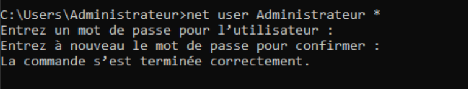

Le système demande la saisie et la confirmation du nouveau mot de passe sans l'afficher à l'écran. Le message "La commande s'est terminée correctement" confirme que le mot de passe `Admin123` - qui avait cédé en moins de 45 minutes face à CrackMapExec en Phase 2 - est remplacé par `Iron4SOC@2026!`.

Je réactive ensuite le compte dans Active Directory (`dsa.msc`), clic droit, **Activer le compte** :

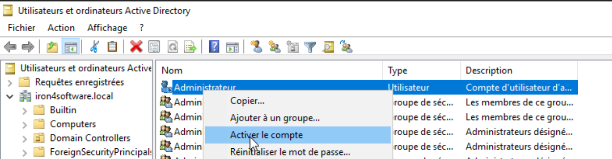

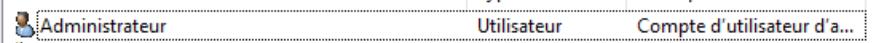

L'icône du compte est revenue à la normale, sans flèche vers le bas. L'éradication est complète.

| Action d'éradication | Système | Résultat |
|---|---|---|
| Suppression `shell.php` | Ubuntu Web | `/var/www/html/` propre, seul `index.html` subsiste |
| Vérification backdoors répertoire web | Ubuntu Web | Aucun fichier suspect détecté |
| Vérification Planificateur de tâches | Windows Server | Aucune tâche suspecte identifiée |
| Reset MDP `Administrateur` | Windows Server | `Admin123` remplacé par `Iron4SOC@2026!` |
| Réactivation compte | Active Directory | Compte actif avec credentials sécurisés |

> **Contexte SOC & Blue Team :**
> L'ordre de l'éradication suit une logique précise : on supprime d'abord les artefacts externes (webshell sur Ubuntu), puis on vérifie les mécanismes de persistance internes (planificateur, registre), puis seulement on réinitialise les credentials et on réactive le compte. Réactiver le compte avant de vérifier la persistance serait une erreur : si l'attaquant avait laissé une tâche planifiée utilisant les anciens credentials, la réactivation du compte lui redonnerait immédiatement accès au système.

## 4. Recuperation : Retour a un Etat Maitrise

La récupération vise à remettre les systèmes en production dans un état sain et contrôlé, système par système, avec validation à chaque étape.

### A. Levée de l'isolation réseau (pfSense)

Avant toute opération sur le Windows Server, je lève l'isolation réseau. Dans pfSense > **Firewall > Rules > LAN**, je désactive la règle d'isolation via le bouton **Toggle** plutôt que de la supprimer :

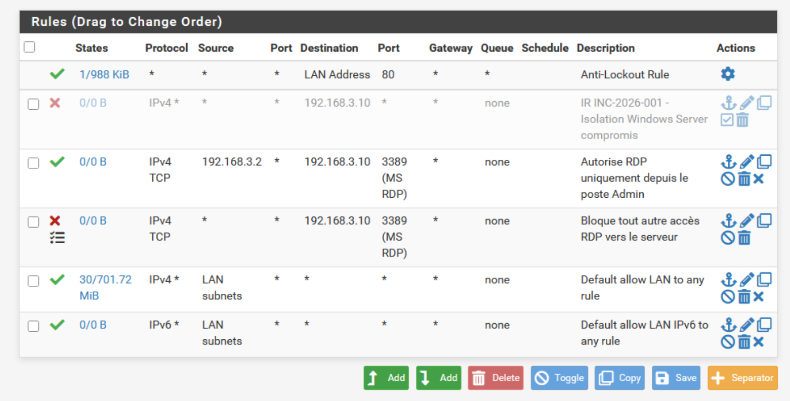

La règle apparait maintenant grisée dans la liste, avec le statut désactivé. Elle reste visible et traçable dans le firewall, ce qui prouve qu'elle a bien existé comme action IR documentée. Le Windows Server est de nouveau accessible depuis le LAN.

### B. Constat sur les sauvegardes - C:\BACKUPS_SECURE

Avant de restaurer les données, je vérifie la disponibilité des sauvegardes dans le répertoire immuable créé en Phase 3 :

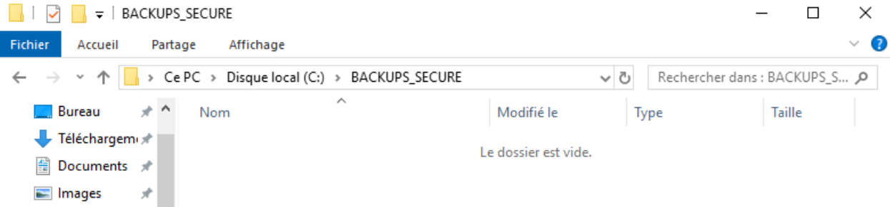

Le répertoire `C:\BACKUPS_SECURE` est **vide**. La zone sanctuaire existait structurellement - les ACL NTFS restrictives étaient en place - mais aucune politique de sauvegarde automatisée n'avait été configurée pour l'alimenter. C'est une situation fréquente dans les TPE : la protection est conçue mais jamais opérationnalisée.

> **Analyse "Sous le capot" :**
> Ce constat illustre la différence entre une politique de sauvegarde et une politique de sauvegarde testée. Avoir un répertoire de sauvegarde sécurisé avec les bonnes ACL NTFS ne sert à rien si aucun processus ne l'alimente. En environnement de production, la vérification périodique de la restaurabilité des sauvegardes - et non de leur seule existence - est aussi critique que leur création. C'est l'un des premiers enseignements que l'incident INC-2026-001 impose de documenter formellement.

### C. Restauration manuelle du dossier PRIVATE

En l'absence de sauvegarde disponible, l'état actuel du dossier `C:\PRIVATE - NE PAS RENTRER !` est le suivant :

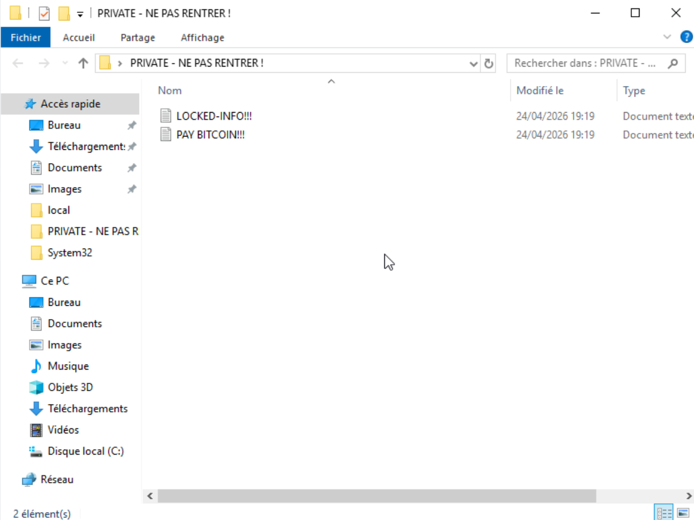

Les deux artefacts ransomware déposés lors de la Phase 5 - `LOCKED-INFO!!!` et `PAY BITCOIN!!!` - sont présents, datés du 24/04/2026 à 19h19. Le fichier de données original a été supprimé lors de la simulation.

Je procède à la restauration manuelle. Depuis une invite de commandes en administrateur, je reconstitue le fichier de données dans son emplacement d'origine :

```cmd
echo Dump_SQL_IronSuite_Clinique_StJean_PROD > "C:\Users\Administrateur\Desktop\PRIVATE - NE PAS RENTRER !\Dump_SQL_IronSuite_Clinique_StJean_PROD.bak"
```

Je supprime ensuite les artefacts ransomware depuis l'Explorateur de fichiers, puis vérifie l'état final du dossier :

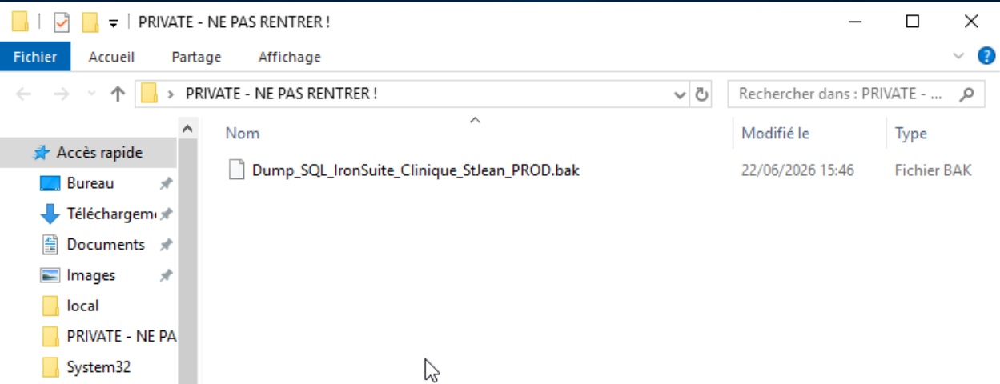

Le dossier `PRIVATE` contient de nouveau le fichier `Dump_SQL_IronSuite_Clinique_StJean_PROD.bak`. Les artefacts ransomware ont disparu. La restauration est documentée sans dissimulation dans la Fiche d'Incident INC-2026-001 : un analyste SOC documente ce qui s'est réellement passé, y compris les lacunes de l'infrastructure qu'il supervise.

> **Contexte SOC & Blue Team :**
> La restauration manuelle de dernier recours est une procédure de clôture d'incident, pas une solution de continuité d'activité. Dans un contexte de production réel, l'absence de sauvegarde opérationnelle signifierait que les données de la Clinique St-Jean sont définitivement perdues. Ce scénario se produit régulièrement dans les incidents ransomware réels touchant des TPE/PME, et c'est précisément pourquoi la mise en place d'une politique de sauvegarde automatisée et testée est la première recommandation post-incident de la Fiche INC-2026-001.

## 5. Bilan de l'Incident INC-2026-001

### Chronologie complète de la réponse

| Horodatage | Phase IR | Action |
|---|---|---|
| 07/03/2026 10h03 | [Attaque] Accès initial | Premiers accès webshell `shell.php` depuis Kali (logs Apache) |
| 07/03/2026 11h06 | [Attaque] Brute-force | Debut du brute-force SMB depuis 192.168.50.5 |
| 07/03/2026 11h49 | [Attaque] Compromission | Authentification Administrateur réussie - Event ID 4624 |
| 07/03/2026 12h11 | [Attaque] Accès RDP | Session RDP interactive établie sur WIN-HKVM4FR00PS |
| 07/03/2026 (session RDP) | [Attaque] Exfiltration | Exfiltration Dump_SQL Clinique St-Jean via presse-papiers RDP |
| 07/03/2026 (session RDP) | [Attaque] Impact | Chiffrement PRIVATE - LOCKED-Dump_SQL + PAY-BITCOIN! |
| 19/04/2026 14h20 | Triage | Détection 3 alertes Critical Splunk - ouverture INC-2026-001 |
| 22/06/2026 15h00 | Contention | Blocage IP 192.168.50.5 - règle WAN pfSense |
| 22/06/2026 15h05 | Contention | Isolation Windows Server 192.168.3.10 - règle LAN pfSense |
| 22/06/2026 15h10 | Contention | Désactivation compte Administrateur dans Active Directory |
| 22/06/2026 15h15 | Eradication | Suppression `/var/www/html/shell.php` sur Ubuntu Web |
| 22/06/2026 15h20 | Eradication | Vérification répertoire web - aucune backdoor supplémentaire |
| 22/06/2026 15h25 | Eradication | Vérification Planificateur de tâches - aucune persistance détectée |
| 22/06/2026 15h30 | Eradication | Reset MDP Administrateur - `Admin123` remplacé par `Iron4SOC@2026!` |
| 22/06/2026 15h35 | Eradication | Réactivation compte Administrateur avec nouveau MDP |
| 22/06/2026 15h40 | Récupération | Levée isolation réseau Windows Server - règle LAN désactivée |
| 22/06/2026 15h43 | Récupération | Constat C:\BACKUPS_SECURE vide - aucune sauvegarde automatisée |
| 22/06/2026 15h46 | Récupération | Restauration manuelle Dump_SQL dans dossier PRIVATE |
| 22/06/2026 15h46 | Clôture | Incident INC-2026-001 clos - livrables IR produits |

### Indicateurs de Compromission (IoC) documentés

| Type | Valeur | Phase de détection |
|---|---|---|
| IP attaquante | 192.168.50.5 (Kali Linux) | Triage - logs pfSense + Apache |
| Webshell | `/var/www/html/shell.php` | Triage - logs Apache access.log |
| Commandes RCE | `cmd=whoami`, `cmd=ip+a`, `cmd=ping`, reverse shell bash | Triage - Event ID Apache GET params |
| Compte compromis | `IRON4SOFTWARE\Administrateur` | Triage - Event ID 4624 Logon_Type=3 |
| Fichier exfiltré | `Dump_SQL_IronSuite_Clinique_StJean_PROD.bak` | Triage - Session RDP 12h11 |
| Artefact ransomware | `LOCKED-Dump_SQL_IronSuite_Clinique_StJean_PROD.bak` | Triage - Event ID 4663 |
| Artefact ransomware | `PAY-BITCOIN!.txt` | Triage - Event ID 4663 |
| Event ID clés | 4625 (brute-force), 4624 (compromission), 4663 (ransomware) | Dashboard SOC - Splunk |

## Implications pour un Analyste SOC

La gestion de l'incident INC-2026-001 produit plusieurs enseignements qui transcendent le cadre de ce laboratoire et s'appliquent directement à la pratique quotidienne d'un Analyste SOC.

**La détection tardive comme signal d'architecture.** Six semaines se sont écoulées entre la compromission initiale du 07 mars 2026 et la première alerte SOC du 19 avril 2026. Cette fenêtre d'exposition illustre une limite structurelle : les alertes Splunk créées en Phase 4 couvraient les vecteurs brute-force et ransomware, mais aucune règle ne surveillait l'activité webshell en temps réel. Un attaquant capable de se limiter à des accès webshell discrets aurait pu maintenir son accès indéfiniment. La couverture de détection doit suivre la surface d'exposition, pas seulement les scénarios d'attaque les plus visibles.

**La traçabilité comme discipline, pas comme formalité.** Chaque règle pfSense créée pendant la contention porte le numéro d'incident dans son nom. Chaque action est horodatée dans le ticket INC-2026-001. Les règles de contention sont désactivées, pas supprimées. Cette discipline de traçabilité n'est pas un overhead administratif : c'est ce qui permettra à un analyste forensique d'établir la chronologie exacte de la réponse lors de la Phase 7, et ce qui constituera les preuves en cas de procédure judiciaire ou d'audit réglementaire.

**La sauvegarde comme condition de la récupération.** `C:\BACKUPS_SECURE` vide au moment où on en a besoin résume à lui seul la différence entre une politique de sauvegarde et une politique de sauvegarde opérationnelle. Dans un contexte réel, les données de la Clinique St-Jean auraient été définitivement perdues. La recommandation post-incident la plus critique n'est pas technique - c'est organisationnelle : définir, implémenter, et tester régulièrement une politique de sauvegarde automatisée.

**La dimension réglementaire comme horloge parallèle.** L'exfiltration de données de santé d'un client fait de cet incident une violation de données au sens de l'Article 33 du RGPD. La réponse technique, aussi efficace soit-elle, ne clôture pas l'incident si la notification CNIL n'est pas déclenchée dans les 72 heures. Un Analyste SOC opérationnel doit avoir intégré cette articulation entre réponse technique et conformité réglementaire : les deux horloges tournent en parallèle dès le T0, et ignorer l'une n'arrête pas l'autre.

**Livrables produits :**
- Fiche d'Incident INC-2026-001 (PDF)
- Playbook IR Iron4Software v1.0 (PDF)

---
*Fin du rapport de Lab.*