# Lab Pratique : Configuration VPN IPSEC - Site à Site

**Environnement :** Lab virtuel où on voit comment mettre en œuvre un tunnel VPN IPsec entre deux routeurs Cisco— Formation Analyste SOC - CyberUniversity (Liora x Sorbonne).

### Objectif du Lab
L'objectif de ce laboratoire est de configurer et de valider un tunnel VPN IPsec (Site à Site) entre deux routeurs Cisco distants, interconnectés par un réseau intermédiaire non sécurisé. Le but est de prouver la capacité à établir une communication chiffrée de bout en bout, en configurant les associations de sécurité (IKE Phase 1 et IPsec Phase 2), tout en validant le cloisonnement et l'intégrité des flux réseaux pour prévenir les interceptions.

### Outils et Technologies Utilisées
* Simulateur de réseau (Cisco Packet Tracer).
* Routeurs Cisco sous IOS.
* Protocoles de routage dynamique (RIPv2).
* Protocoles de sécurité et chiffrement : IPsec, ISAKMP, AES-256, SHA, ESP.

### Contenus du Lab

**Contexte SOC / Blue Team :** La maîtrise d'IPsec est une compétence fondamentale en cybersécurité. Ce laboratoire simule l'interconnexion sécurisée de deux sites d'entreprise au travers d'un réseau non approuvé (Internet ou FAI). L'objectif défensif est double : garantir l'étanchéité du réseau interne face aux menaces extérieures et assurer la confidentialité ainsi que l'intégrité des flux grâce à des paramètres cryptographiques modernes (AES-256, SHA).

#### 1. Schéma réseau
Pour visualiser la topologie, j'ai déployé trois routeurs (R1, R2, R3) et deux équipements terminaux (un PC et un Serveur). R1 et R3 sont les routeurs de bordure des sites d'entreprise, tandis que R2 simule le réseau public intermédiaire.

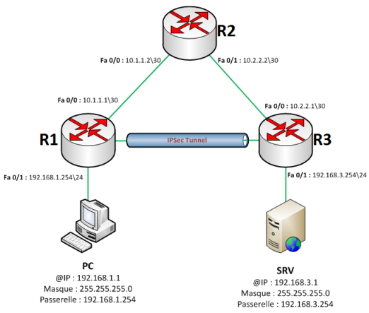

#### 2. Configuration de base
Avant de sécuriser les flux, j'ai d'abord établi la connectivité réseau standard en configurant les adresses IP et le routage dynamique.

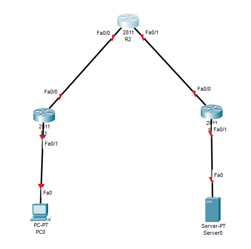

**Routeur R1 :**
J'ai configuré les interfaces LAN et WAN, puis j'ai activé le routage RIPv2 pour annoncer les réseaux adjacents.

```text
Router>enable
Router#configure terminal
Router(config)#hostname R1

R1(config)#interface fastEthernet 0/1
R1(config-if)#ip address 192.168.1.254 255.255.255.0
R1(config-if)#no shutdown
R1(config-if)#exit

R1(config)#interface fastEthernet 0/0
R1(config-if)#ip address 10.1.1.1 255.255.255.252
R1(config-if)#no shutdown
R1(config-if)#exit

R1(config)#router rip
R1(config-router)#version 2
R1(config-router)#no auto-summary
R1(config-router)#network 192.168.1.0
R1(config-router)#network 10.1.1.0
R1(config-router)#exit
```

**Routeur R2 (Transit) :**
J'ai configuré ce routeur intermédiaire avec ses deux interfaces WAN pour relier R1 et R3.

```text
Router>enable
Router#configure terminal
Router(config)#hostname R2

R2(config)#interface fastEthernet 0/1
R2(config-if)#ip address 10.2.2.2 255.255.255.252
R2(config-if)#no shutdown
R2(config-if)#exit

R2(config)#interface fastEthernet 0/0
R2(config-if)#ip address 10.1.1.2 255.255.255.252
R2(config-if)#no shutdown
R2(config-if)#exit

R2(config)#router rip
R2(config-router)#version 2
R2(config-router)#no auto-summary
R2(config-router)#network 10.2.2.0
R2(config-router)#network 10.1.1.0
R2(config-router)#exit
```

**Routeur R3 :**
J'ai appliqué la configuration miroir de R1 pour le site distant, avec ses propres interfaces LAN et WAN.

```text
Router>enable
Router#configure terminal
Router(config)#hostname R3

R3(config)#interface fastEthernet 0/1
R3(config-if)#ip address 192.168.3.254 255.255.255.0
R3(config-if)#no shutdown
R3(config-if)#exit

R3(config)#interface fastEthernet 0/0
R3(config-if)#ip address 10.2.2.1 255.255.255.252
R3(config-if)#no shutdown
R3(config-if)#exit

R3(config)#router rip
R3(config-router)#version 2
R3(config-router)#no auto-summary
R3(config-router)#network 10.2.2.0
R3(config-router)#network 192.168.3.0
R3(config-router)#exit
```

**Test de connectivité initial :**
J'ai effectué un ping depuis le PC (site R1) vers le Serveur (site R3) pour valider le routage. À ce stade, le trafic passe en clair sur le réseau R2.

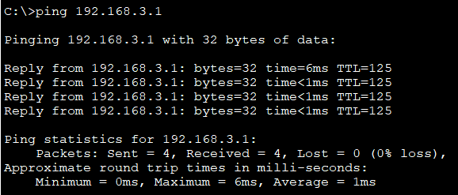

#### 3. Configuration du VPN IPsec

**Contexte SOC / Blue Team :** Le VPN doit être configuré uniquement sur les routeurs d'extrémité (R1 et R3). La construction du tunnel IPsec se fait en deux grandes phases strictes : IKE Phase 1 pour créer un canal de gestion sécurisé entre les pairs, et IPsec Phase 2 pour négocier le chiffrement des données utilisateur réelles.

**Configuration VPN sur R1 :**
J'ai commencé par la Phase 1 en activant ISAKMP et en définissant la politique de sécurité (AES-256, SHA, Diffie-Hellman group 5) ainsi que la clé pré-partagée associée à l'IP publique de R3.

```text
R1(config)#crypto isakmp enable
R1(config)#crypto isakmp policy 10
R1(config-isakmp)#authentication pre-share
R1(config-isakmp)#encryption aes 256
R1(config-isakmp)#hash sha
R1(config-isakmp)#group 5
R1(config-isakmp)#lifetime 3600
R1(config-isakmp)#exit

R1(config)#crypto isakmp key mot_de_passe address 10.2.2.1
```

J'ai ensuite configuré la Phase 2 en créant le Transform-Set et l'ACL étendue pour identifier le "trafic intéressant" (le trafic entre les deux LAN qui doit être chiffré).

```text
R1(config)#crypto ipsec transform-set 50 esp-aes 256 esp-sha-hmac
R1(config)#crypto ipsec security-association lifetime seconds 1800

R1(config)#access-list 101 permit ip 192.168.1.0 0.0.0.255 192.168.3.0 0.0.0.255
```

Enfin, j'ai assemblé ces paramètres dans une Crypto Map que j'ai appliquée sur l'interface WAN sortante (FastEthernet 0/0).

```text
R1(config)#crypto map nom_de_map 10 ipsec-isakmp
R1(config-crypto-map)#set peer 10.2.2.1
R1(config-crypto-map)#set transform-set 50
R1(config-crypto-map)#set security-association lifetime seconds 900
R1(config-crypto-map)#match address 101
R1(config-crypto-map)#exit

R1(config)#interface fastEthernet 0/0
R1(config-if)#crypto map nom_de_map
R1(config-if)#exit
```

**Configuration VPN sur R3 :**
J'ai reproduit la logique sur le site distant. J'ai configuré l'ISAKMP (Phase 1) avec les mêmes paramètres cryptographiques et la clé partagée pointant vers l'IP publique de R1.

```text
R3(config)#crypto isakmp enable
R3(config)#crypto isakmp policy 10
R3(config-isakmp)#authentication pre-share
R3(config-isakmp)#encryption aes 256
R3(config-isakmp)#hash sha
R3(config-isakmp)#group 5
R3(config-isakmp)#lifetime 3600
R3(config-isakmp)#exit

R3(config)#crypto isakmp key mot_de_passe address 10.1.1.1
```

J'ai défini le Transform-Set et créé l'ACL inverse (du réseau R3 vers le réseau R1).

```text
R3(config)#crypto ipsec transform-set 50 esp-aes 256 esp-sha-hmac
R3(config)#crypto ipsec security-association lifetime seconds 1800

R3(config)#access-list 101 permit ip 192.168.3.0 0.0.0.255 192.168.1.0 0.0.0.255
```

J'ai finalisé la configuration en créant la Crypto Map sur R3 et en l'appliquant sur son interface WAN.

```text
R3(config)#crypto map nom_de_map 10 ipsec-isakmp
R3(config-crypto-map)#set peer 10.1.1.1
R3(config-crypto-map)#set transform-set 50
R3(config-crypto-map)#set security-association lifetime seconds 900
R3(config-crypto-map)#match address 101
R3(config-crypto-map)#exit

R3(config)#interface fastEthernet 0/0
R3(config-if)#crypto map nom_de_map
R3(config-if)#exit
```

#### 4. Vérifications et validation du chiffrement

**Contexte SOC / Blue Team :** La confiance n'exclut pas le contrôle. Un VPN qui "ping" n'est pas forcément un VPN qui "chiffre". Il faut s'assurer que les paquets sont bien encapsulés dans le tunnel IPsec et que la négociation des clés a réussi.

**Test de communication :** J'ai généré du trafic en réalisant un ping depuis le PC (192.168.1.1) vers le serveur (192.168.3.1). Ce trafic est nécessaire pour déclencher le montage du tunnel IPsec.

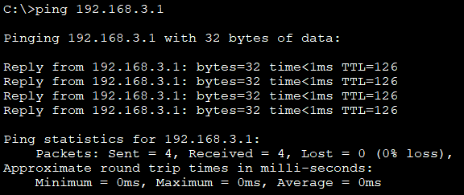

**Vérification du Transform-Set :** Je me suis assuré des méthodes de chiffrement négociées sur R1 et R3. Le résultat doit indiquer `esp-256-aes esp-sha-hmac`.

Sur R1 :
```text
R1#show crypto ipsec transform-set
```

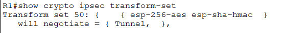

Sur R3 :
```text
R3#show crypto ipsec transform-set
```

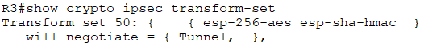

**Vérification de la Crypto Map :** Cette commande me permet de vérifier le Peer IP (l'adresse publique du pair distant), l'ACL appliquée et l'interface de sortie.

Sur R1 :
```text
R1#show crypto map
```

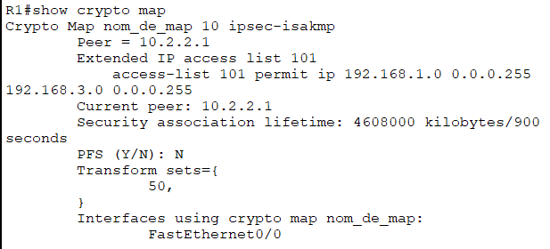

Sur R3 :
```text
R3#show crypto map
```

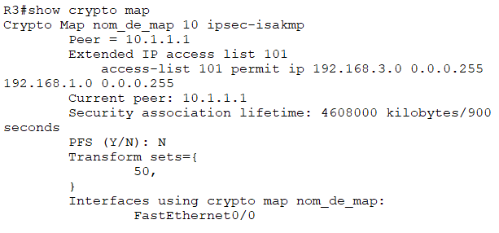

**Vérification des S.A (Security Associations) d'IPsec (Phase 2) :** **Action SOC :** J'ai vérifié impérativement que les compteurs `#pkts encaps` et `#pkts encrypt` (paquets encapsulés/chiffrés) s'incrémentaient. Si le résultat affichait 0, mon trafic passerait en clair ou serait bloqué !

Sur R1 :
```text
R1#show crypto ipsec sa
```

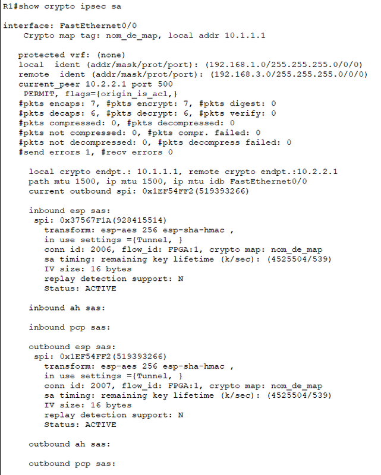

Sur R3 :
```text
R3#show crypto ipsec sa
```

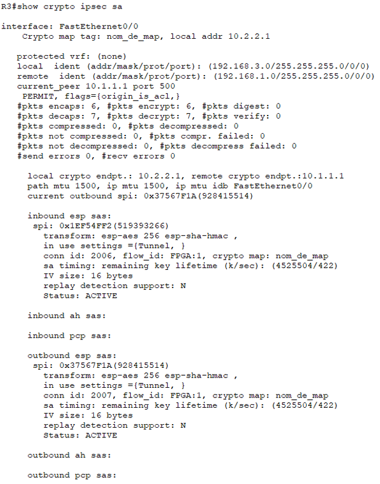

**Vérification d'ISAKMP (Phase 1) :** Je valide ici le canal de gestion. Le statut doit indiquer `QM_IDLE` et l'état `ACTIVE`, prouvant que le tunnel de gestion est monté et stable.

Sur R1 :
```text
R1#show crypto isakmp sa
```

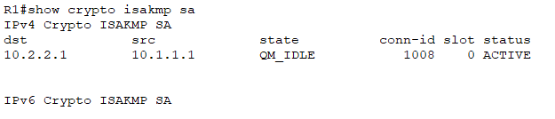

Sur R3 :
```text
R3#show crypto isakmp sa
```

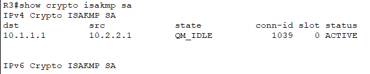

Votre VPN IPSEC est maintenant correctement configuré.

### Implications pour un Analyste SOC
La mise en place de ce tunnel IPsec illustre parfaitement le concept de défense en profondeur. Du point de vue d'un Analyste SOC, comprendre la mécanique des phases IKE et de l'encapsulation ESP est critique lors des investigations réseau. Si des flux de données transitent en clair entre deux sites, c'est une non-conformité majeure (faille de confidentialité). De plus, savoir lire les états des Security Associations (SA) permet de diagnostiquer rapidement si une coupure réseau est due à un problème de routage ou à une erreur de négociation cryptographique (ex: expiration de clés, désynchronisation des algorithmes). Ce laboratoire démontre la capacité à isoler et protéger des communications sensibles sur une infrastructure non maîtrisée.

Dans ce lab, une PSK (Pre-Shared Key) est utilisée pour simplifier la topologie. En environnement d'entreprise réel, l'authentification IKE Phase 1 devrait idéalement s'appuyer sur des certificats numériques (PKI) pour éviter les attaques par force brute sur les clés partagées.

---
*Fin du rapport de Lab.*