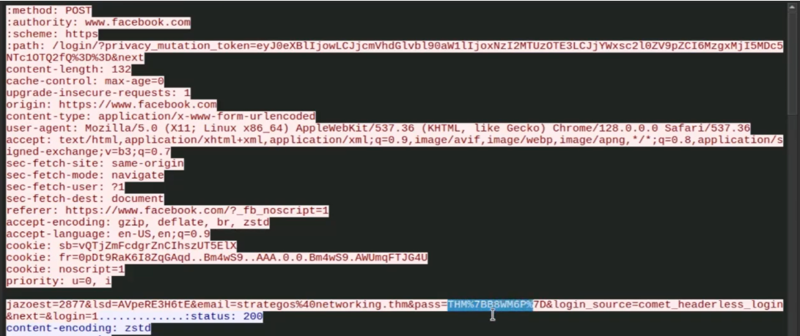

# Analyse Réseau : Déchiffrement de Trafic TLS avec Wireshark

**Projet :** Capture de Flag (CTF) / Analyse Forensic

**Outils :** Wireshark, Chromium, Linux CLI

**Concept clé :** Inspection de trafic HTTPS via l'importation de clés de session (SSL Key Logging).

---

## CONTEXTE
L'objectif de ce laboratoire est d'analyser une capture de paquets (`.pcapng`) générée par une session de navigation. Le trafic est chiffré via TLS, rendant l'analyse du contenu impossible (payload illisible). Cependant, le navigateur a été configuré pour enregistrer les clés de session TLS dans un fichier de log externe via la commande :
`chromium --ssl-key-log-file=~/ssl-key.log`

Mon objectif est d'utiliser ce fichier de clés pour déchiffrer le trafic dans Wireshark et récupérer des identifiants de connexion compromis.

---

## MÉTHODOLOGIE

### 1. Configuration de Wireshark pour le déchiffrement
Par défaut, Wireshark affiche le trafic chiffré sous le protocole **TLSv1.3**. Le contenu des paquets est caché dans la section "Application Data".

Pour déchiffrer le flux, j'ai importé le fichier des clés maîtres (`ssl-key.log`) dans les préférences du protocole TLS.

* **Chemin :** `Edit` -> `Preferences` -> `Protocols` -> `TLS`
* **Champ :** `(Pre)-Master-Secret log filename`


*Injection du fichier de clés SSL dans Wireshark.*

### 2. Identification du trafic suspect
Une fois les clés chargées, Wireshark rafraîchit la vue. On observe un changement immédiat :
* Le protocole passe de **TLS** à **HTTP** ou **HTTP2**.
* Le contenu des paquets devient lisible en clair.

Pour trouver rapidement les tentatives de connexion, j'ai utilisé la fonction de recherche de paquets (**CTRL+F**) avec les paramètres suivants :
* **Type :** String (Chaîne de caractères)
* **Recherche :** "login"


*Localisation des paquets HTTP POST contenant le terme "login".*

### 3. Extraction des identifiants (Le Flag)
J'ai identifié une requête **POST** vers `/login/?privacy_mutation...`. En effectuant un clic droit -> **Follow -> HTTP Stream**, j'ai pu isoler le flux de données complet de cette transaction.

Dans le corps de la requête (Body), les données du formulaire sont visibles :


*Visualisation des données POST déchiffrées.*

**Données brutes extraites :**
```text
email=strategos%40networking.thm&pass=THM%7BB8WM6P%7D
```

### 4. Décodage et Résultat
Le mot de passe est encodé au format URL (URL Encoded).
* `%7B` correspond à `{`
* `%7D` correspond à `}`

Après décodage de la chaîne `THM%7BB8WM6P%7D`, j'ai obtenu le flag final.

> **FLAG FINAL :** `THM{B8WM6P}`

---

## CONCLUSION
Cet exercice démontre l'importance de la protection des fichiers de logs de clés SSL. Si un attaquant parvient à voler ce fichier (via un malware ou une mauvaise configuration), il peut déchiffrer rétroactivement tout le trafic HTTPS capturé, exposant ainsi des données critiques comme les mots de passe, même si la connexion initiale était sécurisée par TLS.