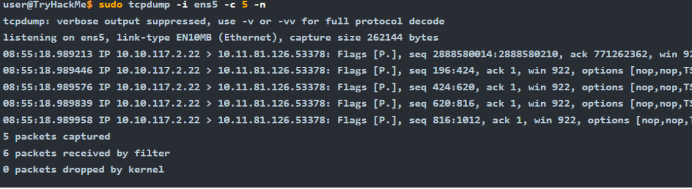
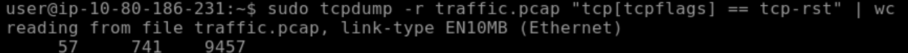
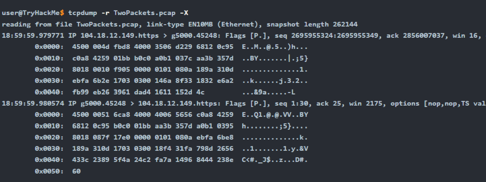

# Network Traffic Forensics avec Tcpdump

**Catégorie :** Analyse Réseau / Digital Forensics
**Outil :** Tcpdump (CLI)
**Contexte :** Analyse de paquets, débogage réseau et inspection de trafic suspect sans interface graphique.

---

## 1. Introduction

Tcpdump est un outil d'analyse de paquets en ligne de commande (CLI) utilisant la librairie `libpcap`. Contrairement à Wireshark, il est léger, stable et omniprésent sur les serveurs Unix/Linux, ce qui en fait l'outil de prédilection pour l'analyse rapide ou l'automatisation sur des machines distantes.

Ce document synthétise les commandes essentielles pour capturer, filtrer et inspecter le trafic réseau.


*Figure 1 : Interface standard de Tcpdump lors d'une capture en temps réel.*

---

## 2. Commandes Fondamentales

La syntaxe de base repose sur des options pour contrôler la capture et l'affichage.

| Option | Description | Contexte d'utilisation |
| :--- | :--- | :--- |
| `-i [interface]` | Sélectionne l'interface (ex: `eth0`, `any`). | Obligatoire pour cibler le bon flux réseau. |
| `-w [fichier.pcap]` | Écrit les paquets dans un fichier. | Pour analyse ultérieure dans Wireshark. |
| `-r [fichier.pcap]` | Lit un fichier de capture existant. | Analyse post-incident ou Forensic. |
| `-c [nombre]` | Limite la capture à X paquets. | Évite de saturer le disque ou le terminal. |
| `-n` / `-nn` | Désactive la résolution DNS / Ports. | **Crucial** pour la performance et éviter de générer du trafic DNS parasite. |
| `-v`, `-vv` | Mode verbeux. | Affiche plus de détails sur les en-têtes IP (TTL, ID, etc.). |

### Exemple de capture standard
```bash
# Capture sur l'interface eth0, sans résolution DNS, sauvegarde dans traffic.pcap
sudo tcpdump -i eth0 -n -w traffic.pcap
```

---

## 3. Filtrage de Trafic (Bruit vs Signal)

La puissance de Tcpdump réside dans sa capacité à isoler des conversations spécifiques à l'aide de filtres.

### Filtres par Cible
```bash
# Filtrer par IP hôte (Source ou Destination)
tcpdump host 192.168.1.5

# Filtrer par direction spécifique
tcpdump src host 192.168.1.5
tcpdump dst host 10.0.0.1
```

### Filtres par Service et Protocole
```bash
# Filtrer par port (ex: DNS)
tcpdump port 53

# Filtrer par protocole (ICMP, TCP, UDP)
tcpdump icmp
```

### Opérateurs Logiques
Il est possible de combiner des critères complexes avec `and`, `or`, et `not`.

```bash
# Scénario : Capturer tout le trafic HTTPS vers un serveur spécifique
tcpdump host example.com and tcp port 443

# Scénario : Exclure le trafic SSH (pour ne pas capturer sa propre session)
tcpdump not port 22
```

---

## 4. Analyse Avancée & Flags TCP

Pour l'analyse de sécurité, il est nécessaire d'aller au-delà des adresses IP et d'inspecter l'état des connexions TCP (Handshake, Tear-down, Scans).

### Inspection des En-têtes (Flags)
Tcpdump permet de filtrer sur des bits spécifiques de l'en-tête TCP.

```bash
# Détection de scans SYN (Début de connexion)
tcpdump "tcp[tcpflags] == tcp-syn"

# Détection de réinitialisations de connexion (RST)
# Utile pour identifier des scans de ports ou des refus de service
tcpdump "tcp[tcpflags] == tcp-rst"
```


*Figure 2 : Identification des flags TCP (SYN, ACK, RST) dans le flux.*

### Filtrage par taille de paquet (Anomalies)
La taille des paquets peut indiquer une exfiltration de données ou du tunneling.

```bash
# Isoler les paquets supérieurs à 15000 octets
tcpdump greater 15000
```

---

## 5. Inspection du Contenu (Payload)

Lorsque le trafic n'est pas chiffré (HTTP, Telnet, FTP), Tcpdump peut afficher le contenu des paquets (payload) pour récupérer des informations sensibles.

| Option | Affichage | Utilité |
| :--- | :--- | :--- |
| `-A` | ASCII | Idéal pour lire des pages Web, des logs ou des identifiants en clair. |
| `-xx` | Hexadécimal | Pour l'analyse bas niveau ou le reverse engineering de protocoles. |
| `-X` | Hex + ASCII | Le format le plus complet pour l'analyse forensique. |

### Exemple : Extraction de données
```bash
# Lire un pcap et afficher le contenu en ASCII et Hex
tcpdump -r traffic.pcap -X
```


*Figure 3 : Vue détaillée d'un paquet montrant les en-têtes en Hexadécimal et le contenu décodé en ASCII.*
