# Detecting AD Credential Attacks: Kerberoasting to Domain Compromise

## Disclaimer

This write-up covers five credential access techniques against Active Directory, each investigated against its own task-specific Splunk dataset (`task2` through `task6`) as the room structures them. I've kept a narrative thread running between the five sections because that's how the material itself frames the progression, a low-privilege attacker moving from cheap offline-cracking techniques toward full domain compromise, but each technique section stands on its own dataset rather than being one continuous forensic trail. The final section, an independent investigation run from a bare alert with no walkthrough, is a single continuous case built entirely on `task7`.

## TL;DR

Five techniques bridge the gap between a compromised domain user account and full control of Active Directory. Kerberoasting and AS-REP Roasting are the cheapest entry points, both abuse Kerberos to hand an attacker material they can crack offline, and both require little more than a valid (or in AS-REP Roasting's case, no) domain account. LSASS dumping is the fallback when neither cracking route pays off fast enough: pull credentials directly from a machine where a privileged session is active. Once an attacker holds Domain Admin-equivalent access by any of those routes, DCSync and NTDS.dit extraction are two ways to cash it in for every password hash in the domain, one remote and quiet, one local and noisy. The independent investigation at the end reconstructs exactly this chain from a single alert: a Kerberoasting burst, a parallel AS-REP Roasting attempt from the same source IP, an LSASS dump via `rundll32.exe` and `comsvcs.dll`, and a confirmed DCSync operation, with one honest gap where source IP correlation for the DCSync step didn't resolve.

## Environment

- Domain: `TRYHATMESTUDIOS.THM`
- Domain Controller: `THM-DC`
- Splunk instance with per-task indexes (`task2` through `task7`) ingesting Windows Security events (4768, 4769, 4662, 4624) and Sysmon events (Event ID 1, 10, 11)

## Lab Objective

Detect Kerberoasting, AS-REP Roasting, LSASS credential dumping, DCSync, and NTDS.dit extraction using the specific log sources and field values each technique leaves behind, then correlate findings across host and domain controller logs to trace an attacker's escalation path from initial foothold to domain compromise.

## Tools and Technologies

- Splunk (SPL)
- Windows Security Event Log (Events 4768, 4769, 4662, 4624)
- Sysmon (Event ID 1, process creation; Event ID 10, process access; Event ID 11, file creation)

---

## Kerberoasting

Any domain user, however low-privileged, can request a Kerberos service ticket (TGS) for any Service Principal Name in the domain. The domain controller doesn't check whether the requester actually intends to use the service, it just encrypts the ticket with the service account's password hash and hands it over. If that service account has a weak password, and plenty do because someone registered an SPN on a shared admin account years ago and never revisited it, the attacker cracks the hash offline and walks away with whatever privileges that account holds. This costs the attacker nothing but a single low-privilege foothold, which makes it the natural first move in almost any AD-focused intrusion.

### Detection

The signal lives in Event 4769 (Kerberos Service Ticket Requested). Modern AD environments default to AES-256 (`0x12`) for these tickets. Kerberoasting tools like Rubeus and Impacket's `GetUserSPNs.py` downgrade the request to RC4 (`0x17`) because RC4 hashes crack far faster. A TGS request with `Ticket_Encryption_Type=0x17` in an AES-default environment is the primary indicator.

One field quirk worth knowing before reading any of these events: `Client_Address` on modern domain controllers uses IPv6-mapped IPv4 notation. `::ffff:10.5.90.1` means the source is `10.5.90.1`, not an error, not an actual IPv6 host.

```spl
index=task2 EventCode=4769 Ticket_Encryption_Type=0x17
Service_Name!="*$" Service_Name!="krbtgt"
| table _time, Account_Name, Service_Name, Ticket_Encryption_Type, Client_Address
| sort _time
```

Nine RC4 TGS requests, all from `emma.wilson@TRYHATMESTUDIOS.THM`, all from `::ffff:10.5.90.1`, all landing within the same minute against nine different service accounts (`svc-print`, `svc-mail`, `svc-backup`, `svc-share`, `svc-sql`, `svc-web`, `svc-report`, `svc-app`, `svc-ftp`). One account requesting tickets for the entire service account inventory in under sixty seconds is not a user going about their day.

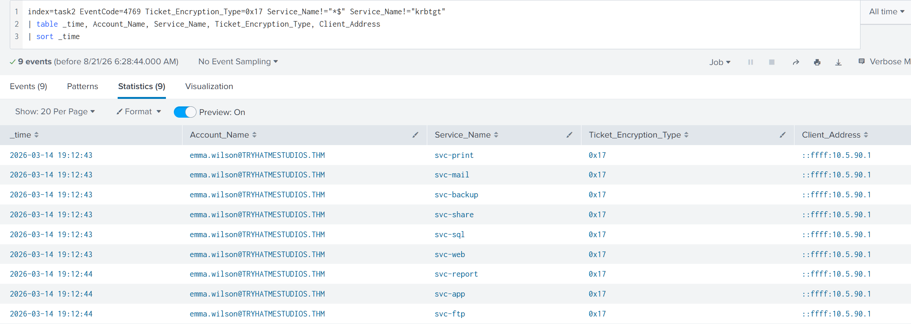

Aggregating answers the triage questions in one query: how many accounts were targeted, who ran it, and where from.

```spl
index=task2 EventCode=4769 Ticket_Encryption_Type=0x17
Service_Name!="*$" Service_Name!="krbtgt"
| stats dc(Service_Name) as targeted_services count by Account_Name, Client_Address
```

`emma.wilson`, nine distinct services, nine requests, single source. Confirmed.

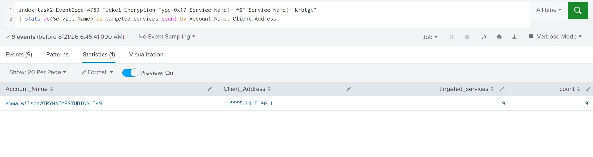

### The RC4 filter is a decaying signal

In 2022 TrustedSec released Orpheus, demonstrating Kerberoasting entirely over AES-256, which sails straight past any `Ticket_Encryption_Type=0x17` filter. Microsoft has been pushing AES as the Kerberos default since Windows Server 2025. RC4-based detection is still the most reliable indicator in most environments today, both BlackSuit and Akira ransomware operators have used it in confirmed intrusions, but it's not going to hold indefinitely.

The backup is volume, not encryption type. Tools like `GetUserSPNs.py` and Rubeus request tickets for every SPN-holding account by default, which produces a burst regardless of what encryption the tickets end up using:

```spl
index=task2 EventCode=4769 Service_Name!="*$" Service_Name!="krbtgt"
| bin _time span=5m
| stats dc(Service_Name) as unique_spns count by Account_Name, Client_Address, _time
| where unique_spns > 5
```

Run against the same dataset, this catches a second account, `sarah.chen@TRYHATMESTUDIOS.THM` from `::ffff:10.10.45.12`, purely on request volume within a five-minute window. Same underlying behavior, different filter, independent confirmation that volume-based detection holds even without an encryption downgrade to lean on.

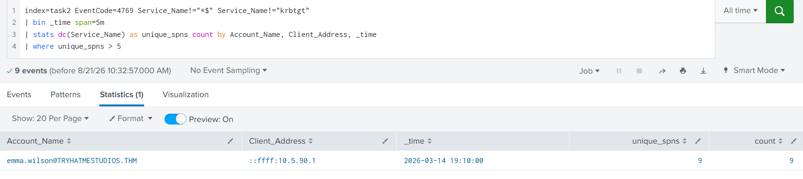

The threshold of 5 unique SPNs is tuned for this lab. In production, baseline how many distinct service tickets a typical account requests during normal operations and set the threshold above that peak.

**Real-world grounding:** The DFIR Report documented BlackSuit ransomware operators using Rubeus to Kerberoast service accounts in an August 2024 intrusion. ReliaQuest tracked a separate BlackSuit case the same year where over 20 accounts were compromised through Kerberoasting, including a domain administrator. The CISA/FBI advisory on Akira ransomware (AA24-109A) lists Kerberoasting among its standard post-exploitation credential access techniques.

---

## AS-REP Roasting

Kerberoasting needs a valid domain account to run. AS-REP Roasting doesn't even need that. It targets a different weakness: user accounts with Kerberos preauthentication disabled (the `DONT_REQUIRE_PREAUTH` flag), usually left that way because some legacy application, an old ERP or payroll system, failed authentication unless preauth was turned off for its service account, and nobody ever turned it back on. An attacker only needs to know the username of an account with that flag set. No password, no valid session, nothing.

Under normal Kerberos authentication, a user proves they know their password before the DC will issue a TGT: encrypt a timestamp with the password hash, send it along with the AS-REQ, and the DC decrypts and verifies it before handing back the ticket. That flow logs Event 4768 with `Pre_Authentication_Type=2`, followed by a 4769 when the user requests a service ticket, followed by a 4624 when they actually log onto something. When preauth is disabled, the DC skips straight to issuing the TGT, no proof required, and that TGT comes back encrypted with the account's own password hash, crackable offline exactly like a Kerberoasted service ticket. The DC logs Event 4768 with `Pre_Authentication_Type=0`, and because the attacker only wanted the hash, there's no follow-up 4769 and no 4624. That absence is the tell.

### Detection

Start broad to see what the encryption and preauth fields normally look like:

```spl
index=task3 EventCode=4768
| table _time, Account_Name, Pre_Authentication_Type, Ticket_Encryption_Type, Client_Address
| sort _time
```

Six events. Four accounts show `Pre_Authentication_Type=2` with AES (`0x12`), from internal addresses in the `10.5.50.x` range, normal Kerberos authentication. Two events break that pattern: `alex.reed`, `Pre_Authentication_Type=0`, RC4 (`0x17`), from `::ffff:10.5.90.1`.

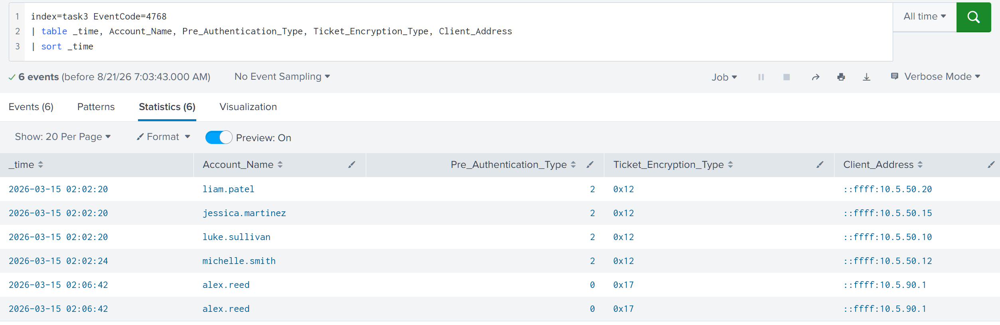

Isolating the anomaly:

```spl
index=task3 EventCode=4768 Pre_Authentication_Type=0
| table _time, Account_Name, Pre_Authentication_Type, Ticket_Encryption_Type, Client_Address
```

Two TGT requests for `alex.reed`, preauth disabled, RC4 encryption, same source IP.

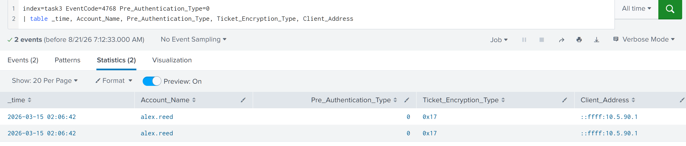

The confirming step is checking whether anything followed:

```spl
index=task3 (EventCode=4624 OR EventCode=4769)
| search Account_Name="alex.reed"
| table _time, EventCode, Account_Name, Client_Address
```

Zero results.

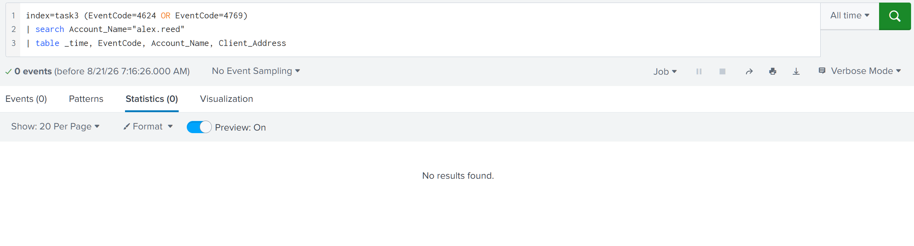

No logon, no service ticket request, nothing but the initial TGT grab. That's consistent with an attacker who only wanted the crackable hash and went offline with it. It's not airtight on its own, a legitimate application can fail before requesting a service ticket or rely on a cached ticket and produce the same silence, but paired with `Pre_Authentication_Type=0` and an RC4-encrypted TGT, the absence of follow-up activity makes malicious intent the far more likely read.

**Quick reference, the two side by side:** Kerberoasting targets service accounts with SPNs, requires a valid domain account, keys off `Ticket_Encryption_Type=0x17` on Event 4769, and yields a service account's password hash. AS-REP Roasting targets user accounts with preauth disabled, requires only a target username, keys off `Pre_Authentication_Type=0` on Event 4768, and yields a user account's password hash.

**Real-world grounding:** the same BlackSuit intrusion documented by The DFIR Report ran AS-REP Roasting alongside Kerberoasting in a single session, identifying one account with preauthentication disabled and harvesting its hash for extra cracking material on top of the service account tickets. The room's own dataset mirrors that pairing closely: `alex.reed`'s AS-REP Roasting attempt and `emma.wilson`'s Kerberoasting session both originate from the identical address, `10.5.90.1`, across the two task datasets, the same low-cost, high-yield pairing playing out twice.

---

## LSASS Credential Dumping

Kerberoasting and AS-REP Roasting both bet on weak passwords and offline cracking time. If neither pays off fast enough, or if the attacker lands on a machine where a privileged account already has an active session, LSASS dumping skips the cracking step entirely. LSASS holds live credentials in memory for every user who's authenticated to that machine: NTLM hashes, Kerberos tickets, cached domain credentials, and on older or misconfigured systems, plaintext passwords via WDigest. A domain admin who logged into a workstation that morning has left their credentials sitting in LSASS memory for anyone who can read that process.

### Detection

Sysmon Event 10 (ProcessAccess) fires when one process opens a handle to another. It only fires for LSASS specifically if the Sysmon configuration includes explicit ProcessAccess rules targeting `lsass.exe`, that's not part of a default install, so this technique can be entirely invisible if the config wasn't set up for it.

Two fields carry the weight of this detection. `GrantedAccess` is a hex bitmask built from individual access rights: `PROCESS_QUERY_LIMITED_INFORMATION` (`0x1000`) is harmless, `PROCESS_VM_READ` (`0x0010`) is the bit that actually matters since reading process memory is how credentials get extracted, and `PROCESS_ALL_ACCESS` (`0x1FFFFF`) is full access, associated with ProcDump, `comsvcs.dll`, and Task Manager. `CallTrace` shows the DLL chain that led to the access: known DLLs like `dbgcore.dll` or `dbghelp.dll` mean the legitimate MiniDump API was used for an illegitimate purpose, while `UNKNOWN` memory offsets with no backing DLL mean injected code, the signature of Cobalt Strike beacons and similar in-memory implants.

Legitimate LSASS access comes from a short, known list: `csrss.exe`, `WerFault.exe`, `svchost.exe`, and AV/EDR agents, all from their proper `System32` paths. That last part matters more than the process name. An attacker can name a tool `svchost.exe` and drop it in `C:\Temp\`, the filename looks clean but the path gives it away every time.

Starting broad, before filtering anything out:

```spl
index=task4 EventCode=10 TargetImage="*\\lsass.exe"
| stats count by SourceImage, GrantedAccess
```

Mixed in with expected `svchost.exe` entries at `0x1000` is `C:\Windows\Temp\procdump64.exe` at `0x1FFFFF`, PROCESS_ALL_ACCESS, and the path alone is disqualifying, ProcDump has no business running from a temp directory.

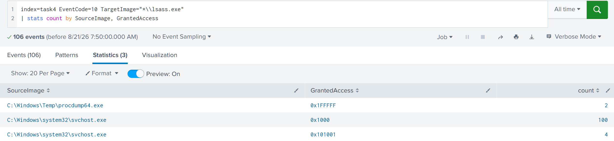

```spl
index=task4 EventCode=10 TargetImage="*\\lsass.exe"
SourceImage="C:\\Windows\\Temp\\procdump64.exe"
| table _time, SourceImage, SourceUser, GrantedAccess, CallTrace
```

Two events, both carrying `dbgcore.dll` in the call chain, confirming a MiniDump-based dump rather than injection, a hands-on-keyboard attacker using a LOLBin rather than a more sophisticated implant. `SourceUser` reads `tryhatmestudios\adm-luke.sullivan`, a domain admin-tier account by its naming convention, meaning this account is now confirmed compromised, and whatever it has access to across the domain needs to be treated as exposed.

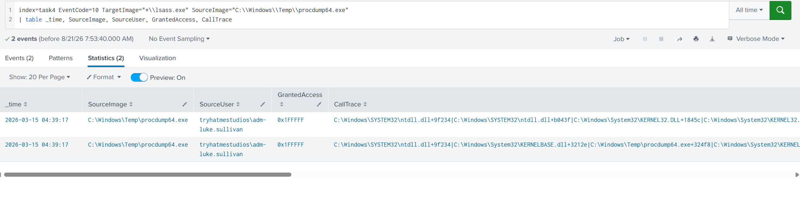

LSASS isn't the only credential store on a Windows host, the local SAM database and cached domain credentials (DCC2 hashes) are both extractable too, but neither gives an attacker anything close to what LSASS does. SAM only holds local accounts on that one machine, and DCC2 hashes are slow to crack and useless for Pass-the-Hash. LSASS is the target that matters because it holds live domain credentials in a directly usable format, no cracking required if the right account happens to be logged in.

**Real-world grounding:** in the BlackSuit intrusion tracked by The DFIR Report, the August 2024 case accessed LSASS through an injected `mstsc.exe` process (`0x1010`), and a separate March 2025 case used `dllhost.exe` (`0x1FFFFF`). Both had `UNKNOWN` offsets in their CallTrace, Cobalt Strike beacon injection rather than the MiniDump method found here, a useful contrast for recognizing which class of tooling an attacker is running.

---

## DCSync

At this point the attacker holds Domain Admin-equivalent access, either a Kerberoasted or AS-REP Roasted account that happened to carry high privilege, or a dumped LSASS session belonging to an actual admin. Either way, the question becomes what they do with that access. DCSync is one answer: abuse the Active Directory replication protocol (DRSUAPI) to pull every password hash in the domain without ever touching the domain controller's disk, creating a shadow copy, or needing physical access. The attacker's machine simply pretends to be a domain controller and asks the real one for replication data. Domain Admins, Enterprise Admins, and DC machine accounts have the rights to make that request by default, and in some environments an attacker can get those same rights through ACL abuse (WriteDACL on the domain object) without ever joining a privileged group at all.

The permission that matters is a specific extended right: `DS-Replication-Get-Changes-All`, GUID `{1131f6ad-9c07-11d1-f79f-00c04fc2dcd2}`. That's what allows pulling password data specifically, as opposed to the more limited `DS-Replication-Get-Changes` right.

### Detection

Event 4662 (An operation was performed on an object) fires when someone exercises a Directory Service Access extended right, and the replication GUID shows up embedded in the raw event data.

This detection has a real prerequisite gap worth knowing before trusting an empty result: it requires "Audit Directory Service Access" enabled via Group Policy *and* a SACL configured on the domain partition to audit replication operations specifically. Neither is on by default. Without both, DCSync is completely invisible in the logs, and this is one of the most common detection gaps in real environments.

```spl
index=task5 EventCode=4662 "1131f6ad" user!="*$"
| table _time, user, Access_Mask, Properties
| sort _time
```

One event: `adm-luke.sullivan`, `Access_Mask=0x100` (Control Access), `Properties` confirming the operation. The same account confirmed compromised via LSASS dumping is now exercising domain replication rights.

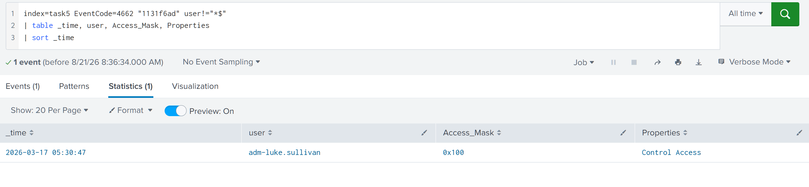

Expanding the raw event shows the full GUID in the `Properties` block, `{1131f6ad-9c07-11d1-f79f-00c04fc2dcd2}`, which is why the query filters on that string directly against the raw event text rather than a parsed field, Splunk doesn't extract the individual GUIDs into their own field.

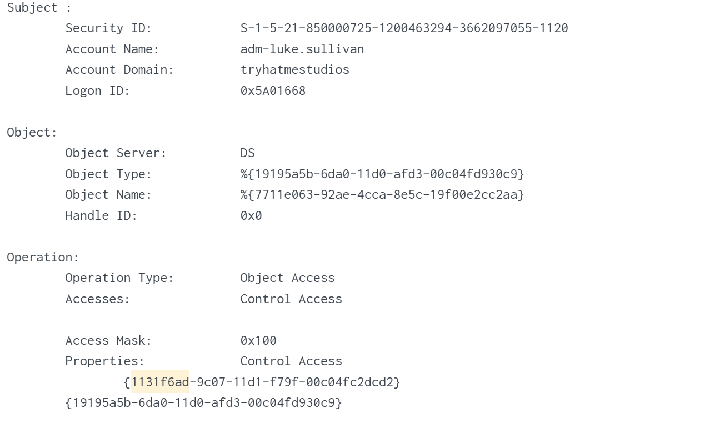

Worth flagging: the `user!="*$"` filter assumes the attacker is using a human account. An adversary who's compromised a machine account hash, through ADCS abuse or unconstrained delegation, can perform DCSync from a machine account and slide straight past this filter. In a mature environment it's worth baselining which machine accounts normally replicate rather than trusting the `$` exclusion as a complete answer.

Event 4662 doesn't carry a source IP directly. Getting one means correlating the `Logon_ID` from the 4662 event against a 4624 logon event for the same session:

```spl
index=task5 EventCode=4662 Access_Mask=0x100 user=adm-luke.sullivan "1131f6ad"
| table _time, host, user, Logon_ID
```

`Logon_ID` comes back as `0x5A01668`.

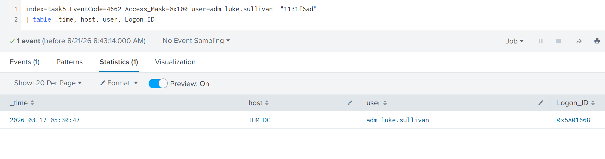

```spl
index=task5 EventCode=4624 Logon_ID=0x5A01668
| table _time, host, user, Source_Network_Address, Logon_Type
```

`Source_Network_Address` resolves to `10.5.90.1`, `Logon_Type` 3 (Network). That's the same source address behind both the Kerberoasting and AS-REP Roasting sessions earlier in this write-up, three separate task datasets, three separate techniques, one recurring source IP.

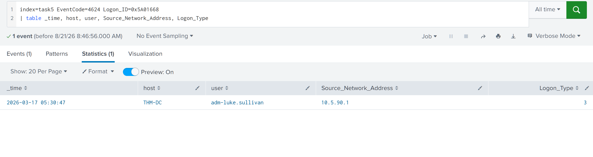

**Real-world grounding:** incident responders investigating the SolarWinds compromise documented APT29 using privileged accounts to replicate directory service data, confirming DCSync as part of that intrusion. Scattered Spider treats DCSync as a standard part of their credential access playbook once they've obtained domain admin credentials, typically via Mimikatz or `secretsdump.py`.

---

## NTDS.dit Extraction

DCSync works remotely and blends into legitimate replication traffic. It's not the only way to pull every hash in the domain, though, and it's not always the method an attacker reaches for. Before DCSync became the standard approach, and still today when an attacker has direct hands-on access to the domain controller itself rather than remote replication rights, the older method is copying the NTDS.dit database file straight off the DC's disk. It's noisier and it requires local access to the DC, but it's still active in real intrusions.

NTDS.dit sits at `C:\Windows\NTDS\ntds.dit` and contains every account hash in the domain. Windows locks the file while AD DS is running, so a direct copy fails, and attackers work around that lock two ways. `vssadmin` creates a volume shadow copy, a point-in-time filesystem snapshot that isn't subject to the same lock, then copies `ntds.dit` and the `SYSTEM` registry hive (needed to decrypt the hashes) out of the snapshot before deleting it as cleanup. `ntdsutil`, a legitimate AD management tool meant for domain controller promotion, has an Install From Media (IFM) feature attackers abuse to produce a clean copy of both files directly. Either method needs privileged DC access, local admin for `vssadmin`, Domain Admin-equivalent for `ntdsutil`, and either one hands the attacker an offline database parseable with `secretsdump.py` or similar.

### Detection

Both methods show up in process creation events, `ntdsutil.exe` or `vssadmin.exe` running with arguments tied to shadow copies or IFM, and Sysmon Event 11 catches the resulting file write when `ntds.dit` lands somewhere it shouldn't.

**ntdsutil path:**

```spl
index=task6 EventCode=1 Image="*\ntdsutil.exe"
| table _time, host, User, ParentImage, Image, CommandLine
```

`ntdsutil "ac i ntds" "ifm" "create full C:\Perflogs\1" q q`, launched from `cmd.exe`. The full IFM command line, no ambiguity about what it's doing.

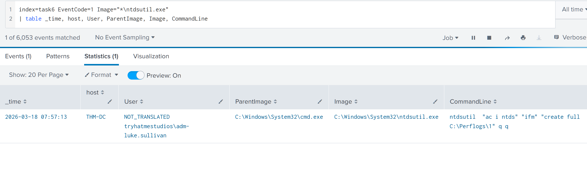

```spl
index=task6 EventCode=11 TargetFilename="*ntds.dit" Image="*\\ntdsutil.exe"
| table _time, Image, TargetFilename
```

Confirms the write: `C:\PerfLogs\1\Active Directory\ntds.dit`. The extraction completed.

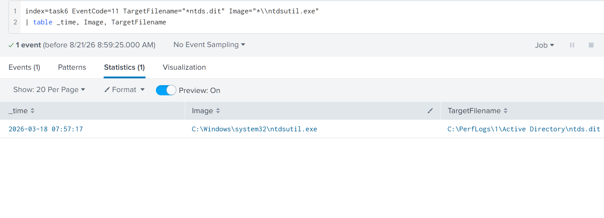

**vssadmin path:**

```spl
index=task6 EventCode=1 Image="*\vssadmin.exe" CommandLine="*create shadow*"
| table _time, host, User, ParentImage, Image, CommandLine
```

`vssadmin create shadow /for=C:`. On its own this event doesn't confirm credential theft, shadow copies have entirely legitimate backup and restore uses. What confirms intent is what happens next.

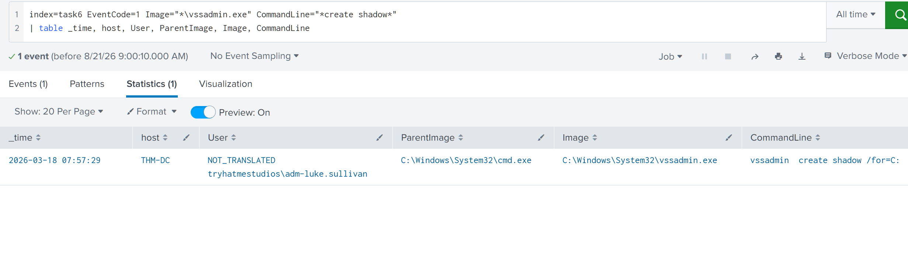

```spl
index=task6 EventCode=1 CommandLine="*HarddiskVolumeShadowCopy*"
(CommandLine="*ntds*" OR CommandLine="*SYSTEM*")
| table _time, host, User, ParentImage, Image, CommandLine
```

Two copy commands, pulling both `SYSTEM` and `ntds.dit` out of `HarddiskVolumeShadowCopy7` into `C:\Windows\Temp\`. Both files together are everything needed to extract every credential in the domain offline.

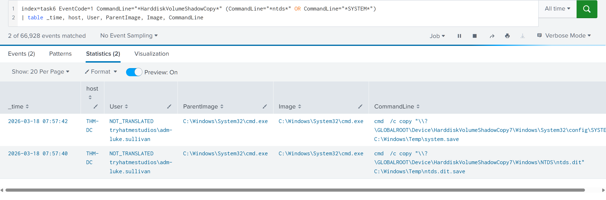

**DCSync versus NTDS.dit extraction, side by side:** DCSync is remote replication over DRSUAPI, needs only replication rights, shows up as a single Event 4662, leaves no network artifacts distinguishing it from normal traffic beyond the source, and stays quiet. NTDS.dit extraction is a local file copy via shadow copy or IFM, needs local admin on the DC itself, shows up across multiple Sysmon process and file creation events, and is comparatively loud. An attacker with remote replication rights and a preference for staying quiet reaches for DCSync. An attacker who already has hands-on access to the DC, or simply doesn't have the replication rights DCSync needs, reaches for this instead.

---

## Independent Investigation: From a Kerberoasting Alert to Confirmed Domain Replication

### Scenario
A detection rule fired on a burst of TGS requests with RC4 encryption from a single source within a 60-second window, targeting multiple service accounts across different departments, from a source IP that didn't belong to any known service or scheduled task. Everything past that alert is my own reconstruction, run entirely against `task7`, applying the same detection logic built across the five techniques above to find out how far this attacker actually got.

### Confirming Kerberoasting

The alert description maps directly onto the Kerberoasting signature already established: RC4-encrypted TGS requests, burst pattern, single source.

```spl
index=task7 EventCode=4769 Ticket_Encryption_Type=0x17
Service_Name!="*$" Service_Name!="krbtgt"
| table _time, Account_Name, Service_Name, Ticket_Encryption_Type, Client_Address
```

Nine RC4 TGS requests from `nathan.brooks@TRYHATMESTUDIOS.THM`, all at `16:07:13`, all from `::ffff:10.5.90.1`, the same address behind the Kerberoasting, AS-REP Roasting, and DCSync findings earlier in this write-up.

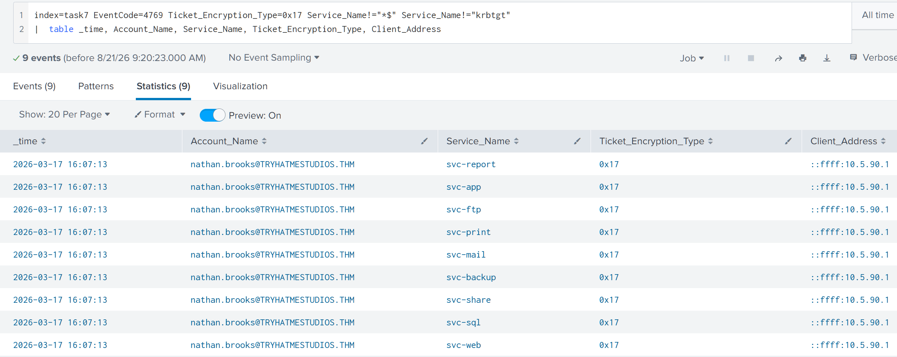

```spl
index=task7 EventCode=4769 Ticket_Encryption_Type=0x17
Service_Name!="*$" Service_Name!="krbtgt"
| stats dc(Service_Name) as targeted_accounts count by Account_Name, Client_Address
```

Nine distinct services, nine requests, one source. The alert is confirmed as Kerberoasting.

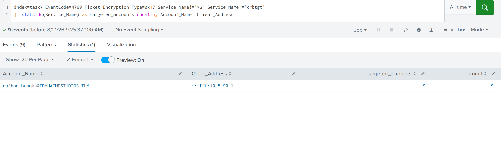

### Checking for AS-REP Roasting in parallel

The alert's own phrasing, a burst against multiple accounts, left room for AS-REP Roasting running alongside it, since both techniques are cheap enough that an attacker running one often checks for the other at the same time. Pulling the baseline TGT traffic for this dataset:

```spl
index=task7 EventCode=4768
| table _time, Account_Name, Pre_Authentication_Type, Ticket_Encryption_Type, Client_Address
| sort _time
```

Mixed in with expected admin traffic (`adm-luke.sullivan` requesting TGTs normally, `Pre_Authentication_Type=2`, from internal addresses) sits `mia.turner`, `Pre_Authentication_Type=0`, RC4, same `::ffff:10.5.90.1` source as the Kerberoasting session.

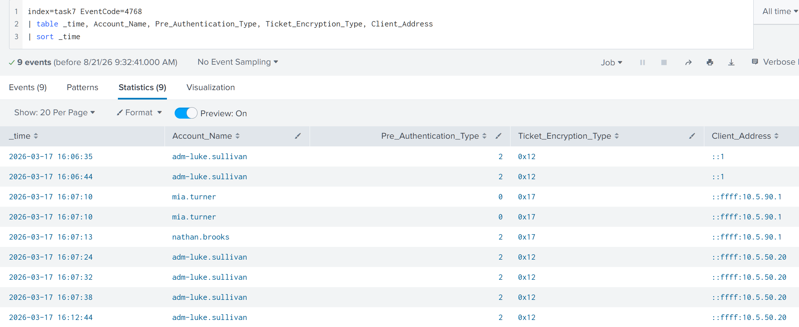

```spl
index=task7 EventCode=4768 Ticket_Encryption_Type=0x17 Pre_Authentication_Type=0
| table _time, Account_Name, Pre_Authentication_Type, Ticket_Encryption_Type, Client_Address
```

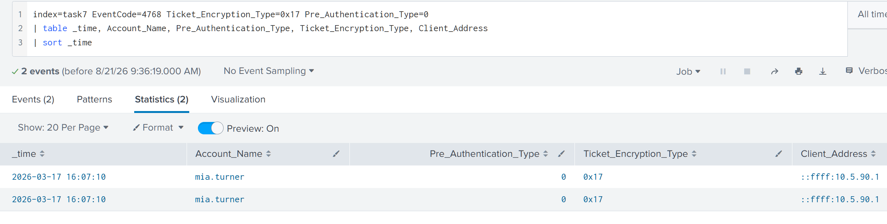

```spl
index=task7 (EventCode=4624 OR EventCode=4769)
| search Account_Name="mia.turner"
| table _time, EventCode, Account_Name, Client_Address
```

Zero results, no follow-up authentication for `mia.turner` at all.

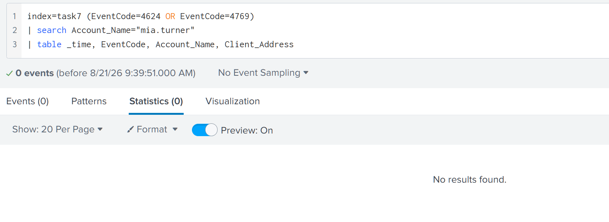

Same pattern as the guided AS-REP Roasting case: TGT requested, hash extracted, attacker went offline to crack it. One alert, two accounts compromised through two different Kerberos weaknesses, both from the same source.

### Checking for LSASS dumping

With two credential-harvesting attempts confirmed from one source, the next question is whether either cracked password led anywhere, specifically whether the attacker escalated to a machine with an active privileged session.

```spl
index=task7 EventCode=10 TargetImage="*\\lsass.exe*"
| stats count by SourceImage, GrantedAccess
```

Alongside expected `MicrosoftEdgeUpdate.exe` and `svchost.exe` entries at low access levels sits `rundll32.exe` at `0x1410` and again at `0x1FFFFF`, both well past what legitimate LSASS access ever needs.

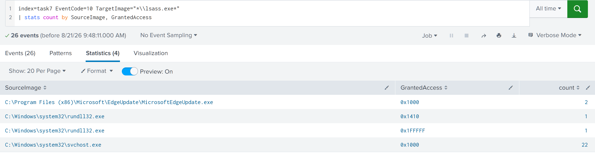

```spl
index=task7 EventCode=10 TargetImage="*\\lsass.exe*"
SourceImage="C:\\Windows\\system32\\rundll32.exe"
| table _time, SourceImage, SourceUser, GrantedAccess, CallTrace
```

Two events. Both CallTrace chains carry `comsvcs.dll`, one also carries `dbgcore.dll`, both known DLLs, no `UNKNOWN` offsets anywhere in either chain. This is the `rundll32.exe comsvcs.dll, MiniDump` technique, a well-documented LOLBin method for dumping LSASS using nothing but tools already on the box. `SourceUser` reads `tryhatmestudios\adm-luke.sullivan`, confirming this admin-tier account as compromised, the same account that later runs the DCSync operation below.

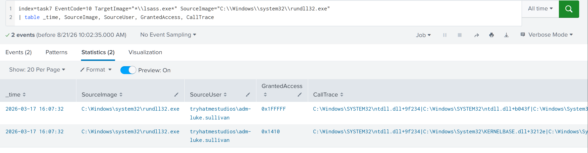

### Checking for DCSync

With Domain Admin-equivalent access confirmed via the LSASS dump, the final question is whether the attacker cashed it in.

```spl
index=task7 EventCode=4662 "1131f6ad" user!="*$"
| table _time, user, Access_Mask, Properties
| sort _time
```

Thirty-five events, all `adm-luke.sullivan`, all `Access_Mask=0x100`, all showing `Control Access` against the replication GUID. This is not one query slipping through, it's a sustained replication session, consistent with pulling the full domain hash set rather than a single targeted lookup.

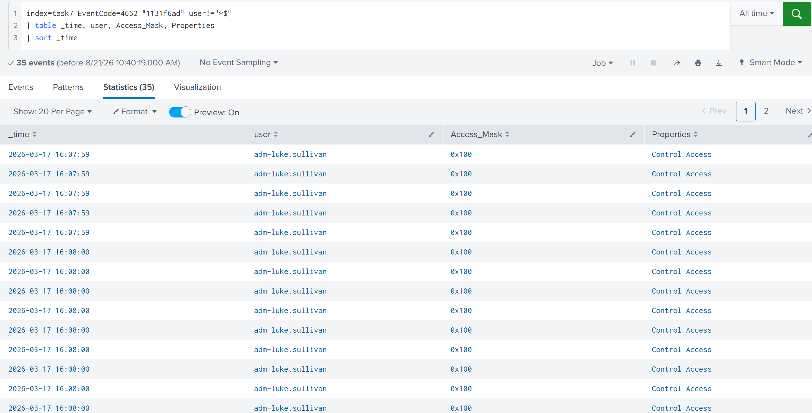

**Analyst's Note:** I attempted to correlate this session's `Logon_ID` against Event 4624 to confirm a source IP for the DCSync operation itself, the same method that worked cleanly in the guided walkthrough. That correlation returned no matching logon event in this dataset. Rather than assume the same `10.5.90.1` source carried through to this step, since assuming it would be filling a gap with pattern-matching instead of evidence, I'm flagging this as an open point: the DCSync operation is confirmed and attributed to `adm-luke.sullivan`, but its network origin isn't independently verified from this data. Everything else in the chain, Kerberoasting, AS-REP Roasting, and the LSASS dump, does share the `10.5.90.1` source, which makes it a reasonable working theory for a live investigation, but it stays a theory rather than a confirmed fact until a session correlates.

### Reconstructing the chain

One alert on a Kerberoasting burst unraveled into a complete escalation path. `nathan.brooks` and `mia.turner` were both targeted from `10.5.90.1` within the same few minutes, one through Kerberoasting, one through AS-REP Roasting, two independent shots at recoverable credentials from the same operator. Separately, `adm-luke.sullivan`'s session was compromised through an LSASS dump using `rundll32.exe` and `comsvcs.dll`. That admin-tier account then ran a sustained DCSync operation against the domain controller, thirty-five replication events pulling directory data outside any normal replication schedule. NTDS.dit extraction never appears in this dataset, which I'm treating as genuine scope, this alert's investigation didn't surface it, not a step I failed to check for.

---

## MITRE ATT&CK Summary

| Technique | Log Source | ID |
|---|---|---|
| Kerberoasting | Event 4769 | T1558.003 |
| AS-REP Roasting | Event 4768 | T1558.004 |
| LSASS Credential Dumping | Sysmon Event 10 | T1003.001 |
| DCSync | Event 4662 | T1003.006 |
| NTDS.dit Extraction | Sysmon Event 1, 11 | T1003.003 |

The independent investigation confirmed T1558.003, T1558.004, T1003.001, and T1003.006 in sequence from a single alert.

## Implications for a SOC Analyst

These five techniques live in five different log sources, Kerberos events on the domain controller, process access telemetry on the endpoint, directory service auditing on the domain controller again but a different event entirely, and process/file creation events for the disk-based method, yet the triage logic underneath all of them is the same three-step motion. Establish what normal looks like first, encryption type distribution for Kerberos traffic, expected processes accessing LSASS, expected replication sources. Isolate the anomaly on a specific field value rather than a vague sense that something's off, `Ticket_Encryption_Type=0x17`, `Pre_Authentication_Type=0`, a `GrantedAccess` mask outside the known-good list, a non-machine account exercising replication rights. Then confirm intent by checking what happened next, or in AS-REP Roasting's case, by checking that nothing happened next at all, since the absence of follow-up activity is itself the signal.

Two configuration prerequisites in this write-up are easy to miss and worth verifying directly rather than assuming: Sysmon's ProcessAccess logging for `lsass.exe` isn't part of a default install, and DCSync detection needs both "Audit Directory Service Access" enabled via Group Policy and a SACL configured on the domain partition, neither of which is on by default either. An environment missing either of these won't generate false negatives, it will generate silence, no alert, no anomaly, nothing to investigate, because the events required to detect the technique were never being logged in the first place. That's a materially worse failure mode than a noisy detection rule, and it's the kind of gap that's worth confirming is closed before trusting an all-clear.

The RC4 downgrade signal for Kerberoasting is also worth treating as a today-signal, not a permanent one. Tooling already exists to Kerberoast entirely over AES, and Microsoft's own trajectory is moving environments toward AES-only Kerberos. Volume-based detection, catching the burst of ticket requests regardless of what encryption they end up using, is the version of this detection that survives that shift, and it's worth having in place before the RC4 signal stops being reliable rather than after.

---

*Room: Detecting AD Credential Attacks, TryHackMe SOC Level 2 : Active Directory for SOC*