# Detecting AD Initial Access: Web Shells, OWA Brute-Force, and VPN Credential Attacks

## Disclaimer

This write-up documents four independent, self-contained detection scenarios rather than one continuous incident. The first three follow guided walkthroughs covering three distinct initial access vectors into an Active Directory environment: a web shell dropped through a vulnerable IIS upload handler, a credential brute-force against Exchange OWA, and a credential attack against a VPN gateway authenticating through NPS/RADIUS. The fourth case is my own investigation, run from a bare alert description with no guidance, using the same methodology built across the first three.

## TL;DR

Three services in this environment authenticate against the same Active Directory domain: an IIS web application, Exchange OWA, and a VPN gateway. Each was targeted through a different vector and left traces in a different primary log source, IIS access logs, IIS access logs correlated with Windows Security, and NPS RADIUS events respectively, but every case resolved the same way: aggregate first to find the anomalous source, then correlate the application-layer log with Windows Security to confirm what Active Directory actually saw. Case 1 traces a web shell (`shell.aspx`) dropped into `/aspnet_client/` through an upload flaw in an internal application, confirmed by `w3wp.exe` spawning `cmd.exe` with reconnaissance commands. Case 2 traces a brute-force against a single OWA account (`sarah.kim`) that succeeded and pivoted into the Exchange admin panel. Case 3 traces a VPN brute-force against `david.chen` that succeeded through NPS after nine failed RADIUS attempts. Case 4 is my own alert-driven investigation, identifying a second web shell (`error.aspx`) among three candidate files and ruling out the other two with the same query pattern used to confirm the first.

## Environment

- Domain: `tryhatmestudios.thm`
- Domain Controller: `THM-DC` (also hosting NPS in this lab environment)
- IIS web server hosting an internal application, Exchange OWA, and the Exchange Control Panel (`/ecp/`)
- VPN gateway authenticating through NPS (RADIUS) against the domain
- Splunk instance ingesting IIS access logs (`index=iis`) and Windows Security/Sysmon events (`index=win`)

## Lab Objective

Detect three common initial access techniques against AD-integrated services using their respective application logs, then correlate each with Windows Security events to confirm what happened at the identity layer. Investigate post-authentication activity to scope the impact of each compromise, and build timelines that tie application-layer evidence to domain-layer evidence.

## Tools and Technologies

- Splunk (SPL)
- IIS W3C access logs (`c_ip`, `cs_uri_stem`, `cs_uri_query`, `cs_method`, `sc_status`)
- Windows Security Event Log (Events 4624, 4625, 4776)
- Sysmon (Event ID 1, process creation; Event ID 11, file creation)
- NPS / RADIUS logs (Events 6272, 6273, 6274)

---

## Case 1: Web Shell Deployment via IIS

**Log source: IIS access logs, correlated with Sysmon**

Attackers who exploit a vulnerability in an IIS-hosted application usually scan for writable paths before they exploit anything. That scanning behavior is the entry point here.

### Finding the scanner

```spl
index=iis sc_status=404
| stats count by c_ip
| sort - count
```

One IP stands out immediately: `203.0.113.47`, responsible for 114 of the 404 responses in the dataset. A single source generating that volume of not-found errors is a directory or path scanner, not a user mistyping a URL.

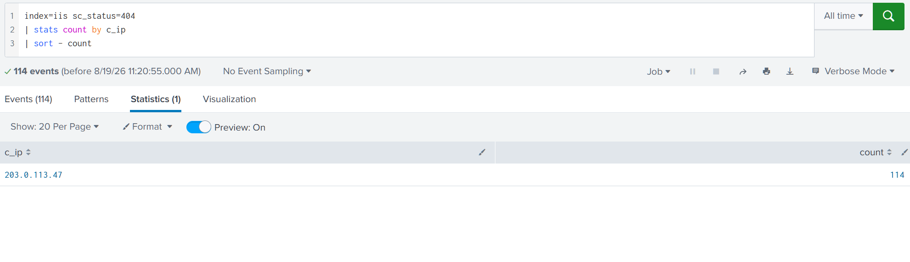

### Finding what the scanner discovered

Filtering the same IP for successful requests shows what it actually found:

```spl
index=iis c_ip=203.0.113.47 sc_status=200
| stats count by cs_uri_stem
| sort - count
```

Among a handful of legitimate-looking hits (`/owa/`, `/ecp/`, `/internalapp/`), one entry doesn't belong: `/aspnet_client/system_web/shell.aspx`. `aspnet_client` is a default IIS directory meant to hold static ASP.NET client-side scripts. It should never contain executable application code, but the folder is writable by the IIS worker process, which makes it a common web shell drop location.

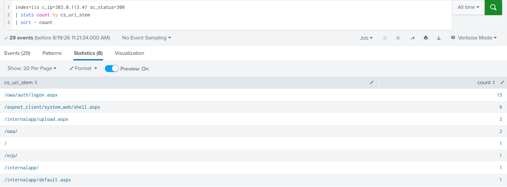

### Confirming interaction with the shell

```spl
index=iis cs_uri_stem="*/shell.aspx"
| table _time, c_ip, cs_method, cs_uri_query, sc_status
| sort _time
```

Six GET requests, all from `203.0.113.47`, all returning `200`. The `cs_uri_query` field carries the commands passed to the shell through a `cmd` parameter: `whoami`, `ipconfig`, `net user`, `net localgroup administrators`, `dir C:\Users`, `systeminfo`. This is baseline situational reconnaissance, establishing who the shell is running as, what account context it has, and what's on the box.

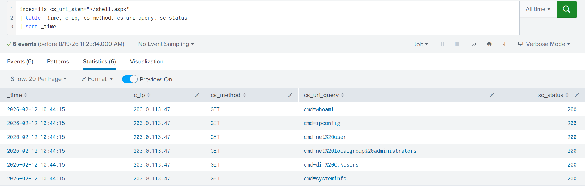

### Tracing the process chain

The IIS log tells me what commands were requested. It doesn't tell me exactly when they executed on disk. For that I pivot to Sysmon:

```spl
index=win EventCode=1 ParentImage="*\\w3wp.exe"
| table _time, ParentImage, CommandLine
| sort _time
```

Seven events. The first is `csc.exe` compiling a temporary ASP.NET file at `10:44:12`, which is the JIT compilation IIS performs the first time a `.aspx` page is hit, not part of the attack chain on its own. What follows is the same six reconnaissance commands seen in the IIS query strings, now spread across roughly a minute (`10:44:15` through `10:45:20`) instead of the single timestamp IIS recorded for all six. That gap is expected: IIS logging is buffered and can lag behind the endpoint's own process telemetry, which is why I don't rely on IIS timestamps alone to build a timeline.

In a clean environment, `w3wp.exe` spawning `cmd.exe` at all should be rare. Six instances of it in under two minutes, each mapping to a query string command, is conclusive.

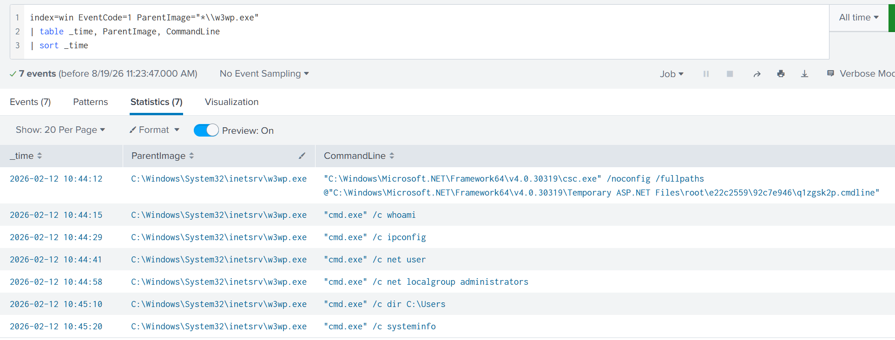

### Confirming the deployment timestamp

```spl
index=win EventCode=11 TargetFilename="*shell.aspx"
| table _time, Image, TargetFilename
```

One event: `w3wp.exe` writing `C:\inetpub\wwwroot\aspnet_client\system_web\shell.aspx` to disk at `10:43:18`, roughly ninety seconds before the first recon command executes. Upload, then interact.

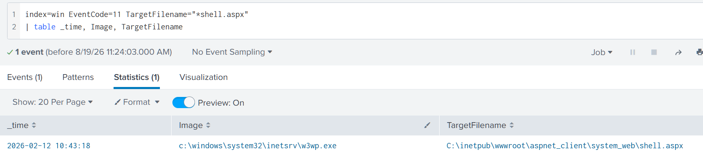

### Confirming the upload vector

```spl
index=iis cs_method=POST cs_uri_query="*shell.aspx"
| table _time, c_ip, cs_uri_stem, cs_uri_query, sc_status
| sort _time
```

One event: a POST to `/internalapp/upload.aspx?file=shell.aspx`, timestamped `10:43:18`, matching the Sysmon FileCreate event exactly. The internal application's upload feature is the vulnerable component. It accepted an arbitrary `.aspx` file and wrote it into a directory well outside its intended scope.

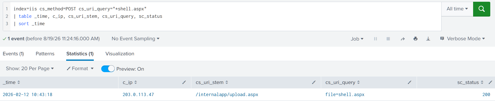

**MITRE ATT&CK:** T1190 (Exploit Public-Facing Application) for the upload flaw, T1505.003 (Server Software Component: Web Shell) for `shell.aspx` itself.

---

## Case 2: OWA Credential Brute-Force

**Log source: IIS access logs, correlated with Windows Security**

Exchange OWA runs on IIS, so the `w3wp.exe` detection pattern from Case 1 applies equally here. This case is different in nature though, a credential attack against a login page rather than an exploit against an upload handler, and OWA has a quirk that shapes the whole investigation: both a successful and a failed login return HTTP 302. The status code alone can't tell me which happened. That ambiguity is exactly why this case leans on Windows Security from the start rather than trying to read outcome straight out of IIS.

### Finding the brute-force pattern

```spl
index=iis cs_uri_stem="/owa/auth.owa" cs_method=POST
| bin _time span=5m
| stats count by _time, c_ip
| where count > 10
| sort - count
```

One five-minute window, `10:40:00`, one IP, `203.0.113.47`, sixteen POSTs to the OWA login endpoint. At the IIS layer this pattern is indistinguishable from password spraying: IIS doesn't capture which account was targeted, since `cs_username` is empty for OWA requests (the browser sends credentials in the POST body, not the query string). Volume alone confirms something is being hammered. It doesn't confirm what.

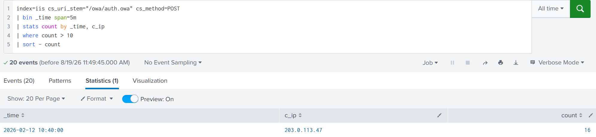

### Identifying the target

```spl
index=win EventCode=4625
| stats count by user, Logon_Type
| sort - count
```

Four accounts show failures, but the distribution settles the question immediately: `sarah.kim` accounts for 15 of them, against 10 for `david.chen` and a single failure each for two other accounts. Fifteen failures against one account, alongside a handful of stray failures elsewhere, is a targeted brute-force, not spraying. `Logon_Type 8` (NetworkCleartext) confirms these logons are IIS-mediated, since that's the logon type IIS-hosted applications use to pass credentials to AD.

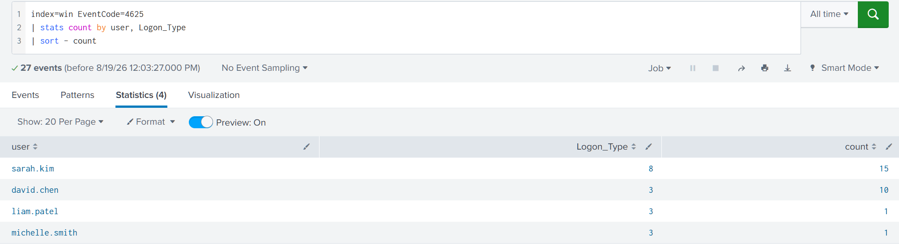

### Correlating the outcome

```spl
index=win EventCode IN (4624, 4625) user="sarah.kim" Logon_Type=8
| table _time, EventCode, user, Process_Name, Logon_Type
| sort _time
```

Seventeen events. The earliest, a `4624` at `10:29:32`, predates the attack window entirely and is `sarah.kim`'s own legitimate login. From `10:40:15` onward the failures start, spaced five to seven seconds apart, tight enough to rule out a person typing and retyping a password. The cluster resolves into a successful `4624` once the correct password lands, confirming the account was compromised, not just targeted.

These events live on the web server itself rather than the DC, since IIS handles the authentication locally. The `Source_Network_Address` field on them can come back empty or local for the same reason, the attacker's actual IP only exists in the IIS log, which is the whole reason this investigation needs both sources rather than either one alone.

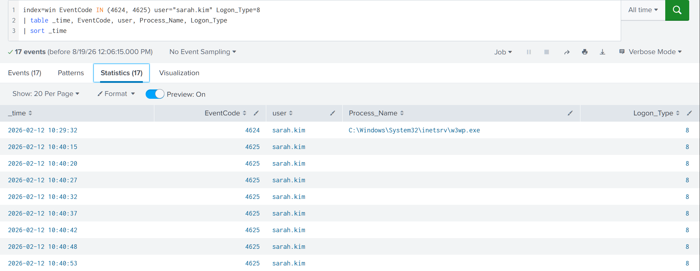

### Checking post-authentication activity

```spl
index=iis c_ip="203.0.113.47"
| stats count by cs_uri_stem
| sort - count
```

163 events across a wide spread of URIs. Buried in that spread are hits against `/ecp/`, the Exchange Control Panel, the administrative interface where an attacker can create forwarding rules, export mailboxes, or change Exchange settings outright. A brute-forced mailbox login is one thing. A brute-forced login that then reaches the admin panel is a materially different severity, and this is the pivot point where a real investigation would expand into what changed inside `/ecp/`.

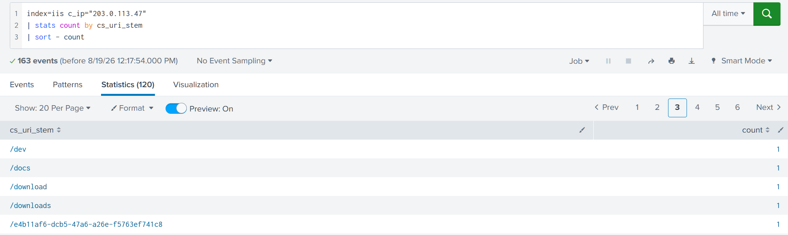

**MITRE ATT&CK:** T1110.001 (Brute Force: Password Guessing). Worth flagging explicitly: MITRE files Brute Force under the Credential Access tactic, even though functionally this attack served as the initial access vector into the environment. The tactic label describes the technique's mechanism, not always the role it plays in a given intrusion.

---

## Case 3: VPN Credential Attack via NPS/RADIUS

**Log source: NPS (RADIUS), correlated with Windows Security**

The VPN gateway in this environment isn't a Windows host, so there's no IIS log to start from. Authentication instead routes through NPS, the Windows RADIUS implementation, which logs Event 6272 for granted access and 6273 for denied access. The investigative logic carries over from the first two cases directly: aggregate to find the target, then correlate with the domain-layer logon events.

### Scoping the attack

```spl
index=win EventCode=6273
| stats count by User_Account_Name, Client_IP_Address
| sort - count
```

`david.chen` shows 10 denials against `10.5.10.200`, versus a single denial each for two other accounts. That IP is the VPN gateway itself acting as the RADIUS client, not the attacker's actual source, NPS only ever sees the gateway forwarding the request, never the originating connection. `david.chen` is clearly the target here.

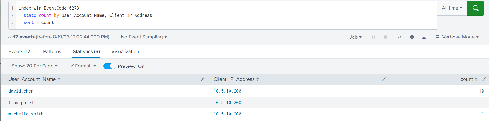

### Confirming compromise

```spl
index=win EventCode IN (6273,6272) User_Account_Name=david.chen
| table _time, EventCode, User_Account_Name, Client_IP_Address
```

Nine `6273` denials between `10:46:01` and `10:47:00`, spaced five to eleven seconds apart, followed by a `6272` grant at `10:47:06`. The account authenticated successfully to the VPN after nine failed attempts, confirming `david.chen` as compromised.

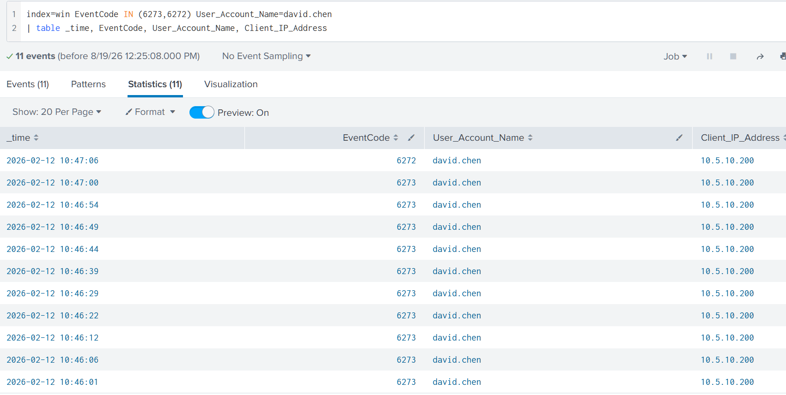

### Correlating with the domain

```spl
index=win EventCode IN (4624, 4625) user=david.chen
| table _time, host, user, EventCode, Logon_Type
| sort - _time
```

Because NPS runs on `THM-DC` in this lab, the resulting logon session lands directly on the domain controller: a cluster of `4625` events matching the RADIUS denial timestamps, followed by a `4624` at `10:47:05`, a few seconds off the NPS grant, consistent with normal processing lag between the two log sources. `Logon_Type 3` (Network) here, against `Logon_Type 8` in Case 2, is the tell that separates the two attack surfaces at the AD layer: same brute-force pattern, different front door. In a production environment where NPS sits on its own server rather than the DC, these session events would appear there instead, and the DC's role would shrink to logging Event 4776 for credential validation only.

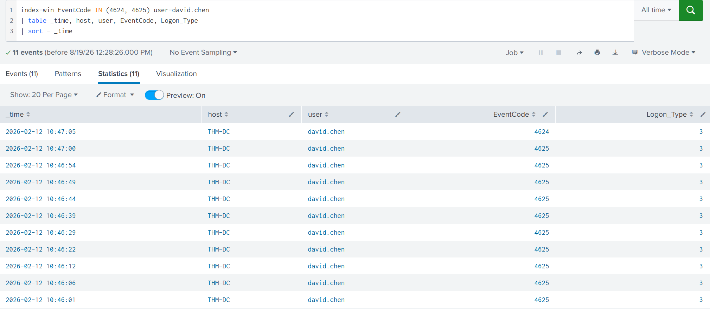

One caveat worth carrying forward from this case: not every VPN compromise looks like this. If an attacker already holds a working password, sourced from a broker, a leak, or a spraying campaign that succeeded elsewhere, the result is a single `6272` with no preceding failures, indistinguishable from a legitimate login at the authentication layer. When that's the situation, detection stops being about the login event and becomes entirely about what happens after it: which hosts the account touches, what it accesses, and whether any of that deviates from its normal behavior.

**MITRE ATT&CK:** T1110 (Brute Force) against the VPN gateway, T1078.002 (Valid Accounts: Domain Accounts) once the credential is confirmed working against AD.

---

## Case 4: Independent Investigation, Web Shell Identification from an Alert

**Log source: IIS access logs, correlated with Sysmon**

This case had no walkthrough. The starting point was a bare alert: an unusual volume of HTTP 404 responses from a single external IP against one of the organization's IIS web servers. Everything past that line is my own reconstruction, using the same methodology built across the first three cases.

### Finding the source

Before touching any query I needed the right field. IIS logs both `c-ip` (client IP, the source of the request) and `s-ip` (server IP, the local NIC the request landed on). Confusing the two would have me chasing my own web server instead of the attacker. Worth noting for a production environment: if a reverse proxy or load balancer sits in front of IIS, `c-ip` can end up showing the proxy's address instead of the real client, at which point the actual source lives in a header like `X-Forwarded-For` instead.

```spl
index=iis sc_status=404
| stats count by c_ip
| sort - count
```

`198.51.100.23`, 21 events, all 404s. Same directory-scanning signature as Case 1, different IP, different day.

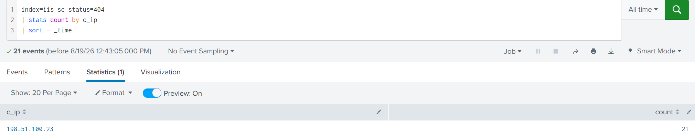

### Narrowing the candidates

```spl
index=iis c_ip=198.51.100.23 sc_status=200
| stats count by cs_uri_stem
| sort - count
```

Nine successful requests split across four URIs. Three are worth a closer look: `/aspnet_client/system_web/error.aspx` (5 hits), `/internalapp/default.aspx` (1 hit), and `/internalapp/upload.aspx` (2 hits). `error.aspx` living inside `aspnet_client` immediately reads the same way `shell.aspx` did in Case 1, but I wasn't willing to call it on location alone. `default.aspx` and `upload.aspx` needed to be ruled out on evidence, not assumption.

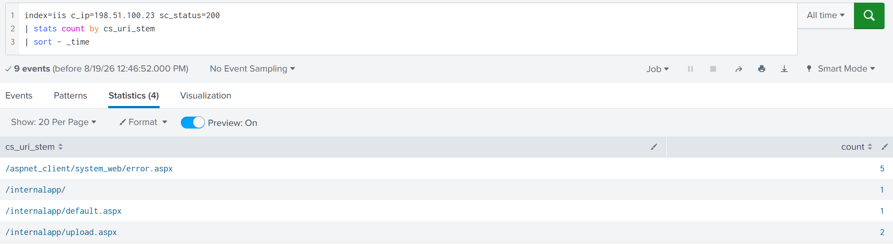

### Confirming a web shell exists at all

Before chasing which specific file was the shell, I confirmed the underlying behavior was present:

```spl
index=win EventCode=1 ParentImage="*\\w3wp.exe"
| table _time, ParentImage, CommandLine
| sort _time
```

Six events. `csc.exe` compiling at `10:45:13` (JIT compilation again, not part of the attack), then `cmd.exe` running `hostname`, `tasklist`, `netstat -an`, `dir C:\inetpub\wwwroot`, and `net group "Domain Admins" /domain`, spread from `10:45:13` to `10:46:49`. The web shell is confirmed. The last command is worth pausing on: `net group "Domain Admins" /domain` is a different kind of question than the generic `whoami`/`systeminfo` recon in Case 1. Enumerating Domain Admins membership isn't situational awareness, it's target selection for privilege escalation, and it changes how I'd triage this session if it were live.

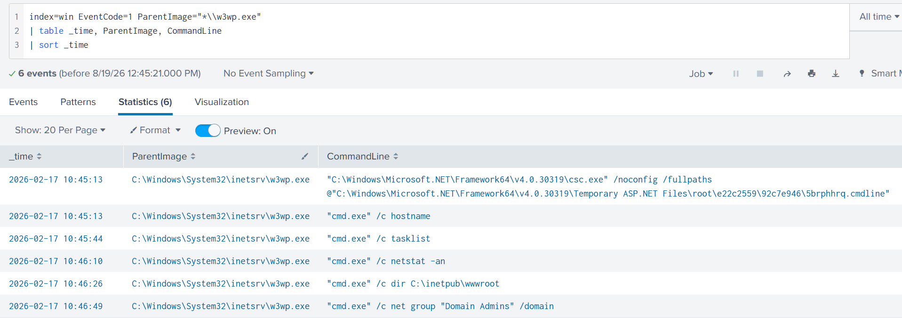

### Identifying the shell among the candidates

`upload.aspx` is the internal application's upload handler, the same role `/internalapp/upload.aspx` played in Case 1. Any file actually pushed through it as a payload should appear in a POST request's query string. I tested each candidate against that pattern.

```spl
index=iis cs_method=POST cs_uri_query="*error.aspx"
| table _time, c_ip, cs_uri_stem, cs_uri_query, sc_status
| sort _time
```

One event: a POST to `/internalapp/upload.aspx?file=error.aspx`, `200`, timestamped `10:40:33`. `error.aspx` was uploaded through the handler.

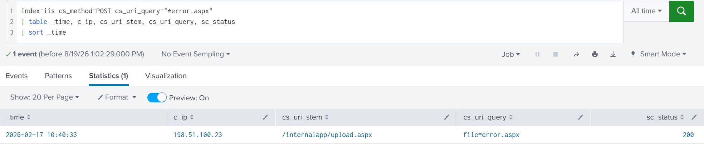

Running the identical pattern against the other two candidates returned nothing for either:

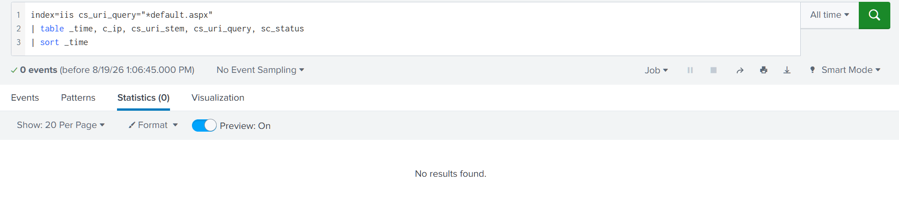

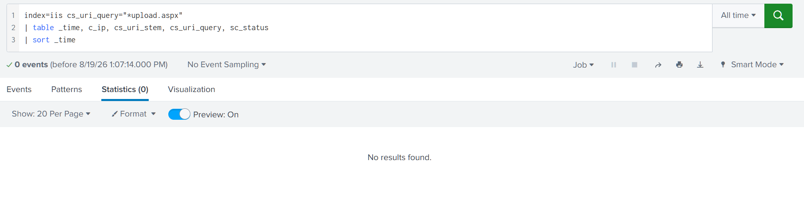

Zero hits for `default.aspx` and `upload.aspx` rules both out as attacker-placed files. They're legitimate parts of the internal application that happened to sit near the scanner's path list, not payloads. `error.aspx` is the web shell.

### Confirming the deployment timestamp

```spl
index=win EventCode=11 TargetFilename="*error.aspx"
| table _time, Image, TargetFilename
```

One event, `w3wp.exe` writing `C:\inetpub\wwwroot\aspnet_client\system_web\error.aspx` at `10:40:33`, matching the IIS POST timestamp exactly. Same pattern as Case 1: the upload handler writes the file to disk in the same instant it accepts the request, so the IIS log and the Sysmon FileCreate event line up almost to the second.

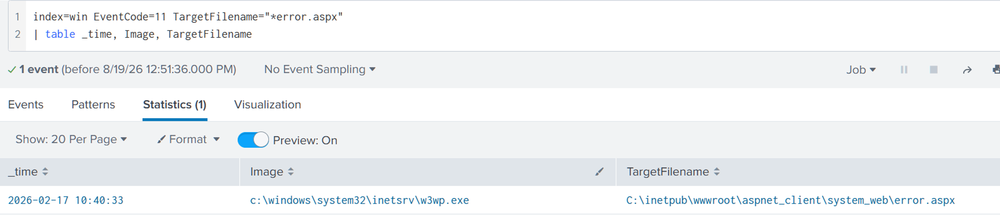

**Analyst's Note:** the domain admin enumeration in this case is the one meaningful divergence from Case 1's otherwise identical kill chain. Two web shells, same upload flaw, same directory, same detection method, but the recon commands tell different stories about attacker intent. Case 1's attacker was mapping the box. This one was already looking past it, toward the domain. That distinction belongs in any handoff to whoever picks up triage next, since it changes what "contained" needs to mean for this incident.

**MITRE ATT&CK:** T1190 (Exploit Public-Facing Application), T1505.003 (Server Software Component: Web Shell), with T1069.002 (Permission Groups Discovery: Domain Groups) added for the `net group "Domain Admins"` enumeration, a technique that didn't appear in Case 1.

---

## MITRE ATT&CK Summary

| Case | Log Source | Technique | ID |
|---|---|---|---|
| 1: Web Shell | IIS + Sysmon | Exploit Public-Facing Application | T1190 |
| 1: Web Shell | IIS + Sysmon | Server Software Component: Web Shell | T1505.003 |
| 2: OWA Brute-Force | IIS + Windows Security | Brute Force: Password Guessing | T1110.001 |
| 3: VPN Credential Attack | NPS + Windows Security | Brute Force | T1110 |
| 3: VPN Credential Attack | NPS + Windows Security | Valid Accounts: Domain Accounts | T1078.002 |
| 4: Independent Investigation | IIS + Sysmon | Exploit Public-Facing Application | T1190 |
| 4: Independent Investigation | IIS + Sysmon | Server Software Component: Web Shell | T1505.003 |
| 4: Independent Investigation | IIS + Sysmon | Permission Groups Discovery: Domain Groups | T1069.002 |

## Implications for a SOC Analyst

All three services in this environment, a web application, Exchange, and a VPN gateway, funnel back to the same Active Directory, and every attack against them left the same shape of evidence: a burst visible in the application log, and a corresponding pair of success/failure events on the Windows side. That pairing is the actual detection principle here, not any single query. IIS, NPS, and Windows Security each tell half the story on their own. IIS shows source IPs and request patterns that Windows Security never captures. Windows Security shows account names and outcomes that IIS and NPS can't, since neither one reliably logs which identity was targeted.

The `w3wp.exe` spawning `cmd.exe` signature caught both web shells in this write-up despite them using different filenames, different upload paths, and different follow-up recon. That's the point of anchoring detection on behavior instead of artifacts: the vulnerability exploited to get the shell onto disk changes every time, the fact that a worker process which should never spawn a shell suddenly does doesn't.

`Logon_Type` turned out to be the fastest way to work backward from an AD-side alert to its actual source. Type 8 (NetworkCleartext) points straight at an IIS-mediated login. Type 3 (Network) showing up somewhere unexpected is worth checking against VPN activity before assuming it's routine. Neither logon type is inherently suspicious on its own, they're just the return address on an authentication event, but knowing which service produces which type turns a generic 4625 flood into a scoped starting point instead of a blind search.

Case 3's closing point matters beyond that single scenario: a successful VPN login backed by a stolen, correctly-guessed-elsewhere, or purchased credential produces no failure cluster at all. Detection built purely around threshold-based brute-force alerts misses that entry vector completely, which means post-authentication baseline deviation, not the login event itself, has to carry detection for that class of compromise.

---

*Room: Detecting AD Initial Access, TryHackMe SOC Level 2 : Active Directory for SOC*