# Insider Threat Investigation: Unauthorized Competitor Contact and Data Exfiltration

## Environment

Splunk instance indexing the BOTSv2 dataset for Frothly, a beer manufacturing company. Data sources relevant to this investigation include Palo Alto Networks traffic logs (pan:traffic), Splunk Stream HTTP metadata (stream:HTTP), Splunk Stream SMTP metadata (stream:smtp), and Sysmon process creation events ingested through the Windows Event Log channel.

## Lab Objective

Investigate a tasking from HR concerning a specific employee and determine whether her recent network activity shows unauthorized contact with an external party, unauthorized handling of sensitive data, or behavior consistent with evading monitoring.

## Tools and Technologies

Splunk SPL, pan:traffic, stream:HTTP, stream:smtp, Sysmon process creation telemetry, CyberChef for Base64 decoding.

## Scenario

HR flagged unusual behavior from Amber Turing, a Principal Scientist at Frothly, following her recent performance review. During that review she expressed frustration that a planned acquisition of Frothly by a competitor had fallen through. Management asked the SOC team to review her recent network activity for signs of unauthorized contact with external parties or improper handling of company data.

There is no technical alert behind this investigation. The starting point is a name and a concern raised by a human process, which is a common way real insider threat cases begin. Before touching the SIEM, the working hypothesis is straightforward: if Amber acted on that frustration, there should be a trail showing contact with a competitor, and possibly an attempt to move information toward them.

## Lab Content

### Phase 1: User Attribution

The tasking gives a name, not an IP or a hostname, so the first job is turning that name into something the SIEM can actually pivot on. A broad keyword search on "amber" across the whole index returns everything from HTTP noise to firewall traffic, which is too wide to reason about. The faster path is anchoring on a log source that reliably ties a username to a network identity. Palo Alto traffic logs are a good choice for this because every session the firewall processes carries a source user and a client IP together, so filtering pan:traffic by the keyword collapses the search space fast and hands over an IP with high confidence.

```
index="botsv2" amber sourcetype="pan:traffic"
```

The client_ip field in the returned events shows a single value across 100 percent of the events, 10.0.2.101, and no other username appears associated with that IP. That single value confirms it is not a shared workstation, which matters because everything that follows depends on this IP belonging specifically to Amber.

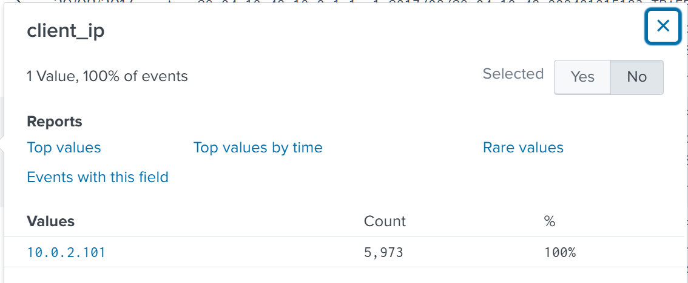

### Phase 2: Identifying the Competitor Contact

With a confirmed IP, the investigation shifts to HTTP traffic to see what she actually browsed. Pivoting from pan:traffic to stream:HTTP is the right move here because PAN logs describe sessions at a network level, while Stream HTTP captures the actual site and URI being requested, which is what's needed to identify a specific destination.

```
index="botsv2" 10.0.2.101 sourcetype="stream:HTTP"
```

This still returns a large number of events, mostly Microsoft telemetry, ad networks, and other background browser noise that has nothing to do with the tasking. The trick to cutting through this kind of volume without missing anything is not to filter aggressively up front, but to pull just the field that actually matters and deduplicate on it. The site field carries the domain of every request, and deduping on it collapses potentially thousands of requests down to the unique list of domains actually visited.

```
index="botsv2" 10.0.2.101 sourcetype="stream:HTTP" | dedup site | table site
```

The output is a manageable list of roughly a dozen domains. Most are expected background noise (Microsoft update services, ad and tracking domains, an internal Frothly host). One entry stands out from that pattern: www.berkbeer.com. Knowing that Frothly is a beer company and that the tasking specifically concerns a competitor, a beer-related domain in this list is not something to skip past.

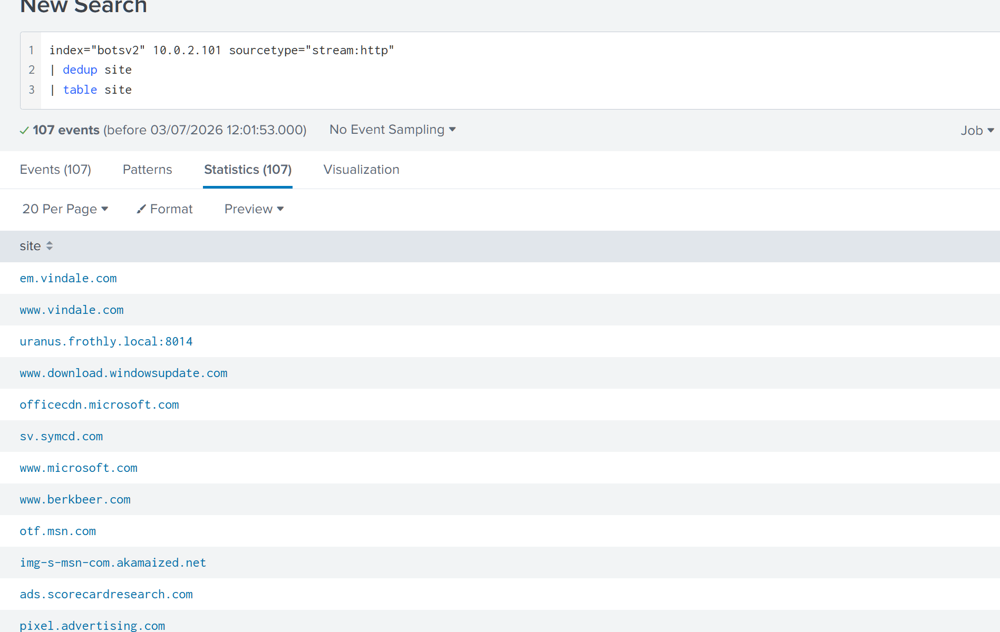

To confirm this isn't a coincidental hit and to see how much of her traffic actually went there, adding the industry keyword directly into the search narrows the same query down to a single result.

```
index="botsv2" 10.0.2.101 sourcetype="stream:HTTP" *beer* | dedup site | table site
```

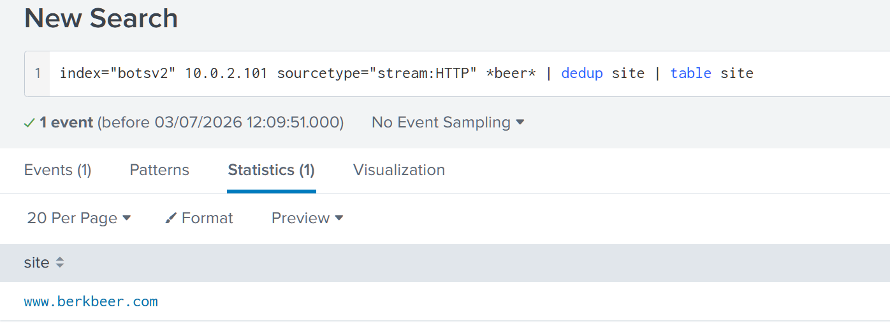

With the competitor domain confirmed, the next question is what specifically she looked at on that site. Expanding the search to that domain and pulling the uri_path field shows a set of static site paths (images, favicon, homepage) rather than any dynamic content, which is consistent with someone browsing a public corporate website rather than attempting to access anything restricted.

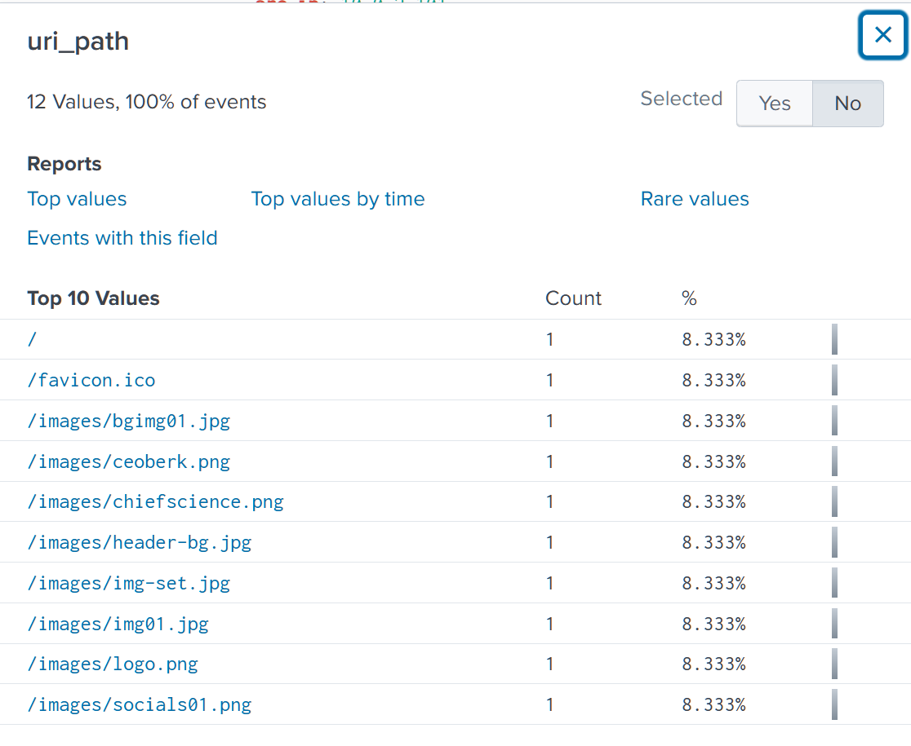

Filtering the http_content_type field down to image formats narrows this list to the handful of images actually served on those pages.

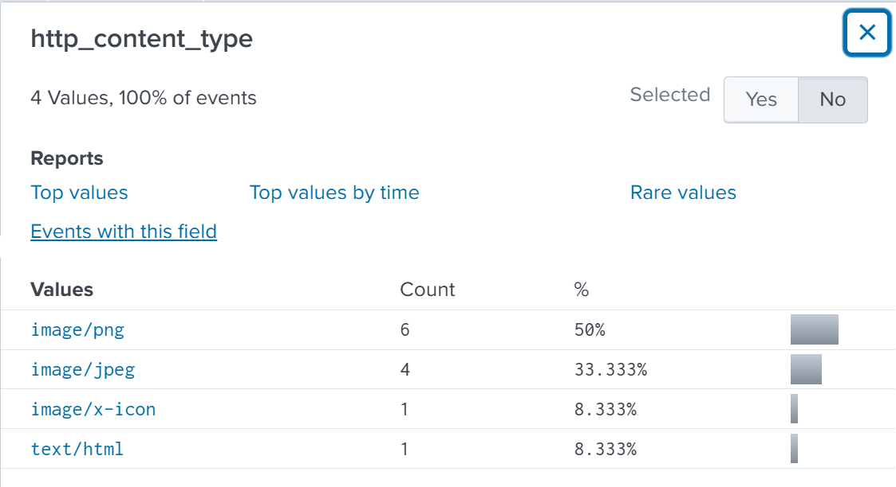

Tabling the uri_path field against only image content types isolates a small set of image files, one of which is named ceoberk.png. A filename that pairs "CEO" and the competitor's name directly suggests this is the executive contact page, which is exactly the kind of information someone would pull down before reaching out to leadership at another company.

```
index="botsv2" 10.0.2.101 sourcetype="stream:HTTP" www.berkbeer.com (http_content_type=image/png OR http_content_type=image/jpeg) | table uri_path
```

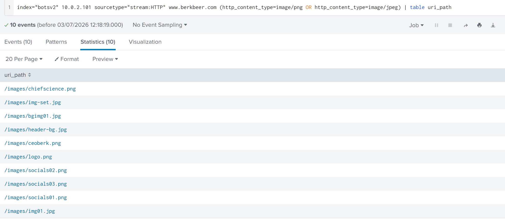

### Phase 3: Email Communication and Exfiltration

Browsing a competitor's executive contact page on its own is not a policy violation. What matters for this investigation is whether that browsing turned into actual contact and whether anything was sent. That means pivoting away from HTTP into SMTP traffic, since that's where any resulting email exchange would live.

Before that pivot can happen, her email address needs to be established the same way her IP was, through a keyword anchor.

```
index="botsv2" source="stream:smtp" amber
```

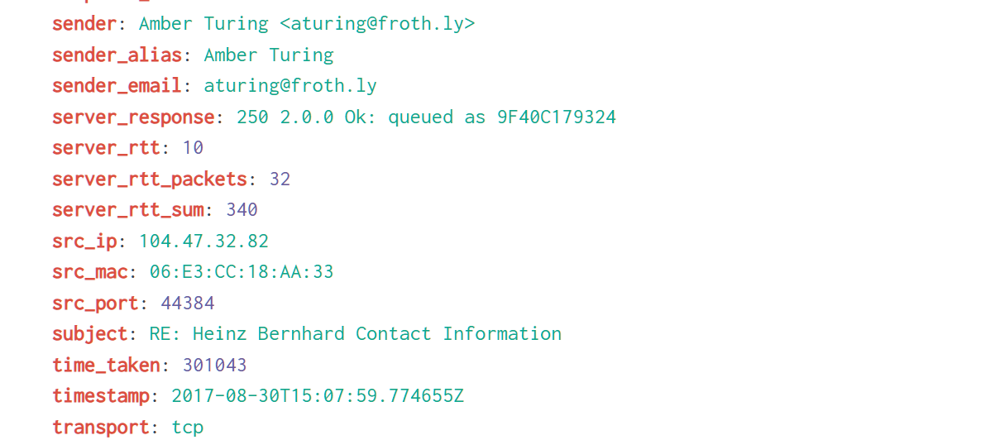

The sender field confirms her corporate address, aturing@froth.ly. With both her email address and the competitor's domain confirmed, combining them in a single query isolates the actual correspondence rather than sifting through unrelated internal mail.

```
index="botsv2" sourcetype="stream:smtp" aturing@froth.ly berkbeer
```

The message body returned here contains a reply thread. In it, the competitor's CEO signs off using his full name, giving both the first and last name that the image alone did not provide, and confirms his email address in the message headers.

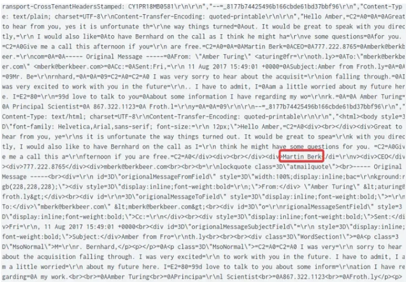

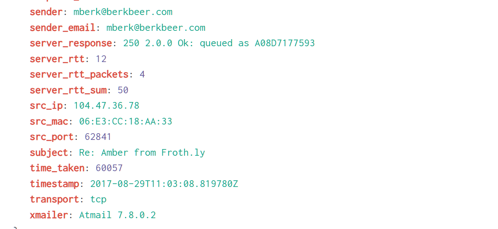

The same thread also shows a second point of contact at the competitor being drawn into the conversation after the initial exchange with the CEO, which extends the exposure beyond a single external contact.

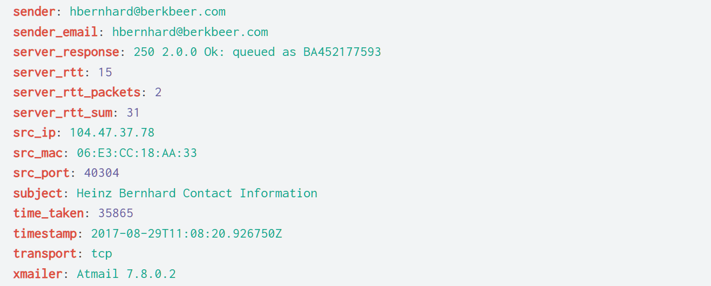

This is the point where the investigation moves from concerning to confirmed. Within that same set of events, the attach_filename field on one of the messages shows a file being sent as an attachment to the external party: Saccharomyces_cerevisiae_patent.docx. A patent-related document being sent by a Principal Scientist to a direct competitor is the actual data exfiltration event the tasking was worried about, and everything up to this point exists to establish that this is exactly what happened and who was involved.

```
index="botsv2" sourcetype="stream:smtp" aturing@froth.ly berkbeer | table attach_filename
```

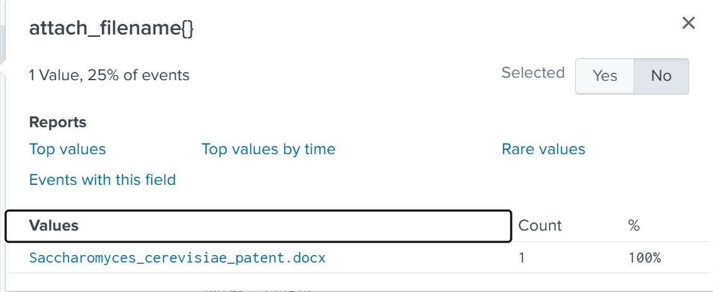

One more detail surfaces while reviewing the raw content of these messages. Part of the email body is MIME-encoded as Base64 rather than plain text, which is normal for HTML formatted emails, but worth decoding rather than skipping, since encoded content sometimes carries information that doesn't show up in a plaintext search. Running that block through CyberChef with a From Base64 operation followed by a text decode reveals a personal email address embedded in the content, ambersthebest@yeastiebeastie.com, distinct from her corporate account. The generic point here is that whenever a raw event shows a MIME part with Content-Transfer-Encoding set to base64, it's worth decoding it rather than assuming it's just formatting overhead, because that's exactly where things like personal contact information tend to get buried.

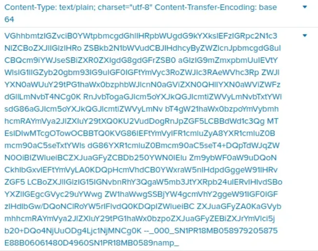

A personal email address used inside a work correspondence to a competitor is a meaningful detail on its own. It suggests an attempt to keep a channel open outside of monitored corporate infrastructure, which lines up with what shows up next.

### Phase 4: Anti-Forensic Behavior

With the exfiltration confirmed, the last thing worth checking is whether Amber took any steps to cover her own tracks going forward. A keyword search combining her name with "tor" returns a large number of results, since "tor" is a common substring, but narrowing that with "install" cuts straight to the moment a TOR Browser installer executed on her workstation.

```
index="botsv2" amber tor install
```

The Sysmon event confirms this was launched from her user profile, with a parent process showing the installer executable directly.

```
C:\Users\amber.turing\Downloads\torbrowser-install-7.0.4_en-US.exe
```

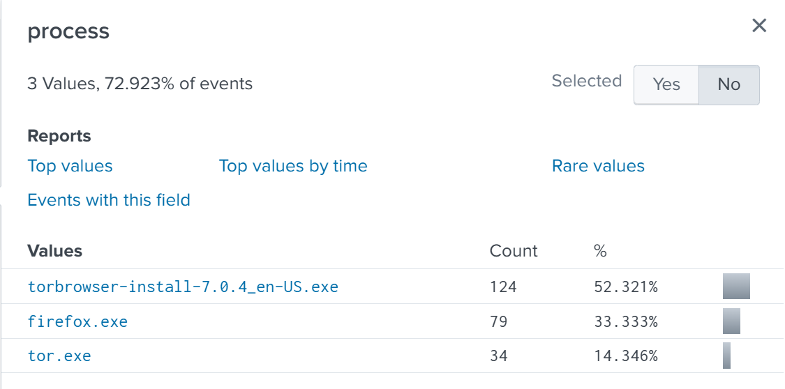

Breaking down the process field for this activity shows the full sequence, the installer itself, followed by tor.exe and firefox.exe as the bundled browser runs.

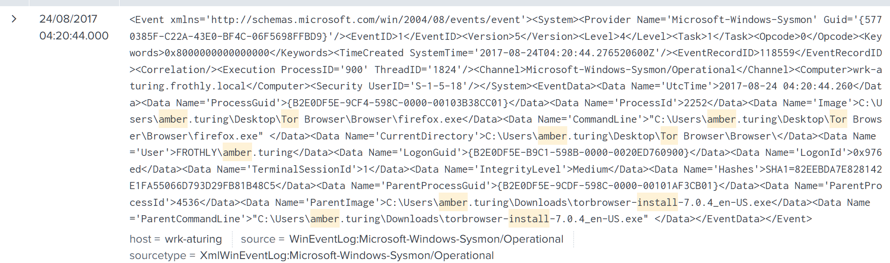

The analytical point here is timing rather than the tool itself. TOR Browser is not inherently malicious, but installing it after already having exfiltrated a sensitive document to an external party changes what this activity most likely represents. In this sequence it reads as an attempt to obscure future browsing activity rather than routine curiosity, which matters directly for scoping how long the actual exposure window might be, since anything she did afterward through TOR would not be visible in these same logs.

## Attack Timeline

```
2017-08-XX  Amber Turing's workstation (10.0.2.101) browses www.berkbeer.com,
            a direct competitor, retrieving the CEO contact page (ceoberk.png)
2017-08-29  Email exchange begins between aturing@froth.ly and the competitor's
            CEO (mberk@berkbeer.com), CEO identified as Martin Berk
2017-08-29  Second competitor contact drawn into the thread
            (hbernhard@berkbeer.com)
2017-08-29  Patent document sent as attachment:
            Saccharomyces_cerevisiae_patent.docx
2017-08-29  Personal email address (ambersthebest@yeastiebeastie.com)
            found embedded in Base64-encoded email content
2017-08-24  TOR Browser (v7.0.4) installed and executed on Amber's workstation
```

## IOC Summary Table

| Type    | Value                                          | Context                                    |
|---------|------------------------------------------------|---------------------------------------------|
| IP address | 10.0.2.101                                  | Amber Turing's workstation                   |
| Domain  | www.berkbeer.com                                | Competitor website contacted                 |
| Account | aturing@froth.ly                                | Amber's corporate email                      |
| Account | ambersthebest@yeastiebeastie.com                | Amber's personal email, found Base64-encoded |
| Account | mberk@berkbeer.com                              | Competitor CEO, Martin Berk                  |
| Account | hbernhard@berkbeer.com                          | Second competitor contact                    |
| File    | Saccharomyces_cerevisiae_patent.docx            | Exfiltrated attachment                       |
| Path    | /images/ceoberk.png                             | Executive contact image retrieved from site  |
| File    | torbrowser-install-7.0.4_en-US.exe              | Anti-forensic tool installed post-exfiltration |

## MITRE ATT&CK Mapping

This activity originates from an authorized insider using her own valid credentials rather than an external adversary, so the mapping below reflects insider risk behavior rather than a classic intrusion kill chain.

| Phase                  | Tactic        | Technique                          | Technique ID |
|------------------------|---------------|-------------------------------------|--------------|
| Competitor contact      | Collection    | Email Collection                    | T1114        |
| Data exfiltration       | Exfiltration  | Exfiltration Over Web Service        | T1567        |
| Anti-forensic behavior  | Defense Evasion | Proxy: External Proxy             | T1090.002    |

## SOC Implications

This case shows why not every investigation starts from a technical alert. There was no DLP trigger, no proxy block, and no SIEM correlation rule behind this tasking, just a name flagged by HR and a reason to be concerned. Reading that kind of tasking correctly means treating it the same way as any alert queue item: form a hypothesis before touching the SIEM, then work the evidence chain until the hypothesis is either confirmed or ruled out. In this case the hypothesis held up at every stage.

Cross source corroboration did the actual work here. No single log source told the full story. PAN traffic confirmed identity, HTTP traffic confirmed the destination and what was viewed there, SMTP traffic confirmed the communication and the exfiltrated file, and Sysmon confirmed the anti-forensic follow-up. Each source answered a different question, and skipping any one of them would have left a gap, either an unconfirmed identity, an unconfirmed destination, or no evidence of an actual exfiltration event beyond browsing history.

The detection gaps here are worth calling out directly. Sending a document with "patent" in the filename to an external domain identified as a direct competitor is exactly the kind of event a DLP rule should catch on file classification and destination domain reputation combined, and there's no indication one exists. TOR Browser installation should also be a standalone high fidelity alert in most enterprise environments regardless of what preceded it, since legitimate business use of TOR on a corporate workstation is rare enough that false positive rates are low. Recommending both of these as detection improvements is a direct output of this investigation.

The highest severity finding is the confirmed exfiltration of IP-sensitive material, a patent document, to a direct competitor by an employee with legitimate access and a documented grievance. This is not a technical compromise, nobody broke in, no malware executed, but it's arguably more damaging than many technical incidents because it involved someone who already had full authorized access using it exactly as designed, just for the wrong purpose. That distinction matters for how a SOC frames insider risk cases to management: the absence of an intrusion doesn't mean the absence of real business damage.

---
Room: TryHackMe, BOTSv2 Dataset