# Endpoint Malware Investigation: Ransomware Delivered via USB to an Unmanaged Personal Device

## Environment

Splunk instance indexing the BOTSv2 dataset for Frothly. Data source relevant to this investigation is osquery_results, collected from endpoint agents running on Mallory Kraeusen's devices, both her corporate MacBook and a personal MacBook, kutekitten.

## Lab Objective

Investigate a ransomware detection alert, confirm the scope of encrypted files, identify how the malware was delivered onto the affected device, and attribute the malware through hash-based threat intelligence.

## Tools and Technologies

Splunk SPL, osquery_results, VirusTotal.

## Initial Alert

```
Alert Source: EDR / File Integrity Monitoring
Severity: Critical
Description: Multiple files with unrecognized .crypt extension detected,
consistent with ransomware encryption activity
Affected User: Mallory Kraeusen
```

## Lab Content

### Phase 1: Scoping the Affected Devices

A ransomware alert tied to a user rather than a specific host doesn't tell you how many devices that user actually has, and it's a mistake to assume the alert covers the full picture. The first move is a broad keyword search on her name to see what hosts show up at all.

```
index="botsv2" mallory
```

The host field breakdown returns six distinct values: venus, MACLORY-AIR13, jupiter, kutekitten, matar, and mercury. MACLORY-AIR13 is clearly her corporate MacBook based on the naming convention. kutekitten stands out as different, a lowercase, informal hostname with no corporate naming pattern behind it, which is itself a signal that this is a personal device rather than something IT provisioned. This distinction matters immediately, because it means the environment potentially has two categories of endpoint to account for here: one under normal corporate monitoring, and one that isn't.

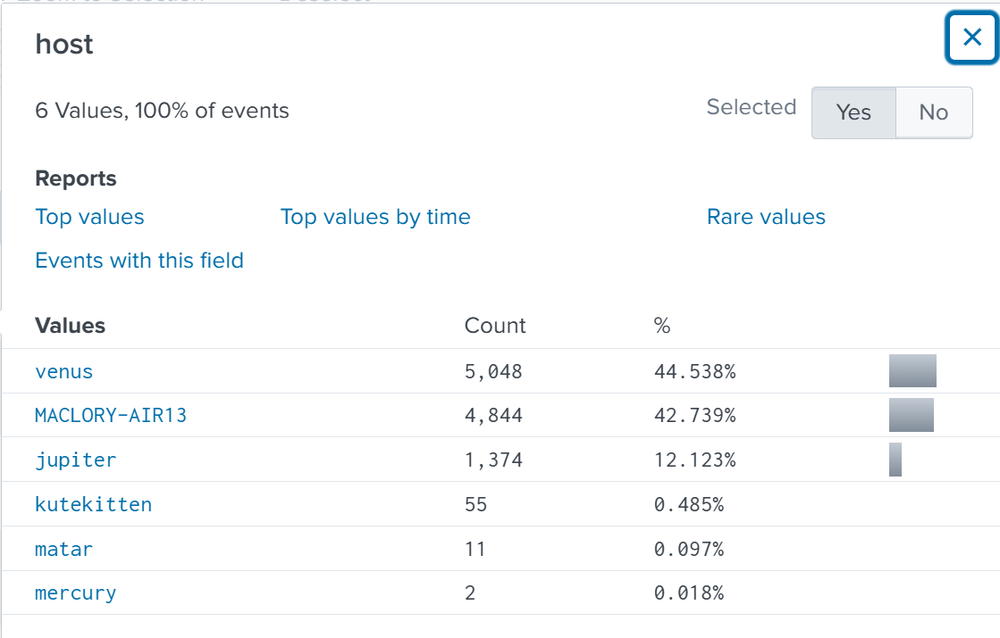

This is also the first thread using osquery_results as a primary source rather than Sysmon or Windows Event Log, and it behaves differently from both. osquery doesn't log discrete security events the way Sysmon does, it runs scheduled SQL-style queries against the operating system and reports back structured results under a query name, stored in the name field, with the actual data nested under a columns object. Practically, this means the investigative question shifts from "what event type am I looking for" to "what query would have captured this," since the data is organized by what was asked of the system rather than by what the system did on its own.

### Phase 2: Confirming Ransomware Impact

Starting with her corporate laptop, MACLORY-AIR13, since that's where the alert originated. The alert mentions a critical PowerPoint presentation, so narrowing the search to common PowerPoint extensions cuts straight to the relevant file.

```
index="botsv2" host="MACLORY-AIR13" (*.ppt OR *.pptx)
```

The sourcetype breakdown for this host confirms the bulk of relevant activity sits in osquery_results, with a small remainder in ps (process snapshot data).

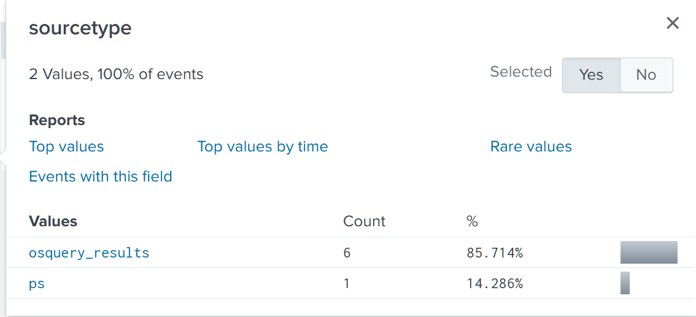

The columns.target_path field shows two entries for the same base filename, one clean and one with a .crypt extension appended: Frothly_marketing_campaign_Q317.pptx and Frothly_marketing_campaign_Q317.pptx.crypt. Ransomware almost never encrypts a file in place without leaving a trace of the original name, either because the encryption routine reads the source file, writes an encrypted copy, then deletes the original, or because it renames rather than overwrites outright. Finding both versions logged together confirms the malware had direct visibility into this specific file rather than encrypting indiscriminately, and the .crypt extension itself becomes a reliable search anchor for everything else it touched.

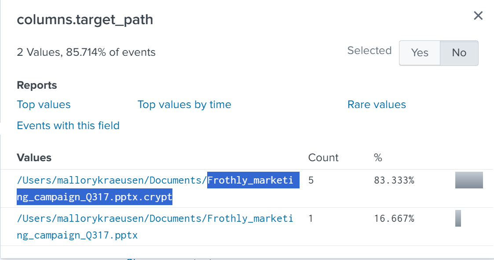

To confirm the impact isn't limited to a single work document, the same host and file extension logic gets reused against the .crypt extension directly, without restricting to any particular file type this time.

```
index="botsv2" host="MACLORY-AIR13" sourcetype="osquery_results" *.crypt
```

The columns.target_path top values here return over a dozen encrypted files, including a Game of Thrones episode file, GoT.S07E02.BOTS.BOTS.BOTS.mkv.crypt. A personal media file being encrypted alongside a work presentation confirms the ransomware ran a broad file system sweep rather than targeting anything specific, which matters for scoping, since it means every file type on this device needs to be considered potentially unrecoverable, not just the ones tied to the original alert.

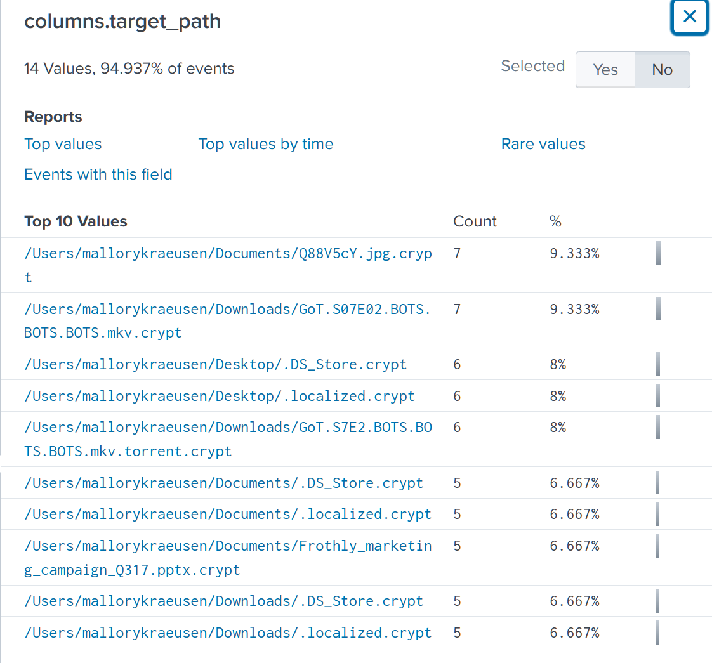

### Phase 3: Identifying the Delivery Vector

Confirming impact on the corporate device answers what happened, but not how the malware got there in the first place. This is where kutekitten, the personal MacBook flagged in Phase 1, becomes relevant, since the delivery mechanism traces back to that device rather than the one the alert fired on.

```
index="botsv2" kutekitten
```

Over 6,000 events return here, almost entirely osquery_results and osquery_info. Searching within this for a keyword like "usb" and checking the name field breakdown surfaces a query specifically built for hardware monitoring: pack_hardware-monitoring_usb_devices. This is the generic move worth internalizing, when investigating osquery data and you don't know which scheduled query captured something, filtering the name field down to whatever appeared in a broad keyword search is usually faster than trying to guess the exact pack name up front.

```
index="botsv2" kutekitten usb
```

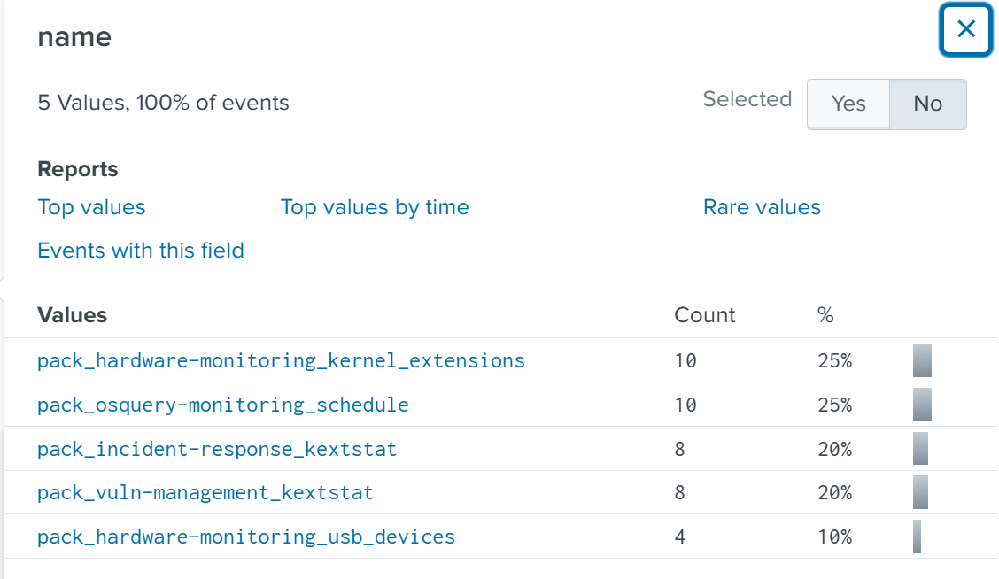

Narrowing directly to that query name returns four events tied to a single USB connection.

```
index="botsv2" kutekitten usb name="pack_hardware-monitoring_usb_devices"
```

The raw event contains structured device metadata, including a vendor_id of 058f. USB vendor and product IDs are assigned centrally as part of the USB standard, every manufacturer registers a vendor ID and every device model gets a product ID under it, and this pairing gets reported by the operating system the moment a device is physically connected, regardless of what's actually on it or what it's used for. That means this identifier exists in the log independent of anything malicious happening, it's baseline hardware telemetry, which is exactly why it's useful here, it tells you a physical device was connected at a specific time even before you know anything about its contents.

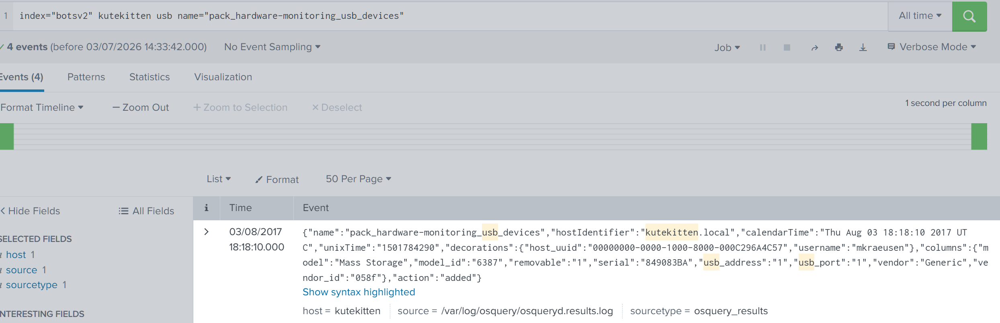

Resolving an unfamiliar vendor ID to an actual manufacturer name doesn't require digging through an OS-level hardware database. These vendor ID registries are public, and a direct search on the ID itself is usually the fastest path to an answer.

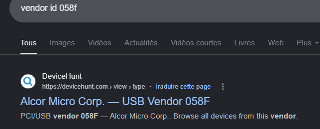

The vendor resolves to Alcor Micro Corp, commonly associated with generic USB flash drive controllers. Noting the timestamp of this event, 18:18:10 UTC, matters for the next phase, since correlating this connection event against whatever gets created on disk immediately afterward is how the actual delivery gets confirmed.

### Phase 4: Tracing the Malware Drop

With a USB connection timestamp established, the next step is finding what file system activity followed it. Rather than guessing which folder to check, expanding the search to the full user path with a wildcard avoids missing anything outside an assumed location.

```
index="botsv2" kutekitten "\/Users\/mkraeusen\/*"
```

The path needs double escaping for the query to execute correctly, since the forward slash and the wildcard both need to be treated literally rather than interpreted by the search parser. The columns.path field breakdown here returns a wide spread of results, mostly system and library paths, with one narrower folder worth isolating.

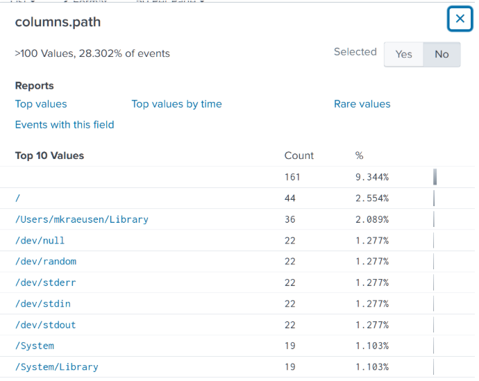

Filtering the same broad path search by the file_events query name specifically narrows this down to five events tied to actual file creation activity.

```
index="botsv2" kutekitten "\/Users\/mkraeusen\/*" name=file_events
```

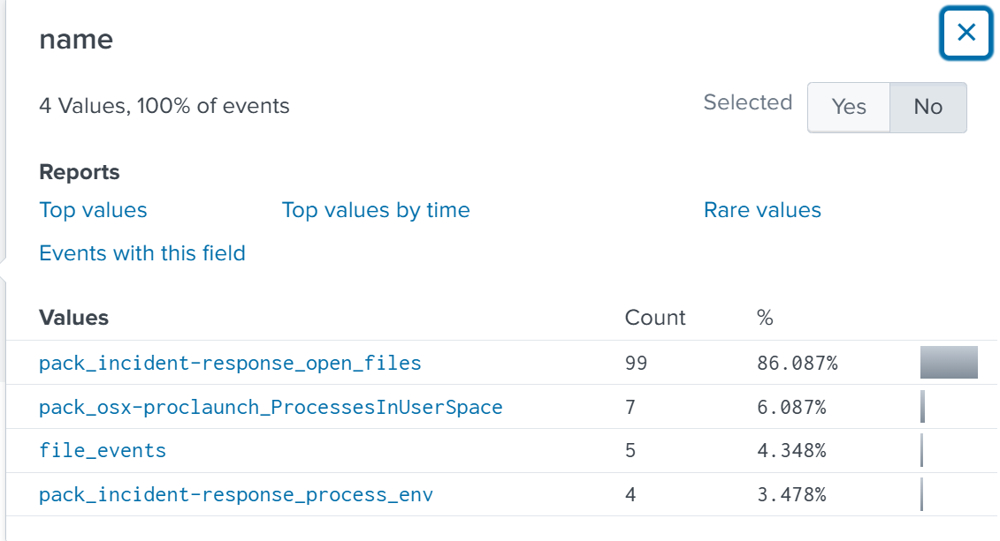

The columns.target_path field here shows a single suspicious file: /Users/mkraeusen/Downloads/Important_HR_INFO_for_mkraeusen. A generic HR-themed filename dropped directly into a Downloads folder is a classic social engineering lure, designed to get opened out of curiosity or a sense of obligation rather than because the user was expecting a file transfer.

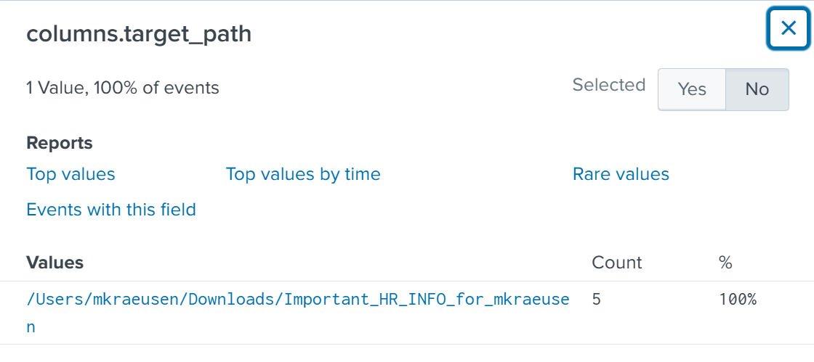

The raw event carries a timestamp of 18:19:07 UTC, one minute after the USB connection event identified in Phase 3. A one-minute gap between a removable device connecting and a suspicious file appearing in Downloads is tight enough to treat as directly correlated rather than coincidental, even though nothing in the data explicitly links the two events by a shared field. This is a core piece of SOC reasoning worth being deliberate about, correlation by timestamp proximity is valid evidence on its own when the gap is short and the sequence makes logical sense, it doesn't always require a shared session ID or process GUID to justify connecting two events into one narrative.

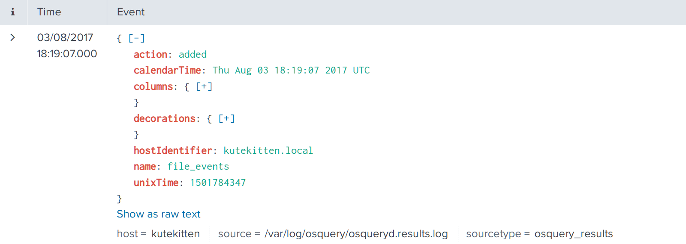

This also connects back to the web application investigation from Writeup 2. Kevin Lagerfield, whose session was hijacked there, is the individual identified as having physically carried this USB drive. The same person surfacing across two unrelated-looking incidents is itself worth flagging in a real investigation, since it can mean either a coincidence of someone simply being present in multiple contexts, or a pattern of being repeatedly targeted or used as a vector, deliberately or not.

### Phase 5: Malware Attribution

The same file_events entry that captured the drop also carries a SHA256 hash for the dropped file, which is the anchor needed to move from "a suspicious file appeared" to "this is confirmed malicious and here's what it does."

```
columns.sha256: befa9bfe488244c64db096522b4fad73fc01ea8c4cd0323f1cbdee81ba008271
```

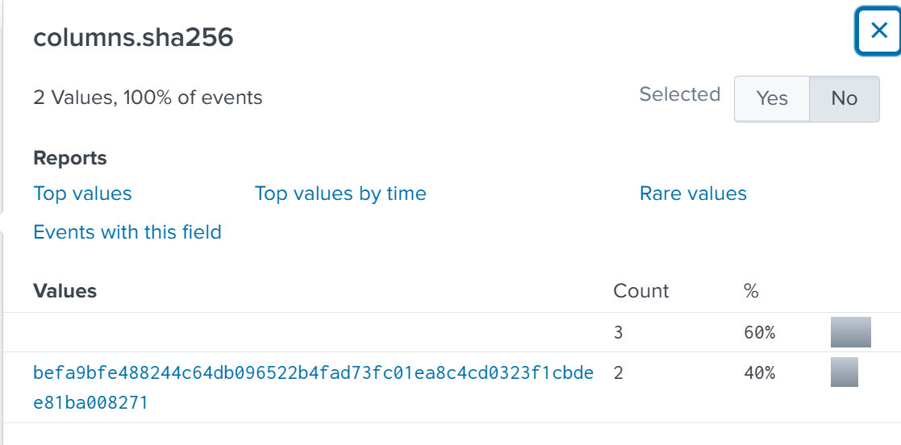

Submitting this hash to VirusTotal rather than the file itself is the right first move whenever a hash is already available, it avoids handling a live malicious sample directly and returns a reputation verdict immediately if the file has been seen before anywhere else. The detection results show the large majority of security vendors flagging this as malicious, with family labels including perl and ransomware tags. A high detection ratio across many independent vendors is strong confirmation, but it's worth being precise about what it actually tells you: it confirms other organizations have seen this exact file and judged it malicious, it does not on its own tell you what it does or how it behaves, that comes from the other tabs.

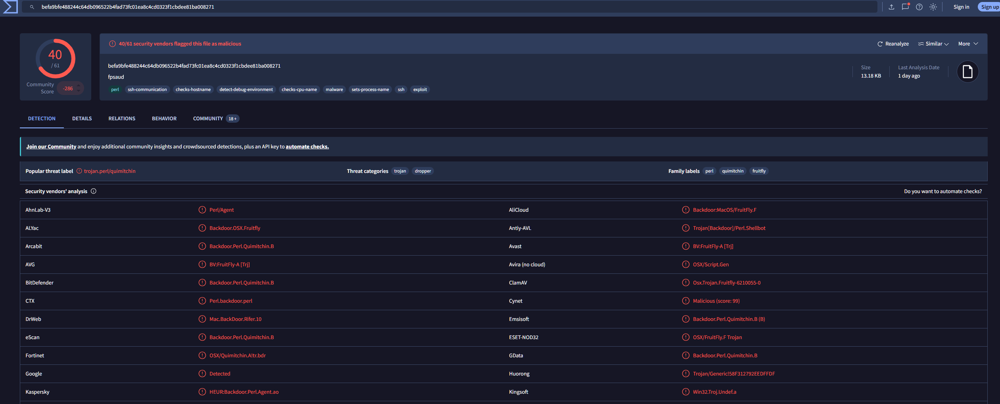

The History tab shows this file was first seen in the wild on 2017-01-17, months before this incident occurred. That timing matters operationally, a sample first seen in the wild months earlier and still successfully executing here means either detection signatures hadn't caught up to it in this environment, or it was never scanned against updated intelligence before reaching this device, which is exactly the kind of gap a personal, unmanaged machine creates.

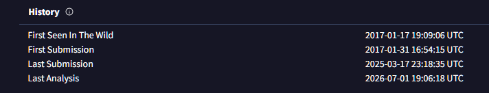

The Relations tab surfaces the domains this sample is known to have contacted across other sandbox detonations and community submissions, without needing to detonate it again here. Two domains stand out with meaningful detection counts against them: eidk.duckdns.org and eidk.hopto.org, both built on dynamic DNS providers. Dynamic DNS services are commonly abused for command and control specifically because they let an attacker point a consistent hostname at a changing IP address for free, which makes the domain itself a more durable indicator than any single IP the malware might resolve to at a given moment.

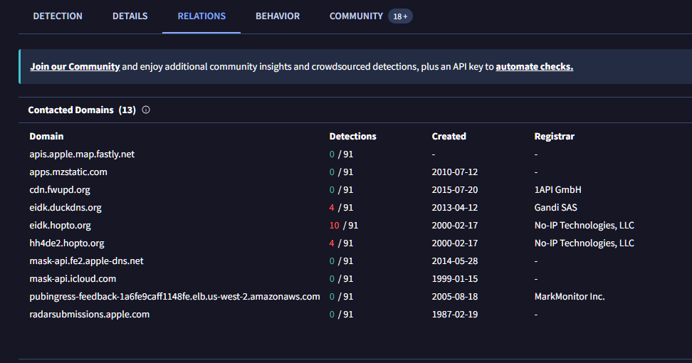

## Attack Timeline

```
2017-01-17 19:09:06 UTC  Malware sample first seen in the wild (VirusTotal history)
2017-08-03 18:18:10 UTC  USB device (vendor_id 058f, Alcor Micro Corp) connected
                         to kutekitten
2017-08-03 18:19:07 UTC  Suspicious file Important_HR_INFO_for_mkraeusen
                         created in Downloads folder
2017-08-03 18:25:41 UTC  Ransomware executes, encrypting files across kutekitten
                         and syncing/appearing on MACLORY-AIR13, including
                         Frothly_marketing_campaign_Q317.pptx and
                         GoT.S07E02.BOTS.BOTS.BOTS.mkv
```

## IOC Summary Table

| Type    | Value                                                              | Context                                    |
|---------|----------------------------------------------------------------------|-----------------------------------------------|
| Host    | MACLORY-AIR13                                                       | Mallory's corporate MacBook                    |
| Host    | kutekitten                                                          | Mallory's personal, unmanaged MacBook           |
| Path    | /Users/mallorykraeusen/Documents/Frothly_marketing_campaign_Q317.pptx.crypt | Encrypted corporate file             |
| Path    | /Users/mallorykraeusen/Downloads/GoT.S07E02.BOTS.BOTS.BOTS.mkv.crypt | Encrypted personal media file                  |
| Path    | /Users/mkraeusen/Downloads/Important_HR_INFO_for_mkraeusen           | Malicious file dropped via USB                 |
| Hash    | befa9bfe488244c64db096522b4fad73fc01ea8c4cd0323f1cbdee81ba008271     | SHA256 of the dropped malware                  |
| Domain  | eidk.duckdns.org                                                     | C2 destination, dynamic DNS                    |
| Domain  | eidk.hopto.org                                                       | C2 destination, dynamic DNS                    |

## MITRE ATT&CK Mapping

| Phase                    | Tactic          | Technique                              | Technique ID |
|--------------------------|-----------------|------------------------------------------|--------------|
| USB-based delivery        | Initial Access  | Replication Through Removable Media       | T1091        |
| File encryption           | Impact          | Data Encrypted for Impact                  | T1486        |
| C2 communication          | Command and Control | Dynamic Resolution                     | T1568        |

## SOC Implications

Scoping this alert correctly meant not stopping at the device where it fired. The alert originated on MACLORY-AIR13, but the actual infection point was kutekitten, a device that had no reason to be on the SOC's radar at all until osquery telemetry happened to be present on it. Reading an alert queue item with the assumption that the affected host is also the entry point is a mistake this case illustrates directly, the two are often not the same machine.

Cross-source corroboration here relied heavily on timestamp correlation rather than shared identifiers. The USB connection event and the file drop event share no common field linking them together, they're tied purely by a one-minute gap and a logical sequence. Being comfortable building a narrative on timing proximity, rather than insisting on an explicit correlation field every time, is necessary for investigations involving osquery or similar telemetry that doesn't always carry session or process linkage the way Sysmon does.

The clearest detection gap is structural rather than technical. A personal, unmanaged device being used to bridge a known-malicious file into an environment that does have monitoring is a BYOD problem, not a signature problem. No antivirus rule or EDR alert prevents this pattern on its own, since the entry point sits entirely outside managed infrastructure until the user's own corporate device becomes involved. The realistic recommendation here is policy-level, restricting or monitoring removable media use on any device that has access to corporate resources, regardless of whether that device is corporate-owned.

The highest severity finding is the confirmed use of an unmanaged personal device as the actual entry point for ransomware that went on to impact a corporate asset. This matters beyond this single incident because it establishes a pattern worth watching for broadly, personal devices used for work-adjacent activity are frequently where real compromises start precisely because they exist outside the visibility that corporate telemetry assumes is universal.

---
Room: TryHackMe, BOTSv2 Dataset