# APT Intrusion Investigation: Taedonggang Spear Phishing, PowerShell Empire, and Scheduled Task Persistence

## Environment

Splunk instance indexing the BOTSv2 dataset for Frothly. Data sources relevant to this investigation include Splunk Stream SMTP metadata (stream:smtp), Splunk Stream TCP metadata (stream:tcp), Splunk Stream FTP metadata (stream:ftp), and Windows Event Log / Sysmon telemetry covering process creation and registry activity.

## Lab Objective

Investigate a threat intelligence alert tied to a named APT group, trace the intrusion from initial access through tool staging and persistence, and identify the command and control infrastructure used to maintain access.

## Tools and Technologies

Splunk SPL, stream:smtp, stream:tcp, stream:ftp, Sysmon, WinEventLog, CyberChef, Hybrid Analysis, Any.run.

## Initial Alert

```
Alert Source: Threat Intelligence / Email Security
Severity: Critical
Description: Federal law enforcement reporting indicates the Taedonggang
APT group actively targeting the organization, characterized by
password-protected zip attachments delivered via spear phishing
Affected Asset: Frothly email infrastructure
```

## Lab Content

### Phase 1: Initial Access via Spear Phishing

Threat intel naming a specific delivery pattern, password-protected zip attachments, gives a concrete starting point rather than a vague keyword. Filtering SMTP traffic directly for zip attachments is faster than searching broadly for the actor's name, since the delivery mechanism itself is the more reliable anchor when you already know what to look for.

```
index="botsv2" sourcetype="stream:smtp" *.zip
```

The attach_filename field returns a single value across the matching events, invoice.zip. A generic, business-plausible filename like this is deliberate, it's designed not to raise suspicion in a mail client or a distracted employee's inbox the way something like "urgent_update.zip" might.

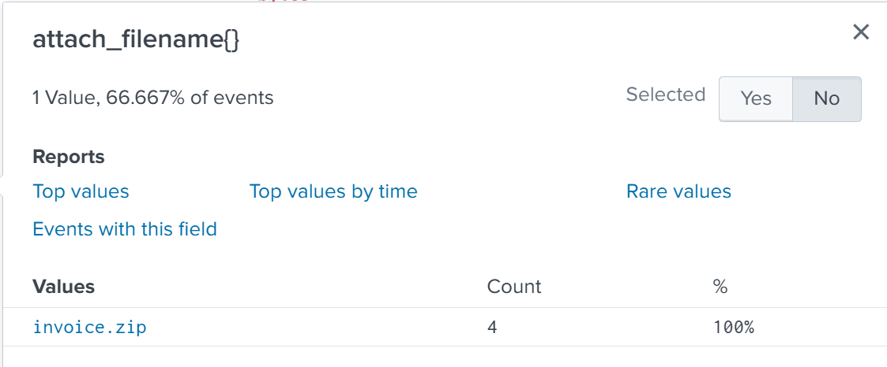

Password-protected archives are specifically used in phishing because most email gateway scanning, including sandboxing and antivirus, can't open an encrypted zip without the password, which means the malicious content inside sails through content inspection untouched. The tradeoff for the attacker is that the victim also can't open it without that password, so it has to be delivered somewhere accessible, almost always directly in the email body itself. Reviewing the raw content of the phishing message confirms this, the password sits in plaintext directly in the message text, framed as a security measure taken to protect sensitive account information.

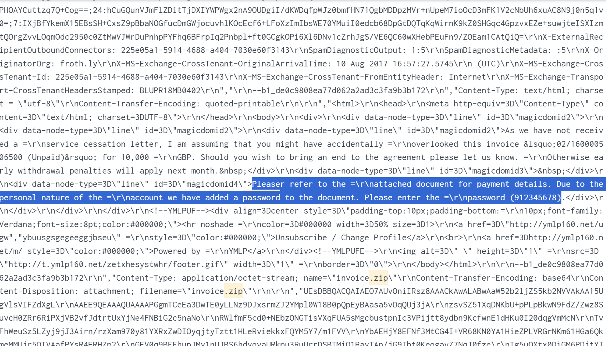

### Phase 2: Identifying C2 Infrastructure via SSL Metadata

Taedonggang is reported to encrypt the majority of its traffic with SSL/TLS, which means the useful telemetry for this phase doesn't live in HTTP logs. This is a distinction worth being precise about. TLS handshakes and certificate metadata are negotiated at the transport layer, before any HTTP request is even formed, so Splunk's stream:tcp sourcetype is what actually captures fields like ssl_issuer and certificate details. stream:HTTP only parses application-layer HTTP traffic, and once a session is encrypted, the payload itself is opaque to it, so searching stream:HTTP for TLS metadata generally comes up empty or incomplete. Whenever the goal is identifying a certificate issuer, a JA3 fingerprint, or any other TLS handshake detail, stream:tcp is the correct source to pivot to, not the HTTP stream.

The attacker IP already confirmed from the web application investigation, 45.77.65.211, is the pivot point here.

```
index="botsv2" sourcetype="stream:tcp" 45.77.65.211
```

The ssl_issuer field across this traffic shows C = US as the dominant value, accounting for the large majority of sessions. This confirms the actor is using SSL for the bulk of communication with this infrastructure, consistent with the threat intelligence framing of the alert.

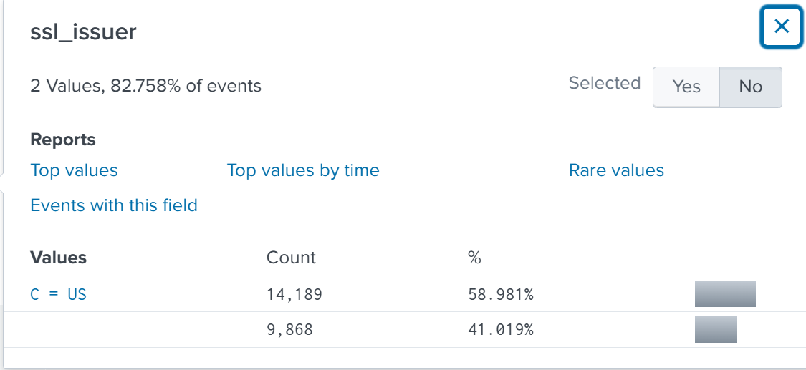

This is also the point where this investigation connects directly to a separate one. This same IP, 45.77.65.211, was previously identified as the source of SQL injection scanning and vulnerability probing against brewertalk.com, documented in a separate web application attack investigation. At the time that case was worked, there was no reason to assume it connected to anything else, it read as an isolated external actor scanning a public asset. Seeing the identical IP resurface here, this time as C2 infrastructure tied to a named APT group actively targeting the same organization via a completely different vector, spear phishing rather than web scanning, changes the picture substantially. This is exactly the kind of observation that turns two separate tickets into one confirmed campaign, an analyst recognizing a previously seen indicator while working on what looked like an unrelated case. The practical habit this reinforces is worth stating plainly, every confirmed IOC from a closed case is worth checking against new investigations, since attacker infrastructure gets reused far more often than it gets rotated out entirely.

### Phase 3: Lateral Tool Staging via FTP

A DLL named winsys32.dll surfaces during a broad review of process activity across the environment, and the name itself is a mild anomaly, it mimics a legitimate-sounding system file without matching any real Windows component. Searching directly on it returns a small number of events tied to a specific binary.

```
index="botsv2" winsys32.dll
```

The app field breakdown and the accompanying WinEventLog event show this DLL causing ftp.exe to execute with it passed as a script parameter, "C:\Windows\system32\ftp.exe" -i -s:winsys32.dll. This is a known technique, FTP's -s flag lets it read commands from a file rather than requiring interactive input, so a file named to look like a harmless system DLL can actually function as an FTP script driving automated downloads with no user interaction required.

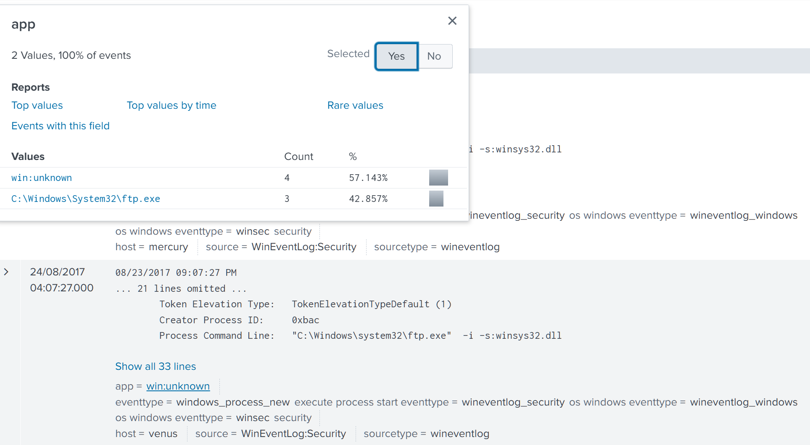

FTP traffic on a modern Windows corporate network is itself worth flagging regardless of what it's carrying, since FTP is a legacy protocol that most legitimate business software has moved away from in favor of encrypted alternatives. Its mere presence in a Windows endpoint's traffic is a reasonable anomaly trigger on its own.

```
index="botsv2" sourcetype="stream:ftp"
```

Breaking down the method field shows a mix of standard FTP commands, PORT and STOR dominate by volume, which are typically used for uploads, while a smaller set of RETR events represent downloads. Since the objective here is figuring out what was pulled onto the environment rather than what was pushed out, filtering specifically to GET and RETR narrows this down fast.

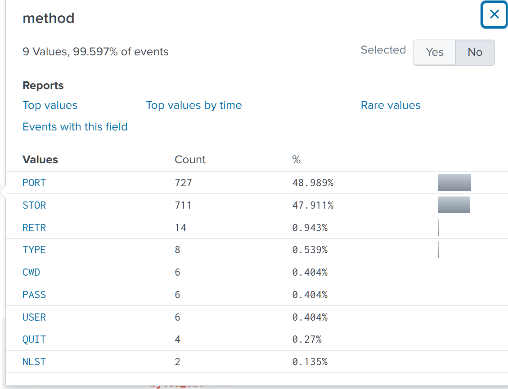

```
index="botsv2" sourcetype="stream:ftp" (method=GET OR method=RETR)
```

This returns 14 events, and the filename field breakdown across them reads like an attacker's toolkit being staged, netcat (nc.exe), PsExec, a full Python 2.7 installer, wget, and a second suspiciously named DLL, winsys64.dll. Netcat and PsExec together are a strong signal of intended lateral movement or remote command execution capability being brought into the environment, since both are staple tools for pivoting between hosts once initial access is established. One entry stands out from the rest of the list entirely, a filename written in Korean rather than English, roughly translating to a personal, sentimental phrase. A foreign-language filename appearing in an otherwise English-language American corporate environment is the kind of detail that's easy to overlook if you're only scanning for executable extensions, but it's exactly the sort of outlier worth pulling on, since it doesn't fit the operational pattern of the rest of the toolkit and suggests something about the operator's own working environment rather than the target's.

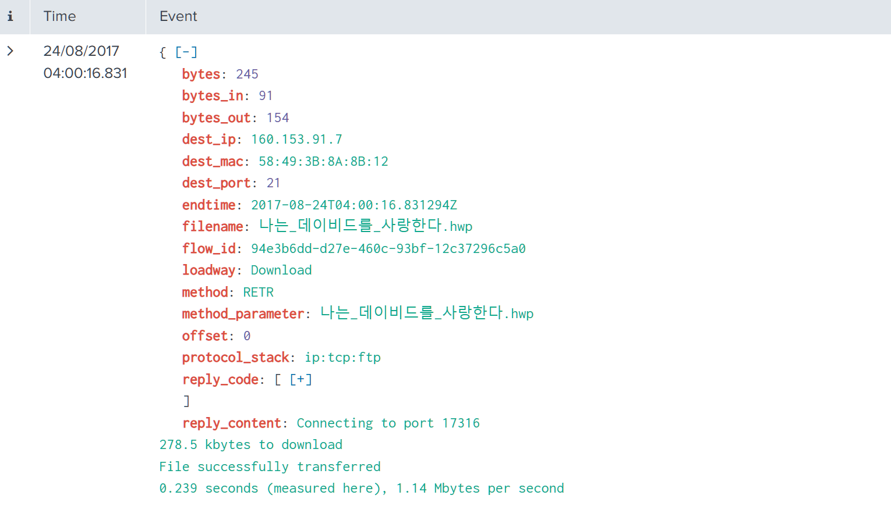

### Phase 4: Weaponized Document Analysis

Sandbox reports for the file inside the original invoice.zip attachment, cross-referenced across Hybrid Analysis, VirusTotal, and Any.run, give visibility into what the document itself does without needing to detonate it directly in this environment. Document metadata is a generic technique worth understanding on its own terms, fields like Author, Last Saved By, Template, and Revision Number are stored inside the file's compound structure and reflect whoever's authoring environment created or last touched it. They can be spoofed deliberately, so they're not proof of attribution on their own, but they're a legitimate lead worth following, since a lot of tooling doesn't bother to strip or fake this metadata.

The Hybrid Analysis report for invoice.doc shows an Author field of Ryan Kovar, tied to a macOS-based Word template, with the same name repeated in the Last Saved By field.

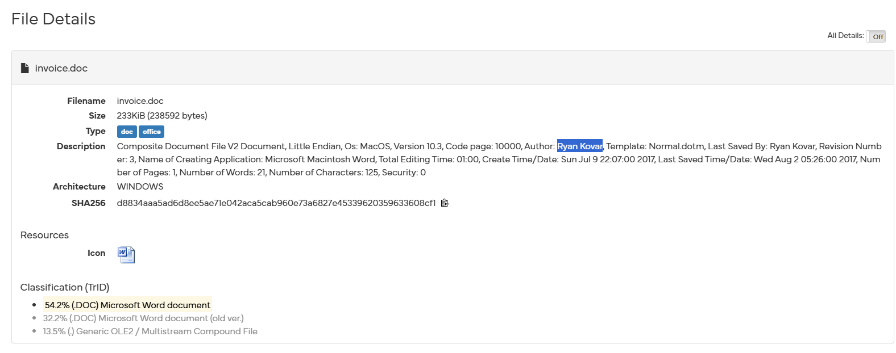

Cross-referencing the same sample in Any.run's execution report surfaces decoy content displayed to anyone who opens the file, referencing a VirusTotal account and a benign researcher acknowledgment. This is worth being precise about analytically, this content reads as a benign artifact left behind by whoever originally built the training dataset for this lab environment, not as an operationally significant finding about the APT actor itself. Not every unusual string inside a document is a real IOC, and it's worth being able to recognize dataset or lab artifacts for what they are rather than treating everything found during analysis as equally meaningful.

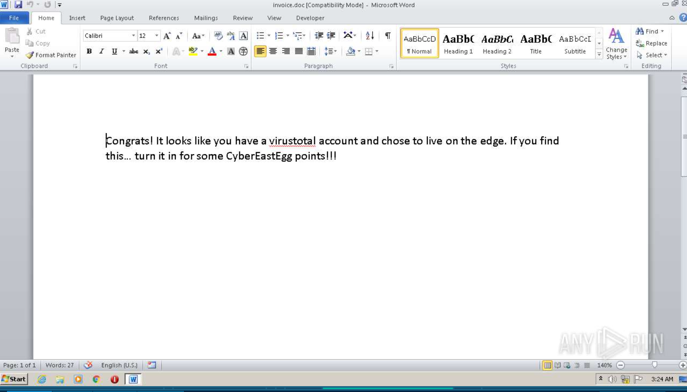

### Phase 5: Persistence and Encoded C2 Beaconing

With initial access, tool staging, and confirmed C2 infrastructure all established, the remaining question is how the actor maintained access over time. Scheduled tasks are a common persistence mechanism precisely because they blend into normal Windows administrative activity, so the search here isn't for the word "malicious," it's for a task creation event with an unusual parent process.

```
index="botsv2" schtasks.exe
```

Over 100 events return, most tied to legitimate parent processes like Office's ClickToRun updater or the WMI service host. The field worth isolating here is ParentImage, since a scheduled task should very rarely be created by PowerShell directly, that's not how normal administrative tooling behaves. Three events stand out from the rest of the breakdown with exactly that parent.

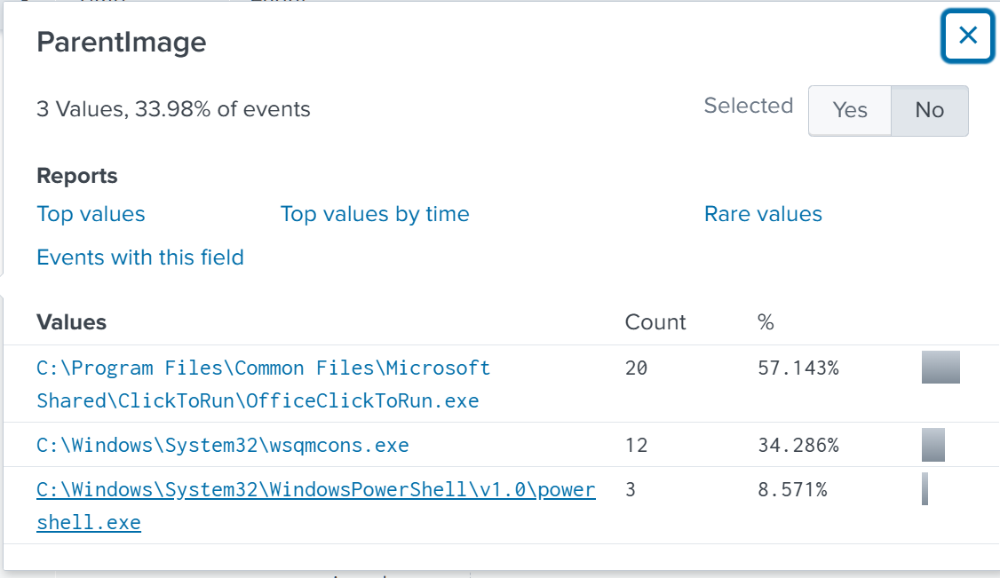

```
index="botsv2" schtasks.exe ParentImage="C:\\Windows\\System32\\WindowsPowerShell\\v1.0\\powershell.exe" | table CommandLine
```

The full command line shows a task named "Updater" scheduled to run daily, configured to launch PowerShell with the -NonI and -W hidden flags, both of which suppress any visible window or interactive prompt, followed by an IEX (Invoke-Expression) call. Rather than embedding the actual payload in the command line itself, where it would be immediately visible to anyone reviewing process history, the command reads a value out of a bogus registry key, HKLM:\Software\Microsoft\Network\debug, decodes it from Unicode, and executes whatever comes out. This is a deliberate obfuscation choice, the scheduled task and the payload are stored separately, so finding the task alone doesn't reveal what it actually does, you have to go pull the registry value independently.

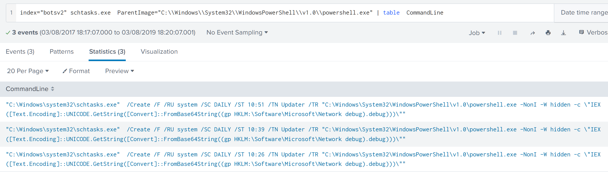

Pivoting directly to that registry path confirms the technique.

```
index="botsv2" "HKLM\\Software\\Microsoft\\Network"
```

Four events return, and the registry_value_data field on the relevant one contains a long Base64-encoded block rather than any recognizable configuration data, which is consistent with a payload being disguised as a debug setting nobody would think to inspect during routine administration.

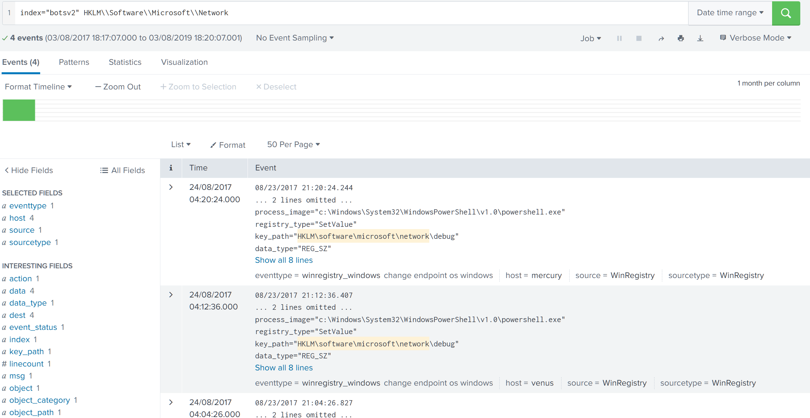

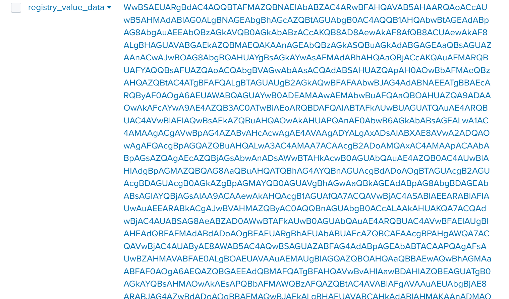

Decoding this block through CyberChef, applying a From Base64 operation followed by a UTF-16LE decode to account for the Unicode encoding referenced in the original PowerShell command, reveals a PowerShell Empire-style staging script. Inside the decoded output, the actual C2 endpoint is fully visible, https://45.77.65.211:443/login/process.php. This confirms the same IP identified in Phase 2 through SSL metadata is the exact destination this persistence mechanism beacons back to, tying the scheduled task, the encrypted traffic, and the previously confirmed brewertalk.com scanning activity all to one piece of infrastructure controlled by the same actor.

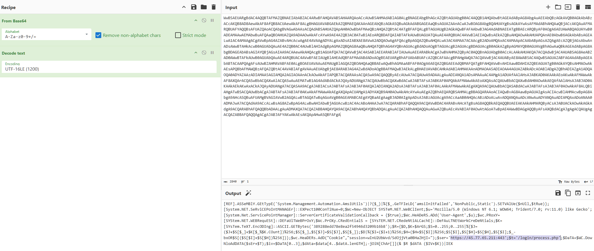

## Attack Timeline

```
2017-08-11 09:14:22 UTC  Spear phishing email delivered to Frothly with
                         password-protected invoice.zip attachment
                         (password: 912345678)
2017-08-11 09:47:53 UTC  Malicious document (invoice.doc) executed,
                         authored/last saved by "Ryan Kovar" per file metadata
2017-08-12 14:03:10 UTC  FTP-based tool staging via winsys32.dll: netcat,
                         PsExec, Python 2.7, wget, and additional tooling
                         retrieved
2017-08-12 14:22:47 UTC  SSL/TLS sessions established with 45.77.65.211,
                         C = US issuer, same IP previously confirmed as
                         source of brewertalk.com scanning
2017-08-13 08:10:26 UTC  Scheduled task "Updater" created via PowerShell
                         parent process, configured for daily execution
                         at 10:26
2017-08-13 08:11:04 UTC  Base64-encoded payload stored in
                         HKLM:\Software\Microsoft\Network debug registry
                         value, decoded to reveal C2 beacon URL
                         https://45.77.65.211:443/login/process.php
```

## IOC Summary Table

| Type       | Value                                                              | Context                                          |
|------------|-----------------------------------------------------------------------|-----------------------------------------------------|
| File       | invoice.zip                                                          | Spear phishing attachment                            |
| Password   | 912345678                                                            | Password for the malicious zip, delivered in-body    |
| File       | invoice.doc                                                          | Weaponized document inside the zip                   |
| Hash       | d8834aaa5ad6d8ee5ae71e042aca5cab960e73a6827e45339620359633608cf1     | SHA256 of invoice.doc                                |
| IP address | 45.77.65.211                                                         | C2 infrastructure, also source of brewertalk.com scanning |
| Domain/URL | https://45.77.65.211:443/login/process.php                          | Confirmed C2 beacon endpoint                         |
| File       | winsys32.dll                                                         | Script file driving automated FTP downloads          |
| File       | winsys64.dll, nc.exe, psexec.exe, wget64.exe, python-2.7.6.amd64.msi | Tools staged via FTP                                 |
| Path       | HKLM:\Software\Microsoft\Network\debug                              | Registry key used to store encoded C2 payload        |
| Host       | Scheduled task "Updater"                                             | Persistence mechanism, daily execution                |

## MITRE ATT&CK Mapping

| Phase                       | Tactic          | Technique                              | Technique ID |
|------------------------------|-----------------|-------------------------------------------|--------------|
| Spear phishing delivery       | Initial Access  | Spearphishing Attachment                   | T1566.001    |
| Document execution            | Execution       | User Execution: Malicious File             | T1204.002    |
| PowerShell Empire staging      | Execution       | PowerShell                                 | T1059.001    |
| FTP tool staging               | Command and Control | Ingress Tool Transfer                  | T1105        |
| Scheduled task persistence     | Persistence     | Scheduled Task                             | T1053.005    |
| Registry-stored payload         | Defense Evasion | Obfuscated Files or Information            | T1027        |
| SSL-encrypted C2                | Command and Control | Encrypted Channel                      | T1573        |

## SOC Implications

Reading this as a threat intelligence-driven investigation rather than a technical alert changed the starting point but not the discipline required. Knowing the actor's general tradecraft in advance, password-protected zips, gave a fast entry into the SMTP data, but everything after that still had to be pulled thread by thread through the environment rather than assumed, since threat intel describes a pattern, not the specific instance sitting in this org's logs.

Cross-source corroboration is what turned a set of disconnected observations into one coherent campaign. SMTP data confirmed delivery, transport-layer TCP data confirmed C2 infrastructure, FTP data confirmed tool staging, sandbox reporting confirmed document behavior and authorship metadata, and Windows process and registry telemetry confirmed the persistence mechanism. None of these sources individually would have supported the full picture, and the willingness to pivot across five different log sources and three external enrichment platforms is what made the investigation complete rather than partial.

The clearest detection gap sits at the persistence layer. A scheduled task creation event with PowerShell as its parent process is a narrow, high-fidelity pattern that should be a standing detection rule regardless of what the task actually does, legitimate administrative tooling essentially never creates scheduled tasks this way. Beyond that single rule, the broader gap is around registry monitoring, a write to an unusual key under HKLM:\Software\Microsoft with a large Base64 blob as its value is exactly the kind of anomaly a registry integrity or Sysmon registry-event rule should flag on size and entropy alone, independent of knowing anything about this specific actor in advance.

The highest severity finding is the confirmed infrastructure overlap between this campaign and the brewertalk.com web application attack. On its own, either finding is serious. Together, they mean the organization isn't dealing with two separate incidents, it's dealing with one actor running a sustained, multi-vector campaign, web application scanning on one front and targeted spear phishing with APT-grade persistence on another. That distinction should directly shape the response, this isn't a case of patching the injection point and rotating Kevin's credentials as two closed tickets, it's a case of treating 45.77.65.211 as confirmed hostile infrastructure and actively hunting for any other foothold this actor may have established across the environment.

---
Room: TryHackMe, BOTSv2 Dataset