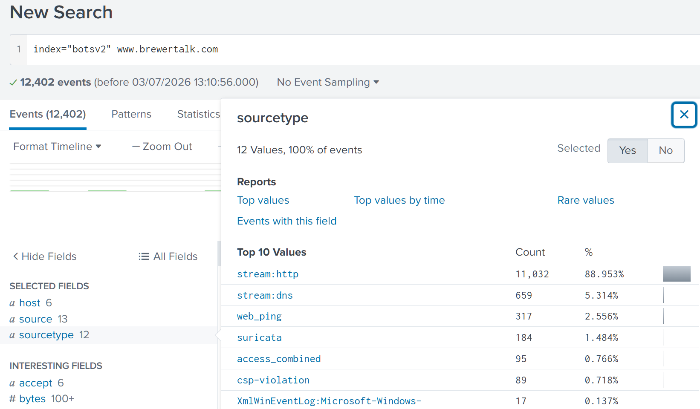
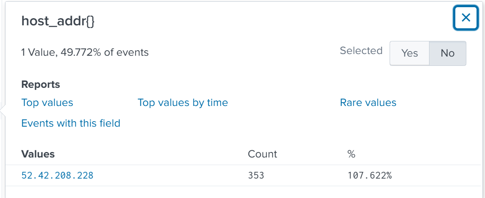
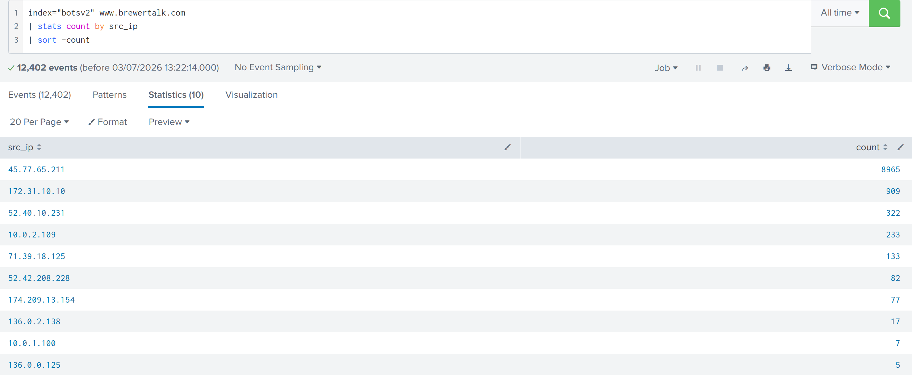
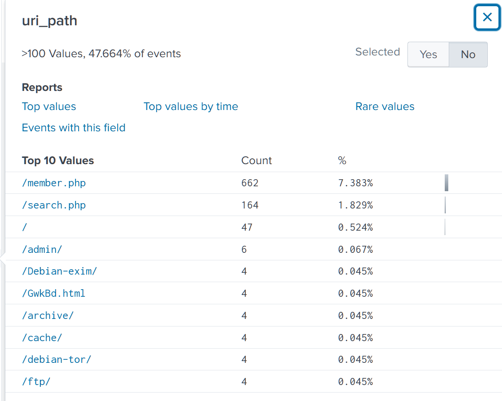
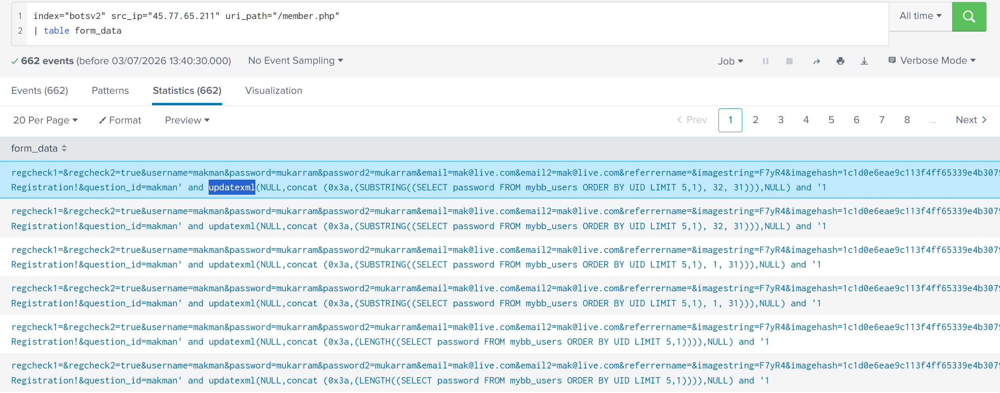
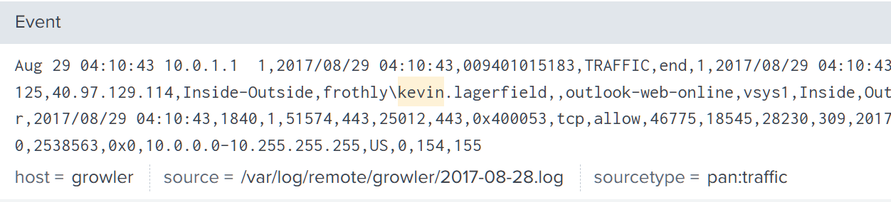
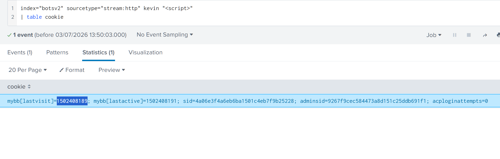
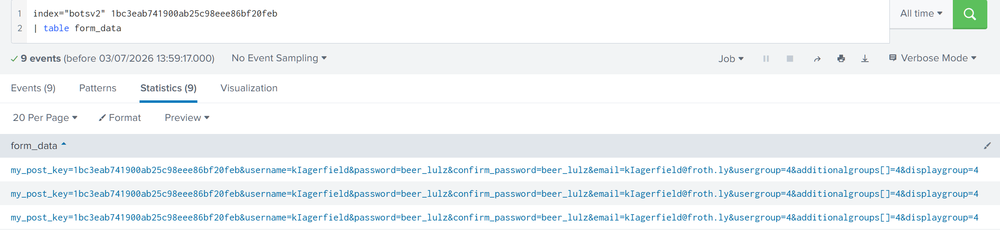

# Web Application Attack Investigation: SQL Injection and Session Hijacking Against brewertalk.com

## Environment

Splunk instance indexing the BOTSv2 dataset for Frothly. Data sources relevant to this investigation include Splunk Stream DNS metadata (stream:dns), Splunk Stream HTTP metadata (stream:HTTP), and Palo Alto Networks traffic logs (pan:traffic), covering the public-facing web asset brewertalk.com.

## Lab Objective

Investigate a security alert flagging SQL injection and cross-site scripting patterns against a public-facing web application, confirm the scope of the attack, and determine whether any internal accounts were compromised as a result.

## Tools and Technologies

Splunk SPL, stream:dns, stream:HTTP, pan:traffic.

## Initial Alert

```
Alert Source: Web Application Firewall / IDS
Severity: High
Description: Multiple SQL injection and cross-site scripting patterns
detected targeting www.brewertalk.com over a short time window
Affected Asset: www.brewertalk.com (public-facing)
```

An alert like this on a public-facing asset can mean two very different things. It could be an automated scanner sweeping the internet for vulnerable installations with no interest in this specific target, or it could be something deliberate and targeted. That distinction changes how urgently this needs to be treated, so the first job is establishing which one this actually is before assuming anything about intent.

## Lab Content

### Phase 1: Confirming the Public-Facing Asset

The alert names a domain, brewertalk.com, but an investigation needs an IP address to correlate traffic against, since that's what actually shows up in connection logs. The generic technique here is pivoting to DNS query logs to resolve the domain to its answer. DNS resolution logs are useful for this specifically because they record what a client asked for and what the DNS server answered with, which gives a reliable domain-to-IP mapping grounded in what the network itself observed, rather than relying on an external WHOIS lookup that might reflect a different point in time.

```
index="botsv2" www.brewertalk.com
```

This initial query returns over 12,000 events across a dozen different source types, from HTTP and DNS traffic to Suricata alerts and access logs. That volume confirms the domain is active and heavily trafficked, but it's too broad to reason about directly.



Narrowing to stream:dns specifically isolates only the resolution events for that domain.

```
index="botsv2" www.brewertalk.com source="stream:dns"
```

The host_addr field in these events shows a single public IP tied to every query for that domain, 52.42.208.228. Having this confirmed IP now gives a stable anchor to search against instead of the domain string, which matters because IP-based searches tend to be more precise than domain string matches once other traffic sources come into play.



### Phase 2: Isolating the Attacker's Source

With the target IP confirmed, the next question is who is generating traffic toward it, and whether any single source stands out from normal usage. The technique here is a stats aggregation by source IP, sorted to surface the highest volume contributor first.

```
index="botsv2" www.brewertalk.com
| stats count by src_ip
| sort -count
```

The result shows one IP, 45.77.65.211, generating close to 9,000 events, roughly ten times the volume of the next highest source. In a small lab dataset a gap this large is obvious at a glance, but the same logic applies at production scale, it's just less visually dramatic. In a real environment this isn't a one-off snapshot, it's something you baseline over time. A public web server has an expected traffic pattern per source, mostly driven by normal user sessions, search engine crawlers, and CDN or load balancer health checks. An anomaly worth investigating is a source that breaks that pattern, either by volume that's disproportionate to what a single user session should generate, or by a request rate that's mechanically consistent in a way no human browsing session produces, dozens of requests per second with near-identical timing gaps. That kind of regularity is itself a signature, since real users pause, scroll, and read between requests, while automated tooling doesn't.



### Phase 3: SQL Injection Analysis

With a confirmed attacker IP, the next step is finding out what it was actually doing on the server, not just how much traffic it generated. Pivoting to that IP's HTTP traffic and pulling the uri_path field shows which endpoint absorbed the bulk of the requests.

```
index="botsv2" src_ip="45.77.65.211"
```

The uri_path field shows /member.php receiving over 600 requests from this source, far more than any other endpoint on the site. A member or login-related page receiving this kind of concentrated attention from a single external IP is consistent with an attacker probing a form that accepts user input and interacts with a database, which is exactly the kind of endpoint SQL injection targets.



Confirming what was actually sent to that endpoint means looking at the form_data field, since that's where submitted parameters live in Stream HTTP events. Tabling that field across all requests to this specific path and IP surfaces the actual payloads.

```
index="botsv2" src_ip="45.77.65.211" uri_path="/member.php" | table form_data
```

The payloads visible here follow a recognizable pattern for blind SQL injection. Rather than a single request, they show a long sequence of near-identical submissions where only a small fragment changes each time, typically a LIMIT offset or a substring position. This repetition is the signature itself. Blind injection can't read a result directly, so the attacker infers information one character or one bit at a time by asking the database a slightly different yes-or-no question on each request and watching how the server responds. Seeing the same base query structure repeated dozens of times with only minor incremental changes is a strong indicator that whatever's happening isn't a legitimate use of the form, since no normal user interaction produces that pattern.

The specific SQL function being abused across these payloads is updatexml, wrapped around a SUBSTRING extraction against the password field of the mybb_users table. updatexml is normally an XML-handling function, but it gets abused here for error-based extraction, since malformed XML input causes the database to throw an error message that leaks the injected subquery's result back to the attacker through the error text itself, even without a UNION-based response. Recognizing SQL functions like this in raw form data, rather than just spotting the word "SELECT" and moving on, is what separates confirming a SQL injection attempt from actually understanding what technique is being used and what the attacker could plausibly extract with it.



### Phase 4: Session Hijacking via XSS

A separate signal in the original alert concerned cross-site scripting, which points to a different kind of activity than the external scanning just covered. This part of the investigation involves an internal user, Kevin Lagerfield, rather than the external attacker IP. The name surfaces through a keyword search, and confirming his identity follows the same logic used in earlier investigations, pivoting to pan:traffic to tie a username to a source IP with confidence.

```
index="botsv2" kevin
```



With Kevin confirmed as a legitimate internal user, the next question is what happened to his session. XSS cookie theft works by injecting a script tag into a field the application renders back to other users without sanitizing it first, commonly a comment, profile field, or search result. When a victim's browser loads that page, the injected script executes in the context of that page, which means it has access to anything the browser normally has access to for that site, including session cookies. The script's job at that point is simple, read document.cookie and send it somewhere the attacker controls, usually as a parameter appended to a request against an external domain. In logs, this shows up as the presence of a script tag inside form_data or a URI parameter, generally the strongest indicator to search for directly.

```
index="botsv2" sourcetype="stream:http" kevin "<script>" | table cookie
```

The cookie field in the matching event shows the actual session value that was captured and transmitted, mybb[lastvisit]=1502408189 along with related session identifiers. This confirms the theft happened and gives the exact value an attacker would have had available to replay or reuse.



### Phase 5: Account Impersonation via Character Substitution

Stealing a session cookie is rarely the end goal on its own, it's a means to do something with the access it grants. Following the CSRF token that was captured alongside the cookie shows what that something was here.

```
index="botsv2" 1bc3eab741900ab25c98eee86bf20feb | table form_data
```

The form_data returned shows a new account being registered on brewertalk.com using the username kIagerfield. At a glance this reads as Kevin's real username, klagerfield, but it isn't. The lowercase L has been replaced with a capital I, two characters that render nearly identically in many sans-serif fonts. This is a character substitution technique used to create an account that looks legitimate to anyone skimming a member list or a notification, without actually being the real user's account. It's a simpler variant of the broader homograph attack technique used more often in domain squatting with Unicode look-alike characters, but the underlying logic is the same, exploit visual similarity to bypass a human's pattern recognition rather than any technical control. Spotting this kind of substitution reliably means not just reading a username as a word, but comparing it character by character against the real one when something about the context feels off, since the visual trick specifically works against fast reading and stops working the moment you slow down and compare glyph shapes directly.



The analytical thread connecting Phases 4 and 5 matters more than either finding on its own. The XSS attack wasn't executed to deface a page or cause disruption, it was executed specifically to harvest a session and a CSRF token that could then be used to stand up a trusted-looking identity. That identity, in turn, is the kind of foothold that gets used in a follow-on spear phishing attempt against other employees, since a message coming from what looks like a known colleague's account carries far more trust than a message from an unknown external sender.

## IOC Summary Table

| Type       | Value                          | Context                                          |
|------------|----------------------------------|---------------------------------------------------|
| Domain     | www.brewertalk.com               | Targeted public-facing asset                       |
| IP address | 52.42.208.228                    | Public IP hosting brewertalk.com                   |
| IP address | 45.77.65.211                     | Source of SQL injection scanning activity          |
| URL path   | /member.php                      | Endpoint targeted by SQL injection                 |
| Account    | mybb_users.password (targeted field) | Database field targeted by injection payloads  |
| Account    | klagerfield                      | Legitimate victim account, session hijacked        |
| Account    | kIagerfield                      | Impersonation account, character substitution      |
| Password   | mybb[lastvisit]=1502408189       | Stolen session cookie value                        |
| Hash       | 1bc3eab741900ab25c98eee86bf20feb | Stolen CSRF token, reused for account registration |

## MITRE ATT&CK Mapping

| Phase                    | Tactic          | Technique                        | Technique ID |
|--------------------------|-----------------|-----------------------------------|--------------|
| SQL injection scanning    | Initial Access  | Exploit Public-Facing Application | T1190        |
| Stored XSS payload        | Initial Access  | Drive-by Compromise               | T1189        |
| Cookie/CSRF theft         | Credential Access | Steal Web Session Cookie        | T1539        |
| Impersonation account     | Persistence     | Create Account                    | T1136        |

## SOC Implications

Treating the initial alert as a single line item rather than one signal hid two genuinely different attacks happening against the same asset. The SQL injection scanning and the XSS-driven session theft have different sources, different mechanics, and different objectives, external database enumeration versus internal account compromise, and reading the alert queue correctly meant separating them into two distinct investigative threads rather than assuming one payload type explained everything the alert flagged.

Cross-source corroboration carried this investigation the same way it did in the previous case. DNS logs established the asset's real IP, HTTP logs established both the injection payloads and the XSS cookie theft, and PAN traffic confirmed Kevin's identity independently of anything in the web logs. No single source would have been sufficient. Relying only on HTTP data, for instance, would have left Kevin's identity unconfirmed and made it harder to state with confidence that the compromised session belonged to a real, identifiable employee rather than an anonymous visitor.

The clearest detection gap is on the injection side. A WAF sitting in front of a public member page should be blocking payloads matching known SQL injection signatures outright rather than only alerting on them, particularly against a repeated pattern from a single source IP over thousands of requests. The volume alone, roughly ten times the next highest source, should also be catching a rate-limiting or anomaly detection rule regardless of payload content. On the XSS side, any successful transmission of a session cookie to an external domain is a high fidelity indicator that deserves its own dedicated alert, since legitimate application behavior has no reason to send session data off-domain.

The highest severity finding here is the impersonation account, not the SQL injection itself. The injection activity, while concerning, is bounded to what the database exposes and stopped at reconnaissance in what's visible here. The impersonation account is different because it converts a technical web attack into a trust exploitation vector against people, specifically other Frothly employees who would have no reason to distrust a message coming from what looks like a known colleague. That's the finding that should drive the response, not just patching the injection point, but proactively warning staff about potential spear phishing coming from an account that visually resembles Kevin's own.

---
Room: TryHackMe, BOTSv2 Dataset