# Incident Report: Website Defacement — Full Cyber Kill Chain Reconstruction

* **Date:** 07-04-2026
* **Investigator:** Gerard Diaz Gibert
* **Environment:** TryHackMe - Incident Handling With Splunk - Virtual Lab (BOTSv1 Dataset)
* **Scenario:** APT Website Defacement via Joomla Exploitation — Wayne Enterprises
* **Index:** `index=botsv1`

---

## 1. Alert Scenario & Initial Context

Wayne Enterprises reported that their public-facing website `http://www.imreallynotbatman.com` had been defaced. The attacker replaced the site's content with a trademark message: **"YOUR SITE HAS BEEN DEFACED — P01s0n1vy was HERE."**

* **Target Asset:** `imreallynotbatman.com` — Web Server IP: `192.168.250.70`
* **CMS:** Joomla (identified during investigation)
* **Log Sources Available:** `suricata`, `stream:http`, `stream:dns`, `fortigate_utm`, `iis`, `XmlWinEventLog` (Sysmon), `WinEventLog`, `WinRegistry`, `nessus:scan`

**Initial Analyst Observation:** The starting point of this investigation is the damage itself — the defaced website. Unlike alert-driven triage, this is an **evidence-led, backwards reconstruction** of the full attack chain. We begin at "Actions on Objectives" and pull the thread back through each Kill Chain phase to the attacker's origin. This non-linear approach mirrors real-world SOC investigations where the incident is reported after the fact.

> **Investigation Note:** The following phases are documented in **investigative discovery order**, not theoretical Kill Chain sequence. The actual attack sequence is reconstructed in the Unified Attack Timeline at the end.

---

## 2. Phase 1 — Reconnaissance

### 2.1 Identifying the Attacker's IP

The first objective was to identify which source IP was responsible for reconnaissance activity against the web server. We started with `stream:http` to examine inbound HTTP traffic and inspected the `src_ip` field.

**Query:**
```splunk
index=botsv1 imreallynotbatman.com sourcetype=stream:http
```

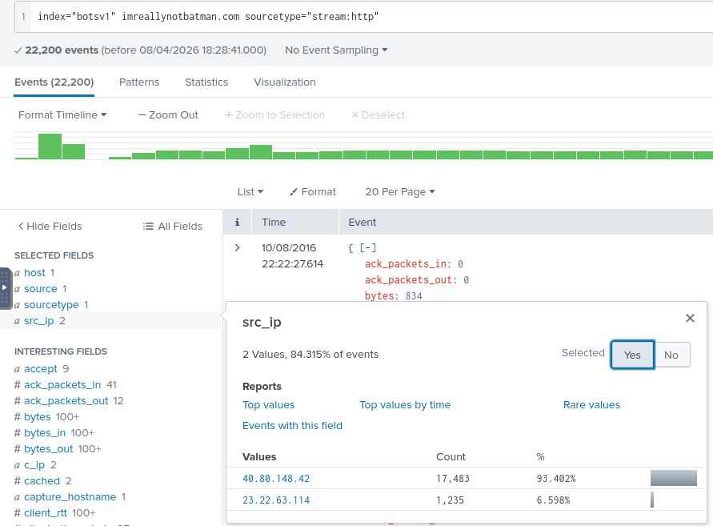

**Findings:** Two source IPs appeared in the `src_ip` field: `40.80.148.42` (93.4% of traffic, ~17,480 events) and `23.22.63.114` (5.6%, ~1,236 events). The volume disparity is the first signal — legitimate users don't generate tens of thousands of requests. We drill into the dominant IP.

**Query:**
```splunk
index="botsv1" imreallynotbatman.com sourcetype="stream:http" src_ip="40.80.148.42"
```

**Findings from field analysis:**
* **`uri` / `uri_path`:** The top URI is `/joomla/index.php/component/search/` (11,928 hits, 68%). Combined with `/windows/win.ini`, `/boot.ini`, and `/joomla/administrator/index.php` — this is a CMS fingerprinting and vulnerability mapping sweep.

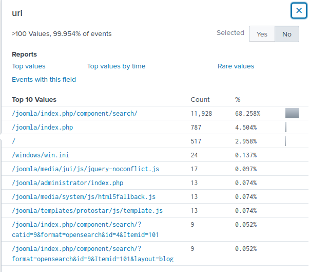

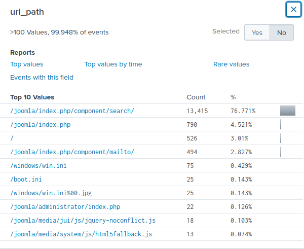

* **`form_data`:** Contains injected payloads including `src=./index.php&fltr[]=blur|5;echo...` (command injection), `<?php echo(md5(acunetix-php-cgi-rce)); ?>` (RCE probe), and multiple XSS/SQLi attempts. This is not a human browsing the site — this is an automated scanner throwing every attack category at the application.

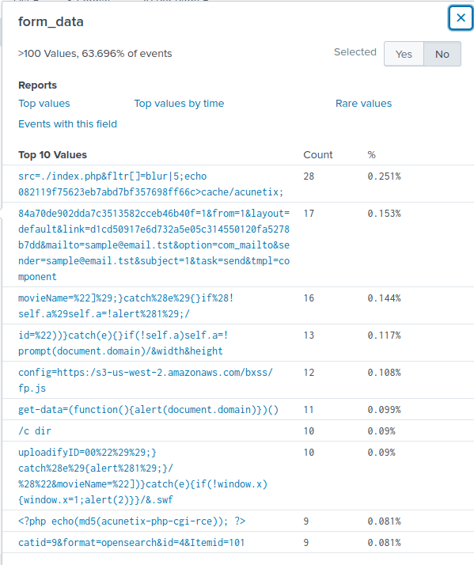


### 2.2 Identifying the Scanning Tool

**Query:**
```splunk
index="botsv1" sourcetype="stream:http" src_ip="40.80.148.42"
```

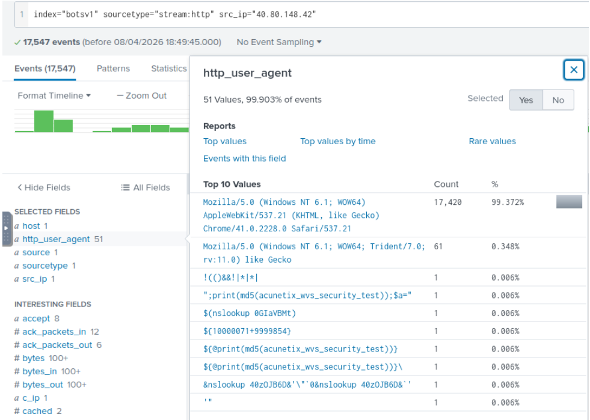

**Finding:** The `http_user_agent` field shows `Mozilla/5.0 (Windows NT 6.1; WOW64) AppleWebKit/537.21` as 99.37% of traffic — this is the default User-Agent string for **Acunetix Web Vulnerability Scanner**. The remaining entries include raw Acunetix probe signatures like `";print(md5(acunetix_wvs_security_test));$a="`. Scanner confirmed.

### 2.3 IDS Validation (Suricata)

To categorize the attack types detected by the IDS during the scanning activity:

**Query:**
```splunk
index=botsv1 imreallynotbatman.com src=40.80.148.42 sourcetype=suricata
```

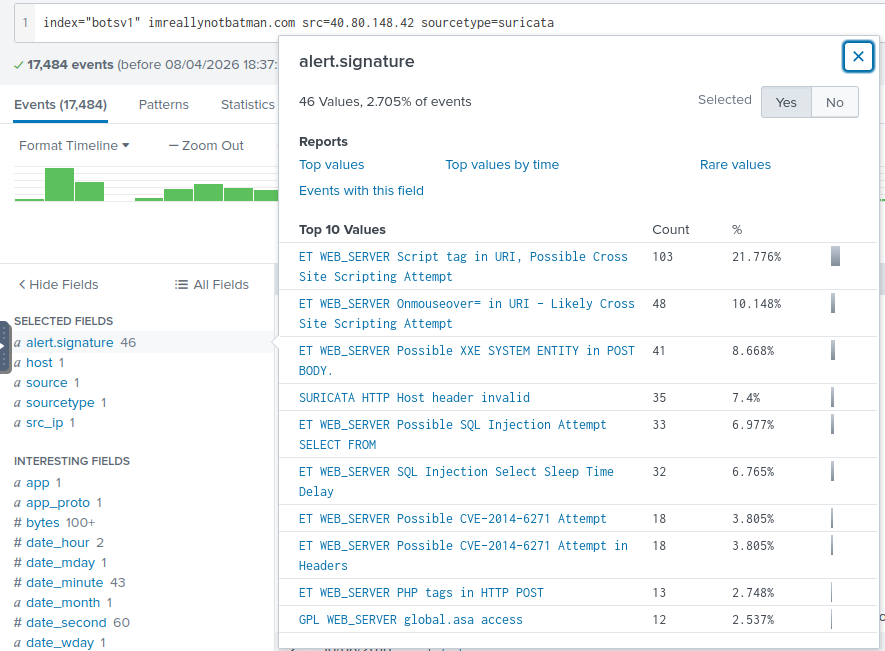

**Findings from `alert_signature` field (top signatures):**

| Suricata Signature | Count | Severity |
| :--- | :--- | :--- |
| ET WEB_SERVER Script tag in URI, Possible XSS | 103 | Medium |
| ET WEB_SERVER Possible XXE SYSTEM ENTITY in POST BODY | 41 | High |
| ET WEB_SERVER Possible SQL Injection Attempt SELECT FROM | 33 | High |
| **ET WEB_SERVER Possible CVE-2014-6271 Attempt** | **18** | **Critical** |
| ET WEB_SERVER PHP tags in HTTP POST | 13 | High |
| GPL WEB_SERVER global.asa access | 12 | Medium |

**Critical Finding:** Suricata flagged **CVE-2014-6271 (Shellshock)** — a vulnerability that allows Remote Code Execution via crafted HTTP headers. This is a high-priority escalation signal. The attacker is not just scanning; they are probing for a critical RCE vector.

**Reconnaissance Summary:**
* **Attacker IP:** `40.80.148.42`
* **Tool:** Acunetix Web Vulnerability Scanner
* **Target CMS:** Joomla (`imreallynotbatman.com`, server IP `192.168.250.70`)
* **CVE Probed:** CVE-2014-6271 (Shellshock)
* **MITRE:** Reconnaissance **(T1595.002)** — Active Scanning: Vulnerability Scanning

---

## 3. Phase 2 — Exploitation (Joomla Admin Brute Force)

### 3.1 Establishing the Attack Volume Baseline

With the web server IP confirmed as `192.168.250.70`, we isolated all inbound traffic to quantify attacker activity.

**Query:**
```splunk
index=botsv1 imreallynotbatman.com sourcetype=stream* 
| stats count(src_ip) as Requests by src_ip 
| sort - Requests
```

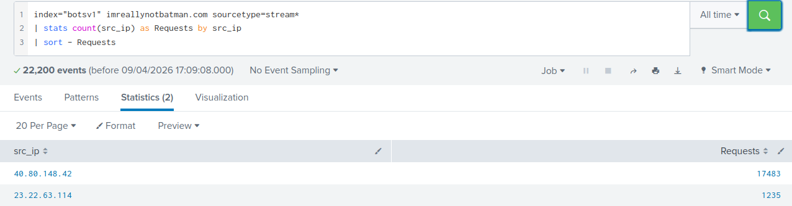

**Findings:** `40.80.148.42` generated 17,483 requests vs. `23.22.63.114` with 1,235. Two actors, two distinct roles — this is **Infrastructure Decoupling**: one IP for loud scanning, a second for targeted exploitation to avoid single-IP rate limiting.

### 3.2 Narrowing it down to the compromised asset

Now we will narrow down the result to show requests sent to our web server, which has the IP 192.168.250.70. The following query will look for all the inbound traffic towards our web server.

**Query:**
```splunk
index=botsv1 sourcetype=stream:http dest_ip="192.168.250.70"
```

The principle here is target isolation. An index like botsv1 might contain logs for the whole company. We only care about the victim. By filtering for the server IP, you remove all the "Inter-office" chatter. It turns a 70,000-event search into a focused investigation on the compromised asset.

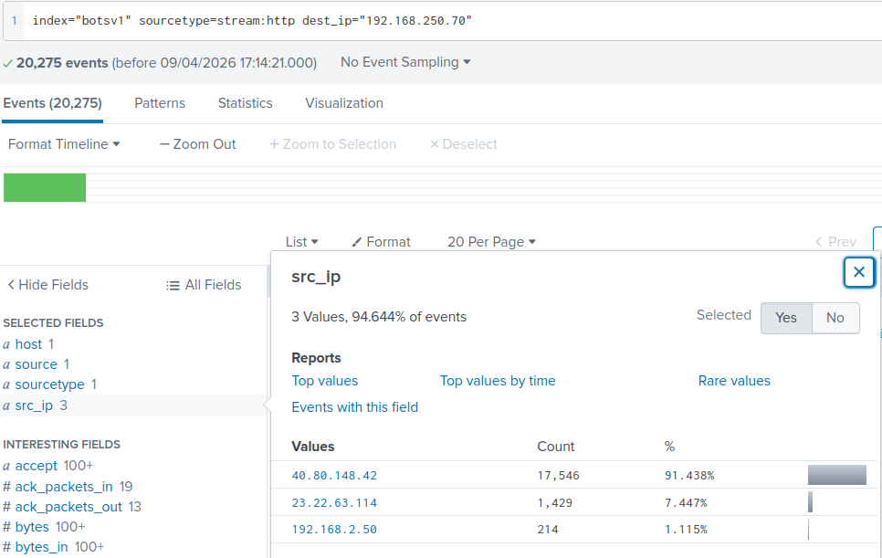

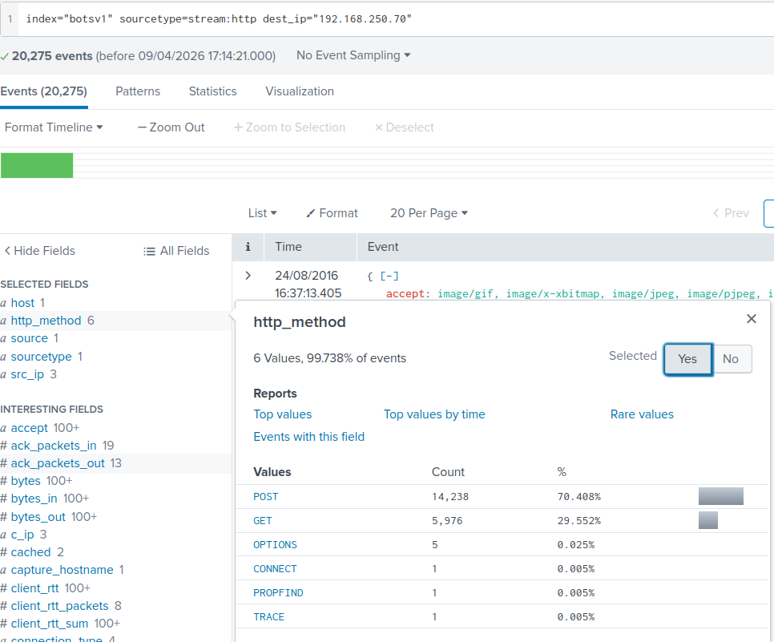

**Findings:**
* The result in the src_ip field shows three IP addresses (1 local IP and two remote IPs) that originated the HTTP traffic towards our webserver.
* Another interesting field, http_method, will give us information about the HTTP Methods observed during these HTTP communications.
* We observed most of the requests coming to our server through the POST request.


### 3.3 Isolating POST Traffic to the Admin Panel

We filtered for POST requests to the server to separate active attack traffic from passive scanning.

**Query:**
```splunk
index=botsv1 sourcetype=stream:http dest_ip="192.168.250.70" http_method=POST
```

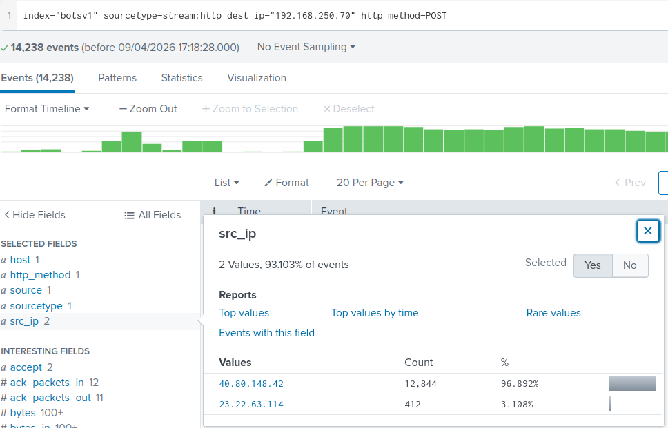

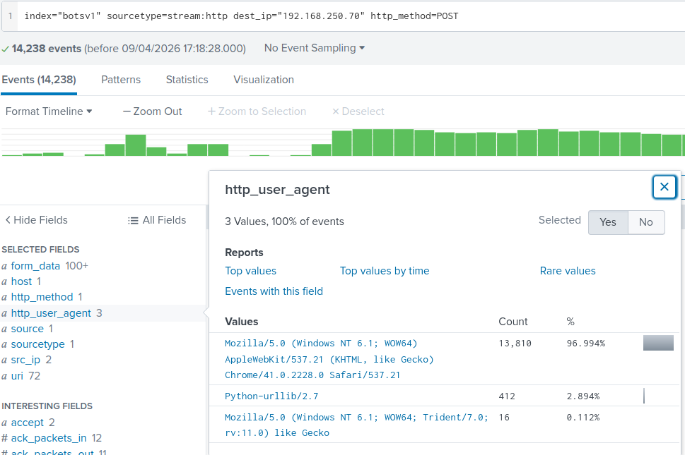

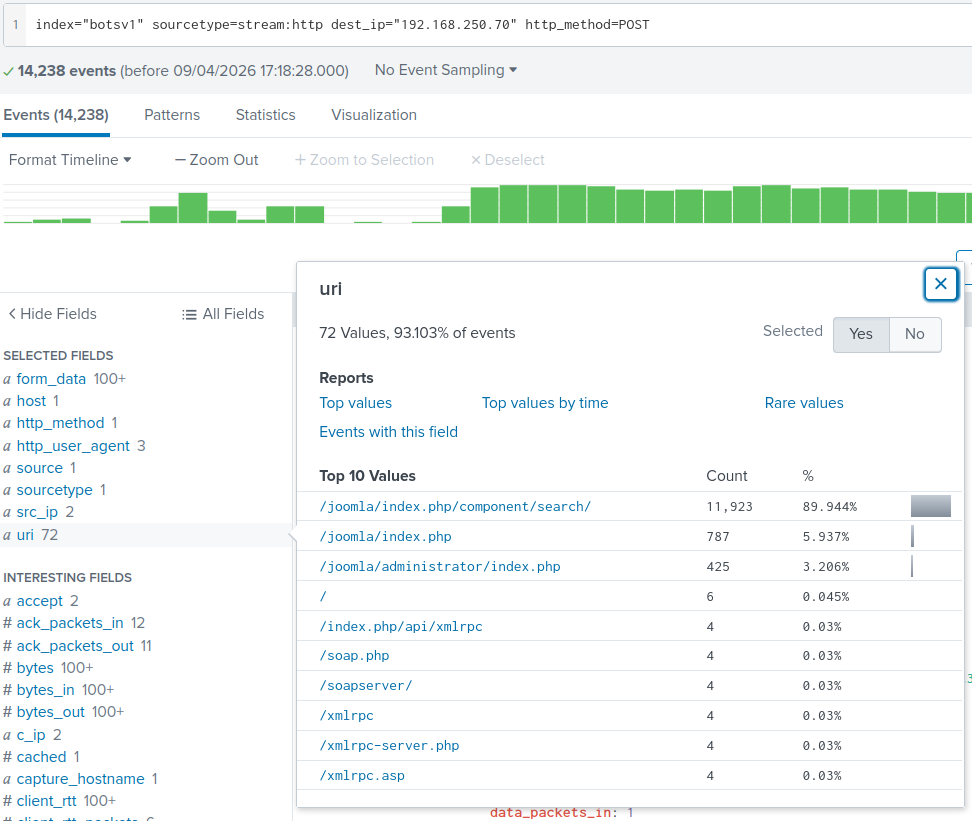

**Findings:**
* `40.80.148.42`: 12,844 POST events — `http_user_agent` is Mozilla/Chrome browser string, targeting `/joomla/index.php/component/search/`. This is the **Acunetix injection payload traffic**.
* `23.22.63.114`: 412 POST events — `http_user_agent` is **`Python-urllib/2.7`**. This is a script. Target URI: `/joomla/administrator/index.php`. This is the **brute force operator**.

The correlation is exact: 412 Python requests targeting the admin login = the brute force campaign. The math connects the infrastructure to the target.

### 3.4 Extracting the Credential Attempts

We drilled into the admin login traffic to expose the actual credentials being submitted.

**Query:**
```splunk
index=botsv1 sourcetype=stream:http dest_ip="192.168.250.70" 
http_method=POST uri="/joomla/administrator/index.php" 
form_data=*username*passwd* 
| table _time uri src_ip dest_ip form_data
```

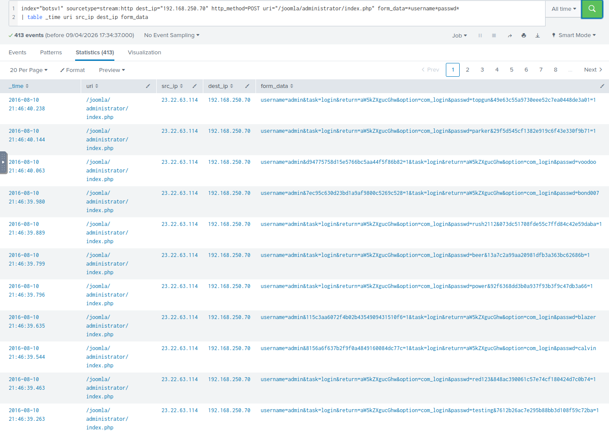

**Finding:** The `form_data` field shows a constant `username=admin` across all 413 events, with a rotating `passwd` value. Single username, dictionary password list — this is a targeted credential stuffing attack against the `admin` account.

### 3.5 Extracting Passwords with Regex

Looking into the logs, we see that these fields are not parsed properly. We will then use Regex in the search to extract only these two fields and their values from the logs and display them. This is data normalisation for triage, we are turning text into metrics.

By adding `| rex field=form_data "passwd=(?<creds>\w+)"` to the query, we will extract the passwd values only. This will pick the form_data field and extract all the values found with the field `creds`.


**Query:**
```splunk
index=botsv1 sourcetype=stream:http dest_ip="192.168.250.70" 
http_method=POST form_data=*username*passwd* 
| rex field=form_data "passwd=(?<creds>\w+)" 
| table _time src_ip uri http_user_agent creds
```

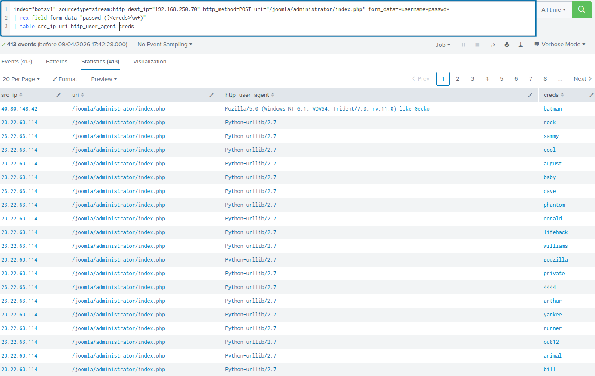

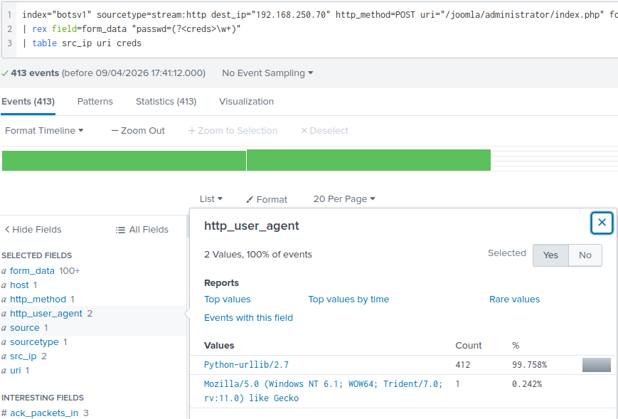

**Findings — The Tactical Shift:**

| src_ip | User-Agent | Password | Significance |
| :--- | :--- | :--- | :--- |
| `23.22.63.114` | `Python-urllib/2.7` | 412 attempts (topgun, parker, voodoo, bond007...) | Automated brute force |
| `40.80.148.42` | Mozilla/IE browser string | `batman` | **Manual login — attacker found the password** |

**Breach Confirmed:** IP `23.22.63.114` ran the Python brute force script and found that `batman` was the correct password. IP `40.80.148.42` then switched to a real browser and submitted `batman` manually — the "hand-off" between the script and the operator.

* **Unique passwords attempted:** 412
* **Correct password:** `batman`
* **Brute force IP:** `23.22.63.114`
* **Login IP:** `40.80.148.42`
* **MITRE:** Brute Force **(T1110.001)** — Password Guessing

---

## 4. Phase 3 — Installation (Malware Upload & Execution)

### 4.1 Hunting for Uploaded Executables

With admin access confirmed, we searched for any file uploads from the attacker's IPs targeting the web server.

**Query:**
```splunk
index=botsv1 sourcetype=stream:http dest_ip="192.168.250.70" *.exe
```

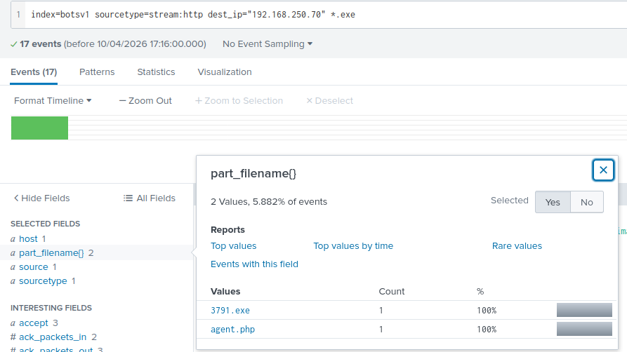

**Finding:** The `part_filename{}` field — present in MIME multipart upload logs — shows two filenames: `3791.exe` and `agent.php`. This field confirms actual file transfer, not merely a URL reference.

### 4.2 Confirming the Upload Source

**Query:**
```splunk
index=botsv1 sourcetype=stream:http dest_ip="192.168.250.70" "part_filename{}"="3791.exe"
```

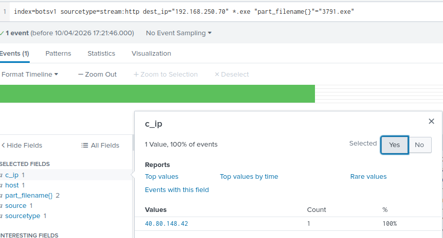

**Finding:** The `c_ip` field (client IP) shows `40.80.148.42` as the sole uploader — 100% of events. The same IP that logged into the admin panel delivered the binary.

### 4.4 Which sourcetype can we dig deep into?

We need to narrow down our search query to show the logs from the host-centric log sources to answer this question. To do so we will use a rather wide query and watch out for the different sourcetypes to see which one we can dig deep into.

**Query:**
```splunk
index=botsv1 "3791.exe"
```

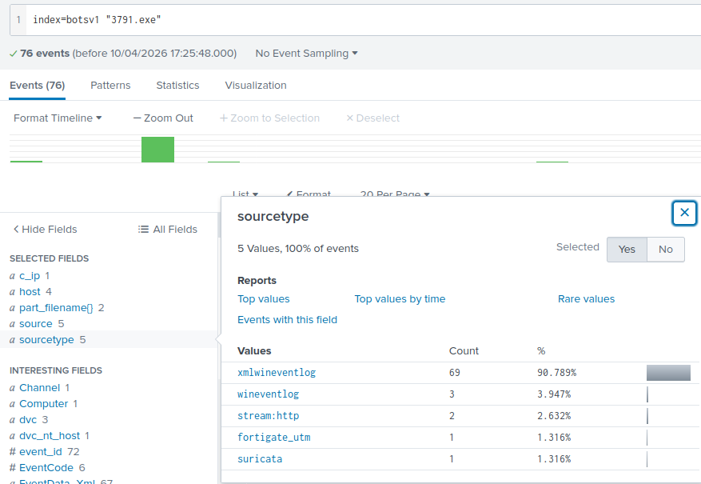

**Findings:** We can clearly use `XmlWinEventLog` (Sysmon) as a sourcetype, since  more than 90% of the logs regarding the executable come from it. Sysmon's `EventCode=1` is specifically leveraged to find evidence of program execution.


### 4.4 Confirming Execution via Sysmon (Host Pivot)

Network logs prove the file arrived. To prove it ran, we pivot from `stream:http` to `XmlWinEventLog` (Sysmon) and look for **Event ID 1 — Process Creation**.

**Query:**
```splunk
index=botsv1 "3791.exe" sourcetype="XmlWinEventLog" EventCode=1
```

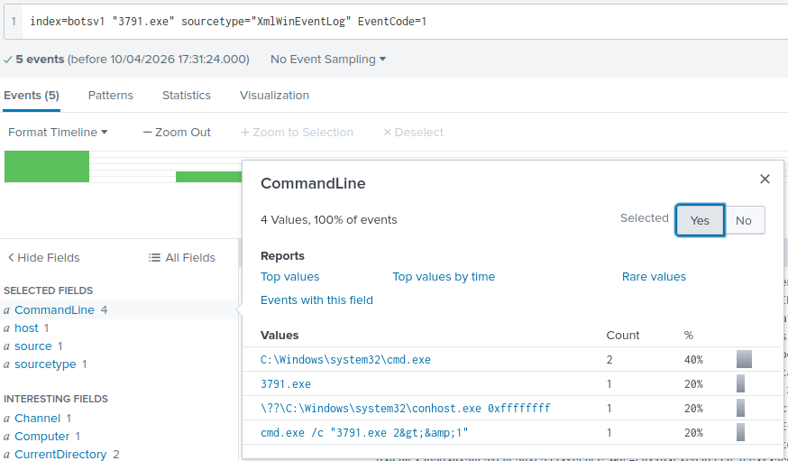

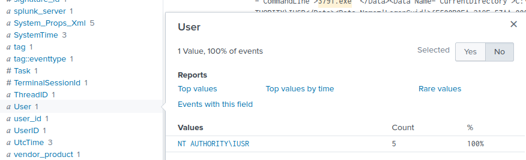

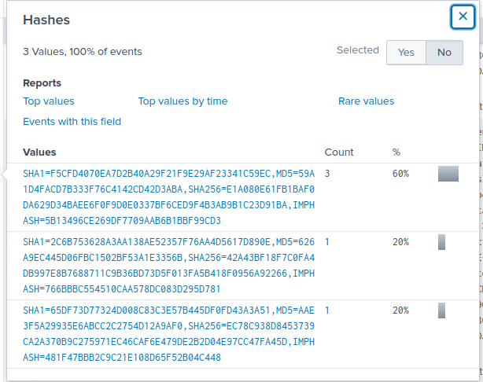

**Findings from the Sysmon log:**
* **`CommandLine`:** `cmd.exe /c "3791.exe >& amp;1"` — the file was launched via `cmd.exe`, meaning the attacker triggered shell execution through their Joomla admin access.
* **`User`:** `NT AUTHORITY\IUSR` — the default IIS Web Server account. The web server process itself executed the binary, confirming the Joomla admin panel was the execution vector.
* **`MD5 Hash`:** `AAE3F5A29935E6ABCC2C2754D12A9AF0`
* **`CurrentDirectory`:** `C:\inetpub\wwwroot\joomla\` — the file was staged in the web root.

### 4.5 Threat Intel — VirusTotal Hash Lookup

Sysmon also collects the Hash value of the processes being created, the MD5 HASH of the program 3791.exe is `AAE3F5A29935E6ABCC2C2754D12A9AF0`.

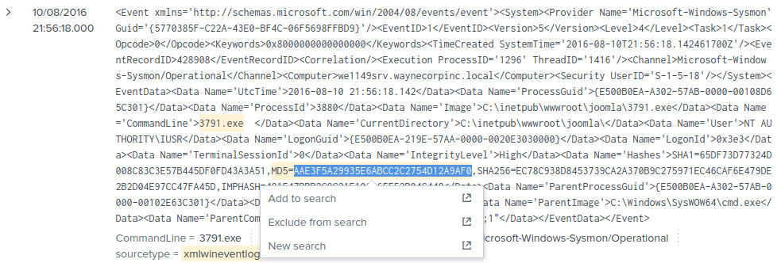

Now we go to VirusTotal and we cross-reference it.

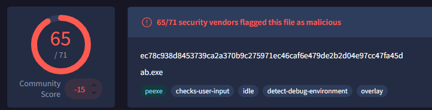

**Finding:** 65/71 security vendors flagged this file as malicious. The alternate filename associated with this hash is **`ab.exe`** — commonly attributed to the **Poison Ivy / Fynloski Remote Access Trojan (RAT)** family. The random numeric name `3791.exe` was a deliberate masquerade to blend into temp file noise.

**Installation Summary:**
* **File uploaded:** `3791.exe` (also `agent.php`)
* **Upload source:** `40.80.148.42`
* **Upload path:** `C:\inetpub\wwwroot\joomla\`
* **Execution confirmed:** Sysmon EventCode=1, via `cmd.exe`
* **Execution context:** `NT AUTHORITY\IUSR` (IIS Web Server account)
* **Malware family:** Poison Ivy / Fynloski RAT (`ab.exe`)
* **VirusTotal detections:** 65/71
* **MITRE:** Server Software Component **(T1505)**, Masquerading **(T1036)**

---

## 5. Phase 4 — Actions on Objectives (Website Defacement)

### 5.1 Investigating Outbound Traffic from the Web Server

A web server should receive traffic, not originate it. We checked Suricata for outbound connections initiated by the server itself.

**Query:**
```splunk
index=botsv1 src=192.168.250.70 sourcetype=suricata
```

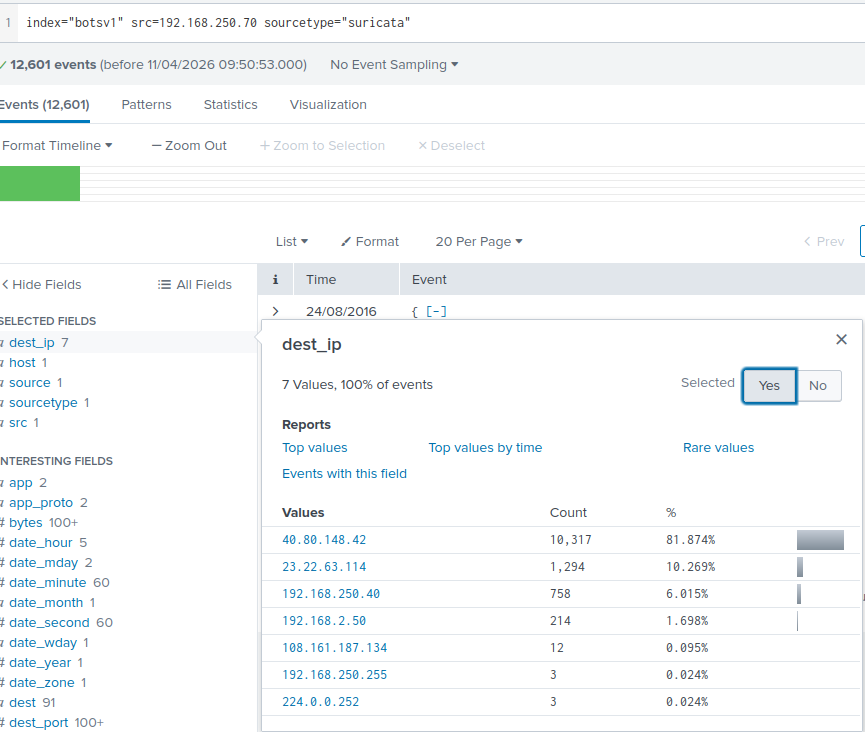

**Critical Finding:** The server `192.168.250.70` appears as the **source** of 12,601 events — communicating outbound to external IPs. The `dest_ip` breakdown shows heavy traffic to `40.80.148.42` (10,317 events, 81.8%) and `23.22.63.114` (1,294 events, 10.3%). A server initiating thousands of outbound connections to known attacker IPs is a confirmed indicator of compromise — the machine is no longer serving pages, it is **calling home**.

### 5.2 Pivoting to the Defacement Payload

We pivoted to `dest_ip=23.22.63.114` to investigate the nature of the server's outbound communication to the second attacker IP.

**Query:**
```splunk
index=botsv1 src=192.168.250.70 sourcetype=suricata dest_ip=23.22.63.114
```

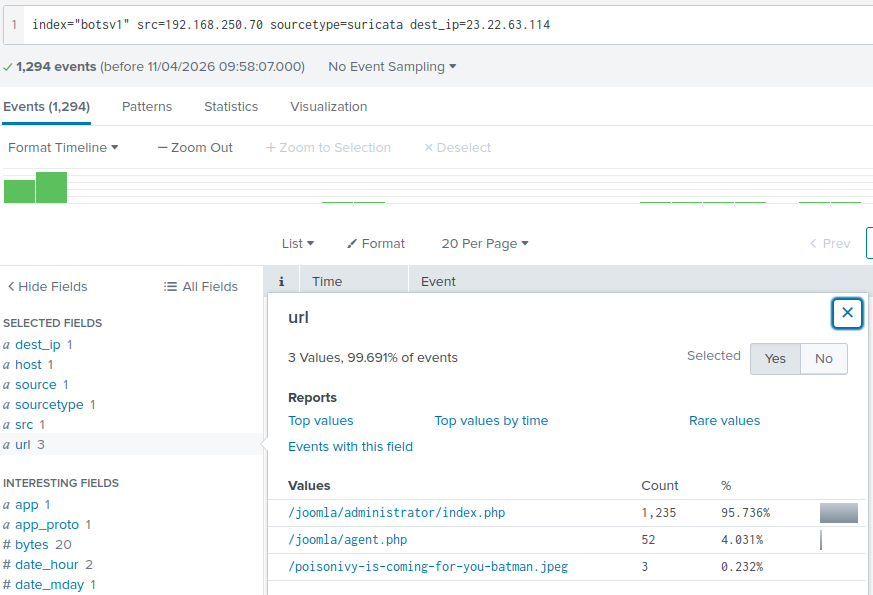

**Finding:** The `url` field shows 3 values: `/joomla/administrator/index.php` (1,235 hits), `/joomla/agent.php` (52 hits), and — critically — `/poisonivy-is-coming-for-you-batman.jpeg` (3 hits). A legitimate web developer does not name image files after their attack group. This is the defacement payload.

### 5.3 Tracing the Defacement Image Origin

**Query:**
```splunk
index=botsv1 url="/poisonivy-is-coming-for-you-batman.jpeg" dest_ip="192.168.250.70" 
| table _time src dest_ip http.hostname url
```

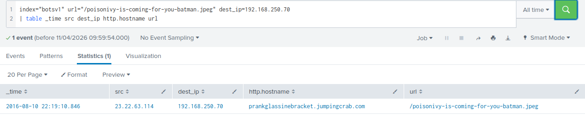

**Finding:** The table output reveals the full picture. The server `192.168.250.70` fetched the defacement image via a `GET` request from `prankglassinebracket.jumpingcrab[.]com` (hosted at `23.22.63.114`). The server was commanded — through the installed RAT — to pull the attacker's image and place it on the web root.

### 5.4 Firewall Confirmation

**Query:**
```splunk
index=botsv1 sourcetype=fortigate_utm "poisonivy-is-coming-for-you-batman.jpeg"
```

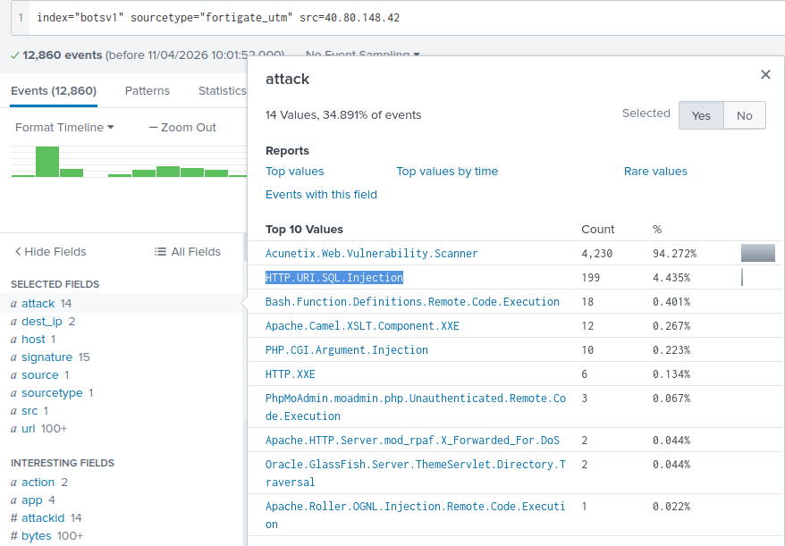

**Finding:** The Fortinet firewall logged the outbound request with `action=passthrough` and `catdesc="Malicious Websites"` — the firewall **detected** the category as malicious but was configured in **monitor mode**, not block mode. The connection was allowed through. This is a critical post-incident finding for the remediation phase.

**Defacement Summary:**
* **Defacement file:** `poisonivy-is-coming-for-you-batman.jpeg`
* **Delivered from:** `prankglassinebracket.jumpingcrab[.]com` → `23.22.63.114`
* **Mechanism:** Server-side GET request (RAT commanded the server to fetch its own defacement)
* **Firewall posture:** Monitor mode — traffic detected but not blocked
* **MITRE:** Defacement **(T1491.001)**, Data Manipulation **(T1565)**

---

## 6. Phase 5 — Command & Control (C2)

### 6.1 Identifying the C2 Domain

The defacement investigation already surfaced the C2 hostname. We confirmed it via Fortinet firewall logs and corroborated using `stream:http`.

**Query:**
```splunk
index=botsv1 sourcetype=fortigate_utm "poisonivy-is-coming-for-you-batman.jpeg"
```

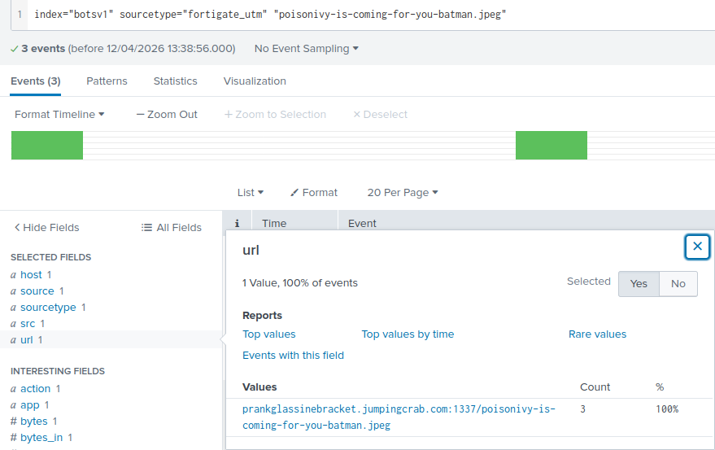

**Finding:** The `url` field in the Fortinet logs shows the full FQDN: `prankglassinebracket.jumpingcrab.com:1337`. Port 1337 is non-standard and commonly used by RAT C2 infrastructure.

**Corroborating via stream:http:**

**Query:**
```splunk
index=botsv1 sourcetype=stream:http dest_ip=23.22.63.114 
"poisonivy-is-coming-for-you-batman.jpeg" src_ip=192.168.250.70
```

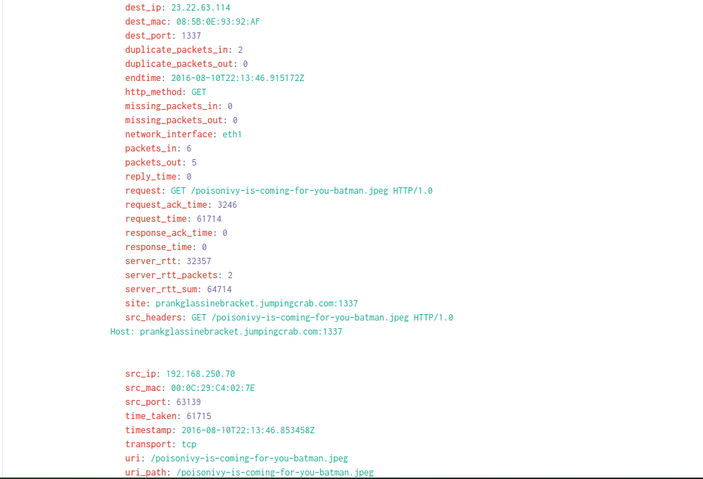

**Finding:** The `stream:http` log confirms the full conversation: `src_ip=192.168.250.70` (victim server) issued a `GET` request to `site=prankglassinebracket.jumpingcrab[.]com:1337` for `/poisonivy-is-coming-for-you-batman.jpeg`. This is the **Reverse Connection** — the compromised server calling out to the attacker's C2 to retrieve the defacement asset.

**Also noted:** The `fortigate_utm` log for `40.80.148.42` shows the triggered firewall rule `HTTP.URI.SQL.Injection` — confirming the firewall saw the SQL injection attempts from the scanner but again, did not block them.

**C2 Summary:**
* **C2 FQDN:** `prankglassinebracket.jumpingcrab[.]com`
* **C2 IP:** `23.22.63.114`
* **C2 Port:** `1337`
* **Protocol:** HTTP (GET-based payload retrieval)
* **DNS Provider:** Dynamic DNS via `jumpingcrab.com` (No-IP style — easily rotatable)
* **MITRE:** Application Layer Protocol **(T1071.001)**, Dynamic Resolution **(T1568)**

---

## 7. Phase 6 — Weaponization (OSINT Attribution)

### 7.1 C2 Domain Intelligence (Robtex)

With the C2 domain `prankglassinebracket.jumpingcrab.com` confirmed, we pivoted to Robtex to enumerate the attacker's broader infrastructure.

**Platform:** `robtex.com` — DNS lookup on `prankglassinebracket.jumpingcrab.com`

**Findings:**
* **IP Numbers associated:** `69.197.18.183`, `70.39.97.227`, `169.47.130.85`
* **Name Servers:** `ns1-4.afraid.org` — FreeDNS, a known Dynamic DNS provider used by threat actors for free, disposable infrastructure.
* **Sibling subdomains:** Multiple `*.jumpingcrab.com` subdomains sharing the same infrastructure (adjazd, bffbff, mclpcb, piranhabrothers, etc.) — indicating a pre-staged, multi-subdomain C2 framework.

### 7.2 Attacker IP Intelligence (Robtex — `23.22.63.114`)

**Platform:** `robtex.com` — IP lookup on `23.22.63.114`

**Critical Finding:** This IP resolves to an Amazon EC2 instance (`ec2-23-22-63-114.compute-1.amazonaws.com`). More importantly, the **Shared** section reveals 8 hostnames pointing to this IP that are **typosquats of Wayne Enterprises' domain:**

`wanecorpinc.com`, `wayncorpinc.com`, `waynecorinc.com`, `waynecorpnc.com`, `waynecrpinc.com`, `wayneorpinc.com`, `wynecorpinc.com`

These domains were pre-registered before the attack — a deliberate preparation to target Wayne Enterprises specifically via phishing or credential harvesting **(MITRE T1583.001 — Acquire Infrastructure: Domains)**.

### 7.3 Attacker Group Attribution (VirusTotal + Whois)

**Platform:** `virustotal.com` — Relations tab for IP `23.22.63.114`


**Finding:** The Relations tab surfaces the domain `www.po1s0n1vy.com` associated with this IP. This is the attacker's group domain — **P01s0n1vy APT**.

**Platform:** `whois.domaintools.com` — Whois lookup for `po1s0n1vy.com`

**Findings:**
* **Registrar:** GoDaddy.com, LLC
* **Registrant Org:** Domains By Proxy, LLC (privacy-protected)
* **Tech Contact Email:** `po1s0n1vy.com@domainsbyproxy.com`
* **IP Address:** `34.102.136.180` (Google Cloud)

**VirusTotal — `www.po1s0n1vy.com` Relations:**

Additional sibling domains found: `smtp.po1s0n1vy.com`, `ftp.po1s0n1vy.com`, `lilian.po1s0n1vy.com`, and crucially `prankglassinebracket.jumpingcrab.po1s0n1vy.com` — directly tying the C2 domain to the P01s0n1vy infrastructure.

**Associated email (via AlienVault OTX):** `lillian.rose@po1s0n1vy.com`

**Weaponization Summary:**
* **Threat Actor:** P01s0n1vy APT Group
* **C2 Infrastructure:** Amazon EC2 (`23.22.63.114`) with Dynamic DNS overlay
* **Pre-staged Typosquat Domains:** 7 Wayne Enterprises lookalike domains registered prior to attack
* **APT Email IOC:** `lillian.rose@po1s0n1vy.com`
* **MITRE:** Acquire Infrastructure **(T1583)**, Stage Capabilities **(T1608)**

---

## 8. Phase 7 — Delivery (Secondary Attack Vector)

### 8.1 Malware Discovery via ThreatMiner

The threat intel report indicated P01s0n1vy maintains a secondary attack vector. We searched for malware associated with the attacker's IP on ThreatMiner.

**Platform:** `threatminer.org` — Host lookup for `23.22.63.114`

**Finding:** Three file hashes are associated with this IP. One hash stands out with multiple AV detections: `c99131e0169171935c5ac32615ed6261`. Vendor labels include `Trojan.GenericKD.3470547`, `Trojan/Backdoor.Win32.Redsip`, `W32/Korplug.HP`, and `Backdoor.Redsip.f`.

### 8.2 Malware Metadata (VirusTotal + Hybrid-Analysis)

**Platform:** `virustotal.com` — Hash search for `c99131e0169171935c5ac32615ed6261`

**Finding:** The file metadata reveals the original filename: **`MirandaTateScreensaver.scr.exe`** — a `.scr` (screensaver) binary, a classic social engineering delivery disguise. **48/68 vendors** flag it as malicious.

**Platform:** `hybrid-analysis.com` — Full behavioral analysis

**Findings:**
* **File:** `MirandaTateScreensaver.scr.exe` (483 KB, PE32 executable, WINDOWS)
* **Compiler:** VCB → Microsoft Corporation
* **Threat Score:** 100/100 — Malicious
* **AV Detection Rate:** 72%
* **Network Behavior:** Contacts 1 host — `23.22.63.114` (confirmed C2 callback)
* **MITRE ATT&CK Mappings:** 7 techniques across 6 tactics detected by Hybrid-Analysis sandbox

**Delivery Summary:**
* **Secondary Payload:** `MirandaTateScreensaver.scr.exe`
* **MD5:** `c99131e0169171935c5ac32615ed6261`
* **Disguise:** Screensaver binary — social engineering delivery vector (likely spear-phishing)
* **C2 Callback:** Confirmed contact with `23.22.63.114` on execution
* **MITRE:** Phishing **(T1566)**, User Execution **(T1204.002)**, Masquerading **(T1036.004)**

---

## 9. Unified Attack Timeline

| Timestamp | Phase | Event |
| :--- | :--- | :--- |
| **Pre-attack** | Weaponization | P01s0n1vy registers 7 Wayne Enterprises typosquat domains on `23.22.63.114`. C2 infrastructure at `prankglassinebracket.jumpingcrab.com:1337` is pre-staged. |
| **~Aug 10, 2016** | Reconnaissance | `40.80.148.42` launches Acunetix vulnerability scan against `imreallynotbatman.com`. Suricata logs CVE-2014-6271 (Shellshock), SQLi, XSS, and XXE probes. Joomla CMS identified. Admin portal at `/joomla/administrator/index.php` located. |
| **Aug 10 — 21:45** | Exploitation | `23.22.63.114` begins automated brute force via Python-urllib/2.7 script against `admin` account. 412 unique passwords attempted. |
| **Aug 10 — 21:46** | Exploitation | Password `batman` discovered. `40.80.148.42` switches to Mozilla browser and manually authenticates to Joomla admin panel. Access granted. |
| **Aug 10 — ~21:56** | Installation | `40.80.148.42` uploads `3791.exe` (Poison Ivy RAT / `ab.exe`) and `agent.php` to `C:\inetpub\wwwroot\joomla\` via authenticated Joomla admin session. |
| **Aug 10 — 21:56:18** | Installation | Sysmon EventCode=1: `cmd.exe /c "3791.exe"` executed under `NT AUTHORITY\IUSR`. RAT is live on the server. |
| **Aug 10 — ~22:13** | C2 | Compromised server (`192.168.250.70`) initiates outbound beacon to `prankglassinebracket.jumpingcrab.com:1337`. Server issues `GET /poisonivy-is-coming-for-you-batman.jpeg`. |
| **Aug 10 — 22:13:46** | Actions on Objectives | Defacement image retrieved from C2 (`23.22.63.114`) and deployed to web root. `imreallynotbatman.com` is defaced. Fortigate detects the outbound request as "Malicious Website" but allows it through (monitor mode). |

---

## 10. Conclusion & Final Analyst Actions

This incident is a **True Positive** and a **confirmed APT intrusion**. The P01s0n1vy threat group conducted a methodical, multi-phase attack against Wayne Enterprises' web server — moving from automated reconnaissance through credential compromise, malware installation, C2 establishment, and culminating in website defacement. The attack was pre-meditated: infrastructure, typosquat domains, and C2 servers were staged before the first scan hit the target.

**Immediate Containment:**
1. Isolate `192.168.250.70` from the network immediately — the server is actively beaconing to `23.22.63.114`.
2. Block all traffic to/from `40.80.148.42`, `23.22.63.114`, and `prankglassinebracket.jumpingcrab.com` at the perimeter firewall and DNS level.
3. Remove `3791.exe`, `agent.php`, and the defacement JPEG from `C:\inetpub\wwwroot\joomla\`.
4. Reset the Joomla `admin` account credentials and revoke all active sessions.
5. Conduct a full memory dump of `192.168.250.70` before wiping — the RAT may have established additional persistence mechanisms not visible in web logs.

**Hardening & Remediation:**
1. Change Fortinet firewall UTM policy for "Malicious Websites" category from **Monitor** to **Block**. This single change would have prevented the defacement image from being retrieved.
2. Enforce account lockout policy on the Joomla admin portal after N failed login attempts. 412 attempts from a single IP should have triggered an automatic block.
3. Restrict `/joomla/administrator/` access by IP allowlist — admin panels should never be publicly accessible.
4. Implement file integrity monitoring on `C:\inetpub\wwwroot\` — any new `.exe` or `.php` file written to the web root should trigger an immediate alert.
5. Block outbound connections from the web server process (`w3wp.exe` / `IIS AppPool`) at the host firewall level. A web server has no legitimate reason to initiate outbound HTTP connections.

**IOC Summary for Threat Hunting:**

| IOC Type | Value |
| :--- | :--- |
| IP | `40.80.148.42` |
| IP | `23.22.63.114` |
| Domain | `prankglassinebracket.jumpingcrab[.]com` |
| Domain | `www.po1s0n1vy[.]com` |
| Email | `lillian.rose@po1s0n1vy[.]com` |
| MD5 | `AAE3F5A29935E6ABCC2C2754D12A9AF0` (`3791.exe` / `ab.exe`) |
| MD5 | `c99131e0169171935c5ac32615ed6261` (`MirandaTateScreensaver.scr.exe`) |
| Filename | `3791.exe`, `agent.php`, `poisonivy-is-coming-for-you-batman.jpeg` |
| User-Agent | `Mozilla/5.0 (Hydra)`, `Python-urllib/2.7` |

---

## 11. Analyst Notes & Lessons Learned

* **Evidence-Led vs. Alert-Led Investigation:** This case was initiated by the damage (defaced website), not a SIEM alert. Working backwards from the objective to the origin is a core forensic skill — the Kill Chain is a reconstruction tool, not a navigation tool. Starting from the impact and pulling the thread backwards is often faster and more reliable than trying to catch attackers in real time.
* **Infrastructure Decoupling as a TTPs Indicator:** The attacker deliberately used two separate IPs — one for noisy scanning, one for targeted exploitation. Volume-based alerting on a single IP would have missed the credential attack entirely. Correlating across IPs by behavior (same target, same timeframe, complementary roles) is essential.
* **Firewall in Monitor Mode = No Firewall:** The Fortinet UTM correctly categorized the C2 outbound connection as "Malicious Website" and logged it. It then let it through. A SIEM detection without an enforcement mechanism only generates paperwork. Every "monitor" rule on a production web-facing asset should be reviewed for promotion to "block."
* **The Value of Sysmon for Web Server Coverage:** Without `XmlWinEventLog` (Sysmon EventCode=1), we could prove the file arrived but not that it ran. The `NT AUTHORITY\IUSR` execution context was the forensic bridge between the network-level upload and the host-level compromise. Sysmon coverage on IIS worker accounts is non-negotiable.
* **OSINT as a Force Multiplier:** The pivot from C2 domain → Robtex → typosquat domains → VirusTotal → `po1s0n1vy.com` → Whois → email address took less than 10 minutes and yielded actor attribution, pre-staged infrastructure discovery, and a secondary payload identification. Public threat intel platforms are a first-tier resource, not a last resort.
