# Incident Report: Web Shell Upload & Remote Code Execution

* **Date:** 07-04-2026
* **Investigator:** Gerard Diaz Gibert
* **Environment:** TryHackMe - Alert Triage With Splunk - Virtual Lab
* **Scenario:** Web Shell Exploitation & RCE on WordPress Server

---

## Alert Scenario & Initial Context
The investigation was triggered by a high-severity alert on the MSSP platform.

* **Alert Name:** Potential Web Shell Upload Detected
* **Time:** 14/09/2025 09:31:51 AM
* **Resource:** `http://web.trywinme.thm`
* **Suspicious IP:** `171.251.232.40`

**Initial Analyst Observation:** The alert targets an externally accessible web server hosting the organization's WordPress site. The suspicious IP is external, suggesting a direct internet-facing attack. The nature of the alert — a web shell upload — implies the attacker may have already progressed beyond initial access and achieved a foothold on the server, making this a high-priority triage.

---

## Initial Triage: Threat Intelligence Validation

Before touching the SIEM, the first step was to validate the suspicious IP against external Threat Intelligence platforms.

**Platform Used:** AbuseIPDB — `171.251.232.40`

**Findings:**
* **Abuse Confidence Score:** 100%
* **Total Reports:** 12,500+
* **Origin Country:** Vietnam
* **Classification:** Known malicious source, associated with automated attack campaigns.

**Verdict:** High-confidence malicious source. This is not a false positive from a misconfigured scanner or a legitimate pen test. Proceed with full investigation posture.

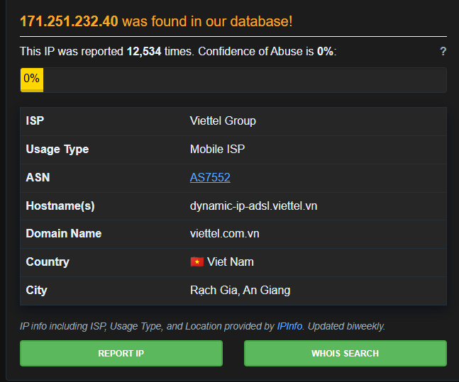

---

## Phase 1: Identifying the Entry Vector (Brute Force)

With a confirmed malicious IP, the next step was to examine the raw traffic in the SIEM to understand the attack's initial approach.

**Query:**
```splunk
index=web-alert 171.251.232.40
| table _time clientip useragent uri_path method status
| sort + _time
```

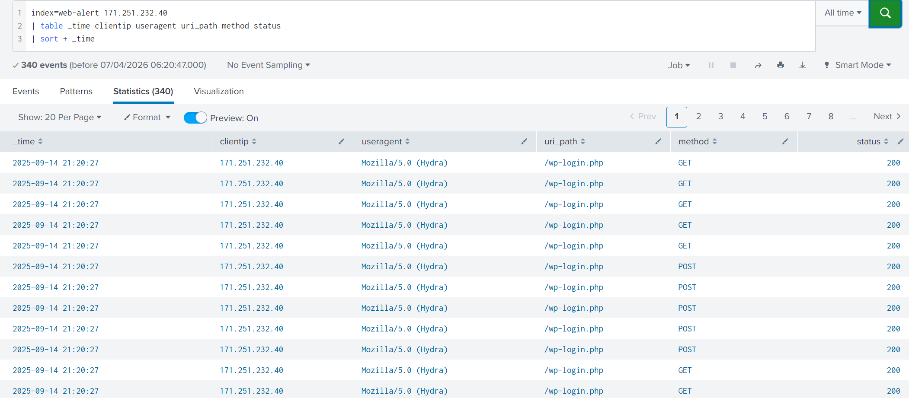

**Findings:**
* **The Tool:** A massive spike of requests with `useragent="Mozilla/5.0 (Hydra)"` is immediately visible.
* **The Target:** All requests are directed at `wp-login.php`.
* **Status Codes:** All returning `200 OK`.

**Interpretation:** Hydra is a well-known, specialized brute-force credential attack tool **(MITRE T1110.001)**. Its presence in the User-Agent field is a clear indicator of an automated attack. The blanket `200 OK` responses do not mean success — in WordPress, a failed login reloads the same page with a `200`, while a successful one triggers a `302 Redirect`. Our primary alert is about a web shell, so we pivot past this noise to find what came next.

---

## Phase 2: Detecting the Web Shell (`b374k.php`)

To see past the Hydra noise and find behavioral shifts, we excluded the Hydra User-Agent entirely.

**Query:**
```splunk
index=web-alert 171.251.232.40 useragent!="Mozilla/5.0 (Hydra)"
| table _time clientip useragent uri_path referer referer_domain method status
```

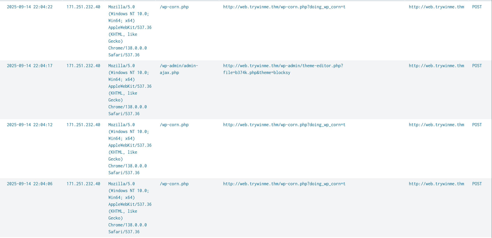

**Findings:**
* A `POST` request appears for `admin-ajax.php`, which will become relevant later on the deep-dive.
* The `referer` field points to `theme-editor.php?file=b374k.php`.

**Interpretation:** The `referer` field is the most critical artifact here. The WordPress Theme Editor should only reference legitimate theme files. The presence of `file=b374k.php` in the referer strongly suggests the attacker uploaded or injected a web shell and is now interacting with it. We drill down further.

**Query:**
```splunk
index=web-alert 171.251.232.40 b374k.php
| table _time clientip useragent uri_path referer referer_domain method status
| sort + _time
```

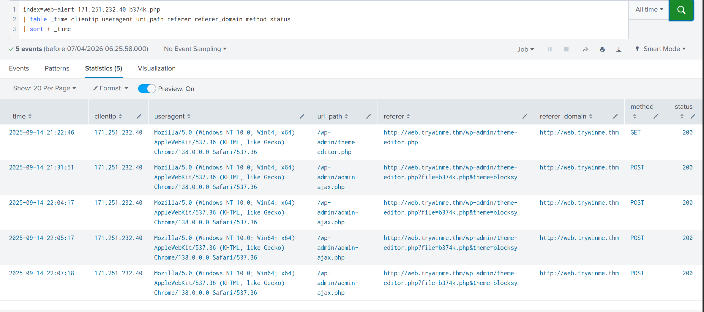

**Findings:**
* Four successful `POST` requests directly to the web shell are confirmed.
* The attacker is no longer passively browsing — they are executing commands.

**What is b374k?:** Cross-referencing the filename against open-source intelligence confirms that `b374k` is a notorious PHP Web Shell. It provides attackers with a web-based interface to execute arbitrary system commands, browse the filesystem, and manage databases. Sometimes attackers deploy popular shells without even changing the default filename — a useful forensic indicator.

---

## Transitional Phase: SOC Operational Response

At this point in the investigation, the activity is classified as a **True Positive (TP)**.

**L1 Conclusion:** A known malicious external IP (`171.251.232.40`, Vietnam, 100% AbuseIPDB score) executed a brute-force attack against `wp-login.php` using Hydra, followed by confirmed web shell activity involving `b374k.php`. Four successful POST requests to the shell confirm active **Remote Code Execution (RCE) (MITRE T1505.003)**.

**Recommended L1 Actions:**
1. Immediately isolate the web server `web.trywinme.thm`.
2. Block `171.251.232.40` at the firewall and WAF level.
3. Escalate to SOC L2 and Incident Response for containment, forensic imaging, and full infection chain reconstruction.

> **Note:** In a professional MSSP environment, the L1 analyst's responsibility ends here. The following phases represent the Deep Dive investigation that would typically be handled by an L2 Analyst or Forensic Investigator. I have continued the investigation to fully reconstruct the attack chain and demonstrate technical proficiency.

---

## Phase 3: Was the Brute Force Successful?

The central L2 question: Did Hydra actually crack the credentials, or did the attacker find another way in? The key is to look for the transition from automated noise to authenticated human behavior.

### Step 1 — Establishing the Baseline (The "Noise")

**Query:**
```splunk
index=web-alert 171.251.232.40 uri_path="/wp-login.php"
| table _time, clientip, useragent, method, status
| sort + _time
```

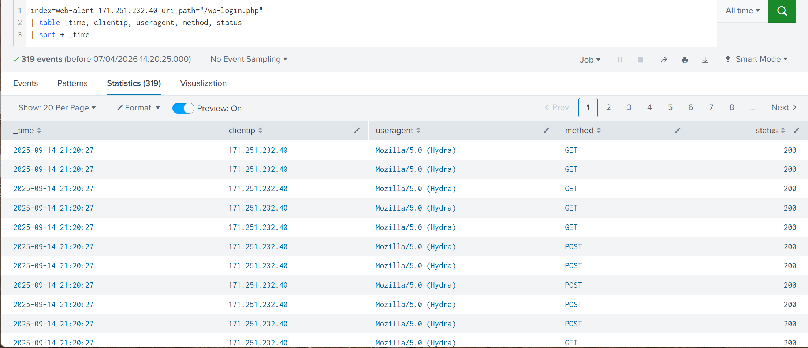

**Observation:** Hundreds of `POST` requests to `/wp-login.php` with `useragent="Mozilla/5.0 (Hydra)"`, all returning `200 OK`. As established above, `200` on a WordPress login page means a failed guess. A real success produces a `302 Redirect`.

**Forensic Note — "Signal vs. Noise":** This is a classic SOC challenge. Over 300 failed attempts generate enormous log volume. The investigator's value is the ability to discard this noise and find the single successful event buried within it.

### Step 2 — Hunting for the Transition

We now look for the moment Hydra stopped and a human browser appeared.

**Query:**
```splunk
index=web-alert 171.251.232.40 useragent!="Mozilla/5.0 (Hydra)"
| table _time, clientip, useragent, uri_path, method, status
| sort + _time
```

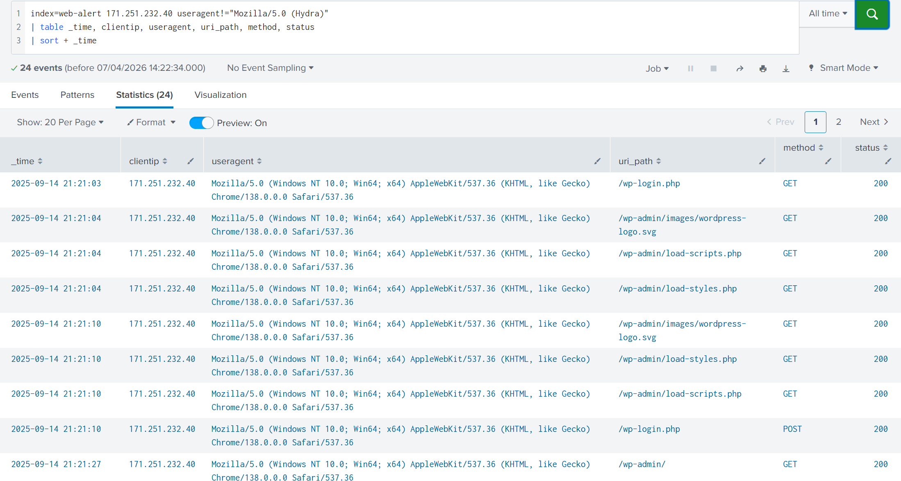

**Confirmed. The brute force was successful at `21:21:03`.**

The three-signal confirmation:

| Signal | Observation | Forensic Meaning |
| :--- | :--- | :--- |
| **Tool Disappeared** | `Mozilla/5.0 (Hydra)` vanishes | Attacker stopped the automated tool — password found |
| **Human Appeared** | Standard Chrome UA string at `21:21:03` | Attacker switched to manual browser to log in |
| **Proof of Access** | `GET` requests to `/wp-admin/images/` and `/wp-admin/load-scripts.php` at `21:21:04` | Files inside `/wp-admin/` are session-protected. A `200 OK` response proves a valid authentication cookie was accepted by the server **(MITRE T1078)** |

---

## Phase 4: The Upload Method — How Did `b374k.php` Get There?

With confirmed admin access established at `21:21:03`, the next question is how the attacker uploaded the shell. The earlier `referer` pointing to `theme-editor.php` is our lead.

### Step 1 — Mapping the Theme Editor Activity

**Query:**
```splunk
index=web-alert 171.251.232.40 uri_path="*theme-editor.php*"
| table _time, clientip, uri_path, method, status, referer
| sort + _time
```

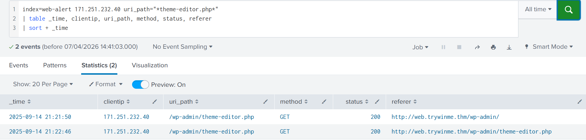

**Findings:**
* **`21:21:50` — Reconnaissance:** First `GET` to `/wp-admin/theme-editor.php`. Referer is `/wp-admin/`. The attacker is opening the editor to browse editable theme files.
* **`21:22:46` — Preparation:** A second `GET` to the editor. The **56-second gap** between visits is significant — this is the attacker copying their `b374k` shell code from their local machine and preparing to paste it into the editor window.

### Step 2 — Looking for the "Save" Action (POST to `theme-editor.php`)

In WordPress, clicking "Update File" in the Theme Editor sends a `POST` request containing the new file contents. This is how the shell code would be written to disk.

**Query:**
```splunk
index=web-alert 171.251.232.40 uri_path="*theme-editor.php*" method="POST"
| table _time, clientip, uri_path, method, status, referer
```

**Result:** No results returned.

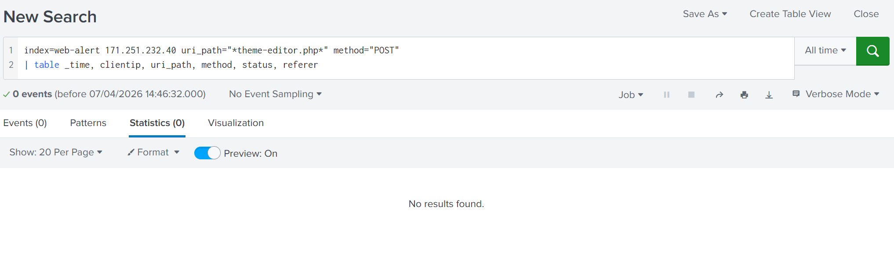

**Interpretation:** The attacker did not use the standard "Update File" button. The injection was routed through a different mechanism. This is a deliberate evasion technique — direct `POST` requests to `theme-editor.php` can be logged and detected by WAFs. We pivot to `admin-ajax.php`, since we saw it before in a `POST` log.

### Step 3 — The Hidden Injection (WordPress AJAX Handler)

Modern WordPress themes use AJAX to save content in the background without a full page reload. To a SOC analyst, this makes the "Save" action appear to vanish — it's actually routed through `admin-ajax.php`, a catch-all AJAX handler used by virtually every plugin and theme. This makes it a high-noise, low-suspicion endpoint — a perfect hiding spot for malicious writes.

**Query:**
```splunk
index=web-alert 171.251.232.40 uri_path="*admin-ajax.php*" method="POST"
| table _time, clientip, uri_path, method, status, referer
| sort + _time
```

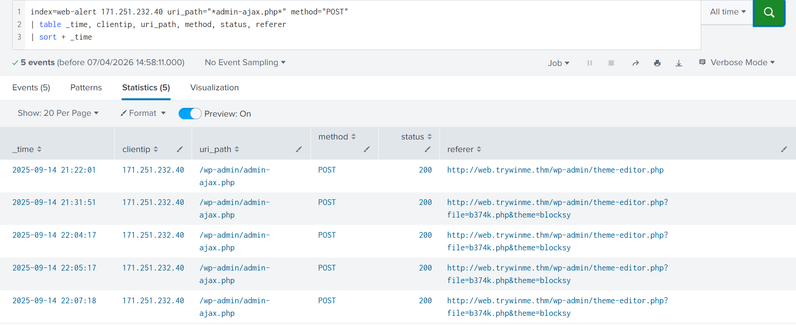

### Step 4 — Confirming the Shell's "Birth"

**Query:**
```splunk
index=web-alert "b374k.php"
| table _time, clientip, uri_path, method, status, referer
| sort + _time
```

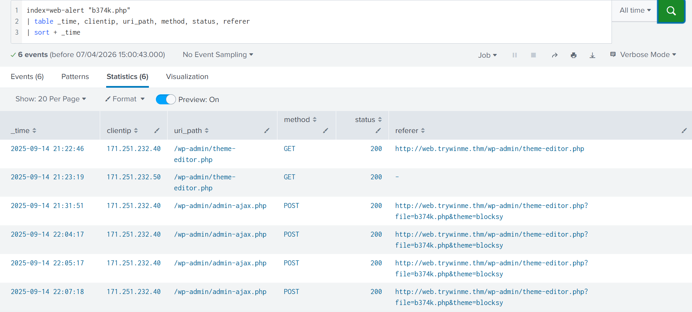

### Combined Analysis of Steps 3 & 4

| Timestamp | Event | Forensic Significance |
| :--- | :--- | :--- |
| **`21:22:01`** | `POST` to `admin-ajax.php` (referer: `theme-editor.php`) | The hidden "Save" button. Shell code written to the Blocksy theme directory via AJAX. |
| **`21:22:46`** | `GET` to `theme-editor.php?file=b374k.php` returns `200 OK` | **Shell Birth.** The file exists on disk. A `200 OK` means the server found and served it. |
| **`21:23:19`** | New IP `171.251.232.50` hits `b374k.php` | Second operator or proxy verification — attacker confirms the shell is externally accessible. |

**Conclusion:** The attacker used the WordPress AJAX handler (`admin-ajax.php`) as a proxy to write the `b374k.php` file into the Blocksy theme directory, bypassing any direct monitoring of `theme-editor.php` POST events.

---

## Phase 5: Remote Code Execution — What Did They Do?

The shell became live at `21:22:46`. The four confirmed `POST` requests to the shell define the RCE window. We attempt to pivot to process-level telemetry to see the actual commands executed.

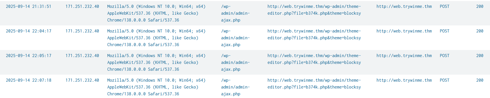

**Query:**
```splunk
index="win-alert" (ParentProcessName="*w3wp.exe*" OR ParentProcessName="*php-cgi.exe*")
| table _time, NewProcessName, CommandLine, User
| sort + _time
```

**Result:** No results returned.

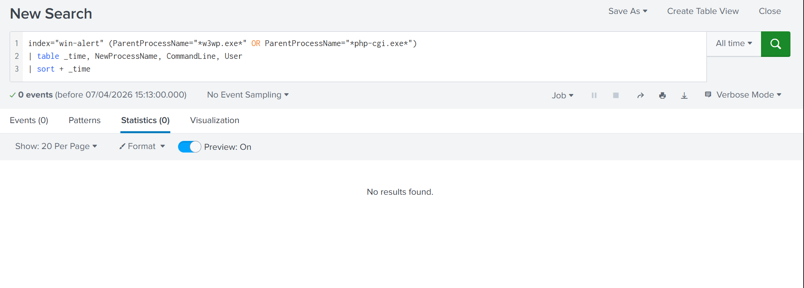

**Interpretation — Why No Process Logs?**

The absence of process creation events is itself a forensic finding. There are two explanations:

* **Direct PHP Execution:** The `b374k` shell likely executed commands entirely within the PHP runtime. Many advanced web shells use PHP's internal libraries (`file_get_contents`, `opendir`, `PDO`) to read files, enumerate directories, and query databases without ever spawning a child process like `cmd.exe` or `whoami.exe`. This is a deliberate **Defense Evasion (MITRE T1202)** technique — it bypasses `Event ID 4688` and Sysmon `Event ID 1` process creation logging entirely.
* **Incomplete Logging Coverage:** The IIS worker process account (`IIS AppPool\DefaultAppPool`) may not be covered by the system's process creation audit policy, or relevant events may have already rolled over.

### Final Query — Reconstructing Activity from Web Logs

Since process telemetry is unavailable, we return to the web logs for behavioral reconstruction.

**Query:**
```splunk
index=web-alert 171.251.232.40
| table _time, uri_path, method, status, useragent
| sort + _time
```

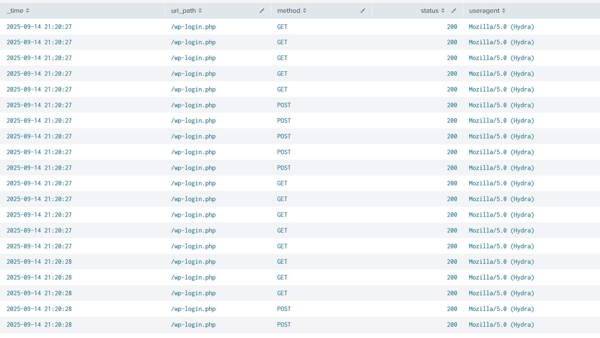

**Findings:**

* **High-Frequency Spraying:** Multiple requests per second at `21:20:27` and `21:20:28`, confirming automated, threaded brute-force **(MITRE T1110.001)**.
* **"Check then Guess" Pattern:** Each `GET` request (Hydra loading the page to scrape hidden login tokens like `wp-submit` and `log`) is immediately followed by a `POST` request (the actual credential guess being submitted). This is standard Hydra behavior.
* **The 33-Minute Gap:** There is a significant gap between the first RCE `POST` at `21:31:51` and the second session at `22:04:17`. This is **forensic gold** — it suggests the attacker ran an initial test command, went quiet to prepare post-exploitation scripts or wait for a specific time window, then returned to execute the full payload.

---

## 9. Unified Attack Timeline

* **~21:20:27** — **Brute Force Begins.** Hydra starts high-frequency credential stuffing against `/wp-login.php` from `171.251.232.40`.
* **21:21:03** — **Access Granted.** Hydra tool stops. Attacker switches to manual Chrome browser and authenticates successfully as a WordPress Admin.
* **21:21:04** — **Admin Panel Confirmed.** Successful `GET` requests to `/wp-admin/` resources prove valid session cookie.
* **21:21:50** — **Reconnaissance.** Attacker opens the WordPress Theme Editor to survey injectable theme files.
* **21:22:01** — **Web Shell Injection.** `POST` to `admin-ajax.php` (referer: `theme-editor.php`) writes `b374k.php` to the Blocksy theme directory via AJAX handler.
* **21:22:46** — **Shell Birth.** `GET` to `theme-editor.php?file=b374k.php` returns `200 OK` — file is confirmed live on disk.
* **21:23:19** — **External Verification.** Second IP `171.251.232.50` accesses `b374k.php`, confirming external reachability.
* **21:31:51** — **Remote Code Execution Begins.** First `POST` to `b374k.php` — attacker executes initial test command via the shell.
* **~21:32 – 22:04** — **Attacker Goes Quiet.** 33-minute gap suggests preparation of post-exploitation tooling or deliberate timing.
* **22:04:17** — **Second RCE Wave.** Attacker returns and executes further commands. No process creation logs suggest execution within the PHP runtime to evade endpoint detection.

---

## 10. Conclusion & Final Analyst Actions

This incident is a **True Positive**. An external threat actor from Vietnam (`171.251.232.40`, 100% AbuseIPDB score) successfully brute-forced the WordPress administrator account, injected the `b374k` PHP web shell via the WordPress AJAX handler, and achieved confirmed Remote Code Execution. The absence of process creation logs indicates deliberate evasion of endpoint detection by operating within the PHP runtime.

**Recommended Actions:**
1. Isolate the web server `web.trywinme.thm` immediately to prevent further data exfiltration or lateral movement.
2. Block `171.251.232.40` and `171.251.232.50` at the perimeter firewall and WAF level.
3. Remove `b374k.php` from the Blocksy theme directory and audit all theme files for additional injected code.
4. Rotate all WordPress administrator credentials and revoke all active sessions.
5. Conduct a full memory dump of the web server and a complete database audit to assess data exposure.
6. Harden the WordPress installation: disable the Theme Editor for production environments, enforce IP allowlisting on `/wp-admin/`, and deploy a WAF rule blocking known web shell signatures.

---

## 11. Analyst Notes & Lessons Learned

* **The AJAX Blind Spot:** The decision to route the shell injection through `admin-ajax.php` instead of a direct `POST` to `theme-editor.php` is a sophisticated evasion technique. In a production environment, WAF rules and SIEM alerts should explicitly monitor `admin-ajax.php` POST requests where the `referer` originates from sensitive admin pages.
* **Process Telemetry Gaps:** The inability to retrieve `Event ID 4688` or Sysmon `Event ID 1` logs for the IIS/PHP worker process is a critical detection gap. Logging policies should explicitly cover the `IIS AppPool\DefaultAppPool` account and all web server parent processes (`w3wp.exe`, `php-cgi.exe`).
* **The 33-Minute Gap as a Pattern:** Behavioral gaps in attacker activity are often misread as "quiet periods." In reality, they frequently represent preparation phases. Tuning SIEM rules to flag "shell access followed by silence followed by resumed access" as a distinct behavioral pattern could improve detection of staged post-exploitation campaigns.
* **Threat Intel as a Force Multiplier:** Validating the suspicious IP on AbuseIPDB before touching the SIEM immediately elevated the investigation's confidence level. Integrating TI lookups into the initial alert triage workflow can significantly reduce false-positive investigation time.