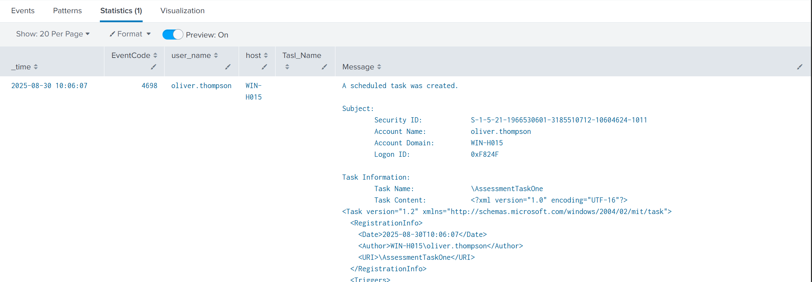
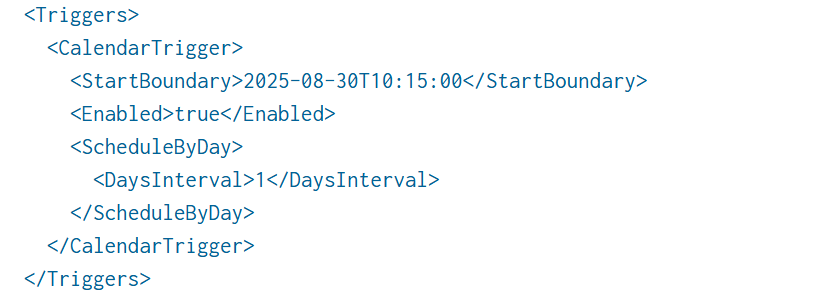
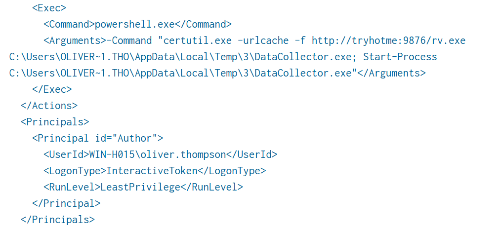
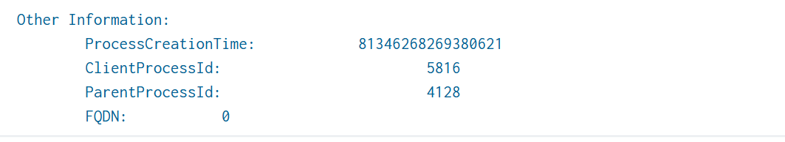
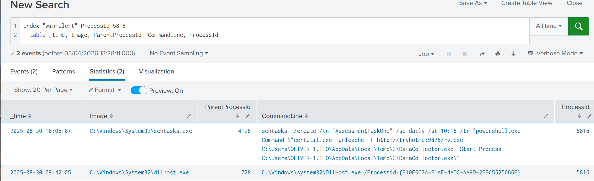
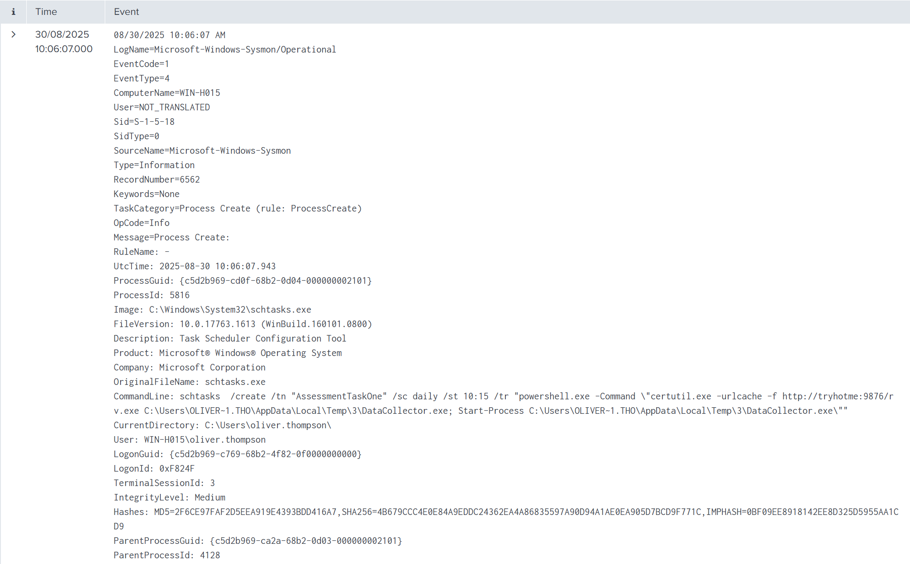
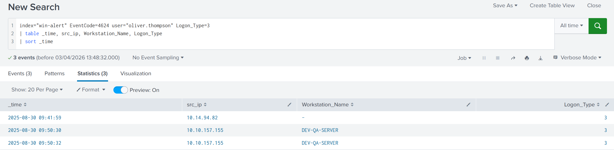
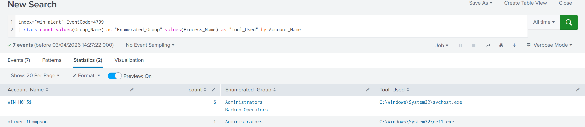
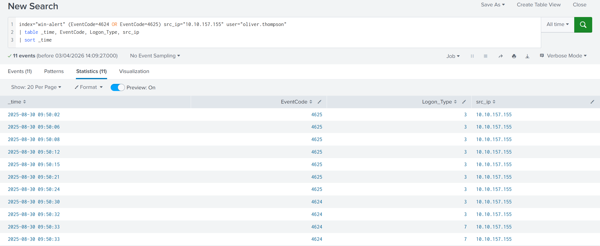

# Incident Report: Windows Task Scheduler Persistence Identified

**Date:** 02-04-2026  
**Investigator:** Gerard Diaz Gibert  
**Environment:** TryHackMe - Alert Triage With Splunk - Virtual Lab  
**Scenario:** Persistence via Malicious Scheduled Task  

---

## Alert Scenario & Initial Triage
An alert was triggered indicating the creation of a suspicious scheduled task on a Windows host.

* **Alert Name:** Potential Task Scheduler Persistence Identified
* **Time:** 30/08/2025 10:06:07 AM
* **Target Host:** `WIN-H015` (Workstation)
* **Target User:** `oliver.thompson` (System Engineer)
* **Task Name:** `AssessmentTaskOne`

**Initial Analyst Observation:** By analyzing the naming convention, `WIN-H015` appears to be a workstation. The user, Oliver Thompson, is a System Engineer. While IT staff often create scheduled tasks, the timing and task name required immediate validation.

---

## Phase 1: Investigating the Scheduled Task
The first objective was to isolate the task creation event and analyze its properties.

**Query:**
```splunk
index="win-alert" EventCode=4698 AssessmentTaskOne
| table _time EventCode user_name host Task_Name Message
```



### Analysis of the "Message" Field
Within the XML data of the task, several red flags were identified:

* **Trigger (Persistence):** * `<StartBoundary>`: 2025-08-30T10:15:00
    * `<DaysInterval>`: 1
    * **Interpretation:** The task is set to run every day at 10:15 AM. This is classic **Beaconing** behavior.



* **Action (The Payload):**
    * The task uses **Living off the Land (LotL)** techniques via `certutil.exe` (T1105) to download `rv.exe` from `tryhotme[.]com:9876`.
    * **Masquerading:** The file is renamed to `DataCollector.exe` and staged in `C:\Windows\Temp`. Legitimate software rarely runs from world-writable Temp directories.
* **Execution:** The task uses PowerShell `Start-Process` to launch the binary.
* The **Principals** part gives us which user account is executing such actions.



---

## 3. Transitional Phase: SOC Operational Response
At this stage of the investigation, the activity is classified as a **True Positive (TP)**. 

### Analyst Action & Escalation
Under normal operational conditions at an MSSP, a Level 1 (L1) Analyst’s primary responsibility is to:
1.  Identify and validate the threat.
2.  Perform initial scoping (checking other hosts for `AssessmentTaskOne`).
3.  **Escalate immediately** to the L2 Analyst/Incident Response team for containment.

**L1 Conclusion:** Classification: **True Positive**. Recommended Action: Immediate account lockout and host isolation.

> **Note:** In a professional environment, the following "Deep Dive" questions regarding the attack's origin would typically be handled by an L2 Analyst or Forensic Investigator. However, to demonstrate technical proficiency, I have continued the investigation to reconstruct the full infection chain.

---

## Phase 2: Pulling the Thread (Forensic Pivot)
To understand how the task was registered, I pivoted from the task log to the process execution logs.

### Identifying the Actor and Manager
From the **Event ID 4698** metadata, I extracted the following IDs:
* **ClientProcessId (Actor):** `5816`
* **ParentProcessId (Manager):** `4128`



**Query (Sysmon Pivot):**
I couldn't find much with the Standard Security logs (4688), since they often lack depth, so I pivoted to a more generic search to see if I found some logs coming from **Sysmon**, specifically **Sysmon Event ID 1** for better visibility into the command line and hashes.
```splunk
index="win-alert" ProcessId=5816
| table _time, Image, ParentProcessId, CommandLine, ProcessId
```


**Findings:**
* **The Actor:** `C:\Windows\System32\schtasks.exe` (PID 5816).
* **The Manager:** `C:\Windows\System32\cmd.exe` (PID 4128).
* **User Context:** The process was running under `WIN-H015\oliver.thompson`.

**Interpretation:** The attacker already had a manual command prompt open as Oliver and used the native `schtasks` utility to "bake" the persistence into the system.




---

## 4. Phase 3: Lateral Movement & Discovery
How did the attacker get onto `WIN-H015`? I pivoted to **Authentication Logs (Event ID 4624)**.

**Query:**
```splunk
index="win-alert" EventCode=4624 user="oliver.thompson" Logon_Type=3
| table _time, src_ip, Workstation_Name, Logon_Type
| sort _time
```



**Findings:**
* **Logon Type 3:** Indicates a **Network Logon** (remote connection).
* **The Pivot Point:** The connection originated from **10.10.157.155** (`DEV-QA-SERVER`). 
* **Conclusion:** The attacker successfully performed **Lateral Movement (T1210)** by compromising a server in the QA department and using it as a jump box.

### Discovery (Enumeration)
Once inside, the attacker checked their "surroundings" to see if they had Admin rights.

**Query:**
```splunk
index="win-alert" EventCode=4799 
| stats count values(Group_Name) as "Enumerated_Group" values(Process_Name) as "Tool_Used" by Account_Name
```



**Findings:** The account `oliver.thompson` used `net1.exe` to enumerate the **Administrators** and **Backup Operators** groups (MITRE T1069.001). This confirmed the attacker was manually performing discovery before setting persistence.

---

## 5. Phase 4: Account Compromise Analysis
To finalize the investigation, I reconstructed the "Login Story" for Oliver Thompson to prove how his credentials were stolen.

**Query (Brute Force Pattern):**
```splunk
index="win-alert" (EventCode=4624 OR EventCode=4625) src_ip="10.10.157.155" user="oliver.thompson"
| table _time, EventCode, Logon_Type, src_ip
| sort _time
```



**Findings:**
* **The Attempt:** 7 failed login attempts (`4625`) from the QA server.
* **The Breach:** At **09:50:30 AM**, a successful logon (`4624`) occurred.
* **Conclusion:** This is a **Targeted Brute Force** or **Credential Stuffing** attack. The low number of attempts suggests the attacker had a high-quality wordlist or specific knowledge of the user.

---

## 6. Unified Attack Timeline
* **09:31:00 AM:** Initial Brute Force begins from `DEV-QA-SERVER` (10.10.157.155).
* **09:50:30 AM:** **Access Granted.** Attacker successfully logs in remotely as Oliver Thompson.
* **10:04:40 AM:** **Privilege Jump.** Attacker moves to the `Administrator` account from IP 10.14.94.82 (multi-hop pivot).
* **10:06:01 AM:** **Discovery.** Attacker enumerates the `Administrators` group to confirm permissions.
* **10:06:07 AM:** **Persistence Establishment.** Attacker uses `cmd.exe` to spawn `schtasks.exe`.
* **10:06:07 AM:** **Task Registration.** `AssessmentTaskOne` is created to download `rv.exe`.
* **10:15:00 AM:** **The Anchor.** The task triggers its first execution to phone home to the C2 server.

---

## 7. Conclusion & Final Analyst Actions
This incident is a **True Positive**. The attacker pivoted through an internal server, used targeted brute force to compromise a system engineer, and established persistence using native Windows tools.

**Recommended Actions:**
1.  Isolate `WIN-H015` and `DEV-QA-SERVER`.
2.  Delete the `AssessmentTaskOne` scheduled task and the `DataCollector.exe` binary.
3.  Reset credentials for `oliver.thompson` and the local `Administrator` account.
4.  Block the domain `tryhotme[.]com` at the firewall/DNS level.