# ProxyLogon to Data Staging: Alert Triage and Incident Reconstruction on a Windows IIS Server

---

## Environment

TryHackMe | SIEM Triage for SOC Module | Kibana / Elastic Stack
Target: `winserv2019.some.corp` | Client: SomeCorp

---

## Lab Objective

Five alerts arrive in the SOC queue across a 37-minute window, all targeting the same client environment. The objective is to triage each alert in sequence, determine true positive or false positive, correlate findings across IIS web logs and Windows host telemetry, and reconstruct the full attack chain from initial web exploitation through to data staging. This mirrors real L1 SOC work where alerts surface individually but must be recognised as fragments of a single chained intrusion rather than isolated events.

---

## Tools and Technologies

- Kibana Discover (Elastic Stack)
- IIS web server logs, ECS-normalized (`weblogs` index)
- Windows Security Event Log (`winlogbeat` index)
- Sysmon (Event ID 1 Process Creation, Event ID 5 Process Terminated)
- PowerShell Script Block Logging (Event ID 4104)
- KQL (Kibana Query Language)

---

## Alert Queue Overview

Before opening Kibana, reading the five alerts in sequence establishes a working hypothesis.

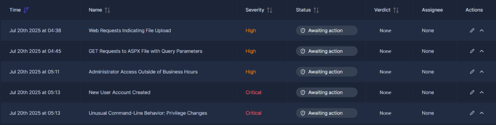

Here is an enriched table of the alerts in the SIEM:

| Time | Alert Name | Severity | Implication |
|------|-----------|----------|-------------|
| 04:38 | Web Requests Indicating File Upload | High | Automated POST requests to Exchange endpoint |
| 04:45 | GET Requests to ASPX File with Query Parameters | High | Web shell operational, commands executing |
| 05:11 | Administrator Access Outside of Business Hours | High | Interactive RDP logon from external IP |
| 05:13 | New User Account Created | Critical | Backdoor account planted |
| 05:13 | Unusual Command-Line Behavior: Privilege Changes | Critical | Backdoor account escalated to admin |

All five alerts share the same external IP address and span 37 minutes. The working hypothesis before running a single query: ProxyLogon exploitation gave the attacker a web shell on the Exchange server, the web shell was used to extract Administrator credentials and establish RDP access, and that access was used to plant a persistent domain backdoor account. Every query that follows either confirms or refines that hypothesis.

---

## Lab Content

### Phase 1: Web Exploitation

#### SOC Alert 1

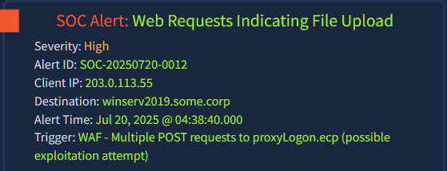

The anchor from this alert is the external IP `203.0.113.55` and the endpoint `/ecp/proxyLogon.ecp`. ProxyLogon (CVE-2021-26855) is a critical Exchange Server pre-authentication vulnerability targeting the Exchange Control Panel. Attackers send crafted POST requests to this endpoint to bypass authentication entirely and write arbitrary files to disk. The endpoint should never receive automated POST traffic from an external source.

The first query scopes all POST activity from the attacker IP against the web log index:

```kql
_index:weblogs and client.ip:203.0.113.55 and http.request.method:POST
```

Table fields: `client.ip`, `user.agent`, `http.request.method`, `url.path`, `http.response.status_code`

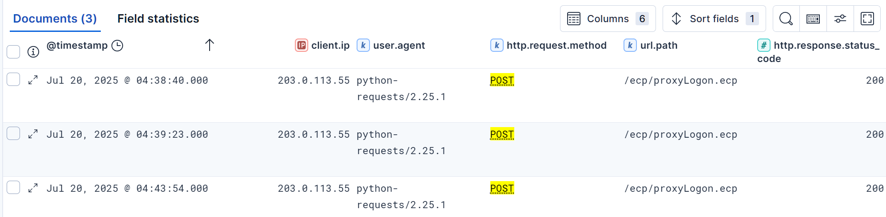

Three POST requests to `/ecp/proxyLogon.ecp`, all returning `200 OK`. The user agent `python-requests/2.25.1` confirms automated tooling, not a human browsing the Exchange admin panel. The `200` response code is the critical detail: the server did not reject the requests. The exploit reached the application layer and received a successful response. This is a true positive. POST requests alone do not confirm whether the exploit landed a file on disk, but the next alert, firing seven minutes later, answers that question.

---

#### SOC Alert 2

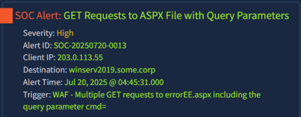

ProxyLogon operates in two stages. Stage one is the POST to `proxyLogon.ecp` which exploits the authentication bypass and writes an ASPX web shell to a predictable path on disk. Stage two is the attacker accessing that file via GET request and passing OS commands through the `cmd=` parameter. This second alert firing seven minutes after the first, from the same IP, targeting an ASPX file with `cmd=` in the trigger, confirms stage two is underway.

```kql
_index:weblogs and client.ip:203.0.113.55 and http.request.method:GET and errorEE.aspx
```

Table fields: `client.ip`, `user.agent`, `url.path`, `http.request.method`, `http.response.status_code` — sorted ascending.

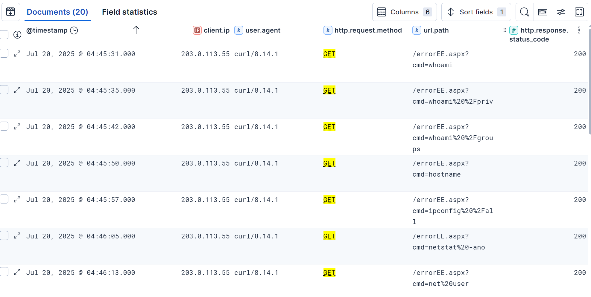

The `url.path` field exposes the commands executed through the shell. URL-decoded, the sequence reads:

```
/errorEE.aspx?cmd=whoami
/errorEE.aspx?cmd=whoami /priv
/errorEE.aspx?cmd=whoami /groups
/errorEE.aspx?cmd=hostname
/errorEE.aspx?cmd=ipconfig /all
/errorEE.aspx?cmd=netstat -ano
/errorEE.aspx?cmd=net user
```

This is a systematic identity and environment check. `whoami` establishes which account the web shell runs under. `whoami /priv` enumerates token privileges, specifically looking for `SeImpersonatePrivilege` which is standard on IIS application pool accounts and can be leveraged for local privilege escalation. `whoami /groups` maps group memberships. `hostname`, `ipconfig /all`, and `netstat -ano` build a picture of the host and its network position. `net user` enumerates local accounts. All requests return `200`, confirming the shell executes commands successfully and the server returns output. The user agent shifts to `curl/8.14.1`, indicating the attacker switched tooling between the exploitation phase and the interaction phase.

Both web alerts are escalated as true positives. The investigation now pivots from web logs to host-based telemetry to determine what the attacker did with this access.


### Phase 2: Administrator Logon

#### SOC Alert 3

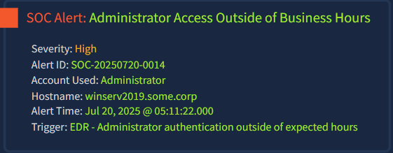

Thirty minutes elapsed between the web shell becoming operational and this alert firing. That gap is not idle time. The attacker used the web shell to enumerate the environment, identify credentials, and prepare for interactive access. RDP is a far more comfortable working environment than a web shell executing one command per HTTP request. The Administrator account logging in from the same IP that ran the web shell commands is not a coincidence.

The query targets Windows Security Event ID 4624 (Logon) anchored to the alert timestamp, hostname, and account:

```kql
@timestamp >= "2025-07-20T05:11:22" and winlog.event_id:4624 and
host.name:winserv2019.some.corp and
winlog.event_data.TargetUserName:Administrator
```

Table fields: `winlog.event_id`, `host.name`, `winlog.event_data.TargetUserName`, `winlog.logon.type`, `winlog.event_data.IpAddress`

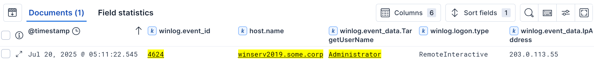

One result. `winlog.logon.type: RemoteInteractive` is Logon Type 10, which is RDP. `winlog.event_data.IpAddress: 203.0.113.55` closes the loop between the two log sources. The same external IP that automated ProxyLogon exploitation and ran web shell commands has now authenticated as the built-in Administrator account over RDP. The attacker has full interactive control of the server.

To validate the logon and track what happened immediately afterward, I correlated with Sysmon Event ID 1 (Process Creation) under the same timestamp and account:

```kql
@timestamp >= "2025-07-20T05:11:22" and winlog.event_id:1 and
user.name:Administrator
```

Table fields: `user.name`, `process.parent.name`, `process.command_line` — sorted ascending.

The initial results show `svchost.exe` and `services.exe` activity consistent with Windows session initialisation, expected behavior when a new user session starts. Scrolling past the initialisation events, the same result set reveals the attacker had already moved into active operations within minutes of the RDP logon.

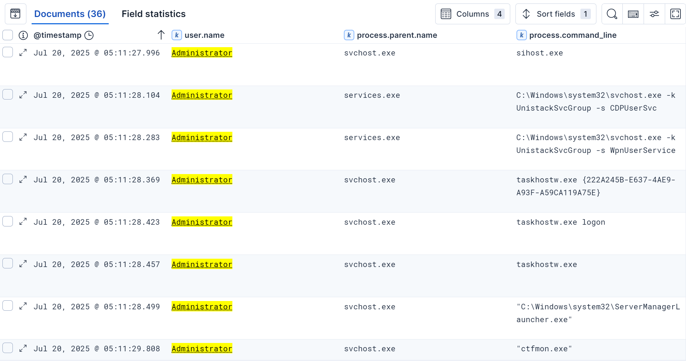

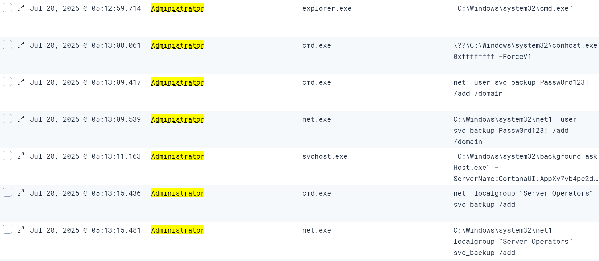

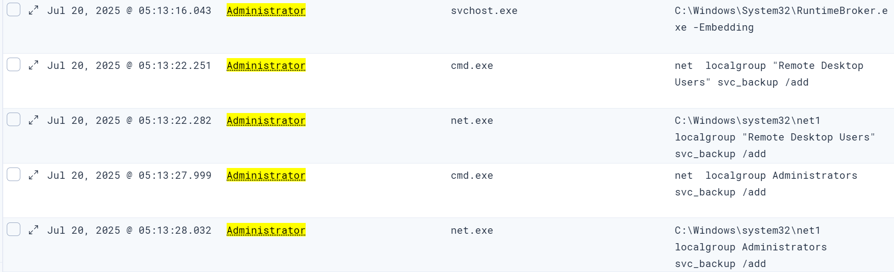

At `05:12:59`, `explorer.exe` spawns `cmd.exe` under the Administrator account. This is the RDP desktop shell launching a terminal, the moment the attacker moved from passive session setup to active keyboard input. At `05:13:09`, the first substantive command executes:

```
net user svc_backup Passw0rd123! /add /domain
```

The `/domain` flag is the most significant detail here. This creates `svc_backup` as a domain account, not a local one. A local backdoor is contained to `winserv2019.some.corp`. A domain account is valid across every system in the SOME domain. The password `Passw0rd123!` is now an IOC.

The `net.exe` and `net1.exe` pairs visible throughout this result set are expected. Windows routes `net` commands through `net.exe` which calls `net1.exe` as the backend execution engine. Each command produces two Sysmon process creation records.

The group escalation sequence begins immediately after account creation, covered in Phase 4.


### Phase 3: Backdoor Account Creation

#### SOC Alert 4

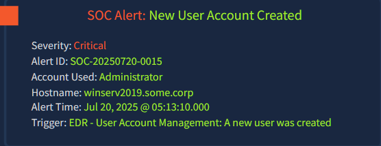

The Security log provides the operating system's view of the account creation that Sysmon recorded as a command. Filtering on Windows Security logs and the `winlog.task` field targets the entire account lifecycle in one query rather than hunting individual event IDs:

```kql
@timestamp >= "2025-07-20T05:13:10.000" and winlog.channel:Security and
winlog.task:"User Account Management"
```

Table fields: `winlog.event_id`, `winlog.task`, `message`, `winlog.event_data.TargetUserName` — sorted ascending.

Four events fire within milliseconds:

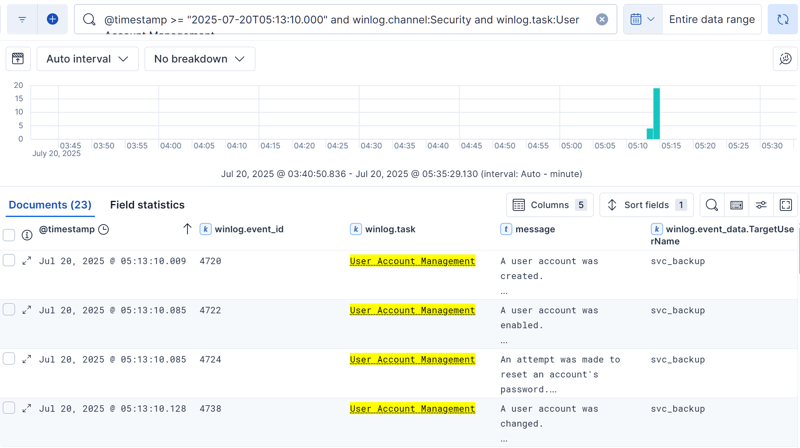

This sequence is the Windows Security log signature of a single `net user` command executed programmatically. Event 4720 records the creation. Event 4722 enables the account, as accounts can be created in a disabled state. Event 4724 sets the password. Event 4738 captures the final attribute modification. Four events, one command, 119 milliseconds. No human clicks through the GUI at that speed.

The account name `svc_backup` is deliberate masquerading. Named to resemble a legitimate Windows service account, it blends into a user list where an administrator unfamiliar with every service account might assume it belongs to a backup agent or scheduled task.

### Phase 4: Privilege Escalation and Cross-Source Corroboration

#### SOC Alert 5

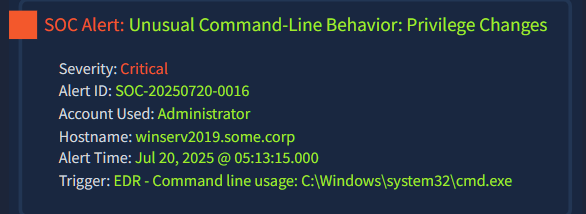

An unprivileged domain account is a foothold but not a persistent administrative backdoor. The attacker's next objective is escalating `svc_backup` to a position where it can re-enter the environment with full control even if the Administrator password is reset. The Sysmon query targets all child processes of `cmd.exe` under the Administrator account from the alert timestamp:

```kql
@timestamp >= "2025-07-20T05:13:15" and process.parent.name:cmd.exe and
user.name:Administrator
```

Table fields: `process.command_line`, `process.name`, `process.parent.name` — sorted ascending.

Three `net localgroup` commands execute in twelve seconds:

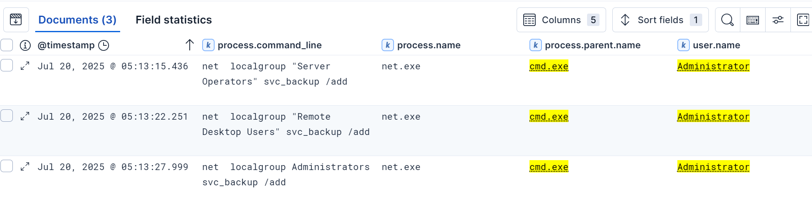

Server Operators grants the ability to start and stop services and log on interactively to servers. Remote Desktop Users grants RDP access. Administrators grants full local control. After these three commands, `svc_backup` has the same effective access as the built-in Administrator account.

Sysmon records the intent. To confirm the OS actually completed each group membership change, I correlated with Windows Security Event ID 4732 (member added to a security-enabled local group):

```kql
@timestamp >= "2025-07-20T05:13:15" and
(winlog.event_id:4732 or process.parent.name:cmd.exe)
```

The interleaved result set shows each Sysmon process creation event paired with its matching Security 4732 within milliseconds:


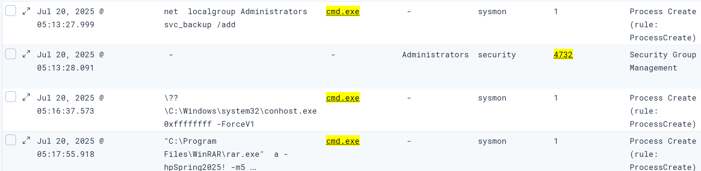

Every command succeeded. Sysmon proves intent, Security Event 4732 proves outcome. Both together constitute the evidence package for escalation to L2 or IR.

At the tail of the same result set, `conhost.exe` spawns at `05:16:37`, indicating the attacker has opened a new terminal session. The three-minute gap since the last group escalation command suggests they switched from the Administrator account to `svc_backup`. At `05:17:55`, `cmd.exe` spawns `Rar.exe`, visible as a preview of Phase 6. The parent-process query surfaces cross-account activity because `process.parent.name:cmd.exe` is not scoped to a specific user, which is why `svc_backup` activity appears in this result set alongside the Administrator session.

### Phase 5: Post-Exploitation Reconnaissance

No alert was generated for this phase. Following the thread from the newly elevated `svc_backup` account, I queried PowerShell Script Block Logging to determine whether the attacker continued operating after account setup:

```kql
@timestamp >= "2025-07-20T05:13:15" and event.module:powershell and
event.code:4104
```

Table fields: `powershell.file.script_block_text`, `event.code`, `event.module`, `event.action` — sorted ascending.

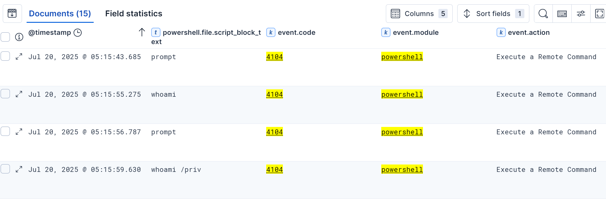

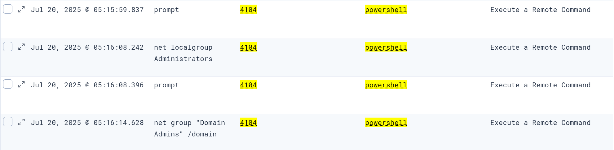

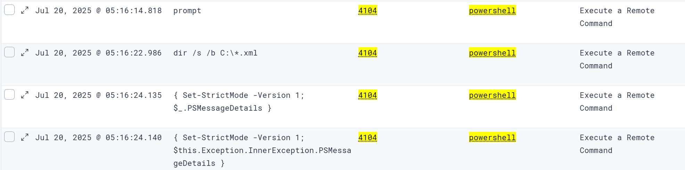

Event ID 4104 logs every script block PowerShell executes, including internal plumbing. The `prompt` entries that appear throughout are PowerShell recording the rendering of its own command prompt between inputs, not attacker commands. The attacker-issued commands in chronological order:

```
05:15:55  whoami
05:15:59  whoami /priv
05:16:08  net localgroup Administrators
05:16:14  net group "Domain Admins" /domain
05:16:22  dir /s /b C:\*.xml
```

`whoami` confirms which account this PowerShell session runs under. `whoami /priv` checks available token privileges. `net localgroup Administrators` verifies that `svc_backup` now appears in the local Administrators group, the attacker confirming their own escalation succeeded. `net group "Domain Admins" /domain` is a read-only check of domain admin group membership, showing the attacker is assessing whether any accessible account has domain-wide administrative privileges. `dir /s /b C:\*.xml` recursively enumerates all XML files across the entire C drive. On an Exchange server, XML files frequently contain mail flow configuration, connector credentials, and service account details valuable for lateral movement.

The `event.action` field shows `Execute a Remote Command` across every entry. This label appears in Elastic when PowerShell commands are received over a remote session rather than typed at the local console. The attacker has established a remote PowerShell session independently of their RDP session as Administrator. The `Set-StrictMode` entries at the tail of the result set are PowerShell's internal error handling framework initialising automatically with the session, not attacker activity.

The executing account is not directly surfaced in the `user.name` ECS field for 4104 events, as the PowerShell engine does not populate that field consistently. The account is confirmed through the `user.id` field, which contains the SID `S-1-5-21-363149898-3377733843-3686914969-1114` across all 15 events in the result set. Cross-referencing that SID against the Security Event 4720 account creation log from Phase 3 confirms the match: `winlog.event_data.TargetSid` in the 4720 event for `svc_backup` is `S-1-5-21-363149898-3377733843-3686914969-1114`. The PowerShell session runs under `svc_backup`.

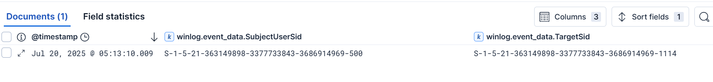

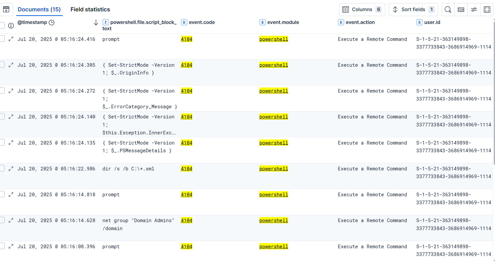


### Phase 6: Data Staging

No alert was generated for this phase. After confirming `svc_backup` escalation, I pivoted to all activity under that account to continue the thread:

```kql
@timestamp >= "2025-07-20T05:13:15" and user.name:svc_backup
```

73 results. Adding `process.name` and `process.command_line` as columns and sorting ascending, `Rar.exe` is visible in the process list at `05:17:55`. The same entry was also surfaced at the tail of the Phase 4 corroboration query because `process.parent.name:cmd.exe` catches all cmd.exe children regardless of user account. I confirmed it with a more targeted query:

```kql
@timestamp >= "2025-07-20T05:13:15" and user.name:svc_backup and
process.name:"Rar.exe"
```

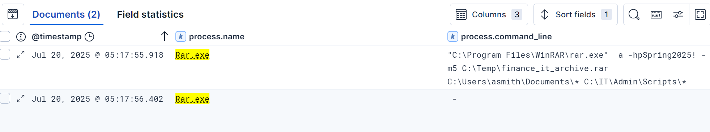

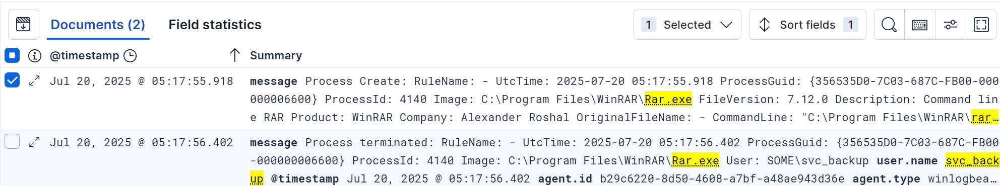

Two Sysmon events, one second apart:

```
05:17:55.918  Event ID 1  Process Creation
              Image:       C:\Program Files\WinRAR\Rar.exe
              PID:         4140
              Parent:      C:\Windows\System32\cmd.exe
              User:        SOME\svc_backup
              CommandLine: "C:\Program Files\WinRAR\rar.exe" a -hpSpring2025! -m5
                           C:\Temp\finance_it_archive.rar
                           C:\Users\asmith\Documents\*
                           C:\IT\Admin\Scripts\*

05:17:56.402  Event ID 5  Process Terminated
              Image:       C:\Program Files\WinRAR\Rar.exe
              PID:         4140
              User:        SOME\svc_backup
```

The command line dismantled:

`a` creates a new archive. `-hpSpring2025!` encrypts both file contents and filenames within the archive using the password `Spring2025!`. Encrypting filenames specifically means the archive contents are opaque even if the file is found on disk without the password. This is deliberate anti-forensics. `-m5` applies maximum compression to minimise the file size and reduce transfer time. `C:\Temp\finance_it_archive.rar` is the output path: the Temp directory is a staging area and the filename signals the attacker's assessment of the data's value. `C:\Users\asmith\Documents\*` targets all files in a specific user's Documents folder. `C:\IT\Admin\Scripts\*` targets the IT administrative scripts directory, which on a managed server environment commonly contains hardcoded credentials, API keys, and connection strings to other infrastructure.

The process terminated in under one second. No network path was specified, confirming the archive was written locally to `C:\Temp\`. No subsequent network connection log was captured showing the archive being transferred outward. The transfer mechanism remains unknown and constitutes a detection gap in the available log sources.

The operation ran under `svc_backup`, not Administrator, confirming the attacker has fully transitioned to their backdoor account for operational activity.

## Attack Timeline

```
04:38  POST x3 to /ecp/proxyLogon.ecp from 203.0.113.55
       User-agent: python-requests/2.25.1. All requests return 200.
       ProxyLogon authentication bypass, web shell written to disk.

04:45  GET x20 to /errorEE.aspx?cmd=[command] from 203.0.113.55
       User-agent: curl/8.14.1. All requests return 200.
       Web shell operational. Commands: whoami, whoami /priv, whoami /groups,
       hostname, ipconfig /all, netstat -ano, net user.

05:11  Security Event 4624 — Administrator logon
       Logon Type 10 (RemoteInteractive / RDP). Source: 203.0.113.55.
       Interactive Administrator session established.

05:12  Sysmon Event 1 — explorer.exe spawns cmd.exe
       Attacker opens terminal in RDP session.

05:13  Sysmon Event 1 — net user svc_backup Passw0rd123! /add /domain
       Domain backdoor account created. Password IOC: Passw0rd123!

05:13  Security Events 4720, 4722, 4724, 4738 — svc_backup lifecycle
       Account created, enabled, password set, configuration finalised.
       All four events within 119ms.

05:13  Sysmon Event 1 x3 — net localgroup commands
05:13  Security Event 4732 x3 — group membership confirmed
       svc_backup added to Server Operators, Remote Desktop Users, Administrators.
       Each Sysmon command paired with 4732 confirmation within milliseconds.

05:15  PowerShell Event 4104 — remote session under svc_backup
       Commands: whoami, whoami /priv, net localgroup Administrators,
       net group "Domain Admins" /domain, dir /s /b C:\*.xml.
       event.action: Execute a Remote Command throughout.

05:17  Sysmon Event 1 — Rar.exe executed under svc_backup
       CommandLine: rar.exe a -hpSpring2025! -m5
       C:\Temp\finance_it_archive.rar
       C:\Users\asmith\Documents\* C:\IT\Admin\Scripts\*
       Archive written locally. Transfer method unknown.

05:17  Sysmon Event 5 — Rar.exe terminated
       PID 4140 confirmed. Runtime under one second.
```

---

## IOC Summary

| Type | Value | Context |
|------|-------|---------|
| IP address | `203.0.113.55` | Attacker source, present across all phases |
| URL path | `/ecp/proxyLogon.ecp` | ProxyLogon exploitation endpoint |
| File | `errorEE.aspx` | Web shell planted on Exchange server |
| User agent | `python-requests/2.25.1` | Automated exploitation tooling |
| User agent | `curl/8.14.1` | Web shell interaction tooling |
| Account | `svc_backup` | Backdoor domain account |
| SID | `S-1-5-21-363149898-3377733843-3686914969-1114` | svc_backup SID, confirmed across Security and PowerShell logs |
| Password | `Passw0rd123!` | svc_backup account credential |
| Password | `Spring2025!` | RAR archive encryption key |
| File | `C:\Temp\finance_it_archive.rar` | Staged exfiltration archive |
| Path | `C:\Users\asmith\Documents\*` | Targeted user document data |
| Path | `C:\IT\Admin\Scripts\*` | Targeted administrative scripts |
| Host | `winserv2019.some.corp` | Compromised Exchange server |

---

## MITRE ATT&CK Mapping

| Technique | ID | Phase |
|-----------|----|-------|
| Exploit Public-Facing Application | T1190 | ProxyLogon exploitation via /ecp/proxyLogon.ecp |
| Server Software Component: Web Shell | T1505.003 | errorEE.aspx planted on Exchange server |
| Valid Accounts: Local Accounts | T1078.003 | Administrator RDP logon from attacker IP |
| Create Account: Domain Account | T1136.002 | svc_backup created with /domain flag |
| Account Manipulation: Local Groups | T1098.001 | svc_backup added to Administrators group |
| Remote Services: Remote Desktop Protocol | T1021.001 | RDP used for interactive access |
| Command and Scripting Interpreter: PowerShell | T1059.001 | Remote PowerShell session for post-exploitation recon |
| System Owner/User Discovery | T1033 | whoami, whoami /priv executed via web shell and PowerShell |
| Archive Collected Data: Archive via Utility | T1560.001 | Rar.exe with encryption and maximum compression |
| Masquerading | T1036 | svc_backup named to resemble a legitimate service account |

---

## SOC Implications

Reading all five alerts as a group before opening the SIEM was the correct starting point. Each alert in isolation could prompt a narrow query: confirm the logon, confirm the account creation, confirm the command. Read together they reveal a 37-minute intrusion chain with a single source IP threading through every phase. The working hypothesis formed from the alert queue held through the entire investigation without needing revision. In practice, this approach compresses triage time significantly because it frames every subsequent query as confirmation work rather than open-ended discovery.

The most operationally significant finding is the `/domain` flag on the `net user` command. The room's alerts focus on the local privilege changes, and those matter. But a local backdoor account is contained to one machine. The domain account `svc_backup`, now a member of the local Administrators group on an Exchange server, can be used to authenticate against other domain-joined systems depending on the environment's configuration. The containment response must treat this as a domain-wide compromise, not a single-host incident. Password resets on the Administrator account alone are insufficient. The `svc_backup` domain account must be disabled and removed, and every domain-joined host should be assessed for `svc_backup` logon events before the account is considered fully evicted.

The cross-source corroboration pattern demonstrated in Phase 4, pairing Sysmon process creation with Security Event 4732 for each group modification, is the standard for escalation evidence in Windows environments. Sysmon alone proves the command was issued. The Security log proves the operating system completed the requested change. Either source alone is arguable. Both paired within milliseconds is not. In any real ticket or IR handoff, both sources should be documented for every privilege change finding.

The detection gap around the RAR archive transfer is the investigation's open thread. Sysmon confirms the archive was created locally at `C:\Temp\finance_it_archive.rar` at `05:17:55` and the process terminated cleanly at `05:17:56`. No network connection log captures outbound transfer of that file. The recommended follow-up for IR is to review egress firewall logs and proxy logs for outbound connections originating from `winserv2019.some.corp` between `05:17:56` and the end of the investigation window, with particular attention to large outbound transfers or connections to `203.0.113.55`. The absence of a transfer log does not mean the file was not transferred; it means the transfer either used the existing RDP session as a data channel, occurred over a protocol not captured by available sensors, or has not yet happened and the archive remains on disk awaiting retrieval.

---

*TryHackMe | SIEM Triage for SOC | Alert Triage With Elastic*
