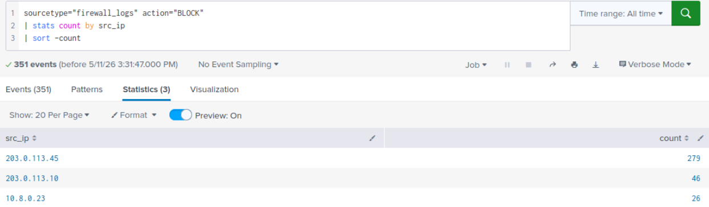
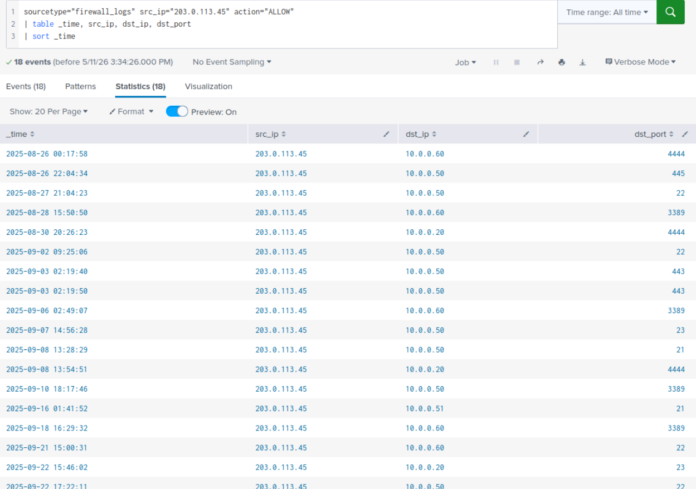
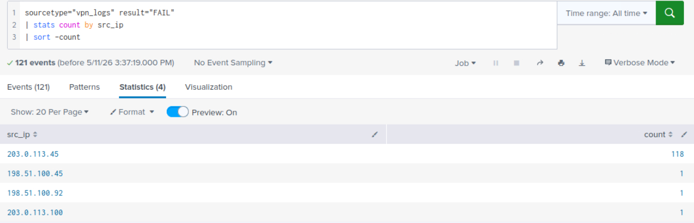
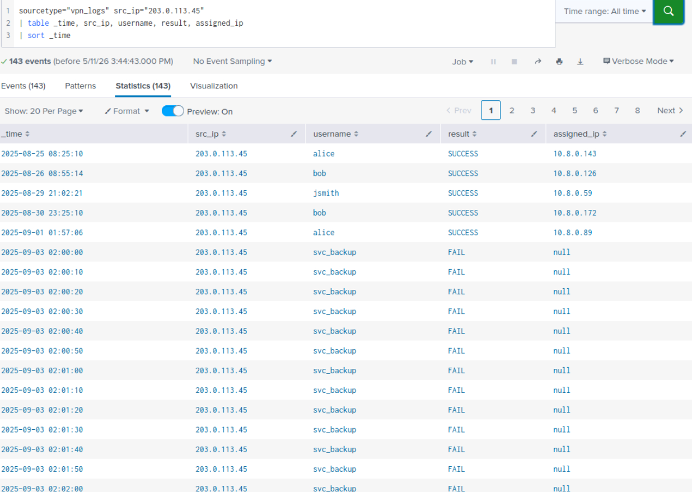
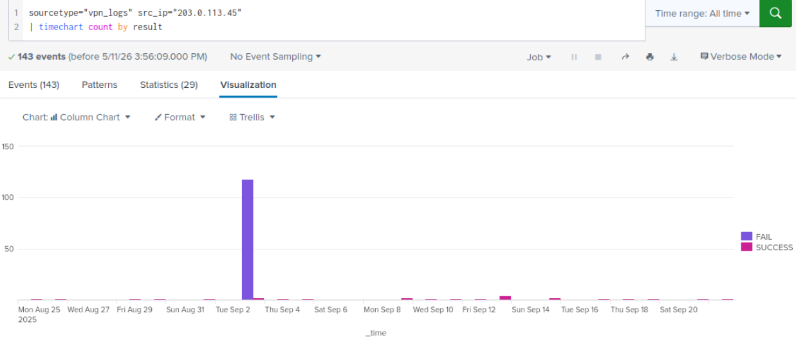
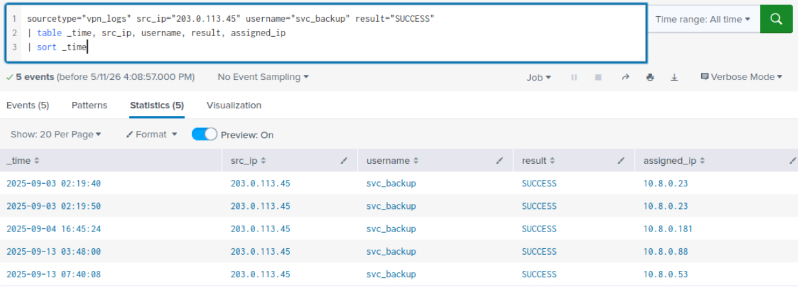
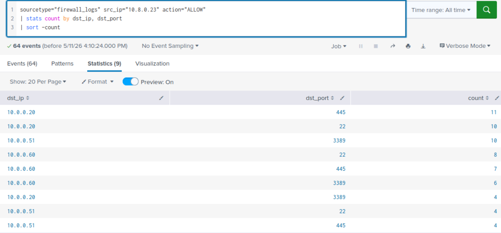
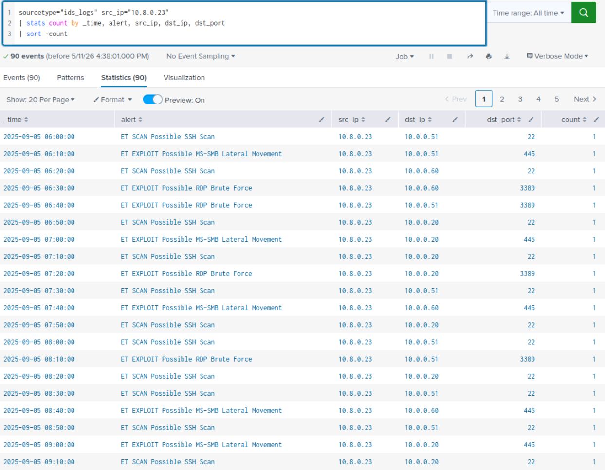

# Perimeter Breach Investigation: Initech Corp
## Network Security Monitoring with Splunk

---

## Environment

| Field | Detail |
|---|---|
| Platform | TryHackMe — Network Security Essentials Module |
| SIEM | Splunk |
| Log Sources | Firewall logs, IDS/IPS logs, VPN authentication logs |
| Incident Window | August 25, 2025 — September 28, 2025 |

---

## Lab Objective

Initech Corp, a mid-sized financial services company, flagged abnormal traffic patterns over the course of one month. The SOC team had not performed deeper analysis. As the assigned analyst, the objective is to review one month of perimeter logs across three sources, determine what techniques the adversary used, establish whether they successfully breached the perimeter, and reconstruct the full attack chain from initial reconnaissance through data exfiltration.

---

## Tools and Technologies

- Splunk SIEM (SPL queries for aggregation, pivoting, and timeline reconstruction)
- `firewall_logs` sourcetype (perimeter connection events, ALLOW/BLOCK actions)
- `ids_logs` sourcetype (IDS/IPS alert signatures and classifications)
- `vpn_logs` sourcetype (VPN authentication events, assigned IPs)

---

## Network Assets

| IP | Hostname | Role | OS | Team | Criticality |
|---|---|---|---|---|---|
| 10.0.0.20 | FINANCE-SRV1 | File/Finance Server (SMB) | Windows Server | Finance IT | High |
| 10.0.0.50 | VPN-GW | VPN Gateway | Linux | NetOps | Critical |
| 10.0.0.51 | APP-WEB-01 | Internal Web/App Server | Linux | Apps Team | High |
| 10.0.0.60 | WORKSTATION-60 | Employee Workstation | Windows 10 | Sales | Medium |
| 10.8.0.23 | VPN-CLIENT-ATTK | VPN Assigned Client (Ephemeral) | N/A | N/A | Critical |
| 10.0.1.10 | DMZ-WEB | DMZ Web Server | Linux | NetOps | Medium |

---

## Network Security Monitoring: Investigative Context

Perimeter log analysis is the process of examining the traffic and events recorded at the boundary between an organization's internal network and the external internet. Three log sources form the foundation of this investigation.

Firewall logs capture every connection attempt that crosses the perimeter, with the action taken: allowed or blocked. They are the first place signs of external probing appear. A single blocked connection is noise. A single source IP generating hundreds of blocked attempts against multiple ports in a short window is a scan, and that distinction only emerges through aggregation.

IDS logs classify traffic by behavior. Where the firewall tells you a connection was allowed or blocked, the IDS tells you what the traffic looked like: a port scan, an SMB exploit attempt, a C2 beacon, a large HTTP POST upload. IDS alerts fire on attempt, not on confirmed success. Establishing whether an exploit actually landed requires correlating IDS alerts with downstream behavior, not reading the alert alone.

VPN logs record authentication events against the remote access gateway: the source IP, the username, the result, and the internal IP assigned on success. They are the bridge between external activity and internal access. A credential brute force that fails 118 times and then succeeds is not visible as a single event in any one log. It only becomes readable as a pattern when the full timeline for that source IP is pulled together.

The methodology throughout this investigation is pull-threading: every finding generates a new pivot value, and every pivot is driven by evidence from the previous step. No assumptions are carried forward without log confirmation.

---

## Lab Content

### Phase 1: Reconnaissance — Surfacing the Scanner

The starting point for any perimeter investigation is blocked traffic. Blocked connections are the footprint of an attacker testing the boundary before they find a way through. Aggregating by source IP immediately separates ambient internet noise from targeted reconnaissance.

```spl
sourcetype="firewall_logs" action="BLOCK"
| stats count by src_ip
| sort -count
```



`203.0.113.45` surfaces at the top with 279 blocked attempts, nearly six times the count of the next highest source. This IP is the primary suspect. It becomes the pivot value for every subsequent query.

The critical follow-up question is whether the firewall ever allowed traffic from this same IP. Blocked attempts confirm probing. Allowed connections confirm the perimeter did not hold.

```spl
sourcetype="firewall_logs" src_ip="203.0.113.45" action="ALLOW"
| table _time, src_ip, dst_ip, dst_port
| sort _time
```



The result returns 18 allowed connections, targeting `10.0.0.60`, `10.0.0.50`, `10.0.0.20`, and `10.0.0.51` on ports 22, 445, 3389, and 4444. Connections to those ports from an external scanning IP are not legitimate traffic. The perimeter did not hold. The investigation moves from reconnaissance detection to active breach analysis.

---

### Phase 2: Credential Access — VPN Brute Force

With an external IP confirmed as both scanning and gaining firewall access, the next thread is authentication. A source IP actively probing the perimeter will also target authentication services. VPN logs are the first place to check.

```spl
sourcetype="vpn_logs" result="FAIL"
| stats count by src_ip
| sort -count
```



`203.0.113.45` dominates with 118 authentication failures. The next highest source has a single failure. The disparity is the signal. This is not a user mistyping a password. Pivoting on this IP across the full VPN log reveals the complete picture.

```spl
sourcetype="vpn_logs" src_ip="203.0.113.45"
| table _time, src_ip, username, result, assigned_ip
| sort _time
```



The timeline reveals two distinct phases of activity. From August 25 through September 1, the same IP authenticates successfully against legitimate accounts: alice, bob, jsmith, with different assigned IPs each time. These successes are spaced across days, blending into what appears to be normal VPN traffic. This is credential stuffing: the attacker is using previously obtained credentials to probe the environment while staying below detection thresholds.

On September 3rd at 02:00:00, the behavior changes. The IP begins firing against `svc_backup` every 10 seconds, generating 118 failures in under 20 minutes. The shift from scattered multi-account attempts to a rapid single-account burst is the behavioral fingerprint of automated brute force against a specific target.

Visualizing this transition confirms it:

```spl
sourcetype="vpn_logs" src_ip="203.0.113.45"
| timechart count by result
```



The chart shows a single large spike of FAIL events on September 3rd, followed by scattered SUCCESS events in the days that follow. The spike is the brute force. The subsequent successes are the attacker returning with valid credentials.

To isolate the first successful access and extract the assigned internal IP:

```spl
sourcetype="vpn_logs" src_ip="203.0.113.45" username="svc_backup" result="SUCCESS"
| table _time, src_ip, username, result, assigned_ip
| sort _time
```



The first success occurs at 02:19:40 on September 3rd, assigning internal IP `10.8.0.23`. This is the pivot IP for lateral movement. The attacker reconnected on subsequent days and received different ephemeral addresses from the VPN pool (`10.8.0.181`, `10.8.0.88`, `10.8.0.53`), which is normal VPN pool behavior. The forensically relevant IP is the first one assigned immediately after the brute force completed.

**SOC note:** Blocking `10.8.0.23` in isolation would not have contained this attacker. The external source `203.0.113.45` was never blocked at the perimeter, and `svc_backup` credentials remained valid. The attacker would simply reconnect and receive a new internal IP. Effective containment requires blocking `203.0.113.45` at the firewall and revoking `svc_backup` credentials simultaneously.

---

### Phase 3: Lateral Movement — Internal Reconnaissance from the VPN IP

The attacker now holds an internal VPN address. A VPN client initiating connections to internal hosts on administrative ports is not normal employee behavior. The pattern of one IP reaching multiple distinct internal destinations on ports 22, 445, and 3389 within a short window is the lateral movement signature.

```spl
sourcetype="firewall_logs" src_ip="10.8.0.23" action="ALLOW"
| stats count by dst_ip, dst_port
| sort -count
```



The firewall confirms allowed connections from `10.8.0.23` to three internal hosts: `10.0.0.20` (FINANCE-SRV1), `10.0.0.51` (APP-WEB-01), and `10.0.0.60` (WORKSTATION-60), on ports 22, 445, and 3389. Three distinct internal targets reached by a single VPN client IP on administrative ports. This is lateral movement.

Cross-referencing with IDS provides the behavioral classification, not just the raw connection:

```spl
sourcetype="ids_logs" src_ip="10.8.0.23"
| stats count by alert, dst_ip, dst_port
| sort -count
```



The IDS labels the behavior across all three targets: `ET SCAN Possible SSH Scan`, `ET EXPLOIT Possible RDP Brute Force`, and `ET EXPLOIT Possible MS-SMB Lateral Movement`. All activity is concentrated on September 5th. At this stage, three machines are potentially compromised. The IDS fires on attempt, not confirmed success. Which hosts were actually implanted is determined by downstream evidence in the phases that follow.

To isolate the SMB activity specifically:

```spl
sourcetype="ids_logs" src_ip="10.8.0.23" alert="*SMB*"
| table _time, src_ip, dst_ip, dst_port, alert
| sort _time
```

![Phase 3 - SMB lateral movement alerts, page 1]

![Phase 3 - SMB lateral movement alerts, page 2]

32 `ET EXPLOIT Possible MS-SMB Lateral Movement` events are logged on September 5th, targeting `10.0.0.20`, `10.0.0.51`, and `10.0.0.60` on port 445 throughout the day. The confirmation of which hosts were successfully exploited comes from the next phase.

---

### Phase 4: C2 Beaconing — Confirming the Implant

A successfully implanted host will initiate outbound connections to an attacker-controlled server. This is C2 beaconing: the implant checking in, awaiting instructions. Querying IDS alerts by behavior rather than by a known IP is the correct approach here, because at this stage it is not yet confirmed which of the three targeted hosts was successfully compromised.

```spl
sourcetype="ids_logs" alert="*C2*"
| stats count by src_ip, dst_ip, dst_port
| sort -count
```

![Phase 4 - C2 beacon alerts by source IP]

`10.0.0.60` (WORKSTATION-60) is generating 80 C2 beacon events to `198.51.100.77` on port 4444. This is the confirmation: WORKSTATION-60 was successfully implanted. The SMB exploit from `10.8.0.23` against `10.0.0.60` landed. The chain is confirmed: attacker obtained `10.8.0.23` via brute force, used it to exploit `10.0.0.60` via SMB, implant was dropped, implant phones home to `198.51.100.77:4444`.

Timing analysis confirms the automated nature of the communication:

```spl
sourcetype="ids_logs" alert="*C2*" src_ip="10.0.0.60"
| sort _time
| delta _time as time_delta
| stats avg(time_delta) as avg_interval, stdev(time_delta) as stdev_interval by dst_ip
```

![Phase 4 - C2 beacon timing analysis]

```
avg_interval  = 16496 seconds (~4.5 hours)
stdev_interval = 9162 seconds
ratio = stdev / avg = 0.55
```

> **Analyst note on beacon regularity:** A ratio close to zero indicates a perfectly rigid beacon with no interval variation. A ratio of 0.55 indicates moderate variance, consistent with deliberate interval jitter. Sophisticated C2 frameworks randomize beacon intervals to evade timing-based detection. The IDS signature `ET TROJAN Possible C2 Beaconing` is the primary confirmation. The timing analysis is corroborating evidence: even with jitter applied, 80 events to the same external IP on the same port across multiple days is not coincidental traffic.

Pulling the full alert profile of `10.0.0.60` surfaces an important absence:

```spl
sourcetype="ids_logs" src_ip="10.0.0.60"
| stats count by alert
| sort -count
```

![Phase 4 - Full alert profile of 10.0.0.60]

The only alert type on `10.0.0.60` is `ET TROJAN Possible C2 Beaconing` with 80 events. There are no HTTP POST Large Upload alerts on this host. The exfiltration activity is not coming from `10.0.0.60`. Given that `10.0.0.51` was also targeted via SMB on September 5th and has not yet been examined for downstream behavior, the investigation pivots to that host.

---

### Phase 5: Data Exfiltration — Second Compromised Host

The absence of exfiltration alerts on `10.0.0.60` combined with the knowledge that `10.0.0.51` was targeted via the same SMB lateral movement session drives the next query. Rather than assuming which host performed the exfiltration, the correct approach is to query by behavior across all sources and let the data surface the answer.

```spl
sourcetype="ids_logs" alert="ET INFO Possible HTTP POST Large Upload"
| stats count by src_ip
```

![Phase 5 - Exfiltration alert by source IP]

`10.0.0.51` (APP-WEB-01) is the only source generating `ET INFO Possible HTTP POST Large Upload` alerts, with 60 events. The destination is `198.51.100.77`: the same external IP used as the C2 server for `10.0.0.60`. This is not coincidence. Two separate compromised machines, two separate operational roles, same attacker-controlled infrastructure.

The picture is now complete: `10.0.0.60` was used as the C2 beaconing host and `10.0.0.51` was used as the data exfiltration host. The attacker established persistence on at least two internal machines simultaneously during the September 5th lateral movement session.

Pulling the full IDS timeline for `10.0.0.51` confirms the exfiltration activity:

```spl
sourcetype="ids_logs" src_ip="10.0.0.51" alert="*POST*"
| table _time, src_ip, dst_ip, dst_port, alert
| sort _time
```

![Phase 5 - IDS POST alert timeline for 10.0.0.51]

60 `ET INFO Possible HTTP POST Large Upload` events, beginning September 18th at 23:00 and continuing through September 21st. Traffic consistently directed to `198.51.100.77` on ports 80 and 8080. The off-hours timing (23:00, 03:00, 07:00) is deliberate: bulk data movement scheduled outside business hours reduces the likelihood of real-time detection.

Firewall logs confirm the connections were allowed through:

```spl
sourcetype="firewall_logs" src_ip="10.0.0.51" dst_ip="198.51.100.77"
| stats count by dst_port
| sort -count
```

![Phase 5 - Firewall confirmation of exfiltration connections]

32 connections on port 80 and 28 on port 8080, all reaching the external destination. The exfiltration channel was active and unblocked.

---

### Full Attack Timeline

With all attacker-controlled IPs identified, a single unified timeline across all three log sources reconstructs the complete incident:

```spl
(sourcetype="firewall_logs" OR sourcetype="vpn_logs" OR sourcetype="ids_logs")
(src_ip="203.0.113.45" OR src_ip="10.8.0.23" OR src_ip="10.0.0.60")
| table _time, sourcetype, src_ip, dst_ip, dst_port, action, result, alert, username
| sort _time
```

![Full attack timeline - unified query across all sourcetypes]

1,099 events. The three pivot IPs map to the three stages of the attack:

| IP | Role | Phase |
|---|---|---|
| `203.0.113.45` | External attacker IP | Reconnaissance, credential access |
| `10.8.0.23` | VPN-assigned attacker IP | Lateral movement |
| `10.0.0.60` | WORKSTATION-60, implanted host | C2 beaconing |

`10.0.0.51` is not included in this timeline query because its compromise was confirmed through behavioral alert analysis rather than through the attacker's direct IP chain. Its activity is documented independently in Phase 5.

---

## IOC Summary

| Indicator | Type | Role |
|---|---|---|
| `203.0.113.45` | External IP | Attacker source, scanner, brute force origin |
| `198.51.100.77` | External IP | C2 server and data exfiltration destination |
| `10.8.0.23` | Internal IP (ephemeral) | VPN-assigned attacker IP, lateral movement source |
| `10.0.0.60` | Internal IP | WORKSTATION-60, implanted host, C2 beacon source |
| `10.0.0.51` | Internal IP | APP-WEB-01, implanted host, data exfiltration source |
| `svc_backup` | Username | Compromised service account credential |
| Port 4444 | Network IOC | C2 communication port |
| Ports 80/8080 | Network IOC | Data exfiltration channels |

---

## Implications for a SOC Analyst

The firewall logged the entire attack from day one. `203.0.113.45` generated 279 blocked attempts before anything was allowed through. An automated alert on blocked connection volume per source IP over a rolling time window would have surfaced this threat weeks before the brute force began. The data was there. The detection was not.

The two-phase credential attack is a deliberate evasion technique. Credential stuffing with scattered successes against legitimate accounts over eight days does not generate the same alert signature as a brute force. It requires per-account baseline monitoring: how many failures does alice normally generate in a week? When that baseline is exceeded, even by one or two events, it warrants investigation. Aggregate failure counts alone are insufficient.

Revoking a VPN-assigned IP without addressing the credential and perimeter source is operationally useless. The attacker obtained five different `10.8.0.X` addresses across the incident window. The containment action must target `203.0.113.45` at the firewall and `svc_backup` at the identity provider, simultaneously.

IDS alerts are behavioral classifications, not success confirmations. Three hosts were targeted via SMB on September 5th. Only downstream behavior revealed which ones were actually implanted: C2 beaconing from `10.0.0.60` confirmed it as the implant host; exfiltration alerts from `10.0.0.51` confirmed it as the second compromised machine. Reading IDS alerts in isolation would have left the scope of the compromise ambiguous.

Querying by behavior rather than by known IP extended the blast radius of the investigation. `10.0.0.51` was not in the initial pivot chain. It was only surfaced by searching for `ET INFO Possible HTTP POST Large Upload` across all sources without a source IP filter. This is the methodological argument for behavior-first hunting over IP-pivot-only investigation in a SIEM.

The C2 server and exfiltration endpoint share the same external IP. `198.51.100.77` is both the beacon receiver for `10.0.0.60` and the upload destination for `10.0.0.51`. A single firewall block rule on that IP, had it been identified at the time of the first C2 alert on September 11th, would have disrupted both the command channel and the data movement channel simultaneously. The window between C2 confirmation and exfiltration start was seven days.

---

*Investigation conducted on TryHackMe — Network Security Essentials Module*

---