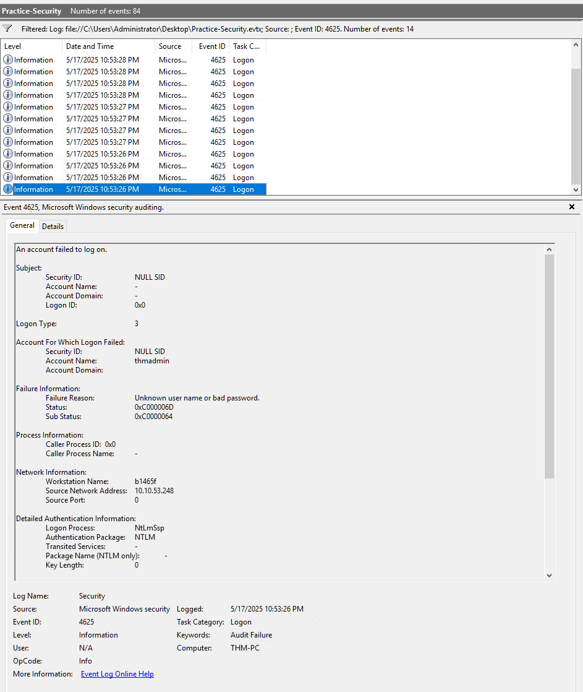
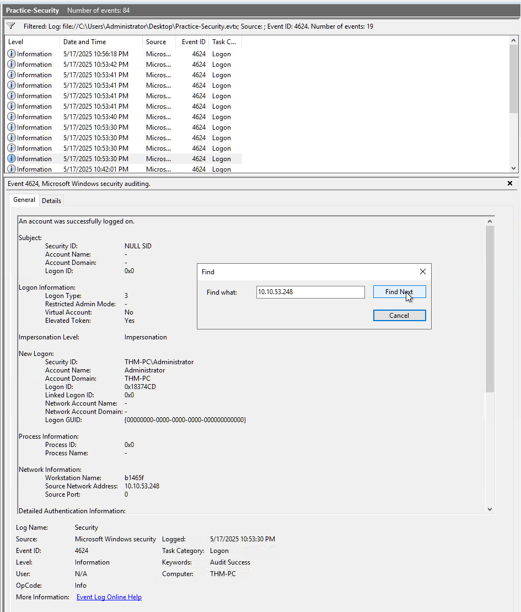
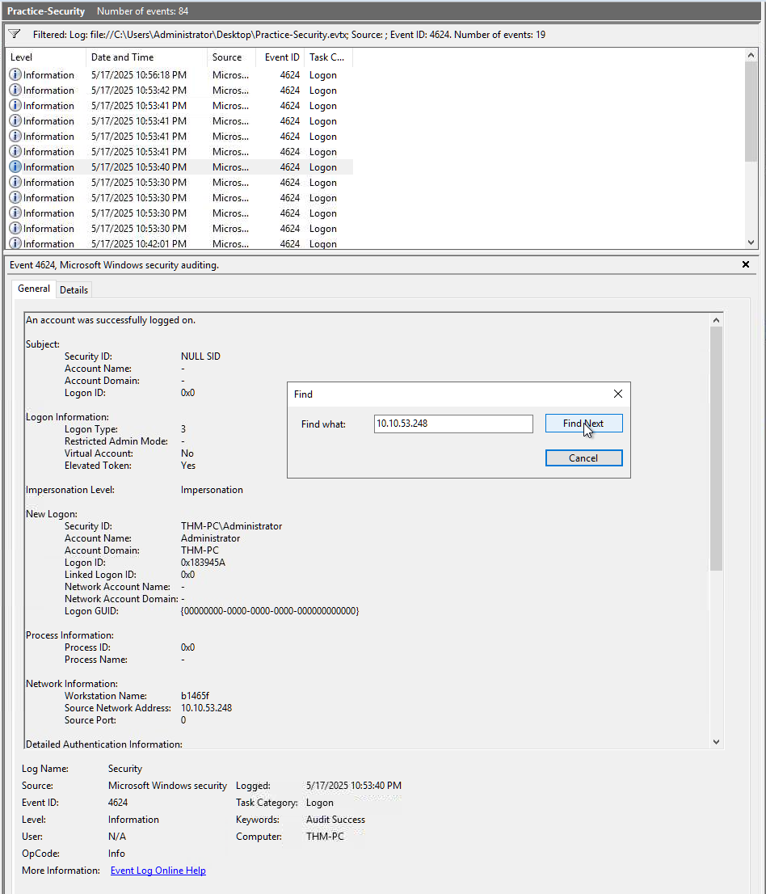
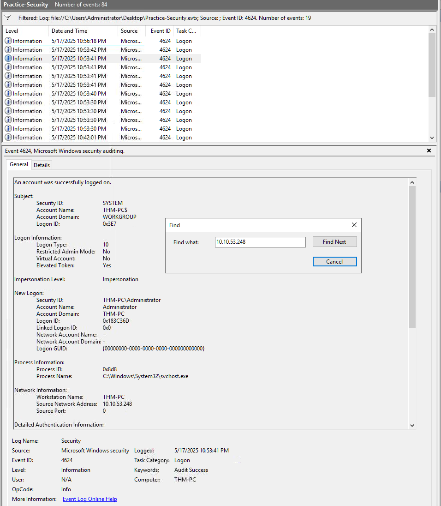
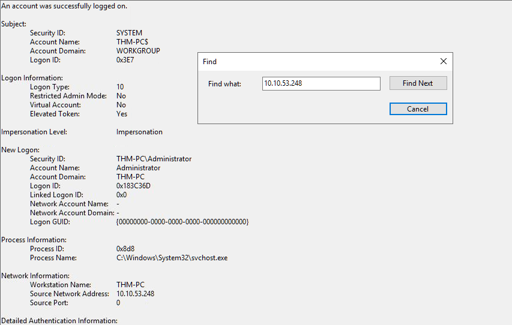
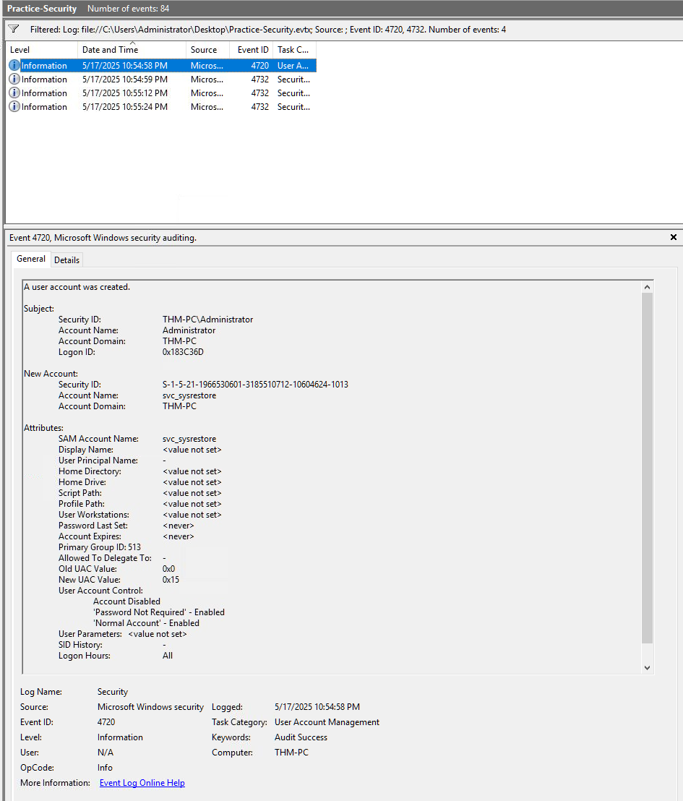
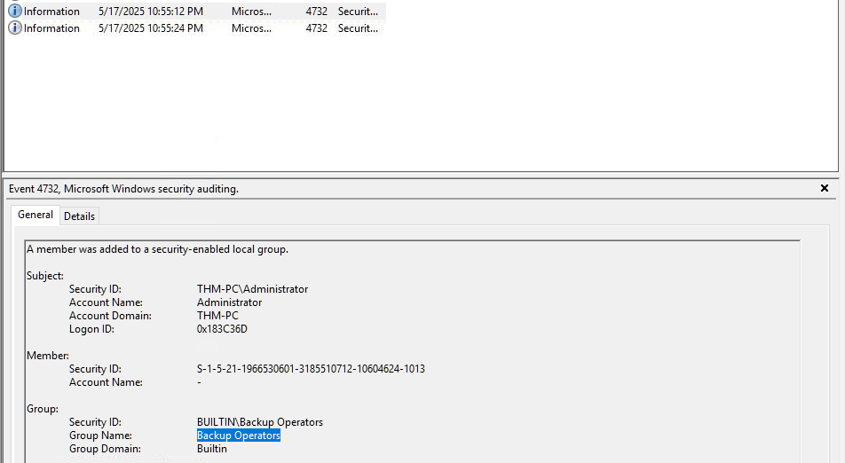
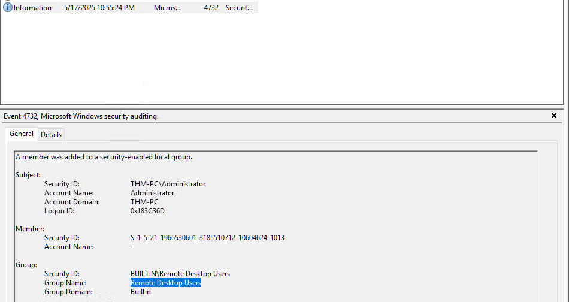
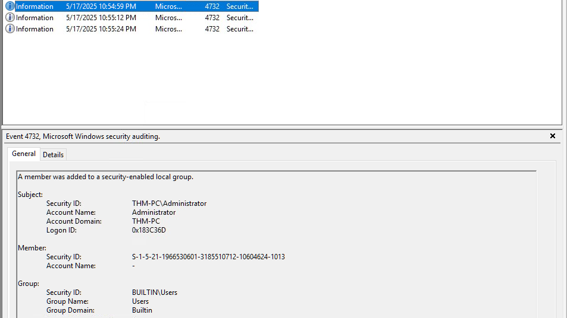

# Forensic Analysis: Investigating RDP Brute Force and Backdoor Persistence

**Environment:** TryHackMe - Windows Logging for SOC - Virtual Lab.

**Lab Objective:** The purpose of this investigation is to identify a multi-stage attack involving a network-based brute force, initial account compromise, and the establishment of persistent administrative access via a backdoor account. I will demonstrate how to correlate disparate Windows Event Logs to reconstruct a malicious actor's timeline.

**Tools and Technologies:**
* Windows Event Viewer (Local)
* Windows Security Auditing (Event IDs 4624, 4625, 4720, 4732)
* Log Filtering and XML Querying
* Remote Desktop Protocol (RDP) Analysis

---


### Phase 1: Detecting the Reconnaissance (Brute Force)
The first step in my investigation was to determine if the target machine was under active attack. I began by filtering the Security logs for failed logon attempts.

```xml
<QueryList>
  <Query Id="0" Path="Security">
    <Select Path="Security">
      *[System[(EventID=4625)]]
      and
      *[EventData[Data[@Name='LogonType']='3']]
    </Select>
  </Query>
</QueryList>
```

**Why?:** Event ID 4625 is generated every time a logon request fails. I specifically looked for Logon Type 3, which indicates a network-based connection. In modern Windows environments with Network Level Authentication (NLA) enabled, brute force attempts over the network will trigger Type 3 events rather than Type 10 (RDP), as the authentication occurs before the full desktop session is initialized. Instead of using XLM Querying, a more approachable way to do this is simply using the filter by event ID 4625 and looking for the events with Logon Type 3.

**Investigation Findings:** I discovered 14 failed attempts originating from the source IP 10.10.53.248. The attacker was targeting various account names, including "thmadmin," suggesting a password spraying or brute force strategy. The high frequency of these logs—several per second—is a definitive indicator of automated malicious activity.

**SOC Context & Blue Team:** This phase highlights the importance of monitoring for a high volume of 4625 events. Rapid failures from a single source IP should trigger an automatic block or alert within a SIEM to prevent successful entry.



### Phase 2: Identifying the Breach (Initial Access)
After identifying the brute force, I needed to see if any of these attempts were successful. I shifted my focus to successful logon events correlated with the attacker's IP.

```xml
<QueryList>
  <Query Id="0" Path="Security">
    <Select Path="Security">
      *[System[(EventID=4624)]]
      and 
      *[EventData[Data[@Name='IpAddress']='10.10.53.248']]
    </Select>
  </Query>
</QueryList>
```

**Why?:** Filtering by the known malicious IP address allows me to bypass "noise" from legitimate system accounts. I also tried a more approchable method than using XML Querying, simply filtering by event ID 4624 and using the *"Find"* tool within Event Viewer to isolate every instance where 10.10.53.248 successfully authenticated, it worked just fine.

**Investigation Findings:** My search revealed three successful logons for the local "Administrator" account. This confirms that the brute force was successful and the administrative credentials were compromised.







### Phase 3: Lateral Movement and RDP Pivot
While the attacker initially gained access via network credentials, I looked for evidence of a "hands-on-keyboard" session.

**The Investigation:** I analyzed the three successful logons for the Administrator account:
1. 10:53:30 PM: Logon Type 3 (Network) - Initial credential validation.
2. 10:53:40 PM: Logon Type 3 (Network) - Secondary automated check.
3. 10:53:41 PM: Logon Type 10 (Remote Desktop) - The transition to manual control.

**The Unique Identifier:** The third login is the most critical. By transitioning to Logon Type 10, the attacker gained full GUI access. Windows assigned this specific RDP session the **Logon ID: 0x183C36D**. I noted this ID as it is the "thread" I used to pull together all subsequent actions.

**SOC Context & Blue Team:** The pivot from Type 3 to Type 10 within seconds is a major red flag. It indicates that the attacker is no longer just running scripts but has established a visual session to perform more complex tasks.



### Phase 4: Establishing Persistence (Backdoor Creation)
Once the attacker secured an RDP session, I investigated their efforts to maintain access. I filtered the logs for user account management events.

```powershell
# Filtering for account creation and group modification
EventID: 4720, 4732
```

**Why?:** 4720 logs the creation of a new user, while 4732 logs when a member is added to a security-enabled group. Attackers use these to create "backdoor" accounts that remain even if the primary Administrator password is reset.

**Investigation Findings:** At 10:54:58 PM, exactly one minute after the RDP session began, a new user named **svc_sysrestore** was created.

**Troubleshooting & Analysis:** At first glance, the name might look legitimate. However, I identified several critical red flags:
* **Subject Correlation:** The Subject Logon ID for this creation was 0x183C36D, proving it was done by the malicious RDP session.
* **Suspicious Attributes:** The account was created with "Password Not Required" enabled and a blank Display Name, which is typical for manual net user commands rather than official system processes.
* **Deceptive Naming:** The name "svc_sysrestore" is a masquerading technique used to hide among legitimate Windows services.
* **Suspicious Timing:** The time 10:54:58 PM on a Saturday is highly suspicious.



### Phase 5: Privilege Escalation
Finally, I examined the permissions granted to this new account.

**Investigation Findings:** Using the same filter, I found three 4732 events for the "svc_sysrestore" user within seconds:
1. 10:54:59 PM: Added to the "Users" group (Standard).
2. 10:55:12 PM: Added to **Backup Operators**.
3. 10:55:24 PM: Added to **Remote Desktop Users**.

**The Goal of These Groups:**
* **Remote Desktop Users:** Provides the attacker the ability to log back into the GUI without needing the compromised Administrator account.
* **Backup Operators:** This is a stealthy "Ghost Admin" move. This group can bypass file system permissions to "backup" any file. This allows the attacker to steal sensitive data or dump the SAM database to obtain password hashes for the entire domain.

**SOC Context & Blue Team:** Monitoring for 4732 events where users are added to "Backup Operators" is often overlooked compared to the "Administrators" group. This investigation proves that "Backup Operators" is a high-value target for attackers seeking stealthy persistence.







---

## Implications for a SOC Analyst
This exercise demonstrates the necessity of "session tracking" using Logon IDs. By following the ID **0x183C36D**, I was able to link an external IP address to a brute force attack, an account compromise, and finally the creation of a high-privilege backdoor. For a defender, this highlights that an investigation is not complete until the full timeline—from initial access to persistence—is mapped. Detecting a failed login is good; detecting the "Ghost Admin" account created 60 seconds after a successful login is what prevents a total breach.

---
*End of Lab report.*