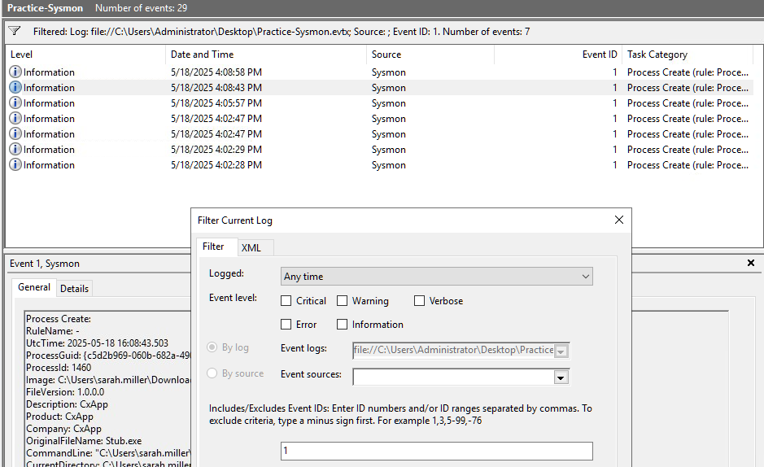
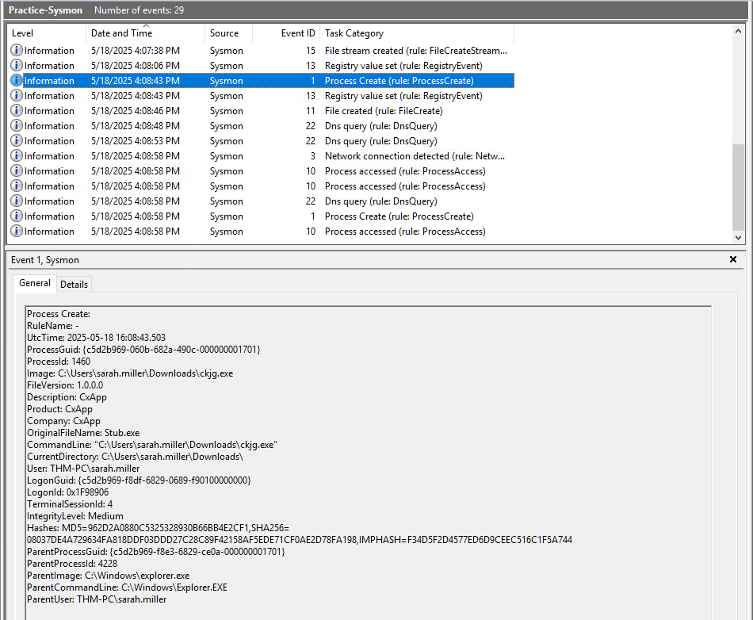
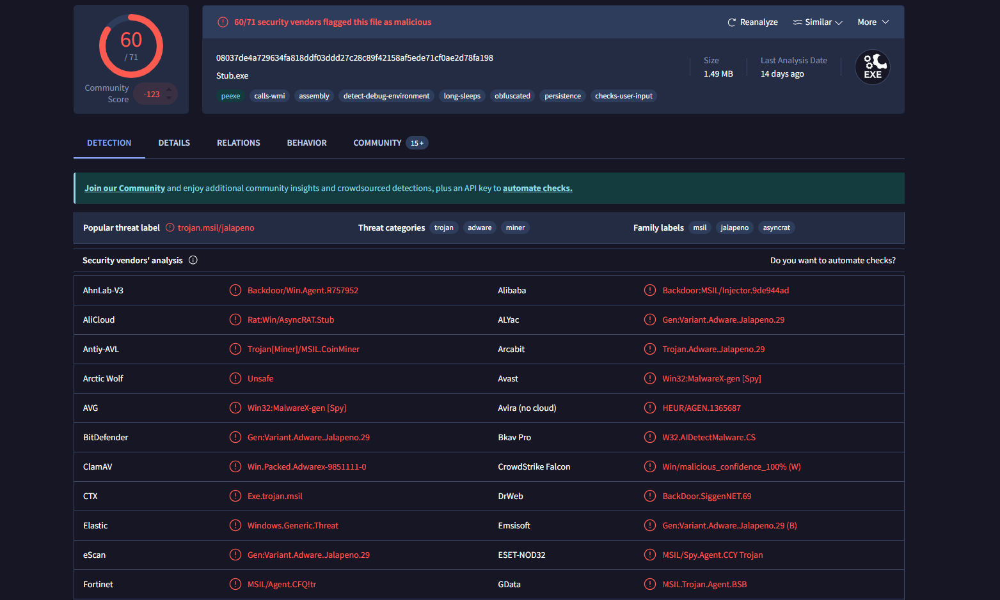
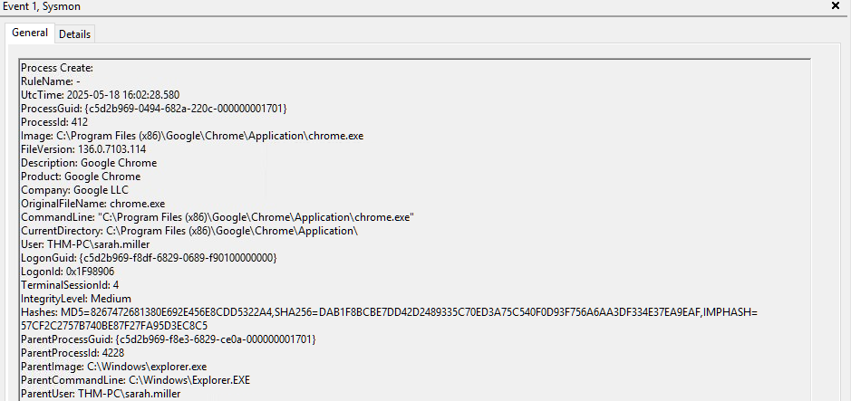
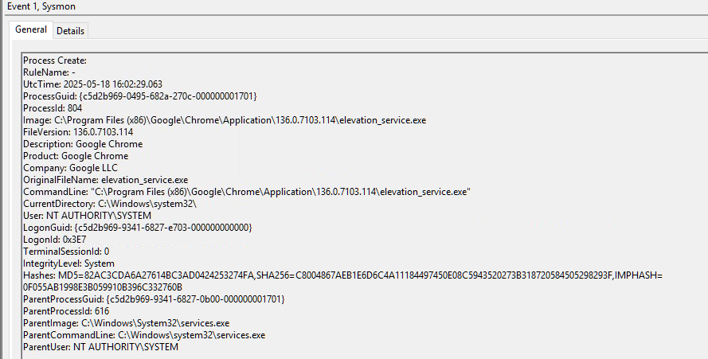
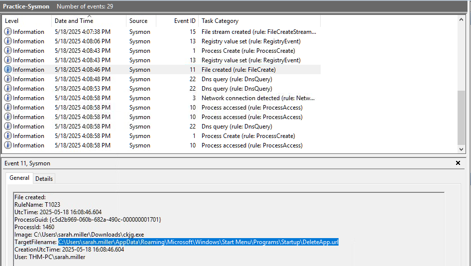
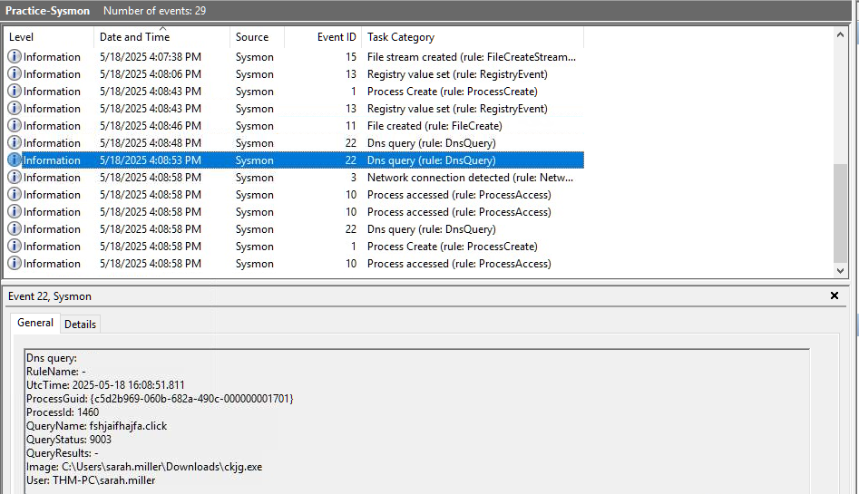
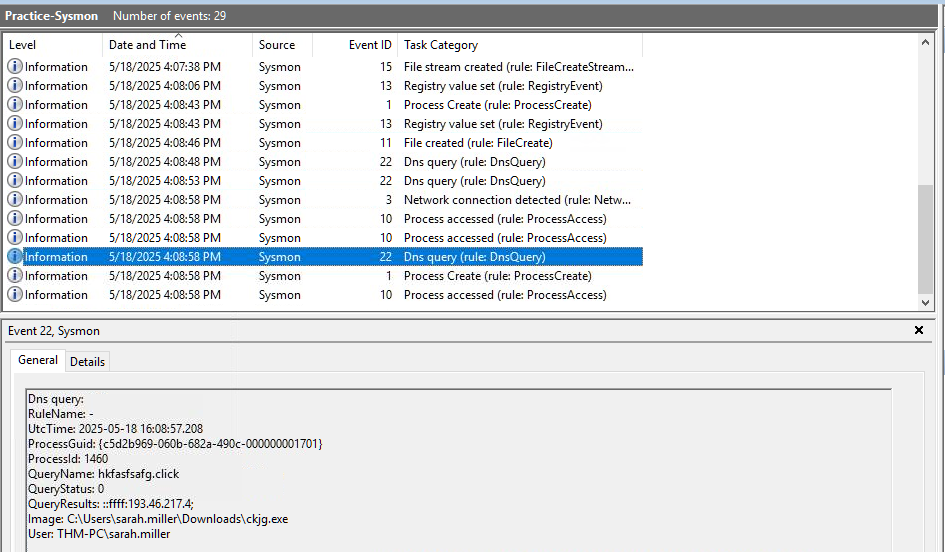
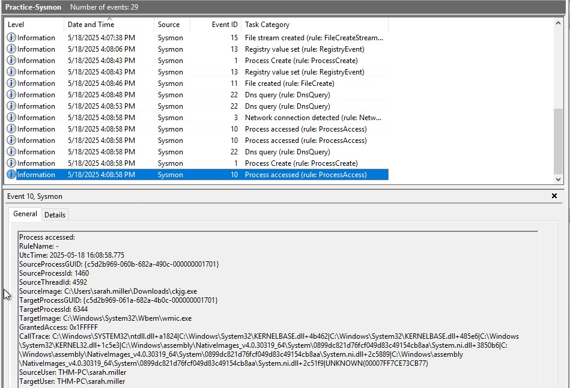
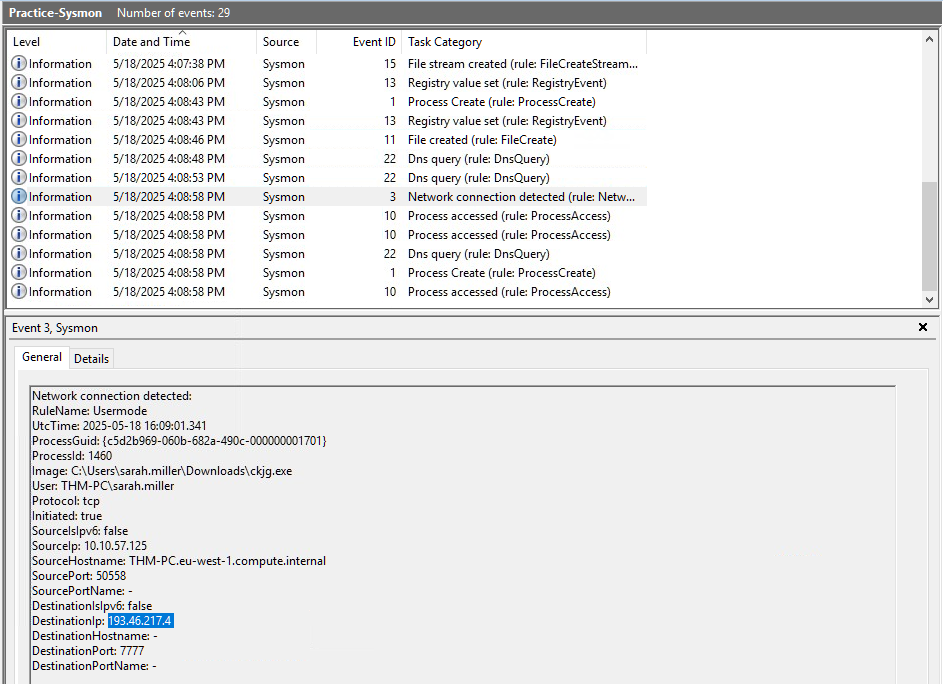

# Sysmon Forensics: Tracing the Malicious Lifecycle of a C2 Infection

**Environment:** TryHackMe - Windows Logging for SOC - Virtual Lab.

**Lab Objective:** The purpose of this investigation is to utilize Sysmon (System Monitor) to perform a deep-dive forensic reconstruction of a malware infection. I will demonstrate how to transition from basic process detection to analyzing advanced behaviors, including Domain Generation Algorithms (DGA), persistence mechanisms, and Command & Control (C2) establishment.

**Tools and Technologies:**
* Microsoft Sysmon (Event IDs 1, 3, 10, 11, 22)
* Windows Event Viewer
* VirusTotal (Threat Intelligence)
* Process Tree Analysis & PID Correlation

---

## Lab Content

### Phase 1: Identifying the Initial Execution (Process Launch)
The investigation began by scoping the environment for suspicious process creations within a known attack timeframe. Below you have the XML XPath Query that can be used in the Event viewer, but a simple filter for Events 1 worked fine too for this case.

```powershell
<QueryList>
  <Query Id="0" Path="Microsoft-Windows-Sysmon/Operational">
    <Select Path="Microsoft-Windows-Sysmon/Operational">
      *[System[(EventID=1)]]
    </Select>
  </Query>
</QueryList>
```

**Why?** Sysmon Event ID 1 serves as the "birth certificate" for every process. Unlike standard Windows logging, it provides the full command line, file hashes, and parent process details necessary to identify the "first domino" in an attack chain.



**Investigation Findings:** I identified a suspicious binary, `ckjg.exe`, executed from `C:\Users\sarah.miller\Downloads`. 
* **Red Flags:** The file path is a high-risk directory for drive-by downloads. The MD5 hash returned a **60/71 malicious rating** on VirusTotal. Furthermore, the `OriginalFileName` was `Stub.exe`, proving the file was intentionally renamed to mask its purpose.
* **Parent Analysis:** The parent process was `explorer.exe` (PID 4228), indicating the user manually double-clicked the file.





**SOC Context & Blue Team:** Analyzing the "Parent-Child" link is vital. By "walking the tree," I discovered that both `chrome.exe` and the malware shared the same parent (`explorer.exe`) and user, suggesting the infection originated during a web browsing session.



### Phase 2: Distinguishing Signal from Noise (False Positive Analysis)
During the search, I identified `elevation_service.exe` running as `SYSTEM`.



**Explanation:** High-privilege processes often trigger alerts. However, a "Reality Check" confirmed the image path was within the legitimate Google Chrome application folder and signed by Google LLC.

**Troubleshooting & Resolution:** I verified the `ParentImage` was `services.exe` (Windows Service Control Manager). This confirmed the process was a legitimate administrative component of Chrome used for updates, not an escalation attempt. 

**SOC Context & Blue Team:** The "Golden Rule" of Sysmon hunting is comparing the `Image` path with the `OriginalFileName` and `Company`. Legitimate binaries stay in protected folders; masquerading binaries often land in `\Temp` or `\Public`.

### Phase 3: Tracking the Malicious Lifecycle (PID 1460)
Using the anchor PID **1460**, I reconstructed the attacker's post-exploitation timeline step-by-step.

#### **Step 1: Persistence Mechanism**
* **Event ID 11 | 4:08:46 PM:** Only three seconds after execution, the malware created `DeleteApp.url` in the `..\Start Menu\Programs\Startup\` folder.
* **Analysis:** This ensures the malware survives a reboot. Even if the process is killed, it will re-infect the system upon the next login.



#### **Step 2: DGA & DNS Beaconing**
* **Event ID 22 | 4:08:48 PM:** The malware began querying random domains like `fshjaifhajfa.click`.
* **Analysis:** These returned **Status 9003 (NXDOMAIN)**. This confirms a **Domain Generation Algorithm (DGA)** where the malware "hunts" for an active command server.



* **Success:** At 4:08:58 PM, a query for `hkfasfsafg.click` returned **Status 0 (Success)**, providing the attacker's IP: **193.46.217.4**.



#### **Step 3: Evasion via Process Access**
* **Event ID 10 | 4:08:58 PM:** PID 1460 requested **Full Access (0x1FFFFF)** to the memory space of `wmic.exe`.
* **Analysis:** This is an indicator of **Process Injection**. The malware attempts to hide its malicious code inside a legitimate Windows utility to bypass security monitoring.



#### **Step 4: Command & Control (C2) Established**
* **Event ID 3 | 4:09:01 PM:** A TCP connection was established to `193.46.217.4` on **Port 7777**.
* **Analysis:** The `Initiated: true` field confirms an outbound connection. Port 7777 is a non-standard "back-alley" port used to bypass basic firewall filters. The attacker now has a functional reverse shell.



---

## Implications for a SOC Analyst
This forensic reconstruction demonstrates the power of Sysmon in tracking the full "Kill Chain." By correlating PID 1460 across multiple event types, I linked a simple file download to an active C2 session. The discovery of the DGA success and the startup persistence provides the specific Indicators of Compromise (the malicious IP and the registry/file paths) needed to remediate the threat across the entire enterprise network.

---
*End of Lab report.*