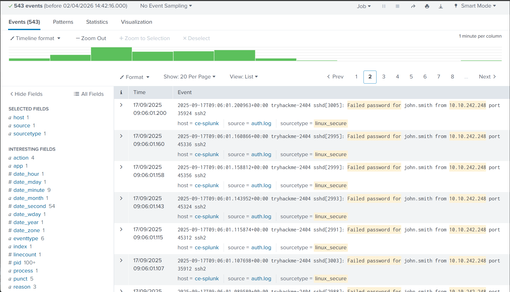
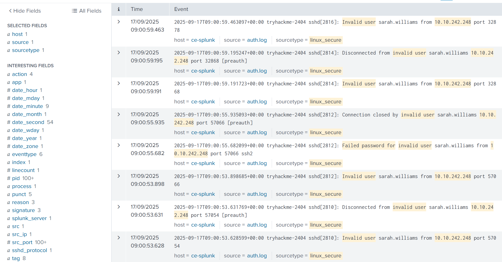
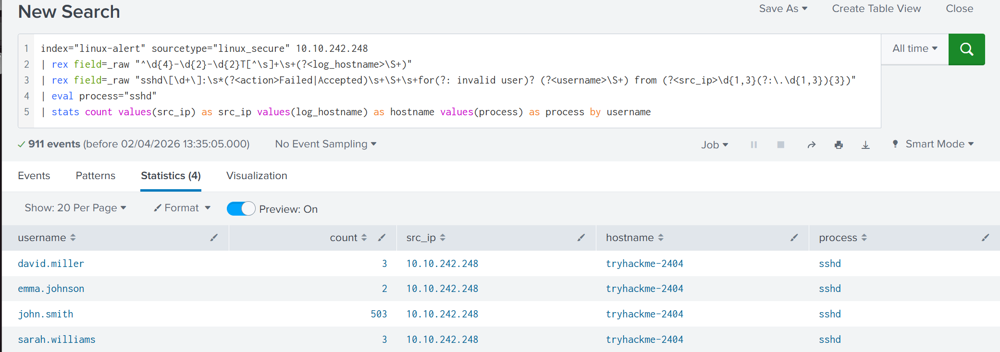
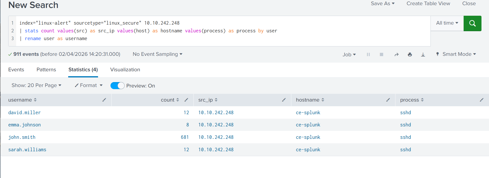
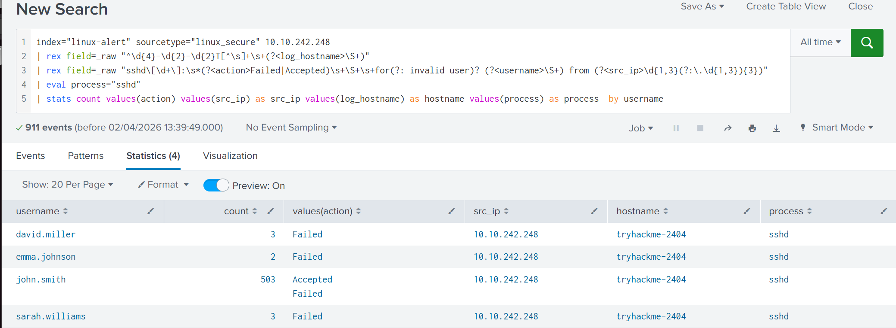
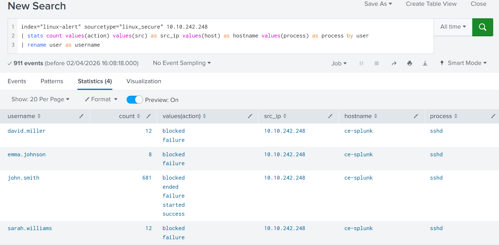
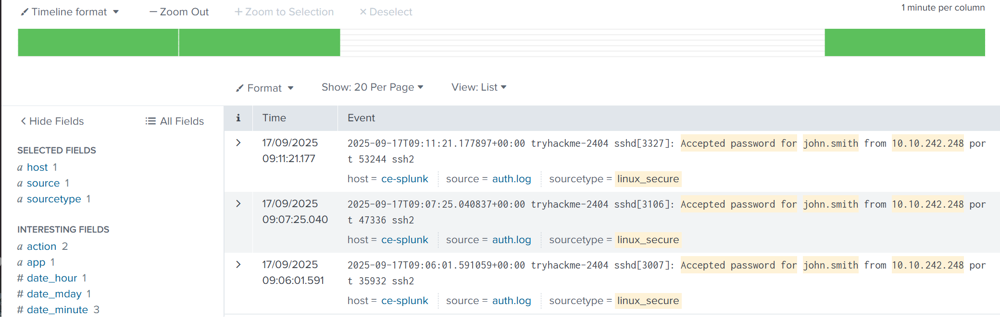
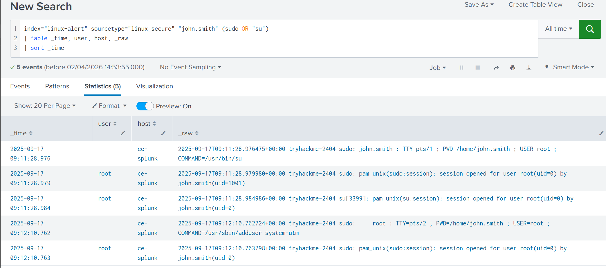

# Incident Report: Linux Brute Force Activity Detection

**Date:** 02-04-2026
**Investigator:** Gerard Diaz Gibert
**Environment:** TryHackMe - Alert Triage With Splunk - Virtual Lab
**Scenario:** Initial Access & Privilege Escalation on Linux Host

---

## 1. Alert Scenario & Initial Context
The investigation was triggered by a high-severity alert on the MSSP platform.

* **Alert Name:** Brute Force Activity Detection
* **Time:** 17/09/2025 9:00:21 AM
* **Target Host:** `tryhackme-2404`
* **Source IP:** `10.10.242.248`

**Initial Analyst Observation:** The Source IP is an **internal address**. This is a critical finding, suggesting the threat actor has already bypassed perimeter defenses (VPN, Phishing, etc.) or is a malicious insider. The hostname `tryhackme-2404` suggests a primary organizational server.

---

## 2. Phase 1: Authentication Triage
The first objective was to confirm if the alert was a True Positive by searching for easy indicators: Successful logins, failed passwords, and invalid user enumeration.

**Query:**
```splunk
index="linux-alert" sourcetype="linux_secure" 10.10.242.248 
| search "Accepted password for" OR "Failed password for" OR "Invalid user"
| sort + _time
```



**Interpretation:** The logs immediately revealed a high volume of events. Notably, attempts for non-existent users like `emma.johnson` and `sarah.williams` were observed, indicating **User Enumeration (MITRE T1087.001)**.



---

## 3. Phase 2: Statistical Correlation
To identify the primary target, I transformed the raw text logs into a structured table using two different methods to compare forensic precision against operational speed.

### Method A: Forensic Precision (Custom Regex)
This "surgical" query was used to filter strictly for authentication attempts, excluding background system noise. Since I am using Regular Expressions, the query is tricky to type, especially if I am investigating something under pressure, for easier but less precise results see next method.

**Query:**
```splunk
index="linux-alert" sourcetype="linux_secure" 10.10.242.248
| rex field=_raw "^\d{4}-\d{2}-\d{2}T[^\s]+\s+(?<log_hostname>\S+)"
| rex field=_raw "sshd\[\d+\]:\s*(?<action>Failed|Accepted)\s+\S+\s+for(?: invalid user)? (?<username>\S+) from (?<src_ip>\d{1,3}(?:\.\d{1,3}){3})"
| eval process="sshd"
| stats count values(src_ip) as src_ip values(log_hostname) as hostname values(process) as process by username
```



### Method B: Operational Triage (CIM-Based)
In a real-world production SOC, we utilize the **Common Information Model (CIM)** for speed. This uses pre-defined fields automatically extracted by Splunk.

**Query:**
```splunk
index="linux-alert" sourcetype="linux_secure" 10.10.242.248
| stats count values(src) as src_ip values(host) as hostname values(process) as process by user
| rename user as username
```



### Analyzing the Results & Discrepancy
| Feature | Method A (Regex) | Method B (CIM/Non-Regex) |
| :--- | :--- | :--- |
| **`john.smith` Count** | **503** | **681** |
| **Hostname** | Target: `tryhackme-2404` | Metadata: `ce-splunk` |

The Regex query provided cleaner data (503 actual password guesses). The CIM query captured more "noise" (session disconnects/started events), leading to a higher count. However, **both queries lead to the same tactical conclusion:** `john.smith` is the victim of a high-velocity brute-force attack.

---

## 4. Phase 3: Confirming Breach & Escalation
To determine if the brute force attack was successful, I pivoted from counting attempts to identifying successful authentications. By adding the `action` field to our stats, we looked for the successful "Accepted password" log.

### Method A: Forensic Precision (Custom Regex)
This query identifies the literal "Accepted" string within the SSH daemon logs. Again, I am using regular expressions, next method is more standard and suited for investigations under pressure and under the clock.

**Query:**
```splunk
index="linux-alert" sourcetype="linux_secure" 10.10.242.248
| rex field=_raw "^\d{4}-\d{2}-\d{2}T[^\s]+\s+(?<log_hostname>\S+)"
| rex field=_raw "sshd\[\d+\]:\s*(?<action>Failed|Accepted)\s+\S+\s+for(?: invalid user)? (?<username>\S+) from (?<src_ip>\d{1,3}(?:\.\d{1,3}){3})"
| eval process="sshd"
| stats count values(action) values(src_ip) as src_ip values(log_hostname) as hostname values(process) as process  by username
```



### Method B: Operational Triage (CIM-Based)
This query uses the standardized `action` field mapped by Splunk’s Linux Technical Add-on (TA).

**Query:**
```splunk
index="linux-alert" sourcetype="linux_secure" 10.10.242.248
| stats count values(action) as action values(src) as src_ip by user
| rename user as username
```



### Analyzing the "Action" Field Discrepancy
While both queries confirm the breach, the way they present the "Action" column differs due to how Splunk processes raw data vs. mapped data:

* **Regex Output (`Accepted` / `Failed`):** These are **literal strings** pulled directly from the raw log text. They provide the rawest forensic evidence of the SSH handshake outcome.
* **CIM Output (`success` / `failure` / `blocked`):** These are **normalized values**. Splunk's CIM translates various raw terms (like "Accepted," "Login Succeeded," or "Authenticated") into a universal "success" category. This is useful for cross-platform reporting but can mask the specific technical terminology of the underlying OS.



**Findings:**
* **Breach Confirmation:** The attacker successfully compromised the `john.smith` account at **09:06:01 AM**, as evidenced by the `Accepted` / `success` status in the logs.
* **Status:** True Positive.
* **Action:** Alert escalated to SOC L2 and Incident Response for immediate containment and forensic imaging of the host `tryhackme-2404`.

---

## 5. Post-Escalation: Deep Dive (Privilege Escalation & Persistence)
Although the alert was escalated, I continued the investigation to determine the attacker's "Post-Exploitation" behavior by monitoring the **Execution Logs**.

**Query:**
```splunk
index="linux-alert" sourcetype="linux_secure" "john.smith" (sudo OR "su") 
| table _time, user, host, _raw 
| sort _time
```



**Forensic Timeline:**
1.  **Escalation Attempt (09:11:28):** Attacker executed `su` to switch to root.
2.  **Privilege Escalation (09:11:28):** Attacker successfully opened a root session (**MITRE T1548.003**).
3.  **Persistence (09:12:10):** Attacker executed `/usr/sbin/adduser system-utm`.

**Persistence Analysis:** The name `system-utm` (Unified Threat Management) is a clever attempt at **Masquerading (T1036)**. It is designed to look like a legitimate security service to avoid detection by system administrators.

---

## 6. Analyst Notes & Lessons Learned
* **Operational Reality:** While the complex `rex` query is excellent for forensics, in a live "firefight," SOC analysts rely on "Gold Standard" query libraries or built-in Field Extractors to save time.
* **The "Why" of Regex:** Precision `rex` is reserved for custom applications, obfuscated logs, or massive data volumes where standard CIM searches are too broad or slow.

---