# Memory Forensics Investigation: Cridex Banking Trojan with Volatility

## Disclaimer

This investigation was conducted on `cridex.vmem`, a memory image publicly distributed by the Volatility Foundation as a reference training sample. It is not a live incident response case. The dump is widely used across the memory forensics community precisely because it captures a fully documented Cridex infection without requiring an analyst to infect a machine to generate their own sample. All findings below are the result of an independent analysis of that public dataset, conducted to practice a complete forensic workflow from initial network triage to API hook analysis.

## TL;DR

Analysis of a Windows XP SP2 memory image revealed an active Cridex banking trojan infection. The malware masqueraded as `Reader_sl.exe`, an Adobe Reader component, while maintaining two live command and control connections over port 8080. Process injection was confirmed in both `explorer.exe` and the malicious process itself, carrying an identical payload with no file backing. API hook analysis of that injected code revealed a complete man-in-the-browser architecture: SSL/TLS interception at the SSPI layer (Secur32.dll), socket-level interception (WS2_32.dll), certificate theft (CRYPT32.dll), and self-propagation into newly spawned processes via ntdll.dll hooking. Registry analysis confirmed persistence through a Run key entry disguised as a Windows update. The investigation produced a full IOC set along with SIEM detection logic mapped to the artifacts recovered.

## Environment

- Memory image: `cridex.vmem`
- Analysis platform: Volatility Framework 2.6
- Identified profile: WinXPSP2x86

## Lab Objective

Retrace the complete compromise chain of a Cridex infection using Volatility, from initial network anomaly to confirmed malicious capability, and extract a set of IOC and detection rules usable by a SOC team to identify other infected hosts.

## Tools and Technologies

- Volatility Framework 2.6
- VirusTotal
- strings, grep

## Investigation

### Profile Identification

The first step in any Volatility investigation on a raw memory image is identifying the correct OS profile, since every subsequent plugin depends on the right memory structure definitions.

```
volatility -f cridex.vmem imageinfo
```

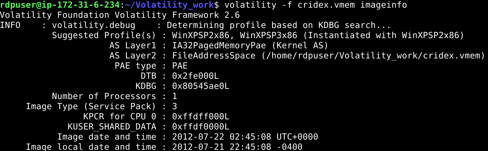

The suggested profile is `WinXPSP2x86`. This value is passed to every command for the remainder of the investigation.

### Network Triage

The investigation begins at the network layer with `connscan`, the Volatility equivalent of `netstat` for historical connection artifacts. `connscan` works by scanning the memory pool for connection objects, which means it can recover connections that have already been closed but whose structures remain in memory.

```
volatility -f cridex.vmem --profile=WinXPSP2x86 connscan
```

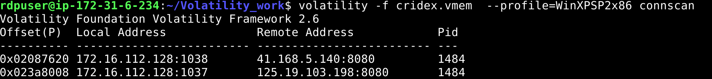

Two outbound connections stand out, both sharing PID 1484:

- `172.16.112.128:1038` to `41.168.5.140:8080`
- `172.16.112.128:1037` to `125.19.103.198:8080`

Two distinct external IPs, same destination port, same owning process. Port 8080 is a non-standard HTTP port frequently used for proxy traffic or alternate web services, which is enough on its own to warrant qualification.

### IP Qualification

Both addresses are checked against VirusTotal.

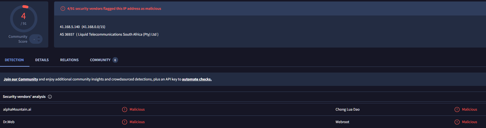

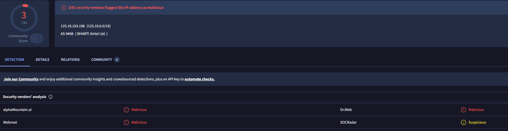

`41.168.5.140` is flagged malicious by multiple engines. `125.19.103.198` carries a historical malicious flag under the Relations tab. Both IPs are treated as confirmed C2 infrastructure at this point, and PID 1484 becomes the pivot for the rest of the investigation.

### Live State Verification

`sockets` reports the sockets actually allocated at the instant the memory was acquired, as opposed to `connscan`'s pool-scan approach which can surface historical, already-closed connections.

```
volatility -f cridex.vmem --profile=WinXPSP2x86 sockets
```

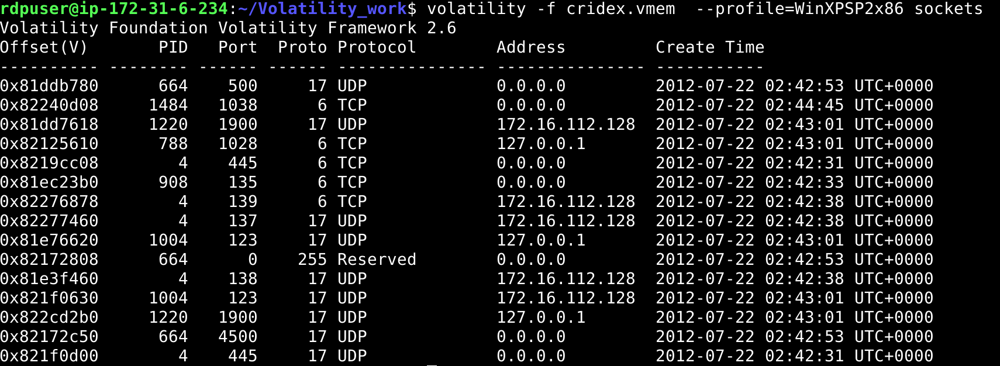

Only port 1038 appears in this output. `connscan` had reported two connections, on local ports 1037 and 1038. This discrepancy is not noise, it is informative. `sockets` reflects the live socket table, while `connscan`'s pool scan can pick up connection objects that persist in memory after the socket itself has been torn down.

The practical read: the connection to `41.168.5.140:8080` (port 1038) was still active at the moment of acquisition, while the connection to `125.19.103.198:8080` (port 1037) had likely already been closed, its only remaining trace being the pool-scanned object found by `connscan`. This distinction has direct operational value. Only a connection that is still live can be blocked or intercepted in real time; a connection that has already closed is historical evidence, not something a containment action can act on.

### Process Attribution

`pstree` maps PID 1484 to its actual process.

```
volatility -f cridex.vmem --profile=WinXPSP2x86 pstree
```

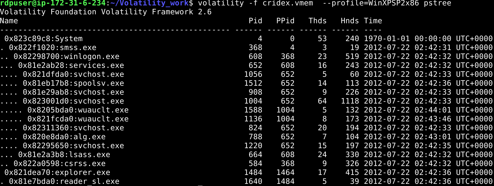

PID 1484 is `explorer.exe`, and it spawned `Reader_sl.exe` (PID 1640). This is the second red flag in the chain: Explorer, not a browser, is the process making outbound HTTP connections.

A dissimulation check follows with `psxview`, which cross-references multiple process enumeration methods to detect processes that have been unlinked from standard OS tracking structures, a common rootkit technique.

```
volatility -f cridex.vmem --profile=WinXPSP2x86 psxview
```

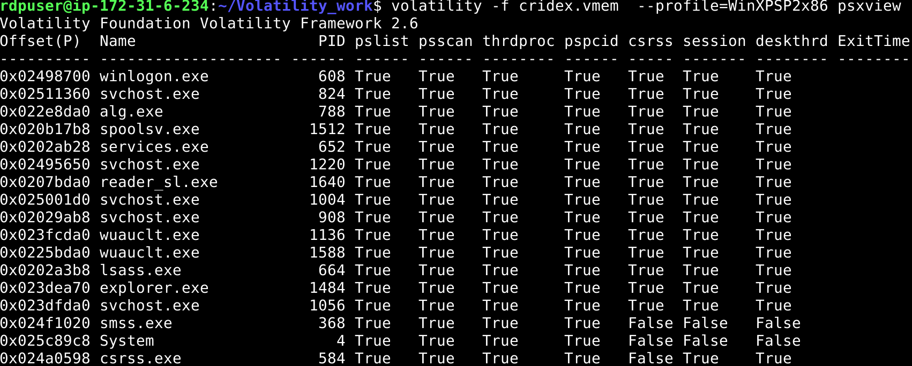

No process shows a `False` value across the key columns (`pslist`, `psscan` in particular). No process hiding is detected. This does not clear the investigation, it only rules out one specific evasion technique. The compromise, if confirmed, is happening in plain sight rather than through rootkit-style concealment.

`cmdscan` and `consoles` were checked for command history with no exploitable result. Command lines for every running process were then reviewed with `cmdline`.

```
volatility -f cridex.vmem --profile=WinXPSP2x86 cmdline
```

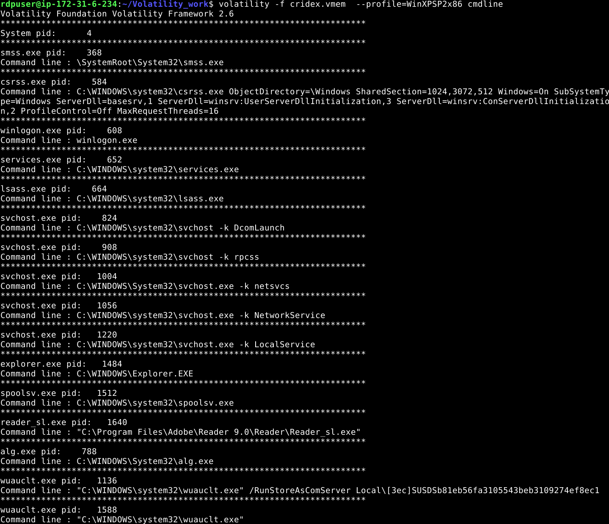

`Reader_sl.exe` runs from `C:\Program Files\Adobe\Reader 9.0\Reader\Reader_sl.exe`, a path consistent with a legitimate Adobe Reader component. Yet this is the process responsible for the anomalous outbound traffic identified earlier. A legitimate-looking binary at a legitimate-looking path, generating traffic it has no business generating, is a strong signal of compromise through binary masquerading rather than a dropped, obviously foreign executable.

### Process Extraction and Payload Confirmation

To confirm the suspicion, the process is extracted two ways: `procdump` pulls the executable image, `memdump` pulls the full addressable memory of the process.

```
volatility -f cridex.vmem --profile=WinXPSP2x86 procdump -p 1640 -D .
volatility -f cridex.vmem --profile=WinXPSP2x86 memdump -p 1640 -D .
```

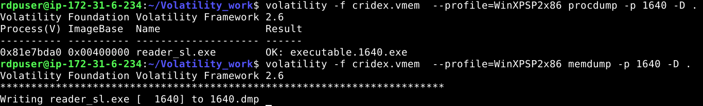

Two files are produced: `executable.1640.exe` and `1640.dmp`. A string search for the known C2 IP inside the memory dump recovers the actual network traffic generated by the process.

```
strings 1640.dmp | grep "41.168.5.140" -C 5
```

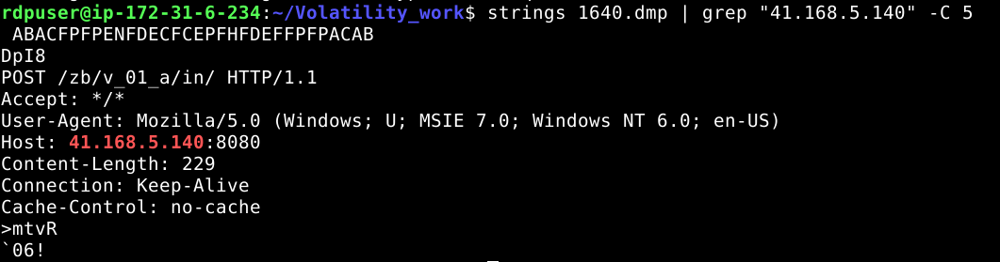

The process issues an HTTP POST request to `/zb/v01a/in/` on `41.168.5.140:8080`, consistent with data exfiltration to a C2 endpoint.

A broader review of the dump surfaces a large list of banking institution domains, hard-coded targets for credential theft.

```
strings 1640.dmp | less
```

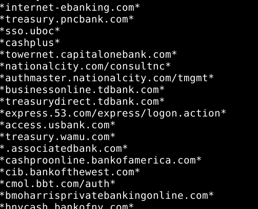

The extracted executable is submitted to VirusTotal, confirming its malicious nature outright, with 21 out of 71 engines flagging it as a trojan.

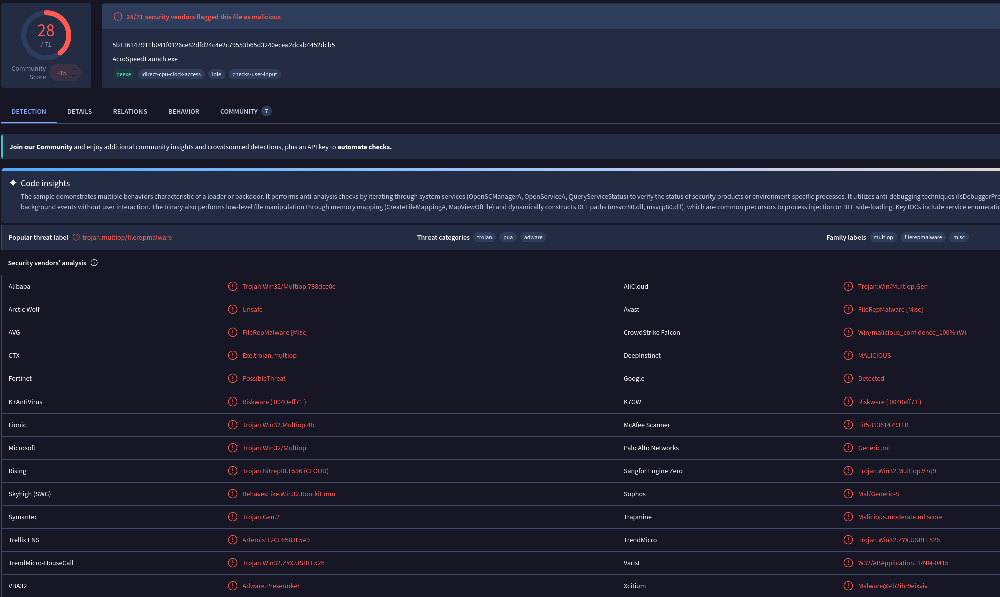

At this point the compromise is fully confirmed. `Reader_sl.exe` is a Cridex banking trojan masquerading as an Adobe Reader component, targeting banking credentials for exfiltration to a C2 server.

### IOC Expansion

Since this executable could plausibly have reached other hosts through the same phishing campaign, the objective shifts toward extracting the maximum usable IOC set for the SOC to hunt across the rest of the environment.

Searching for the exfiltration URI pattern recovers a second, previously unseen C2 address.

```
strings 1640.dmp | grep -Fi "zb/v_01_a/in/"
```

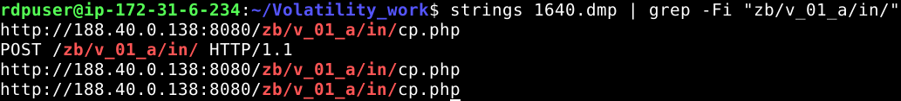

A second address, `188.40.0.138:8080`, is confirmed. This IP was not visible in either `connscan` or `sockets`, it only surfaces through pattern searching inside the extracted process memory, which is a reminder that network-layer plugins alone do not guarantee full C2 infrastructure visibility. A malware family can reference multiple C2 endpoints in its configuration without every one of them being actively connected at the time of acquisition.

Historical domain resolution for both confirmed IPs would normally be checked next through a passive DNS service. This step extends the IOC base for SIEM detection tuning, particularly useful if the C2 infrastructure rotates IP addresses while retaining an associated domain.

### Persistence

Most malware families need to survive a reboot. Registry Run key entries are checked next.

```
volatility -f cridex.vmem --profile=WinXPSP2x86 printkey -K "Software\Microsoft\Windows\CurrentVersion\Run"
```

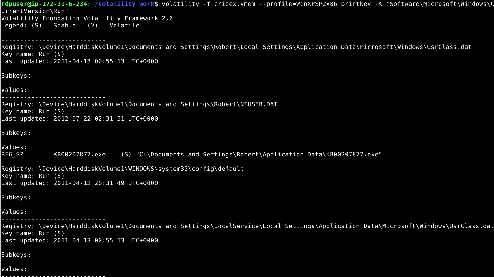

The only recently modified hive is `\Device\HarddiskVolume1\Documents and Settings\Robert\NTUSER.DAT`, launching `KB00207877.exe` at startup. The naming convention mimics a Windows Knowledge Base update, a deliberate choice designed to blend into legitimate patch activity and avoid casual scrutiny (T1112, T1547.001).

The link between this persistence entry and the confirmed malicious process is verified by searching for it inside the extracted process memory.

```
strings 1640.dmp | grep -Fi "KB00207877.exe"
```

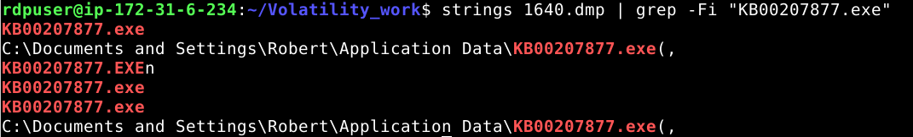

The reference is confirmed. Removing `KB00207877.exe` and its Run key entry is a required step for complete remediation of the infected host.

### Process Injection

Beyond network activity and persistence, the investigation turns to whether the malware has injected code into other processes on the system. `malfind` scans for memory regions carrying executable protection that either lack a backing file on disk or begin with a PE header, both abnormal for legitimate loaded code.

```
volatility -f cridex.vmem --profile=WinXPSP2x86 malfind
```

The scan returns hits across four processes: `reader_sl.exe`, `explorer.exe`, `winlogon.exe`, and `csrss.exe`. Each result requires individual review rather than blanket treatment, since `malfind` flags on protection flags alone and does not verify actual content.

`reader_sl.exe` (PID 1640) shows a `VadS`-tagged, privately allocated region at `0x3d0000` with `PAGE_EXECUTE_READWRITE` protection and an `MZ` header at the start of the region, indicating a complete PE mapped into memory outside of normal module loading (T1055).

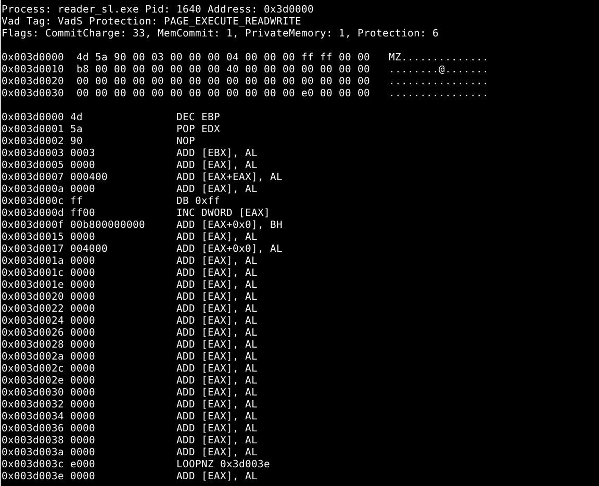

`explorer.exe` (PID 1484) shows an identical pattern at `0x1460000`: same `VadS` tag, same `PAGE_EXECUTE_READWRITE` protection, same `MZ` header, and critically, byte-for-byte identical header content to the region found in `reader_sl.exe`.

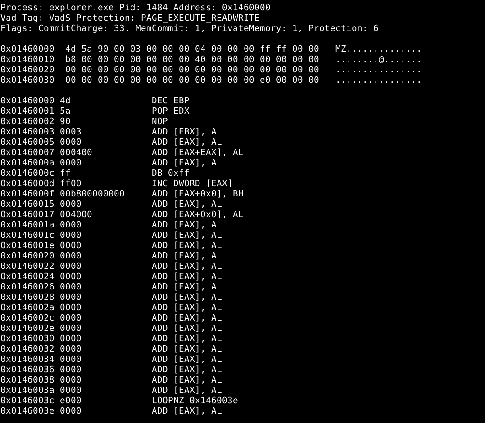

This is not two unrelated findings. The same injected module is present in both the parent process and its spawned child, which is consistent with the parent-child relationship already established through `pstree` and confirms the injection travels with the process lineage rather than being isolated to one binary.

The `winlogon.exe` (nine separate regions) and `csrss.exe` hits were reviewed and ruled out. Each of these regions consists almost entirely of null bytes with no `MZ` signature and no coherent code, Volatility's disassembly of these regions is simply decoding zero bytes rather than revealing shellcode. These are empty, allocated-but-unused private memory regions that happen to carry RWX protection, a known false positive category on this profile rather than evidence of injection. Treating every RWX hit as equally severe would have produced a misleading finding; the distinction between flagged and confirmed is preserved here deliberately.

### API Hook Analysis

With injection confirmed and scoped to `explorer.exe` and `reader_sl.exe`, the final step establishes exactly what capability the injected code provides. `apihooks` enumerates functions whose entry point has been redirected away from the legitimate module code.

```
volatility -f cridex.vmem --profile=WinXPSP2x86 apihooks
```

Every hook identified below is of type Inline/Trampoline, redirecting execution into the same unbacked, `<unknown>` memory region confirmed by `malfind`, which directly ties this capability back to the injected payload already identified.

**ntdll.dll: LdrLoadDll, NtResumeThread, ZwResumeThread**

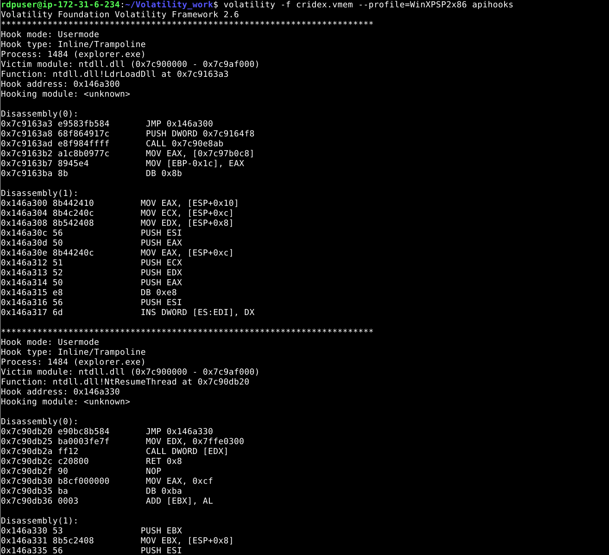

`LdrLoadDll` is invoked every time a module loads into a process, giving the malware a vantage point to propagate as new modules are loaded. `NtResumeThread` and `ZwResumeThread` intercept the resumption of threads created in a suspended state, a well documented technique for injecting code into a process before it is allowed to execute (T1055.012). This pairing explains why an identical payload was found in both `explorer.exe` and `reader_sl.exe`: the malware uses process creation interception to propagate itself automatically into newly spawned processes rather than relying on a single infected binary.

**Secur32.dll: DecryptMessage, EncryptMessage, InitializeSecurityContextA, InitializeSecurityContextW, DeleteSecurityContext, SealMessage, UnsealMessage**

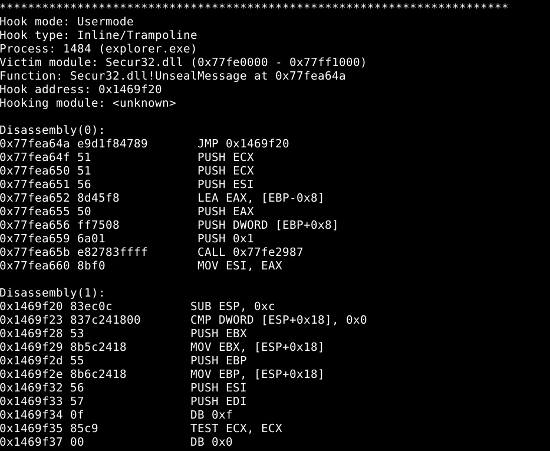

Secur32.dll is the Windows SSPI layer, responsible for wrapping and unwrapping data at the TLS boundary. Hooking `EncryptMessage` and `DecryptMessage` places the malware at the exact point where plaintext becomes ciphertext and back, meaning banking credentials and form data are captured on the host before encryption or after decryption. This is the core man-in-the-browser mechanism: the malware does not need to defeat TLS on the wire, since it owns both sides of the encryption boundary at the endpoint (T1557).

**WS2_32.dll: WSARecv, WSASend, send, recv, connect, closesocket, select**

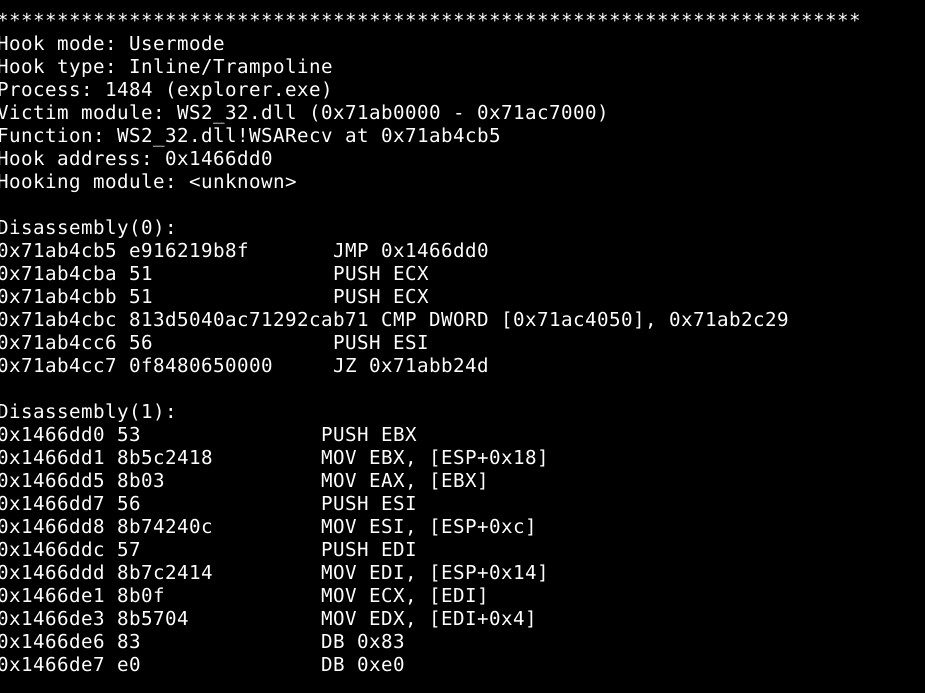

This is socket-level interception layered underneath the SSL hooks. Hooking `connect` gives the malware visibility into every outbound connection the host initiates, consistent with the C2 traffic already identified through `connscan` and `sockets`. Hooking `send`/`recv` and their WSA equivalents allows inspection or manipulation of raw socket data, which is the likely mechanism behind the redirection of outbound traffic toward the C2 infrastructure identified earlier.

**CRYPT32.dll: PFXImportCertStore**

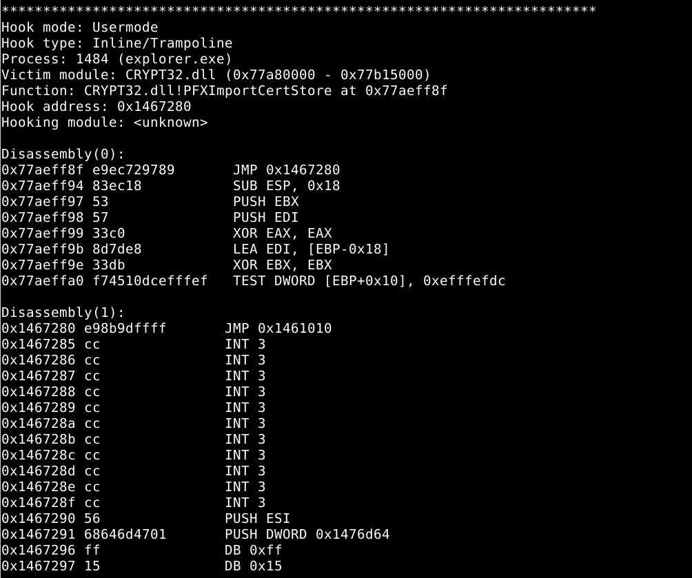

`PFXImportCertStore` handles the import of PFX certificate bundles into the Windows certificate store. This hook is consistent with certificate and private key theft, relevant where authentication relies on client-side certificates rather than passwords alone, a documented behavior across the Zeus/Cridex malware lineage.

Taken together, these hooks describe a complete man-in-the-browser architecture: SSL interception at the SSPI layer, socket-level interception beneath it, certificate theft, and self-propagation into new processes through thread-resume hijacking. This mechanism directly explains the banking domain list recovered earlier in the investigation, that list is the set of targets the hooks are watching for.

## IOC Summary

| Type | Value | Context |
|---|---|---|
| IP C2 | 41.168.5.140:8080 | Active connection at acquisition time, owned by explorer.exe (PID 1484) |
| IP C2 | 125.19.103.198:8080 | Historical connection, same PID, closed prior to acquisition |
| IP C2 (secondary) | 188.40.0.138:8080 | Found via URI pattern search in extracted process memory |
| URI C2 | /zb/v01a/in/ | Exfiltration/beaconing path used by the malware |
| Malicious process | Reader_sl.exe (PID 1640) | Masquerades as an Adobe Reader component |
| Persistence file | KB00207877.exe | Launched at startup via the Run key under account Robert |
| Persistence key | HKCU\Software\Microsoft\Windows\CurrentVersion\Run | Modified to establish persistence |
| Injected processes | explorer.exe (PID 1484), Reader_sl.exe (PID 1640) | Identical injected PE, RWX private memory, no file backing |
| Hooked APIs | EncryptMessage, DecryptMessage, InitializeSecurityContextA/W, DeleteSecurityContext, SealMessage, UnsealMessage, WSARecv, WSASend, send, recv, connect, closesocket, select, LdrLoadDll, NtResumeThread, ZwResumeThread, PFXImportCertStore | Man-in-the-browser and self-propagation capability |

## SOC Context: Correlating with Host Logs

**Network and process correlation (Sysmon):** Event ID 3 (network connection) with `DestinationIp` matching one of the confirmed C2 addresses combined with `Image` pointing to a binary located under `Program Files\Adobe\` generating an HTTP connection it has no legitimate reason to make is a strong anomaly.

**Persistence detection (Sysmon):** Event ID 13 (registry value set) with `TargetObject` containing `CurrentVersion\Run` and `Details` pointing to an executable following a suspicious KB-style naming pattern (`KBxxxxxxxx.exe`, mimicking a Windows update) is near certain evidence of persistence.

**Injection precursor detection:** while API hook enumeration itself is not something a SOC observes in real time, the precursor is visible through EDR telemetry. A private, RWX memory allocation appearing in a process that has no legitimate reason to hold one, particularly `explorer.exe`, is a detectable signal ahead of any data theft taking place.

Splunk SPL, network and process correlation:

```
index=sysmon EventCode=3
DestinationIp IN ("41.168.5.140","125.19.103.198","188.40.0.138")
DestinationPort=8080
| table _time, ComputerName, Image, DestinationIp, DestinationPort
```

Splunk SPL, persistence detection:

```
index=sysmon EventCode=13
TargetObject="*CurrentVersion\\Run*"
Details="*.exe"
| regex Details="KB\d{8}\.exe"
| table _time, ComputerName, User, TargetObject, Details
```

Elastic KQL, network and process correlation:

```
event.code:"3" and destination.ip:("41.168.5.140" or "125.19.103.198" or "188.40.0.138") and destination.port:8080
```

## Incident Response Checklist

1. Isolate the affected host from the network immediately (disable the network adapter or move to a quarantine VLAN)
2. Confirm the memory acquisition and hash the dump to preserve chain of custody
3. Identify all active user accounts on the host (SID, logon history)
4. Extract and submit the suspect executable to a sandbox and VirusTotal
5. Search the SIEM across the environment for the extracted IOC (IPs, URI, persistence filename)
6. Identify every host that has contacted the confirmed C2 addresses
7. Remove the registry persistence entry and the associated file
8. Reset credentials for any account active on the compromised host
9. Block the network IOC (IPs, domains) at the perimeter firewall and proxy
10. Identify other processes on affected hosts carrying man-in-the-browser style API hooks, particularly around Secur32.dll and WS2_32.dll
11. Document the incident and update SIEM detection rules with the new IOC

## Implications for a SOC Analyst

This investigation reinforces a distinction that matters directly in a live SOC role: network-layer artifacts and process-layer artifacts tell different parts of the same story, and neither is sufficient alone. `connscan` and `sockets` disagreeing on which connections are still live is not a tooling inconsistency to dismiss, it is operationally meaningful information about what can still be acted on versus what is already history.

The `malfind` review here is the part most directly transferable to a real triage workflow. A plugin flagging a memory region on protection characteristics alone is a starting point for review, not a finding to escalate on its own. Nine RWX regions in `winlogon.exe` looked identical to the two genuine injection hits at first glance; only content inspection separated true positives from empty memory allocations. Escalating all eleven hits equally would have diluted the two findings that actually mattered and taught nobody anything reliable about how this malware behaves.

Finally, the API hook analysis demonstrates why "the connection uses HTTPS" is not a defense against a host-level compromise. A man-in-the-browser architecture built on SSPI hooking captures data before encryption ever applies. Recognizing that this class of threat exists, and knowing which artifacts (unbacked RWX regions, inline hooks pointing into private memory) would surface it, is directly applicable to any environment where credential theft malware is a concern, independent of whether memory forensics tooling is available in the moment or the same conclusion has to be reached through EDR telemetry instead.

---