# Slingshot: Investigating a Web Server Compromise

## Environment

- **Platform:** Elastic Stack (Kibana Discover)
- **Data view:** `apache_logs`
- **Log source:** ModSecurity audit log (`/var/log/apache2/modsec_audit.log`) from host `slingwayweb`
- **Time range:** July 26, 2023 @ 00:00:00.000 → now
- **Total events:** 3,028

## Lab Objective

Reconstruct the full attack chain following reported suspicious activity on Slingway Inc.'s e-commerce web server. The investigation seeks to identify the reconnaissance techniques used, the vulnerabilities exploited, the method by which the attacker gained administrative access, and the scope of data accessed or exfiltrated.

## Tools and Technologies

- Kibana (KQL)
- CyberChef


## Initial Orientation

Opening the `apache_logs` data view with the time range set to July 26, 2023, returns 3,028 events. Before writing any queries, I examined the field statistics for `transaction.remote_address` to establish which sources were generating traffic.

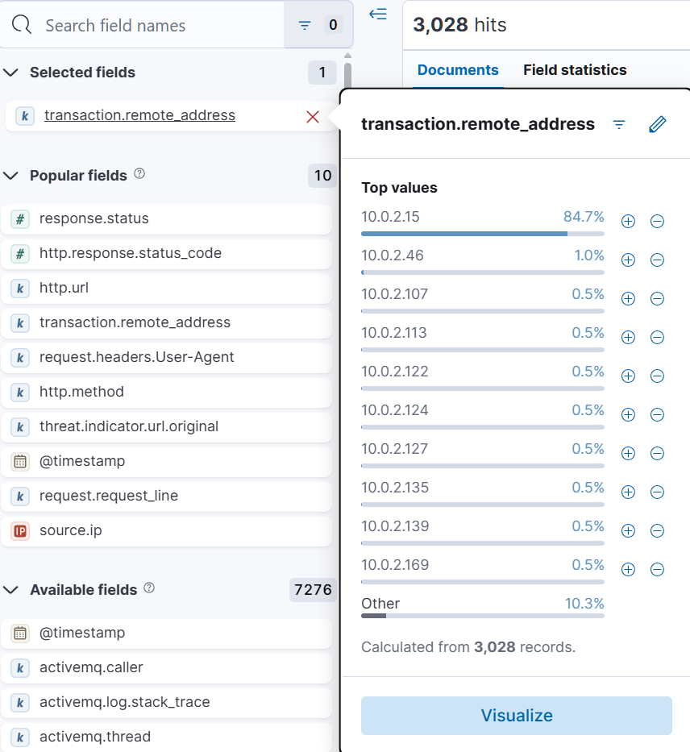

A single IP, `10.0.2.15`, accounts for 84.7% of all traffic in the dataset. The remaining IPs each contribute between 0.5% and 1.0%, consistent with background or legitimate traffic. All investigative focus anchored on `10.0.2.15` as the primary attacker IP.

One important note on log structure: the key fields used throughout this investigation (`transaction.remote_address`, `response.status`, `request.headers.User-Agent`, `http.url`) are partially embedded within the raw `message` field as a JSON blob rather than being fully indexed as top-level fields. This is a consequence of how the ModSecurity audit log format was ingested. Where top-level fields were available they were used directly; where not, the raw `message` field was inspected to extract values.


## Phase 1: Reconnaissance

To establish the attack sequence, I applied a filter for `transaction.remote_address: 10.0.2.15` combined with `request.headers.User-Agent: exists`, sorted results ascending by timestamp, and used a chronological peel-back method: noting each tool's user agent and removing it to surface the next one in sequence.

The oldest events in the dataset, starting at `14:27:08`, show the user agent `Mozilla/5.0 (compatible; Nmap Scripting Engine; https://nmap.org/book/nse.html)`.

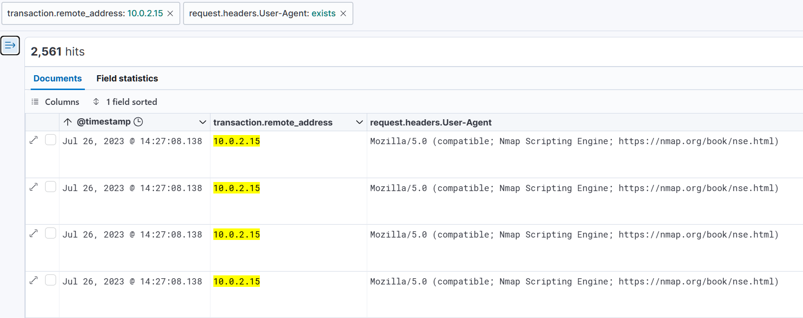

After removing the Nmap filter, the next tool to surface is Gobuster, beginning at `14:27:43`.

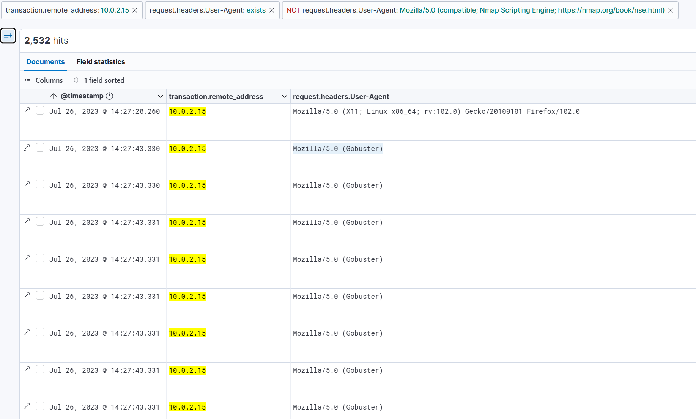

Removing Gobuster from the filter reveals Hydra beginning at `14:29:01`.

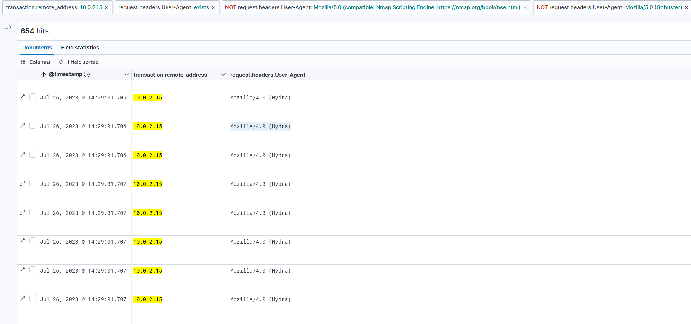

The three tools surface in the following order:

| Timestamp | Tool | Purpose |
|---|---|---|
| 14:27:08 | Nmap Scripting Engine | Service and version detection |
| 14:27:43 | Gobuster | Directory and endpoint enumeration |
| 14:29:01 | Hydra | Credential brute force |

This is a textbook initial access sequence compressed into approximately two minutes: scan the target, enumerate the attack surface, then attack credentials.


## Phase 2: Directory Enumeration

To identify what Gobuster discovered, I queried for Gobuster requests that received a 200 response:

```kql
transaction.remote_address: "10.0.2.15" AND request.headers.User-Agent: *Gobuster* AND response.status: 200
```

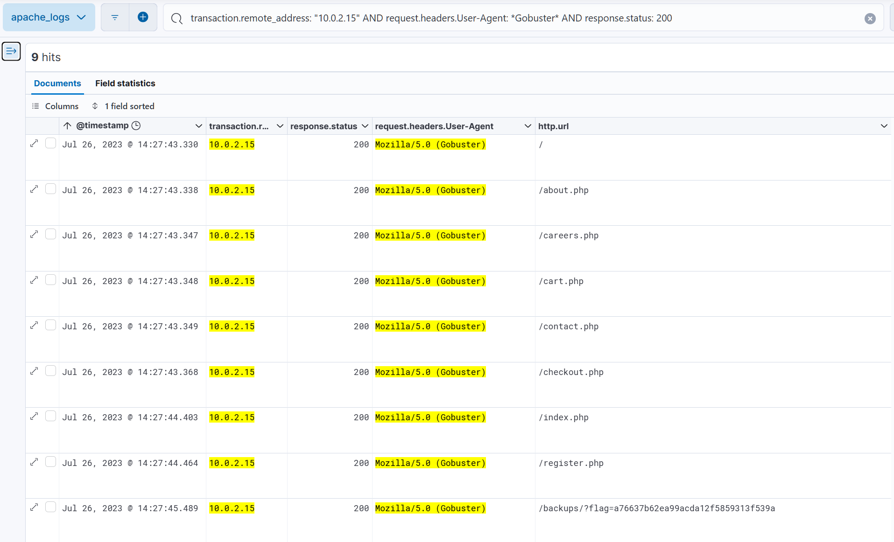

Nine endpoints returned 200, giving the attacker a full map of the application's publicly accessible pages. Of particular significance is `/admin-login.php`, which Gobuster confirmed as a live endpoint. This is the target Hydra would attack seconds later. The /backups at the end is relevant only for the CTF challenge, no thread to pull there.


## Phase 3: Credential Brute Force

With `/admin-login.php` confirmed, the attacker launched Hydra against it. Querying all Hydra traffic from `10.0.2.15`:

```kql
transaction.remote_address: "10.0.2.15" AND request.headers.User-Agent: *Hydra*
```

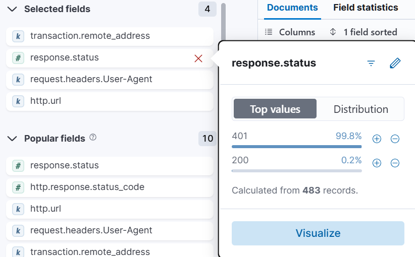

483 requests were made against `/admin-login.php`. The response status distribution shows 99.8% returning 401 and 0.2% returning 200, representing a single successful authentication.

Filtering to the successful request:

```kql
transaction.remote_address: "10.0.2.15" AND request.headers.User-Agent: *Hydra* AND response.status: 200
```

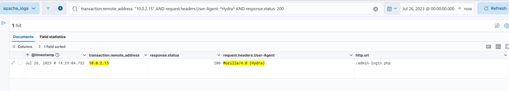

The brute force succeeded at `14:29:04.732`, approximately three seconds after it began. Inspecting the raw `message` field of this log reveals the mechanism used: HTTP Basic Authentication, where credentials are transmitted as a Base64-encoded string in the `Authorization` header.

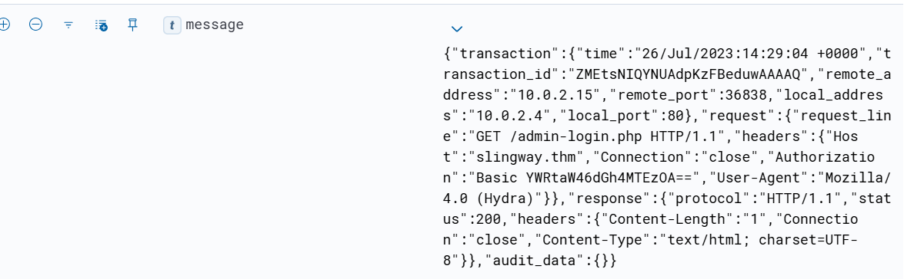

The header value `YWRtaW46dGh4MTEzOA==` was decoded using CyberChef.

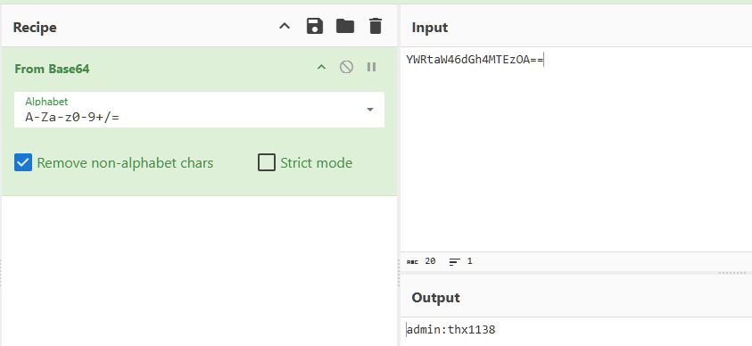

Recovered credentials: `admin:thx1138`.


## Phase 4: Admin Panel Compromise and Webshell Deployment

With credentials recovered, I queried all non-401 traffic from `10.0.2.15` from the moment of the successful brute force onwards:

```kql
transaction.remote_address: "10.0.2.15" AND @timestamp >= "2023-07-26T14:29:04" AND NOT response.status: 401
```

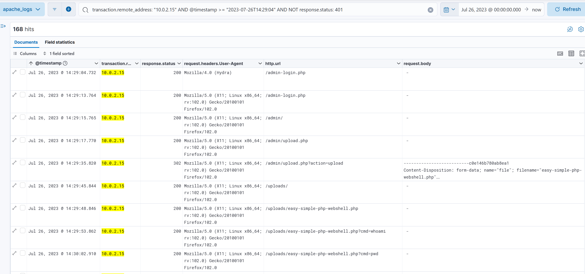

The user agent switches from `Mozilla/4.0 (Hydra)` to `Mozilla/5.0 (X11; Linux x86_64; rv:102.0) Gecko/20100101 Firefox/102.0` at `14:29:13`, confirming the transition from automated tooling to manual browsing. The attacker logged in with the recovered credentials and navigated the admin panel, identifying an upload functionality at `/admin/upload.php`.

At `14:29:35`, a POST request to `/admin/upload.php?action=upload` returned 302. The `request.body` field of this log contains the multipart form data, with the filename `easy-simple-php-webshell.php` explicitly visible. At `14:29:48`, a GET request to `/uploads/easy-simple-php-webshell.php` returned 200, confirming the webshell was deployed and accessible.

The upload sequence:

| Timestamp | Method | URL | Status | Significance |
|---|---|---|---|---|
| 14:29:13 | GET | /admin-login.php | 200 | Manual login with admin:thx1138 |
| 14:29:15 | GET | /admin/ | 200 | Admin panel accessed |
| 14:29:17 | GET | /admin/upload.php | 200 | Upload functionality identified |
| 14:29:35 | POST | /admin/upload.php?action=upload | 302 | Webshell uploaded |
| 14:29:45 | GET | /uploads/ | 200 | Upload directory confirmed accessible |
| 14:29:48 | GET | /uploads/easy-simple-php-webshell.php | 200 | Webshell confirmed live |


## Phase 5: Post-Exploitation OS Reconnaissance

With the webshell active, the attacker executed a series of OS reconnaissance commands via the `?cmd=` parameter, all returning 200.

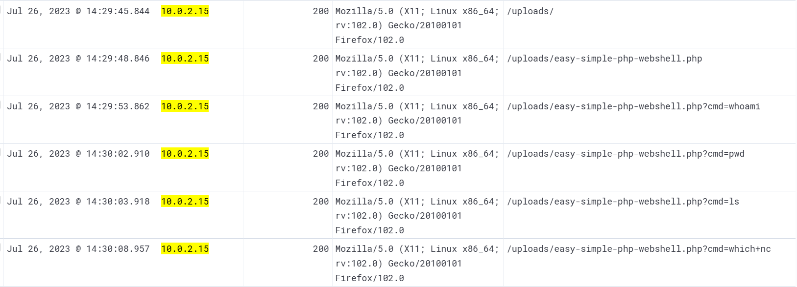

| Timestamp | Command | Intent |
|---|---|---|
| 14:29:53 | `whoami` | Identify process user context |
| 14:30:02 | `pwd` | Identify working directory |
| 14:30:03 | `ls` | Enumerate files in current directory |
| 14:30:08 | `which nc` | Check for netcat availability |

The `which nc` query is the key signal here. Checking for netcat is the standard precursor to establishing a reverse shell. The attacker did not pursue this further, instead pivoting to a different attack vector, but the intent to establish an interactive shell was present.


## Phase 6: Local File Inclusion Exploitation

After the webshell reconnaissance, the attacker browsed the admin settings panel starting at `14:30:28`, systematically accessing themes, content, users, stats, and general configuration pages. At `14:31:02`, the activity shifted to exploitation.

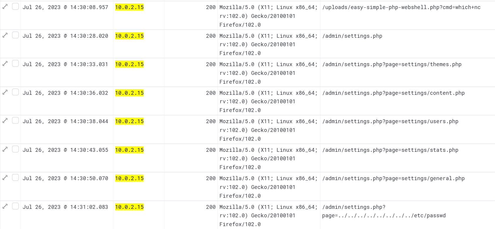

The `page=` parameter in `/admin/settings.php` is vulnerable to directory traversal, allowing the attacker to read arbitrary files from the server filesystem. The following traversal requests were made, all returning 200:

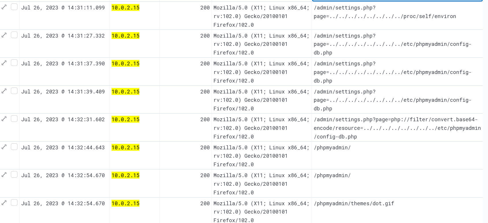

| Timestamp | File Targeted | Significance |
|---|---|---|
| 14:31:02 | `../../../../../../../../etc/passwd` | System user account enumeration |
| 14:31:11 | `../../../../../../../../proc/self/environ` | Process environment variables, potential credential exposure |
| 14:31:27 to 14:31:39 | `../../../../../../../../etc/phpmyadmin/config-db.php` | Database credentials file, three requests |

At `14:32:31`, the attacker escalated the technique by using the `php://filter` stream wrapper to encode the target file in Base64 before returning it, bypassing any output filtering applied to direct file reads.

`/admin/settings.php?page=php://filter/convert.base64-encode/resource=../../../../../../../../etc/phpmyadmin/config-db.php`

This returned 200, confirming the database credentials stored in `config-db.php` were successfully exfiltrated in encoded form.


## Phase 7: Database Access, Exfiltration, and Tampering

At `14:32:44`, the attacker accessed `/phpmyadmin/` directly, authenticating with the credentials extracted from `config-db.php`. The login redirect pattern, a 302 on `/phpmyadmin/index.php` immediately followed by a 200, confirmed successful authentication at `14:33:02`.

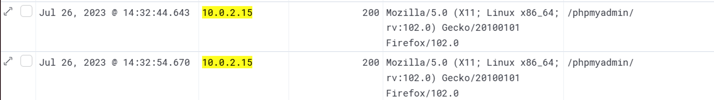

To filter out the static asset noise from phpMyAdmin's page render and isolate the substantive database interactions, I applied:

```kql
transaction.remote_address: "10.0.2.15" AND http.url: */phpmyadmin/* AND NOT http.url: *.css* AND NOT http.url: *.js* AND NOT http.url: *.png* AND NOT http.url: *.gif* AND NOT http.url: *.ico*
```

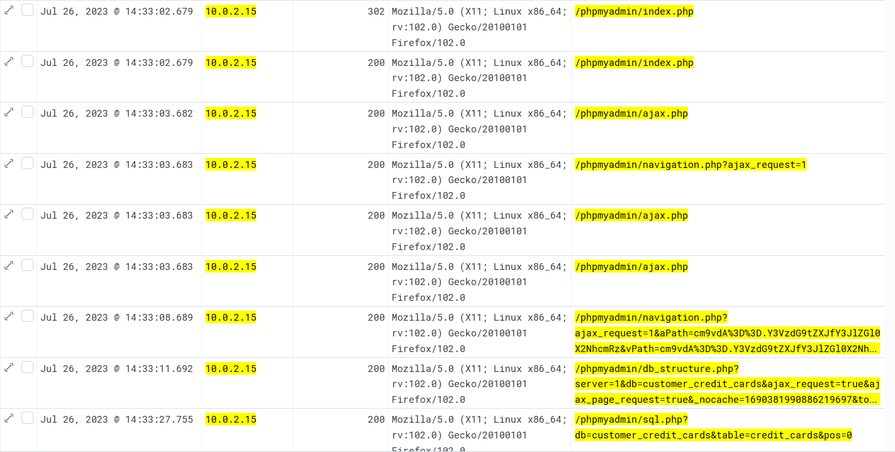
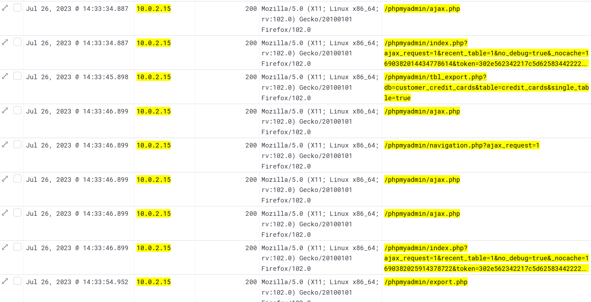
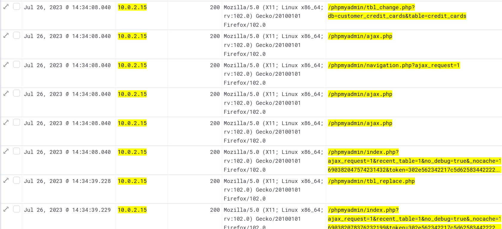

The attacker navigated directly to a database named `customer_credit_cards` and opened the `credit_cards` table. The sequence of phpMyAdmin endpoints accessed confirms a structured pre-exfiltration workflow: schema inspection via `tbl_structure.php`, data preview via `sql.php`, then export initiation via `tbl_export.php`. At `14:33:54`, `/phpmyadmin/export.php` returned 200, confirming the first full table export was downloaded.

Following the initial exfiltration, the attacker did not disconnect. At `14:34:08`, `tbl_change.php` was accessed against `customer_credit_cards.credit_cards`, opening the table for row-level editing.

At `14:34:39`, `/phpmyadmin/tbl_replace.php` returned 200, confirming a data modification was executed. The presence of `lint.php` at the same timestamp indicates the SQL statement was validated before execution. At `14:34:46`, `/phpmyadmin/import.php` was accessed, suggesting an additional data injection attempt.

At `14:35:02`, a second `tbl_export.php` request was made against the same table.

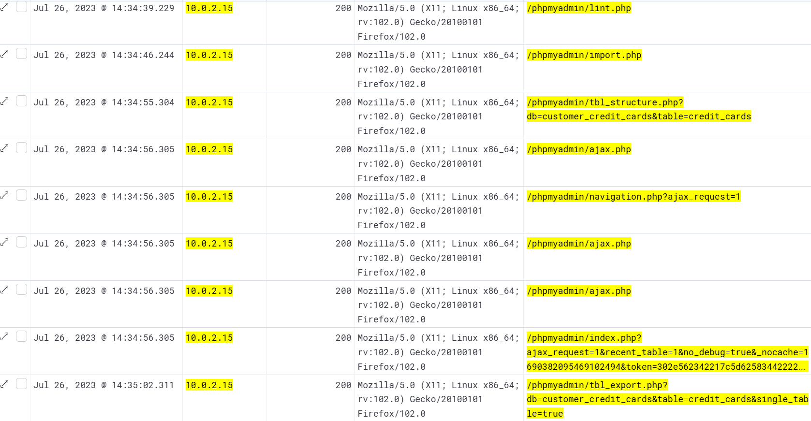

This second export occurred after the data modification, meaning the attacker exfiltrated a copy of the tampered table. At `14:35:07`, all activity from `10.0.2.15` ceased.

The complete database interaction sequence:

| Timestamp | Endpoint | Action |
|---|---|---|
| 14:33:11 | db_structure.php?db=customer_credit_cards | Database targeted |
| 14:33:27 | sql.php?db=customer_credit_cards&table=credit_cards&pos=0 | Table contents viewed |
| 14:33:34 | tbl_structure.php?db=customer_credit_cards&table=credit_cards | Schema inspected |
| 14:33:45 | tbl_export.php?db=customer_credit_cards&table=credit_cards | First export initiated |
| 14:33:54 | export.php | First export downloaded |
| 14:34:08 | tbl_change.php?db=customer_credit_cards&table=credit_cards | Table opened for editing |
| 14:34:39 | tbl_replace.php | Data modified |
| 14:34:46 | import.php | Import functionality accessed |
| 14:34:55 | tbl_structure.php?db=customer_credit_cards&table=credit_cards | Post-modification structure verified |
| 14:35:02 | tbl_export.php?db=customer_credit_cards&table=credit_cards | Second export of modified data |
| 14:35:06 | sql.php?db=customer_credit_cards&table=credit_cards&pos=0 | Final table view |
| 14:35:07 | index.php (ajax) | Last request, activity ends |


## Attack Timeline
```
14:27:08  Nmap Scripting Engine scan initiated against slingwayweb

14:27:43  Gobuster directory enumeration begins, /admin-login.php confirmed live

14:29:01  Hydra brute force against /admin-login.php begins (483 attempts)

14:29:04  Brute force succeeds, Basic Auth header decoded: admin:thx1138

14:29:13  Manual login to admin panel via Firefox

14:29:17  Upload functionality identified at /admin/upload.php

14:29:35  Webshell easy-simple-php-webshell.php uploaded via POST to /admin/upload.php

14:29:48  Webshell confirmed live at /uploads/easy-simple-php-webshell.php

14:29:53  OS reconnaissance via webshell: whoami, pwd, ls, which nc

14:31:02  LFI exploitation begins via /admin/settings.php page= parameter

14:31:02  /etc/passwd read via directory traversal

14:31:11  /proc/self/environ read via directory traversal

14:31:27  /etc/phpmyadmin/config-db.php read via directory traversal

14:32:31  config-db.php exfiltrated via php://filter base64 wrapper

14:32:44  phpMyAdmin accessed using credentials from config-db.php

14:33:27  customer_credit_cards.credit_cards table contents viewed

14:33:54  First full table export downloaded

14:34:39  Data modification executed via tbl_replace.php

14:35:02  Second export of modified table downloaded

14:35:07  Attacker activity ends
```

## IOC Summary

| Type | Value | Context |
|---|---|---|
| IP Address | 10.0.2.15 | Attacker source IP, 84.7% of all traffic |
| User Agent | Mozilla/5.0 (compatible; Nmap Scripting Engine) | Reconnaissance scan |
| User Agent | Mozilla/5.0 (Gobuster) | Directory enumeration |
| User Agent | Mozilla/4.0 (Hydra) | Credential brute force |
| Account | admin | Compromised admin account |
| Password | thx1138 | Recovered via Basic Auth Base64 decode |
| Path | /admin-login.php | Brute force target |
| Path | /admin/upload.php | Webshell upload vector |
| Path | /uploads/easy-simple-php-webshell.php | Deployed webshell |
| File | easy-simple-php-webshell.php | Webshell filename |
| Path | /admin/settings.php | LFI vulnerable endpoint |
| Path | /etc/phpmyadmin/config-db.php | Database credentials source |
| Database | customer_credit_cards | Exfiltrated and tampered database |
| Table | credit_cards | Exfiltrated and tampered table |

---

## MITRE ATT&CK Mapping

| Technique ID | Technique | Tactic | Evidence |
|---|---|---|---|
| T1595.001 | Active Scanning: Scanning IP Blocks | Reconnaissance | Nmap Scripting Engine at 14:27:08 |
| T1595.003 | Active Scanning: Wordlist Scanning | Reconnaissance | Gobuster directory enumeration at 14:27:43 |
| T1110.001 | Brute Force: Password Guessing | Credential Access | Hydra against /admin-login.php, 483 attempts |
| T1552.001 | Unsecured Credentials: Credentials in Files | Credential Access | config-db.php read via LFI |
| T1190 | Exploit Public-Facing Application | Initial Access | LFI via settings.php page= parameter |
| T1505.003 | Server Software Component: Web Shell | Persistence | easy-simple-php-webshell.php deployed to /uploads/ |
| T1059.004 | Command and Scripting Interpreter: Unix Shell | Execution | whoami, pwd, ls, which nc via webshell |
| T1083 | File and Directory Discovery | Discovery | ls command via webshell |
| T1087 | Account Discovery | Discovery | /etc/passwd read via LFI |
| T1005 | Data from Local System | Collection | credit_cards table viewed and exported |
| T1048 | Exfiltration Over Alternative Protocol | Exfiltration | Database exported via phpMyAdmin export.php |
| T1565.001 | Data Manipulation: Stored Data Manipulation | Impact | tbl_replace.php executed against credit_cards table |

---

## SOC Implications

The alert queue for this incident would initially present as a volume anomaly: a single internal IP generating 84.7% of all web server traffic within a short window. The correct first read is not to investigate individual alerts in isolation but to pull the full request timeline for that IP sorted chronologically. Doing so immediately reveals the tool progression: Nmap, then Gobuster, then Hydra, each with a distinct user agent and a distinct request pattern. This sequencing is the fingerprint of a structured attack, not opportunistic scanning, and should trigger an escalation decision before any exploitation is even confirmed.

The cross-source corroboration in this investigation came from combining the web access log data with the ModSecurity audit fields embedded in the raw message. The Basic Auth header in the Hydra 200 response was not surfaced by any automated alert; it required manual inspection of the raw log and an additional decoding step in CyberChef. This is a gap in detection coverage. An automated rule watching for HTTP 200 responses to requests carrying a `Basic` Authorization header from a source IP that previously generated a large volume of 401s would have flagged the credential recovery without requiring manual log parsing.

The LFI vulnerability in `/admin/settings.php` is the most critical finding from a remediation standpoint. The `page=` parameter accepted unsanitized user input including directory traversal sequences and PHP stream wrappers, allowing the attacker to read arbitrary files including the phpMyAdmin configuration file. The `php://filter` wrapper abuse is a well-documented technique specifically designed to bypass naive output filtering, and its presence in the logs indicates the attacker anticipated potential defenses. Remediation requires input validation on all file inclusion parameters, removal of the `php://` wrapper from allowed input, and immediate rotation of all credentials stored in `config-db.php`. The webshell at `/uploads/easy-simple-php-webshell.php` must be removed and the upload directory reconfigured to reject PHP file execution.

The highest severity finding is the confirmed data tampering via `tbl_replace.php` on the `customer_credit_cards.credit_cards` table. Two exports were taken, one before and one after the modification, meaning the attacker holds both the original dataset and a tampered version. The integrity of every record in that table is now in question. IR response must treat this as both a confidentiality and an integrity breach, requiring a forensic comparison of the current table state against the most recent clean backup to identify which rows were modified, added, or deleted. Given that this is payment card data, regulatory notification obligations under PCI DSS apply and should be assessed immediately.

---

*TryHackMe — Slingshot | SOC Level 2 Path*