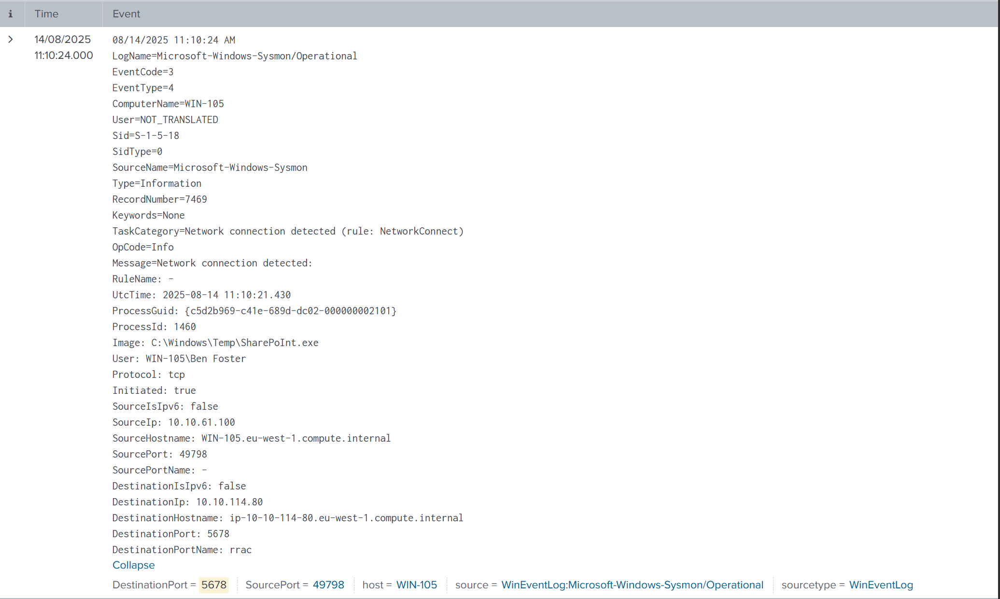
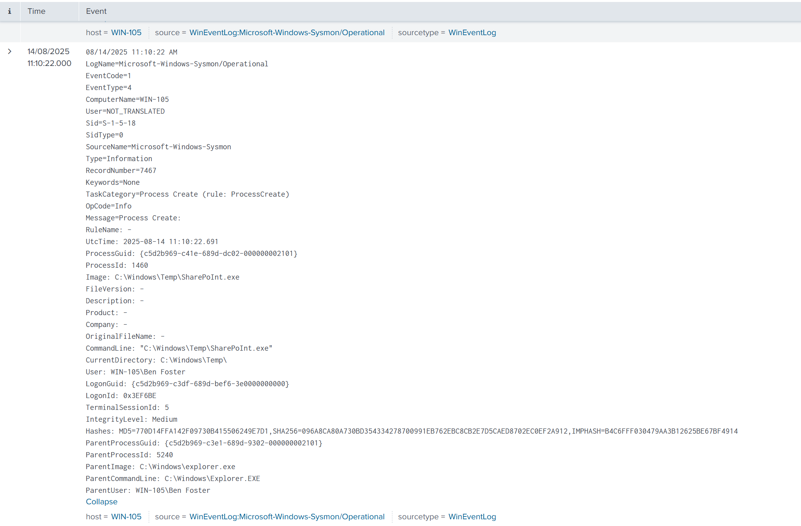
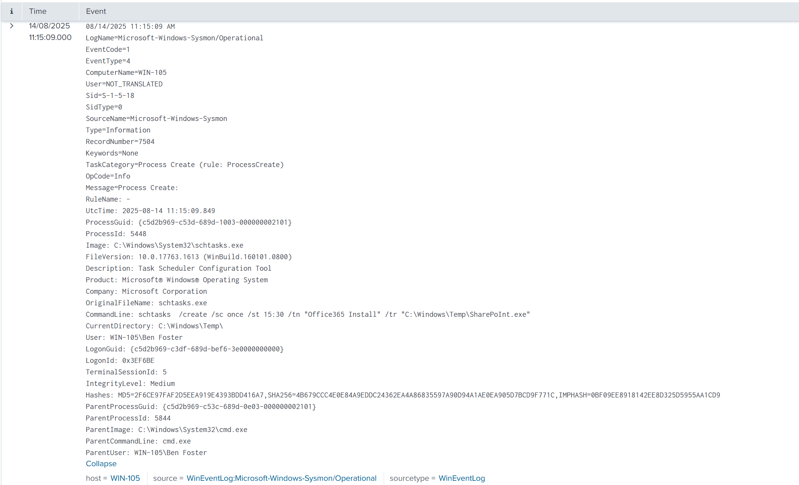
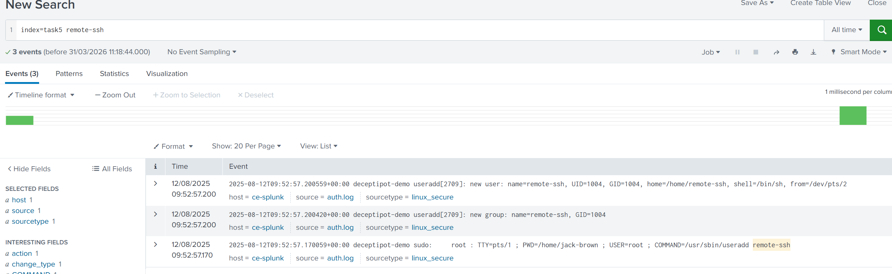
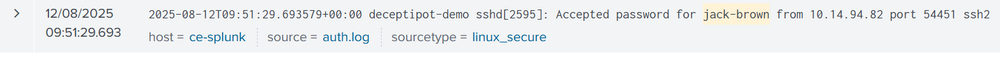
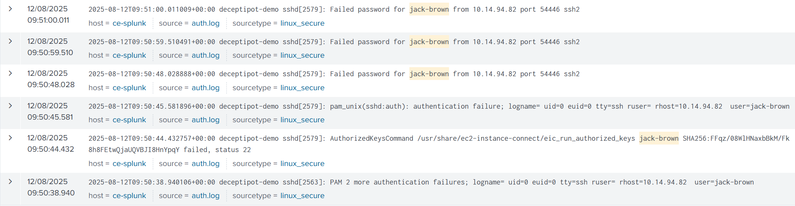
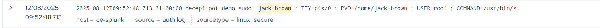
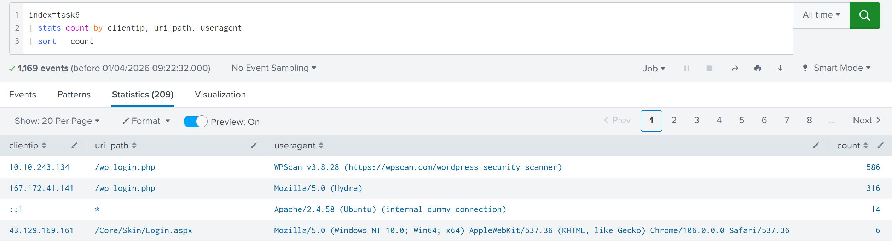
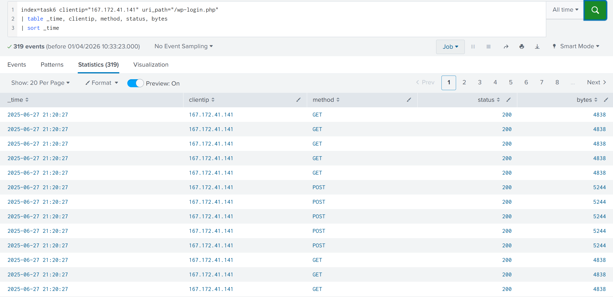

# SOC Investigation: Multi-Platform Forensic Analysis

**Environment:** TryHackMe - Log Analysis with SIEM - Virtual Lab.

**Lab Objective:** The objective of this investigation is to perform a comprehensive forensic reconstruction of a cross-platform attack campaign. By analyzing Windows Sysmon logs, Linux authentication records, and Web server access logs, I aim to identify initial access vectors, privilege escalation techniques, and persistence mechanisms used by a single threat actor across multiple environments.

**Tools and Technologies (or Data generated by these tools):**
* Splunk (SIEM)
* Microsoft Sysmon (Event IDs 1, 3, 11)
* Windows Event Viewer (Scheduled Tasks)
* Linux Auth Logs (/var/log/auth.log)
* Linux Syslog (Cron activity)
* Web Access Logs (HTTP POST/GET, Status Codes)

**Note on Splunk Hygiene:** The queries in this report utilize `index=taskX` to isolate specific datasets within a controlled virtual lab environment. In a real-world production SOC environment, analysts would typically query global indexes (e.g., `index=windows` or `index=proxy`) and use metadata such as `sourcetype`, `host`, or `source` to filter traffic.


## Lab Content

### Step 1: Investigating Suspicious Windows Network Activity
The investigation began following an alert regarding a suspicious outbound connection on port 5678 from a production host.

**Query:**
```splunk
index=task4 DestinationPort=5678
```

**Why?:** Filtering by a non-standard destination port allows me to isolate potential Command and Control (C2) traffic. In this case, the query identified a process named `SharePoInt.exe` (PID 1460) executing from `C:\Windows\Temp\`.



### Red Flag 1: Masquerading (Typo-Squatting)
* **The Indicator:** `SharePoInt.exe`
* **The Threat:** The use of a capital **"I"** in the middle of a word is a deliberate tactic to bypass a quick human glance. Legitimate Microsoft SharePoint binaries follow strict naming conventions (e.g., `Microsoft.SharePoint.exe`).

### Red Flag 2: Suspicious Execution Path
* **The Indicator:** `C:\Windows\Temp\`
* **The Threat:** The `\Temp` directory is "world-writable," meaning almost any process can drop files there. Legitimate enterprise software installs to `\Program Files`. A binary running from `\Temp` is the **#1 sign of a staged payload**.

### Red Flag 3: Anomalous Process Behavior
* **The Indicator:** Process linked to an outbound network connection.
* **The Threat:** When a "SharePoint" look-alike starts talking to an external IP on a random port (**5678**), it is no longer a document tool, it is a **Beacon**.

### Red Flag 4: High-Fidelity Signature of a Reverse Shell
* **The Indicator:** The combination of the first three flags.
* **The Threat:** In a SOC, this specific combination (**Binary in Temp + Masqueraded Name + Outbound Connection**) is treated as a confirmed compromise rather than a "possible" one. It strongly suggests an interactive shell is being handed back to an attacker.

---

### Step 2: Pivoting to Process Forensics and Hashing
To confirm the nature of the binary, I needed to extract its cryptographic hash for threat intelligence lookup.

**Query:**
```splunk
index=task4 EventCode=1 "SharePoInt.exe"
```

**Why?:** Sysmon Event ID 1 (Process Creation) is the most reliable way to capture the "birth" of a process, including the command line and file hashes. By correlating the PID 1460 from the network alert with this event, I confirmed the specific execution instance.



**Troubleshooting:** Initial searches returned multiple logs for this file name. To find the "correct" hash, I analyzed the execution timeline. I identified that the hash `770D14FFA142F09730B415506249E7D1` was associated with the primary payload execution at 11:10:22 AM, by correlating the PID 1460, while later logs represented persistence-related calls that we will look up right after. 

**SOC Context & Blue Team:** Process hashing allows for "Known Bad" detection. Even if an attacker renames a file multiple times, the MD5/SHA256 remains constant, allowing us to track the file's movement across the entire enterprise.

---

### Step 3: Detecting Windows Persistence via Scheduled Tasks
After the initial infection, I searched for how the attacker intended to survive a system reboot.

**Query:**
```splunk
index=task4 Image="*schtasks.exe*"
```

**Why?:** Attackers frequently use `schtasks.exe` to automate the execution of their payloads. By auditing the command line arguments, I identified the creation of a task named "Office365 Install."



**CommandLine Syntax Analysis:**
The discovery was made by analyzing the following execution string found in the logs:
`schtasks  /create /sc once /st 15:30 /tn "Office365 Install" /tr "C:\Windows\Temp\SharePoInt.exe"`

To understand the attacker's intent, I broke down the syntax of this command:
* **/create**: Tells the system to initiate the creation of a new scheduled task.
* **/sc once**: Defines the schedule (sc). In this instance, it was set to run "once," though further logs showed an additional task set to `/sc onlogon`.
* **/st 15:30**: Specifies the start time (st) for the task execution.
* **/tn "Office365 Install"**: This is the Task Name (tn). This is where the attacker applies their "disguise."
* **/tr "C:\Windows\Temp\SharePoInt.exe"**: This is the Task Run (tr) property, which points to the actual malicious binary we identified in Step 1.

**The "Office365" Disguise:**
The use of the name "Office365 Install" is a classic example of **Masquerading (MITRE ATT&CK T1036)**. Attackers choose names of common, trusted enterprise software because they know that a SOC analyst or System Administrator skimming through hundreds of scheduled tasks is likely to ignore an entry that looks like a standard Microsoft update. By blending into the "background noise" of the OS, the attacker increases the lifespan of their persistence.

**SOC Context & Blue Team:** The attacker used the `/sc onlogon` trigger for user "Ben Foster." This ensures that every time the victim logs in, the malware in the `\Temp` folder re-executes. This demonstrates a transition from a memory-resident threat to a persistent foothold.

---

### Step 4: Analyzing Linux Initial Access and Privilege Escalation
The scope of the investigation shifted to an Ubuntu server showing signs of a brute-force attack.

**Query:**
```splunk
index=task5 remote-ssh
```

**Why?:** This query identified the creation of a back-door user account (`remote-ssh`) at 09:52:57.



**Query:**
```splunk
index=task5 jack-brown
```

**Why?:** This query allowed me to "walk back" the timeline to find the perpetrator. I discovered that user `jack-brown` successfully logged in from IP `10.14.94.82` after four failed attempts.




**SOC Context & Blue Team:** I identified the exact moment of escalation at 09:52:48, where `jack-brown` executed `sudo su`. This allowed him to gain a root shell, which he immediately leveraged to create the new user account and install persistence.



---

### Step 5: Web Application Brute-Force and Tool Identification
The final phase of the investigation focused on the organization's WordPress server, which experienced a massive traffic spike.

**Query:**
```splunk
index=task6 
| stats count by clientip, uri_path, useragent 
| sort - count
```

**Why?:** This aggregation query provides a bird's-eye view of web traffic. By grouping requests by IP and User-Agent, I was able to identify high-volume automated activity targeting sensitive administrative endpoints.



**Targeting the "Front Door" (/wp-login.php):**
The URI path `/wp-login.php` was overwhelmingly the most requested path in the logs. In a WordPress environment, this file serves as the primary authentication gateway. Attackers target this specific URI because gaining access here grants administrative control over the entire site, allowing for file uploads, database access, and further lateral movement.

**Red Flags & Brute-Force Evidence:**
The activity was classified as a Brute-Force attack based on the following forensic indicators:
* **High Volume:** The logs showed nearly 1,000 requests targeting the login page in a very short window. This volume of POST/GET requests is the textbook definition of an automated attack.
* **Repeated Target:** The attacker consistently hit the same authentication endpoint without navigating to other parts of the site.

**Deep Dive: HTTP Status Code Waterfall Analysis**
To determine if the brute-force attack was successful, I analyzed the chronological flow of requests for the primary attacker IP.

**Query:**
```splunk
index=task6 clientip="167.172.41.141" uri_path="/wp-login.php"
| table _time, clientip, method, status, bytes
| sort _time
```
This image is the first page of stats found with the query, we can see the wall of Status Code 200.



This image is the last page, it shows the last entries of the query, we can see the Status Code 302 at the end.


By analyzing the results, I identified a specific behavioral pattern in the HTTP responses:

* **The "Wall" of 200 OK (Failed Attempts):** The majority of the logs showed a `200 OK` status with a constant byte size (e.g., 4838 or 5244). In the context of `/wp-login.php`, a `200 OK` represents a **failed login attempt**. The server accepts the credentials, finds them incorrect, and simply reloads the login page to display an error message.
* **The "Pivot" (Successful 302 Redirect):** The sequence concluded with a **302 Found** status code and a significantly smaller byte size. This is the "Smoking Gun" of the investigation. In WordPress, a successful login triggers a **302 Redirect** to send the user's browser from the login page to the administrative dashboard (`/wp-admin/`).

**SOC Analyst Action Plan:** Identifying a `302` following a brute-force spike is critical. It marks the exact second of compromise. My next steps involved pivoting to find what the attacker did *after* gaining access, specifically looking for POST requests to theme or plugin editors used to plant web shells.

**Tool Identification via User-Agents:**
The investigation identified two primary "heavy hitters" using distinct specialized tools:
* **WPScan (v3.8.28) - IP 10.10.243.134:** This IP made 586 requests using a specialized black-box scanner designed to find vulnerable plugins, themes, and valid usernames.
* **Hydra - IP 167.172.41.141:** This IP made 316 requests using a fast, aggressive parallelized login cracker to "guess" passwords for the accounts discovered during the scan.

**Forensic Conclusion:**
The attack followed a clear tactical progression: the server was first "scoped out" by **WPScan** to enumerate vulnerabilities and usernames, followed immediately by an aggressive password-cracking attempt by **Hydra** to achieve initial access.

---

## Implications for a SOC Analyst
This multi-platform investigation underscores the necessity of centralized logging. By correlating data from Windows Sysmon, Linux Auth logs, and Web server traffic, I was able to reconstruct a "Kill Chain" that spanned three different environments. Defensively, this highlights the value of monitoring non-standard ports, auditing high-privilege account creations (like `remote-ssh`), and implementing rate-limiting on web login endpoints to mitigate automated tools like Hydra.

**Advanced Correlation Note:**
To finalize this investigation, a crucial step involves verifying if the source IP addresses identified during the Web brute-force attack (e.g., `167.172.41.141`) or the Linux intrusion (`10.14.94.82`) also appear within the Windows network connections analyzed in Step 1. Identifying a **common IP address** across these disparate logs would mathematically confirm that a single threat actor is conducting a coordinated campaign across the entire infrastructure. This pivot transforms isolated alerts into a singular, high-severity major incident.

---
*End of Lab report.*