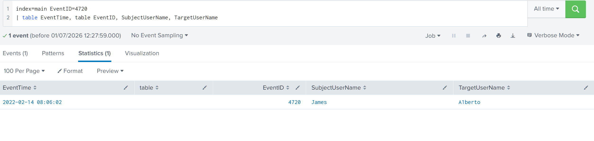
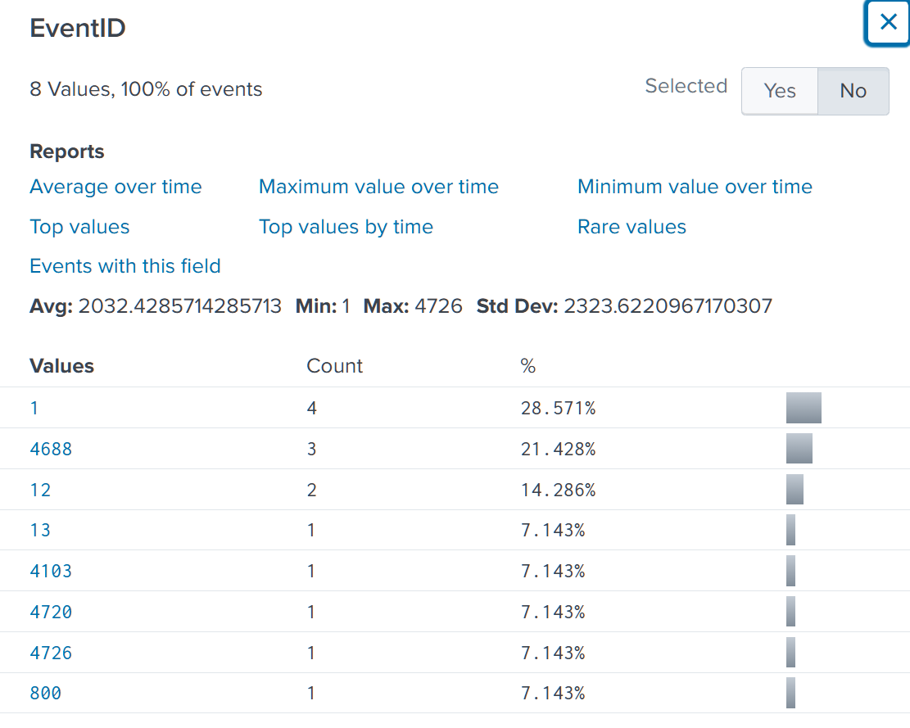
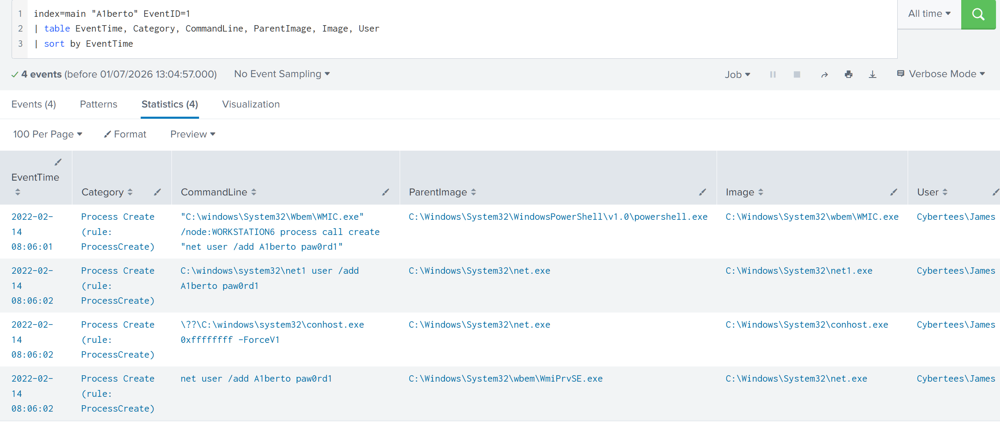
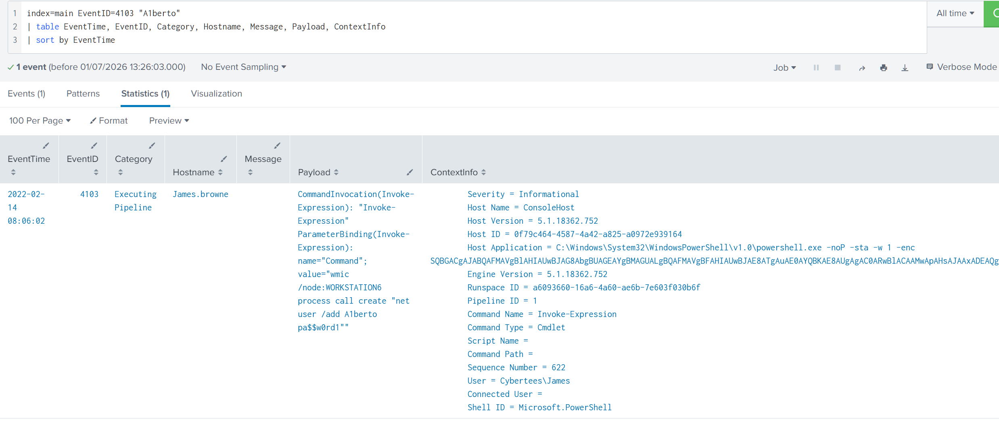
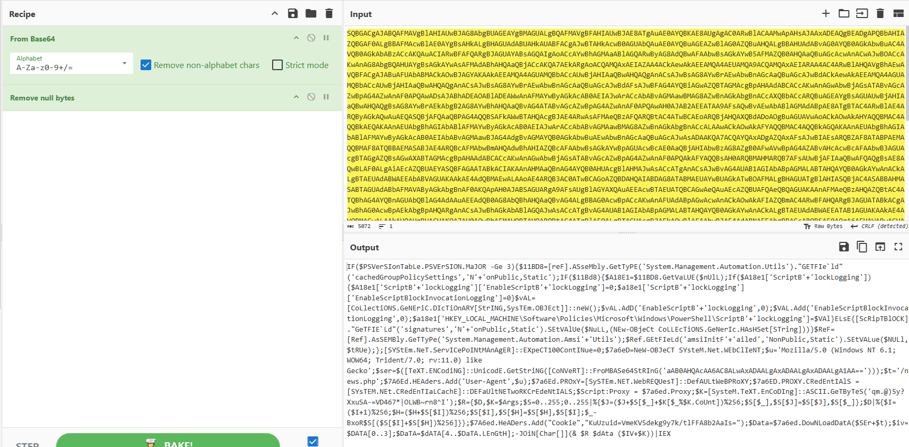
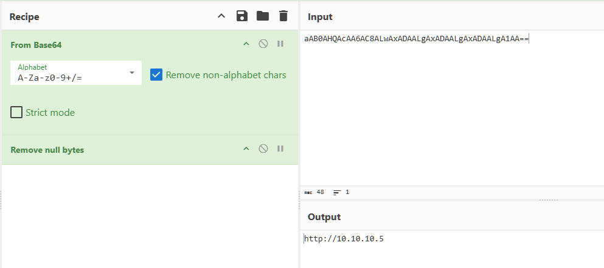
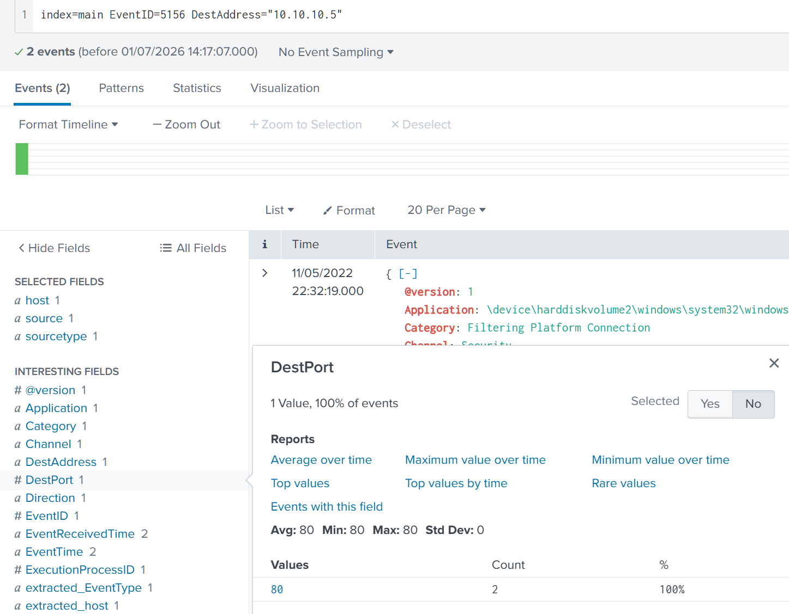
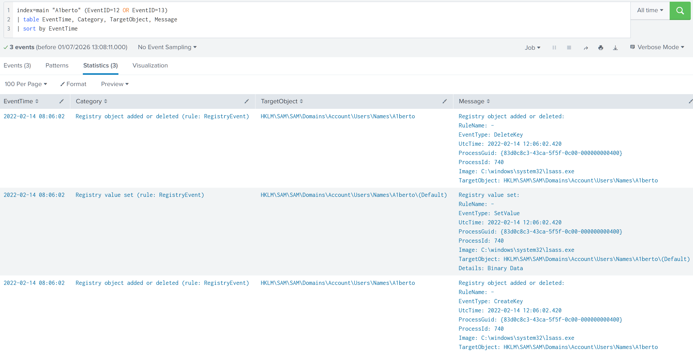
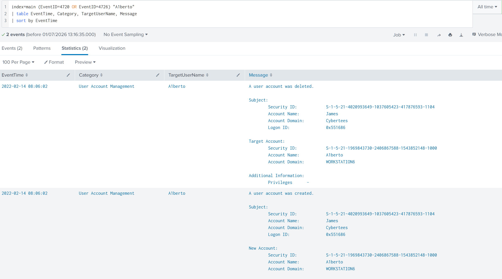
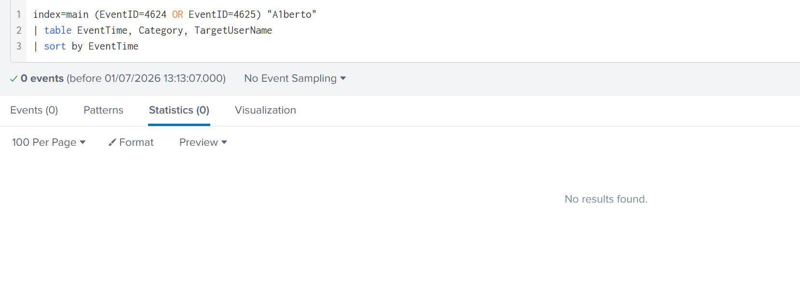

# Investigating with Splunk: PowerShell Stager, WMIC Lateral Movement, and Backdoor Account Creation

## Environment

- **Platform:** TryHackMe
- **SIEM:** Splunk
- **Log Sources:** Windows Security Event Log, Sysmon

## Lab Objective

Investigate anomalous behaviour across a set of Windows hosts ingested into Splunk. Identify the attack chain, surface all relevant IOCs, and reconstruct the full sequence of adversary actions from initial execution through lateral movement and anti-forensic cleanup.

## Tools and Technologies

- Splunk (SPL)
- CyberChef (Base64 decode, Remove Null Bytes)
- Sysmon Event IDs: 1, 12, 13
- Windows Security Event IDs: 4720, 4726, 4624, 4625, 4103, 5156, 800

## Lab Content

### Phase 1: Initial Discovery

The scenario references a backdoor, so the first query targets Windows Security Event ID 4720, which is generated when a local user account is created.

```spl
index=main EventID=4720
| table EventTime, table EventID, SubjectUserName, TargetUserName
```



One event. Subject `James`, target `A1berto`. The name is a deliberate masquerade of an existing account called `Alberto`, substituting the letter `l` with the digit `1`. This is the thread: every subsequent query follows `A1berto` as the anchor.

---

### Phase 2: Attack Surface Scoping

Before pivoting into specific event types, I scope the full set of events associated with the backdoor account to understand what log sources and event categories are present.

```spl
index=main "A1berto"
```

14 events. I open the EventID field panel to read the distribution before running any targeted queries.



Eight distinct Event IDs are present: Sysmon 1 (4 events), Security 4688 (3 events), Sysmon 12 (2 events), Sysmon 13 (1 event), Security 4103 (1 event), Security 4720 (1 event), Security 4726 (1 event), and Security 800 (1 event). This distribution immediately tells me the activity spans process execution, registry operations, account management, and PowerShell logging, covering three distinct phases of the attack chain. I work through them in chronological order.

---

### Phase 3: Execution and Lateral Movement

Sysmon Event ID 1 is the process creation record. With four events, it covers the most activity. I query it to recover the full command line and parent process chain.

```spl
index=main "A1berto" EventID=1
| table EventTime, Category, CommandLine, ParentImage, Image, User
| sort by EventTime
```



Four process creation events, all timestamped at `2022-02-14 08:06:01` and `08:06:02`, all under `Cybertees\James`. The critical first row:

```
Image:       C:\Windows\System32\wbem\WMIC.exe
CommandLine: "C:\windows\System32\Wbem\WMIC.exe" /node:WORKSTATION6 process call create "net user /add A1berto paw0rd1"
ParentImage: C:\Windows\System32\WindowsPowerShell\v1.0\powershell.exe
```

WMIC is used as a LoLBin to proxy remote process creation on WORKSTATION6. The parent is `powershell.exe`, meaning a PowerShell process already running on James.browne issued this command. The `/node:WORKSTATION6` parameter confirms this is lateral movement: the `net user /add` command executes on the remote host, not locally.

The remaining three rows show the downstream process chain that `WMIC.exe` spawned on the target: `net.exe`, `net1.exe`, and `conhost.exe`, all with `net user /add A1berto paw0rd1` in their command lines. `WmiPrvSE.exe` (the WMI Provider Service) appears as a parent, which is the expected execution context for remotely triggered WMI processes on the receiving host.

---

### Phase 4: Stager Analysis

Event ID 4103 is PowerShell module logging. It records the actual commands processed by the PowerShell pipeline, making it one of the only log sources that captures what a fileless script does at runtime rather than just the process launch.

```spl
index=main EventID=4103 "A1berto"
| table EventTime, EventID, Category, Hostname, Message, Payload, ContextInfo
| sort by EventTime
```



One event on `James.browne` at `08:06:02`. The Payload field shows `CommandInvocation(Invoke-Expression)` with a bound `value` of the WMIC lateral movement command. This is the downstream effect: the stager pulled from C2, decrypted a payload, and ran it through `Invoke-Expression`, which in turn issued the WMIC command targeting WORKSTATION6.

The ContextInfo field confirms the execution context:

```
Host Application = C:\Windows\System32\WindowsPowerShell\v1.0\powershell.exe -noP -sta -w 1 -enc SQBGACgAJABQAFMAVgBlAHIAUwBJAG8Abg...
Command Name     = Invoke-Expression
User             = Cybertees\James
Shell ID         = Microsoft.PowerShell
```

The `-enc` flag in the Host Application field is the encoded stager that was passed to PowerShell at launch. The full Base64 blob is the entry point.

Event ID 800 (pipeline execution) confirms the same encoded command ran to completion and was not interrupted by any security control during the pipeline phase.

---

### Phase 5: Stager Decoding

The `-enc` argument is a Base64-encoded UTF-16LE string, which is standard for PowerShell encoded commands. PowerShell uses 16-bit character encoding internally, which means every character in the string occupies two bytes and the second byte is always a null byte `0x00`. A plain Base64 decode will produce garbage unless those null bytes are stripped first.

In CyberChef I apply two recipes in sequence: **From Base64** followed by **Remove Null Bytes**.



The decoded output is a heavily obfuscated PowerShell stager. Reading through it, it operates in four stages:

**AMSI and logging bypass:** The script uses .NET reflection to locate `System.Management.Automation.Utils` in memory and sets `amsiInitFailed` to `$true`, blinding the Antimalware Scan Interface before it can inspect the script. It simultaneously sets `ScriptBlockLogging` to `0` in the cached Group Policy settings, suppressing the ScriptBlock logging that would otherwise record its content.

**WebClient initialisation:** A `System.Net.WebClient` object is created and configured to use the system's default proxy and network credentials, making the outbound connection blend in with legitimate proxy-authenticated traffic.

**C2 communication:** The stager sets a hardcoded User-Agent (`Mozilla/5.0 (Windows NT 6.1; WOW64; Trident/7.0; rv:11.0) like Gecko`) and a session cookie (`KuUzuid=VmeKV5dekg9y7k/tlFFA8b2AaIs=`), then contacts a URL that is itself Base64-encoded within the script.

**Payload decryption and execution:** A custom RC4 routine decrypts the downloaded payload using a hardcoded key. The decrypted result is a string of PowerShell code executed in memory via `Invoke-Expression`, with no file written to disk.

The nested Base64 string encoding the C2 URL requires a second decode pass with the same recipe.



The decoded value is `http://10.10.10.5`. Combined with the hardcoded path `/news.php` present in plaintext in the stager, the full C2 endpoint is:

```
http://10.10.10.5/news.php
```

---

### Phase 6: C2 Network Confirmation

Event ID 5156 is generated by the Windows Filtering Platform when the kernel-level firewall permits an outbound connection. Searching for it against the C2 IP confirms the network-layer activity.

```spl
index=main EventID=5156 DestAddress="10.10.10.5"
```



Two events, both permitted, both on destination port 80. Plain HTTP, no TLS. The firewall did not block the connections and no proxy inspection was in place to inspect the cleartext payload. Two connections align with the stager behaviour: an initial beacon and a payload download request to `/news.php`.

---

### Phase 7: Registry Artifacts

Sysmon Event IDs 12 and 13 record registry key creation, deletion, and value modification. Since the backdoor account was created on WORKSTATION6, the SAM hive should reflect the account operations.

```spl
index=main "A1berto" (EventID=12 OR EventID=13)
| table EventTime, Category, TargetObject, Message
| sort by EventTime
```



Three events at `08:06:02`, all processed by `lsass.exe`, the Local Security Authority process that manages the SAM database:

- **CreateKey:** `HKLM\SAM\SAM\Domains\Account\Users\Names\A1berto`
- **SetValue:** `HKLM\SAM\SAM\Domains\Account\Users\Names\A1berto\(Default)` with binary data
- **DeleteKey:** `HKLM\SAM\SAM\Domains\Account\Users\Names\A1berto`

These are the expected side effects of the `net user /add` followed by `net user /delete` sequence. The SAM key lifecycle mirrors the account lifecycle confirmed in the next phase.

---

### Phase 8: Account Lifecycle Confirmation

Querying both account management event IDs together confirms the full lifecycle of the backdoor account.

```spl
index=main (EventID=4720 OR EventID=4726) "A1berto"
| table EventTime, Category, TargetUserName, Message
| sort by EventTime
```



Two events at the same timestamp. In sort ascending order, the creation event (4720) and the deletion event (4726) both show:

- **Subject:** James, domain Cybertees, Logon ID `0x551686`
- **Target Account Domain:** WORKSTATION6

The account was created and deleted within the same second. The shared Logon ID across both events confirms a single authenticated session was used for both operations, consistent with a scripted cleanup running immediately after the account was no longer needed.

---

### Phase 9: Negative Confirmation

To determine whether the backdoor account was ever used for authentication, I check for logon success and failure events.

```spl
index=main (EventID=4624 OR EventID=4625) "A1berto"
| table EventTime, Category, TargetUserName
| sort by EventTime
```



Zero results. The account was created, registered in the SAM, and then deleted without ever being used to authenticate. Combined with the active C2 channel confirmed in Phase 6, this indicates the adversary maintained persistence through the in-memory implant rather than relying on the OS-level account. The account creation was either a contingency access mechanism or a misdirection, and the cleanup was intentional anti-forensics.

---

## Attack Timeline

```
2022-02-14 08:06:01  [James.browne] Encoded PowerShell stager launched
                     powershell.exe -noP -sta -w 1 -enc [Base64 UTF-16LE blob]
                     Flags: -noP (no profile), -sta (single-threaded apartment), -w 1 (hidden window)
                     Source: Sysmon EID 1, Security EID 800

2022-02-14 08:06:01  [James.browne] AMSI and ScriptBlock logging disabled in memory
                     Reflection used to set amsiInitFailed=$true
                     ScriptBlockLogging and ScriptBlockInvocationLogging set to 0
                     via cached Group Policy settings manipulation
                     Source: EID 4103 (decoded payload)

2022-02-14 08:06:01  [James.browne] C2 beacon established, payload retrieved
                     WebClient contacts hxxp[://]10[.]10[.]10[.]5/news[.]php via port 80
                     User-Agent: Mozilla/5.0 (Windows NT 6.1; WOW64; Trident/7.0; rv:11.0) like Gecko
                     Cookie: KuUzuid=VmeKV5dekg9y7k/tlFFA8b2AaIs=
                     Two connections permitted by Windows Filtering Platform
                     RC4-encrypted payload downloaded and decrypted in memory
                     Second-stage payload executed via IEX, no file written to disk
                     Source: EID 4103, EID 5156

2022-02-14 08:06:01  [James.browne > WORKSTATION6] Lateral movement via WMIC
                     WMIC.exe /node:WORKSTATION6 process call create
                     "net user /add A1berto paw0rd1"
                     Parent: powershell.exe (C2 payload executing in memory)
                     WMIC used as LoLBin to proxy remote command execution
                     Source: Sysmon EID 1

2022-02-14 08:06:02  [WORKSTATION6] Remote process chain executed
                     net.exe and net1.exe spawned under WmiPrvSE.exe context
                     WORKSTATION6$ computer account token adjusted
                     Source: Sysmon EID 1, Security EID 4688, EID 4703

2022-02-14 08:06:02  [WORKSTATION6] Backdoor account A1berto created
                     Name masquerades existing account Alberto (l replaced with 1)
                     SAM entries written by lsass.exe: CreateKey, SetValue
                     HKLM\SAM\SAM\Domains\Account\Users\Names\A1berto
                     Source: Security EID 4720, Sysmon EID 12, EID 13

2022-02-14 08:06:02  [WORKSTATION6] Backdoor account A1berto deleted (anti-forensics)
                     SAM key removed by lsass.exe
                     Account never used for authentication (0 events EID 4624/4625)
                     Source: Security EID 4726, Sysmon EID 12
```

---

## IOC Summary Table

| Type | Value | Context |
|------|-------|---------|
| Host | James.browne | Compromised origin host, stager execution point |
| Host | WORKSTATION6 | Lateral movement target, backdoor account created here |
| Account | A1berto | Backdoor account masquerading existing user Alberto |
| Password | paw0rd1 | Credential set for backdoor account |
| IP Address | 10.10.10.5 | C2 server |
| URL | http://10.10.10.5:80/news.php | C2 payload retrieval endpoint, plain HTTP |
| User-Agent | Mozilla/5.0 (Windows NT 6.1; WOW64; Trident/7.0; rv:11.0) like Gecko | C2 beacon user-agent string |
| Cookie | KuUzuid=VmeKV5dekg9y7k/tlFFA8b2AaIs= | C2 beacon session identifier |
| Encryption Key | qm.@)5y?XxuSA-=VD4o7*\|OLWB~rn8^I | RC4 key used to decrypt C2 payload |
| Path | HKLM\SAM\SAM\Domains\Account\Users\Names\A1berto | SAM artifact from account creation |
| Process | WMIC.exe | LoLBin used for remote process creation |

---

## MITRE ATT&CK Mapping

| Technique ID | Technique | Evidence |
|---|---|---|
| T1059.001 | Command and Scripting Interpreter: PowerShell | Encoded stager launched via powershell.exe with -enc flag |
| T1027 | Obfuscated Files or Information | Base64 UTF-16LE encoding of stager, nested Base64 for C2 URL, mixed-case obfuscation throughout script |
| T1562.001 | Impair Defenses: Disable or Modify Tools | AMSI bypassed via reflection, ScriptBlock logging set to 0 in memory |
| T1071.001 | Application Layer Protocol: Web Protocols | C2 communication over plain HTTP to 10.10.10.5:80 |
| T1132.001 | Data Encoding: Standard Encoding | RC4 encryption of C2 payload |
| T1047 | Windows Management Instrumentation | WMIC.exe used to create remote process on WORKSTATION6 |
| T1021 | Remote Services | Lateral movement from James.browne to WORKSTATION6 via WMI |
| T1136.001 | Create Account: Local Account | A1berto created on WORKSTATION6 via net user /add |
| T1036.008 | Masquerading: Masquerade Account Name | A1berto masquerades existing account Alberto |
| T1112 | Modify Registry | SAM hive entries written during account creation |
| T1070.001 | Indicator Removal: Account Cleanup | A1berto deleted immediately after creation |

---

## SOC Implications

A single Security Event ID 4720 was the entry point for the entire investigation. Account creation events are frequently deprioritised in high-volume environments, but this case shows that a solitary 4720 with an unusual target username is sufficient to unravel a multi-stage intrusion. The thread-pulling technique applied here, anchoring on the account name `A1berto` and reading the EventID field distribution before querying individual event types, is the correct approach when the scope of an incident is unknown. It prevents tunnel vision on a single log source and immediately surfaces the breadth of activity tied to the anchor.

The cross-source corroboration across Sysmon and the Windows Security log was essential at every phase. Sysmon EID 1 provided the full command line and parent process chain that Security EID 4688 alone would not have given cleanly. EID 4103 (module logging) provided the runtime payload content that the process launch events could not show. EID 5156 provided network-layer confirmation that the C2 connection was not blocked. No single event source contained the full picture, and any detection strategy relying on only one of these sources would have produced an incomplete finding.

Three detection gaps are present in this environment that allowed the attack to progress undetected. First, AMSI was bypassed before module logging could fully capture the stager content, meaning the 4103 record shows only the Invoke-Expression output rather than the stager itself. Deploying a memory-protection control such as a commercial EDR with AMSI-bypass detection would close this gap. Second, the C2 used plain HTTP on port 80, meaning the payload was transmitted in cleartext, yet no proxy or IDS inspection was in place to catch it. TLS inspection on HTTPS C2 would have been harder to detect, but HTTP C2 is trivially inspectable and should not have reached the endpoint. Third, the WMIC remote execution from James.browne to WORKSTATION6 represents a lateral movement path that was not monitored at the network level; east-west traffic filtering between workstations would have flagged or blocked the WMI call.

The highest-severity finding is the fileless second-stage payload executed via IEX after RC4 decryption in memory. This payload was never written to disk, meaning endpoint AV and file-based detection had no opportunity to inspect it. The only forensic record of what it did is the EID 4103 module log entry capturing the Invoke-Expression call. In a real environment, that entry would likely not exist if AMSI logging had been fully suppressed before 4103 fired. An adversary who completes the AMSI bypass before the first pipeline executes leaves no PowerShell-level trace of the second stage at all, making EDR telemetry at the kernel level the only reliable detection path for this class of fileless execution.

---

*Room: Investigating with Splunk, TryHackMe SOC Level 2 path*