# Threat Hunting: Endgame - Hunting Actions on Objectives

## Disclaimer

This write-up documents three independent, self-contained hunting exercises rather than one unified incident. Each case runs against its own index (`case_collection`, `case_exfiltration`, `case_impact`) with its own scope, and the room's own instructions are explicit that findings outside the tactic under investigation are disregarded. I've kept that same boundary here: each case stands on its own, and the only cross-case link I call out is one the data itself supports (see Analyst's Note), not one I went looking for.

## TL;DR

Three MITRE ATT&CK tactics from the Actions on Objectives phase of the kill chain, hunted independently in Kibana against Elastic Winlogbeat data. Collection (TA0009): a PowerShell keylogger downloaded via `wget`, logging keystrokes through Windows API calls and writing captured credentials to a local database file. Exfiltration (TA0010): that same database file exfiltrated over ICMP echo requests in 15-byte chunks, using a native .NET ping object rather than any dedicated tool. Impact (TA0040): shadow copy deletion and boot recovery tampering via `vssadmin` and `bcdedit`, launched from a PowerShell parent process. Full methodology and query chains below.

## Environment

- **Platform**: TryHackMe, room "Threat Hunting: Endgame"
- **SIEM**: Elastic Stack (Kibana), Winlogbeat-shipped Windows event logs
- **Log sources**: Security, Sysmon, Windows PowerShell, PowerShell Operational, System
- **Host**: HuntSight (Windows)
- **Indices**: `case_collection`, `case_exfiltration`, `case_impact`, queried separately per tactic

## Lab Objective

Practice the threat hunting process against the final phase of the Cyber Kill Chain, Actions on Objectives, across three of its most common forms: data collection, exfiltration, and impact. Each case starts from a general behavioral hypothesis rather than a known IOC, which is closer to how a real hunt starts than an alert-driven investigation is.

## Tools and Technologies

- Kibana KQL (Kibana Query Language)
- Windows Security, Sysmon, and PowerShell Operational event logs
- PowerShell Script Block Logging
- Native Windows tools abused by the attacker: `vssadmin`, `bcdedit`, `wget`

---

## Case: Collection (TA0009)

### Hypothesis

An abused administrative account, or an attacker already holding an admin shell, is running keylogging activity on the host. Keyloggers built around direct Windows API calls (`GetKeyboardState`, `GetAsyncKeyState`, `SetWindowsHookEx`, and similar) leave a recognizable footprint in PowerShell Script Block Logging even when no dedicated malware binary is involved.

### Investigation

I started from a broad pattern match across the known API call names and function signatures associated with keylogging, rather than looking for a specific file or process first. This is the right order for this kind of hunt: the technique signature is stable across implementations, the filename isn't.

```
*GetKeyboardState* or *SetWindowsHook* or *GetKeyState* or
*GetAsynKeyState* or *VirtualKey* or *vKey* or *filesCreated* or
*DrawText*
```

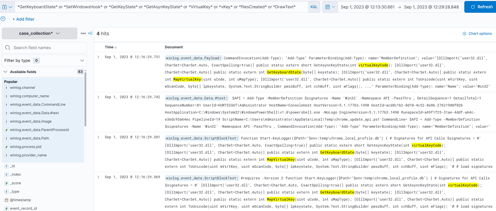

Four hits, and all of them concentrated in `Microsoft-Windows-PowerShell/Operational`. That's the first useful signal on its own: Script Block Logging is doing exactly what it's supposed to do here, exposing interpreted PowerShell content that wouldn't show up in a plain process-creation event.

Narrowing the columns to `winlog.channel`, `winlog.event_data.Path`, and `winlog.event_data.ScriptBlockText` surfaced the actual script content: a function named `Start-KeyLogger`, taking a `$Path` parameter, importing `user32.dll` for the keyboard state calls, running from a script named `chrome_update_api.ps1` under `%LOCALAPPDATA%\Temp`.

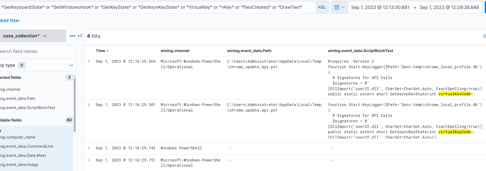

The filename is a deliberate choice on the attacker's part, `chrome_update_api.ps1` reads as legitimate browser update infrastructure to anyone scanning a process list quickly. Path over name is the correct instinct here: a script sitting in a user temp directory has no business updating anything.

From the script content I had two new artifacts to chase: the script itself, and a second file it referenced, `chrome_local_profile.db`. Pivoting on both:

```
*chrome-update_api.ps1* or *chrome_local_profile.db*
```

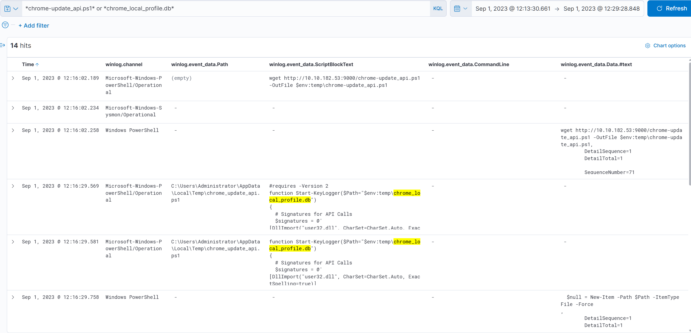

Fourteen hits confirmed the delivery mechanism: `wget` pulling the script down from `http://10.10.182.53:9000/chrome-update_api.ps1` and writing it to `$env:temp\chrome-update_api.ps1`. The second filename, `chrome_local_profile.db`, resolved to the keylogger's own output database, referenced directly in the script's `$Path` parameter.

Narrowing further to just the database file confirmed that read:

```
winlog.event_data.ScriptBlockText : "*chrome_local_profile.db*"
```

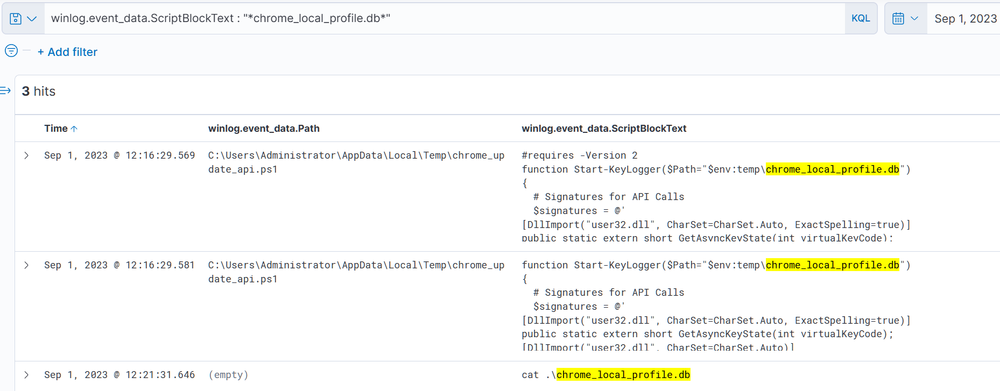

Three hits, the last of which is a plain `cat .\chrome_local_profile.db`, someone or something reading the captured keystrokes back out of the file directly on the host. That `cat` event became the pivot point. Rather than assume what came before and after it, I used Kibana's "View surrounding documents" option on that event to walk the timeline immediately around it in chronological order.

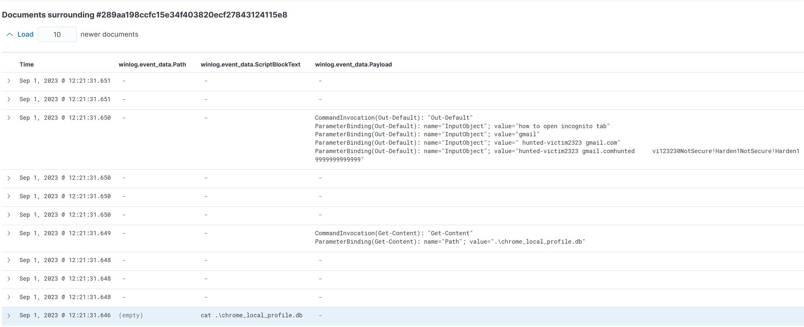

The output confirmed there was no redirection of the `cat` command to a file, meaning the content had to be visible directly in the payload of the surrounding PowerShell invocation events. Reading those events end to end reconstructed a Gmail login attempt captured in full: username, password, and the browser interaction leading up to it (searching for how to open an incognito tab first). That's a real, sensitive credential capture recovered purely from log correlation, no memory forensics or file recovery needed.

### SOC Context

This case is a good example of why file-creation and script-block visibility both matter for the same investigation. Without Script Block Logging enabled, the keylogger function itself would never have surfaced, only a generic `powershell.exe` execution with an unremarkable command line. Sysmon file-creation events (event ID 11) filtered for the same script or database name would have flagged the artifact landing on disk independently, giving a second, corroborating detection path. A production detection here should not rely on the filename `chrome_update_api.ps1`, since that's trivially changed between campaigns. Anchoring instead on the combination of Script Block Logging content matching known keylogging API calls, plus a `.ps1` executing from a user temp directory, survives a rename.

---

## Case: Exfiltration (TA0010)

### Hypothesis

A system-native tool call is being used to transfer data out of the environment, likely over a protocol that isn't typically inspected for content by perimeter defenses. ICMP is a classic choice for this precisely because most firewalls pass echo requests without deep inspection.

### Investigation

I ran a broad pattern match across a long list of native networking and transfer tools and keywords, the same approach as the Collection case: cast wide on known technique indicators before narrowing to a specific artifact.

```
*$ping* or *$ipconfig* or *$arp* or *$route* or *$telnet* or
*$tracert* or *$nslookup* or *$netstat* or *$netsh* or *$smb* or
*$smtp* or *$scp* or *$ssh* or *$wget* or *$curl* or *$certutil*
or *$nc* or *$ncat* or *$netcut* or *$socat* or *$dnscat* or
*$ngrok* or *$psfile* or *$psping* or *$tcpvcon* or *$tftp* or
*$socks* or *$Invoke-WebRequest* or *$server* or *$post* or
*$ssl* or *$encod* or *$chunk* or *$ssl*
```

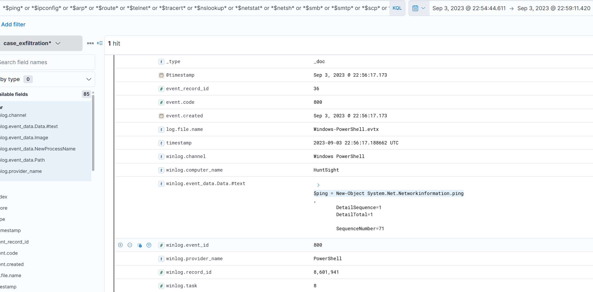

A single hit, but a telling one: `$ping = New-Object System.Net.NetworkInformation.Ping`. That's not the `ping` command, it's a .NET object being instantiated directly inside a PowerShell script, which immediately rules out a legitimate connectivity check. Nobody troubleshoots network reachability by instantiating a `Ping` class object by hand.

I pivoted straight to that class name to pull every related event:

```
*System.Net.Networkinformation.ping*
```

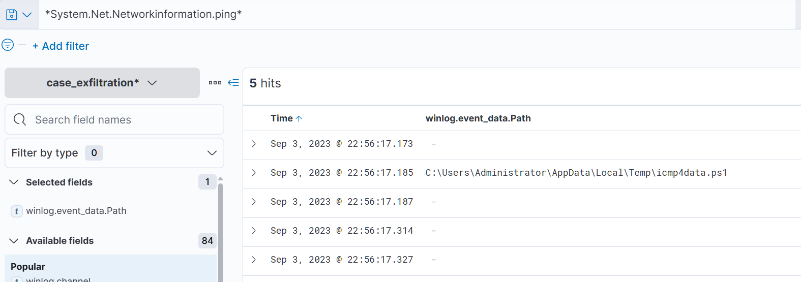

Five hits, with `winlog.event_data.Path` pointing to `icmp4data.ps1` under `%LOCALAPPDATA%\Temp`, the exact same staging directory pattern as the Collection case's `chrome_update_api.ps1`. Same temp path, different filename, same underlying tradecraft.

Expanding the query to the script name directly pulled the full picture:

```
*icmp4data.ps1*
```

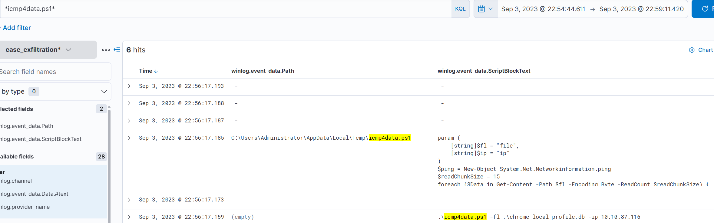

The script takes a file path and a target IP as parameters, reads the source file in fixed-size chunks via `Get-Content -ReadCount`, and sends each chunk as the payload of a `Ping` object against the destination. `$readChunkSize` is set to 15, meaning 15 bytes of stolen data are carried per ICMP echo request. The command line invocation confirmed the two values that actually matter for scoping the breach: the source file was `.\chrome_local_profile.db`, the exact keylogger database from the Collection case, and the destination was `10.10.87.116`.

### SOC Context

There's no download event for `icmp4data.ps1` visible in this case's data the way there was for the keylogger script, it appears fully formed with no prior delivery artifact in scope. That's a real limitation worth stating plainly rather than working around it: either the delivery mechanism sits outside this case's index, or the script was staged by a technique this hunt didn't cover (a dropped archive, a different living-off-the-land binary, manual placement during an earlier session). I'm not filling that gap with speculation.

From a detection standpoint, ICMP-based exfiltration is a strong argument for the same principle covered in the general playbook, don't rely on the protocol's normal function to mean the traffic is benign. A useful detection here is behavioral rather than signature-based: `powershell.exe` instantiating `System.Net.NetworkInformation.Ping` directly via reflection is itself unusual enough to alert on, independent of chunk size or destination, since almost no legitimate PowerShell workflow needs to construct that object type by hand. Payload size and request frequency on outbound ICMP are the complementary network-side signal, since legitimate ICMP traffic is short and infrequent by comparison to a chunked file transfer running at fixed intervals.

---

## Case: Impact (TA0040)

### Hypothesis

A system tool call is being used to disrupt recovery capability, most likely by removing shadow copies and neutralizing boot-time recovery options, a pattern consistent with pre-ransomware or pre-destruction staging (the same technique associated with the Olympic Destroyer campaign).

### Investigation

Starting broad again, I searched across the standard set of destructive and recovery-tampering commands:

```
*del* or *rm* or *vssadmin* or *wbadmin* or *bcdedit* or
*wevutil* or *shadow* *recovery* or *bootstatuspolicy*
```

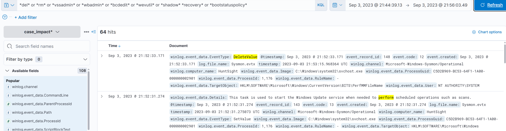

Sixty-four hits is too much to read as raw events, and several of the matched terms (`del`, `rm`, `recovery`) are common enough in ordinary system activity that a lot of this volume is expected noise, registry value deletions, routine service operations, and so on. Rather than scroll through it, I visualized the hit distribution by `winlog.channel` to decide where to spend time first.

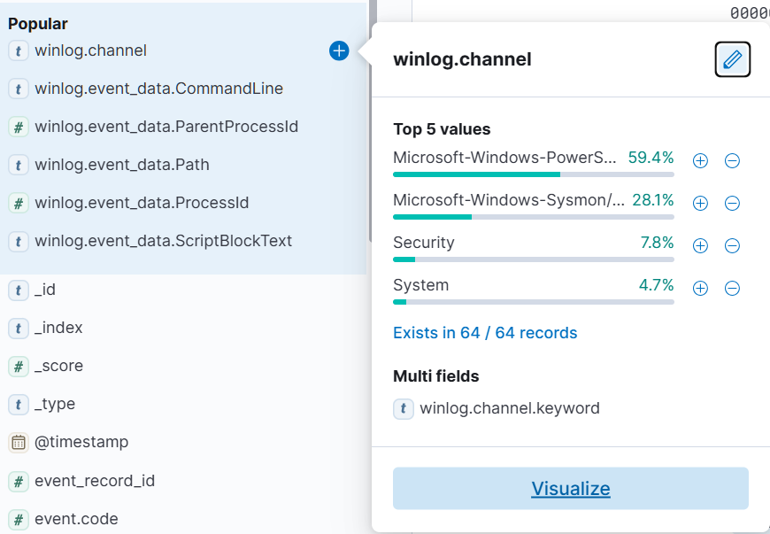

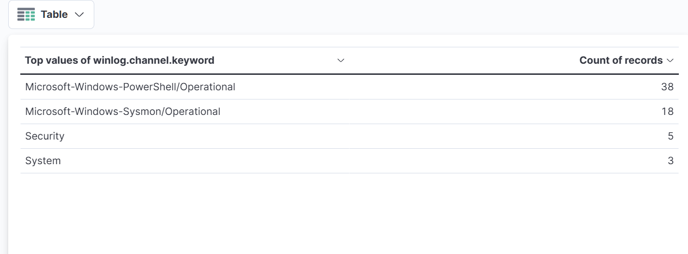

PowerShell Operational and Sysmon carried the bulk of the volume, 38 and 18 hits respectively, which tracks with how noisy those two channels tend to be given how much they log by default. Security only had 5 hits. For a hunt centered on native command-line tools rather than script content, a small, high-signal channel like Security is the better place to start, so I filtered down to it and added `winlog.event_data.ProcessId` for visibility.

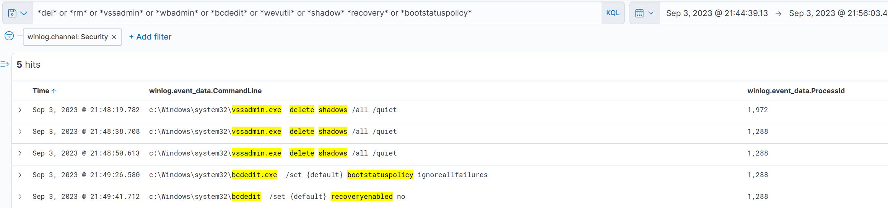

That filter resolved the case almost immediately: `vssadmin.exe delete shadows /all /quiet` fired three times in quick succession, followed by two `bcdedit` commands, one setting `bootstatuspolicy ignoreallfailures` and one setting `recoveryenabled no`. That sequence is a textbook pairing: delete the existing shadow copies first, then disable the boot recovery options that would otherwise let the system self-heal or a defender restore from a recovery point. Running both in the same short window removes two independent recovery paths at once.

The earliest of the three `vssadmin` events carried `ProcessId: 1972`, so I used that PID as the anchor to find the process that had actually launched it, searching across the full index rather than staying inside the Security log filter:

```
winlog.event_data.ProcessId : "1972"
```

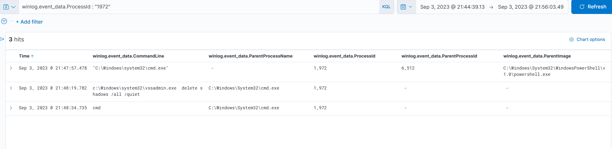

Three results laid out the full chain cleanly: `powershell.exe` (PID 6512) is the parent of `cmd.exe` (PID 1972), which is what actually executed `vssadmin.exe delete shadows /all /quiet`. PowerShell shelling out to `cmd.exe` to run a native binary rather than calling it directly isn't unusual for scripted attack tooling, and having the full three-generation chain (`powershell.exe` to `cmd.exe` to `vssadmin.exe`) documented gives a much stronger basis for attribution and blast-radius assessment than the `vssadmin` command alone would.

### SOC Context

Shadow copy deletion is one of the very few detections in this playbook that tolerates close to zero false positives. Legitimate backup software occasionally interacts with the Volume Shadow Copy Service, but scheduled backup jobs don't route through `cmd.exe delete shadows /all /quiet` chained from an interactive PowerShell parent, and they have no reason to touch `bcdedit` recovery settings in the same breath. Any alert built on `vssadmin.exe delete shadows` combined with a `bcdedit` recovery-disabling command in a short window is close to unconditionally actionable, and should be treated as high severity by default rather than triaged as a routine alert.

---

## Analyst's Note: Shared Artifact Across Collection and Exfiltration

The room presents Collection and Exfiltration as two separate case indices with no explicit statement that they're related. But the artifact name makes the link undeniable: the file exfiltrated over ICMP in the Exfiltration case, `chrome_local_profile.db`, is the exact same filename as the keylogger's output database from the Collection case. Read together, this isn't two unrelated hunts, it's one operator's full objective: capture keystrokes locally, then move the captured data out over a channel that most perimeter tooling doesn't inspect for content.

This matters for scoping a real investigation. Had these landed as two separate alerts in a live SOC, either from EDR flagging the API call pattern or from unusual ICMP payload sizes, treating them as isolated tickets would miss that they're stages of a single operation against the same victim data. The moment a filename, hash, or other artifact recurs across what look like unrelated detections, that recurrence should immediately widen the scope of the investigation to cover both, not be logged as a coincidence.

## Implications for a SOC Analyst

All three cases here share a structural lesson worth carrying forward: none of them were caught by a single alert on a single suspicious binary. Each one required starting from a behavioral hypothesis about a tactic (keylogging, exfiltration, recovery destruction) and pattern-matching across log content, not process names, to find the first thread. That's the core discipline this room is built around, and it's the same discipline that matters most on the job: attackers rename files and change infrastructure between campaigns, but the underlying technique, the API calls a keylogger has to make, the object types a native-tool exfiltration script has to instantiate, the command sequence needed to actually kill recovery options, stays stable.

The Collection and Exfiltration cases also make a strong argument for keeping Script Block Logging enabled and shipped to the SIEM wherever PowerShell is in scope. Without it, both hunts would have stalled at a generic `powershell.exe` execution event with no visibility into what the script actually did. Process-creation logging alone would not have surfaced either the keylogger function or the ICMP chunking logic.

Finally, the Impact case is a reminder that not every high-severity detection needs a complex correlation rule. Shadow copy deletion paired with recovery-option tampering is specific enough, and rare enough in legitimate activity, to justify a near-zero-tolerance alert threshold on its own. Knowing which detections deserve that kind of unconditional treatment, versus which ones need broader behavioral correlation to avoid drowning in false positives, is itself a judgment call every SOC analyst has to make deliberately rather than by default.

---