# John the Ripper : Analyse Pratique et Password Cracking

**Environnement :** Laboratoire virtuel via [TryHackMe - John the Ripper Basics](https://tryhackme.com/room/johntheripperbasics)

**Contexte :**
Dans le cadre de mon parcours de formation en cybersécurité, j'ai réalisé ce laboratoire pratique pour étudier les mécanismes d'authentification et leurs faiblesses. L'objectif était d'utiliser **John the Ripper (JtR)**, non pas pour l'attaque en soi, mais pour comprendre comment les mots de passe stockés peuvent être compromis lorsqu'ils reposent sur des algorithmes obsolètes ou des politiques de sécurité faibles.

Toutes les manipulations ont été effectuées dans un environnement isolé et contrôlé. Pour les attaques par dictionnaire, j'ai utilisé la wordlist standard `rockyou.txt`, issue d'une fuite de données réelle, afin de simuler des conditions réalistes de compromission.

## Outils et Utilitaires Utilisés
* **John the Ripper (Core)** : Moteur de cassage de mots de passe.
* **unshadow** : Fusion des fichiers `/etc/passwd` et `/etc/shadow`.
* **zip2john** : Extraction de hash d'archives .zip.
* **rar2john** : Extraction de hash d'archives .rar.
* **ssh2john** : Conversion de clés privées SSH en format hash.
* **hash-identifier** : Identification de signature d'algorithme.

---

## 1. Analyse et Cassage du Hash MD5
Le premier fichier, `hash1.txt`, contenait une chaîne hexadécimale de **32 caractères**. Cette longueur est la signature standard de l'algorithme **MD5** (128 bits). Pour confirmer cette hypothèse, j'aurais pu utiliser un outil comme `hash-identifier`, mais la longueur est un indicateur suffisant ici.

J'ai configuré John avec le format `raw-md5` pour attaquer ce hash.

**Commande exécutée :**
```bash
john --format=raw-md5 --wordlist=/usr/share/wordlists/rockyou.txt hash1.txt
```

L'outil a rapidement identifié le mot de passe "biscuit".

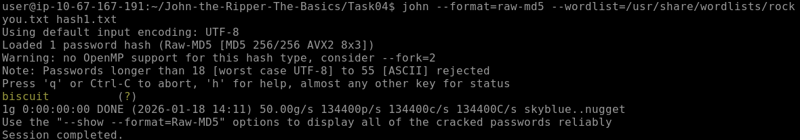

---

## 2. Analyse et Cassage du Hash SHA1
Le fichier `hash2.txt` contenait une chaîne de **40 caractères**. Une analyse de longueur indique qu'il s'agit d'un hash **SHA1** (160 bits).

J'ai adapté la commande en spécifiant le format `raw-sha1`.

**Commande exécutée :**
```bash
john --format=raw-sha1 --wordlist=/usr/share/wordlists/rockyou.txt hash2.txt
```

Le mot de passe associé, "kangeroo", a été extrait avec succès.

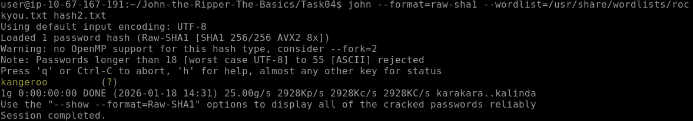

---

## 3. Analyse et Cassage du Hash SHA-256
Pour le fichier `hash3.txt`, j'ai compté **64 caractères** hexadécimaux.
Calcul : 64 caractères * 4 bits = 256 bits.
Cela correspond à l'algorithme **SHA-256**. Il s'agit d'un hash standard sans sel (salt) ni préfixe particulier.

J'ai lancé l'attaque en utilisant le format `raw-sha256`.

**Commande exécutée :**
```bash
john --format=raw-sha256 --wordlist=/usr/share/wordlists/rockyou.txt hash3.txt
```

JtR a retrouvé le mot de passe "microphone".

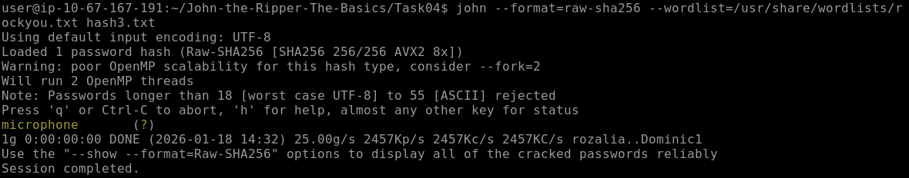

---

## 4. Analyse et Cassage du Hash Whirlpool
Le dernier fichier, `hash4.txt`, contenait une chaîne beaucoup plus longue de **128 caractères**.
Calcul : 128 caractères * 4 bits = 512 bits.

Bien que SHA-512 ait la même longueur, dans le contexte de ce laboratoire, l'algorithme **Whirlpool** était le candidat le plus probable. Whirlpool est un algorithme souvent rencontré dans les challenges CTF. Note : Ce type de hash est plus lourd à calculer (computational heavy), ce qui ralentit la vitesse de cracking par rapport au MD5.

J'ai spécifié le format `whirlpool` à John.

**Commande exécutée :**
```bash
john --format=whirlpool --wordlist=/usr/share/wordlists/rockyou.txt hash4.txt
```

Le mot de passe "colossal" a été trouvé.

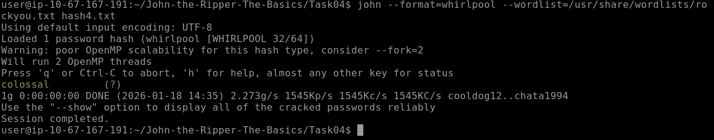

## 5. Cassage de Hash d'Authentification Windows (NTLM)

J'ai ensuite analysé un hash de type **NTLM** (New Technology LAN Manager), qui est le protocole d'authentification par défaut sur les systèmes Windows.

Une particularité de ce format est qu'il peut être structurellement très proche d'autres algorithmes (comme MD4). Sans indication précise, John the Ripper peut échouer à l'identifier correctement ou perdre du temps à tester des formats incorrects. Pour garantir le succès de l'attaque, j'ai forcé la détection en utilisant le drapeau `--format=NT`.

**Commande exécutée :**
```bash
john --format=NT --wordlist=/usr/share/wordlists/rockyou.txt ~/John-the-Ripper-The-Basics/Task05/ntlm.txt
```

Cette précision a permis d'extraire le mot de passe "mushroom" immédiatement.

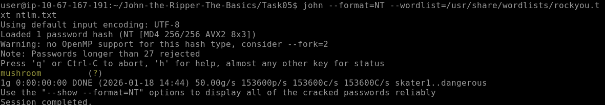

## 6. Cassage de Hashes Système Linux (/etc/shadow)

La tâche suivante consistait à récupérer le mot de passe de l'utilisateur `root` à partir de fichiers système Linux exfiltrés : `passwd` et `shadow`.

### Préparation des fichiers (Unshadowing)
Sur un système Linux, les hashes de mots de passe ne sont pas stockés dans le fichier `passwd` (qui contient les informations utilisateurs et est lisible par tous), mais dans `shadow` (lisible uniquement par root pour des raisons de sécurité). Pour que John the Ripper puisse associer correctement chaque hash à son utilisateur et utiliser le contexte complet, j'ai dû fusionner ces deux fichiers.

J'ai utilisé l'utilitaire `unshadow` pour combiner les fichiers `local_passwd` et `local_shadow` en un seul fichier traitable nommé `unshadowed.txt`.

**Commande exécutée :**
```bash
unshadow local_passwd local_shadow > unshadowed.txt
```

### Identification du Format (`$6$`)
Avant de lancer l'attaque, j'ai analysé la structure du hash dans le fichier généré. Les hashes Linux suivent le *Modular Crypt Format*. J'ai noté la présence du préfixe **`$6$`** au début de la chaîne du hash root.

Ce préfixe est un indicateur standard :
* `$1$` : MD5-Crypt
* `$6$` : SHA-512-Crypt

Il est crucial de différencier le `raw-sha512` du `sha512crypt`. Ici, le système n'a pas simplement haché le mot de passe ; il a ajouté un "Salt" (sel) aléatoire et effectué des milliers d'itérations (rounds) pour ralentir les attaques par force brute ou rainbow tables. J'ai donc spécifié le format `sha512crypt` pour indiquer à John de respecter cet algorithme de hachage système.

### Exécution de l'attaque
Une fois le fichier préparé et le format identifié, j'ai lancé l'attaque par dictionnaire.

**Commande exécutée :**
```bash
john --wordlist=/usr/share/wordlists/rockyou.txt --format=sha512crypt unshadowed.txt
```

L'outil a réussi à casser le hash et a révélé que le mot de passe root était "1234".

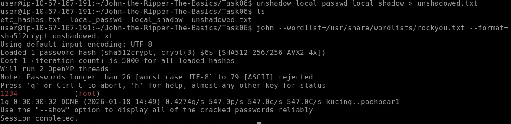

## 7. Mode "Single Crack" (Attaque Contextuelle)

J'ai ensuite exploré le mode "Single Crack". Contrairement aux attaques par dictionnaire classiques qui piochent dans une liste externe, ce mode utilise les informations contextuelles présentes dans le fichier de hash (nom d'utilisateur, commentaires GECOS, dossier personnel) pour générer des tentatives de mots de passe. C'est une méthode très efficace contre les utilisateurs qui incluent leur nom dans leur mot de passe.

### Formatage du fichier d'entrée
Le fichier initial `hash07.txt` ne contenait que le hash brut. Pour que le mode Single fonctionne, John doit connaître le nom d'utilisateur associé au hash afin d'appliquer ses règles de mutation (mangling) sur ce nom.

J'ai donc dû modifier le format du fichier pour qu'il respecte la syntaxe `utilisateur:hash`.

**Commande exécutée :**
```bash
echo "Joker:$(cat hash07.txt)" > hash07-formatted.txt
```

### Exécution de l'attaque
Une fois le fichier contextuel créé, j'ai lancé John avec le drapeau `--single`. Le hash étant un MD5 standard (32 caractères hexadécimaux), j'ai précisé le format `raw-md5`.

**Commande exécutée :**
```bash
john --single --format=raw-md5 hash07-formatted.txt
```

L'outil a pris la chaîne "Joker", lui a appliqué des règles de variation (comme le remplacement de lettres par des chiffres), et a trouvé le mot de passe "Jok3r" en une fraction de seconde.

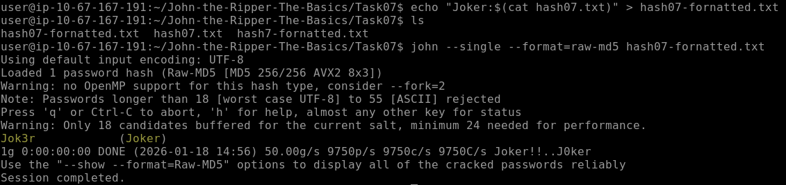

## 8. Cassage d'Archives Protégées (Zip)

Pour continuer ce laboratoire, j'ai dû récupérer le contenu d'une archive compressée `secure.zip` protégée par un mot de passe. John the Ripper ne peut pas attaquer directement un fichier binaire `.zip`. La première étape consiste donc à extraire l'empreinte cryptographique (hash) de l'archive dans un format lisible par John.

### Extraction du Hash
J'ai utilisé l'utilitaire dédié `zip2john` pour convertir le fichier ZIP en un fichier texte contenant le hash.

**Commande exécutée :**
```bash
zip2john secure.zip > zip_hash.txt
```

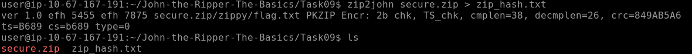

### Cassage du Mot de Passe
Une fois le hash isolé dans `zip_hash.txt`, j'ai lancé une attaque standard par dictionnaire avec `rockyou.txt`. John a détecté automatiquement le format PKZIP.

**Commande exécutée :**
```bash
john --wordlist=/usr/share/wordlists/rockyou.txt zip_hash.txt
```

Le mot de passe "pass123" a été identifié.

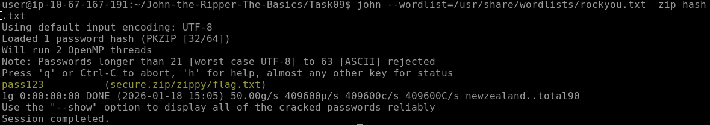

### Accès aux Données
Muni du mot de passe, j'ai pu décompresser l'archive originale et lire le contenu du fichier `flag.txt` qu'elle contenait.

**Commandes exécutées :**
```bash
unzip secure.zip
# Saisie du mot de passe "pass123"
cat zippy/flag.txt
```

Le flag final a été extrait avec succès.

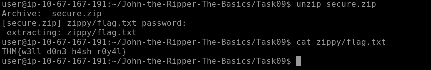

## 9. Cassage d'Archives Protégées (RAR)

Ensuite, j'ai appliqué une méthodologie similaire à celle des fichiers ZIP, mais adaptée au format propriétaire **RAR**. Comme précédemment, l'objectif était d'extraire le hash de l'archive pour le soumettre à John the Ripper.

### Extraction et Cassage
J'ai utilisé l'utilitaire `rar2john` pour convertir le fichier `secure.rar` en un format de hash exploitable.

**Commande exécutée :**
```bash
rar2john secure.rar > rar_hash.txt
```

Immédiatement après, j'ai lancé l'attaque par dictionnaire avec la wordlist `rockyou.txt`.

**Commande exécutée :**
```bash
john --wordlist=/usr/share/wordlists/rockyou.txt rar_hash.txt
```

Le mot de passe "password" a été trouvé instantanément.

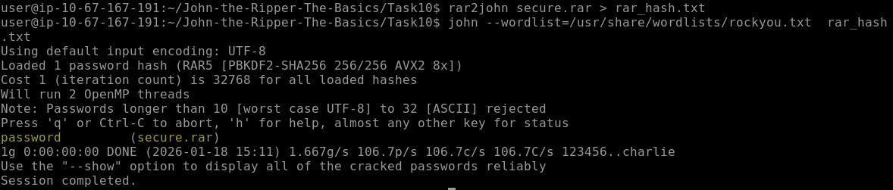

### Extraction du Flag
Avec le mot de passe en main, j'ai utilisé l'outil `unrar` pour extraire le contenu de l'archive.

**Commandes exécutées :**
```bash
unrar x secure.rar
# Saisie du mot de passe "password"
cat flag.txt
```

J'ai ainsi pu récupérer le dernier flag du laboratoire.

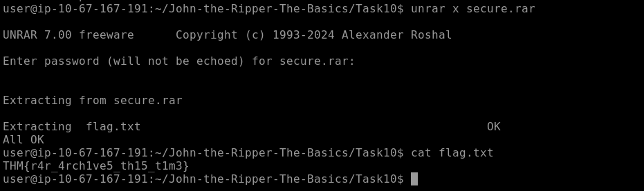

## 10. Cassage de Clés SSH Privées (id_rsa)

Pour cette étape finale, je me suis attaqué à une clé privée SSH (`id_rsa`) chiffrée. Lorsqu'une clé SSH est protégée par une "passphrase", il est impossible de l'utiliser pour s'authentifier sur un serveur distant sans connaître ce mot de passe.

### Conversion de la Clé
John the Ripper ne peut pas traiter directement le fichier de clé brute (format PEM ou OpenSSH). J'ai dû utiliser un script utilitaire spécifique écrit en Python, `ssh2john.py`, pour extraire les informations de chiffrement (le "challenge") sous forme de hash.

**Commande exécutée :**
```bash
python3 /opt/john/ssh2john.py id_rsa > ssh_hash.txt
```

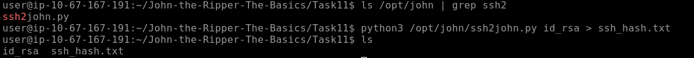

### Cassage de la Passphrase
Une fois le hash généré dans le fichier `ssh_hash.txt`, j'ai procédé à une attaque par dictionnaire classique en utilisant la liste `rockyou.txt`.

**Commande exécutée :**
```bash
john --wordlist=/usr/share/wordlists/rockyou.txt ssh_hash.txt
```

L'outil a identifié la passphrase "mango".

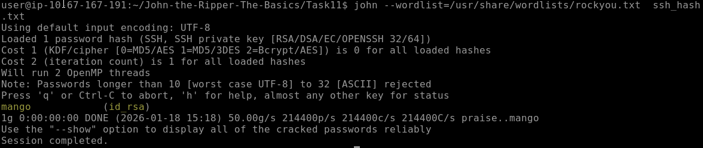

---

## 11. Analyse Critique des Mots de Passe (Audit)

Au cours de ce laboratoire, la rapidité avec laquelle les mots de passe ont été retrouvés (souvent moins d'une seconde) met en lumière deux failles critiques, indépendantes de l'outil utilisé :

1.  **La Faiblesse Humaine :** Des mots de passe comme "biscuit", "1234" ou "password" (trouvés dans les archives RAR/ZIP) sont trivialement faibles. Ils figurent dans les premières lignes de n'importe quel dictionnaire d'attaque.
2.  **L'efficacité des Dictionnaires (RockYou) :** L'utilisation de `rockyou.txt` prouve que les attaquants n'ont pas besoin de force de calcul immense pour casser des accès. Ils capitalisent sur la réutilisation de mots de passe déjà compromis. Si un mot de passe existe dans une fuite de données, il sera cassé quasi-instantanément, quel que soit l'algorithme de hachage utilisé (sauf si le salting est robuste et l'itération très élevée).

## 12. Implications Défensives (Blue Team Takeaways)

En tant qu'analyste SOC, cet exercice offensif me permet de mieux cerner les priorités défensives :

### Obsolescence des Algorithmes
L'utilisation de **MD5** et **SHA1** (vus dans les tâches 1 et 2) pour stocker des mots de passe est une vulnérabilité critique. Ces algorithmes sont conçus pour être rapides, ce qui est l'exact opposé de ce que l'on souhaite pour le stockage de preuves d'identité. Un attaquant peut tester des milliards de combinaisons par seconde sur ces formats.
* **Recommandation :** Identifier et migrer tout système legacy utilisant ces formats vers des standards robustes comme Argon2, bcrypt ou à défaut SHA-512.

### L'Importance du Salting et du Stretching
La tâche sur `/etc/shadow` a démontré l'importance du format `$6$` (SHA-512-Crypt). Contrairement aux formats "Raw" (MD5/SHA256 bruts), le système Linux ajoute un **Salt** (sel aléatoire) et effectue des milliers d'itérations (Key Stretching).
* **Impact défensif :** Cela rend les Rainbow Tables (tables pré-calculées) inutiles et ralentit considérablement l'attaque par force brute, donnant plus de temps aux équipes de défense pour détecter l'intrusion.

### Détection et Monitoring
Une activité de cassage de mot de passe comme celle-ci laisse des traces, ou est la conséquence d'une action détectable :
1.  **Exfiltration :** Pour casser les hashs `/etc/shadow` ou `id_rsa`, l'attaquant a d'abord dû lire ces fichiers. La surveillance de l'accès en lecture aux fichiers critiques (via **FIM** - File Integrity Monitoring ou **Auditd**) est la première ligne de défense.
2.  **Activité Anormale :** Si l'attaque se faisait en ligne (sur un service SSH actif) plutôt qu'hors ligne (sur un hash volé), cela générerait un volume massif d'échecs d'authentification (Event ID 4625 sur Windows, logs `auth.log` sur Linux).

## Conclusion

Ce laboratoire technique sur John the Ripper ne se limite pas à l'apprentissage d'une syntaxe de commande. Il démontre concrètement que la sécurité d'un système repose sur l'équilibre entre la robustesse technique (algorithmes lents et salés) et la politique organisationnelle (mots de passe complexes).

Pour un analyste SOC, comprendre la facilité avec laquelle des identifiants faibles sont compromis justifie l'importance critique de la détection précoce (accès aux fichiers sensibles) et renforce la nécessité d'imposer l'authentification multifacteur (MFA), qui reste le seul rempart efficace lorsque le mot de passe est inévitablement compromis.