# Building a Local SOC Lab, Part 4: Active Response Automation in Wazuh

## TL;DR

This is Part 4 of a multi-part series building a local SOC lab from scratch with Wazuh. Part 1 covered deploying the platform, agents, and Sysmon. Part 2 covered generating and reading telemetry, then building a custom dashboard. Part 3 covered File Integrity Monitoring and a custom detection rule. Part 4 covers the first genuinely active defensive capability in this lab: writing a correlation rule to detect repeated SSH login failures from the same source, then wiring Wazuh's Active Response module to automatically block that source at the firewall the moment the rule fires, proving the whole chain works by watching a live ping die and resume in real time. This closes out the series: by this point the lab has a working platform, generated and readable telemetry, a custom dashboard, File Integrity Monitoring, a custom detection rule, and now automated response, the full loop from raw log to blocked attacker.

## Environment

Same lab from Parts 1 through 3, unchanged:

- **wazuh-server**: Ubuntu 24.04 LTS Server, IP 192.168.72.128
- **Linux endpoint**: Ubuntu 24.04 LTS Server, agent name `MYDFIR-Linux`, IP 192.168.72.129
- **Windows endpoint**: Windows 10 Pro, agent name `MYDFIR-Windows`, IP 192.168.72.130
- Wazuh 4.14.7, archives enabled, Sysmon running on both endpoints

## Lab Objective

Everything built in this lab so far has been passive. Wazuh sees an event, matches it against a rule, and generates an alert, but nothing happens beyond that alert landing in a dashboard. Active Response changes that: it lets Wazuh execute a script automatically the instant a specific rule condition is met, turning the platform from a monitor into a system that can actually intervene. The objective here is narrow and concrete: detect three failed SSH login attempts from the same source IP within a two-minute window, and automatically drop all network traffic from that IP at the Linux endpoint's firewall the moment that pattern is confirmed.

## Tools and Technologies

- Wazuh Rules engine, `local_rules.xml`, correlation rules (`if_matched_sid`, `frequency`, `timeframe`, `same_source_ip`)
- Wazuh Active Response module, `<active-response>` configuration block
- `firewall-drop`, Wazuh's built-in Active Response script
- `iptables`
- PowerShell, `ssh`, `ping`

## Build Log

### Phase 1: Identifying the Need for a Custom SSH Rule

Before Wazuh can block an IP for brute-forcing, it needs a rule that actually detects brute-forcing as a pattern, not just as a string of unrelated individual events. By default, Wazuh generates a separate alert for every single failed login, but it doesn't bundle three or more of them into a single "brute force" alert on its own.

From PowerShell on the Windows VM, attempted to SSH into the Linux VM and deliberately failed the password prompt three times until locked out:

```powershell
ssh gerard@192.168.72.129
```

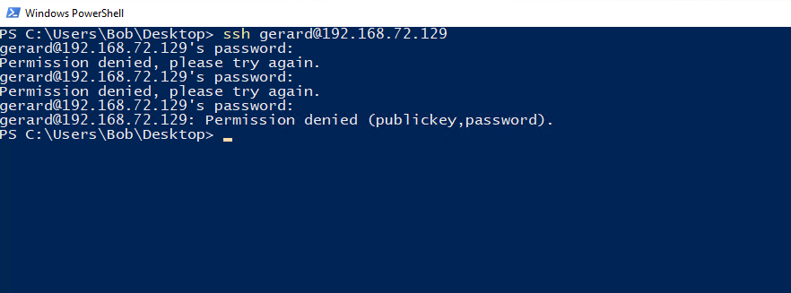

Checked the Wazuh dashboard, Discover tab, filtered to the Linux agent, last 15 minutes. Six hits came back, all individual events: a PAM login failure, three separate `sshd: authentication failed` entries, a connection reset, and a syslog note about missing the password more than once. Nothing tying these together as a single pattern.

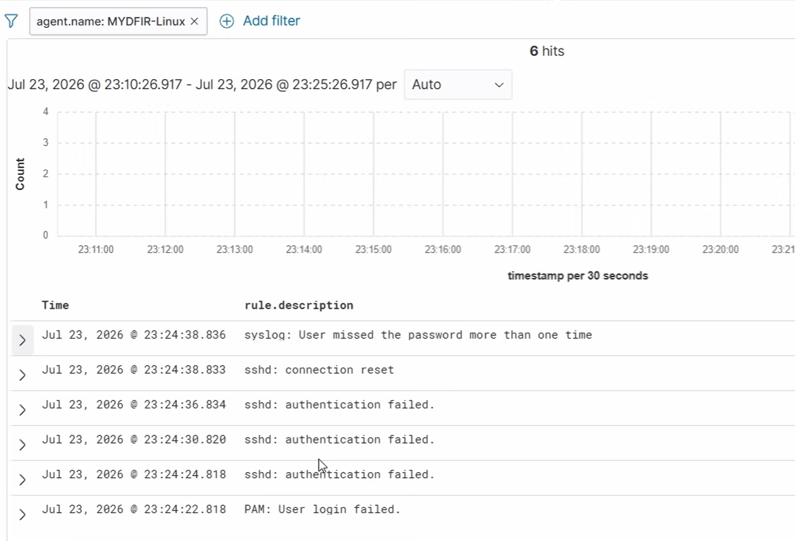

That gap is exactly what needs fixing before Active Response has anything specific to key off. A rule that fires on every single failed login would trigger the block script on one honest typo, which is not the behavior wanted here.

### Phase 2: Creating the Multiple SSH Failure Rule

In the Wazuh dashboard, hamburger menu, Server Management, Rules, Custom rules, opened `local_rules.xml`. Pasted in a correlation rule that watches for three failed logins from the same source within a two-minute window:

```xml
<group name="local,syslog,sshd,authentication_failed,">
  <rule id="100101" level="10" frequency="3" timeframe="120">
    <if_matched_sid>5760</if_matched_sid>
    <same_source_ip />
    <description>Multiple SSH login failures observed from the same source IP</description>
    <mitre>
      <id>T1110</id>
    </mitre>
    <group>authentication_failed,ssh_bruteforce,credential_access,</group>
  </rule>
</group>
```

This rule doesn't parse raw log lines at all. `<if_matched_sid>5760</if_matched_sid>` ties it to Wazuh's existing base rule for a failed SSH login, and `frequency="3"` combined with `timeframe="120"` tells Wazuh to watch for that base rule matching three times within 120 seconds. `<same_source_ip />` narrows that further, requiring all three matches to come from the same source address rather than three unrelated failures from different hosts. Only when all of that lines up does rule 100101 itself fire.

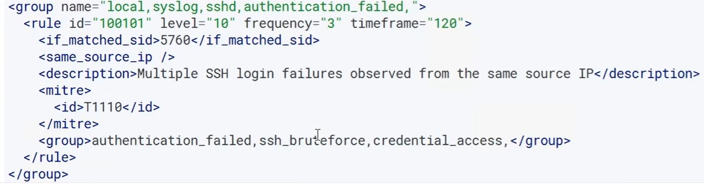

Saved and reloaded the Wazuh Manager. Went back to PowerShell and failed the SSH login three times again to test it. The dashboard now showed the new bundled alert, "Multiple SSH login failures observed from the same source IP," rule ID 100101, sitting alongside the individual events that fed into it.

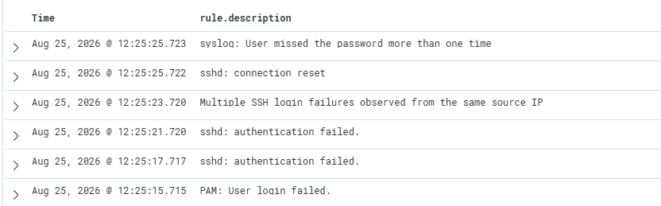

### Phase 3: Configuring Active Response on the Wazuh Server

With a specific trigger now in place, the Wazuh Manager's own configuration needs to be told exactly what to do when that trigger fires. This is a server-side change, not an agent-side one.

SSH'd into the Wazuh server itself, not either endpoint, switched to root, and opened the manager's config file:

```
sudo su -
nano /var/ossec/etc/ossec.conf
```

Scrolled past the `<syscheck>` block to the `<active-response>` section. The default config already ships with three predefined `<command>` blocks: `disable-account`, `restart-wazuh`, and `firewall-drop`, each just defining what script name maps to what executable, alongside a `<global>` whitelist protecting a few addresses (localhost and the loopback resolver) from ever being blocked by any active response.

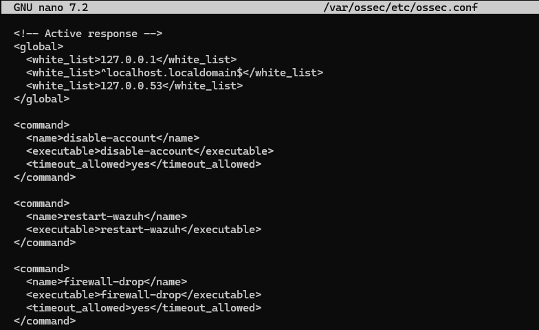

The `firewall-drop` command block was left exactly as it was, since it already defines the script needed. What actually needed adding was a separate, commented-out `<active-response>` block further down, which ties a specific command to a specific rule. Uncommented it and configured it:

```xml
<active-response>
  <disabled>no</disabled>
  <command>firewall-drop</command>
  <location>local</location>
  <rules_id>100101</rules_id>
</active-response>
```

`<disabled>no</disabled>` turns the response on. `<command>` points at the `firewall-drop` script defined earlier in the file. `<location>local</location>` is the important scoping decision here: it tells Wazuh to run the block only on the specific agent that generated the alert, in this case the Linux endpoint, rather than attempting any kind of coordinated block across the whole environment. `<rules_id>100101</rules_id>` is what actually ties this response to the correlation rule built in Phase 2, and to nothing else.

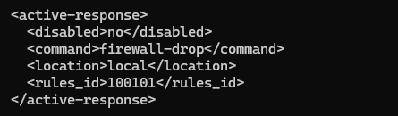

Saved the file and restarted the manager:

```
sudo systemctl restart wazuh-manager
```

### Phase 4: Verifying Active Response Is Loaded

Still root on the Wazuh server, ran the agent control tool to confirm the response actually loaded:

```
/var/ossec/bin/agent_control -L
```

The output listed `firewall-drop` as an available active response, confirming the configuration change took effect and the manager knows about the script.

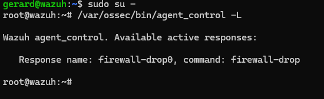

### Phase 5: Testing Active Response, the Proof of Concept

To make the block visible in real time rather than just trusting the dashboard, started a continuous ping from the Windows VM to the Linux VM before triggering anything:

```powershell
ping 192.168.72.129 -t
```

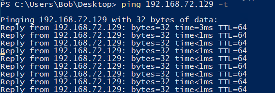

With that ping running in one window, opened a second PowerShell window and deliberately failed the SSH login three times again, the same pattern that fires rule 100101.

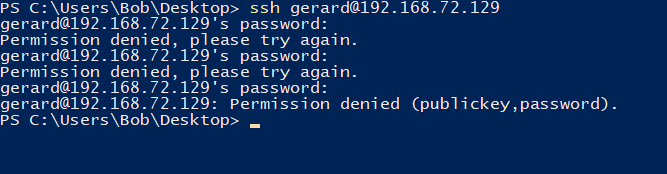

Switched back to the first window. The ping replies, which had been coming back cleanly, suddenly changed to "Request timed out." Wazuh had detected the pattern, fired the correlation rule, triggered Active Response, and the Linux endpoint's firewall had cut off the Windows VM's traffic entirely, all without any manual intervention.

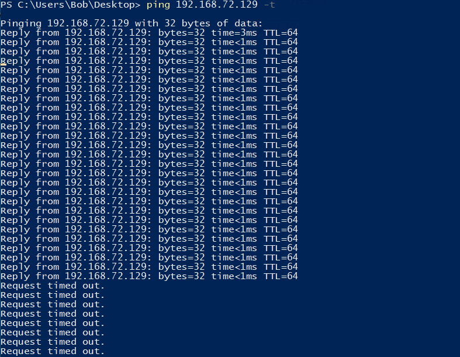

Left the ping running and checked the dashboard. Right above the brute-force correlation alert sat a new entry: "Host Blocked by firewall-drop Active Response," confirming the response script had actually executed, not just that the rule had fired.

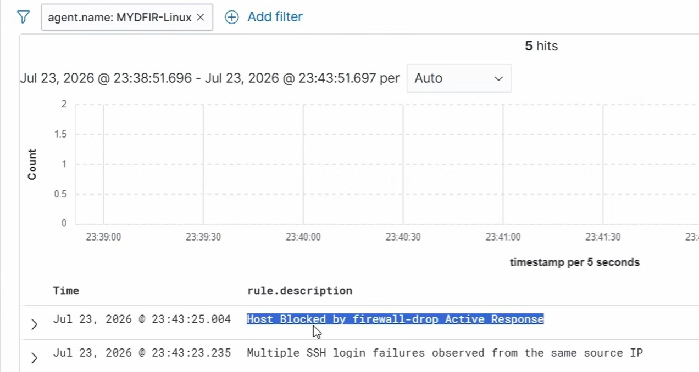

### Phase 6: Restoring Network Connectivity

The block itself is enforced by the Linux VM's own `iptables` rules, which means it needs to be removed manually, or the Windows endpoint stays cut off from the rest of this lab going forward.

SSH'd into the Linux VM directly from the host machine, since the Windows VM was now the one blocked, and listed the active firewall rules:

```
sudo iptables -L -n --line-numbers
```

The Windows VM's address, 192.168.72.130, showed up under both the INPUT and FORWARD chains with a target of DROP, at line number 1 in each.

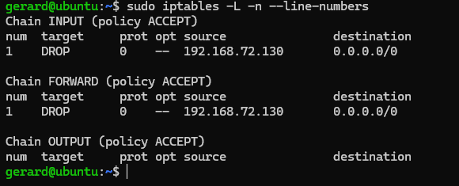

Removed both entries by chain and line number:

```
sudo iptables -D INPUT 1
sudo iptables -D FORWARD 1
sudo iptables -L -n --line-numbers
```

The follow-up listing came back with both chains empty, confirming the block was fully cleared.

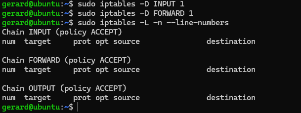

Checked the Windows VM's still-running ping window. Replies resumed immediately, confirming connectivity was restored.

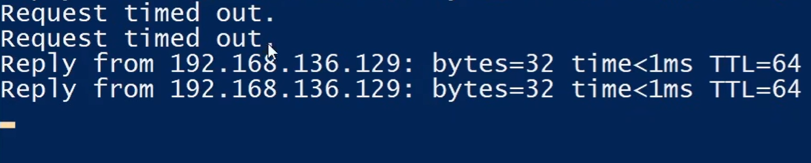

Worth flagging honestly rather than smoothing over: this final screenshot shows replies from `192.168.136.129`, not the `192.168.72.129` address used consistently everywhere else in this phase, including the ping command that produced this exact window. I don't have a confirmed explanation for the discrepancy from the data available, so I'm noting it here rather than guessing at a cause.

## Implications for a SOC Analyst

A detection rule by itself, no matter how precisely tuned, is still passive. It tells an analyst something happened, but the response still depends on a human being awake, watching, and fast enough to act before the attacker moves on. Active Response is what actually closes that gap, and the `location="local"` decision made in Phase 3 is worth sitting with rather than accepting as a default. Scoping the block to only the endpoint that generated the alert is a deliberate containment choice, not the only option, and understanding why a narrow blast radius was chosen here matters more than knowing the syntax that expresses it.

The correlation pattern behind rule 100101, riding on top of an existing base rule through `if_matched_sid` rather than parsing raw SSH logs from scratch, combined with `frequency` and `timeframe` to require a genuine pattern rather than a single event, is the actual engineering decision that makes automated response viable at all. Wiring Active Response directly to a raw "authentication failed" event would have meant an automated firewall block firing on one mistyped password, which is a self-inflicted denial of service waiting to happen. The correlation layer exists specifically to give automation something safe to act on.

Any automated containment capability is a two-way door, and this lab's own restoration phase makes that concrete. The same mechanism that blocks a genuine attacker can just as easily block a legitimate host that trips the same pattern, a forgotten password, a flaky script retrying a connection, anything that produces three failures in two minutes from one address. Building the block without also documenting and testing the rollback, in this case the exact `iptables -D` sequence needed to undo it, is building half a control. In a home lab that mostly costs a few minutes of lost connectivity. In production it can cost a legitimate user or service losing access with no clear path back until someone finds the right firewall rule to remove.

Verifying the block through an independent channel, a continuous ping running the whole time rather than only checking the dashboard's own alert stream, is a habit worth carrying forward past this lab. It's not a matter of distrusting Wazuh specifically, it's that any defensive tool can claim an action succeeded without that action actually having the intended effect downstream, and the only way to know for certain is to observe the effect somewhere the tool doesn't control. That's the same instinct behind cross-source corroboration in an investigation, just applied to confirming a response instead of confirming a finding.

---

*Part 4 of a multi-part SOC home lab series built with Wazuh 4.14. This closes the series: deployment, telemetry and dashboards, FIM and custom detection, and Active Response automation, the full loop from raw log to automated block.*