# Building a Local SOC Lab, Part 3: File Integrity Monitoring and a Custom Detection Rule in Wazuh

## TL;DR

This is Part 3 of a multi-part series building a local SOC lab from scratch with Wazuh. Part 1 covered deploying the platform, agents, and Sysmon. Part 2 covered generating and reading telemetry, then building a custom dashboard from it. Part 3 covers configuring File Integrity Monitoring on both endpoints, then writing a custom detection rule to catch the Windows Guest account being enabled, including the full debugging cycle required to get an AI-drafted rule actually matching Wazuh's internal syntax. Subsequent parts will build Active Response automation and a closing end-to-end investigation on top of what's covered here.

## Environment

Same lab from Parts 1 and 2, unchanged:

- **wazuh-server**: Ubuntu 24.04 LTS Server, IP 192.168.72.128
- **Linux endpoint**: Ubuntu 24.04 LTS Server, agent name `MYDFIR-Linux`, IP 192.168.72.129
- **Windows endpoint**: Windows 10 Pro, agent name `MYDFIR-Windows`, IP 192.168.72.130
- Wazuh 4.14.7, archives enabled, Sysmon running on both endpoints

## Lab Objective

Configure File Integrity Monitoring on a specific, non-default directory on both the Windows and Linux endpoints, generating and confirming real-time alerts when files inside it are modified or deleted. Then write a custom detection rule targeting a specific, high-value event: the Windows Guest account being enabled, an event that any legitimate admin process should almost never trigger. The rule doesn't work on the first attempt, and getting it working is as much the point of this lab as the FIM configuration itself.

## Tools and Technologies

- Wazuh Syscheck (FIM module), `<syscheck>` configuration block
- Wazuh Rules engine, `local_rules.xml`, Server Management > Rules
- Windows Computer Management, Local Users and Groups
- `nano`, Notepad, `services.msc`, `systemctl`
- ChatGPT as a rule-drafting aid
- MITRE ATT&CK mapping (T1078, Valid Accounts)

## Build Log

### Phase 1: Configuring FIM on the Windows Endpoint

Connected to the Windows VM via RDP. Created `C:\companydata`, and inside it a file named `payroll.txt` with placeholder text, something to actually watch for changes on.

Opened Notepad as Administrator and opened the Wazuh agent's `ossec.conf` at `C:\Program Files (x86)\ossec-agent\ossec.conf` (needed to switch the file type filter to "All Files" to see it, since it has no `.txt` extension). Scrolled to the `<syscheck>` section.

By default, Wazuh checks monitored files every 12 hours (43200 seconds). That's far too slow for a lab meant to demonstrate real-time detection, and too slow for production use on a directory that actually matters. The fix is the `realtime="yes"` attribute on individual `<directories>` entries, which switches that specific path to instant, event-driven monitoring instead of waiting for the next periodic scan.

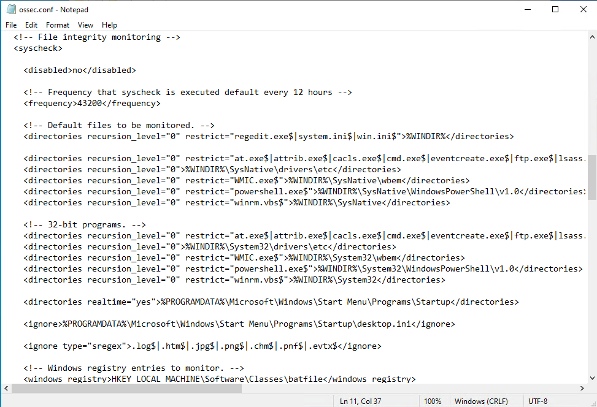

Found an existing line using `realtime="yes"`, copied its pattern, and added a new line pointing at the new folder:

```xml
<directories realtime="yes">C:\companydata</directories>
```

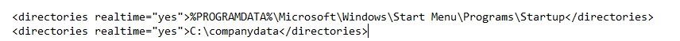

Saved the file, then opened Windows Services (`services.msc`) and restarted the Wazuh service to apply the change.

### Phase 2: Verifying Windows FIM in the Dashboard

In the Wazuh dashboard, Agent Management, Summary, selected the `mydfir-windows` agent, and opened the File Integrity Monitoring tab. Empty, as expected, since nothing had changed in the monitored path yet.

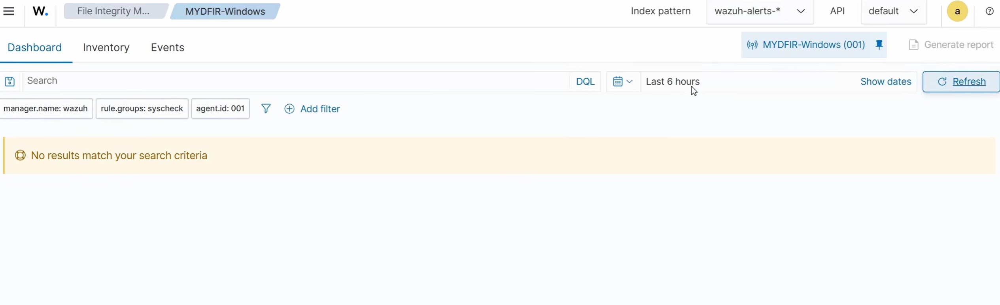

To force an alert, went back to the Windows VM and modified `payroll.txt`, appending "123" to the existing text, then saved.

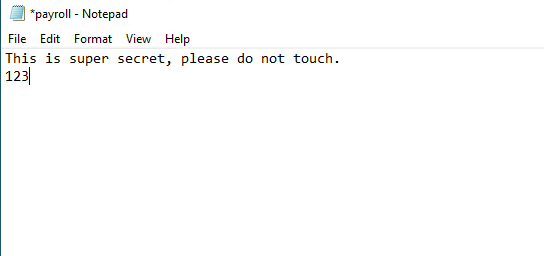

Checked the Events tab. One hit, rule 550, "Integrity checksum changed," tied to `c:\companydata\payroll.txt`.

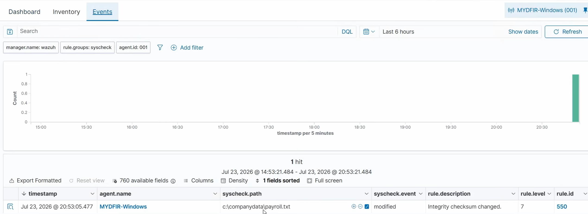

Deleted `payroll.txt` entirely. The Events tab now showed two hits: rule 553, "File deleted," alongside the earlier rule 550 modification event, both against the same path.

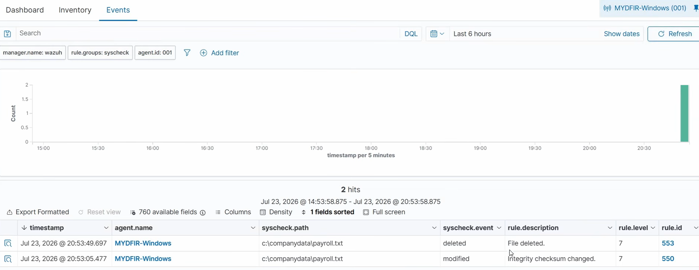

### Phase 3: Configuring FIM on the Linux Endpoint

SSH'd into the Ubuntu VM and switched to root:

```
sudo su -
mkdir /opt/company-data
echo "payroll data" > /opt/company-data/test.txt
```

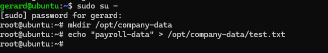

Opened the Linux agent's config directly:

```
nano /var/ossec/etc/ossec.conf
```

Scrolled to the `<syscheck>` section, same default 12-hour interval as the Windows side.

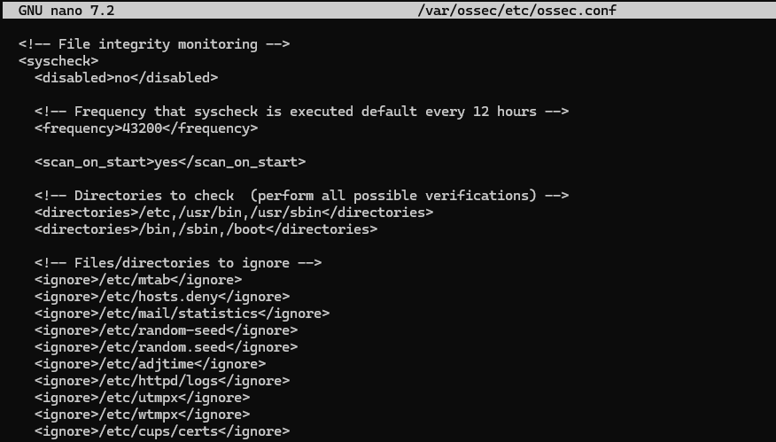

Added the real-time monitoring line for the new directory:

```xml
<directories realtime="yes">/opt/company-data</directories>
```

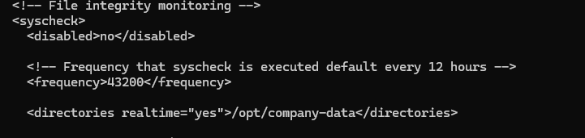

Saved (`Ctrl+X`, `Y`, `Enter`) and restarted the agent:

```
systemctl restart wazuh-agent
```

Verified by modifying `test.txt`, appending "123" to the existing content, then deleting the file entirely.

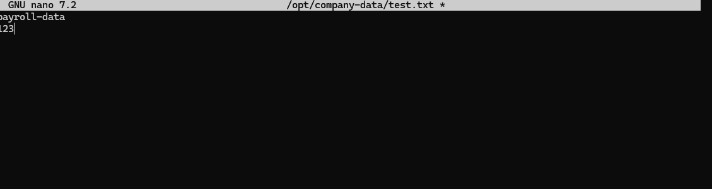

The Events tab for `MYDFIR-Linux` showed two hits, the same pairing seen on the Windows side: rule 553 (deleted) and rule 550 (modified), both against `/opt/company-data/test.txt`.

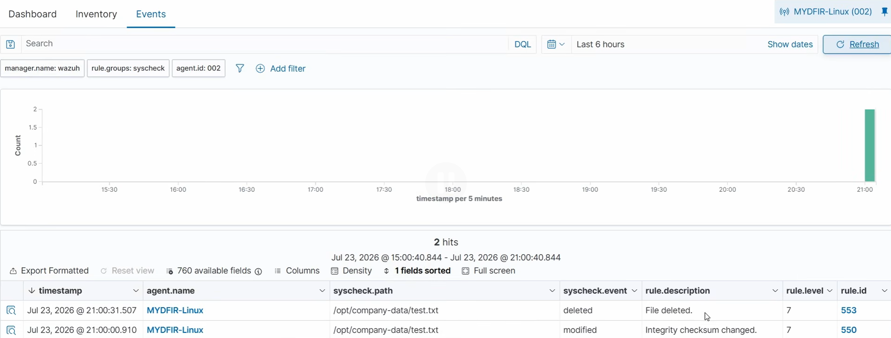

### Phase 4: Preparing the Environment for the Custom Rule

The goal for the rest of this lab is a custom rule that fires specifically when the Windows Guest account gets enabled, Event ID 4722. To generate a clean trigger for it later, the account first needs to be confirmed disabled.

On the Windows VM, went to Computer Management, Local Users and Groups, Users, right-clicked Guest, opened Properties, checked "Account is disabled," and applied.

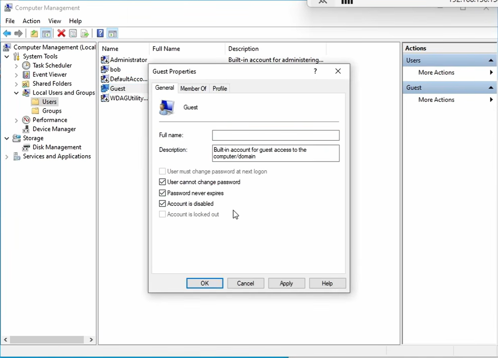

### Phase 5: Building the Detection Query

Before writing a rule, the exact fields that carry the relevant data need to be identified. Queried Discover for `Guest AND 4722`, filtered to the last 24 hours, to pull up the Guest-account-enable event generated back in Part 1 of this series.

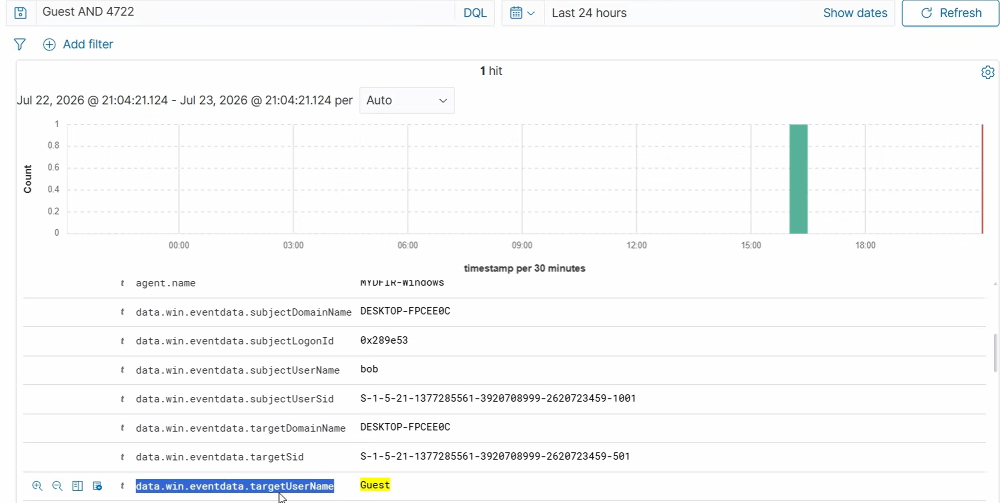

The field carrying the target account name is `data.win.eventdata.targetUserName`, holding the value `Guest`. The field carrying the event ID is `data.win.system.eventID`, holding `4722`.

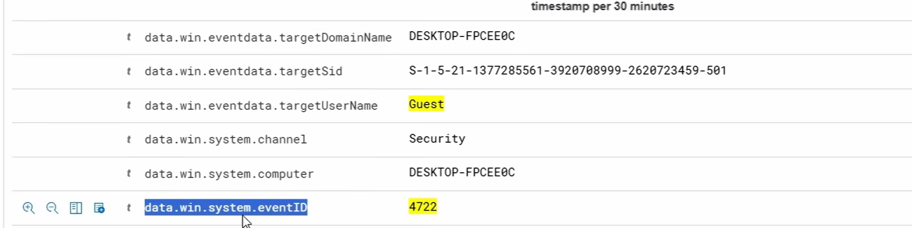

That gives the query to build the rule around:

```
data.win.eventdata.targetUserName: Guest AND data.win.system.eventID: 4722
```

### Phase 6: Writing the Custom Rule

Wazuh rules are written in XML. In the dashboard, hamburger menu, Server Management, Rules, Custom rules, opened `local_rules.xml`.

Used ChatGPT to draft a baseline rule from the query fields identified above, giving it the exact field names from Discover and a link to Wazuh's rule syntax documentation for context. AI-assisted drafting is useful for scaffolding the XML structure quickly, but it's worth treating the output as a first draft rather than a finished rule, since it tends to hallucinate field names and group names based on how data looks in a dashboard view rather than how the underlying rule engine actually expects it. The baseline that came back, rule ID 100200:

```xml
<group name="windows, security, account_management,">
  <rule id="100200" level="12">
    <field name="data.win.system.eventID">^4722$</field>
    <field name="data.win.eventdata.targetUserName">^Guest$</field>
    <description>Windows Guest account was enabled.</description>
    <mitre>
      <id>T1078</id>
    </mitre>
    <group>
      windows,
      windows_account_management,
      account_enabled,
      guest_account,
    </group>
  </rule>
</group>
```

A quick breakdown of what each part is doing: `level="12"` sets severity on Wazuh's 0 to 16 scale, with 12 landing in the "high importance" range, higher levels meaning more severe. The `<field name>` entries are strict match requirements, both conditions have to be true simultaneously, the event ID has to be exactly 4722 and the target username has to be exactly Guest. The `<mitre>` and `<group>` metadata don't affect whether the rule fires, but they matter for any other analyst reading alerts later, since they're what makes the alert self-explanatory in the dashboard rather than just a raw rule number.

Saved the file, then clicked Restart to reload the Wazuh Manager with the new rule.

### Phase 7: The Rule Doesn't Fire, Troubleshooting

Went back to the Windows VM and re-enabled the Guest account. Checked the dashboard. The custom rule didn't fire. Instead, a built-in rule triggered, "User account enabled or created," rule ID 60109, visible in `rule.description`.

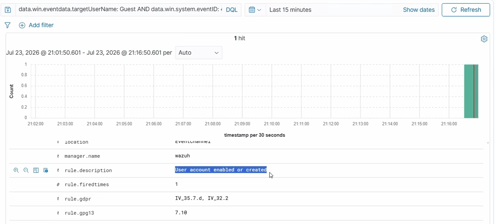

To figure out why, removed the query filter entirely and toggled `rule.description` on as a visible column to scan everything that had fired recently. Thirteen hits came back across a mix of descriptions, "User account changed," "User account enabled or created," and several Sysmon-driven process and file-drop alerts. No sign of the custom rule anywhere in the list.

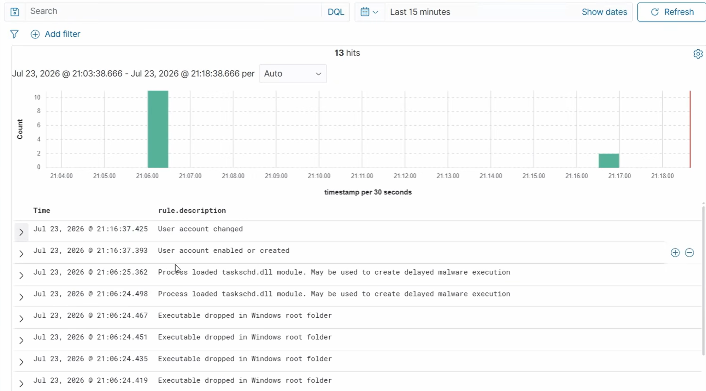

Searched directly by the custom rule's own ID from the XML, `rule.id: 100200`. No Results.

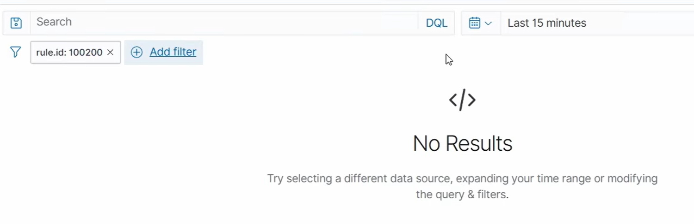

Since the custom rule wasn't firing at all, the next step was working out why the built-in rule that did fire was succeeding where the custom one wasn't. Inspected the alert that actually triggered: `rule.groups` showed three values, `windows`, `windows_security`, and `account_changed`, and `rule.id` was 60110.

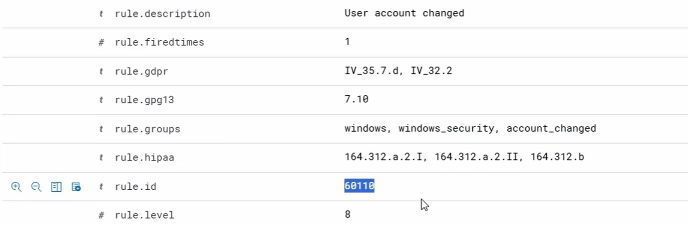

Looked up rule 60110 directly in the Rules management view: description "User account changed," the same three groups seen in the fired alert, level 8, sourced from `0580-win-security-rules.xml`.

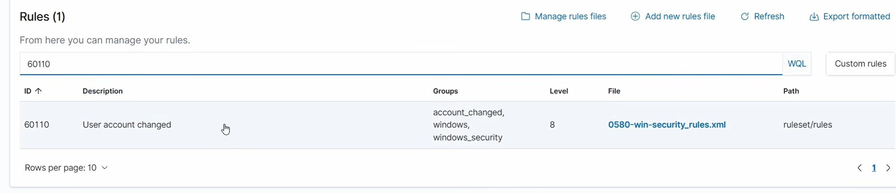

Also looked up rule 60109, the one that actually fired for the Guest-enable event: its groups included `adduser`, `account_changed`, `windows`, and `windows_security`.

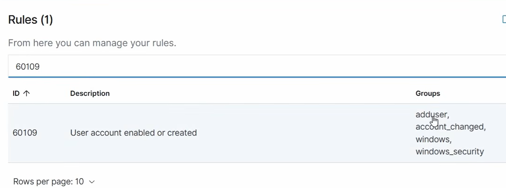

Pulled the raw XML for rule 60110 to compare structure directly against the custom draft.

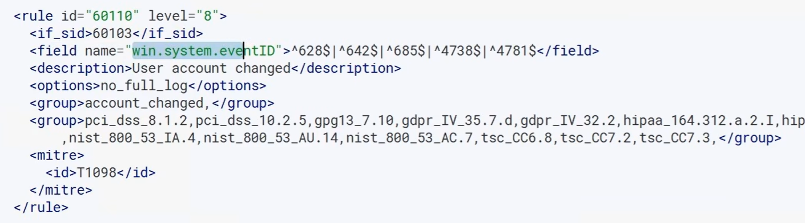

And the raw XML for rule 60109 as well, the one whose event ID list actually includes 4722.

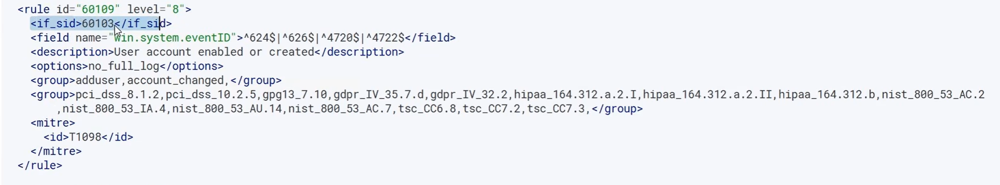

Comparing both against the custom draft surfaced the real problem, and it wasn't a single mistake, it was three compounding ones. Both built-in rules use `<if_sid>60103</if_sid>`, anchoring them to a parent rule rather than evaluating raw events cold. Both use `win.system.eventID` as the field name, with no `data.` prefix, while the AI-drafted rule used `data.win.system.eventID`, which is how the field displays in Discover but not how Wazuh's internal rule-matching engine actually expects it. And the custom rule's group list didn't overlap with `windows_security`, the group Wazuh's own classification actually relies on for this event family. Any one of these three would have been enough to keep the rule silent.

### Phase 8: Fixing and Verifying the Rule

Went back to Server Management, Rules, Custom rules, `local_rules.xml`, and corrected all three issues at once: expanded the group name to match the built-in Windows security groups, added `<if_sid>60103</if_sid>` (Wazuh's base parent rule for successful Windows audit events, ensuring the custom rule only ever evaluates events already classified as legitimate successful audit activity), and stripped the `data.` prefix from both field names.

```xml
<group name="windows, windows_security, account_changed, add_user">
  <rule id="100200" level="12">
    <if_sid>60103</if_sid>
    <field name="win.system.eventID">^4722$</field>
    <field name="win.eventdata.targetUserName">^Guest$</field>
    <description>TEST - Windows Guest account was enabled.</description>
    <mitre>
      <id>T1078</id>
    </mitre>
    <group>
      windows,
      windows_account_management,
      account_enabled,
      guest_account,
    </group>
  </rule>
</group>
```

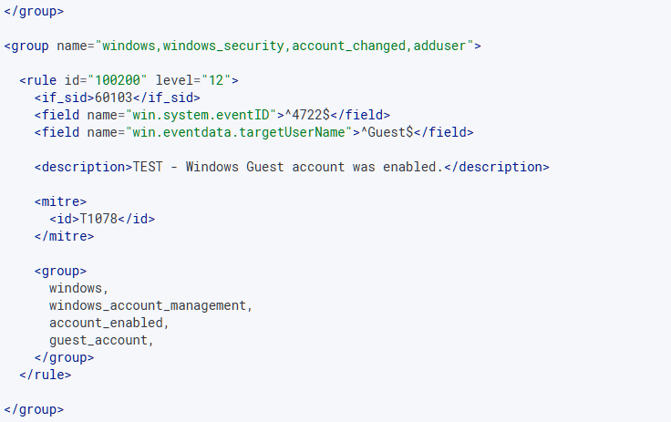

Saved, then clicked Restart to reload the Wazuh Manager with the corrected syntax.

For the final test, went back to the Windows VM, right-clicked the Guest account, disabled it, applied, and immediately re-enabled it to force a fresh 4722 event. Back in the dashboard, Discover, filtered to the last 15 minutes.

The custom rule fired correctly this time, showing the exact description set in the XML, "TEST - Windows Guest account was enabled," sitting right alongside the built-in "User account changed" and "User account disabled or deleted" events from the same sequence.

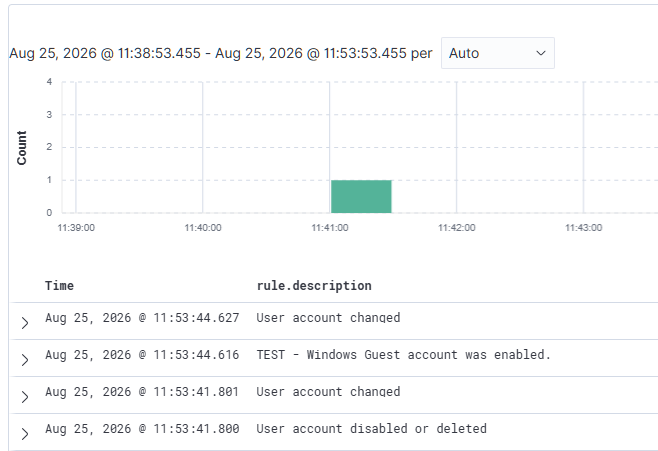

## Implications for a SOC Analyst

File Integrity Monitoring is only as useful as its scoping. Watching every directory on a host at high frequency generates unusable noise, while watching nothing means ransomware or a malicious insider can alter sensitive files with zero visibility. The `realtime="yes"` attribute on a specifically chosen, high-value directory, rather than a blanket periodic scan of the whole filesystem, is the difference between FIM as a genuinely actionable control and FIM as a box-ticking exercise nobody actually reads the alerts from.

The core lesson from the rule debugging cycle is that a dashboard's displayed field names and a detection engine's internal field names are not guaranteed to be the same thing, even when they clearly refer to the same data. `data.win.system.eventID` is completely correct as a Discover query, and completely wrong as a rule-matching field, because Discover queries against indexed document fields while the rule engine evaluates the log before that `data.` wrapper gets applied. An AI assistant drafting a rule from what it sees in a screenshot or a described query has no way to know that distinction exists unless it's told, which is exactly why the draft came back wrong in a way that looked entirely reasonable on its face.

The actual troubleshooting method here generalizes well beyond this one rule: when a custom detection silently fails to fire, the fastest path to a diagnosis isn't staring harder at the rule in isolation, it's finding a built-in rule that covers similar ground and successfully fires, then comparing the two side by side, field names, group names, and parent rule references included. The built-in ruleset is effectively a working reference implementation sitting right there in the same platform, and treating it as documentation is often faster than reading the actual documentation.

Anchoring a custom rule to a parent rule through `<if_sid>` is a detection engineering pattern worth carrying forward on its own. Rather than parsing a raw event from scratch, a child rule inherits the parent's classification work and only adds the narrower condition on top, in this case, that the already-confirmed-successful Windows audit event also happens to be a 4722 targeting the Guest account specifically. That's both more efficient, since the expensive raw parsing only happens once at the parent level, and more reliable, since the child rule can't accidentally match on an event the parent rule would have excluded for good reason.

---

*Part 3 of a multi-part SOC home lab series built with Wazuh 4.14. Part 4 covers Active Response automation.*