# Building a Local SOC Lab, Part 1: Wazuh SIEM/XDR Deployment Across Windows and Linux Endpoints

## TL;DR

This documents the first phase of a multi-part series building a local SOC lab from scratch with Wazuh. Part 1 covers standing up the Wazuh server, deploying agents to Windows and Linux endpoints, and layering Sysmon on both for process-level telemetry. Subsequent parts will build on this foundation: custom dashboards from the telemetry generated here, File Integrity Monitoring and custom detection rules, and Active Response automation.

This is a deployment log, not an investigation. There is no attacker and no alert queue to work through. What it demonstrates is the infrastructure work that has to happen before any of that is possible: getting the right logs into the right place, in the right format, from endpoints that speak two different operating systems.

## Environment

- Hypervisor: VMware Workstation Pro, three VMs running simultaneously
- **wazuh-server**: Ubuntu 24.04 LTS Server, 2 vCPU, 8 GB RAM, 100 GB disk, NAT networking, IP 192.168.72.128
- **Linux endpoint**: Ubuntu 24.04 LTS Server, 2 vCPU, 4 GB RAM, 50 GB disk, NAT, IP 192.168.72.129
- **Windows endpoint**: Windows 10 Pro, UEFI firmware, 2 vCPU, 4 GB RAM, 60 GB disk, NAT, IP 192.168.72.130
- Wazuh 4.14.7, installed all-in-one (indexer, server, and dashboard co-located on the single wazuh-server VM)

## Lab Objective

Deploy a functioning on-premises SOC lab from zero. That means a working Wazuh manager, indexer, and dashboard on Ubuntu, agents reporting in from both a Windows and a Linux endpoint, Sysmon running on both for process-level visibility, and log archiving enabled so the dashboard holds every event generated, not just the ones that happen to trip a predefined alert rule. This is the platform the rest of the series builds on. Part 2 turns this raw telemetry into dashboards, and the parts after that add detection logic and automated response.

## Tools and Technologies

- VMware Workstation Pro
- Ubuntu Server 24.04 LTS
- Windows 10 Pro
- Wazuh 4.14.7 (SIEM/XDR, all-in-one install)
- Wazuh Indexer, Wazuh Server, Wazuh Dashboard, Wazuh Agent
- Filebeat (log shipping from the manager to the indexer)
- Sysmon (Sysinternals), configuration from olafhartong/sysmon-modular
- SysmonForLinux (Microsoft), configuration from microsoft/MSTIC-Sysmon
- SSH, RDP, PowerShell, bash

## Architecture Overview

Wazuh is built on four components, and understanding what each one does saves a lot of guessing later when something isn't showing up where expected.

The **agent** sits on the endpoint (Windows, Linux, macOS, or ingested via syslog for devices that can't run one) and collects and ships telemetry back to the server. The **server** is where decoders and rules run: it takes what the agents send, parses it, checks it against threat intelligence, and decides what becomes an alert. The **indexer** is the storage and search layer, an OpenSearch-based engine that holds the alerts (and, once archiving is enabled, the raw events too) so they can be queried historically. The **dashboard** is the web interface sitting on top of the indexer, the place where hunting, compliance review, and configuration actually happen.

In this lab all four run on a single VM through the all-in-one installer. That keeps resource usage manageable on one host, though in a production deployment these would typically be split across separate machines for scale.

## Build Log

### Phase 1: Wazuh Server VM and Ubuntu Install

Created a new Custom (advanced) VM in VMware Workstation using the Ubuntu 24.04 Server ISO, named `wazuh-server`. Hardware: 2 processor cores, 8 GB RAM, NAT networking, and a new 100 GB virtual disk.

During the Ubuntu install I set the hostname to `wazuh`, the username to `gerard`, and made sure to check the box to install OpenSSH server. Skipping that box means being stuck working through the VMware console for the rest of the build, which is painful compared to a proper terminal over SSH.

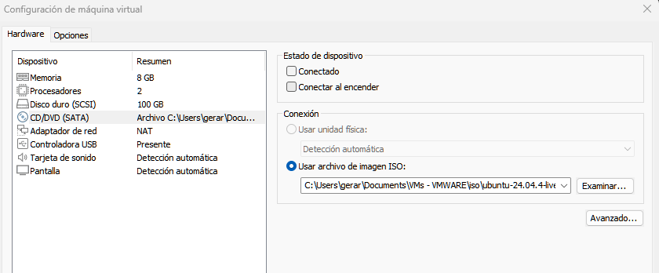

The install hung briefly on "Failed unmounting CDROM" during the post-install reboot. Pressing Enter got past it in the moment, but the actual fix is in the Troubleshooting Notes below.

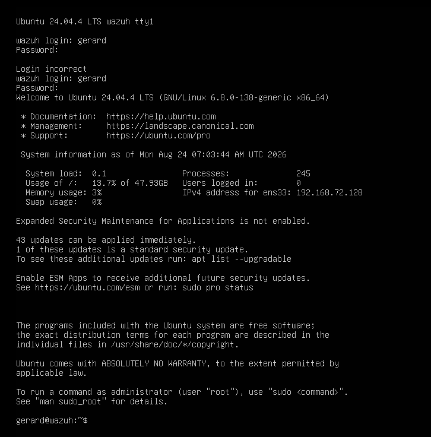

### Phase 2: SSH Access and System Update

Connected from the host machine's terminal:

```
ssh gerard@192.168.72.128
```

Then brought the system up to date before installing anything else:

```
sudo apt-get update && sudo apt-get upgrade -y
```

### Phase 3: Installing Wazuh

Wazuh's quick start install is a single command:

```
curl -sO https://packages.wazuh.com/4.14/wazuh-install.sh && sudo bash ./wazuh-install.sh -a
```

The `-a` flag runs the all-in-one install, meaning the server, indexer, and dashboard all get deployed on this one VM. Once it finishes, the terminal prints the dashboard URL, the admin username, and a generated password. These need to be copied immediately, since they only print once.

If they get missed, they're recoverable from the install files:

```
sudo su -
tar -xf wazuh-install-files.tar
cd wazuh-install-files
cat wazuh-passwords.txt
```

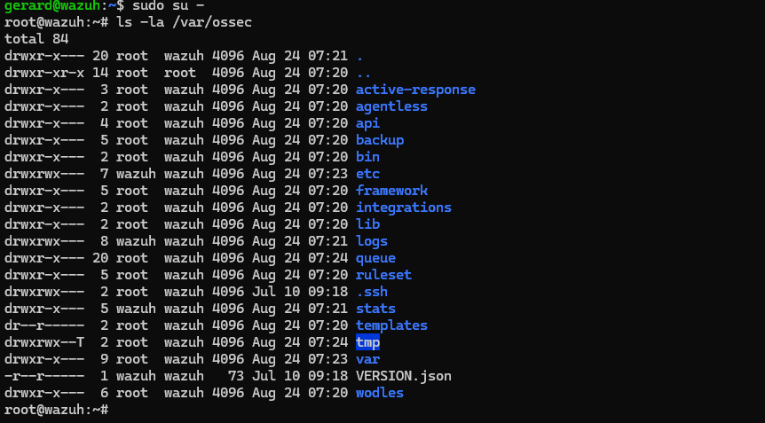

### Phase 4: Dashboard First Login

Navigated to `https://192.168.72.128` in a browser on the host machine, accepted the self-signed certificate warning, and logged in with `admin` and the generated password.

### Phase 5: Enabling Archives

By default, Wazuh only stores telemetry that triggers a predefined alert rule. An event that occurs but doesn't match any rule, a successful login, for instance, gets dropped entirely. For a lab meant to support actual hunting rather than just alert triage, that default is a problem: it means the dashboard only ever shows what Wazuh already decided was interesting, which defeats the point of hunting for what it missed.

Enabling **Archives** forces Wazuh to capture and store everything, alert-worthy or not. Editing this requires the central config file:

```
sudo su -
cd /var/ossec/etc/
nano ossec.conf
```

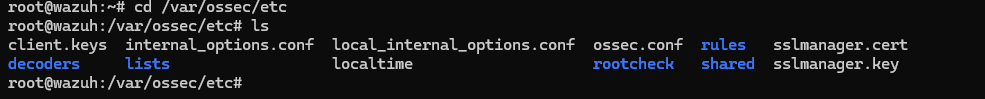

Inside the `<ossec_config>` block, both `<logall>` and `<logall_json>` default to `no`.

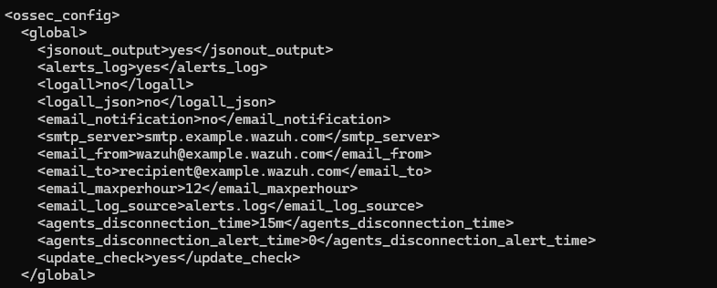

Changed both to `yes`, saved, and restarted the manager service for the change to take effect:

```
systemctl restart wazuh-manager.service
```

### Phase 6: Filebeat Configuration

Wazuh uses Filebeat to ship logs from the manager into the indexer. Enabling archives on the manager side isn't enough on its own, Filebeat also has to be told to actually forward the newly-generated archive logs.

```
cd /etc/filebeat/
nano filebeat.yml
```

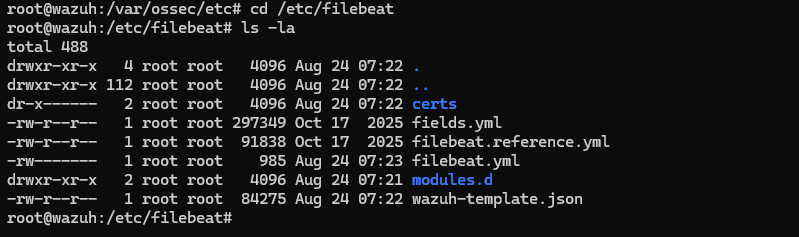

Under `filebeat.modules`, the `wazuh` module has separate `alerts` and `archives` sections. Alerts is enabled by default; archives isn't.

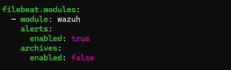

Changed `enabled: false` to `enabled: true` under archives, saved, and restarted:

```
systemctl restart filebeat.service
```

### Phase 7: Creating the Archives Index Pattern

With the manager storing archive logs and Filebeat shipping them, the dashboard still needs to know how to display them. This means creating a new index pattern.

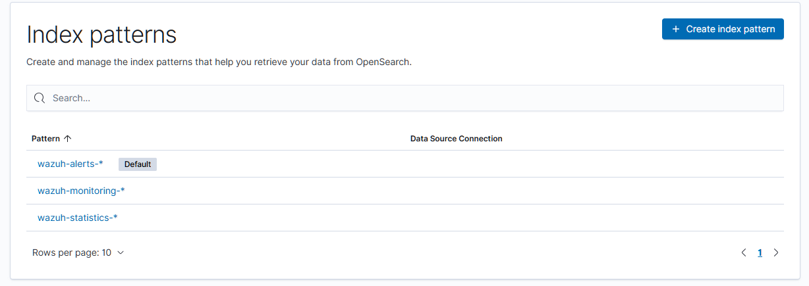

From the hamburger menu, Dashboard Management > Index Patterns > Create index pattern, typed `wazuh-archives-*`.

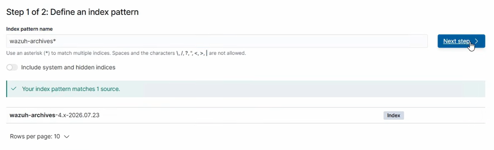

Selected `timestamp` as the time field and created the pattern. Verified by going to Discover and switching the active index to `wazuh-archives-*`, where raw events started showing up immediately.

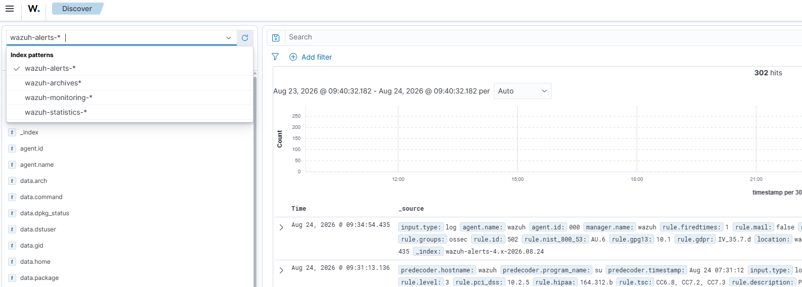

Took a VM snapshot at this point ("Wazuh Configured") as a rollback point before touching the endpoints.

### Phase 8: Endpoint VM Creation

Built the Linux endpoint first: same Ubuntu 24.04 Server ISO, 2 vCPU, 4 GB RAM, 50 GB disk, NAT networking, hostname `ubuntu`, user `gerard`, OpenSSH checked again during setup.

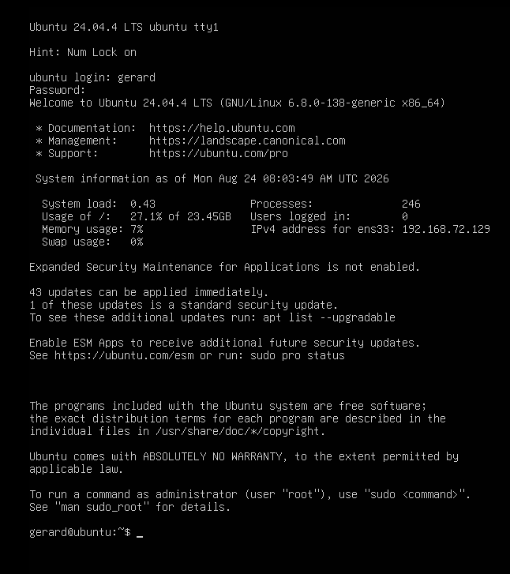

The Windows endpoint used the Windows 10 Pro ISO with UEFI firmware, 2 vCPU, 4 GB RAM, 60 GB disk, NAT. During setup I chose "I don't have a product key," Custom install, "Set up for personal use," an offline account, and the limited-experience option, with a local user named `bob`. Booting this VM hit a separate issue covered in the Troubleshooting Notes below. Once installed, I enabled Remote Desktop through Windows settings so the rest of the Windows work could happen over RDP instead of the VMware console, and confirmed the endpoint's IP as 192.168.72.130 via `ipconfig`.

### Phase 9: Windows Agent Deployment

From the dashboard, Deploy new agent, selected the Windows MSI package, set the server address to 192.168.72.128, and named the agent `MYDFIR-Windows`. The wizard generates a ready-to-run PowerShell command:

```powershell
Invoke-WebRequest -Uri https://packages.wazuh.com/4.x/windows/wazuh-agent-4.14.7-1.msi -OutFile $env:tmp\wazuh-agent; msiexec.exe /i $env:tmp\wazuh-agent /q WAZUH_MANAGER='192.168.72.128' WAZUH_AGENT_NAME='MYDFIR-Windows'
```

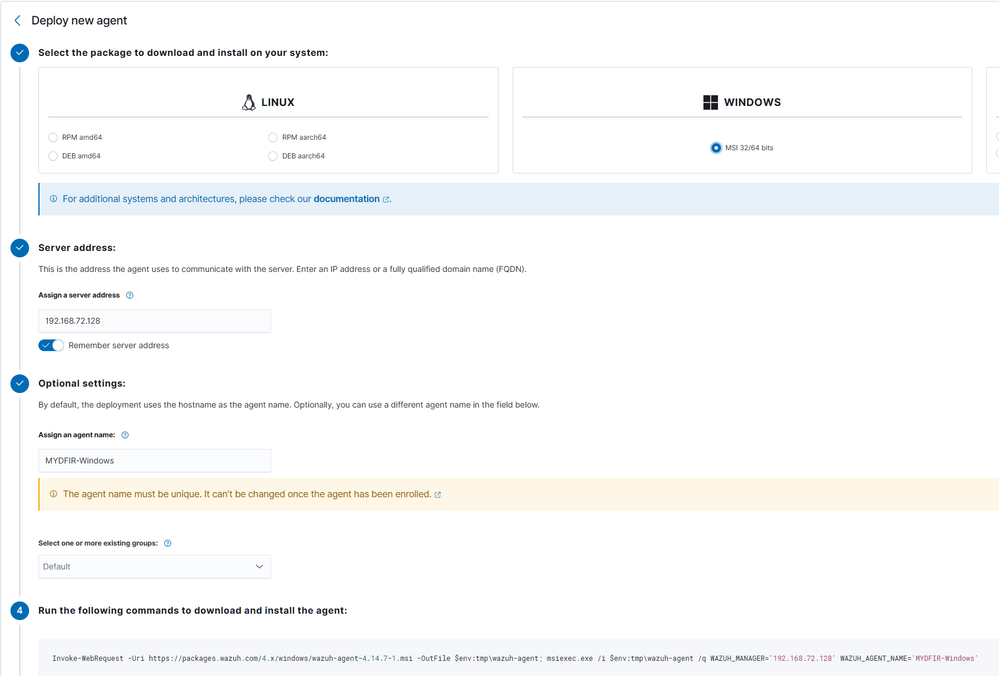

Ran this from an elevated PowerShell session over RDP into the Windows VM.

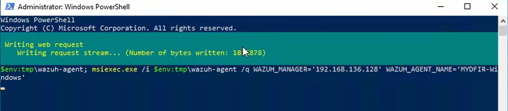

Then started the agent service:

```
NET START Wazuh
```

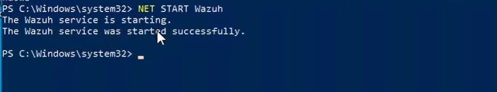

Back in the dashboard, after a brief wait and a refresh, the Windows agent showed as active.

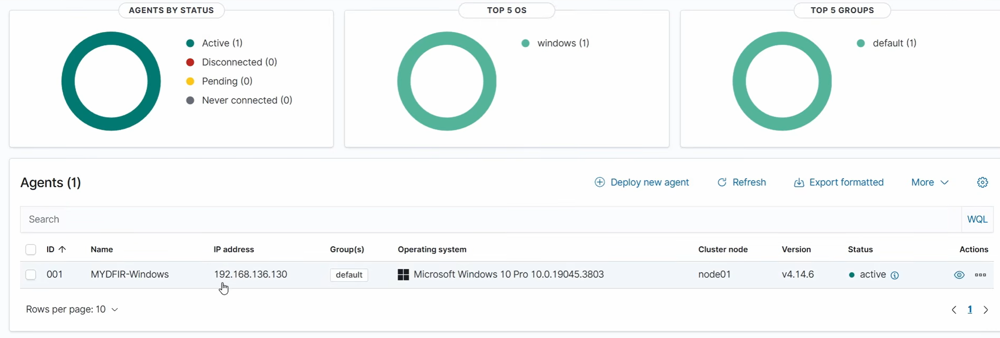

### Phase 10: Linux Agent Deployment

Same flow on the dashboard side, this time selecting Linux, Debian/Ubuntu (DEB amd64), server address 192.168.72.128, agent name `MYDFIR-Linux`.

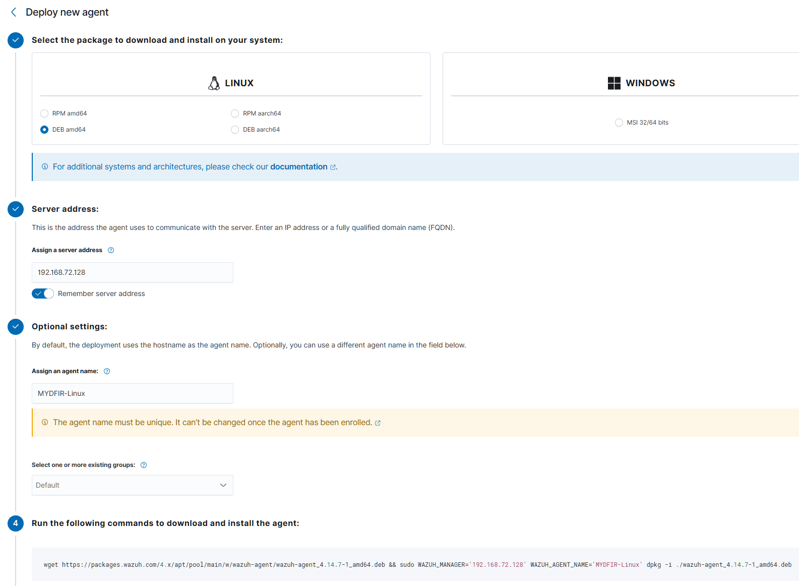

Ran the generated command over SSH into the Linux endpoint:

```
wget https://packages.wazuh.com/4.x/apt/pool/main/w/wazuh-agent/wazuh-agent_4.14.7-1_amd64.deb && sudo WAZUH_MANAGER='192.168.72.128' WAZUH_AGENT_NAME='MYDFIR-Linux' dpkg -i ./wazuh-agent_4.14.7-1_amd64.deb
```

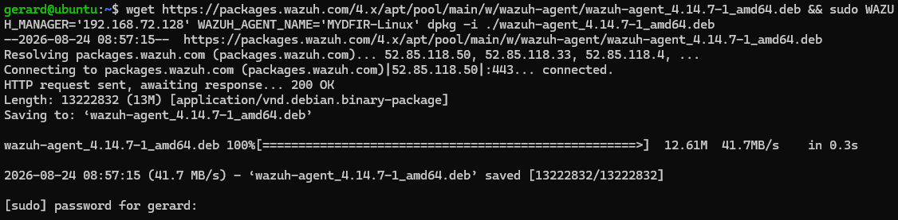

Then enabled and started the service:

```
sudo systemctl daemon-reload
sudo systemctl enable wazuh-agent
sudo systemctl start wazuh-agent
```

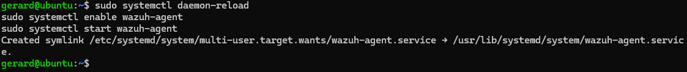

Refreshed the dashboard, both agents now active.

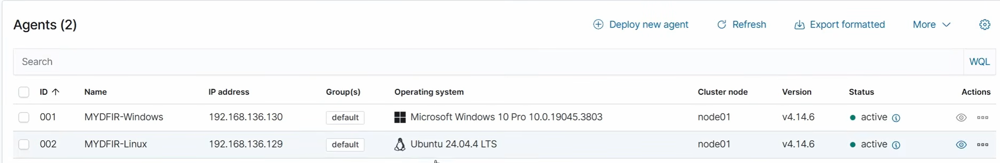

Confirmed both were actually producing telemetry by checking the `agent.name` field breakdown in Discover.

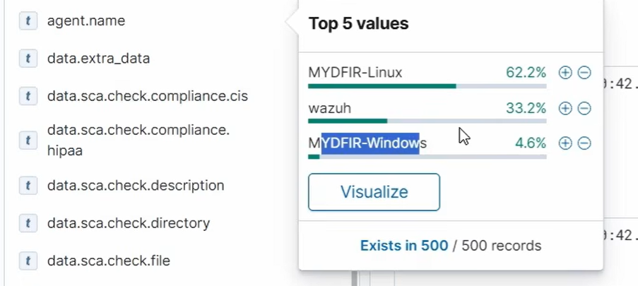

### Phase 11: Installing and Configuring Sysmon on Windows

Standard Windows and Linux logs, collected by the agent out of the box, are noisy but shallow. They don't give the process creation chains, network connection detail, or file modification granularity that a SOC actually needs to hunt with. Sysmon fills that gap.

Downloaded Sysmon from the official Sysinternals page, and separately downloaded a community configuration file, `sysmonconfig.xml` from the olafhartong/sysmon-modular repository on GitHub, since the default Sysmon config with no rules captures almost nothing useful. Extracted the Sysmon zip, dropped the config file into the same folder, then installed from an elevated PowerShell session:

```powershell
.\Sysmon64.exe -i sysmonconfig.xml
```

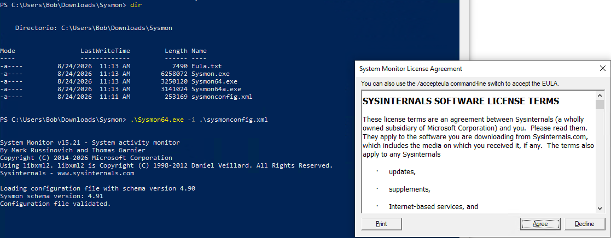

Accepted the EULA prompt, and the install completed with SysmonDrv and Sysmon64 both starting successfully.

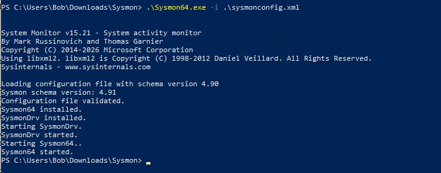

Verified in `services.msc` that the Sysmon service was running.

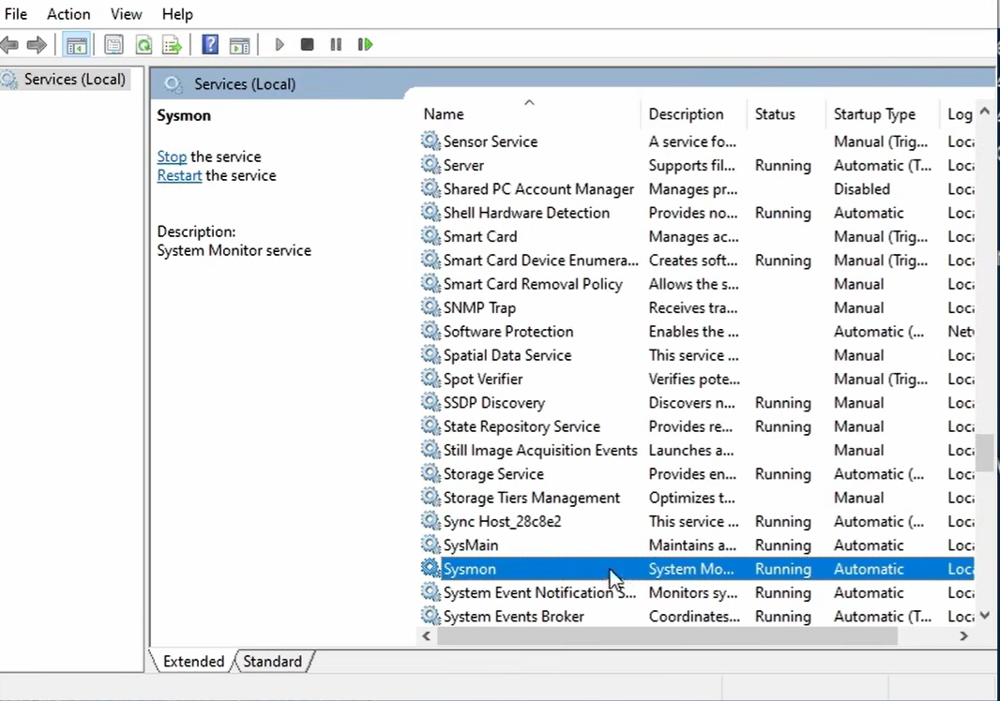

### Phase 12: Wiring Sysmon Into the Windows Wazuh Agent

Installing Sysmon on the endpoint doesn't automatically feed those logs to Wazuh. The agent has to be explicitly told where to find them, otherwise Sysmon is running and generating events that simply never leave the host.

Something worth noting before editing anything: if an agent shows as connected but no events ever appear, check the host firewall isn't blocking outbound traffic to the manager on port 1514, the port the agent uses to talk to the server. That value is visible in the agent's own config.

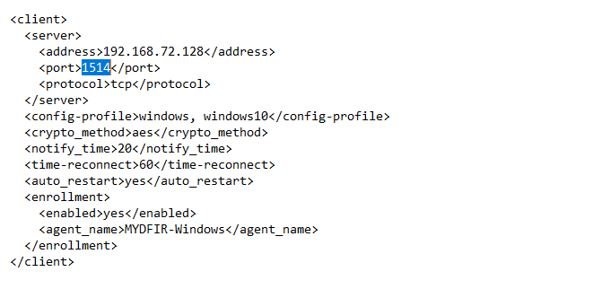

Opened Notepad as Administrator, then `C:\Program Files (x86)\ossec-agent\ossec.conf`. The `<localfile>` blocks already pull in Application, Security, and System event channels, but nothing for Sysmon.

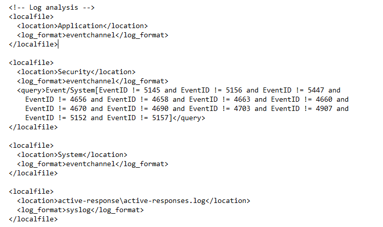

To get the exact channel name, opened Event Viewer, navigated to Applications and Services Logs > Microsoft > Windows > Sysmon > Operational, right-clicked, and checked Properties. The full name is `Microsoft-Windows-Sysmon/Operational`.

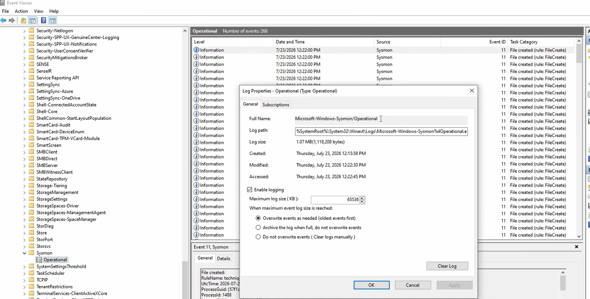

Added a new `<localfile>` block for it:

```xml
<localfile>
  <location>Microsoft-Windows-Sysmon/Operational</location>
  <log_format>eventchannel</log_format>
</localfile>
```

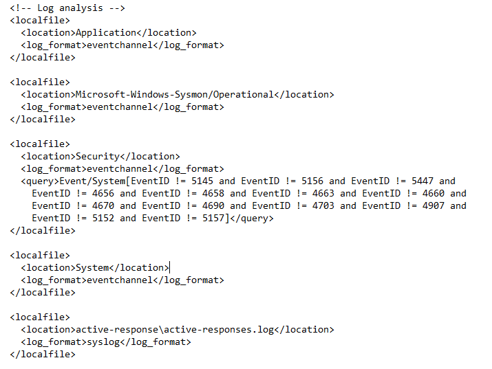

Saved the file and restarted the Wazuh service via `services.msc`. Verified in the dashboard, Discover, `wazuh-archives-*` index, querying `sysmon`: 201 hits, with Sysmon-specific fields visible in the results.

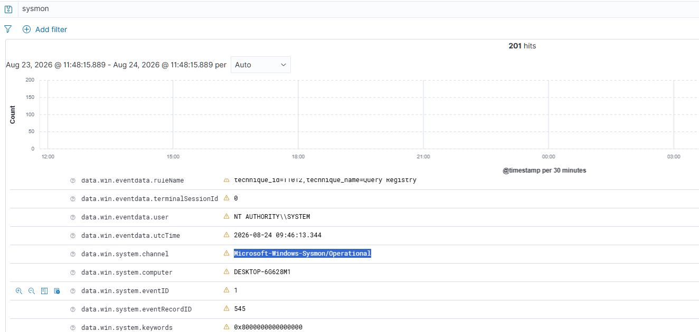

### Phase 13: Installing and Configuring Sysmon on Linux

Sysmon for Linux is a separate Microsoft project from the Windows tool, with its own package and its own configuration format. First, registered the Microsoft package feed:

```
wget -q https://packages.microsoft.com/config/ubuntu/$(lsb_release -rs)/packages-microsoft-prod.deb -O packages-microsoft-prod.deb
sudo dpkg -i packages-microsoft-prod.deb
```

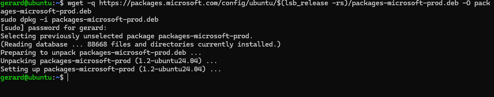

Then installed Sysmon itself:

```
sudo apt-get update && sudo apt-get install sysmonforlinux
```

Downloaded a collect-all configuration from the microsoft/MSTIC-Sysmon repository:

```
wget https://raw.githubusercontent.com/microsoft/MSTIC-Sysmon/refs/heads/main/linux/configs/collect-all.xml
```

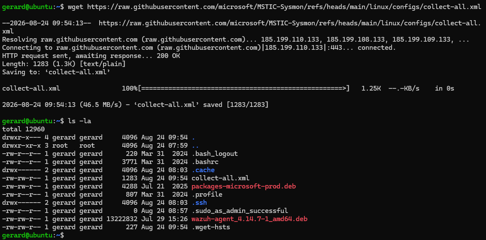

Applied it:

```
sudo sysmon -i collect-all.xml
```

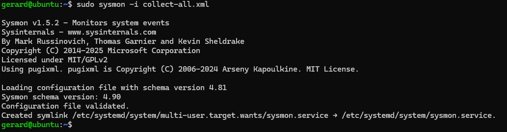

Sysmon for Linux writes to syslog rather than a dedicated event channel, so verification is a straight tail:

```
tail /var/log/syslog
```

Confirmed "Linux-Sysmon" entries were being generated.

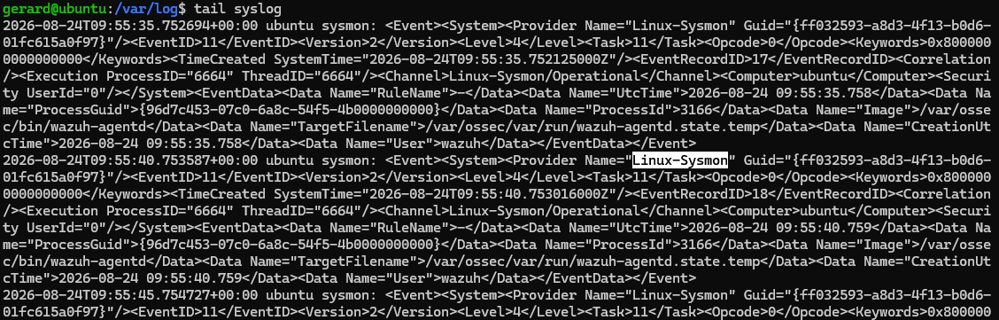

Unlike the Windows side, no separate agent config edit was needed here. The Linux Wazuh agent reads syslog by default, so once Sysmon started writing to it, the events flowed through without an additional `localfile` block.

### Phase 14: End-to-End Verification

In the dashboard, Discover, filtered by `agent.name: MYDFIR-Linux` and confirmed Sysmon telemetry was present for that host.

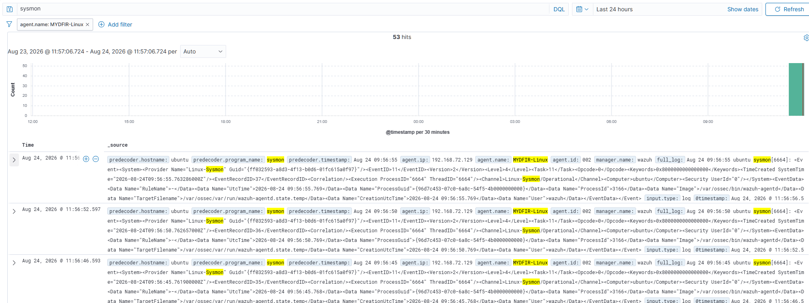

Closed the loop by running `uname` on the Linux endpoint's terminal, then searching for `uname` in the dashboard. The process execution showed up, confirming the full chain works end to end: Sysmon captures it on the endpoint, the agent ships it, the manager decodes it, and it lands in the index queryable within seconds.

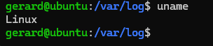

## Troubleshooting Notes

**CD/DVD unmount hang on reboot.** After the Ubuntu server install finishes and the VM reboots, it can hang on "Failed unmounting CDROM." Pressing Enter gets past it in the moment, but it recurs on every subsequent reboot unless the underlying cause is fixed: the installer ISO stays mounted as a virtual optical drive. The actual fix is going to VM Settings, CD/DVD, and unchecking "Connect at power on."

**EFI boot race on the Windows VM.** Booting a Windows ISO on a UEFI virtual machine briefly flashes "Press any key to boot from CD or DVD..." for only a couple of seconds. Missing that window means the VM assumes no boot from the ISO is wanted, skips the optical drive, finds an empty virtual disk, and falls back to a network boot that times out with an error. The fix is clicking inside the VM console the instant it starts powering on and tapping the spacebar repeatedly until the Windows logo appears.

**Port 1514 blocked by the endpoint firewall.** An agent can show as connected in the Wazuh dashboard while still sending zero events, which looks like an agent misconfiguration but usually isn't. The more likely cause is a host firewall rule blocking outbound traffic to the manager on port 1514, the port the agent uses for its connection (visible in the agent's own `ossec.conf` under `<client><server>`). Checking connectivity on that port first is faster than re-walking the agent install.

## Implications for a SOC Analyst

Log completeness is a decision, not a default, and this build made that concrete rather than abstract. Wazuh ships with archiving off, which means out of the box the dashboard only shows what its own rule set already decided mattered. That's fine for alert triage, but it's the wrong posture for hunting. A hunter needs the events that never got flagged, because that's exactly where a technique nobody's written a rule for yet is hiding. Enabling archives is a small configuration change, but it's the difference between a platform that tells you what it already knows and one you can actually interrogate.

Sysmon deployment translates "something happened" into "a specific process did a specific thing," and doing it across two operating systems in the same lab showed how differently that translation works depending on the OS. On Windows, Sysmon writes to its own event channel, and the agent needs an explicit `localfile` block naming that channel before any of it reaches the dashboard. On Linux, Sysmon writes to syslog, which the agent already reads by default, so no extra wiring was needed. Two tools with the same name and the same underlying purpose, but different integration paths. Assuming one config style works for both platforms is a fast way to end up with an endpoint that looks instrumented and isn't.

That Windows config edit is also a reminder that agent configuration is itself a detection surface, in the same way a badly-scoped SPL query is. If the `localfile` block for Sysmon had never been added, nothing downstream would ever have surfaced that telemetry, no matter how good the eventual detection rules were. And the failure mode is silent: the agent still shows as active, the dashboard still returns results for other queries, nothing throws an error. It just looks like there's nothing to find, when the reality is there's nothing being collected. That distinction, no findings versus no visibility, matters just as much in a home lab as it does walking into an unfamiliar SIEM on the job. The first question in either case should be what's actually being ingested, not what the rules are currently alerting on.

This build is the floor the rest of the series stands on. Part 2 turns the raw telemetry generated here into dashboards built around it. From there, FIM and custom detection rules, and active response automation, will all depend on the agents, the archiving, and the Sysmon visibility configured in this part actually being correct. Any gap left here doesn't show up until much later, usually as a hunt that comes up empty for reasons that have nothing to do with the hunt itself.

---

*Part 1 of a multi-part SOC home lab series built with Wazuh 4.14. Part 2 covers custom dashboard creation from the telemetry generated here.*